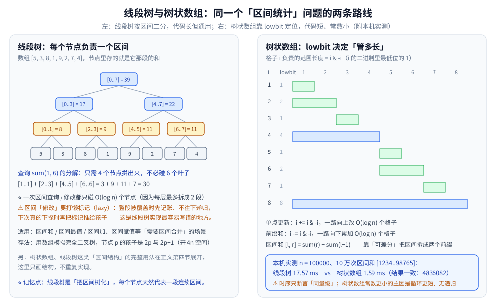
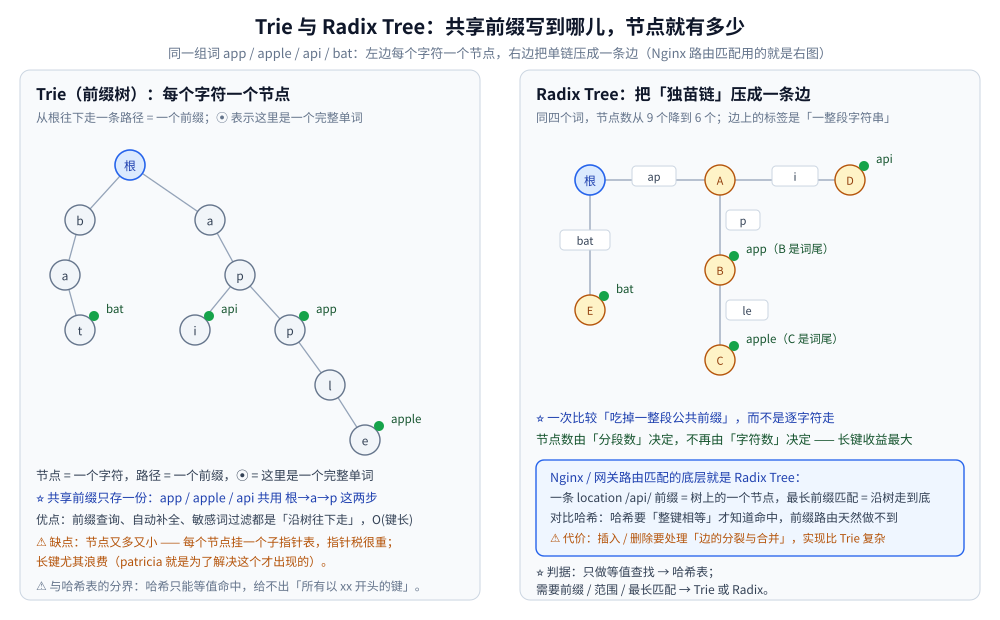

# 区间与索引树

> 「区间统计」这条主线的四个结构：**线段树、树状数组、区间合并、Trie / Radix**，
> 回答「前缀和已经 O(1) 了为什么还要它们」「为什么网关路由用 Radix 而不是哈希」。
>
> ⭐ 边界先说清：本篇讲**区间与前缀类结构的能力与代价**。Trie 的完整实现与用法见
> [Trie.md](Trie.md)（本篇只讲 Radix 的压缩思路与路由用途）；
> 「需要按序删除 / 第 K 大」时该换平衡树，见 [平衡树.md](平衡树.md)。
>
> 内容整理自个人学习笔记，素材见 [素材清单](../../../素材清单.md)。
>
> 📎 本篇输出均为本机**容器**实跑逐字抄录：**Go 1.26.8（linux/amd64，`golang:1.26-alpine`）**。
> ⚠️ 随机数组同样来自「固定 seed 的本地随机源」（Go ≥ 1.24 的 `rand.Seed` 已不再影响全局随机源）；**一致性自检的结果值整篇重跑相同**，耗时数字只作量级参考。
>
> ✅ **实测口径**：`n = 100000` 的随机数组，区间和查询 `[1234..98765]` 重复 100000 次；
> 线段树与树状数组各实现一份。可整篇重跑，**结果值不变**（耗时会有波动）。

---

## 一、区间统计为什么不能只靠前缀和？

**本节要点**：前缀和把「区间和」压到 `O(1)`，代价是**单点修改变 `O(n)`**。
区间结构要的是「查询与修改**都**是 `O(log n)`」—— 它买的是**均衡**，不是单点最优。

| 做法 | 区间查询 | 单点修改 | 区间修改 | 适用 |
|---|---|---|---|---|
| **朴素遍历** | `O(n)` | `O(1)` | `O(n)` | 数据量小、几乎不改 |
| **前缀和** | **`O(1)`** | `O(n)` | `O(n)` | **只读**、频繁查区间和 |
| **差分数组** | `O(n)` | `O(1)` | **`O(1)`** | **只写**、最后统一查询 |
| **线段树 / 树状数组** | `O(log n)` | `O(log n)` | `O(log n)`（线段树） | 读写都要、且量大 |

⭐ **一句话判据**：**只有读 → 前缀和；只有写 → 差分；读写交错 → 线段树 / 树状数组。**
⚠️ 前三行的复杂度是「一维压倒另一维」，只有区间结构是把两边都摊平 —— 这是它存在的唯一理由。

---

## 二、线段树怎么把区间"树化"？

**本节要点**：把数组**递归二分**，每个节点代表一段**连续区间**并保存这段的聚合值。
于是「任一区间」都能被拆成 `O(log n)` 个节点，查询与修改都只需碰这些节点。

### 2.1 结构：节点即区间

以 8 个元素为例：根管 `[0..7]`，左右孩子各管一半，直到单元素叶子。
⭐ 由于每次**恰好二等分**，线段树是一棵**完全二叉树**（形状固定），因此可以**用数组模拟**：
节点 `p` 的孩子是 `2p` 与 `2p+1`，开 `4n` 空间足够。

### 2.2 区间查询为什么只需 O(log n) 个节点

**论证（每层最多拆成两段）**：查询区间 `[l, r]` 与某个节点区间的关系只有三种 ——
完全覆盖、完全不相交、部分重叠。

- **完全覆盖**：直接用该节点的聚合值，**不再下探**（这一步就是收益来源）；
- **完全不相交**：整棵子树跳过；
- **部分重叠**：继续往两个孩子递归。

⭐ 关键不变量：**每一层里，"部分重叠"的节点最多只有 2 个**（左右各一个边界）。
所以整棵树上真正"分叉"的节点数是 `O(log n)`，其余全是"整段拿走"。∎

**本机实测**（区间和 `[1..6]` 的分解）：

```text
数组 [5, 3, 8, 1, 9, 2, 7, 4]
查询 sum(1, 6) 的分解：[1..1] + [2..3] + [4..5] + [6..6]
                     = 3 + 9 + 11 + 7 = 30
```

### 2.3 懒标记：区间修改的关键，也是最容易写错的地方

若要把 `[l, r]` 整段加 5，逐个下探到叶子就退化成 `O(n)`。做法是**打懒标记（lazy）**：

1. 整段被覆盖时 → **先记账**（在该节点上打一个"待处理增量"），**不往下递归**；
2. 以后真的需要下探这个节点时 → 再把标记**推给两个孩子**，然后清空自己的标记。

⚠️ **三处经典坑**：

| 坑 | 现象 |
|---|---|
| 忘记下推标记 | 查询结果偏小（子节点的值没被更新） |
| 下推后忘记清空 | 同一个增量被重复累加，结果偏大 |
| 更新时忘记**合成本节点的新值** | 整段覆盖的节点值没变，查询直接用到旧值 |

⭐ 判据：**"覆盖就打标记并更新本节点聚合值，下探就先下推"** —— 三处都对才自洽。

**适用**：区间求和 / 区间最值 / 区间加 / 区间赋值，凡「聚合操作满足结合律」的场景都能上。

---

## 三、树状数组靠 lowbit 省掉了什么？

**本节要点**：线段树是**显式建树**；树状数组发现 —— 完全二叉树里**很多节点是多余的**。
它只保留"能覆盖全部前缀"的那一撮节点，用 `lowbit` 直接算出管辖范围，代码因此短到十几行。

### 3.1 lowbit = i & (-i) 的含义

**`lowbit(i) = i & ‎-‎i`** 取的是 `i` 的二进制里**最低位的 1** 所代表的值。
它恰好等于**节点 `i` 管辖的区间长度**（本机实测）：

```text
[lowbit] 树状数组的「管辖长度」= lowbit(i) = i & -i
  i     二进制   lowbit   管辖区间
  1         1      1   [1..1]
  2        10      2   [1..2]
  3        11      1   [3..3]
  4       100      4   [1..4]
  5       101      1   [5..5]
  6       110      2   [5..6]
  7       111      1   [7..7]
  8      1000      8   [1..8]
```

⭐ **读法**：`lowbit` 越大，这个节点"管得越宽"（`i = 8` 一个节点就管了 `[1..8]`）。
`x & -x` 的位运算原理见 [位运算.md](../../算法/基础算法/位运算.md)。

### 3.2 两个方向的跳转

| 操作 | 跳法 | 含义 |
|---|---|---|
| **单点更新** | `i += i & -i`（往上跳） | 找出「所有包含位置 `i` 的节点」，逐个更新 |
| **前缀和 `[1..i]`** | `i -= i & -i`（往下跳） | 把 `i` 的管辖区间不断"摘下来"累加 |

⭐ 两个方向的跳转次数都是 `O(log n)`（每次至少消掉一个二进制位）。

**区间和**：`sum(l, r) = prefix(r) − prefix(l−1)` —— 靠「可差分」把区间拆成两个前缀。

### 3.3 实测：与线段树的对照

```text
[建树] n=100000  线段树 5.47 ms   树状数组 1.65 ms
[查询] 100000 次区间和 [1234..98765]  线段树 17.57 ms   树状数组 1.59 ms
[一致性自检] 两者结果相同: true（线段树 4835082 / 树状数组 4835082）
```

**读法**：

- ⭐ **一致性自检最重要** —— 两份独立实现给出**同一个结果**（4835082），说明两者都算对了；只看耗时无法判断正确性；
- 树状数组常数明显更小：**代码更短、无递归、循环体更轻**；
- ⚠️ 耗时数字随机器波动，**只断言「同为 `O(log n)`、树状数组常数更小」**，不要引用具体毫秒做结论。

### 3.4 能力边界：只支持「可差分」的运算

树状数组的区间查询依赖 `prefix(r) − prefix(l−1)`，所以**只有支持"减法"（可逆合并）的运算能用**：

| 运算 | 线段树 | 树状数组 |
|---|---|---|
| 区间和 | ✅ | ✅（`减` 可逆） |
| 区间异或 | ✅ | ✅（异或自逆） |
| **区间最值** | ✅ | ❌（`max` 不可逆，无法相减） |
| 区间赋值 / 多种懒标记 | ✅ | ❌ |

⭐ **一句话选型**：**只做和 / 异或且要代码短 → 树状数组；涉及最值、多标记、可持久化 → 线段树。**
⚠️ 另一个常被忽略的差别：**线段树可通过「动态开点」省内存并支持超大值域**（如 `[1, 10^9]`），而树状数组必须按值域开数组。



---

## 四、区间合并处理的是哪一类问题？

**本节要点**：前面两个结构回答「**给定区间，问它的聚合值**」；
区间合并回答的是**另一类**问题 —— 「**给定一堆区间，问它们的重叠结构**」。两者的输入输出完全不同。

| 问题类型 | 输入 | 典型问法 | 做法 |
|---|---|---|---|
| **区间查询**（线段树 / 树状数组） | 一个数组 | `[l, r]` 的和 / 最值是多少 | 树化 + `O(log n)` 分解 |
| **区间合并** | 一堆 `[start, end]` | 合并所有重叠区间 / 最多几个不重叠 | **排序 + 贪心扫描** |

**合并重叠区间的标准做法**（`O(n log n)`，瓶颈在排序）：

1. 按**左端点排序**；
2. 线性扫描：若当前区间左端点 `≤` 已合并段的右端点 → 合并（右端点取 `max`）；否则另起一段。

⭐ **为什么必须排序**：不排序就得两两比较，退化到 `O(n²)`。
排序之后，"可能重叠的区间"必然**相邻**，一次线性扫描就够 —— 这是「**排序把两两问题降成一维问题**」的典型。

**经典场景**：

| 场景 | 问题形式 |
|---|---|
| 会议室安排 | 最多几个不重叠的会议 → 按**右端点**排序 + 贪心 |
| 插入区间 | 在已排序的不重叠区间里插入一个 → 找重叠部分合并 |
| 区间覆盖（最少几个点覆盖全部区间） | 按右端点排序 + 贪心 |
| 在线维护区间覆盖（动态） | ⚠️ 静态排序不够 → 需要用**线段树**维护覆盖计数 |

⚠️ **边界**：如果区间是**在线动态加删**的，排序法就用不了 —— 此时要退回线段树（这正是「与线段树结合」的含义）。

---

## 五、Trie / Radix 为什么能替网关做路由匹配？

**本节要点**：路由匹配要的不是「**等值命中**」而是「**最长前缀命中**」。
哈希表能把等值查找做到 `O(1)`，但它**给不出"所有以 xx 开头的键"** —— 这就是 Trie 系结构不可替代的地方。

| 结构 | 一次比较消耗 | 节点数由什么决定 | 适合 |
|---|---|---|---|
| **哈希表** | 整键 | — | **等值**查找、去重、缓存 |
| **Trie**（前缀树） | **一个字符** | **字符总数** | 前缀查询、自动补全、敏感词过滤 |
| **Radix Tree**（压缩前缀树） | **一整段公共前缀** | **分段数** | **最长前缀匹配**（网关路由、IP 路由） |

⭐ **Radix 的关键改进**：把 Trie 里「只有唯一孩子」的单链**压成一条边**。
于是比较的**次数**从"字符个数"降到"路径上的段数" —— 长键上收益最大。

**本机实测（同一组词 app / apple / api / bat）**：Trie 需要 **9 个节点**；Radix 压缩后只需要 **6 个**。

### 5.1 最长前缀匹配怎么走

给定 `location /api/v1/users` 与若干候选前缀（`/api/`、`/api/v1/`、`/api/v1/users/`），
匹配的规则是 **"走得越深越优先"**：

1. 从根开始，沿边标签逐段比较；
2. 每成功匹配到一个**标记为"终点"的节点**，就**记下当前候选**（但不停止）；
3. 走到走不动为止，**最后记下的那个候选就是最长前缀**。

⭐ **第 2 步的"不停止"是精髓**：短前缀匹配上不等于最优，必须继续往下找更长的。
这和「哈希只能判相等」形成鲜明对比 —— **哈希命中就结束，Radix 必须走到底**。

### 5.2 与相邻结构的分工

| 需求 | 选它 |
|---|---|
| 只要等值命中 / 去重 | 哈希表（`O(1)`，内存也省） |
| 要「所有以 xx 开头的键」/ 自动补全 | Trie（完整实现见 [Trie.md](Trie.md)） |
| 要**最长前缀匹配**、路径是长字符串 | **Radix Tree**（网关、IP 路由表） |
| 要「二维邻近」 | 见 [空间索引与R树.md](空间索引与R树.md)（GeoHash 也是前缀思路） |

⚠️ **Radix 的代价**：插入 / 删除时可能要**分裂边或合并边**（比如插入 `/api/v1/` 时，
原来那条 `api/v1/users` 的边要在中间"切开"），实现比 Trie 复杂；而 Trie 的代价是**节点多、指针税重**。



---

## 使用：这些结构在你的系统里以什么形式出现

**第一层：你在刷题时遇到的"区间"提示词。** 题目一旦出现「区间和 / 区间最值 + 修改」，先想线段树 / 树状数组；一旦出现「合并重叠区间 / 最多不重叠」，先想排序 + 贪心。**判据是"输入是数组还是区间集合"，不是"难不难"。**

**第二层：你在看数据库与搜索引擎内核时。** 倒排索引里的词典（FST）就是「前缀结构」的压缩形态 —— 它要同时支持「前缀枚举」与「省内存」，正好是 Radix 一族的强项（见 [索引原理.md](../../../03-数据与中间件/数据存储/搜索与分析/Elasticsearch/索引原理.md)）。LSM 引擎里的布隆过滤器与索引块划分也大量用位运算与前缀编码。

**第三层：你在配网关时。** `location` 的匹配、灰度规则的路径前缀、服务的路由表 —— 底层都是「最长前缀匹配」。这也解释了一个常见现象：**路由条目几千条也不会慢**，因为匹配代价是"路径段数"而不是"路由条数"。

**第四层：你可以借用它的思路。** 「区间合并」的排序 + 贪心是**万能的离线区间问题的起点**；而「Radix 把独苗链压成一条边」的思路，本质是**用"分段"消除"逐字符"**，在任何"长键 + 公共前缀多"的场景（日志字段、URL、IP）都值得考虑。

---

## 延伸追问

- **线段树和树状数组怎么选？** → 看**运算是否可逆**与**是否需要懒标记**：只做区间和 / 异或且要代码短 → 树状数组（本机实测查询 `17.57 ms` vs `1.59 ms`，常数更小）；涉及**区间最值**（不可相减）、多种懒标记、动态开点 → 线段树。⚠️ 树状数组必须按值域开数组，值域巨大（如 `10^9`）时线段树可以用动态开点省内存。
- **为什么网关路由用 Radix Tree？** → 因为路由要的是「**最长前缀匹配**」，而哈希只能等值命中。Radix 把 Trie 的独苗链压成一条边，**比较次数 = 路径段数**而非字符数 → 匹配代价与路由表规模基本无关。⚠️ 代价是插入 / 删除要处理边的分裂与合并。
- **区间合并的时间复杂度是多少？** → **`O(n log n)`**，瓶颈在排序（扫描本身是 `O(n)`）。⭐ 排序之所以必要，是因为它把"任意两个区间可能重叠"的 `O(n²)` 比较降成"只需看相邻两个"的线性扫描。⚠️ 若区间是**在线动态加删**的，静态排序不适用，要改用线段树维护覆盖计数。
- **前缀和已经 O(1) 了，为什么还要线段树？** → 因为前缀和只把「查询」压到 `O(1)`，把「修改」推高到 `O(n)`（改一个元素，后面所有前缀和都要重算）。线段树 / 树状数组买的是**均衡**：查询与修改**都是** `O(log n)`。判据是「**读写是否交错**」——只读用前缀和，只写用差分，交错才上树。
- **树状数组为什么算不了区间最值？** → 因为它的区间查询靠 `prefix(r) − prefix(l−1)`，**要求运算可逆（存在"减"）**。`max` 不可逆，无法通过两个前缀相减还原出区间最值。⚠️ 所以树状数组只适用于和 / 异或这类可差分运算；最值必须走线段树（或 ST 表，若无需修改）。
- **懒标记最容易错在哪？** → 三个地方：① **忘了下推**（查询结果偏小）；② **下推后忘了清空自己的标记**（增量被重复累加，结果偏大）；③ 整段覆盖时**忘了合成本节点的新值**（查询直接在父节点取到旧值）。⭐ 记一条自洽的规则：**"覆盖就打标记 + 更新本节点聚合值；要下探就先把标记推给孩子再清空。"**

---

## 关联

- [Trie.md](Trie.md) — **Trie 的完整实现与用法**（本篇只讲 Radix 的压缩思路与路由用途，不重复）
- [平衡树.md](平衡树.md) — 「需要按序删除 / 第 K 大 / 在线区间」时的另一条路线（有序 + 排名）
- [空间索引与R树.md](空间索引与R树.md) — GeoHash 的「二维编码成一维前缀」与 Radix 是同一族思路
- [B树与B+树.md](B树与B+树.md) — 前缀压缩在磁盘索引里的对应做法（扇出塌陷与键压缩）
- [树的形态与选型.md](树的形态与选型.md) — 全目录**选型总纲**：各类树的分工与隐藏代价总表
- [单调栈与单调队列.md](../高级数据结构/单调栈与单调队列.md) — 另一类「区间问题」的解法（下一个更大元素、滑动窗口最值）
- [位运算.md](../../算法/基础算法/位运算.md) — `x & -x` 取最低位 1 的位运算原理（树状数组的地基）
- [LIS.md](../../算法/动态规划/LIS.md) — 提到过用线段树 / 树状数组把 `O(n²)` 的 DP 优化到 `O(n log n)`
- [二分查找.md](../../算法/基础算法/二分查找.md) — 树状数组与线段树的"层数"都是 `O(log n)`，与二分同源
- [前缀和与差分.md](../../算法/基础算法/前缀和与差分.md) — 四行权衡表里「前缀和 / 差分」两行的零件篇（各自的模板与坑在那篇）
- [分块.md](../../算法/高级技巧/分块.md)、[莫队算法.md](../../算法/高级技巧/莫队算法.md) — 维护量**不满足结合律**时线段树装不进节点，那两篇是在线 / 离线的两条替代路线
- [README.md](../README.md) — 数据结构目录总纲
> 反向引用（本篇被下列文档引到）：[树与二叉搜索树算法.md](../../算法/基础算法/树与二叉搜索树算法.md)、[扫描线.md](../../算法/高级技巧/扫描线.md)、[离散化.md](../../算法/高级技巧/离散化.md)
