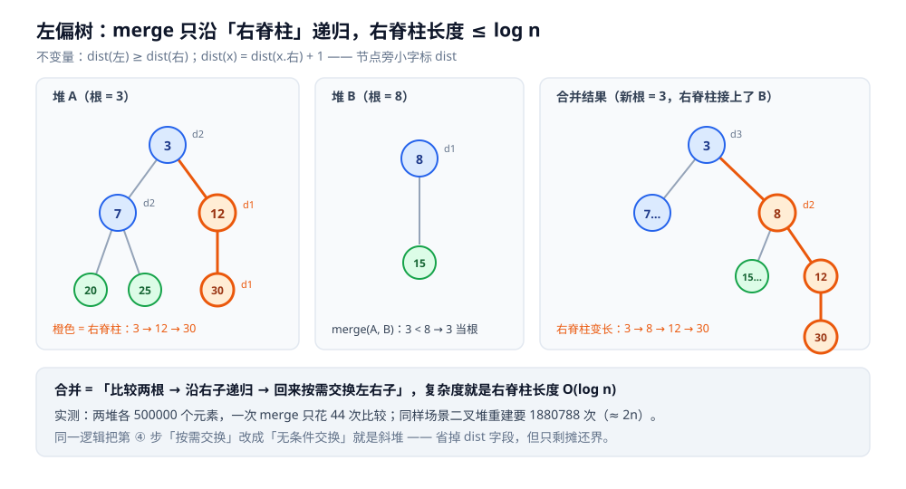
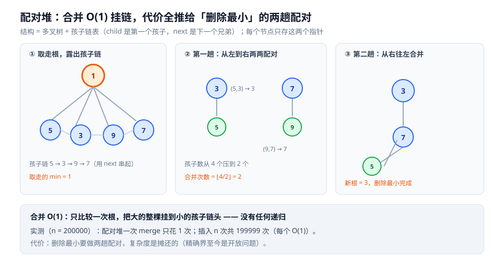

# 可并堆与堆的变体（左偏树 · 斜堆 · 配对堆 · 二项堆 · 斐波那契堆）

> 二叉堆什么都好 —— 建堆 `O(n)`、取最小 `O(1)`、插入与删除最小 `O(log n)`，
> 而且用**数组**存、缓存友好。它只有一件事做不好：**合并（merge）**。
> 两个二叉堆要合并，标准做法只有「**把元素倒在一起重建**」`O(n)` ——
> 因为没有谁愿意接受「合并一次就要重排整棵堆」。
>
> **可并堆**（mergeable heap）就是来解决这一维的：把「堆序」从**数组下标**改成
> **节点之间的指针关系**，于是两个堆可以像接树枝一样「接」起来。
>
> ⭐ 边界先说清：二叉堆本体（上浮 / 下沉 / `O(n)` 建堆 / 堆排序 / Top-K）见
> [堆与优先队列.md](堆与优先队列.md)；并查集见 [并查集.md](../高级数据结构/并查集.md)；
> 「不修改旧版本」的思路见 [可持久化数据结构.md](可持久化数据结构.md)；
> 堆的头号用户（最短路）见 [Dijkstra.md](../../算法/图论算法/最短路/Dijkstra.md)。
>
> 内容整理自个人学习笔记，素材见 [素材清单](../../../素材清单.md)。

---

## 一、二叉堆缺的那一维：合并

**本节要点**：二叉堆的堆序**寄生在数组下标上**（`parent(i) = (i-1)/2`），
所以两个堆一合并，所有下标全乱 —— 只能重建。可并堆把堆序搬到**指针**上，合并才成为可能。

| 操作 | 二叉堆（数组） | 可并堆（典型实现） |
|---|---|---|
| 取最小 | `O(1)` | `O(1)` |
| 插入 | `O(log n)` | 左偏树 `O(log n)` / 配对堆 `O(1)` 摊还 |
| 删除最小 | `O(log n)` | `O(log n)`（配对数摊还） |
| ⭐ **合并两堆** | **`O(n)`**（只能重建） | **`O(log n)`**（配对堆 `O(1)`） |
| 建堆 | `O(n)`（自底向上） | `O(n log n)`（两两合并） |
| 内存布局 | 连续数组，缓存友好 | 指针 + 额外字段，缓存不友好 |

⭐ 一句话判据：**只有「合并」这一维值得为可并堆付出指针与常数的代价**；
如果你只要「插入 + 取最小」，二叉堆通常已经是最优解（第七节有实测反例）。

---

## 二、左偏树：用 `dist` 保证「右脊柱短」

**本节要点**：左偏树给每个节点记一个 `dist`（到「最近的空子节点」的距离），
并强制 `dist(左) ≥ dist(右)` —— 于是**右脊柱**（一路走右儿子的那条链）长度 ≤ `log n`，
而 `merge` 恰好只沿右脊柱递归，所以是 `O(log n)`。

**定义与不变量**：

```text
dist(空节点) = 0
dist(节点 x) = dist(x.right) + 1        // 只看右子
不变量：dist(x.left) >= dist(x.right)   // 「左偏」
```

⭐ 为什么右脊柱长度 ≤ `log n`：由 `dist` 的定义可归纳出
「以 `x` 为根的子树，节点数 ≥ `2^dist(x) − 1`」。
而右脊柱上每个节点的 `dist` 都往下降，于是脊柱长度不超过 `log(n+1)`。
**这就是 `merge` 复杂度的全部依据。**

**合并的逻辑**（小根堆）：

```text
merge(a, b)：
  ① 空则返回另一个
  ② 让「根较小」的那个当新根（设 a）
  ③ 递归：a.right = merge(a.right, b)      // 关键：只往右子树递归
  ④ 回来检查不变量：若 dist(a.left) < dist(a.right)，交换左右子
  ⑤ 更新 a.dist = dist(a.right) + 1
```

```go
type LN struct {
	l, r *LN
	val  int
	dist int
}

func dist(x *LN) int {
	if x == nil {
		return 0
	}
	return x.dist
}

// 合并两个左偏树，返回新根（就地修改，非持久化版）
func merge(a, b *LN) *LN {
	if a == nil {
		return b
	}
	if b == nil {
		return a
	}
	if a.val > b.val { // 小根堆：让较小的当根
		a, b = b, a
	}
	a.r = merge(a.r, b)        // 只沿右脊柱递归
	if dist(a.l) < dist(a.r) { // 维持「左偏」
		a.l, a.r = a.r, a.l
	}
	a.dist = dist(a.r) + 1
	return a
}
```



有了 `merge`，其余操作都是它的特例：

| 操作 | 怎么用 merge 表达 |
|---|---|
| 插入 `v` | `merge(heap, 单节点(v))` |
| 删除最小 | 丢弃根，`merge(root.left, root.right)` |
| 合并两堆 | 直接 `merge(a, b)` |

**实测**（容器 `golang:1.26-alpine`，Go 1.26.8；两堆各 `500000` 个元素，只数「比较 / 链接」次数）：

```text
二叉堆「合并」= 追加后整体重建 heapify : 1880788 次比较（≈ 2n）
左偏树 merge                          : 44 次
→ 单次合并：左偏树比二叉堆重建省约 42745 倍
```

`44` 次就是「右脊柱长度」—— 对 `10^6` 量级的数据，`log` 才 `20` 上下，实测完全吻合。

---

## 三、斜堆：把 `dist` 字段省掉

**本节要点**：斜堆（skew heap）与左偏树**合并逻辑完全相同**，只是把第 ④ 步的
「按需交换」改成 **无条件交换** —— 于是 `dist` 字段与它的比较全都不需要了。

```go
func mergeSkew(a, b *SN) *SN {
	if a == nil {
		return b
	}
	if b == nil {
		return a
	}
	if a.val > b.val {
		a, b = b, a
	}
	a.r = mergeSkew(a.r, b)
	a.l, a.r = a.r, a.l // 无条件交换：靠摊还换掉 dist
	return a
}
```

| | 左偏树 | 斜堆 |
|---|---|---|
| 不变量 | 强制 `dist(左) ≥ dist(右)` | 无（左右子随时对调） |
| 每次合并的界 | **最坏** `O(log n)` | 单次最坏 `O(n)`，**摊还** `O(log n)` |
| 代码 / 内存 | 多一个 `dist` 字段 + 一次比较 | 更短、更省 |

**实测**（同一场景）：`斜堆 merge = 20 次` —— 甚至比左偏树的 `44` 次更少，
因为它**省掉了维护 `dist` 的那次比较**。

⚠️ **别拿斜堆做需要结构保证的事**：它没有 `dist` 不变量，
所以既不能用来做**可持久化**（旧版本结构会被后续操作依赖），
也不能按「节点数」预期树的形状。要「结构确定性」就用左偏树。

---

## 四、配对堆：合并 `O(1)`，删除最小靠「两趟配对」

**本节要点**：配对堆用**多叉 + 孩子链表**，把「合并」压到一次比较 ——
代价全部推给**删除最小**：把根的孩子**两两配对合并**，再从右往左收一遍。

```text
结构：每个节点只存 child（第一个孩子）与 next（下一个兄弟）

merge(a, b)：比较两根 → 大的整个挂到小的「孩子链头」   ← O(1)，只做一次比较
deleteMin()：取走根，把它的孩子从左到右两两配对合并（第一趟），
             再从右往左把结果依次合并（第二趟）
```

```go
type PN struct {
	child, next *PN
	val         int
}

// 合并：O(1)，只比较一次，然后挂链
func mergePair(a, b *PN) *PN {
	if a == nil {
		return b
	}
	if b == nil {
		return a
	}
	if a.val > b.val {
		a, b = b, a
	}
	b.next = a.child
	a.child = b
	return a
}

// 删除最小：两趟配对
func popPair(h *PN) (*PN, int) {
	min := h.val
	// 第一趟：从左到右两两合并
	var list []*PN
	for c := h.child; c != nil; {
		nxt := c.next
		c.next = nil
		list = append(list, c)
		c = nxt
	}
	var pass1 []*PN
	for i := 0; i+1 < len(list); i += 2 {
		pass1 = append(pass1, mergePair(list[i], list[i+1]))
	}
	if len(list)%2 == 1 {
		pass1 = append(pass1, list[len(list)-1])
	}
	// 第二趟：从右往左依次合并
	var res *PN
	for i := len(pass1) - 1; i >= 0; i-- {
		res = mergePair(res, pass1[i])
	}
	return res, min
}
```



**实测**（`n = 200000`，插入 `n` 次 + 连续取最小 `n` 次）：

```text
配对堆 : merge = 1 次（O(1) 挂链）
         插入 n 次共花 199999 次（每个 O(1)）
         插入 + 取最小合计 4338601 次  ← 反而少于二叉堆的 6519019 次
```

⭐ 这个结果值得记住：**配对堆在「插入 + 取最小」这种混合负载上，实测反而优于二叉堆**
（插入 `O(1)` 摊还把平均值拉了下来）。但它没有任何「结构不变量」保证 ——
复杂度是**摊还**的，而且**精确界至今仍是开放问题**（已知 `O(log n)` 摊还，
更好的界至今未被证明）。生产里用配对堆，靠的是实测常识，而不是一条干净的定理。

---

## 五、二项堆与斐波那契堆

**本节要点**：二项堆把「合并」看成**二进制加法**；斐波那契堆把「懒惰」贯彻到底，
连删除最小都摊还掉。前者工程上少见，后者的价值主要是**理论上**的。

| 变体 | 核心手法 | 合并 | 插入 | 删除最小 | 减小键 | 工程地位 |
|---|---|---|---|---|---|---|
| **左偏树** | `dist` + 右脊柱 | `O(log n)` 最坏 | `O(log n)` | `O(log n)` | 不支持高效 | 可持久化 + 竞赛常用 |
| **斜堆** | 无条件交换 | `O(log n)` 摊还 | `O(log n)` 摊还 | `O(log n)` 摊还 | 不支持高效 | 代码最短 |
| **配对堆** | 多叉 + 两趟配对 | `O(1)` | `O(1)` 摊还 | `O(log n)` 摊还 | `O(1)` 摊还 | 实用、常胜二叉堆 |
| **二项堆** | 森林 + 度数归并 | `O(log n)` | `O(log n)` | `O(log n)` | `O(log n)` | 教学 / 斐波那契堆的前身 |
| **斐波那契堆** | 懒惰合并 + 级联切断 | `O(1)` 摊还 | `O(1)` 摊还 | `O(log n)` 摊还 | `O(1)` 摊还 | ⚠️ 理论好、常数大 |

⚠️ **本节的「未实测」声明**：**斐波那契堆与二项堆本篇未做实测**。
它们需要维护父指针、标记位（`mark`）、级联切断（cascading cut）等一整套机制，
代码体量远超本仓单篇的粒度。上表里的复杂度是**教科书结论**，
不是本机读数 —— 需要实现级验证时请另开实验。

⭐ **斐波那契堆真正的卖点**：它让「减小键（decrease-key）」变成 `O(1)` 摊还，
于是原版 **Dijkstra** 的复杂度写成 `O(E + V log V)`（这里 `log` 来自 `V` 次删除最小）。
⚠️ 但**实测常数很大**：工程实现里 `decrease-key` 常常被「**懒惰删除**」
（插入一份新值，弹出时检查是否过期）取代，配合二叉堆或配对堆已经够好 ——
这也是为什么 Go / Java 标准库都**不提供**斐波那契堆。

---

## 六、可持久化合并：左偏树专属

**本节要点**：左偏树的 `merge` 只改**右脊柱上的节点**，
把它写成「**复制被改节点、不碰旧节点**」的版本，就得到了**可持久化可并堆**。

```go
// 持久化版：不修改 a / b，只复制沿途节点
func mergePersist(a, b *LN) *LN {
	if a == nil {
		return b
	}
	if b == nil {
		return a
	}
	if a.val > b.val {
		a, b = b, a
	}
	n := &LN{val: a.val, l: a.l} // 复制，而不是修改 a
	n.r = mergePersist(a.r, b)
	if dist(n.l) < dist(n.r) {
		n.l, n.r = n.r, n.l
	}
	n.dist = dist(n.r) + 1
	return n
}
```

- 一次 `merge` 只新建 **`O(log n)`** 个节点（= 右脊柱长度），旧版本原样保留；
- 于是每个历史版本都还能访问 —— 与 [可持久化数据结构.md](可持久化数据结构.md) 的「路径复制」是同一个念头；
- **斜堆做不到**（它依赖「无条件交换」的摊还论证，复制后论证失效），
  这也正是「要结构保证时选左偏树」的又一理由。

---

## 七、什么时候真的需要可并堆

**本节要点**：判据只有一条 —— **「两个堆需要被合并」且这个动作会发生多次**。否则别上。

| 场景 | 为什么需要合并 | 用什么 |
|---|---|---|
| **多路归并 / 合并多个有序序列** | 每取走一个元素，要把「它所在序列的下一个」重新并进候选堆 | 可并堆（或直接用二叉堆逐元素插） |
| **Borůvka / Prim 等按分量合并的算法** | 两个连通分量的候选边集要合并 | 可并堆 |
| **树上启发式合并（左偏树合并）** | 把多棵子树的「可并堆」自底向上并起来 | 左偏树 |
| **可回滚 / 历史版本查询** | 需要保留旧堆 | **可持久化**左偏树 |
| ❌ **只是插入 + 取最小** | 不涉及合并 | **二叉堆就够了** |

⚠️ **实测反例**（同一实验、`n = 200000`）：

```text
二叉堆 : 插入 + 取最小合计  6519019 次
左偏树 : 插入 + 取最小合计 11078904 次   ← 用可并堆反而更慢
配对堆 : 插入 + 取最小合计  4338601 次
```

**左偏树在不涉及合并的场景上是三者里最慢的** —— 它每次插入都要沿右脊柱走下去维护 `dist`。
所以「可并堆更高级所以更快」是**错的**：它是一个**为合并这一维付费**的结构。

---

## 使用：这些实现在你的系统里以什么形式出现

**本节要点**：可并堆主要活在算法层；工程里它的位置大多被「优先队列 + 懒惰删除」替代，
但**合并**这一维在若干系统里是绕不开的。

| 场景 | 用到的是哪一维 | 说明 |
|---|---|---|
| **内存数据库 / LSM 的归并（compaction）** | 多路归并 = 反复合并有序流 | 归并过程本身就是「合并多个有序堆 / 序列」 |
| **外部排序的多路归并** | 同上 | km 段归并时维护「各段当前最小」的候选集 |
| **树上的自底向上汇总（DSU on tree 变体）** | 合并子结构 | 每个子树维护一个可并堆，自底向上并起来 |
| **可回滚优先队列（撤销 / 版本回退）** | 可持久化合并 | 左偏树持久化版是少数能「保留旧堆」的实现 |
| **Dijkstra 的堆加速** | 取最小 + 减小键 | 工程多用懒惰删除；斐波那契堆的 `O(1)` 减小键是理论优势 |

⚠️ **本篇的写法说明**：上表是按**结构性质**给出的对应关系；
真实系统里未必真的叫「可并堆」，具体实现以各自文档 / 源码为准。

---

## 延伸追问

- **二叉堆为什么合并必须 `O(n)`？** → 它的父子关系由**数组下标**算出来（`parent(i)=(i-1)/2`）。两组合并后，元素的下标全变，原来成立的堆序全部失效，只能重新 `heapify`。可并堆把堆序放在**指针**上，所以不受下标影响。
- **左偏树为什么只沿右子树递归就够了？** → 因为「左偏」不变量保证了右脊柱 ≤ `log n` 长。递归只走右子树，递归深度就是右脊柱长度，于是 `O(log n)`。
- **左偏树的 `dist` 到底量的是什么？** → 到「最近的空子节点」的边数（空节点记 `0`）。它同时给出了一个规模下界：`size ≥ 2^dist − 1` —— 这就是「右脊柱短」的严格依据。
- **斜堆没有 `dist`，凭什么也是 `O(log n)`？** → 只是**摊还**的：单次操作可以退化到 `O(n)`。它用「无条件交换」代替不变量，把每一次的代价摊到整个操作序列上。
- **配对堆的 `deleteMin` 为什么要来回两趟？** → 第一趟「从左到右两两配对」把大量孩子快速压成 `O(log n)` 个，第二趟「从右往左合并」把它们收成一棵。两趟合起来才是 `O(log n)` 摊还；只做一趟会退化。
- **配对堆的复杂度真的有干净结论吗？** → **没有**。已知 `O(log n)` 摊还，但更紧的界至今未被证明（这是数据结构里的著名开放问题）。工程上用它靠的是实测，而非定理。
- **斐波那契堆为什么标准库不提供？** → `decrease-key` 的理论优势被巨大的常数吃掉；而且维护父指针 / `mark` / 级联切断的代码又长又难对。工程里用「懒惰删除」模拟 `decrease-key` 已经够好。
- **可持久化为什么只有左偏树能做？** → 斜堆的正确性依赖「无条件交换」的**摊还**论证，一旦复制路径、旧结构仍被引用，摊还论证就失效；左偏树靠**逐点成立的不变量**，复制后每条性质仍成立。

---

## 关联

- [堆与优先队列.md](堆与优先队列.md) — 二叉堆本体：上浮 / 下沉 / `O(n)` 建堆 / Top-K，本篇的对照基准
- [可持久化数据结构.md](可持久化数据结构.md) — 「路径复制」的通用思路，左偏树持久化版的来处
- [平衡树.md](平衡树.md) — 另一族「堆序/有序」结构（AVL / 红黑树 / 跳表），与堆的分工
- [跳跃表.md](../高级数据结构/跳跃表.md) — 有序结构的随机化路线，与堆的「只保证最小」形成对照
- [并查集.md](../高级数据结构/并查集.md) — 按分量合并的另一套机制（「合并」这一维的另一种答案）
- [Dijkstra.md](../../算法/图论算法/最短路/Dijkstra.md) — 优先队列的头号用户；斐波那契堆 `decrease-key` 的动机
- [排序算法.md](../../算法/基础算法/排序算法.md) — 堆排序与多路归并的对照
- [树的形态与选型.md](树的形态与选型.md) — 选型总纲：什么时候该用树、用哪种树
- [复杂度分析.md](../../算法/基础算法/复杂度分析.md) — 「最坏 vs 摊还」的复杂度口径
- [素材清单.md](../../../素材清单.md) — 素材来源登记
