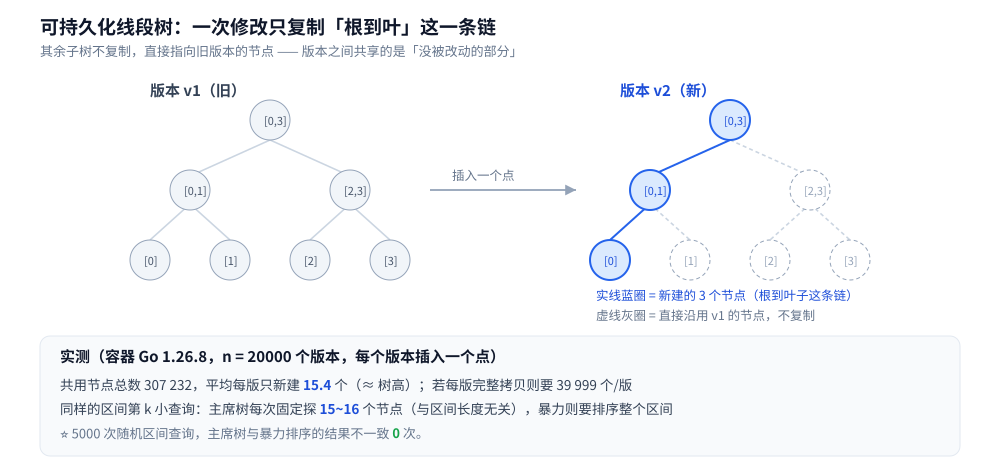

# 可持久化数据结构

> 一个问题：每次修改后都保留「修改之前的样子」，还能不能只付一次修改的成本？
> 可持久化数据结构（persistent data structure）的答案是可以 —— 靠**路径复制**把代价压到 `O(log n)`。
>
> ⭐ 边界先说清：本篇讲**持久化的机制与代价**（路径复制、版本共享、三个经典落地）；
> 线段树本体的区间操作见 [区间与索引树.md](区间与索引树.md)，
> 并查集本体见 [并查集.md](../高级数据结构/并查集.md)，
> Trie 本体见 [Trie.md](Trie.md)。
> ⚠️ 它与数据库的 **MVCC** 不是一回事（后者是并发控制机制、版本的生命周期由事务决定），
> 见第六节的边界说明。
>
> 内容整理自个人学习笔记，素材见 [素材清单](../../../素材清单.md)。

---

## 一、可持久化解决了什么问题？

**本节要点**：问题只有一个 —— **要在「历史状态」上继续查询**，而不想把每次修改都存一份完整快照。

先看「不做持久化」的两种极端，各自贵在哪：

| 做法 | 代价 | 问题 |
|---|---|---|
| **每次修改就改原结构** | 改一次 `O(log n)` | ⚠️ 历史版本**没了**，回查只能重放操作 |
| **每版存一份完整快照** | 改一次 `O(n)`、空间 `O(n)` | `n` 个版本就是 `O(n²)` 的空间（实测里 n=20000 时是 **2604 倍**的差距） |

**持久化的三种强度**（术语先对齐）：

| 类型 | 能做什么 |
|---|---|
| **部分持久化** | 只能**查**历史版本，不能改历史版本（最常见的形态） |
| **完全持久化** | 任意版本都能在其上继续修改 → 版本构成一棵**版本树** |
| **合流持久化** | 两个版本还能**合并**（Git 的 merge 就是这个量级的要求） |

⭐ **判据**：先问「**要不要在历史版本上继续写**」。只要答案是需要，问题就升级到完全持久化，
机制也从「一条链」变成「版本树」。

---

## 二、路径复制为什么能「改一次只付 O(log n)」？

**本节要点**：因为一棵树的修改**只影响根到那个叶子的那一条链**；其余子树**整棵复用**，连指针都不动。

规则只有一条：

```text
修改一个叶子时：
① 沿着「根 → 该叶子」的路径，为沿途每个节点新建一份副本；
② 新副本的「未改动的那一支」直接指向旧版本的对应节点；
③ 旧版本原封不动 —— 它的根还是它，它的指针一个都没变。
```



于是单次修改的**新增节点数 = 树高**，而后面的实测印证了这一点。

### 2.1 实测：版本共享到底省了多少

**✅ 实测口径**：容器 `golang:1.26-alpine`，Go 1.26.8，纯标准库、无第三方依赖；两遍运行逐行相同。
做法：在值域 `[0, 19999]` 上建可持久化线段树，**每个版本插入一个点**，共 20000 个版本。

| 指标 | 读数 |
|---|---|
| 所有版本共用节点总数 | **307 232** |
| 平均每版新建节点 | **15.4 个**（≈ 树高 `⌈log₂n⌉ + 1`） |
| 若「每版完整拷贝」 | 39999 个 / 版，总量 `20000 × 39999 = 799 980 000` |
| 省下 | **2604 倍** |

⭐ **要记住的不是这几个数字，而是那条量级线**：可持久化把 `n` 个版本的总空间从
`O(n²)` 压到 **`O(n log n)`** —— 与「改一次只付树高」这句是同一件事的两种表述。

⚠️ **两个容易忽略的点**：

1. **新版本要新建「根」** —— 版本之间是靠**根指针**区分的（`roots[i]`）。查第 `i` 个版本，就是拿 `roots[i]` 当入口。
2. **旧版本完全不受影响**，这不是「小心维护」得来的，而是**天然性质**：路径复制只写新节点，从没碰过旧节点。
   所以**多版本并发读**不需要加锁。

---

## 三、可持久化线段树怎么求「区间第 k 小」？

**本节要点**：把「每个前缀」建成一个版本，则任意区间 `[l, r]` 的情况 = **两个版本的差值**；
在权值树上同步下行 `O(log n)` 步就找到了第 k 小。

思路（**主席树 / 函数式线段树**）：

```text
① 建 n 个版本：版本 i = 把 a[1..i] 逐个插进「权值线段树」后的样子
② 版本 i 的权值树里，某个值域区间 [L, R] 的计数 = 前 i 个数中落在 [L, R] 的个数
③ 那么区间 [l, r] 中落在 [L, R] 的个数 = 版本 r 的计数 − 版本 (l−1) 的计数
④ 求第 k 小：从根出发，看左半区间的个数 c：
   k ≤ c → 第 k 小在左半边；否则在右半边、找第 (k − c) 小
```

⭐ **关键直觉**：`版本 r − 版本 (l−1)` 这个「减法」之所以成立，是因为**两棵树的形状完全一样**
（同一套值域划分），所以可以**逐节点相减**。这正是「同一个结构建多个版本」才能做的事。

### 3.1 实测：代价与区间长度无关

**✅ 实测口径**（同上容器）：`n = 20000` 的随机排列，对比主席树与「取子区间直接排序」。

| 区间长度 | 主席树访问节点数 | 暴力需排序的元素数 |
|---|---|---|
| 10 | **15** | 10 |
| 100 | **15** | 100 |
| 1000 | **15** | 1000 |
| 10000 | **16** | 10 000 |

⭐⭐ **主席树每次查询固定探 `O(log n)` 个节点，与区间长度无关** —— 这正是它的全部价值：
区间越长，暴力越贵，而主席树**纹丝不动**。

一致性校验：**5000 次随机区间查询，主席树与暴力排序的结果不一致 0 次**。
⚠️ **这一步不能省** —— 「快但算错」是这类结构最危险的失败形态（它不报错）。

---

## 四、可持久化并查集为什么不能做路径压缩？

**本节要点**：因为路径压缩要**就地改写**沿途节点的父指针；而在持久化结构里，
「就地改写」意味着**把旧版本也改了** —— 历史被破坏。于是只能退回**按秩合并**。

| 优化 | 能不能用 | 原因 |
|---|---|---|
| **路径压缩** | ❌ **不能用** | 它要就地改写路径上每个节点的父指针；持久化下这些节点可能被多个版本共享 → 一改就污染历史 |
| **按秩合并** | ✅ 用这个 | 只改**两个**节点的父指针 / 秩 → 每次 `union` 新建 `O(log n)` 个节点即可（路径复制的老套路） |

代价：**只按秩合并的并查集是 `O(log n)`**（不是带压缩的摊还 `α(n)`）——
**用一点时间换「所有历史版本都还在」**。

底层要有一个**可持久化数组**（就是「点更新 + 单点查询」的可持久化线段树）来存 `parent` 和 `rank`。
于是 `find` 变成「在**指定版本**的 parent 数组上沿着父指针走」：

```text
find(ver, x):
    while parent[ver][x] != x:      // 注意：查的是「版本 ver 的 parent 数组」
        x = parent[ver][x]
    return x
```

### 4.1 实测：历史版本真的没被改写

**✅ 实测口径**（同上容器）：8 个元素，版本链 `v0 → v1(union 1,2) → v2(union 3,4) → v3(union 1,3)`：

| 查询 | 结果 | 应为 |
|---|---|---|
| 在 **v3** 上查「1 与 4 连通」 | `true` | `true` |
| 在 **v1** 上查「1 与 3 连通」 | `false` | `false`（当时还没并） |
| 在 **v2** 上查「1 与 3 连通」 | `false` | `false` |
| 回到 **v3** 复查「1 与 4 连通」 | `true` | `true`（历史查询没有污染当前版本） |

⭐ **判据**：可持久化结构的验收标准不是「当前版本对不对」，而是**「查完历史版本之后，当前版本还对不对」** ——
上表最后一行就是这条。

---

## 五、可持久化 Trie 和「函数式」的不可变结构是什么关系？

**本节要点**：同一个思想 —— **改一次只复制路径**；可持久化 Trie 是它在「前缀结构」上的落地，
而函数式语言里的不可变集合是它在「工业级容器」上的落地。

```text
可持久化 Trie：插入一个单词 → 只为「这个单词走过的那条路径」新建节点，
               其余分支整棵复用旧版本（与线段树完全一致的套路）

判据：结构越「分叉深、改动局部」，路径复制的收益越大
```

**它与函数式数据结构的关系**：

| 概念 | 关系 |
|---|---|
| **不可变（immutable）** | 值一旦创建就不改 —— 这是**前提**，不是结果 |
| **路径复制** | 实现不可变更新的**标准手法**（本篇讲的就是它） |
| **结构共享（structural sharing）** | 路径复制带来的**收益**：新旧值共享绝大部分内存 |

⭐ 所以这三者是一条链：**「不可变」是要求 →「路径复制」是手段 →「结构共享」是结果**。
Clojure / Scala 里的 persistent vector、HAMT（哈希数组映射 Trie）都是这条链的工业级实现 ——
**具体复杂度与实现细节以各语言库文档为准**。

---

## 六、工程上什么时候值得上可持久化？

**本节要点**：判据是「**历史版本要被反复查询 / 对比**」，而不是「我可能要回滚」。

```text
□ 需要「查询任意历史时刻的状态」，且这种查询很频繁？
│   └─ 值得上（可持久化线段树 / 可持久化数组）
□ 只是「偶尔要回滚一下」？
│   └─ 别上：一条操作日志 + 逆操作（撤销栈）就够，成本低得多
□ 改一次就要保留一份完整快照？
│   └─ 先算空间账：n 个版本 = O(n²)，几乎一定撑不住
```

### ⚠️ 与 MVCC 的边界（别混为一谈）

数据库的 **MVCC**（多版本并发控制）也是「保留多个版本」，但两者**目的与机制都不同**：

| 维度 | 可持久化数据结构 | MVCC |
|---|---|---|
| 目的 | **查询历史状态**（时间旅行 / 版本对比） | 让**读写互不阻塞**（并发控制） |
| 版本生命周期 | 由用户决定，通常长期保留 | 由事务决定，没有活跃读者就回收 |
| 实现 | 路径复制 + 结构共享 | 版本链 / undo log / 可见性判断 |

⭐ **判据**：问「我要的是**能回看过去**，还是**读写不打架**」——
前者是可持久化数据结构，后者是 MVCC。两者可能同时出现在一个系统里，但解决的是两个问题。

---

## 使用：这些结构在哪些系统里

**本节要点**：可持久化的思想在工程里常以「不可变对象 + 内容寻址」的形式出现。

| 场景 | 形态 | 说明 |
|---|---|---|
| **版本控制系统** | 提交对象 + 父指针链 | 一次提交只描述「相对上一版的变化」，历史全部可达 —— 与路径复制同源 |
| **函数式语言的集合库** | persistent vector / HAMT | 更新返回新值、旧值仍可用；靠结构共享控制内存 |
| **编辑器的 undo / redo** | 版本链或操作栈 | ⚠️ 多数编辑器用**操作栈**（更省），确实需要「任意时刻快照」时才用持久化结构 |
| **算法竞赛 / 区间历史查询** | 主席树、可持久化并查集 | 「第 k 小」「历史连通性」这类题的标配 |
| **配置 / 状态的版本对比** | 不可变快照链 | 便于 diff 与回滚 |

⚠️ **本篇的写法说明**：上表按**机制性质**给出对应，具体系统的实现细节**以各自文档 / 源码为准**。

---

## 延伸追问

- **可持久化 = 每次都存一份快照吗？** → 不是。关键恰恰是**不存快照**：路径复制只复制被改动的那条链，其余共享。n 个版本的空间从 `O(n²)` 降到 `O(n log n)`。
- **为什么改一次只新建「树高」个节点？** → 一棵树的修改只影响「根到该叶子」这一条路径，沿途每个节点复制一份，其余子树整棵复用。
- **区间第 k 小为什么能用「两棵树相减」？** → 因为每个版本是「在同一个值域划分上」建的同形树，节点可以逐一对齐相减；差值就是该区间落在对应值域里的元素个数。
- **可持久化并查集为什么不能用路径压缩？** → 压缩要就地改写沿途父指针，而持久化下这些节点被多个版本共享，改了会污染历史；因此退回按秩合并，复杂度从摊还 `α(n)` 变成 `O(log n)`。
- **怎么验证可持久化结构写对了？** → 查完历史版本之后，当前版本必须仍然正确（本文第四节那张表的最后一行）。
- **它和 MVCC 是一回事吗？** → 不是。前者为「查询历史」，后者为「读写不冲突」；版本生命周期与回收策略都不同。
- **什么时候不该上可持久化？** → 只需要偶尔回滚时用「操作日志 + 逆操作」，成本低得多；上持久化前先算 `O(n²)` 的空间账。

---

## 关联

- [区间与索引树.md](区间与索引树.md) — 线段树本体的形态与区间操作（本篇在它上面加「版本」这一维）
- [并查集.md](../高级数据结构/并查集.md) — 并查集本体；「不能回滚」的原因与可回滚路线的钩子都在它的追问里
- [Trie.md](Trie.md) — 前缀结构本体；可持久化 Trie 是它在「插入」上的持久化版本
- [平衡树.md](平衡树.md) — 另一类「动态有序」结构，其可持久化变体（如可持久化平衡树）只给方向
- [树的形态与选型.md](树的形态与选型.md) — 选型总纲：什么时候要树、要哪种树
- [二叉搜索树.md](二叉搜索树.md) — 树的「修改只影响一条路径」这一直觉的最简形态
- [README.md](../README.md) — 数据结构目录的选型总表
- [素材清单.md](../../../素材清单.md) — 素材来源登记
