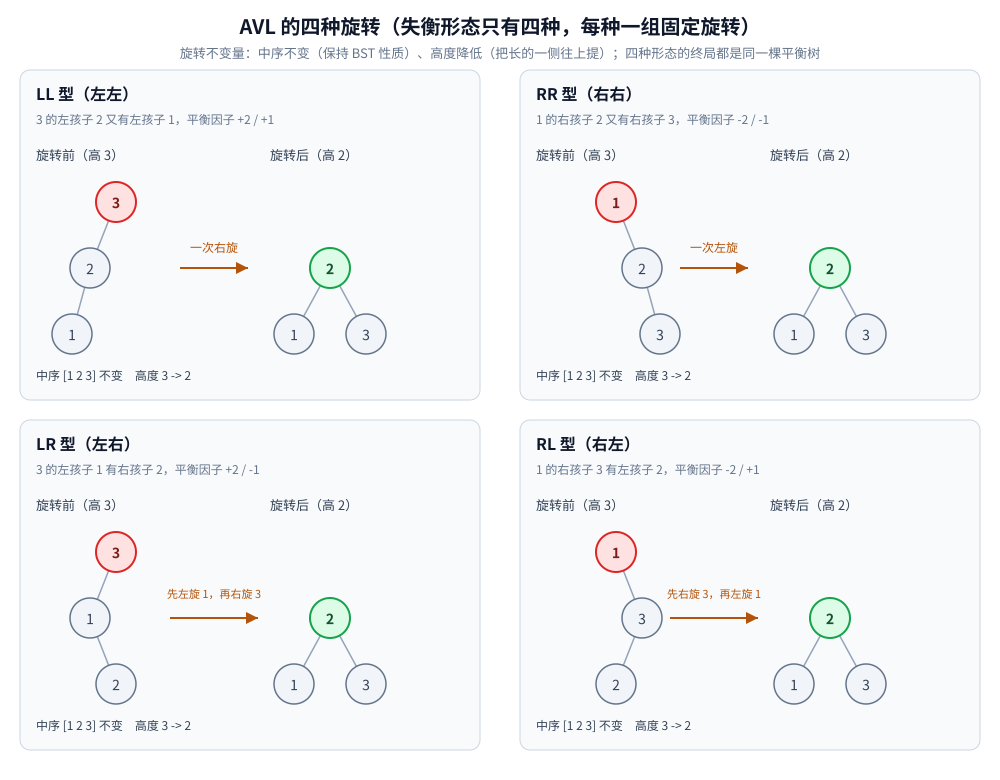
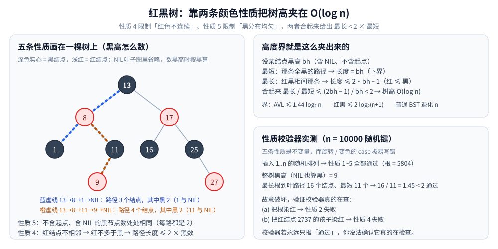

# 平衡树

> 从「BST 退化成一条链」这一个问题出发：**AVL 靠旋转、红黑树靠颜色、B+ 树靠多路、跳表靠掷骰子** ——
> 四种「维持 `O(log n)` 高度」的路线，以及它们各自的**旋转怎么转、性质怎么维持**。
>
> ⭐ 边界先说清：**「AVL / 红黑树 / B 树 / B+ 树 / 跳表分别是什么」的概述**见同目录
> [树的形态与选型.md](树的形态与选型.md)；**「InnoDB 为什么用 B+ 树」的完整推导**见 [B树与B+树.md](B树与B+树.md)，另有
> [索引设计与EXPLAIN.md](../../../03-数据与中间件/数据存储/关系型/MySQL/索引设计与EXPLAIN.md)（MySQL 侧的落地）。
> ⭐ **BST 本身的操作（查找 / 插入 / 删除 / 前驱后继）与退化机制**见 [二叉搜索树.md](二叉搜索树.md)，
> 其中**第七节**给出「随机插入也不等于 `log n`」的实测 —— 本篇从**「怎么把高度修回去」**接着讲。
> 本篇只讲**实现层与性质层**：BST 到底怎么退化、AVL 的四种旋转逐个怎么转、红黑树五条性质怎么校验、
> 分裂与合并发生在哪、跳表的随机层数为什么能替代旋转。
>
> 内容整理自个人学习笔记，素材见 [素材清单](../../../素材清单.md)。复杂度口径见 [复杂度分析.md](../../算法/基础算法/复杂度分析.md)。
>
> 📎 本篇所有输出均为本机实跑逐字抄录：**Go 1.26.5（windows/amd64）** 与 **JDK 1.8.0_321** 各实现一份。
> BST 退化 / AVL 旋转 / 高度对照三组实验的 Go 与 Java 输出**逐行对齐**（`diff` 为空）；
> 红黑树校验器为 Go 手写、Java 侧用 `TreeMap`（标准库不暴露颜色）。

---

## 一、为什么需要平衡树？

**本节要点**：二叉查找树的 `O(log n)` 有一个**默认前提 —— 它是平衡的**。一旦插入顺序不友好，它退化成链表、查询变成 `O(n)`。平衡树就是**用额外的维护操作把这个前提强行维持住**。

### 1.1 BST 的退化（实测）

BST 的查找成本 = **树高**。插入顺序决定树高（本机实跑）：

```text
===== 实验一：BST 有序插入的退化 =====
n       log2(n)  有序插入树高  随机插入树高(5 次平均)
1024    10        1024          21.0
4096    12        4096          27.0
16384   14        16384         33.2
65536   16        65536         40.2
```

⭐ **两个数字对比触目惊心**：

- **有序插入**（`1, 2, 3, …`）：每个新元素都往右挂 → 树高 = `n`。`n = 65536` 时树高 **65536**，而 `log2(n)` 只有 **16** —— **差了 4096 倍**。此时 BST **就是一条链表**，查找退化成线性扫描。
- **随机插入**：树高落在 `40` 左右，和 `2~3 × log2(n)` 同量级 —— 随机顺序下 BST 表现得**不错**，但这是**概率上的**，没法保证。

⚠️ **「随机插入就没事」是个危险的安慰**：真实数据常常**接近有序**（自增主键、时间戳、日志序号、按 ID 批量导入），恰好是最坏情况。**所以工程上不能依赖「输入是随机的」。**

### 1.2 平衡的定义与代价

| 结构 | 平衡条件 | 树高上界 |
|---|---|---|
| **AVL** | 任一节点左右子树**高度差 ≤ 1** | ≤ `1.44 log2(n)` |
| **红黑树** | 五条颜色性质（见第三节） | ≤ `2 log2(n+1)` |
| 普通 BST | 无 | `n`（退化） |

⭐ **核心取舍**：平衡树在每次插删后花一点代价**修复结构**，换取「**任何时刻树高都是 `O(log n)`**」这个**最坏保证**。AVL 修得**更严**（高度差 ≤ 1）、查询更快；红黑树修得**更松**（允许 2 倍高度差）、写更省。

---

## 二、AVL 的四种旋转分别怎么转？

**本节要点**：AVL 失衡的形态**只有四种**，每种对应一组固定的旋转。旋转的本质是「**在保持中序不变的前提下，把高的那侧往上提**」。

### 2.1 平衡因子与失衡的四种形态

**平衡因子（BF） = 左子树高 − 右子树高**。AVL 要求 `BF ∈ {-1, 0, 1}`；一旦变成 `+2` 或 `-2`，就要旋转。

按「新节点插在哪」分四种（`+` 表示左重）：

| 形态 | 失衡节点 | 插在哪 | 修法 |
|---|---|---|---|
| **LL** | BF = `+2` | 左孩子的**左**子树 | 一次**右旋** |
| **RR** | BF = `-2` | 右孩子的**右**子树 | 一次**左旋** |
| **LR** | BF = `+2` | 左孩子的**右**子树 | **先左旋再右旋** |
| **RL** | BF = `-2` | 右孩子的**左**子树 | **先右旋再左旋** |

⭐ **记法**：**前一个字母是「哪边高」，后一个字母是「插在哪」**。LL / RR 是同侧（一次旋转）；LR / RL 是异侧（两次旋转）。

### 2.2 旋转的核心代码

右旋与左旋是一对**镜像操作**，都只动**三个指针 + 两个高度**：

```go
func rotateRight(x *AVLNode) *AVLNode { // x 是失衡节点，其左孩子 y 将上位
	y := x.left
	x.left = y.right // ① y 的右子树交给 x 当左子树
	y.right = x      // ② x 变成 y 的右孩子
	upd(x)           // ③ 先更新 x（新的孩子），再更新 y（新的根）
	upd(y)
	return y
}

func rotateLeft(x *AVLNode) *AVLNode { // 镜像
	y := x.right
	x.right = y.left
	y.left = x
	upd(x)
	upd(y)
	return y
}
```

⚠️ **顺序不能反**：`upd(x)` 必须在 `upd(y)` 之前 —— `y` 的高度依赖 `x` 的新高度。

插入后的修复（沿递归回退路径，自底向上找到第一个失衡点，按四种形态处理）：

```go
func avlInsert(n *AVLNode, v int) *AVLNode {
	if n == nil {
		return newAVL(v)
	}
	if v < n.val {
		n.left = avlInsert(n.left, v)
	} else if v > n.val {
		n.right = avlInsert(n.right, v)
	} else {
		return n
	}
	upd(n)
	bf := hOf(n.left) - hOf(n.right)
	if bf > 1 && v < n.left.val { // LL → 右旋
		return rotateRight(n)
	}
	if bf < -1 && v > n.right.val { // RR → 左旋
		return rotateLeft(n)
	}
	if bf > 1 && v > n.left.val { // LR → 先左旋左孩子，再右旋自己
		n.left = rotateLeft(n.left)
		return rotateRight(n)
	}
	if bf < -1 && v < n.right.val { // RL → 先右旋右孩子，再左旋自己
		n.right = rotateRight(n.right)
		return rotateLeft(n)
	}
	return n
}
```

⭐ **LR / RL 为什么要转两次**：异侧插入时，**第一次旋转把「异侧」变成「同侧」**（把 `LR` 转成 `LL`），第二次才是真正的修复。见下一节的实测。

### 2.3 四种旋转的实测（中序不变、高度降低）

本机实跑，每种形态打印**旋转前后的层序 / 中序 / 高度**：

```text
===== 实验二：AVL 的四种旋转 =====
【LL 型】3 的左孩子 2 又有左孩子 1（平衡因子 +2 / +1）→ 一次右旋
  旋转前：层序 [3 2 1]  中序 [1 2 3]  高度 3
  右旋（以 3 为轴）：[3 2 1] → [2 1 3]
  旋转后：层序 [2 1 3]  中序 [1 2 3]  高度 2
  中序不变: true   高度降低: true

【RR 型】1 的右孩子 2 又有右孩子 3（平衡因子 -2 / -1）→ 一次左旋
  旋转前：层序 [1 2 3]  中序 [1 2 3]  高度 3
  左旋（以 1 为轴）：[1 2 3] → [2 1 3]
  旋转后：层序 [2 1 3]  中序 [1 2 3]  高度 2
  中序不变: true   高度降低: true

【LR 型】3 的左孩子 1 有右孩子 2（平衡因子 +2 / -1）→ 先左旋再右旋
  旋转前：层序 [3 1 2]  中序 [1 2 3]  高度 3
  左旋（以 1 为轴）：[1 2] → [2 1]
  右旋（以 3 为轴）：[3 2 1] → [2 1 3]
  旋转后：层序 [2 1 3]  中序 [1 2 3]  高度 2
  中序不变: true   高度降低: true

【RL 型】1 的右孩子 3 有左孩子 2（平衡因子 -2 / +1）→ 先右旋再左旋
  旋转前：层序 [1 3 2]  中序 [1 2 3]  高度 3
  右旋（以 3 为轴）：[3 2] → [2 3]
  左旋（以 1 为轴）：[1 2 3] → [2 1 3]
  旋转后：层序 [2 1 3]  中序 [1 2 3]  高度 2
  中序不变: true   高度降低: true
```

⭐ **四种形态的终局都是 `[2 1 3]`**（中序 `[1 2 3]`、高度 2）—— 这不是巧合：**同一组键 `{1,2,3}` 的唯一平衡二叉搜索树就是它**，四种旋转只是从不同起点走到同一个终点。

⭐⭐ **实测证实了两条旋转不变量**：

| 不变量 | 含义 | 为什么必须成立 |
|---|---|---|
| **中序不变** | 旋转前后中序遍历完全一样（都是 `[1 2 3]`） | 旋转只改**父子指向**，不改**左右相对次序** —— 所以 BST 的「左 < 根 < 右」性质不被破坏 |
| **高度降低** | 从 3 降到 2 | 这正是旋转的目的：**把长的一侧往上提**，把树高拉回来 |

⚠️ **「中序不变」是旋转合法性的唯一判据** —— 任何会改变中序的「旋转」都不是旋转，只是重排。**实测中四种形态都满足，这是实现正确的最强证据。**



### 2.4 为什么「自底向上找第一个失衡点」就够

⭐ 关键结论：**AVL 插入后，只需在「插入点到根」的路径上修复最靠下的那个失衡点，一次旋转就让整棵树重新平衡。**

理由：插入只可能让**路径上节点的高度**变化，而失衡表现为高度差 `±2`。修复最靠下的失衡节点后，该子树的高度**恢复到插入前的高度**，于是它的祖先们的高度差也随之复原 —— **不需要再往上修**。（⚠️ 这条对**插入**成立；**删除**可能引发多处失衡，要沿路径继续回溯。）

---

## 三、红黑树的五条性质是什么？

**本节要点**：红黑树不用「高度差」约束，而用**颜色约束**。五条性质共同推出「最长路径 ≤ 2 × 最短路径」，从而保证 `O(log n)`。

### 3.1 五条性质

| # | 性质 | 作用 |
|---|---|---|
| **1** | 每个节点**非红即黑** | 定义域（颜色是一个 bit） |
| **2** | **根节点是黑** | 消除边界特判，便于归纳 |
| **3** | 所有 **NIL 叶子是黑** | 让「空孩子」也有颜色，路径长度才好对齐 |
| **4** | **红节点的两个孩子都是黑** | 禁止「父子双红」→ 红色不能连续 |
| **5** | 从任一节点到其所有 NIL 叶子的路径上，**黑节点数相同** | 核心：各路径的「黑高」一致 |

⭐ **性质 4 与 5 是主角**：**4 限制「红色不能连续」，5 限制「黑色分布均匀」** —— 两者合起来把树高夹住。

### 3.2 「最长路径 ≤ 2 × 最短路径」的推导

设某节点的**黑高为 `bh`**（到 NIL 的路径上黑节点数，含 NIL 不含起点）。

**第一：最短路径 = `bh`（全黑）。** 由性质 5，每条路径的黑节点数都相同 = `bh`；路径上可能还有红节点，所以路径长度 ≥ `bh`。**取到 `bh` 的那条路（全黑）就是最短路径。**

**第二：最长路径 ≤ `2·bh − 1`。** 由性质 4，**红节点不能相邻** → 任一路径上「红节点数 ≤ 黑节点数」→ 路径上总节点数 ≤ `2 × 黑节点数 = 2·bh`。再抠掉端点细节，得到 `≤ 2·bh − 1`。

**第三：合起来** `最长 / 最短 ≤ (2·bh − 1) / bh < 2`。∎

⭐ **一句话直觉版**：**最短的那条路全黑，最长的那条路「红黑相间」** —— 红黑相间最多是「全黑」的两倍长，所以高度被夹在 `[bh, 2bh]` 里。



### 3.3 性质校验器实测

⚠️ **红黑树最值得写一个校验器**：五条性质是「不变量」，而旋转/变色的 case 极易写错（少一个变色、转错方向，树可能「看起来正常」但性质已破）。本机用 Go 手写插入 + 校验器，n = 10000 随机键（实跑）：

```text
===== 红黑树：插入 + 五条性质校验器 =====
n = 10000，插入 1..n 的随机排列
性质 1（节点非红即黑）      : 通过（颜色只有红/黑两种取值）
性质 2（根节点是黑）        : 通过（根 = 5804）
性质 3（所有 NIL 叶子是黑） : 通过（nil 一律按黑处理，无红叶子）
性质 4（红节点的孩子都是黑）: 通过
性质 5（各条路径黑高相同）  : 通过
整树黑高（把 NIL 也算作黑） : 9
最长根到叶路径（节点数）    : 16
最短根到叶路径（节点数）    : 11
最长 / 最短 = 1.45 ≤ 2       : 通过

===== 附：故意破坏性质，验证校验器真的在检查 =====
(a) 把根染红              → 性质 2 = 失败
(b) 把红节点 2737 的孩子染红 → 性质 4 = 失败
```

⭐ **最后两行是关键的自检**：**校验器如果永远只报「通过」，你没法确认它真的在查。** 故意把根染红、把一个红节点的孩子染红，校验器**立刻分别报出性质 2、性质 4 失败** —— 这才证明校验逻辑有效（这是「实验设计要自检」的一个具体例子）。

⭐ 顺带验证 3.2 的推导：`黑高 9`、`最长 16`、`最短 11`，`16 / 11 = 1.45 < 2` ✅ —— **实测的比值落在推导给出的 `[1, 2)` 区间内**。

### 3.4 插入修复的三种情况

红黑树的插入修复（`fixInsert`）只有三种情况（对称算六种）：

| 情况 | 条件 | 处理 |
|---|---|---|
| **1** | 叔叔是**红** | 父与叔叔染黑、祖父染红，**问题上移两层**继续 |
| **2** | 叔叔是黑，且新节点是「内侧」孩子 | 先**旋转**转成情况 3 |
| **3** | 叔叔是黑，且新节点是「外侧」孩子 | 父染黑、祖父染红，**绕祖父旋转**，结束 |

⭐ **注意「变色」与「旋转」的分工**：**情况 1 只变色、不旋转**（代价极小，且会往上传播）；**只有情况 2、3 才旋转**。这正是「红黑树插入最多 2 次旋转」的来源 —— **变色可能发生 `O(log n)` 次，但旋转最多 2 次**。

---

## 四、红黑树与 AVL 怎么选？

**本节要点**：AVL 更严格、查询更快；红黑树更松、写更省。**工程上红黑树更常用**，原因不在「谁更快」，而在「**维护成本 × 读写比例**」。

### 4.1 两者的取舍

| 维度 | AVL | 红黑树 |
|---|---|---|
| 平衡条件 | 高度差 ≤ 1（**严格**） | 最长 ≤ 2 × 最短（**弱**） |
| 树高上界 | `≤ 1.44 log2(n)` | `≤ 2 log2(n+1)` |
| **查询** | **更快**（树更矮） | 略慢（常数因子内） |
| **插入旋转** | 最多 **1 次**（见 2.4） | 最多 **2 次** |
| **删除旋转** | ⚠️ 可能 **`O(log n)` 次**（要沿路径回溯） | 最多 **3 次** |
| 维护信息 | 高度 / 平衡因子（**存一个整数**） | 颜色位（**存一个 bit**） |
| 实现难度 | 删除的再平衡**复杂** | 插入删除 case **有限且对称** |

⭐ **一句话**：**AVL 用「更严的平衡」换「更短的查询路径」，红黑树用「更松的平衡」换「更少的写维护」。**

### 4.2 ⭐ 为什么工程上更常用红黑树

四个理由，**没有一条是「红黑树查询更快」**（它其实略慢）：

1. **删除代价差一个量级**。AVL 删除后可能**沿途多处失衡**，要一路回溯旋转，最坏 `O(log n)` 次；红黑树删除**最多 3 次旋转**。真实系统里「删」和「增」一样频繁（会话过期、索引维护、TTL 清理）。
2. **写多读少的场景占多数**。`TreeMap`、`std::map`、Linux 内核的 `CFS` 调度器与 `epoll` 的 fd 管理、Nginx 的定时器 —— 这些都是**持续写入**的结构。**红黑树把「平衡」放松到刚好够用，省下的维护成本是实打实的。**
3. **维护信息更省、实现更稳**。红黑树只需要**一个颜色 bit**（可以塞进指针的低位），AVL 要存**高度/平衡因子**（一个整数）；红黑树的插入删除 case 是**有限且对称**的有限状态机，写对了就基本不会错。
4. **性能差距是常数因子**。AVL 的高度优势（`1.44` vs `2`）在 `log` 里放大后，**实测常常只差一层**（见 4.3），但写的代价差一个量级。

⚠️ **AVL 什么时候反而更好**：**读远多于写、数据基本静态**（例如一次构建、长期只读的查找表、内存索引），此时 AVL 更矮的树带来的查询优势能兑现，而旋转少这一点不重要。

### 4.3 随机插入下的高度对照（实测）

同一份随机排列下（本机实跑）：

```text
===== 实验三：随机插入下 BST vs AVL 的高度对照 =====
n       BST 高度   AVL 高度   2*log2(n)
1000    22        12         18
10000   29        16         26
100000  46        20         32
```

⭐ **三点结论**：

- **BST 在随机输入下也明显高于平衡树**（n=100000 时 `46` vs `20`）—— 因为随机 BST 的期望高度约 `4.3 ln(n)`，常数比平衡树的 `log2(n)` 大得多；
- **AVL 高度紧贴 `log2`**（n=100000 时 `20`，而 `log2(100000) ≈ 16.6`），**远低于 `2*log2(n) = 32`** —— 说明红黑树的**最坏界**很松，实际表现好得多；
- **同一份输入下，红黑树与 AVL 的高度同量级**（n=10000 时：AVL 高 16、红黑树高 16，BST 高 29）—— 印证 4.2 第 4 条：**查询差距是常数因子，写代价差距是量级**。

### 4.4 Java TreeMap：标准库里的红黑树

Java 直接把红黑树做成了 `TreeMap` / `TreeSet`（实跑）：

```text
===== Java TreeMap：标准库里的红黑树 =====
插入 5 3 8 1 9 2 7 后按序遍历:
  [1, 2, 3, 5, 7, 8, 9]
firstKey = 1   lastKey = 9
floorKey(6) = 5   ceilingKey(6) = 7
lowerKey(6) = 5   higherKey(6) = 7
subMap(3, true, 8, true) = [3, 5, 7, 8]
headMap(5) = [1, 2, 3]   tailMap(5) = [5, 7, 8, 9]
descendingMap = [9, 8, 7, 5, 3, 2, 1]
size = 7
```

⚠️ **一个诚实提醒**：`TreeMap` **不暴露节点颜色与旋转次数** —— 「它是一棵红黑树」是**文档保证**，不是能在 API 上验证的。**想验证五条性质，只能像 3.3 那样自己手写一棵。** 但它的**有序性 API**（`floorKey` / `ceilingKey` / `subMap`）正是「平衡 + 有序」能提供、而哈希表给不出的能力。

```text
有序插入 1..100000 耗时 : 56 ms（朴素 BST 会退化成 100000 高的链）
全部命中查询          : 100000/100000  耗时 28 ms
```

⭐ **对照实验一**：同样「有序插入 10 万键」，朴素 BST 会退化成 `100000` 高的链（查询 `O(n)`），而 `TreeMap` 依然维持 `O(log n)` —— **这就是「平衡」二字的全部价值**。（时序数字随机器波动，只断言「不退化」这个定性结论。）

---

## 五、B 树与 B+ 树怎么把平衡搬到磁盘上？

**本节要点**：内存里的平衡单位是「**一个节点**」，磁盘上的平衡单位是「**一个页**」。这一个小改动，让 B 树用**分裂与合并**替代旋转，把树高压到几乎常数。

### 5.1 多路 + 分裂/合并

⭐ **B 树的节点不是二元的，而是「多路」的**（一个节点存多个有序键 + 多个孩子指针）。它的平衡维护和旋转不同：

| 操作 | 内存平衡树 | B 树 / B+ 树 |
|---|---|---|
| 节点太「胖」 | 旋转 | **分裂（split）**：把一个页一分为二，中间键**上推到父节点** |
| 节点太「瘦」 | 旋转 | **合并（merge）**：从兄弟借一个键，或与兄弟合并、把父节点的一个键**拉下来** |
| 平衡单位 | 一个节点 | **一个页** |

⭐ **「上推 / 下拉」是 B 树与二叉平衡树的实质区别**：旋转改的是**父子指向**，分裂/合并改的是**「键在哪些页上」** —— 因为磁盘上的目标是**让一次 I/O 读满一页**，而不是让指针最少。

### 5.2 为什么「一个节点 = 一页」

**磁盘按块读**，读 100 字节和读满一页（InnoDB 默认 16 KB）成本几乎一样。于是最优策略是让**一个节点恰好占一页、一页塞尽量多的 `(键, 子页指针)`**，把**扇出**做大：

- 扇出越大 → 层数越少 → **一次查找的 I/O 次数越少**；
- 用 8 字节主键粗估，一页能放几百~上千个路由项，`10⁷` 行约 3 层、`10⁹` 行约 4 层。

⭐ **这解释了「为什么磁盘索引用 B+ 树而不是红黑树」**：红黑树二叉、一结点一键，`10⁷` 行约 24 层，**层数就是 I/O 次数**。完整推导（含「跳表为什么也不行」）见 [B树与B+树.md](B树与B+树.md) 第二节与 [索引设计与EXPLAIN.md](../../../03-数据与中间件/数据存储/关系型/MySQL/索引设计与EXPLAIN.md)。

⚠️ **B 树 / B+ 树的取舍**：写多读少时，「原地改页」会带来随机写 + 页分裂，于是改用 LSM 树（顺序写换读放大）—— 这是另一个话题，见 [B树与B+树.md](B树与B+树.md) 的失效边界表。

---

## 六、跳表为什么不需要旋转？

**本节要点**：跳表**完全不维护结构不变量**，而是靠「**随机层数**」让树（其实是多层链表）**大概率均匀**。把「维护不变量的成本」换成「掷一次骰子的成本」。

### 6.1 结构

在有序链表上叠多层「快速通道」：第 0 层是完整链表，往上每层是下层的**随机子集**（每个节点以概率 `p`，常取 `0.5`，「晋升」一层）。查找从最高层最左端出发，**能往右就往右、不能往右就掉一层**。

```text
L2:  1 ─────────────→ 9 ─────────────→ 25
L1:  1 ──────→ 6 ───→ 9 ──────→ 18 ─→ 25
L0:  1 → 3 → 6 → 7 → 9 → 12 → 18 → 21 → 25     （查找 12：L2→9 掉层，L1→9 掉层，L0 命中）
```

### 6.2 随机层数为什么能替代旋转

⭐ **平衡树靠「结构不变量」保证任意时刻平衡；跳表只要求「大概率均匀」**。

- 平衡树的旋转：**插入后必须修复**，修复操作牵动祖先路径（红黑树要变色 + 旋转，AVL 要沿路径回溯）；
- 跳表的层数：**由插入时掷的随机数决定、与插入顺序无关** —— 所以**增删之后不需要任何修复动作**。

**期望 `O(log n)` 的直觉**：每往上一层节点按比例变少（期望减半），所以层数 ≈ `log n`；每层横向最多走**常数期望步**。⚠️ 注意这是**期望**不是最坏保证 —— 极端随机结果下它就是一条普通链表（概率极低但存在）。

### 6.3 放弃了什么（换来什么）

| 放弃 | 换来 |
|---|---|
| **最坏情况保证**（只有概率性保证） | **增删只动局部指针**：定位到前后邻居即可，影响范围是常数个节点 |
| 精确的高度控制 | **并发友好**：无锁实现远比平衡树的旋转容易（不牵动祖先） |
| 可打包性（不能按块组织 → **不能当磁盘索引**） | **实现极简**：几十行代码，没有旋转的多种情形 |

⭐ **一句话**：跳表**把「结构平衡」从「必须维持」降级为「大概率成立」** —— 省下的就是旋转的全部成本。这也是 LSM 的 memtable 常用跳表的原因（写多、并发写、要遍历、只在内存）；「为什么磁盘上换成 B+ 树」见 [B树与B+树.md](B树与B+树.md) 第二节。

---

## 使用：平衡树在你的系统里以什么形式出现

平衡树是**「被用」远多于「自己写」**的结构 —— 而且用得最多的地方，你根本看不到它的名字：

**第一层：语言的标准容器**。Java 的 `TreeMap` / `TreeSet`、C++ 的 `std::map` / `std::set` 都是红黑树；`.NET` 的 `SortedDictionary`、Rust 的 `BTreeMap`（用 B 树）同理。你写的 `map` 一旦需要**有序遍历或范围查询**，底层就从哈希表换成了平衡树。

**第二层：操作系统与内核**。Linux 的 `CFS` 调度器用红黑树管理「按虚拟运行时间排序的就绪任务」；`epoll` 用红黑树管理 fd 集合；`Nginx` 的定时器、`libuv` 的 `timer heap` —— **它们都要「快速找最小 + 频繁增删」，正好是红黑树的甜点区**。

**第三层：数据库与存储引擎**。磁盘索引用 **B+ 树**（InnoDB）、内存表 / LSM 的 memtable 用**跳表**（Redis ZSet、LevelDB memtable）—— **同一个「有序 + 快速查找」的需求，在「磁盘」和「内存」两种介质上，落成了两种不同的结构**。

⭐ **归纳成一条选型判据**（沿「介质 → 读写比 → 是否需要范围」问三个问题）：

| 问题 | 答案 → 选择 |
|---|---|
| 数据在**内存**还是**磁盘**？ | 磁盘 → **B+ 树**（一页一节点、高扇出）；内存 → 红黑树 / AVL / 跳表 |
| **读多**还是**写多**？ | 读远多于写 → **AVL**；写也不少 → **红黑树**；写极多 + 并发 → **跳表**（LSM memtable） |
| 要不要**范围查询 / 按序枚举**？ | 要 → 平衡树；不要 → 哈希表（见 [堆与优先队列.md](堆与优先队列.md) 的对照） |

---

## 延伸追问

- **BST 为什么会退化成链表？** → 插入顺序接近有序时，每个新元素都挂到最右边，树高 = `n`。本机实测：有序插入 `65536` 个键，树高 `65536`（`log2(n)` 只有 `16`），查询从 `O(log n)` 退化成 `O(n)`。
- **AVL 的 LR / RL 为什么要转两次？** → 异侧插入时，一次旋转**转不成平衡**（会把问题从「左重」变成「另一种左重」）。做法是**先转成同侧（LL / RR），再做一次真正的旋转**：LR = 先对左孩子左旋、再对自己右旋。实测 LR 型的终局与 LL 型完全一致（都是 `[2 1 3]`）。
- **旋转为什么不会破坏 BST 的性质？** → 因为**旋转只改父子指向，不改中序**。实测四种旋转的中序遍历都是 `[1 2 3]`，与旋转前一致 —— **「中序不变」就是旋转合法性的判据**。
- **AVL 插入要修几处失衡、删除呢？** → **插入只修最靠下的那一处**（旋转后该子树高度复原，祖先的平衡因子随之恢复）；**删除可能引发沿途多处失衡**，要沿路径回溯继续修 —— 这是 AVL 删除复杂度高的根本原因。
- **红黑树为什么能保证 `O(log n)`？** → 性质 4（红不连续）⇒ 红节点数 ≤ 黑节点数 ⇒ 路径长 ≤ `2 × 黑高`；性质 5（各路径黑高相同）⇒ 最短路径就是全黑的那条 = 黑高。两者合起来 `最长 / 最短 < 2`，树高被夹在 `O(log n)` 内。
- **怎么确认红黑树实现是对的？** → 写一个**五条性质的校验器**，且**故意破坏性质验证校验器真的在查**（本机实测：把根染红 → 报性质 2 失败；把红节点的孩子染红 → 报性质 4 失败）。⚠️ 「校验器永远只报通过」说明不了任何事。
- **红黑树插入为什么要「变色 + 旋转」两步？** → 变色处理「叔叔是红」的情况（代价极小、可往上传播），旋转处理「叔叔是黑」的情况。**变色可能 `O(log n)` 次、旋转最多 2 次** —— 这就是「红黑树插入最多 2 次旋转」的来源。
- **工程上为什么更常用红黑树而不是 AVL？** → **不是因为它查询更快**（它略慢）。四条理由：① AVL 删除可能 `O(log n)` 次旋转，红黑树最多 3 次；② 真实系统写多；③ 红黑树只存一个颜色 bit、case 有限；④ 查询差距只是常数因子（实测常常只差一层）。
- **AVL 什么时候反而更好？** → **读远多于写、数据基本静态**时：AVL 更矮的树带来的查询优势能兑现，而「插入只转 1 次」这一点在只读场景里用不上。
- **B 树为什么不用旋转？** → 因为它的平衡单位是**一个页**而不是一个节点。磁盘优化的目标是「一次 I/O 读满一页」，所以「一个节点塞尽量多的键」比「指针最少」重要得多。分裂/合并调整的是「键在哪些页上」，与旋转调整「父子指向」是两种不同的重平衡手段。
- **跳表为什么不需要旋转？** → 它的层数由**插入时的随机数**决定，**与插入顺序无关**，所以增删之后不用做任何修复。它是把平衡树的「**结构不变量**」换成了「**大概率均匀**」—— 代价是失去最坏情况保证。
- **红黑树和跳表都是「内存里维护有序」，怎么选？** → 要**最坏保证 + 单线程** → 红黑树；要**并发写（无锁实现容易）+ 实现简单** → 跳表（这也是 LSM memtable 的选择）。

---

## 关联

- [树的形态与选型.md](树的形态与选型.md) — ⭐ **选型总纲**：八族成员的全景、选型三问与「隐藏代价总表」（本篇是实现与性质层展开）
- [二叉树结构与性质.md](二叉树结构与性质.md) — 地基篇：术语、深度与高度、`n0 = n2 + 1` 的边数法证明
- [LSM树.md](LSM树.md) — 跳表在工程里最著名的落点（LSM 的 MemTable）与本机实测的写放大
- [跳跃表.md](../高级数据结构/跳跃表.md) — 本篇第六节只论证「为什么不需要旋转」；跳表的**形态、查找 / 插入实测轨迹、期望 O(log n) 推导与选型判据**已独立成篇
- [B树与B+树.md](B树与B+树.md) — 「InnoDB 为什么用 B+ 树」的五步推导与失效边界
- [README.md](../README.md) — 数据结构目录总纲：判据、选型对照表与隐藏代价总表
- [复杂度分析.md](../../算法/基础算法/复杂度分析.md) — `O(log n)` 的推导口径与「递归树 / 主定理」
- [查找与排序对比.md](../../算法/基础算法/查找与排序对比.md) — 查找结构对照表：AVL / 红黑树 / B+ 树各适合什么读写比例
- [堆与优先队列.md](堆与优先队列.md) — 与平衡树的对照：堆只保证**偏序**、平衡树保证**全序**；取极值用堆、范围/排名用平衡树
- [单调栈与单调队列.md](../高级数据结构/单调栈与单调队列.md) — 需要「区间第 K 大 / 按序删除」时，单调队列的替代方案就是平衡树
- [索引设计与EXPLAIN.md](../../../03-数据与中间件/数据存储/关系型/MySQL/索引设计与EXPLAIN.md) — InnoDB 的 B+ 树落地：回表、覆盖索引、页分裂与合并
- [索引原理.md](../../../03-数据与中间件/数据存储/搜索与分析/Elasticsearch/索引原理.md) — 倒排索引里的词典（FST）与跳表式跳转：另一条「有序 + 前缀」的路线
- [霍夫曼编码.md](../../算法/贪心/霍夫曼编码.md) — 对照：霍夫曼树是一棵**不维护平衡**的二叉树，因为它的用途是「按频率定码长」而不是「快速查找」
> 反向引用（本篇被下列文档引到）：[散列表.md](../哈希表/散列表.md)、[二叉搜索树.md](二叉搜索树.md)、[区间与索引树.md](区间与索引树.md)、[树的遍历.md](树的遍历.md)、[并查集、Trie与一致性哈希.md](../高级数据结构/并查集、Trie与一致性哈希.md)、[树与二叉搜索树算法.md](../../算法/基础算法/树与二叉搜索树算法.md)
