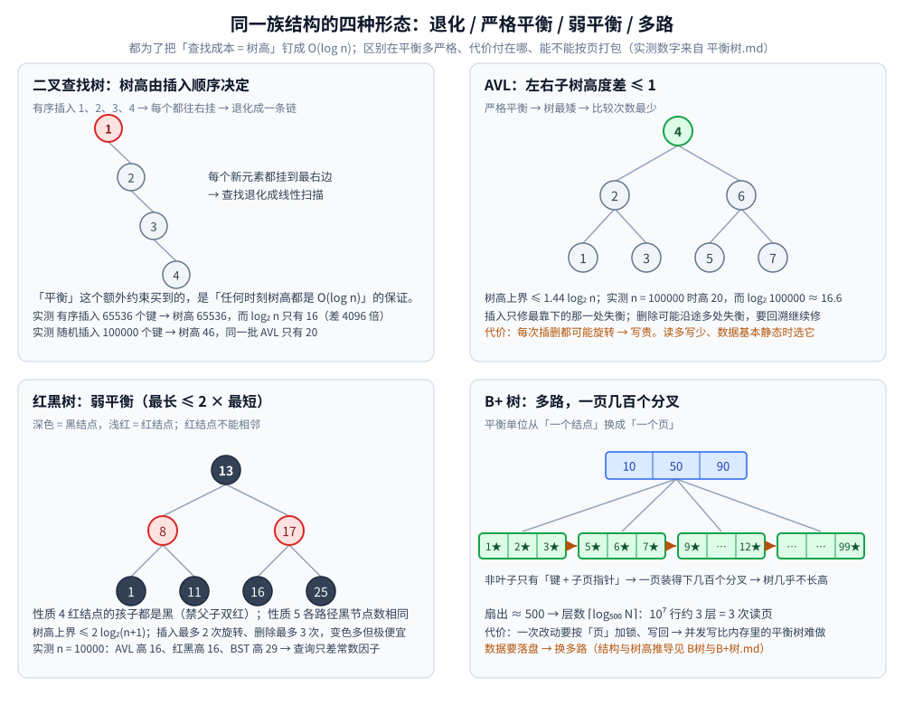

# 树的形态与选型

> 树结构**选型总纲**：从二叉树到 B+ 树、LSM 树、R 树、Trie、线段树，一览这一族结构的**分工与取舍**。
>
> ⭐ 本篇**只给判据与指路**：各结构的形态细节、实现与实测全部在零件篇里（见第一节的「落点」列），**不在这里重复**。
> 「怎么存」的总表见 [README.md](../README.md)；「怎么算」见 [算法/基础算法/README.md](../../算法/基础算法/README.md)。
>
> 素材来源：博客 [数据结构](https://blog.csdn.net/weixin_43837229/article/details/103222660)（2019-11-24）——
> 本篇取该文的「树」一节作为**形态分类**的骨架；**选型判据与隐藏代价**为本次整理补充，
> 数字全部引自本目录各零件篇的本机实测。

---

## 一、树这一族有哪些成员？

**本节要点**：这些结构**不是替代关系** —— 每个成员都是"为某一类代价结构而优化"的解。
看懂它们的分工，选型就变成了"认出你的瓶颈属于哪一类"。

| 族 | 成员 | 一句话职责 | 落点 |
|---|---|---|---|
| **基础** | 二叉树 | 一对多的递归结构：术语、两种存储结构、四条公式 | [二叉树结构与性质.md](二叉树结构与性质.md) |
| **遍历** | 前 / 中 / 后 / 层序、Morris | 结构不变，变的只是"根被访问的时机" | [树的遍历.md](树的遍历.md) |
| **有序查找** | BST（二叉搜索树） | 「左 < 根 < 右」换来**中序有序** → 范围查询 / 前驱后继；⭐ 但**不自平衡** | [二叉搜索树.md](二叉搜索树.md) |
| **平衡** | AVL、红黑树、跳表 | 用**额外的维护操作**把树高钉在 `O(log n)` | [平衡树.md](平衡树.md) |
| **多路** | B 树、B+ 树 | 平衡单位从「一个节点」换成「**一个页**」→ 高扇出、层数近常数 | [B树与B+树.md](B树与B+树.md) |
| **写优化** | LSM 树 | 彻底**放弃原地改**，用顺序写换读放大与空间放大 | [LSM树.md](LSM树.md) |
| **空间** | R 树、R\* 树、四叉树、k-d 树 | 给「**没有全序**」的二维数据造出可剪枝的层级 | [空间索引与R树.md](空间索引与R树.md) |
| **字符串** | Trie、Radix Tree | 用「沿路径逐段比较」换**前缀能力** | [区间与索引树.md](区间与索引树.md) |
| **区间** | 线段树、树状数组 | 把区间"树化"，让**查询与修改都** `O(log n)` | [区间与索引树.md](区间与索引树.md) |

⭐⭐ **三个跨族的洞察**（比记住成员更重要）：

1. **同一需求在不同介质上会落成不同结构**："有序 + 快速查找"在**内存**里是红黑树 / 跳表，在**磁盘**上是 B+ 树；
   "写多"在**内存**里是跳表（LSM 的 MemTable），在**磁盘**上是 LSM。→ **先问介质，再问结构。**
2. **代价是守恒的**：每种结构都在「查询 / 写入 / 空间 / 实现复杂度」里挑几项优化、其余项变差（见第三节总表）。
   **没有"全面更好"的结构**，只有"对你的瓶颈更好"的结构。
3. **平衡手段的谱系**：旋转（AVL / 红黑树）→ 掷骰子（跳表）→ 分裂合并（B 树）→ **完全不管**（LSM，把整理推迟到后台）。
   越往右，"维持不变量的成本"越低，但"查询的不确定性"越高。

---

## 二、选型决策框架

**本节要点**：不要背结构清单，按**三个问题**依次筛 —— **介质 → 读写比 → 有没有"序"的需求**。三问答完，结构自动浮现。

### 2.1 三个问题

| # | 问题 | 答案 → 指向 |
|---|---|---|
| ① | 数据在**内存**还是**磁盘**？ | 磁盘 → **B+ 树**（一页一节点、高扇出）；内存 → 红黑树 / AVL / 跳表 |
| ② | **读多**还是**写多**？ | 读远多于写 → **AVL**；写也不少 → **红黑树**；写极多（磁盘）→ **LSM**；写极多 + 并发（内存）→ **跳表** |
| ③ | 需求里有没有「**序**」？ | 要**范围 / 有序枚举** → 树；要**前缀 / 最长匹配** → **Radix / Trie**；要**区间聚合** → 线段树 / 树状数组；只要**等值** → 哈希表 |

⚠️ 第 ③ 问是最容易被跳过、也最贵的一问：**"要不要有序"这一条能把方案从哈希表整体换到树**。

### 2.2 场景对照表（直接对号入座）

| 场景 | 选择 | 理由 |
|---|---|---|
| 内存里的有序 Map（`TreeMap` / `std::map`） | **红黑树** | 增删省、查询稳定；写多读少的现实分布 |
| 读远多于写、数据基本静态 | **AVL** | 树更矮，查询更快；省下的旋转代价用不上 |
| 磁盘数据库索引 | **B+ 树** | 高扇出 → 层数少 → 一次查找 2~4 次读页 |
| 写多读少、要极致写吞吐 | **LSM 树** | 顺序写换读放大；本机实测写放大 7.04 |
| 高并发写 + 需要有序遍历（内存） | **跳表** | 局部指针改动、无锁实现容易（Redis ZSet） |
| 二维 / 多维空间（附近、GIS） | **R 树系** | 支持范围查询与 kNN |
| 点数据、分布均匀、实现要简单 | **四叉树** | 落哪个象限是确定的，无需贪心 |
| 高频变动的空间对象（网约车） | **网格 / GeoHash** | 更新 O(1)；R 树的删除重插要维护 MBR |
| 前缀匹配 / 最长匹配（网关路由、IP 表） | **Radix Tree** | 比较次数 = 路径段数，与路由条目数基本无关 |
| 敏感词过滤 / 自动补全 | **Trie** | 前缀枚举天然支持 |
| 区间和 / 区间最值 + 修改 | **线段树 / 树状数组** | 查询与修改都 O(log n) |
| 合并重叠区间（离线） | **排序 + 贪心** | 一次性 `O(n log n)`，不需要动态结构 |
| 等值查找 / 去重 / 缓存 | **哈希表** | 无"序"需求时它最快，且省内存 |

⭐ **一句话口诀**：**内存有序用红黑树，磁盘索引用 B+ 树，写多读少用 LSM，并发写用跳表**，
**多维空间用 R 树，前缀匹配用 Radix，区间统计用线段树，只要等值用哈希。**

---

## 三、隐藏代价总表

**本节要点**：Big-O 相同不代表成本相同。真正做决定的是**常数与局部性**、**额外空间**、**并发写难度**，
以及**这个结构"最会骗你的时刻"**。

| 结构 | 查询 | 插入 / 删除 | 主要代价 | 最会骗你的时刻 |
|---|---|---|---|---|
| **BST（未平衡）** | `O(log n)` ~ **`O(n)`** | 同左 | 树高由**插入顺序**决定，它自己保证不了平衡 | 有序插入时退化成链（实测 65536 个键 → 树高 65536，而 `log₂n = 16`） |
| **AVL** | `O(log n)`，更矮 | 插 1 次旋转 / **删可能 `O(log n)` 次** | 维护高度 / 平衡因子（一个整数） | 写入密集时删除的旋转代价被低估 |
| **红黑树** | `O(log n)`，略慢于 AVL | 插最多 2 次、删最多 3 次旋转 | 一个颜色 bit；case 有限但多 | "它查询更快"是错的 —— 它赢在**写省** |
| **跳表** | 期望 `O(log n)` | 期望 `O(log n)` | 多层指针、局部性差 | **只给期望、不给最坏**；且无法按页打包 → 不能当磁盘索引 |
| **B+ 树** | `O(log n)`（层数极小） | `O(log n)` + 页分裂 / 合并 | 一页一次 I/O；并发写要 latch | 忽略「层数 = I/O 次数」与分裂造成的写放大 |
| **LSM** | 平均好，**尾延迟抖** | 顺序写，吞吐高 | Compaction 抢 I/O；空间放大 | 只测"写快"，没测读尾延迟与 Compaction 成本 |
| **R 树 / R\* 树** | 取决于剪枝 | 要维护 MBR，可能分裂 | **重叠**是命门；更新代价高 | 只算查询成本，忽略**更新成本**（"附近的车"就栽在这） |
| **四叉树** | 均匀点数据上很快 | `O(深度)` | 数据不均匀时空象限照样占节点 | 拿均匀数据的成绩去推不均匀场景 |
| **Trie** | `O(键长)` | `O(键长)` | 节点多、指针税重（空间可能爆） | "`O(m)` 看着小"，但空间可能远超预期 |
| **Radix Tree** | `O(路径段数)` | 要分裂 / 合并边 | 实现比 Trie 复杂 | 忽略插入删除的边维护成本 |
| **线段树** | `O(log n)` | `O(log n)` | 开 `4n` 空间；懒标记极易写错 | 忘记下推 / 忘记清空标记 → 结果静默出错 |
| **树状数组** | `O(log n)` | `O(log n)` | 只能做**可差分**运算（最值不行）；必须按值域开数组 | 拿它去做区间最值 |

⭐ **收尾句式**：把下面三个问题问完，选型就自动出来了。

> **"Big-O 相同不代表成本相同。我会先问三件事 —— 数据在内存还是磁盘、有没有范围 / 有序的需求、写入是否并发。"**

- **数据在内存还是磁盘** —— 决定 I/O 次数；
- **有没有范围 / 有序的需求** —— 决定能不能用哈希；
- **写入是否并发** —— 决定结构的维护成本能不能被锁住。

---

## 使用：按场景对号入座

**第一层：先认瓶颈，再选结构。** 不要从"我想用什么结构"出发，而要从"**我现在赔在哪**"出发 ——
赔在随机写（选 LSM / B+ 树）、赔在层数（选高扇出）、赔在二维无全序（选 R 树 / 四叉树）、
赔在前缀（选 Radix）、赔在区间（选线段树）。**第二节的三个问题就是找瓶颈的流程。**

**第二层：拿真实系统的默认选择当参照。** Java `TreeMap` / C++ `std::map` / Linux CFS 调度器 / `epoll` 的 fd 管理 → 红黑树；
MySQL InnoDB / PostgreSQL → B+ 树；RocksDB / Cassandra → LSM；Redis ZSet → 跳表；
MongoDB 地理索引 → 空间索引；Nginx / 网关路由 → Radix。**先看这些默认值，再判断自己是不是特例。**

**第三层：留意"代价转移"的方向。** 换结构往往不是"消除代价"而是"**把代价搬到别处**"：
AVL → 红黑树是把查询优势换成写收敛；B+ 树 → LSM 是把读放大换成写吞吐；
R 树 → 网格是把通用几何能力换成 O(1) 更新。**问清楚"代价搬到哪了、那边我受得了吗"。**

---

## 延伸追问

- **同样是 O(log n)，B+ 树和红黑树怎么选？** → 看**介质**：磁盘上 B+ 树**层数就是 I/O 次数**，高扇出把层数压到 2~4 层，这是红黑树（二叉、一结点一键，`10⁷` 行约 24 层）做不到的；内存里一次比较几乎免费，红黑树更简单、写更省。⭐ 完整推导见 [B树与B+树.md](B树与B+树.md) 第二节。
- **LSM 树会取代 B+ 树吗？** → 不会。两者为**不同读写比与延迟要求**优化：LSM 赢在写吞吐（本机实测写放大 7.04 vs 原地改页模型 ≈ 151.7），B+ 树赢在读延迟可预测与实现成熟。真实趋势是**混用**（MyRocks / TiKV 用 LSM，TiFlash 用列存）。⭐ 见 [LSM树.md](LSM树.md) 第五节。
- **为什么没有一种树能通吃所有场景？** → 因为四种代价（查询 / 写入 / 空间 / 实现复杂度）**不可能同时最优**，而不同场景的瓶颈恰好落在不同项上。更本质地说：**每种结构都在为"某一类访问模式"优化常数与局部性**，而这些优化彼此冲突（例如"高扇出压层数"要求一页装多个键，与"写时只改一个键"冲突）。
- **"内存有序用红黑树、磁盘索引用 B+ 树"这条口诀的边界在哪？** → 边界是**读写比与延迟要求**。写极多时内存侧改跳表（并发友好），磁盘侧改 LSM（顺序写）；读远多于写且数据静态时改 AVL；键分布极不均匀时 B+ 树扇出会塌陷，需要前缀压缩或换结构。⭐ 各条边界的展开见对应零件篇。
- **为什么不直接全用哈希表？** → 因为哈希**没有序**。它回答不了"范围查询""有序枚举""前缀匹配""最近邻"这四类问题 —— 而这四类恰好是数据库索引、路由匹配、空间检索的核心需求。⭐ 判据：**只要需求里出现"区间 / 顺序 / 前缀 / 附近"中任意一个词，哈希就出局了。**
- **什么时候"不用树"才是对的答案？** → 三种情况：① 数据量小且几乎不变 → 排序数组 + 二分，甚至朴素遍历；② 区间合并这类**离线一次性**问题 → 排序 + 贪心就够（`O(n log n)`，不需要动态结构）；③ 只要等值命中 → 哈希表更快更省。⭐ **"上结构"本身有维护成本**，判据是"这个结构的维护开销能不能被收益覆盖"。

---

## 关联

- [二叉树结构与性质.md](二叉树结构与性质.md) — **基础篇**：术语、深度与高度、两种存储结构、四条高频公式的推导
- [树的遍历.md](树的遍历.md) — 前 / 中 / 后 / 层序与 Morris（所有树算法的骨架）
- [平衡树.md](平衡树.md) — **实现与性质层**：BST 退化实测、AVL 四种旋转、红黑五性质校验、B/B+ 分裂合并、跳表
- [B树与B+树.md](B树与B+树.md) — 「InnoDB 为什么用 B+ 树」的五步推导与三条失效边界
- [LSM树.md](LSM树.md) — 写优化路线：MemTable / SSTable / Compaction 与本机实测的写放大 7.04
- [空间索引与R树.md](空间索引与R树.md) — 多维数据的索引：MBR 剪枝、四叉树、GeoHash 与"附近的车"
- [区间与索引树.md](区间与索引树.md) — 区间与字符串结构：线段树 / 树状数组 / 区间合并 / Trie / Radix
- [树与二叉搜索树算法.md](../../算法/基础算法/树与二叉搜索树算法.md) — 「怎么算」那一半：验证 BST、LCA、树形 DP
- [堆与优先队列.md](堆与优先队列.md) — 数组化存储的树（完全二叉树 + 偏序）：取极值 O(1)
- [散列表.md](../哈希表/散列表.md) — 无"序"需求时的最优解，以及它退化的两条路径
- [README.md](../README.md) — 数据结构目录总纲：判据、选型对照表与「结构 × 隐藏代价」总表
- [复杂度分析.md](../../算法/基础算法/复杂度分析.md) — `O(log n)` 与树高、层数的口径
> 反向引用（本篇被下列文档引到）：[Trie.md](Trie.md)、[二叉搜索树.md](二叉搜索树.md)、[霍夫曼树.md](霍夫曼树.md)、[霍夫曼编码.md](../../算法/贪心/霍夫曼编码.md)
