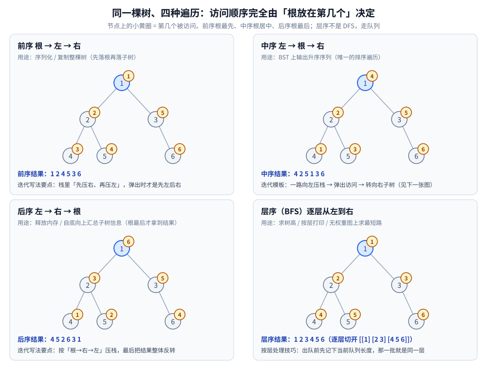

# 树的遍历

> 二叉树的四种遍历：前 / 中 / 后 / 层序的**定义、递归写法、迭代写法与 Morris**，
> 以及「同一棵树为什么能有四种顺序、它们各自不可替代在哪」。
>
> ⭐ 边界先说清：本篇只讲**遍历机制与实现**。用遍历去解的题（验证 BST、LCA、树形 DP）
> 见 [树与二叉搜索树算法.md](../../算法/基础算法/树与二叉搜索树算法.md)；
> 结构本身（术语、存储、公式）见 [二叉树结构与性质.md](二叉树结构与性质.md)。
>
> 内容整理自个人学习笔记，素材见 [素材清单](../../../素材清单.md)。
>
> 📎 本篇输出均为本机**容器**实跑逐字抄录：**Go 1.26.8（linux/amd64，`golang:1.26-alpine`）**。
> ⚠️ **随机数据一律来自「固定 seed 的本地随机源」**（`rand.New(rand.NewSource(...))`）——Go ≥ 1.24 的 `rand.Seed` 已**不再影响全局随机源**，用它写实验会「看起来可复现、其实每次都不同」（实测踩过）；本篇结构性数字整篇重跑**逐字相同**。
> **遍历顺序与「递归 == 迭代」是确定性结论**，可整篇重跑复现；⚠️ 耗时数字随机器与容器波动，只作量级参考。

---

## 一、三种深度优先遍历凭什么只差"根放第几个"？

**本节要点**：前 / 中 / 后序的**唯一区别**是「根在左子树、右子树之间被访问的时机」——`根左右 / 左根右 / 左右根`。
左与右的相对次序**永远不变**，变的只有根。

| 遍历 | 顺序 | 为什么需要它 |
|---|---|---|
| **前序** | 根 → 左 → 右 | 序列化 / 复制整棵树（先落根，重建时才知道谁是父） |
| **中序** | 左 → 根 → 右 | BST 上输出**升序**序列（唯一的排序遍历） |
| **后序** | 左 → 右 → 根 | 释放内存 / 自底向上汇总子树信息（根最后才拿到结果） |

⭐ **一句话记住**：**前序"根最先"、中序"根居中"、后序"根最后"**。
三者在结构上只差「访问根」那一行代码的位置 —— 这正是它们递归写法高度对称的原因（见第二节）。

同一棵树（本机实测）：

```text
        1
      /   \
     2     3
    / \     \
   4   5     6

前序 根→左→右 : [1 2 4 5 3 6]
中序 左→根→右 : [4 2 5 1 3 6]
后序 左→右→根 : [4 5 2 6 3 1]
层序 逐层     : [1 2 3 4 5 6]（逐层切开 [[1] [2 3] [4 5 6]]）
```



### 1.1 为什么中序在 BST 上一定有序

**论证（归纳）**：BST 的定义是「左子树所有键 < 根 < 右子树所有键」。
中序遍历的次序是「左子树（递归）→ 根 → 右子树（递归）」。

- 归纳假设：对更小的子树，中序输出升序；
- 那么整体输出 = 「升序的左子树」+ 根 + 「升序的右子树」，且左子树全部 < 根 < 右子树全部；
- 拼接后必然整体升序。∎

⭐ **推论**：反过来也成立 —— 中序遍历**不是升序**，这棵树就不是 BST。这条被大量用来做校验（见 [树与二叉搜索树算法.md](../../算法/基础算法/树与二叉搜索树算法.md) 第一节）。

### 1.2 三种遍历各自的"不可替代性"

| 遍历 | 不可替代的场景 | 原因 |
|---|---|---|
| 前序 | **序列化 / 反序列化** | 序列里第一个一定是根，重建时能立刻切分左右子树 |
| 中序 | **BST 有序输出 / 校验** | 只有它的输出天然有序 |
| 后序 | **依赖子树的汇总**（树高、路径和、释放） | 用子节点的结果算父节点，必须孩子先算完 |

⚠️ **常见误解**：「知道任意一种遍历就能还原二叉树」——**错**。
只有「**中序 + 前序**」或「**中序 + 后序**」能唯一还原；只给前序或只给后序信息不够（不同形态的树可能输出相同）。

---

## 二、递归写得那么对称，为什么还要学迭代？

**本节要点**：递归的**代价是调用栈**（空间 `O(h)`，树退化成链时 `h = n`，可能爆栈）。
迭代把同一份栈搬到**堆**上自己管 —— 空间量级相同，但**不受系统栈深度限制**，而且三种遍历的迭代写法各有套路。

三种遍历的递归骨架（注意只有「访问」那一行的位置不同）：

```go
func preorder(r *Node, out *[]int) {
	if r == nil {
		return
	}
	*out = append(*out, r.Val) // 前序：根在最先
	preorder(r.Left, out)
	preorder(r.Right, out)
}

func inorder(r *Node, out *[]int) {
	if r == nil {
		return
	}
	inorder(r.Left, out)
	*out = append(*out, r.Val) // 中序：根在中间
	inorder(r.Right, out)
}
```

### 2.1 迭代写法的三套模板

**前序**：栈里**先压右、再压左** → 弹出时才是「先左后右」。

```go
func preIter(root *Node) []int {
	var out []int
	if root == nil {
		return out
	}
	st := []*Node{root}
	for len(st) > 0 {
		n := st[len(st)-1]
		st = st[:len(st)-1]
		out = append(out, n.Val)
		if n.Right != nil { // ⭐ 先右
			st = append(st, n.Right)
		}
		if n.Left != nil { // ⭐ 后左 → 弹出时左先出
			st = append(st, n.Left)
		}
	}
	return out
}
```

**中序**（面试最高频）：**一路向左压栈 → 弹栈访问 → 转向右子树**。

```go
func inIter(root *Node) []int {
	var out []int
	cur := root
	var st []*Node
	for cur != nil || len(st) > 0 {
		for cur != nil { // 一路向左
			st = append(st, cur)
			cur = cur.Left
		}
		cur = st[len(st)-1] // 弹栈访问
		st = st[:len(st)-1]
		out = append(out, cur.Val)
		cur = cur.Right // 转向右子树
	}
	return out
}
```

**后序**：按「根 → 右 → 左」入栈，最后把结果**整体反转**（`左→右→根` 的反转正好是 `根→右→左`）。

```go
func postIter(root *Node) []int {
	var out []int
	if root == nil {
		return out
	}
	st := []*Node{root}
	for len(st) > 0 {
		n := st[len(st)-1]
		st = st[:len(st)-1]
		out = append(out, n.Val)
		if n.Left != nil { // 与 preIter 相反
			st = append(st, n.Left)
		}
		if n.Right != nil {
			st = append(st, n.Right)
		}
	}
	for i, j := 0, len(out)-1; i < j; i, j = i+1, j-1 {
		out[i], out[j] = out[j], out[i]
	}
	return out
}
```


### 2.2 迭代必须与递归逐位一致（本机实测）

⭐ **自检方式**：同一棵树上，三种遍历的「递归输出」与「迭代输出」必须逐位相同。
这是迭代写法最容易错的地方（前序压栈顺序、后序反转），而它**不会报错、只会静默给出另一种顺序**。

```text
[自检] 迭代写法（显式栈）必须与递归逐位相同
  前序 递归==迭代 : true
  中序 递归==迭代 : true
  后序 递归==迭代 : true
```

### 2.3 三种写法的耗时对照（只作量级参考）

```text
[耗时对照] n=200000 随机树，中序遍历
  递归      ~22 ms
  显式栈    ~21 ms
  Morris    ~17 ms（额外空间 O(1)，但每步都要找前驱）
```

⚠️ 时序数字随机器与容器波动，**只断言「同为 `O(n)`、同一量级」**，不要引用具体数值做结论。
Morris 更快不代表它更好 —— 见第四节它的三条硬代价。

---

## 三、层序遍历为什么必须用队列？

**本节要点**：深度优先用**栈**（后进先出）才能"一条路走到黑"；层序要**先来先服务**，只能靠**队列**。
「按层处理」的关键动作是 —— **出队前先记下当前队列长度**。

```go
func levelOrder(root *Node) [][]int {
	var res [][]int
	if root == nil {
		return res
	}
	q := []*Node{root}
	for len(q) > 0 {
		sz := len(q) // ⭐ 先锁住「这一层有几个节点」
		var layer []int
		for i := 0; i < sz; i++ {
			n := q[0]
			q = q[1:]
			layer = append(layer, n.Val)
			if n.Left != nil {
				q = append(q, n.Left)
			}
			if n.Right != nil {
				q = append(q, n.Right)
			}
		}
		res = append(res, layer)
	}
	return res
}
```

⭐ **`sz := len(q)` 这一行是全部技巧所在**：队列在循环中会不断被追加孩子，
若不先锁住长度，就分不清「本层还剩几个」。这也是「按层打印 / 求树宽 / 求树高」的通用骨架。

### 3.1 层序的三个直接用途

| 用途 | 做法 |
|---|---|
| **求树高** | 每处理完一层计数 +1；不用递归 |
| **按层打印** | 直接就是上面的 `res` 结构 |
| **无权图最短路** | 在图上做层序 = BFS，第一次到达某节点即最短距离（见 [BFS广度优先遍历.md](../../算法/图论算法/图的遍历/BFS广度优先遍历.md)） |

### 3.2 栈与队列的分工

| 容器 | 取元素的次序 | 用在 | 结果 |
|---|---|---|---|
| **栈**（LIFO） | 最后进去的先出来 | DFS（前 / 中 / 后序） | 一条分支走到底 |
| **队列**（FIFO） | 最早进去的先出来 | BFS（层序） | 一层一层扩散 |

⚠️ **只改动一行**（把栈换成队列）就得到完全不同的遍历次序 —— 这也是「树的遍历」与「图的遍历」共用同一套骨架的原因。

---

## 四、Morris 怎么把空间压到 O(1)？

**本节要点**：递归与显式栈都要 `O(h)` 额外空间。Morris 的思路是**借树自己的空指针**当"临时线索"，
从而在**不改内存布局**的前提下做到 `O(1)`。

**核心思路**：中序遍历的"下一个要访问的节点"是**当前节点左子树的「最右节点」**（中序前驱）。
Morris 把这个前驱的**空右指针**临时指向当前节点 —— 这样访问完左子树后能顺着线索"爬回来"，不必依靠栈。

```go
func morrisInorder(root *Node) ([]int, int) {
	var out []int
	cur := root
	threads := 0
	for cur != nil {
		if cur.Left == nil {
			out = append(out, cur.Val) // 无左子树 → 直接访问，转向右
			cur = cur.Right
			continue
		}
		prev := cur.Left // 找左子树的最右节点（中序前驱）
		for prev.Right != nil && prev.Right != cur {
			prev = prev.Right
		}
		if prev.Right == nil {
			prev.Right = cur // 建临时线索，往左走
			threads++
			cur = cur.Left
		} else {
			prev.Right = nil // 拆掉线索，恢复原树
			out = append(out, cur.Val)
			cur = cur.Right
		}
	}
	return out, threads
}
```

**本机实测（同一棵树）**：

```text
[Morris 中序] 结果 [4 2 5 1 3 6]  与递归相同: true  建立/拆除线索 2 次
```

⭐ `建立/拆除线索 2 次` 与树里「有左子树的节点数」一致（本树是节点 1 与节点 2）—— 这就是 `O(1)` 空间的来源：
**只借用了本来就存在的空指针，没有新开任何容器**。

### 4.1 Morris 的三条硬代价

| 代价 | 说明 |
|---|---|
| **会临时改树** | 遍历中途树结构被改（`prev.Right` 被指向祖先）；**单线程才行**，并发读会读到错误结构 |
| **常数更大** | 每个有左子树的节点都要"找一次前驱"，多一层内层循环（见 2.3 实测） |
| **出错难以察觉** | 若中途 `return` / `panic`，**线索不会被拆掉**，树就真的坏了 |

⚠️ **判据**：**内存极紧 + 能接受改树 + 单线程**才用 Morris。绝大多数业务代码用递归或显式栈即可。

---

## 使用：遍历在工程里以什么形式出现

**第一层：序列化与深拷贝。** 前序遍历是「写出去」的标准顺序（先写根，再递归子树）；反序列化时配合中序或占位符切分。JSON / 消息队列里的树形结构、前端组件树的 diff 都基于它。

**第二层：写编译期 / 运行期的"求值"。** 表达式树求值、语法树的语义分析、AST 遍历 —— 都是后序（先算子节点再算父节点）。你在任何语言的编译器前端都会看到它。

**第三层：校验与取值。** 中序是 BST 的"照妖镜"：转成数组看是否升序，是最省事的合法性检查。范围查询也可以先中序得到有序序列再二分。

**第四层：按层处理与限宽。** 层序遍历在「树的宽度 / 深度 / 每层聚合」这类需求里是唯一自然的写法；在图上它退化成 BFS，是最短路的标准解法。

⭐ **一条选择判据**：**问"父节点要不要等孩子"** → 要等（自底向上）→ 后序；**问"父节点要不要先处理"** → 前序；
**问"要不要有序"** → 中序；**问"要不要按层"** → 层序。

---

## 延伸追问

- **递归遍历和迭代遍历的区别？** → 遍历**顺序相同**（本机实测三种遍历的递归与迭代逐位一致），差别在**空间与可控性**：递归用系统调用栈（`O(h)`，树退化成链时可能爆栈），迭代用堆上的显式栈（同样 `O(h)`，但不受系统栈限制）。写代码时「栈深不可控」（例如数据可能接近有序）就该换迭代。
- **中序遍历为什么能保证 BST 有序？** → 因为 BST 的定义是「左子树全 < 根 < 右子树全」，而中序的输出次序恰好是「左子树（递归）+ 根 + 右子树（递归）」；归纳可得整体升序。反过来也成立 —— 中序不是升序就不是 BST，这条被用作校验。
- **Morris 遍历为什么能做到 O(1) 空间？** → 它不新增容器，而是**临时借用叶子的空右指针**指向祖先（线索）。访问完左子树顺着线索爬回来，之后再把指针还原。本机实测「建立/拆除线索 2 次」，正好等于「有左子树的节点数」。⚠️ 代价是遍历期间树被改过，必须单线程，且异常退出会留下坏线索。
- **为什么层序遍历要用队列而不是栈？** → 栈是后进先出，会让"最后发现的孩子"先被处理，退化成深度优先；层序要求"先发现的先处理"，只有 FIFO 能满足。⚠️ 换成队列时还要配合 `sz := len(q)` 锁住层长度，否则分不清层边界。
- **知道一种遍历能不能还原二叉树？** → 不能。必须「**中序 + 前序**」或「**中序 + 后序**」；只有前序或只有后序信息不足（不同形态的树可能输出相同序列）。原因是中序提供了"根把左右子树切成两半"的分界信息，而前/后序只提供根的位置。
- **后序迭代为什么要反转？** → 后序是「左→右→根」。若把入栈顺序改成「根→右→左」，输出就变成 `根→右→左` 的逆序 = `左→右→根`，正好是后序。所以写成"按相反顺序入栈 + 最后整体反转"，比手动模拟两次访问（标记法）更短。

---

## 关联

- [二叉树结构与性质.md](二叉树结构与性质.md) — **地基篇**：术语、深度与高度、两种存储结构、四条高频公式
- [树与二叉搜索树算法.md](../../算法/基础算法/树与二叉搜索树算法.md) — 用遍历解题：验证 BST、LCA、树形 DP
- [平衡树.md](平衡树.md) — 遍历在 BST 上的应用（中序有序）与「退化」为什么破坏 `O(log n)`
- [树的形态与选型.md](树的形态与选型.md) — 全目录选型总纲
- [堆与优先队列.md](堆与优先队列.md) — 层序遍历与「数组存完全二叉树」的配合
- [BFS广度优先遍历.md](../../算法/图论算法/图的遍历/BFS广度优先遍历.md) — 层序遍历在图上推广成 BFS 与无权最短路
- [DFS深度优先遍历.md](../../算法/图论算法/图的遍历/DFS深度优先遍历.md) — 栈与递归在图上推广（含「遍历顺序不唯一」的成因）
- [递归与分治.md](../../算法/基础算法/递归与分治.md) — 递归三要素与「递归转迭代（显式栈）」的一般方法
- [README.md](../README.md) — 数据结构目录总纲
> 反向引用（本篇被下列文档引到）：[二叉搜索树.md](二叉搜索树.md)、[树形DP.md](../../算法/动态规划/树形DP.md)
