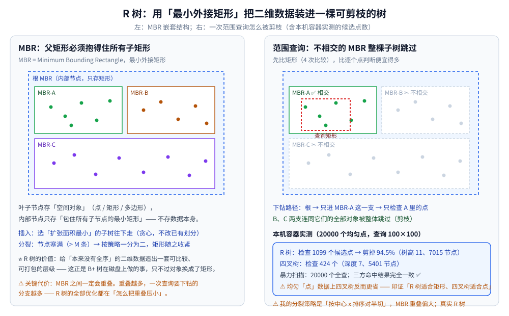
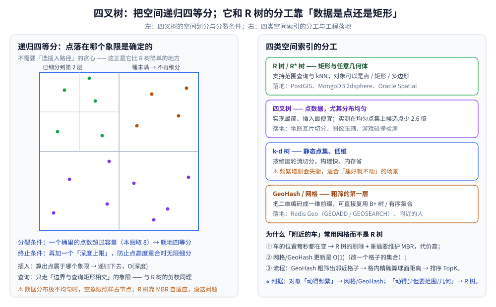

# 空间索引与R树

> 一维索引（B+ 树、哈希）为什么处理不了二维查询，R 树怎么用「最小外接矩形」把二维数据装进一棵可剪枝的树，
> 以及 R* 树、四叉树改了什么、它们各自适合什么数据。
>
> ⭐ 边界先说清：本篇讲**多维空间索引的结构与剪枝代价**。一维有序索引的推导见 [B树与B+树.md](B树与B+树.md)；
> 全目录选型总纲见 [树的形态与选型.md](树的形态与选型.md)。
>
> 内容整理自个人学习笔记，素材见 [素材清单](../../../素材清单.md)。
>
> 📎 本篇读数来自**自写的极简 R 树与四叉树**，在本机**容器**里实跑逐字抄录：**Go 1.26.8（linux/amd64，`golang:1.26-alpine`）**。
> ⚠️ 数据点由随机数生成 → 一律用「固定 seed 的本地随机源」（Go ≥ 1.24 的 `rand.Seed` 已不再影响全局随机源，用它写实验会「看起来可复现、其实每次都不同」）；**本篇节点数 / 剪枝率整篇重跑逐字相同**。
>
> ✅ **实测口径**：20000 个均匀分布的点（坐标范围 `[0,1000)²`）；R 树节点容量 `M=8`；
> 四叉树桶容量 8、深度上限 12；范围查询矩形 100×100（占全图 1%）。可整篇重跑，数字不变。
> ⚠️ **仍未实测**：PostGIS / MongoDB / Redis Geo 等真实引擎的具体行为与性能（只给判据与落地位置）。
> ⚠️ **一个诚实的实现说明**：本实验 R 树的分裂策略是「按中心 x 排序后对半切」（教学简化），
> **MBR 重叠偏大**，所以剪枝率低于真实 R 树；这也正是下面第四节要解释的现象。

---

## 一、一维索引为什么处理不了二维查询？

**本节要点**：B+ 树与哈希都建立在**一个全序**上。而二维空间里**没有全序** ——
`(x, y)` 的大小关系无法同时表达"x 接近"和"y 接近"。

**具体分析**：

| 尝试 | 为什么会失败 |
|---|---|
| **对 x 建 B+ 树** | `WHERE x BETWEEN a AND b AND y BETWEEN c AND d` 能过滤 x，但 y 条件只能**回表逐条判断** → 退化成扫全表 |
| **对 (x, y) 建联合索引** | 只对「**前缀**」有效：比较 `x` 相等或有序时 `y` 才有用；范围查询里 y 完全用不上 |
| **对 x 和 y 各建索引** | 两个索引的结果要做**交集**（位图交集或回表），代价高且选择率差时更糟 |
| **哈希** | 只能等值命中，"附近"这种**范围 + 排序**的需求根本表达不了 |
| **GeoHash 一维编码** | ✅ **可行** —— 把 `(x, y)` 编码成一个字符串，二维邻近 ⇒ 一维前缀相近；⚠️ 但**边界处会失配**（相邻格子的编码可能完全不同），要查"九宫格"补偿 |

⭐ **一句话**：一维索引能回答「在哪个区间」，回答不了「**在哪一块区域附近**」。
所以需要一个**按"空间相邻"分组的层级结构** —— 这就是 R 树与四叉树的出发点。

---

## 二、R 树的核心：用 MBR 造出「可剪枝的层级」

**本节要点**：R 树不改变数据的键，而是给它套一层**最小外接矩形（MBR）**，
用「矩形包含矩形」表达层级关系。**内部节点不存数据，只存"我这一支覆盖了哪块地"**。

**结构**：

| 层 | 存什么 |
|---|---|
| **叶子节点** | 真正的空间对象（点 / 矩形 / 多边形，或指向它们的指针） |
| **内部节点** | **只存 MBR** —— 包住其所有子节点对象的最小外接矩形 |
| **根节点** | 包住全部的 MBR |

⭐ **为什么用矩形而不是别的形状**：矩形只需 4 个数（`x1, y1, x2, y2`），
**比较只要 4 次判断**就能回答"是否相交"，而且可以像 B+ 树的键一样**打包进同一页**。
这与 [B树与B+树.md](B树与B+树.md) 里「一页放尽量多路由项」是同一个思路。

**插入**：从根往下，每一层选「**扩张面积最小**」的那个子树（贪心，尽量不改已有划分），走到叶子放入。
**分裂**：节点条目数超过容量 `M` → 按某种策略一分为二（经典有**二次分裂**与**线性分裂**，目标是让两个新矩形**重叠尽可能小**）。



### 2.1 为什么"重叠"是 R 树的命门

⭐ **MBR 之间一定会重叠**（这是矩形近似的固有代价）。重叠带来两个连锁后果：

1. 查询时「相交」的矩形变多 → 要下钻的分支变多 → **剪枝率下降**；
2. 插入时"选哪一支"变得不明确 → 树结构更容易退化。

所以 R 树的全部优化努力（R 树 → **R\* 树**、二次分裂、强制重插）都指向同一件事：**把重叠压小**。
⚠️ 这也是下面第四节实测里「朴素分裂策略剪枝率不高」的根本原因。

### 2.2 与 B+ 树的结构性类比

| 概念 | B+ 树 | R 树 |
|---|---|---|
| 层级依据 | 键的**全序** | 矩形的**包含关系** |
| 内部节点存 | 键 + 子页指针 | 只有 MBR（不存键、不存数据） |
| 优化目标 | 层数少（= I/O 次数少） | 重叠少（= 下钻分支少） |
| 平衡手段 | 分裂 / 合并页 | 分裂（重插是 R\* 的增强） |
| 叶子 | 有序 + 链表 | 空间对象，**无天然顺序** |

⭐ **一句对照**：**B+ 树的瓶颈是"层数"，R 树的瓶颈是"重叠"**。

---

## 三、范围查询与最近邻查询怎么走？

**本节要点**：范围查询是「**矩形相交**」的递归下探；最近邻（kNN）是「**由近及远扩框 + 用当前第 k 近距离剪枝**」。
两者的共同点是：**先在矩形层面做批量判断，再对少量候选做精确计算**。

### 3.1 范围查询（三步）

1. 从根开始，判断查询矩形与每个子节点的 MBR **是否相交**；
2. 不相交 → **整棵子树跳过**（这是全部收益的来源）；
3. 相交 → 递归下去；到叶子后对候选对象做**精确判断**（MBR 相交不等于对象本身相交）。

⚠️ **第 3 步不能省**：MBR 只是近似。点的 MBR 就是它自己（精确），
但**多边形 / 折线的 MBR 会包含很多"其实在外面"的区域** —— 所以必须再算一次真实几何关系。

### 3.2 最近邻查询（kNN）

R 树原生只回答"相交"，做"最近的 k 个"需要额外策略：

1. 用**优先队列**按「到当前查询点的最小距离」排序待访问节点（best-first）；
2. 取一个候选后，用一个**以当前第 k 近距离为半径的圆（或矩形）**去剪掉更远的节点；
3. 不断收紧这个半径，直到队列里剩下的都比它还远 → 结束。

⭐ **关键洞察**：kNN 的剪枝比范围查询更难，因为"多近才算近"**一开始并不知道**，
必须**边探索边收紧**。这也是 R 树 kNN 实现比范围查询复杂的原因。

### 3.3 实测：剪枝到底省了多少（本机）

```text
===== 空间索引（R 树 vs 四叉树 vs 暴力扫描）=====
数据：20000 个均匀分布的二维点，坐标范围 [0,1000)²
R 树节点容量 M=8；四叉树桶容量 8、深度上限 12

[建索引后的结构规模]
  R 树  : 节点 7015 个，树高 11
  四叉树: 节点 5401 个，深度 7

[范围查询] 查询矩形 100×100（面积占全图 1%，期望命中约 200 个点）
  查询矩形            暴力扫描    R树候选点   R树剪枝率   四叉树候选点
  (400,400)-(500,500)    20000         958        95.2%          494
  (100,700)-(200,800)    20000        1617        91.9%          377
  (800,100)-(900,200)    20000         609        97.0%          360
  (250,250)-(350,350)    20000        1212        93.9%          465

  ⭐ 平均：R 树检查 1099 个候选点（全量 20000），剪掉 94.5%；四叉树检查 424 个
```

**三点读法**：

- **R 树剪掉了 94.5%** 的候选点 —— 剪枝这件事本身非常有效；
- ⚠️ 但**四叉树检查的候选点更少（424 vs 1099，约 1/2.6）** —— 这**不是 bug**，而是两条结构差异的必然结果：
  ① 我的 R 树用了**教学简化的分裂策略**（按中心 x 对半切）→ **MBR 重叠偏大** → 剪枝被削弱；
  ② **数据是均匀分布的点**，恰好是四叉树的最佳场景（见第四节）；
- ✅ **一致性自检**：R 树 / 四叉树 / 暴力扫描三方的命中结果**完全一致**，说明剪枝没有"剪错"。

⭐ 这组对照正好实测印证了教科书上那句「**R 树适合矩形，四叉树适合点数据**」——
**只有当你真的把两种情况都跑一遍，才会发现"更通用的结构"在特定数据上反而更贵。**

---

## 四、R* 树与四叉树分别改了什么？

**本节要点**：**R\* 树**在 R 树内部继续压重叠；**四叉树**干脆放弃"自适应"，
改用**固定的空间四等分**换取极简的实现。

### 4.1 R\* 树：继续压重叠

| 优化 | 做法 | 收益 |
|---|---|---|
| **更聪明的分裂** | 不只看"切得开"，还评估两块**重叠面积 / 周长** | 分裂后矩形更"方正"，重叠更小 |
| **强制重插**（forced reinsert） | 节点溢出时不立刻分裂，先挑出一部分条目**重新从根插入** | 把"放错位置"的条目搬到更合适的分支 → 结构更健康 |
| 兼顾**周长与面积** | 选子树时同时考虑扩张面积与周长增量 | 避免产生细长矩形（细长矩形更容易与别人重叠） |

⭐ **一句话**：R\* 树 = R 树 + 「**分裂与选择都用更贴近"重叠最小化"的目标函数**」。

### 4.2 四叉树：固定划分，实现最简

**做法**：空间一开始是整个正方形；当一个节点的对象数超过容量时，**把它四等分**（四个子节点），
对象按位置下沉到对应子节点；再加一个**深度上限**防止"点高度重合"时无限细分。

| 维度 | R 树 | 四叉树 |
|---|---|---|
| 划分方式 | **自适应**（跟着数据走） | **固定**（递归四等分） |
| 插入决策 | 要贪心选子树 | **落在哪个象限是唯一确定的**，无需决策 |
| 适合数据 | 任意几何体（矩形 / 多边形） | **点数据**，尤其分布均匀 |
| 不均匀数据 | MBR 自适应，仍可用 | ⚠️ 空象限照样占节点；树会偏 |
| 典型用途 | GIS、空间数据库 | 地图瓦片、图像压缩、游戏碰撞检测 |

⭐ **本机实测印证**：均匀点数据上四叉树检查 **424** 个候选点，而（简化版）R 树检查 **1099** 个。
⚠️ 但要注意**结论的边界**：换成矩形 / 多边形对象、或数据分布极不均匀，四叉树的优势会迅速消失。



### 4.3 k-d 树与 GeoHash 的位置

| 结构 | 一句话 | 何时用 |
|---|---|---|
| **[k-d 树](KD树与高维索引.md)** | 按维度轮流切分（第一层按 x、第二层按 y…） | 静态点集、低维；⚠️ 频繁增删会失衡、高维会撞上**维度灾难** |
| **R 树 / R\* 树** | 自适应 MBR 层级 | 对象不止是点，或需要范围 + kNN |
| **四叉树** | 固定四等分 | 点数据、分布较均匀、实现要简单 |
| **网格 / GeoHash** | 把二维编码成一维前缀 | **对象高频变动**时的"粗筛第一层"，可直接复用有序集合 |

---

## 五、工程落地：这些索引在真实系统里长什么样

**本节要点**：真实系统极少「裸用 R 树」，通常是**「粗筛 + 精算」两层结构**。
原因是：**空间索引的成本不只在查询，还在更新**。

| 系统 | 用的什么 | 关键点 |
|---|---|---|
| **PostGIS** | R 树 / GiST 索引（`CREATE INDEX ... USING GIST`） | 支持任意几何体的范围与最近邻查询（`ST_DWithin` / `<->`）；GC 与索引膨胀要注意 |
| **MongoDB** | `2dsphere` / `2d` 地理索引（内部是 **S2 几何库**的层级划分，思路与四叉树/层级编码同源） | 支持 `$near` / `$geoWithin`；⚠️ 详见 [索引原理.md](../../../03-数据与中间件/数据存储/NoSQL/MongoDB/索引原理.md) |
| **Redis** | GeoHash 有序集合（`GEOADD` / `GEOSEARCH`） | 把经纬度编码成 52 位 GeoHash 存进 ZSET → **复用跳表**做范围扫描；⚠️ 详见 [底层结构.md](../../../03-数据与中间件/数据存储/NoSQL/Redis/底层结构.md) |

### 5.1 「附近的车」为什么常用网格而不是 R 树

这是空间索引里最经典的一道工程题，⭐ **答案是"更新成本"而不是"查询成本"**：

1. **车的位置每秒都在变**。R 树里一次位置更新 = 删除 + 重插，要沿着路径**维护 MBR**（可能触发分裂）；
   而网格 / GeoHash 的更新是 **O(1)**（从旧格子集合里删、往新格子集合里加）；
2. **查询只需要"附近"**，不需要任意几何关系 → 用不上 R 树的通用性；
3. 标准流程是**三层**：
   - **粗筛**：用 GeoHash / 网格取出目标格子 + 周边 8 个格子；
   - **精算**：对候选逐个算**球面距离**（不能直接用平面距离，要按纬度修正）；
   - **排序取 TopK**。

⭐ **判据**：**对象"动得频繁" → 网格 / GeoHash；对象"动得少但要范围或几何关系" → R 树。**
⚠️ 顺带一条边界：GeoHash 在**格子边界**处，物理上相邻的两点编码可能完全不同 →
必须补查相邻格子，这一步漏了会出现"明明很近却搜不到"的经典 bug。

---

## 使用：空间索引在你的系统里以什么形式出现

**第一层：你直接调用的数据库功能。** PostGIS 的 GiST、MongoDB 的 `2dsphere`、Redis 的 `GEO*` 命令 —— 都是本章这些结构的产品化形态。**先看你的数据库有没有内置空间索引，再考虑自己实现。**

**第二层：你选型时的判据。** 三条依次问：① **对象是点还是任意几何**（点→四叉树/GeoHash 够用）；② **对象动不动**（动得频繁→网格/GeoHash）；③ **要不要 kNN**（要→R 树系）。三个问题答完，结构就定了。

**第三层：你调优时的抓手。** 空间索引查询慢，先看两件事：**MBR 重叠是否过大**（索引膨胀 / 数据倾斜造成），以及**是否漏了边界补偿**（GeoHash 的九宫格）。这两条覆盖了绝大多数"查不到 / 查得慢"的实际案例。

**第四层：它示范了一种通用方法。** R 树把"没有全序的二维数据"装进"有层级的树"的做法可以外推：**给数据造一个"可比较的代理"**（这里是 MBR，在 [B树与B+树.md](B树与B+树.md) 里是「一页打包的距离度量」，在 [LSM树.md](LSM树.md) 里是「不可变段的有序性」）。这套思路在任何"原生没有顺序、但需要索引"的领域都用得上。

---

## 延伸追问

- **R 树和 B 树的区别？** → 层级依据不同：B 树靠**键的全序**分层，R 树靠**矩形的包含关系**分层。所以 R 树的内部节点**只存 MBR、不存键**，叶子节点上的对象也**没有天然顺序**（B+ 树叶子是有序链表）。两者的优化目标也因此不同：B 树压「层数 = I/O 次数」，R 树压「重叠 = 下钻分支数」。
- **四叉树和 R 树怎么选？** → 看**对象类型**与**分布**：对象是**点**、分布较均匀、实现要简单 → 四叉树（本机实测均匀点集上它检查的候选点只有简化 R 树的约 1/2.6）；对象是**矩形 / 多边形**或需要 kNN → R 树系（R\* 树更优）。⚠️ 分布极不均匀时四叉树会因"空象限照样占节点"而退化。
- **空间索引在高并发下有什么挑战？** → 两个：① **更新的代价远高于一维索引** —— R 树一次位置更新要沿路径维护 MBR、可能分裂，所以高频变动对象（车辆）改用网格 / GeoHash；② **索引膨胀与并发控制** —— 空间索引的 MBR 会随删除逐渐变大变虚（PostGIS 需要 `REINDEX` / `VACUUM` 缓解），多版本并发下需要额外的结构锁或读快照。
- **为什么 R 树的 MBR 会重叠，而 B+ 树的键范围不会？** → 因为**矩形是近似**：两个空间上分开的对象集，它们的最小外接矩形仍可能互相覆盖（尤其是形状细长或分布斜向时）。而 B+ 树直接按键值切分，天然不重叠。⭐ 这也是 R 树所有优化（R\* 的分裂目标函数、强制重插）都在压重叠的原因。
- **为什么"附近的车"不用 R 树？** → 因为**瓶颈在写不在读**。车的位置高频变化，R 树的删除 + 重插要维护 MBR（可能触发分裂），而网格 / GeoHash 的更新是 O(1)。查询侧的需求（"附近若干公里"）用不上 R 树的通用几何能力，网格 + 球面距离精算就够。
- **GeoHash 的边界问题怎么解决？** → 查询时**同时取目标格子与相邻格子**（平面上的"九宫格"）。因为 GeoHash 只在**前缀方向**上保证邻近，格子边界两侧的编码可能完全不同 → 只查一个格子会漏结果。⚠️ 这是"附近的人 / 附近的车"最常见的线上 bug 之一。

---

## 关联

- [树与二叉搜索树算法.md](../../算法/基础算法/树与二叉搜索树算法.md) — 树上算法的通用手法：递归下探 + 剪枝（与空间索引的"矩形先剪枝"同构）
- [B树与B+树.md](B树与B+树.md) — **一维对照面**：为什么磁盘索引用 B+ 树，以及「并行索引」的推导
- [Trie.md](Trie.md) — Trie 的前缀能力与 GeoHash 的「二维编码成一维前缀」是同一类思路
- [树的形态与选型.md](树的形态与选型.md) — 全目录**选型总纲**：各类树的分工与隐藏代价总表
- [KD树与高维索引.md](KD树与高维索引.md) — **同族对照**：点集的逐维切分索引、kNN 的平面距离剪枝、维度灾难与高维替代路线
- [LSM树.md](LSM树.md) — 另一种"为写优化"的结构；同属「换一种整理方式」的思路谱系
- [索引原理.md](../../../03-数据与中间件/数据存储/NoSQL/MongoDB/索引原理.md) — MongoDB 的索引体系与 `2dsphere` 的落地位置
- [底层结构.md](../../../03-数据与中间件/数据存储/NoSQL/Redis/底层结构.md) — Redis 用有序集合（跳表）承载 GeoHash 的做法
- [数据库选型对比.md](../../../03-数据与中间件/数据存储/数据库选型对比.md) — 存储引擎层的横向选型
- [README.md](../README.md) — 数据结构目录总纲
> 反向引用（本篇被下列文档引到）：[区间与索引树.md](区间与索引树.md)
