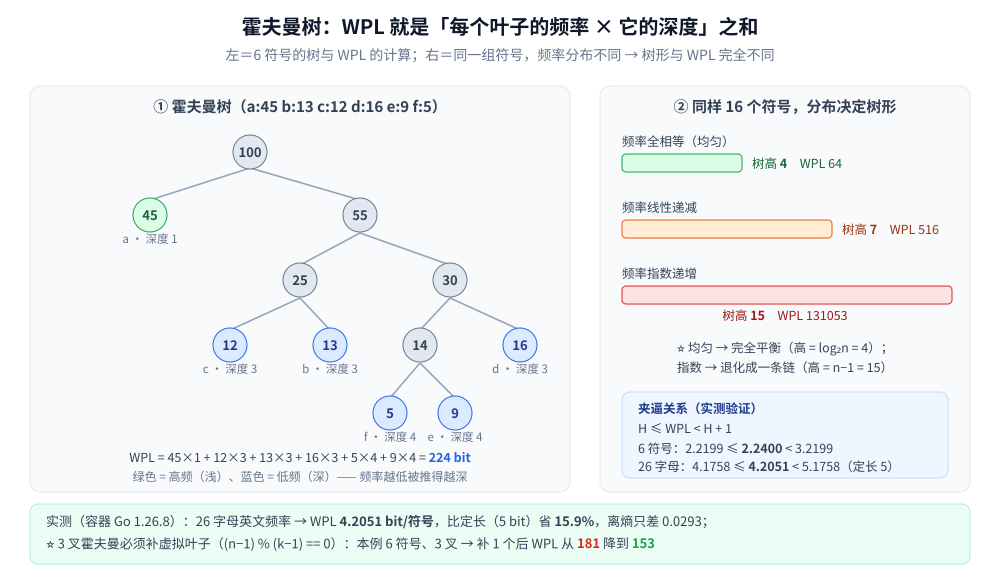

# 霍夫曼树

> 覆盖「**带权路径长度最短**的二叉树」这一结构：叶子挂频率、深度换码长，**WPL = Σ 频率 × 深度**。
> 它是「同一个频率集合，哪种二叉树最省」这个问题的答案。
>
> ⭐ **本篇只讲结构侧**：WPL 的定义与两条边界、树形如何随频率分布变化、k 叉霍夫曼为什么要补虚拟叶子。
> 「每轮取最小两个」为什么是最优的（贪心选择 + 最优子结构证明）、编码表怎么读、压缩率与四个边界情况，
> 全在 [霍夫曼编码.md](../../算法/贪心/霍夫曼编码.md) —— **两篇不重复**，那边是**算法与落地**，这边是**树形与度量**。
>
> 内容整理自个人学习笔记，素材见 [素材清单](../../../素材清单.md)。
> 📎 本篇所有读数均为**容器实跑逐字抄录**：**Go 1.26.8（linux/amd64，`golang:1.26-alpine`）**；
> 固定频率表 + 稳定 tie-break，跑两遍输出**逐行相同**。
>
> 全目录的判据与选型总表见 [README.md](../README.md)；树的选型总纲见 [树的形态与选型.md](树的形态与选型.md)。

---

## 一、霍夫曼树是什么？WPL 在衡量什么？

**本节要点**：它是**带权路径长度（WPL）最小**的二叉树 —— 把高频叶子放浅、低频叶子放深，**深度就是成本**。

**定义**：给定 `n` 个带权（频率）的叶子，构造一棵二叉树使

```text
WPL = Σ (每个叶子的权 × 它的深度)
```

最小。这个最小值就称为**最优二叉树**的 WPL。

⭐ **它和普通 BST / 平衡树的优化目标完全不同**：

| 树 | 优化的目标 | "深度"意味着什么 |
|---|---|---|
| **二叉搜索树** | 查找的**比较次数** | 一次比较（见 [二叉搜索树.md](二叉搜索树.md)） |
| **平衡树**（AVL / 红黑） | 查找的**最坏深度上界** | 一次比较，但要**保证** `O(log n)`（见 [平衡树.md](平衡树.md)） |
| ⭐ **霍夫曼树** | **加权**路径长度之和 | 一次**编码位数** —— 所以"谁更深"要按频率算账 |

⚠️ 关键差别：平衡树追求"**所有叶子深度尽量一致**"，霍夫曼树恰恰相反 —— **它故意让低频叶子更深**，因为低频的那一位码本来就用得少。



## 二、构造规则：从结构视角看"每轮取最小两个"

**本节要点**：构造动作只有一句 —— **每轮把当前最小的两个节点合并成一个新节点**，重复 `n−1` 轮；树形完全由**合并次序**决定。

```text
输入：a:45  b:13  c:12  d:16  e:9  f:5
① 取最小两个 5(f) 与 9(e) → 合并成 14
② 取 12(c) 与 13(b)        → 合并成 25
③ 取 14 与 16(d)           → 合并成 30     （14 是最小，16 是次小）
④ 取 25 与 30              → 合并成 55
⑤ 取 45(a) 与 55           → 合并成 100（根）
```

**两条结构性结论**（可直接用来检查实现是否正确）：

- **叶子数 = n**（每个符号一个叶子），**内部节点数 = n − 1**（每轮合并产生一个），**总节点 = 2n − 1**；
- ⚠️ **树形不唯一，但 WPL 唯一** —— 频率相同时 tie-break 不同会得到不同的树，但最优的 WPL 相同（`霍夫曼编码.md` 第五节 5.3 有实测佐证）。

> ⚠️ **"为什么这么合并是最优的"是算法问题**（贪心选择性质 + 最优子结构），本篇不复述 —— 见 [霍夫曼编码.md](../../算法/贪心/霍夫曼编码.md) 第二节。

## 三、WPL 的两条边界：不小于熵、小于熵 + 1

**本节要点**：霍夫曼树的 WPL 被**夹在中间** —— 上界是等长编码，下界是信息熵；这也是"它已经很优"的量化表达。

```text
H ≤ WPL / n < H + 1        （H = 信息熵，单位 bit/符号）
```

**实测（6 符号，共 100 个字符）**：

```text
霍夫曼树的 WPL = 224 bit（总码长）→ 平均 2.2400 bit/符号
信息熵 H      = 2.2199 bit/符号
定长编码      = 3 bit/符号
⭐ 夹逼关系 H ≤ WPL < H+1 成立：2.2199 ≤ 2.2400 < 3.2199
树形：叶子 6 个，内部节点 5 个（二叉满树恒有 内部 = 叶子 − 1），树高 4
```

**实测（26 个英文字母，共 100000 个字符）**：

```text
霍夫曼树的 WPL = 420502 bit → 平均 4.2051 bit/符号
信息熵 H      = 4.1758 bit/符号
定长编码      = 5 bit/符号
⭐ 相对定长省 15.9%；离理论最优（熵）只差 0.0293 bit/符号
树形：叶子 26 个，内部节点 25 个，树高 9
```

⭐ **两条边界分别代表什么**：

- **下界 H**：任何**唯一可译码**都不可能低于熵（香农信源编码定理）。所以"霍夫曼树还能不能再省"的问题，答案被这个数**封住了** —— 26 字母只剩 0.0293 bit/符号的空间。
- **上界 H+1**：霍夫曼至少能做到"不比熵差 1 bit 以上"，而**等长编码在 n 不是 2 的幂时反而更差**（26 字母要 5 bit，比霍夫曼的 4.2051 差 15.9%）。

## 四、树形由频率分布决定（实测）

**本节要点**：**同一个 n，频率分布不同，树可以是"完全平衡"也可以是"一条链"** —— 树高从 `log₂n` 一直能到 `n−1`。

**实测（16 个符号，三种分布）**：

```text
== 场景三：同一组 16 个符号，频率分布不同 → 树形与 WPL 完全不同 ==
频率全相等（均匀）             ：WPL=      64　树高= 4　叶子=16 内部=15
频率指数递增（极不均衡）          ：WPL=  131053　树高=15　叶子=16 内部=15
频率线性递减                ：WPL=     516　树高= 7　叶子=16 内部=15
```

⭐ **三个树高分别对应三种极端**：

| 分布 | 树高 | 为什么 |
|---|---|---|
| **全相等** | `log₂n = 4` | 每轮合并的两个频率都一样 → 结果就是**完全平衡树**，所有叶子深度相等 |
| **线性递减** | `7` | 中间形态：高频浅、低频深，但不极端 |
| **指数递增** | `n−1 = 15` | ⚠️ 每轮"最小的两个"恰好是"新节点 + 下一个叶子" → **退化成一条链**（每次只往深一层挂一个叶子） |

⚠️ **指数分布那行最值得警惕**：树高 `n−1`，意味着**最深的叶子码长是 `n−1` 位**。虽然 WPL 仍是最优的，但**单条码可能长得离谱**（这也是 `霍夫曼编码.md` 说的"树形不唯一但加权总码长唯一"的另一面：WPL 最优 ≠ 每条码都短）。
⭐ 注意**叶子数与内部节点数三行都相同**（16 / 15）—— 这是结构恒等式，与分布无关。

## 五、k 叉霍夫曼：为什么要补虚拟叶子

**本节要点**：k 叉霍夫曼要求**满 k 叉树**，即每个内部节点恰好 k 个孩子 —— 这等价于 `(n − 1)` 能被 `(k − 1)` 整除；不满足时**必须补 0 频率的虚拟叶子**。

**为什么是这个整除条件**：满 k 叉树里，每次合并把 `k` 个节点变成 `1` 个，节点总数净减 `k − 1`。从 `n` 个叶子减到 `1` 个根，共需 `(n − 1) / (k − 1)` 轮 —— **除不尽就合不拢**。

**实测（6 符号、3 叉）**：

```text
== 场景四：3 叉霍夫曼（同 6 符号）—— 不补虚拟叶子会怎样 ==
不补虚拟叶子：补了 0 个；树高 3，叶子 6，内部 3；根的孩子数 2（应为 3）
补虚拟叶子：  补了 1 个；树高 3，叶子 7（含 0 频率），内部 3；根的孩子数 3
两者 WPL（0 频率不计入）：不补 = 181，补 = 153
判据：(n−1) % (k−1) == 0 —— 本例 n=6、k=3 → 5%2=1 ≠ 0，所以要补 1 个虚拟叶子把 n 凑成 7
```

⭐ **两个读数一起看才有说服力**：

1. **不补时根只有 2 个孩子** —— 树**不是满 3 叉**，说明构造在中途"提前收口"了；
2. **补了之后 WPL 从 181 降到 153** —— 这不是可有可无的修饰，而是**实打实更优**。虚拟叶子频率为 0，**不贡献 WPL**，只负责把结构撑成满 k 叉。

⚠️ **补几个的公式**：`(k − 1 − (n − 1) mod (k − 1)) mod (k − 1)`。本例 `(2 − 5 mod 2) mod 2 = 1`。

## 使用：霍夫曼树在你的系统里以什么形式出现

**第一层：熵编码的骨架。** Huffman / 算术编码 / 甚至 JPEG、DEFLATE 都用到它（DEFLATE 里是"受限码长"的变体）—— 编码细节见 [霍夫曼编码.md](../../算法/贪心/霍夫曼编码.md) 与 [压缩算法.md](../../算法/压缩算法.md)。

**第二层：任何"按频率分层存储"的场景。** ⭐ 霍夫曼树的通用形态是"**给高频项短路径、给低频项长路径**"——
这就是为什么它出现在**索引的键压缩**（高频键更短）、**日志存储的分层**、以及**加权负载均衡**里。

**第三层：合并模式（Merge Pattern）。** 把"每轮合并最小的两个"抽象出来，就是**多路合并的最优次序**问题（石子合并的贪心版）—— 与 [区间调度.md](../../算法/贪心/区间调度.md) 同属"排序键选对就赢"的一族。

**第四层：你可以借用它的思路。** 「**用深度编码代价、让优化目标加权**」是一条通用设计直觉：
什么时候"平均最优"比"最坏最优"更划算？霍夫曼树的回答是 —— **当访问频率极不均衡时**（指数分布那一行树高 15，但 WPL 仍是最小）。

---

## 延伸追问

- **WPL 最小和"树高最小"是一回事吗？** → 不是，有时还**相反**。平衡树追求树高最小；霍夫曼树只为 WPL 最小服务，**高频浅、低频深**，树高可以是 `n−1`（实测指数分布那行）。
- **为什么霍夫曼树的 WPL 一定 ≥ 熵？** → 熵是任何唯一可译码的**下界**（香农信源编码定理）；霍夫曼树是唯一可译码，自然不能突破。⚠️ 所以"还能不能再省"有明确上限：26 字母只剩 0.0293 bit/符号。
- **为什么有时等长编码反而更划算？** → 等长编码**不需要编码表**，而霍夫曼的码长参差不齐、必须传表。⭐ 符号数很少、频率又接近时，省下的那点位数抵不过表开销（`霍夫曼编码.md` 4.3 有判据）。
- **k 叉霍夫曼为什么必须补虚拟叶子？** → 满 k 叉要求 `(n − 1) % (k − 1) == 0`（每轮净减 `k−1` 个节点）；不满足时结构会"提前收口"（实测根只有 2 个孩子），且 WPL 更差（181 vs 153）。
- **频率相同时 tie-break 不同，会算出不同的 WPL 吗？** → 树形不同，但**最优 WPL 相同**。本机实测用"稳定 tie-break"保证可复现；工程实现里不需要关心选哪个。
- **它能替代平衡树吗？** → 不能，两者解决的问题不同。霍夫曼树是**静态**的（频率已知、建好就不改），查询语义是"给定符号取码"；平衡树要支持**动态插入删除 + 有序遍历**。⚠️ 频率会漂移时，霍夫曼树只能**重建**（这也是 DEFLATE 分块重建的原因）。

---

## 关联

- [霍夫曼编码.md](../../算法/贪心/霍夫曼编码.md) — **算法侧**：贪心证明、编码表、压缩率与四个边界（本篇不复述）
- [压缩算法.md](../../算法/压缩算法.md) — Huffman 在整个压缩体系里的位置与选型
- [堆与优先队列.md](堆与优先队列.md) — 构造霍夫曼树要"每轮取最小两个"，标准实现就是**小顶堆**
- [二叉搜索树.md](二叉搜索树.md)、[平衡树.md](平衡树.md) — 另外两种二叉树：优化目标分别是"比较次数"与"最坏深度"
- [树的形态与选型.md](树的形态与选型.md) — 本目录**选型总纲**：九族树的分工与隐藏代价
- [复杂度分析.md](../../算法/基础算法/复杂度分析.md) — 熵、WPL 与 `log` 的口径
- [README.md](../README.md) — 数据结构目录的选型对照表与「结构 × 隐藏代价」总表
