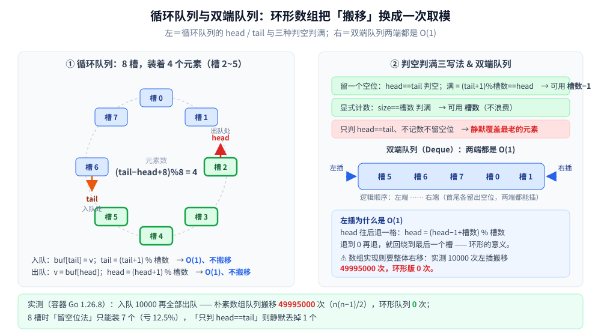

# 双端队列与循环队列

> 覆盖队列的两个**结构变体**：**循环队列**（把线性数组弯成环，让"出队"不再搬移）与
> **双端队列 Deque**（两端都能进出，拿下「两头都要 O(1)」）。
>
> ⭐ 边界：栈与队列的**基本形态**（LIFO / FIFO、链式存储、上磁盘后目标怎么变）在
> [栈与队列.md](栈与队列.md) —— 那篇把这两个变体只列了一行。本篇是它们的**展开**：形态、判空判满的三种写法、以及两端 O(1) 的来处。
>
> 内容整理自个人学习笔记，素材见 [素材清单](../../../素材清单.md)。
> 📎 本篇所有读数均为**容器实跑逐字抄录**：**Go 1.26.8（linux/amd64，`golang:1.26-alpine`）**；
> 只数「搬移次数」不依赖计时，跑两遍输出**逐行相同**。
>
> 全目录的判据与选型总表见 [README.md](../README.md)。

---

## 一、循环队列解决什么问题？

**本节要点**：数组队列的"出队"如果不搬移，`head` 就会一路右移、把左边的空间永久浪费掉；**环形数组用一次取模把空间接回开头**，于是出队退化成"动一下下标"。

**朴素数组队列的两条路都有代价**：

| 写法 | 出队动作 | 代价 |
|---|---|---|
| `data = data[1:]` | 只动切片头 | ⚠️ **底层数组不断右移、左边空间永远回不来**（看似 O(1)，实为内存泄漏式的假象） |
| `copy(data, data[1:])` | 真搬移 | ⚠️ **`O(n)` 每次**，且与"队列"该有的 `O(1)` 背道而驰 |
| ⭐ **环形数组** | `head = (head+1) % 槽数` | `O(1)`，空间**循环复用** |

```go
func (q *Ring) Push(v int) bool {
	if q.Full() {
		return false
	}
	q.buf[q.tail] = v
	q.tail = (q.tail + 1) % len(q.buf) // 取模 = 回绕
	return true
}

func (q *Ring) Pop() (int, bool) {
	if q.Empty() {
		return 0, false
	}
	v := q.buf[q.head]
	q.head = (q.head + 1) % len(q.buf)
	return v, true
}
```

> ⭐ **`% 槽数` 就是"环形"的全部魔法**：它把"下标越界"变成"回到开头"。
> 
> ⚠️ 代价是**容量必须预先固定**（槽数是数组长度）—— 所以环形队列天然是**有界队列**：满了就拒绝或覆盖，这正是 [栈与队列.md](栈与队列.md) 说的"长度必须有上界"的落地形态。



## 二、判空判满三种写法，各丢什么？

**本节要点**：`head == tail` **既能表示空、也能表示满** —— 这是环形队列唯一的结构性难题，三种解法各让渡一样东西。

| 写法 | 判空 | 判满 | 让渡了什么 |
|---|---|---|---|
| ⭐ **留一个空位** | `head == tail` | `(tail+1) % 槽数 == head` | **丢一个槽**（可用容量 = 槽数 − 1） |
| ⭐ **显式计数** | `size == 0` | `size == 槽数` | **多维护一个字段**（但容量不浪费） |
| ⚠️ **只判 `head == tail`** | `head == tail` | `head == tail` | ❌ **空与满无法区分** → 静默覆盖最老的元素 |
| 标志位（`flag`） | `head==tail && !flag` | `head==tail && flag` | 多一个布尔字段，容量不浪费（较少用） |

**实测（8 个槽）**：

```text
== 场景二：8 个槽，三种判空判满写法能装几个 ==
留一个空位（head==tail 判空）：能装 7 个 → 可用容量 = 槽数 − 1 = 7
显式计数（size 字段）：       能装 8 个 → 可用容量 = 槽数 = 8
只判 head==tail、不记数不留空位：推入 8 个，静默丢掉 1 个（读到的是后来的 7 个）
```

> ⭐ **怎么选**：**槽越少，"留空位"越亏** —— 8 槽亏 12.5%，1024 槽只亏 0.1%。
所以**固定大容量的环形缓冲**（日志、音频、网络收发）普遍用"留空位"（简单、无额外字段）；**小容量或算得紧的场景**用计数法。
>
> ⚠️ 第三种写法**绝不能用于生产**：它不报错、只是**悄悄丢掉最老的元素** —— 在"丢数据"是事故的场景里，这种静默是最坏的一类失败。

## 三、双端队列：为什么"两端都 O(1)"需要环形数组？

**本节要点**：单链表只能从一头 `O(1)`，双链表的两端 `O(1)` 但要付**每个节点的指针税**；**环形数组两端都是 `O(1)` 且没有指针税**，代价是容量固定。

```go
func (d *Deque) PushFront(v int) {
	d.head = (d.head - 1 + len(d.buf)) % len(d.buf) // 往后退一格，退到头就回绕
	d.buf[d.head] = v
	d.size++
}

func (d *Deque) PushBack(v int) {
	d.buf[(d.head+d.size)%len(d.buf)] = v // 逻辑下标 → 物理下标
	d.size++
}
```

⭐ **三种实现的路数不一样**：

| 实现 | 两端插入 | 代价 |
|---|---|---|
| 数组 + 左端搬移 | 左端 `O(n)` | 实测 10000 次左插搬移 **49995000** 次 |
| 双向链表 | 两端 `O(1)` | 每节点两个指针 + 指针追逐（缓存不友好，见 [数组与链表.md](数组与链表.md)） |
| ⭐ **环形数组** | 两端 `O(1)` | **无指针税、内存连续**；⚠️ 容量固定（满了要么拒绝、要么扩容重建） |

⚠️ **环形数组的唯一硬伤是扩容**：满了之后不能像切片那样原地增长（元素被"劈成两段"），
必须**新开一块连续内存 + 把两段按逻辑顺序拷过去** —— 所以它的典型形态是**定长 + 满即拒绝/覆盖**，
而不是像 Go 的 `slice` 那样摊还增长。

## 四、实测：搬移量

**口径**：入队 10000 个、再全部出队；两端的插入各 10000 次。

```text
== 场景一：入队 10000 个再全部出队 ==
朴素数组队列：出队时搬移元素累计 49995000 次（= n(n−1)/2 = 49995000）
环形队列：    出队时搬移元素累计 0 次（只动 head 下标）
⭐ 两者出队顺序完全一致（校验和相同 = true），搬移量却是 49995000 : 0

== 场景三：两端各插入 10000 次 ==
数组实现的双端队列：左端插入累计搬移 49995000 次（= n(n−1)/2）
环形双端队列：      左端插入 0 次搬移；右端插入 10000 次也 0 次搬移
```

⭐ **`n(n−1)/2` 这个数值得记住**：它不是"大概很多"，而是**等差数列求和**给出的精确值 ——
每出队一次就搬"当前剩余全部"，于是总搬移量 = `n + (n−1) + … + 1 = n(n−1)/2`。
**把它换成一次取模，就是环形队列的全部收益**。⚠️ 不过注意：`O(n²)` 只出现在"用会搬移的数组"时；**用切片头偏移的写法**（`data = data[1:]`）在语言层面是 `O(1)` 的，代价换成了**底层数组不回收**。

> 🔧 **可复现性说明**：本实验只数"搬移次数"，不依赖 `time.Now()`（本机分辨率 ≈ 1ms，单次队列操作远低于它，计时会全是噪声）。

## 使用：这两个结构在你的系统里以什么形式出现

**第一层：有界缓冲 / 环形日志。** 网络收发缓冲、日志的 ring buffer、音频设备的 DMA 缓冲 —— 都是"定长 + 满即覆盖/阻塞"的环形队列。⚠️ 这里**"静默覆盖"往往是有意设计**（保留最新 N 条），所以必须显式告诉调用方丢了多少。

**第二层：滑动窗口。** 限流与滑动窗口最大值都靠"环形数组 + 过期淘汰"（见 [单调栈与单调队列.md](../高级数据结构/单调栈与单调队列.md)）；时间轮的槽数组也是同一个环形数组（见 [时间轮.md](../高级数据结构/时间轮.md)）。

**第三层：BFS 与双向 BFS。** 图的层序遍历用队列，[BFS广度优先遍历.md](../../算法/图论算法/图的遍历/BFS广度优先遍历.md) 里"0-1 BFS"还要**双端队列**（0 权边从队首入、1 权边从队尾入）。

**第四层：你可以借用它的思路。** 环形的通用形态是"**让下标自己回绕，而不是搬数据**" ——
⭐ 只要有"循环复用一段固定空间"的需求（连接池、缓冲区、任务槽位），都能把"移动数据"换成"移动指针取模"。

---

## 延伸追问

- **环形队列为什么必须留一个空位（或用计数）？** → 因为 `head == tail` 同时是"空"和"满"的候选条件；留空位让"满"永远不出现 `head==tail`，计数法直接另存 `size`。⚠️ 什么都不做就分不清空与满，结果是**静默覆盖最老的元素**。
- **环形队列的容量为什么是有界的？** → 槽数就是数组长度，物理上不能原地增长（元素会被劈成两段）。所以它的定位是**定长缓冲**：满了拒绝或覆盖，而不是像切片那样摊还扩容。
- **Deque 用链表还是环形数组？** → 要**无界**或频繁中间插入 → 双向链表；要**内存连续 + 无指针税 + 定长** → 环形数组。⚠️ 链表版每个节点两个指针，且指针追逐对缓存不友好（见 [数组与链表.md](数组与链表.md)）。
- **`head = (head+1) % n` 的取模开销大吗？** → 当 `n` 是 **2 的幂**时可以写成 `head = (head+1) & (n-1)`（位与），省掉除法。⭐ 这也是很多环形缓冲把容量取成 2 的幂的原因（与 [布谷鸟过滤器.md](../高级数据结构/布谷鸟过滤器.md) 要求桶数为 2 的幂同源）。
- **为什么"删掉最老元素"有时是 bug 有时是特性？** → 看语义：**保留最新 N 条**（日志、监控采样）时覆盖是特性；**事件队列**里丢事件就是 bug。⭐ 判据是"这条数据的价值是否随时间衰减"。
- **它和"循环队列"是同一个词吗？** → 中文里"循环队列"专指**环形数组实现的 FIFO 队列**；Deque 是"两端都能操作的队列"，**用环形数组实现 Deque** 是最常见的搭配。

---

## 关联

- [栈与队列.md](栈与队列.md) — **前置**：队列的基本形态、链队列、上磁盘后设计目标为什么变
- [数组与链表.md](数组与链表.md) — 环形数组 vs 双向链表：连续内存与指针税的取舍
- [单调栈与单调队列.md](../高级数据结构/单调栈与单调队列.md) — 滑动窗口最大值：环形数组 + 过期淘汰
- [时间轮.md](../高级数据结构/时间轮.md) — 同一个环形数组，槽里换成了任务链表
- [BFS广度优先遍历.md](../../算法/图论算法/图的遍历/BFS广度优先遍历.md) — 队列 / 双端队列在 0-1 BFS 里的用法
- [滑动窗口.md](../../算法/基础算法/滑动窗口.md) — 窗口的左右端点推进与环形的"过期"是同一件事的两个视角
- [并发容器.md](../../../01-编程语言/java/并发/并发容器.md) — `ArrayDeque` / `ArrayBlockingQueue` 的工程形态
- [README.md](../README.md) — 数据结构目录的选型总表（操作 × 隐藏代价 × 场景）
