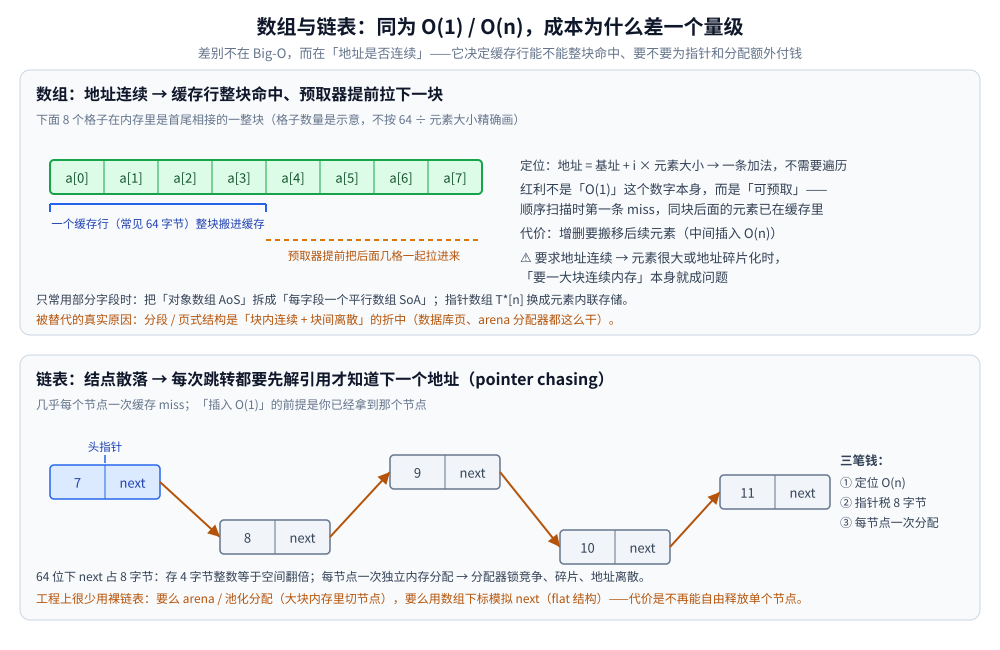

# 数组与链表

> 覆盖**线性结构**里最基础的一对：数组（顺序存储）与链表（链式存储）的特性、优缺点、适用场景，
> 以及「同为 O(n) / O(1) 时成本为什么差一个量级」的工程推导。
>
> 素材来源：博客 [数据结构](https://blog.csdn.net/weixin_43837229/article/details/103222660)（2019-11-24）——
> 本篇取该文的「数组」「链表」两节；两段**工程推导**为本次整理补充，参考《数据结构和算法图解》（杰伊·温格罗）与《算法图解》（巴尔加瓦）。
>
> 全目录的判据（「数据怎么存」归本篇所在目录）与选型总表见 [README.md](../README.md)。

---

## 一、数组（Array）的特点与适用场景？

**本节要点**：数组的红利不是「O(1) 存取」这个数字本身，而是**地址连续**带来的可预取性；它的代价也全来自「必须连续」。

数组是用于储存多个相同类型数据的集合。它占据一块**连续的内存**，属于**顺序存储结构**。创建时必须指定容量大小，再按容量分配内存。数组可以说是线性表的顺序存储结构。

| 维度 | 说明 |
|---|---|
| **优点** | 内存连续，存取时间性能为 **O(1)**，时间效率很高 |
| **缺点** | ① 需要预先知道数据规模、申请内存大小；② 插入、删除效率低（需搬移后续元素） |
| **应用场景** | ① 数据量小；② 数据大小已知；③ 存取/修改操作多，插入删除少 |

### 工程推导：数组真正的优势不是"O(1)"，而是"可预取"

下标访问只是免掉遍历，真正的红利是**硬件会自动预取**：CPU 按**缓存行（常见 64 字节**）整块搬数据，顺序扫数组时第一条 miss 之后同块元素已在缓存里、预取器还会提前拉后面的块；链表的 `next` 却必须**先解引用才知道下一个地址在哪**（pointer chasing），几乎每个节点一次 miss。**同为 O(n)，实际耗时差可以大到抹平算法层面的差异**——这就是 Big-O 之外必须看常数与局部性的原因（汇总见 [README.md](../README.md) 的隐藏代价总表）。推论：只常用部分字段时把"对象数组（AoS）"拆成"每字段一个平行数组（SoA）"；指针数组 `T*[n]` 换成元素内联存储。

> ⚠️ 代价：数组要求**地址连续**。元素很大或地址空间碎片化时，"要一大块连续内存"本身就成问题——这是它存大对象时被"分段/页式"结构替代的真实原因（数据库页、arena 分配器都是"块内连续 + 块间离散"的折中）。

## 二、链表（Linked List）有哪些变体？比数组强在哪？

**本节要点**：链表的「O(1) 插入」有**前提**（已定位到节点），并且要额外付指针税与分配税；工程上很少用裸链表。

链表是一种物理存储单元上**非连续、非顺序**的存储结构，数据元素的逻辑顺序通过链表中的**指针链接次序**实现。链表由一系列结点组成，结点可在运行时动态生成；每个结点包括**数据域**（存储数据元素）和**指针域**（存储下一个结点地址）。

相比线性表的顺序结构，链表插入时可达 **O(1)**（顺序表插入需搬移元素），但查找或访问特定编号的结点需要 **O(n)**。

| 维度 | 说明 |
|---|---|
| **优点** | ① 克服了数组需预先知道数据大小的缺点，可灵活动态管理内存；② 插入、删除时间复杂度为 O(1) |
| **缺点** | ① 没有数组随机读取的优点，读取复杂度 O(n)；② 增加了指针域，空间开销较大 |
| **应用场景** | ① 不需要预先知道数据大小；② 插入删除操作多、存取操作少的场景 |

**常见变体**：单链表、双向链表、循环链表；跳表（skip list）可视为在链表上叠加多级索引，把查找降到 O(log n)，Redis 的 ZSet 就用它（结构细节见 [平衡树.md](../树/平衡树.md) 的跳表一节）。

### 工程推导：链表的"O(1) 插入"要额外付三笔钱

教科书说链表插入 O(1)，**前提是你已经拿到那个位置的节点**：① **定位仍是 O(n)**，O(1) 只省掉搬移；② **每节点一笔指针税**（64 位下 `next` 占 8 字节，存 4 字节整数等于空间翻倍）；③ **每节点一次独立内存分配**（分配器锁竞争、碎片、地址离散 → 回到上一节的 cache miss）。所以工程上很少用"裸链表"：要么 **arena/池化分配**（大块内存里切节点），要么**用数组下标模拟 next**；代价是不再能自由释放单个节点。

---

## 延伸追问

- **数组和链表的本质区别？** → 内存连续性决定的：数组靠偏移量 O(1) 定位但增删要搬移，链表靠指针 O(n) 遍历但增删只改指针。
- **为什么说"数组的 O(1) 比链表的 O(1) 更值钱"？** → 数组地址连续，CPU 预取器与缓存行能整块命中；链表的下一节点地址要先解引用才知道，几乎每个节点一次缓存 miss。
- **链表插入什么时候真的更快？** → 已经握着那个节点（或节点句柄/迭代器）时，插入只改两个指针、不搬任何元素；需要按第 k 个位置定位时，链表光定位就 O(n)，优势全无。
- **为什么工程上很少直接用裸链表？** → 每节点一笔指针税加一次独立分配，碎片与局部性都差；实际做法是池化/arena 分配，或用数组下标当"指针"（flat 结构）。

---

## 关联

- [栈与队列.md](栈与队列.md) — 同属线性结构、但运算受限的两种
- [散列表.md](../哈希表/散列表.md) — 桶数组 + 链表组合出的散列表
- [README.md](../README.md) — 选型对照表与「结构 × 隐藏代价」总表
- [复杂度分析.md](../../算法/基础算法/复杂度分析.md) — Big-O 与摊还分析的口径
- [map.md](../../../01-编程语言/go/类型与语法/map.md) — Go 里数组/切片的连续性与扩容
- [集合容器.md](../../../01-编程语言/java/集合容器.md) — `ArrayList` 与 `LinkedList` 的真实取舍
> 反向引用（本篇被下列文档引到）：[跳跃表.md](../高级数据结构/跳跃表.md)、[LCS.md](../../算法/动态规划/LCS.md)、[LIS.md](../../算法/动态规划/LIS.md)、[背包问题.md](../../算法/动态规划/背包问题.md)、[八皇后.md](../../算法/回溯/八皇后.md)、[二分查找.md](../../算法/基础算法/二分查找.md)、[双指针.md](../../算法/基础算法/双指针.md)
