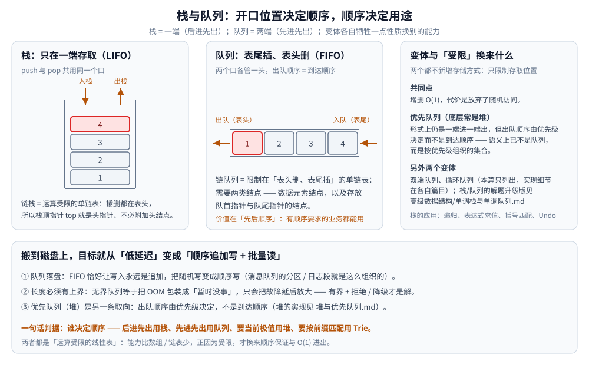

# 栈与队列

> 覆盖两种**运算受限的线性表**：栈（LIFO）与队列（FIFO）的存储形态、各自解决的问题，
> 以及队列「上磁盘」之后设计目标为什么会变。
>
> 素材来源：博客 [数据结构](https://blog.csdn.net/weixin_43837229/article/details/103222660)（2019-11-24）——
> 本篇取该文的「栈和队列」一节；「工程推导」为本次整理补充。
>
> 全目录的判据与选型总表见 [README.md](../README.md)。

---

## 一、栈（Stack）和队列（Queue）与一般线性表差在哪？

**本节要点**：两者都不新增存储方式，只是**限制存取位置**——限制本身就是它们的价值（顺序保证 / 撤销能力）。

栈和队列都是**运算受限的线性表**——限制体现在"只能在特定位置进行插入和删除"。存储上两者都可以用数组（顺序）或链表（链式）实现，所以**先有线性表，再有栈与队列**。

## 二、栈为什么是后进先出？解决什么问题？

**本节要点**：栈的本质是「把最后发生的最新处理」，链栈的 `top` 就是头指针，因此不需要头结点。

栈只能从表的一端存取数据，遵循**先进后出**原则。栈的链式存储结构称为**链栈**，是运算受限的单链表，插入和删除只能在表头位置进行——因此链栈没必要像单链表那样附加头结点，**栈顶指针 top 就是链表的头指针**。

**应用**：

- 实现递归（函数调用栈）
- 四则运算表达式求值（中缀转后缀）
- 括号匹配、撤销操作（Undo）

## 三、队列为什么是先进先出？变体有哪些？

**本节要点**：队列的价值在"先后顺序"；变体各自牺牲一点 FIFO 换别的能力。

队列是只允许在一端插入、在另一端删除的线性表，遵循**先进先出**（First In First Out）原则。其链式存储结构称为**链队列**，是限制仅在表头删除、表尾插入的单链表，需要两类不同的结点：数据元素结点，以及存放队首指针和队尾指针的结点。

**应用**：

- 各种 MQ 的实现思路
- 有先后顺序要求的业务都可使用
- 变体：双端队列、循环队列、优先队列（底层常是堆）

### 工程推导：队列一旦"上磁盘"，设计目标就变了

内存队列 O(1) 进出，但容量被内存卡死；搬上磁盘后目标从"低延迟"变成"**顺序追加写 + 批量读**"——FIFO 恰好让写入永远是追加，把随机写变成顺序写（详见 [Kafka.md](../../../03-数据与中间件/中间件/消息队列/Kafka.md)）。两条结论必须一起说：**① 长度必须有上界**（无界队列等于把 OOM 包装成"暂时没事"，只会把故障延后放大，有界 + 拒绝/降级才是解）；**② 优先队列（堆）是牺牲 FIFO 换"重要任务先跑"**，本质已不是队列而是按优先级组织的集合（堆的实现与性质见 [堆与优先队列.md](../树/堆与优先队列.md)）。

---

## 延伸追问

- **栈和队列的共同点是什么？** → 都是运算受限的线性表：只开放一端或两端做增删，因而增删都是 O(1)，代价是**放弃了随机访问**。
- **为什么链栈不用附加头结点？** → 插入删除都在表头，栈顶指针本身就能定位表头；加头结点反而多一层判空。
- **优先队列还是队列吗？** → 形式上是（一端进一端出），语义上不是：出队顺序由优先级决定而不是到达顺序，所以底层用堆而不是链表。
- **无界队列为什么在生产环境是隐患？** → 它把内存压力藏起来，消费一慢就堆积到 OOM；工程解法是有界容量 + 拒绝或降级策略。

---

## 关联

- [数组与链表.md](数组与链表.md) — 栈与队列的两种底层存储
- [双端队列与循环队列.md](双端队列与循环队列.md) — 上文那两个「变体」的展开：环形数组、判空判满三写法、两端 O(1)
- [堆与优先队列.md](../树/堆与优先队列.md) — 优先队列的实现层（上浮下沉、O(n) 建堆、Top-K）
- [单调栈与单调队列.md](../高级数据结构/单调栈与单调队列.md) — 栈/队列的解题用法升级版
- [BFS广度优先遍历.md](../../算法/图论算法/图的遍历/BFS广度优先遍历.md) — 队列作为 BFS 的容器
- [README.md](../README.md) — 选型对照表与「结构 × 隐藏代价」总表
- [Kafka.md](../../../03-数据与中间件/中间件/消息队列/Kafka.md) — 队列落到磁盘上的工程形态
> 反向引用（本篇被下列文档引到）：[图的表示与存储.md](../图/图的表示与存储.md)、[全排列.md](../../算法/回溯/全排列.md)、[八皇后.md](../../算法/回溯/八皇后.md)、[数独.md](../../算法/回溯/数独.md)、[拓扑排序.md](../../算法/图论算法/拓扑排序.md)、[Bellman-Ford.md](../../算法/图论算法/最短路/Bellman-Ford.md)、[滑动窗口.md](../../算法/基础算法/滑动窗口.md)、[递归与分治.md](../../算法/基础算法/递归与分治.md)
