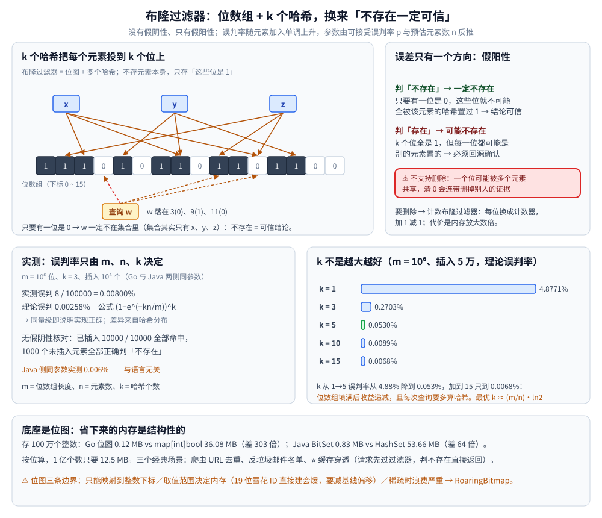

# 位图与布隆过滤器

> 素材来源：博客 [BitMap(一)：位图算法简介](https://blog.csdn.net/weixin_43837229/article/details/92582482)（2019-11-08）、[BitMap(二)：布隆过滤器(Bloom Filter)](https://blog.csdn.net/weixin_43837229/article/details/92583020)（2019-11-09）、[BitMap(三)：RoaringBitmap](https://blog.csdn.net/weixin_43837229/article/details/95905523)（2019-11-09）—— 三篇同属一个系列，此处合并为一篇。
>
> 位图的原理、优缺点与应用、布隆过滤器如何用多个哈希把误判压到可接受、RoaringBitmap 的分块压缩思路，以及三者的 Go / Java 实现与本机实测（误判率、内存对比）。
>
> 布隆过滤器在缓存穿透里的落位见 [缓存问题与方案.md](../../../03-数据与中间件/数据存储/缓存/缓存问题与方案.md)；目录总纲见 [README.md](../README.md)。

---

## 一、位图（BitMap）是什么？它解决什么问题？

位图的核心思想是**用 bit 数组记录 0/1 两种状态**，把具体数据映射到比特数组的某个位置：该位为 0 表示数据不存在，为 1 表示存在。

**原理解析**（原文的例子）：给定长度 10 的位图，每一位对应 0~9 中的一个整数，初始全为 0；把 4 存入位图，就把下标 4 的置为 1；再存 2，就把下标 2 的置为 1。判断某个数在不在，只需看对应下标是不是 1。

⭐ 关键在于**把「存数据」变成了「存状态」**：不保存元素本身，只保存「它出现过」这一个 bit。适用于**大规模数据、但数据状态不多**的场景——通常是判断某个数据存在或不存在。

### 1.1 优缺点

| 维度 | 说明 |
| --- | --- |
| **优点** | 适合大数据量下的快速去重与快速查询；**占用内存极少**（1 亿个数只需 12.5 MB） |
| **缺点 1：数据碰撞** | 把字符串映射到 BitMap 时会有碰撞——换成 **Bloom Filter**（多个哈希函数降低冲突概率）来解决 |
| **缺点 2：数据稀疏** | 要存 `(10, 8887983, 93452134)` 这三个数，就得建长度 99999999 的位图，绝大部分位是浪费的——用 **RoaringBitmap** 解决 |

### 1.2 典型应用

- 大规模数据去重（爬虫 URL 去重、用户签到）
- 快速判断「某元素是否存在于大集合」（垃圾邮件过滤、缓存 key 是否存在）
- 布隆过滤器与 RoaringBitmap 的底座
- 数据库与搜索引擎里的位图索引（如 Elasticsearch 的 filter 缓存、ClickHouse 的 bitmap 类型）

---

## 二、布隆过滤器：用多个哈希把误判压下来

布隆过滤器（Bloom Filter）是位图的一个应用，但**优于朴素位图**。

**原理**：用哈希函数把集合元素映射到位数组的某一位。如果该位已是 1，说明这个元素可能已存在。为了减少哈希冲突，**引入多个哈希函数**——只要其中一个哈希算出「该位是 0」，就说明元素**一定不在**集合中；只有所有哈希函数都指向 1，才判定「可能存在」。

⭐ 由此得到布隆过滤器最重要的性质：**没有假阴性，只有假阳性**。

- 判「不存在」→ **一定不存在**（可信）
- 判「存在」→ **可能不存在**（需回源确认）

**举例**（原文）：三个哈希函数，集合里有 x、y、z，分别映射到位数组的若干位；判断 w 时也用同样的三个哈希映射，只要有一位是 0，就说明 w 不在集合里。



### 2.1 优缺点

| 维度 | 说明 |
| --- | --- |
| **优点** | 极快（多个哈希 + 位运算，时间复杂度 O(1)）；**极省内存**（比存原值小几个数量级） |
| **缺点 1：误判不可避免** | 只能通过**更多哈希函数、加大位数组、白名单兜底**来降低概率 |
| **缺点 2：需要另维护一个集合** | 因为过滤器本身不保存元素，某些场景（如需要枚举）要额外存一份 Key |
| **缺点 3：不支持删除** | 见下面的「为什么不能删」 |

⚠️ **为什么不能删除单个元素**：一个位可能被多个元素共享，把某位清 0 会同时「删掉」其它元素的证据，产生**假阴性**（判不存在但实际存在）——这破坏了布隆过滤器最基本的保证。要支持删除得用**计数布隆过滤器（Counting Bloom Filter）**：把每个位换成计数器，加 1 减 1；代价是内存放大数倍。

### 2.2 三个经典使用场景（原文）

1. **网页爬虫 URL 去重**，避免重复抓取同一个地址；
2. **反垃圾邮件 / 垃圾短信**：从数十亿的名单里判断某个邮箱是否为垃圾；
3. ⭐ **缓存穿透**：把所有可能存在的 key 放进布隆过滤器，请求先过过滤器，不存在直接返回，避免大量无效请求打到缓存和数据库。

---

## 三、RoaringBitmap 为什么能又快又省

RoaringBitmap 的思路是**分块 + 按稠密程度换容器**：

1. 把 32 位整数范围划分成 **2¹⁶ 个数据块（Chunk）**，每个块对应整数的**高 16 位**；
2. 每个块用一个**容器（Container**）存放低 16 位，容器保存在动态数组里作为一级索引；
3. 容器有两种结构：**数组容器（Array Container**）存稀疏数据、**位图容器（Bitmap Container**）存稠密数据——**块内整数少于 4096 个用数组，超过就用位图**。

这样每块都能选最适合自己的表示，做位运算（AND / OR / XOR）时也有针对两种容器组合的高效算法，因此**在存储与计算性能上都表现优秀**。原文的表述是：Roaring Bitmap 是「超常规的压缩 BitMap」，速度比未压缩的 BitMap 快上百倍。

⚠️ 补充一句工程背景：RoaringBitmap 的真实用武之地是**稀疏的大整数集合**（如 Lucene / Elasticsearch 的倒排位图、ClickHouse 的 bitmap 聚合、Druid 的预聚合）。**数据稠密且连续时，朴素位图反而更简单更快**——分块与容器本身也有元数据开销。

---

## 四、实现一：Go（位图 + 布隆过滤器）

位图用 `[]uint64` 实现，每一位对应一个整数：

```go
type BitMap struct {
	bits []uint64
}

func NewBitMap(n int) *BitMap { return &BitMap{bits: make([]uint64, (n+63)/64)} }

func (b *BitMap) Set(i int)      { b.bits[i>>6] |= 1 << uint(i&63) }          // i/64 定位到 word，i%64 定位到 bit
func (b *BitMap) Get(i int) bool { return b.bits[i>>6]&(1<<uint(i&63)) != 0 } // 取对应位是否为 1
func (b *BitMap) Bytes() int     { return len(b.bits) * 8 }
```

布隆过滤器在其上叠加「双哈希构造 k 个位置」：

```go
type Bloom struct {
	m    uint64 // 位数组长度
	k    uint   // 哈希个数
	bits *BitMap
}

func (f *Bloom) pos(s string, i uint) uint64 {
	a, b := hash64(s)                     // 两个独立哈希
	return (a + uint64(i)*b) % f.m        // Kirsch-Mitzenmacher 双哈希：h1 + i*h2
}

func (f *Bloom) Add(s string) {
	for i := uint(0); i < f.k; i++ {
		f.bits.Set(int(f.pos(s, i)))
	}
}

func (f *Bloom) Exists(s string) bool {
	for i := uint(0); i < f.k; i++ {
		if !f.bits.Get(int(f.pos(s, i))) {
			return false // 有一位是 0 → 一定不存在
		}
	}
	return true // 全是 1 → 可能存在
}
```

⭐ 用「两个哈希 + 线性组合」模拟 k 个独立哈希（`h1 + i*h2`）是布隆过滤器的标准实现技巧，省掉 k 次真实哈希计算。

**实测（go1.26.5）：**

```text
===== 1. 位图 vs map 的内存占用（存 100 万个 int）=====
位图      : 1000000 个位 = 125000 字节 ≈ 0.12 MB
置 1 的位数: 1000000
map[int]bool: 约 36.08 MB（含哈希桶与扩容冗余）
   → 同样 100 万个整数，位图 0.12 MB vs map 36.08 MB，相差约 303 倍

===== 2. 布隆过滤器误判率实测（m=10^6 位，k=3，插入 10^4 个）=====
实测误判    : 8 / 100000 = 0.00800%
理论误判    : 0.00258%   （公式 (1-e^(-kn/m))^k）
   → 两者同量级即说明实现正确；差异来自哈希分布

===== 3. 不存在的元素一定能被排除（无假阴性）=====
1000 个未插入元素中，被正确判为「不存在」: 1000
已插入元素全部命中: 10000 / 10000（必须 100%，否则哈希实现有 bug）

===== 4. 误判率随参数变化（m 固定 10^6 位，插入 5 万）=====
  k     理论误判率
  1     4.8771%
  2     0.9056%
  3     0.2703%
  4     0.1080%
  5     0.0530%
  7     0.0196%
  10    0.0089%
  15    0.0068%

===== 5. 位图的实际用途：去重统计 =====
100 万次随机取值中，重复命中 48410 次（去重后剩 951590 个不同值）
位图占用 1250000 字节 ≈ 1.19 MB（存 1000 万个数）
```

⭐⭐ 这张表里有三个值得记住的数字：

- **位图 vs map 内存差 303 倍**（0.12 MB vs 36.08 MB，同样存 100 万个数）——这是「用状态代替数据」的收益；
- **实测误判率 0.008% 与理论 0.00258% 同量级**——说明实现正确（差异来自 FNV 哈希在该数据集上的分布）；
- **k 不是越大越好**：k 从 1→5 误判率从 4.88% 降到 0.053%，但继续加到 15 只降到 0.0068%——**位数组被填满后收益递减**，且每次查询要多算哈希。最优 k ≈ `(m/n)·ln2`。

---

## 五、实现二：Java（BitSet + 布隆过滤器）

JDK 自带位图就是 `java.util.BitSet`，底层是 `long[]`，扩容按 64 位向上取整。

```java
BitSet bs = new BitSet(10);
bs.set(4);
bs.set(2);
bs.get(4);          // true
bs.get(3);          // false
bs.cardinality();   // 2 —— 置 1 的位数
bs.size();          // 64 —— 注意：是「用到的位数」，不是容量
bs.clear(2);        // 清位
```

⚠️ **`size()` 是陷阱**：它返回「实际用到的位数」（按 64 对齐向上取整），不是构造时传的容量；`length()` 是最高置位下标 +1。想知道占用内存要看底层 `long[]` 长度（≈ `size()/8` 字节）。

用 `BitSet` 实现布隆过滤器（`pos` 与 Go 版同样的双哈希构造）：

```java
private long pos(String s, int i) {
	byte[] data = s.getBytes(StandardCharsets.UTF_8);
	long h1 = fnv1a64(data);
	long h2 = fnv1_64(data);
	if (h2 == 0) {
		h2 = 1;
	}
	return Math.floorMod(h1 + (long) i * h2, m);
}

void add(String s) {
	for (int i = 0; i < k; i++) {
		bits.set((int) pos(s, i));
	}
}

boolean exists(String s) {
	for (int i = 0; i < k; i++) {
		if (!bits.get((int) pos(s, i))) {
			return false;
		}
	}
	return true;
}
```

**实测（JDK 1.8，同样 m=10⁶、k=3、插入 10⁴，与 Go 版参数一致）：**

```text
===== 1. BitSet 基础操作 =====
set(4)、set(2) 后：get(4)=true，get(3)=false
cardinality()=2，size()=64（size 是「用到的位数」，不是容量）
clear(2) 后 cardinality()=1

===== 2. 布隆过滤器误判率（参数与 Go 版一致）=====
实测误判 : 6 / 100000 = 0.00600%
理论误判 : 0.00258%
位数组中置 1 的位数: 29462 / 1000000 = 2.95%（填充率越低误判越少）

===== 3. 无假阴性（已插入的必须全部命中）=====
命中 10000 / 10000

===== 4. BitSet vs HashSet 的内存（存 100 万个 int）=====
BitSet   : 约 0.83 MB
HashSet<Integer>: 约 53.66 MB
   → HashSet 是 BitSet 的 64 倍（每个 Integer 对象 + 哈希桶指针的开销）

===== 5. 误判率随 k 变化（m=10^6，n=5×10^4）=====
  k=1   理论误判率 4.8771%
  k=3   理论误判率 0.2703%
  k=5   理论误判率 0.0530%
  k=10  理论误判率 0.0089%
  k=15  理论误判率 0.0068%
```

⭐ 两点跨语言对照：

- **误判率几乎一致**（Java 0.006% vs Go 0.008%，理论 0.00258%）——因为参数与哈希构造相同，**误判率只由 m、n、k 决定，与语言无关**；
- **内存对比语言间差异更大**：Go 里位图 0.12 MB / map 36 MB（差 303 倍），Java 里 BitSet 0.83 MB / HashSet 54 MB（差 64 倍）。Java 侧 BitSet 的 0.83 MB 里含 JVM 运行时开销（实际 `long[]` 只需 125 KB），而 Stack 上 `Integer` 的对象头开销比 Go 的 `int` 更重。**两者的共同结论一致：位图的量级优势是结构性的，不是实现细节。**

---

## 六、选型：什么时候用哪个

| 需求 | 选它 | 理由 |
| --- | --- | --- |
| 判断「某整数是否出现过」，取值范围**不大且稠密** | **位图**（`[]uint64` / `BitSet` / Redis `SETBIT`） | O(1) 且按位算，1 亿个数 12.5 MB |
| 判断「某元素是否存在」，**能容忍极小误判**、且**不需要枚举** | **布隆过滤器** | 比存原值省几个数量级；⚠️ 只能判「可能存在」 |
| 元素**稀疏**且是**无符号整数**、要压缩与集合运算 | **RoaringBitmap** | 分块 + 按稠密度换容器，比未压缩位图快上百倍 |
| 需要**删除**单个元素 | **计数布隆过滤器**，或改回普通集合 | 普通布隆过滤器清位会产生假阴性 |
| 分布式场景 | **Redis 的位图命令** | `SETBIT` / `GETBIT` / `BITCOUNT` / `BITOP` / `BITPOS`，多个客户端共享同一份状态 |

⚠️ **位图的三条边界**（选型时先排除）：

1. **只能映射到整数下标**——字符串要先哈希（有碰撞风险）或改成枚举映射；
2. **取值范围决定内存**：ID 是雪花算法生成的 19 位大整数时，直接建位图会爆内存（要减去基线偏移）；
3. **范围稀疏时浪费严重**：3 个分散的大整数就撑起整张位图 → 这时用 RoaringBitmap 或哈希集合。

在 Redis 中的典型用法（承接原文「PHP + Redis」的思路，改为通用命令）：

```bash
redis-cli SETBIT signin:2026-09:1001 30 1      # 用户 1001 在第 30 天签到
redis-cli GETBIT signin:2026-09:1001 30        # 1 —— 查某天是否签到
redis-cli BITCOUNT signin:2026-09:1001         # 统计本月签到天数
redis-cli BITOP AND active:both a:1 a:2        # 两个位图求交（如「两天都活跃的用户」）
redis-cli BITPOS signin:2026-09:1001 0         # 第一个 0 的位置 —— 常用于找第一个未签到日
```

⭐ 这条链路正是**布隆过滤器解决缓存穿透**的落点：把「可能存在的 key」写进 Redis 位图（或布隆过滤器），请求先 `GETBIT` 判断，不存在就直接返回——**用一次内存查位代替一次数据库查询**。具体方案见 [缓存问题与方案.md](../../../03-数据与中间件/数据存储/缓存/缓存问题与方案.md)。

---

## 延伸追问

- **布隆过滤器为什么会有误判，却没有漏判？** → 多个哈希都指向「已被别人置 1」的位 → **假阳性**（判存在但实际不存在）；而只要有一位的 0，就说明该元素的所有映射位不可能全被置 1 → **不存在**这个结论一定可靠。所以「不存在」可信、「存在」要回源确认。
- **为什么布隆过滤器不能删除元素？** → 一个位可能被多个元素共享，清 0 会连带删掉其它元素的证据，产生**假阴性**，破坏「不存在一定准确」的核心保证。要支持删除必须用**计数布隆过滤器**（每位换成计数器），代价是内存放大数倍。
- **参数怎么定？** → 由**可接受误判率 p** 和**预估元素数 n** 反推：位数组 `m ≈ -n·ln p / (ln 2)²`，哈希个数 `k ≈ (m/n)·ln 2`。实测印证了 k 越大越好是错的——k 从 5 加到 15，误判率只从 0.053% 降到 0.0068%，收益递减且每次查询更慢。
- **位图能省多少内存？** → 本机实测：同样存 100 万个整数，Go 位图 0.12 MB vs `map[int]bool` 36.08 MB（**303 倍**）；Java `BitSet` 0.83 MB vs `HashSet<Integer>` 53.66 MB（**64 倍**）。按位算，1 亿个数也只要 12.5 MB。
- **布隆过滤器和位图是什么关系？** → 布隆过滤器**建立在位图之上**：位图只支持「一个整数 → 一位」，布隆过滤器用 k 个哈希把任意元素映射到 k 位，从而支持字符串等任意类型，代价是引入误判。
- **什么时候该用 RoaringBitmap 而不是普通位图？** → 数据**稀疏**且是整数时。RoaringBitmap 按高 16 位分块、块内按稠密度在「数组容器」与「位图容器」之间切换，块内少于 4096 个整数用数组存——避免为几个值撑起一整张稀疏位图。数据稠密连续时普通位图反而更简单。
- **Redis 里怎么用位图？** → `SETBIT` / `GETBIT` / `BITCOUNT`（统计置位数）/ `BITOP`（位运算求交并差）/ `BITPOS`（找第一个 0/1）。典型场景是**签到统计**与**活跃用户求交**——注意位图 key 的偏移是「第几天/第几号」这类基线偏移，ID 很大时要先减基线。
- **布隆过滤器在缓存穿透里怎么用？** → 启动时把全部合法 key 刷进过滤器；请求先查过滤器，判「不存在」直接返回（**拦掉绝大多数无效请求**），判「可能存在」再去缓存/DB 查询。⚠️ 新增数据时要同步写过滤器，且过滤器**不支持删除**——数据下线频繁的场景要改用其它方案。

---

## 关联

- [散列表.md](../哈希表/散列表.md) — 散列表的退化路径与四道闸门
- [布谷鸟过滤器.md](布谷鸟过滤器.md) — 布隆的**可删除版本**：8 bit 指纹 + 两个候选桶 + 踢出（同空间量级下误判率 2.97% vs 布隆 2.14%，但能删）
- [README.md](../README.md) — 布隆过滤器在结构全景中的位置（选型总表的隐藏代价列）
- [缓存淘汰算法.md](../../../03-数据与中间件/数据存储/缓存/缓存淘汰算法.md) — 同为「用空间换时间」的经典算法（W-TinyLFU 的计数结构也是位图思想）
- [压缩算法.md](../../算法/压缩算法.md) — RoaringBitmap 的分块压缩与通用压缩的取舍
- [缓存问题与方案.md](../../../03-数据与中间件/数据存储/缓存/缓存问题与方案.md) — 缓存穿透的三种解法与布隆过滤器的落位
- [数据类型.md](../../../03-数据与中间件/数据存储/NoSQL/Redis/数据类型.md) — Redis 位图命令的实际用法
- [索引原理.md](../../../03-数据与中间件/数据存储/搜索与分析/Elasticsearch/索引原理.md) — 倒排表的分块位图压缩（与 Roaring 同一思路）
- [选型对比与落地案例.md](../../../03-数据与中间件/数据存储/列式数据库/ClickHouse/选型对比与落地案例.md) — Bitmap 用户画像的落位实测：20 张位图约 2.51 MB 替掉 25.8 MB 明细，标签交集的耗时与源表行数无关
- [素材清单.md](../../../素材清单.md) — 本篇的博客原文登记
- [商品详情页设计.md](../../../04-架构与系统/系统设计/秒杀系统/商品详情页设计.md) — 布隆过滤器在**缓存穿透**里的落位实测：前置后打库 1000 → 0，且连 Redis 都不用查
> 反向引用（本篇被下列文档引到）：[开放寻址与冲突解决.md](../哈希表/开放寻址与冲突解决.md)、[倒排索引.md](倒排索引.md)、[基数与频率估计.md](基数与频率估计.md)、[数独.md](../../算法/回溯/数独.md)、[位运算.md](../../算法/基础算法/位运算.md)、[摩尔投票.md](../../算法/基础算法/摩尔投票.md)、[底层结构.md](../../../03-数据与中间件/数据存储/NoSQL/Redis/底层结构.md)、[性能调优与基准测试.md](../../../03-数据与中间件/数据存储/列式数据库/ClickHouse/性能调优与基准测试.md)、[数据模型与表设计.md](../../../03-数据与中间件/数据存储/列式数据库/ClickHouse/数据模型与表设计.md)、[物化视图与实时聚合.md](../../../03-数据与中间件/数据存储/列式数据库/ClickHouse/物化视图与实时聚合.md)、[索引原理与查询优化.md](../../../03-数据与中间件/数据存储/列式数据库/ClickHouse/索引原理与查询优化.md)、[列式数据库选型对比.md](../../../03-数据与中间件/数据存储/列式数据库/列式数据库选型对比.md)、[缓存容量与治理.md](../../../03-数据与中间件/数据存储/缓存/缓存容量与治理.md)、[缓存应用场景.md](../../../03-数据与中间件/数据存储/缓存/缓存应用场景.md)、[缓存选型对比.md](../../../03-数据与中间件/数据存储/缓存/缓存选型对比.md)
