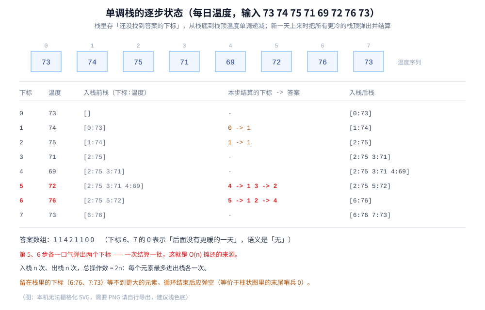

# 单调栈与单调队列

> 一类「**及时删掉永远不会成为答案的元素**」的线性技巧：栈里只留「还没找到答案」的下标、并让它保持单调。
> 覆盖单调栈的「下一个更大元素」与四种变体、柱状图最大矩形、接雨水、每日温度，
> 单调队列的滑动窗口最大值，以及两者共用的 `O(n)` **摊还论证**。
>
> ⭐ 边界：本篇是**全仓的第一次系统展开**（此前只有个别篇目顺带提一句）。
> 单调栈/队列**不是一种数据结构**，而是「**普通栈 / 双端队列 + 一条单调性维护规则**」的用法 ——
> 所以基础容器（栈、队列、双端队列）的定义见 [栈与队列.md](../线性结构/栈与队列.md)，这里只讲**怎么用、为什么对**。
>
> 内容整理自个人学习笔记，素材见 [素材清单](../../../素材清单.md)。摊还分析的口径见 [复杂度分析.md](../../算法/基础算法/复杂度分析.md)。
>
> 📎 本篇所有输出均为本机实跑逐字抄录：**Go 1.26.5（windows/amd64）** 与 **JDK 1.8.0_321** 各实现一份，
> 输出**逐行对齐**（去掉耗时行后 `diff` 为空）。

---

## 一、单调栈解决的是哪一类问题？

**本节要点**：单调栈专门回答「**每个元素左/右第一个比它大/小的元素在哪**」。栈里存的是**下标**（不是值），且这些下标对应的值保持单调 —— 这就是名字的来历。

### 1.1 「下一个更大元素」（NGE）

给定数组，对每个位置 `i` 求「**右边第一个比 `t[i]` 大的元素的下标**」。暴力是 `O(n²)`；单调栈是 `O(n)`。

规则三句话：

1. 从左往右扫，维护一个**存下标**的栈；
2. 每来一个新元素 `t[i]`，**把所有「值比它小」的栈顶弹出**——这些元素「下一个更大的」就是 `i`，答案当场结算；
3. 结算完把 `i` 入栈。

```go
func dailyTemperatures(t []int) []int {
	n := len(t)
	res := make([]int, n)
	st := []int{} // ⭐ 存下标；从栈底到栈顶，t 的值单调递减
	for i := 0; i < n; i++ {
		for len(st) > 0 && t[st[len(st)-1]] < t[i] {
			j := st[len(st)-1] // t[j] < t[i] → i 就是 j 的答案
			st = st[:len(st)-1]
			res[j] = i - j
		}
		st = append(st, i)
	}
	return res
}
```

⭐ **栈里存的是「还没找到答案的下标」** —— 一旦某个下标被弹出，它的问题就答完了、永远不再需要它。这是「及时删除」的第一层含义。

### 1.2 为什么单调栈是对的

直觉：**栈里留下的是「右边还没有更大元素出现」的那批下标**，而其中「更小的那些更靠右」—— 所以从栈底到栈顶，值单调递减。

**关键引理**：设弹 `j` 时用的是 `i`（即 `t[j] < t[i]`），则 **`i` 就是 `j` 右边第一个比 `t[j]` 大的位置**。

**证明**：反设存在 `k` 满足 `j < k < i` 且 `t[k] > t[j]`。那么 `k` 到来的那一刻，`j` 还在栈里（因为 `j` 直到 `i` 才被弹），而 `t[j] < t[k]` → 按规则 `j` **在 `k` 那一轮就被弹走了**，与「`j` 到 `i` 才被弹」矛盾。所以 `j` 与 `i` 之间没有更大的元素，`i` 就是第一个。∎

⭐ **一句话直觉版**：**`j` 与 `i` 之间的所有元素都比 `t[j]` 小（否则 `j` 早被它们弹走了）** —— 那么第一个能弹走 `j` 的 `i`，必然是右边第一个更大的。至于循环结束时**还留在栈里的**下标，它们的答案就是「不存在」。

### 1.3 四种变体

方向（求更大 / 更小）与位置（求右边 / 左边）两两组合，共四种；**循环数组**再叠一层：

| 需求 | 做法 | 栈的单调性 | 弹出时机 |
|---|---|---|---|
| **右边**第一个更大（NGE） | 从左往右扫 | 从底到顶**递减** | `t[栈顶] < t[i]` 时弹，答案 = `i` |
| **右边**第一个更小（NSE） | 从左往右扫 | 从底到顶**递增** | `t[栈顶] > t[i]` 时弹 |
| **左边**第一个更大（LGE） | 从左往右扫 | 从底到顶递减 | 弹完更小的之后，**栈顶就是左边第一个更大的** |
| **左边**第一个更小（LSE） | 从左往右扫 | 从底到顶递增 | 弹完更大的之后，栈顶就是左边第一个更小的 |
| **循环数组**的下一个更大 | 把数组**接一遍**（遍历 `2n`、下标 `i % n`），或从右往左扫两轮 | 同上 | 注意只对 `i < n` 的位置写入答案 |

⭐ **左右两个方向是「同一趟扫描的两个产物」**：弹出时拿到的 `i` 给出「**右边**第一个更大」，弹出后露出的新栈顶给出「**左边**第一个更大」。**一趟扫描同时拿到左右两边的答案**，这是单调栈最实用的性质。

⚠️ **循环数组的边界**：把遍历长度扩到 `2n` 时，只有当处理的下标 `< n` 才写答案（第二轮只是用来「回头找」第一轮里还没答案的元素）。

---

## 二、每日温度里，栈到底在存什么？

**本节要点**：这一节把第一节的伪代码**跑成逐步 trace**。看懂「每一步栈里是谁」，就看懂了单调栈的全部机制。

### 2.1 逐步实测（打印每一步的栈）

以 `73 74 75 71 69 72 76 73` 为例（本机实跑，`->` 后的数字是「隔了几天」）：

```text
===== 实验一：每日温度（打印每一步的单调栈状态）=====
输入温度: 73 74 75 71 69 72 76 73
规则：栈里存「还没找到答案的下标」，从栈底到栈顶温度单调递减
      新一天到来时，把所有「比它冷」的栈顶弹出并结算
下标  温度   入栈前栈(下标:温度)   本步结算的下标 -> 答案   入栈后栈
0     73     []                     -                        [0:73]
1     74     [0:73]                 0->1                     [1:74]
2     75     [1:74]                 1->1                     [2:75]
3     71     [2:75]                 -                        [2:75 3:71]
4     69     [2:75 3:71]            -                        [2:75 3:71 4:69]
5     72     [2:75 3:71 4:69]       4->1 3->2                [2:75 5:72]
6     76     [2:75 5:72]            5->1 2->4                [6:76]
7     73     [6:76]                 -                        [6:76 7:73]
答案数组: 1 1 4 2 1 1 0 0
```

### 2.2 从 trace 里读出三件事

⭐ **① 栈里的值始终单调递减**：每一步的「入栈后栈」都满足从底到顶温度递减 —— 这是不变量，不是巧合。

⭐ **② 一次可以弹多个，答案一起结算**：第 5 步 `72` 一口气弹出了 `4:69` 和 `3:71` 两个下标（都 `< 72`），分别给出答案 1 和 2。**第 6 步的 `76` 又连弹两个** —— 这正是「摊还」的来源：某个元素可能要等到很晚才被一次结算，但**一次结算一批**。

⭐ **③ 留在栈里的就是「至今没有更暖的一天」**：跑完后栈里剩 `[6:76 7:73]`，对应答案 `0`（不存在）。⚠️ **「不存在」的答案不是「0 天」，而是「后面没有更大的」** —— 题目里用 `0` 表示，但**语义是「无」**，两者不能混。

### 2.3 三种经典题的同一套骨架

| 题 | 求什么 | 栈里存什么 | 弹出后怎么算 |
|---|---|---|---|
| **每日温度** | 右边第一个更高温的距离 | 下标 | 答案 = `i - j` |
| **下一个更大元素** | 右边第一个更大元素的值 | 下标 | 答案 = `t[i]` |
| **接雨水** | 每个凹槽能接多少水 | 下标 | 弹出 `mid` 后，用「新栈顶」和 `i` 夹出的宽度 × 高度差 |

---

## 三、柱状图最大矩形与接雨水怎么用单调栈？

**本节要点**：柱状图最大矩形与接雨水是单调栈的两道「标志题」。它们的共同点是 **「一个元素能向右/左扩展多远，取决于它左右第一个比它矮/高的柱子」**。

### 3.1 柱状图最大矩形（实测）

给定柱高，求能勾勒出的最大矩形面积。**核心转变**：**以某根柱子为「最矮的那根」**，它能扩展的宽度 = 「左边第一根比它矮」到「右边第一根比它矮」之间的距离。

做法：维护一个**存下标、对应高度单调递增**的栈；遇到**更矮**的柱子，就把栈顶弹出来结算（此时它的左右边界都已知）。末尾补一个高度 `0` 的哨兵，逼栈里剩下的柱子全部结算：

```go
func largestRectangle(heights []int) int {
	hs := append(append([]int{}, heights...), 0) // ⭐ 末尾补 0 哨兵
	st := []int{}
	best := 0
	for i := 0; i < len(hs); i++ {
		for len(st) > 0 && hs[st[len(st)-1]] > hs[i] {
			j := st[len(st)-1]
			st = st[:len(st)-1]
			left := 0
			if len(st) > 0 {
				left = st[len(st)-1] + 1 // 左边界 = 弹出后的新栈顶 + 1
			}
			width := i - left // 右边界 = i
			if area := hs[j] * width; area > best {
				best = area
			}
		}
		st = append(st, i)
	}
	return best
}
```

实测 `2 1 5 6 2 3`（本机实跑）：

```text
===== 实验三：柱状图最大矩形 =====
柱高: 2 1 5 6 2 3
规则：栈里存下标、对应高度单调递增；遇到更矮的柱子就弹栈结算
  遇到下标 1（高 1）→ 弹出下标 0（高 2）：左边界 0，宽 1，面积 2
  遇到下标 4（高 2）→ 弹出下标 3（高 6）：左边界 3，宽 1，面积 6
  遇到下标 4（高 2）→ 弹出下标 2（高 5）：左边界 2，宽 2，面积 10
  遇到下标 6（高 0）→ 弹出下标 5（高 3）：左边界 5，宽 1，面积 3
  遇到下标 6（高 0）→ 弹出下标 4（高 2）：左边界 2，宽 4，面积 8
  遇到下标 6（高 0）→ 弹出下标 1（高 1）：左边界 0，宽 6，面积 6
最大矩形面积: 10
```

⭐ **答案是 10**（下标 2、3 的两根高 `5`、`6` 的柱子）。注意第 3 行：**弹出下标 2（高 5）时宽度是 2**（因为下标 3 的高 6 ≥ 5，可以一起吃进来）—— 这就是「以矮的那根为基准、把两边更高的都算进来」的直接体现。

⚠️ **哨兵 `0` 是必须的**：不补的话，栈里剩下的柱子（高度递增）永远等不到「更矮的」来结算，答案会漏。**「补一个比谁都矮的哨兵」等价于「循环结束后手动弹空栈」**。

### 3.2 接雨水

同样用「**存下标、高度单调递减**」的栈（这里求的是「下一个**更高**」）：

- 遇到更高的柱子 `i` 时，弹出 `mid`（它是凹槽的底）；
- 此时**新栈顶**是左边的墙、**`i`** 是右边的墙，两者之间的凹槽能装的水是 `(min(左墙高, 右墙高) - mid 高) × (i - 左墙下标 - 1)`；
- 一层一层往上填，直到栈里不再有更矮的底。

⭐ **柱状图 vs 接雨水的对称**：一个求「**以某柱为高的最大矩形**」（弹更矮的），一个求「**以某柱为底的凹槽积水**」（弹更矮的底、用两边的墙夹）。**同一套单调栈，弹出后「用新栈顶和 `i` 夹出一个区间」的思路完全一致。**

---

## 四、单调队列怎么求滑动窗口最大值？

**本节要点**：窗口在动，要 `O(1)` 拿到当前窗口的最大值。单调队列用**双端队列**同时维护「单调」和「新鲜」两件事 —— 这也是它比单调栈多出一步「**队首过期**」的原因。

### 4.1 ⚠️ 为什么 deque 里存下标而不是值

这是单调队列最容易被忽略的设计点。**存下标有两个不可替代的作用**：

1. **判过期**：窗口右移到 `i` 时，队首如果 `≤ i - k`，说明它已经滑出窗口，必须弹出。**存值的话根本不知道队首是哪一位、有没有过期**；
2. **算窗口位置**：需要的话还能从下标还原窗口边界。

⭐ 一句话：**单调栈的栈顶永不过期（它只需要答案），单调队列的队首会过期（它有窗口约束）** —— 这就是两者唯一的实质差别。

### 4.2 规则与代码

```go
func maxSlidingWindow(nums []int, k int) []int {
	dq := []int{} // ⭐ 存下标，值从队首到队尾单调递减
	res := []int{}
	for i := 0; i < len(nums); i++ {
		if len(dq) > 0 && dq[0] <= i-k { // ① 队首过期：滑出窗口就弹
			dq = dq[1:]
		}
		for len(dq) > 0 && nums[dq[len(dq)-1]] <= nums[i] { // ② 队尾比当前小的弹掉
			dq = dq[:len(dq)-1]
		}
		dq = append(dq, i)
		if i >= k-1 {
			res = append(res, nums[dq[0]]) // 队首就是窗口最大值
		}
	}
	return res
}
```

### 4.3 逐窗口实测与暴力对照

数组 `1 3 -1 -3 5 3 6 7`、`k = 3`（本机实跑）：

```text
===== 实验二：滑动窗口最大值（逐窗口输出 + 暴力对照）=====
数组: 1 3 -1 -3 5 3 6 7   窗口大小 k = 3
规则：deque 存下标，值单调递减；队首过期弹出、队尾比当前小的也弹出
i  nums  队首过期  队尾弹出    deque（下标）
0  1    否         -          [0]
1  3    否         0          [1]
2  -1   否         -          [1 2]
3  -3   否         -          [1 2 3]
4  5    是         3 2        [4]
5  3    否         -          [4 5]
6  6    否         5 4        [6]
7  7    否         6          [7]
逐窗口结果:
  窗口 [0,2] = 1 3 -1  → 最大值 3 （暴力 3）
  窗口 [1,3] = 3 -1 -3  → 最大值 3 （暴力 3）
  窗口 [2,4] = -1 -3 5  → 最大值 5 （暴力 5）
  窗口 [3,5] = -3 5 3  → 最大值 5 （暴力 5）
  窗口 [4,6] = 5 3 6  → 最大值 6 （暴力 6）
  窗口 [5,7] = 3 6 7  → 最大值 7 （暴力 7）
单调队列结果: 3 3 5 5 6 7
暴力结果    : 3 3 5 5 6 7
结果一致    : true
```

⭐ 逐行读 trace：

- **第 1 步**：`3` 进来，`1 < 3` → 弹掉下标 0。**因为「1 在窗口里时 3 也一定在、且 3 更大」，所以 1 永远不会成为最大值** —— 及时删除。
- **第 4 步**：`5` 进来，`i = 4`、`i - k = 1` → 队首下标 `1 ≤ 1` **过期**，先弹队首；再弹掉队尾 `3`、`2`。**两种弹出同时发生**：一个是「过期」（与值无关），一个是「被更大的取代」（与值有关）。
- **每一步的队首就是当轮窗口的最大值** —— 因为队列值单调递减，队首必是最大。

### 4.4 为什么队首一定是窗口最大值

不变量有两条：

| 不变量 | 由谁维护 | 作用 |
|---|---|---|
| 队列里**只有当前窗口内**的下标 | ① 队首过期弹出 | 保证「不拿旧元素当答案」 |
| 队列值**从队首到队尾单调递减** | ② 队尾弹掉更小的 | 保证「队首就是最大值」 |

⭐ **合并看**：队首既在窗口内、又是队列里最大的，而队列覆盖了「窗口内所有可能是最大值的元素」（更小的都被弹掉了）→ 队首就是窗口最大值。

⚠️ **`nums[dq[末尾]] <= nums[i]` 用 `<=` 而不是 `<`**：相等时也弹掉旧的，可以少留一个下标、省内存；用 `<` 也不算错（只是队列会长一点）。**两种写法都能得到正确答案，区别只在队列里是否保留等值元素。**

---

## 五、单调栈与单调队列为什么是 O(n)？

**本节要点**：单调栈/队列看起来是「双重循环」，为什么是 `O(n)`？因为**每个元素最多入栈一次、出栈一次** —— 内层 `while` 的总执行次数被外层总次数卡死。

### 5.1 每个元素最多进出各一次

内层循环看着吓人，但**它不会重复劳动**：

- 每个元素**恰好入栈 1 次**（外层循环每轮入栈一个）；
- 每个元素**最多出栈 1 次**（出栈后就不再回来）。

所以**内层 `while` 在所有轮次里的总弹出次数 ≤ n**，整个算法的总操作数 ≤ `2n` → **`O(n)`**。

⭐ 这就是 [复杂度分析.md](../../算法/基础算法/复杂度分析.md) 里说的**摊还分析**：单轮可能弹很多个（第 5、6 步各弹两个），但**一次弹走了未来很多轮的账**。**不能只看最坏的一步，要看「一片操作的总代价」。**

### 5.2 摊还次数的实测

用 n = 1000 的随机温度，统计总入栈 / 出栈次数（本机实跑）：

```text
===== 实验四：摊还论证的验证（每个元素最多进出各一次）=====
n = 1000（随机温度）
总入栈次数: 1000
总出栈次数: 1000
合计      : 2000 = 2n ✅
```

⭐ 数字正是 **`2n`**：入栈 `n` 次、出栈 `n` 次。⚠️ 注意**出栈也是恰好 `n` 次**需要「循环结束后把栈弹空」这一步——等价于柱状图里那个**末尾哨兵 `0`**（第 3.1 节）。**不弹空的话，出栈次数会小于 `n`，但总操作数依然 ≤ `2n`，`O(n)` 的结论不变。**

---

## 六、单调栈与单调队列是什么关系？

**本节要点**：它们是**同一个思想的两种容器形态** —— 都靠「**及时删掉永远不会成为答案的元素**」把 `O(n²)` 降到 `O(n)`。区别只在**容器形状**和**是否要判过期**。

### 6.1 共同点：删掉「永远不会成为答案」的元素

| 场景 | 谁被删掉 | 为什么它永远不会成为答案 |
|---|---|---|
| 单调栈（每日温度） | `t[栈顶] < t[i]` 的栈顶 | `i` 比它更靠右、且更大 → 它等不到答案了（`i` 就是它的答案） |
| 单调队列（窗口最大） | 队尾 `≤ nums[i]` 的下标 | `i` 更靠右、且更大 → 有 `i` 在，它永远当不上窗口最大 |

⭐ **删的判据完全一样**：「**又新又比你强**」（位置更靠右 + 值更优）→ 你没用了。

### 6.2 区别：栈 vs 双端队列

| 维度 | 单调栈 | 单调队列 |
|---|---|---|
| 容器 | 栈（一端进出） | 双端队列（两端都要能出） |
| 谁出队 | **只有一端**（弹栈顶） | **两端都出**：队尾被更大值取代、队首过期 |
| 有没有「过期」 | 没有 | 有（窗口滑出 → 队首失效） |
| 典型问题 | 下一个更大/更小、柱状图、接雨水 | 滑动窗口最大/最小、窗口内最值 |
| 存什么 | 下标（或值） | **必须存下标**（为了判过期） |

⭐ **一句话**：**单调队列 = 单调栈 + 一个「过期」维度**。把窗口约束去掉，滑动窗口最大值就退化成「求整个数组最大值」—— 那就是一个不带过期的单调栈。

### 6.3 与普通栈 / 队列的对照

| 容器 | 进出规则 | 里面装什么 |
|---|---|---|
| 普通栈 | LIFO | 所有待处理元素，**无单调性** |
| **单调栈** | LIFO + **入栈前弹掉不满足单调性的栈顶** | **维持单调性后仍留在里面的**（即「还没答案的」） |
| 普通队列 | FIFO | 所有待处理元素，**无单调性** |
| **单调队列** | 双端 + **队尾弹掉不满足单调的、队首弹掉过期的** | **既单调又在窗口内的** |

⭐ **本质**：单调栈/队列不是新数据结构，而是「**在普通容器上多维护一条单调性规则**」。所以它们的复杂度还是普通容器的复杂度 —— **只是每次操作都顺手删掉一些元素**。



---

## 使用：单调栈/队列在你的系统里以什么形式出现

单调栈/队列是**「被用」远多于「自己写」**的技巧，它以三个场景出现在你的系统里：

**第一层：性能画像与监控**。给指标序列求「**下一个突破阈值的时间点**」，本质就是「下一个更大元素」—— 例如「当前 QPS 什么时候会超过这个值」。窗口类的指标（**滑动窗口的 P99 / 峰值**）则是单调队列的典型落点。

**第二层：价格 / 交易类图表**。「下一个更高的价格点」「连续上涨/下跌的天数」「某区间内的最高成交价」都是单调栈/队列的直接应用。

**第三层：算法题与编译原理**。柱状图最大矩形、接雨水、括号匹配的变体、表达式求值里的运算符栈 —— **只要出现「找左右第一个比它大/小的」或「滑动窗口最值」，就该想到它。** 相关篇目见 [KMP.md](../../算法/字符串匹配/KMP.md)（同样是「不回退」的线性扫描）与 [BFS广度优先遍历.md](../../算法/图论算法/图的遍历/BFS广度优先遍历.md)（0-1 BFS 用双端队列，容器技巧的另一处落点）。

⭐ **归纳成一条判据**：**「每个元素只需要知道它左右第一个更大/更小的位置」→ 单调栈；「窗口滑动 + 要窗口内最值」→ 单调队列。** 前者是一次扫描定答案，后者要额外维护「窗口边界 = 过期时间」。⚠️ 反过来说，**只要需要「任意区间的第 K 大」或「随机访问窗口内部」，单调队列就不够** —— 那要用平衡树或分块（见 [平衡树.md](../树/平衡树.md)）。

---

## 延伸追问

- **单调栈为什么是 `O(n)`？** → 每个元素**入栈一次、出栈一次**，内层 `while` 的总弹出次数 ≤ `n`，总操作数 ≤ `2n`。内层看着能弹很多个，但一次弹走的是「未来很多轮的账」——这是**摊还分析**，不是每轮都 `O(n)`。
- **为什么栈里存下标而不是值？** → 单调栈本身两者都行（值够用），但**单调队列必须存下标**：只有下标才能判断「队首有没有滑出窗口」（`队首 ≤ i - k`）。存值就失去了「过期」这个维度。
- **「下一个更大」为什么弹出时的 `i` 就是答案？** → 因为 `j` 和 `i` 之间的元素都比 `t[j]` 小（否则 `j` 早被它们弹走了），所以 `i` 是 `j` 右边第一个更大的（第一节给了反证）。
- **一趟扫描能同时拿到左右两边吗？** → 能。弹出时拿到的 `i` 给出「**右边**第一个更大」，弹出后**露出的新栈顶**给出「**左边**第一个更大」—— 同一趟扫描的两个产物。
- **柱状图最大矩形为什么要在末尾补一个 0？** → 补哨兵让「栈里剩下的、高度递增的柱子」全部被结算；否则它们等不到「更矮的」来触发弹出，答案会漏。等价做法是循环后手动弹空栈。
- **滑动窗口最大值为什么是 `O(n)`？** → 同样是摊还：每个下标**至多入队一次、出队一次**（可能从队尾被取代、也可能从队首过期），队首过期那步每个下标也只触发一次。
- **队尾弹元素时用 `<=` 还是 `<`？** → 都能得到正确答案。用 `<=` 会弹掉等值的旧下标、队列更短；用 `<` 会保留等值元素、队列稍长。**区别只在内存，不在正确性。**
- **单调队列和单调栈的分界线在哪？** → 有没有「**过期**」这个维度。有窗口约束（元素会滑出）→ 双端队列 + 队首过期；没有 → 普通栈就够。
- **这两者和双指针有什么共同点？** → 都是「**把 `O(n²)` 的暴力压成 `O(n)` 的线性扫描**」，手段都是「**及时排除不可能的解**」：双指针排除的是「不可能成为最优的一整段」，单调栈/队列排除的是「永远不会成为答案的那个元素」。

---

## 关联

- [栈与队列.md](../线性结构/栈与队列.md) — 栈、队列、双端队列的**基础定义**（本篇是它们的「用法层」展开）
- [README.md](../README.md) — 全目录判据与「结构 × 隐藏代价」总表
- [复杂度分析.md](../../算法/基础算法/复杂度分析.md) — 第四节：**摊还分析**——「每个元素最多进出各一次」的口径来源
- [查找与排序对比.md](../../算法/基础算法/查找与排序对比.md) — 同样是「用对结构换掉一层复杂度」的思路（Top-K 用堆、二分用有序）
- [堆与优先队列.md](../树/堆与优先队列.md) — 对照：窗口最值若要求「任意区间」或「第 K 大」，堆/单调队列都不够，要换平衡树
- [平衡树.md](../树/平衡树.md) — 需要「区间第 K 大 / 按序删除」时，单调队列的替代方案
- [BFS广度优先遍历.md](../../算法/图论算法/图的遍历/BFS广度优先遍历.md) — 双端队列的另一处落点：0-1 BFS 用 `push_front`/`push_back` 替代堆
- [KMP.md](../../算法/字符串匹配/KMP.md) — 同为「不回退、`O(n)` 摊还」的线性扫描；前缀函数的构造也是「栈式」的
- [拓扑排序.md](../../算法/图论算法/拓扑排序.md) — 拓扑排序里「每轮入度为 0 的集合」也是一种「及时排除」的扫描
- [DP优化.md](../../算法/动态规划/DP优化.md) — **单调队列在 DP 里的用法**：把「窗口内最值」的转移从 `O(n·m)` 压到 `O(n)`
> 反向引用（本篇被下列文档引到）：[区间与索引树.md](../树/区间与索引树.md)、[双端队列与循环队列.md](../线性结构/双端队列与循环队列.md)
