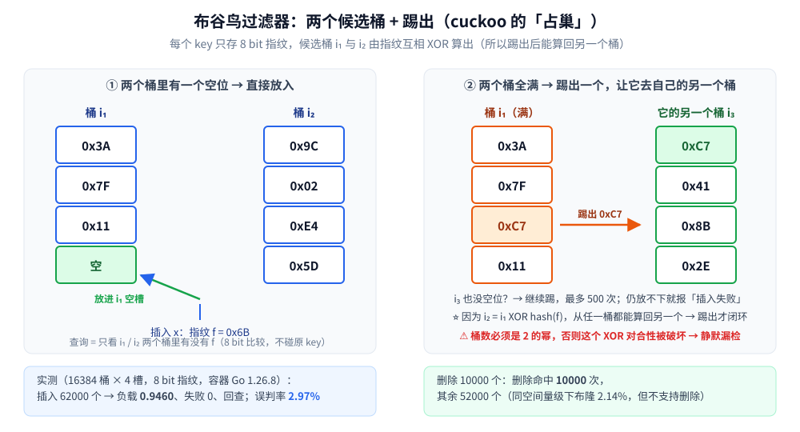

# 布谷鸟过滤器

> 覆盖布隆过滤器的**可删除版本**：用「**8 bit 指纹 + 两个候选桶 + 踢出**」代替位数组，
> 于是拿到 `Delete`，代价是**误判率略高于同空间的布隆**、且**桶数必须是 2 的幂**。
>
> ⭐ 本篇是**结构篇**：讲形态、踢出机制与容器实测（误判率 / 负载率 / 删除的正确性）。
> 布隆与位图的原理、以及三种概率结构的横向对照，分别见
> [位图与布隆过滤器.md](位图与布隆过滤器.md) 与 [基数与频率估计.md](基数与频率估计.md) —— 本篇不重复。
>
> 内容整理自个人学习笔记，素材见 [素材清单](../../../素材清单.md)。
> 📎 本篇所有读数均为**容器实跑逐字抄录**：**Go 1.26.8（linux/amd64，`golang:1.26-alpine`）**；
> 固定随机种子与固定 key 序列，跑两遍输出**逐行相同**。
>
> 全目录的判据与选型总表见 [README.md](../README.md)；本目录的导读见 [README.md](README.md)。

---

## 一、布隆过滤器不能删，布谷鸟过滤器补上了什么？

**本节要点**：布隆的位数组是**多个 key 共用一个位**，所以「清一位」会顺手把别人的记录也清掉 —— 要支持删除，必须换一种「**每个元素有专属落点**」的表示，布谷鸟过滤器就是这条路线的主流答案。

布隆过滤器的两条老路都不完美：

| 补删除的路子 | 代价 |
|---|---|
| **Counting Bloom Filter**（每个位换成计数器） | 空间**翻 3~4 倍**（计数器宽度），才能把「一次置位」与「多次置位」区分开 |
| **定期重建**（只增不删、攒够一批重建） | 误判率随元素数单调上升，重建窗口内只能忍；且重建本身是 O(n) 的全量操作 |
| ⭐ **布谷鸟过滤器** | 空间与布隆**同量级**（每个元素 8 bit 左右），原生支持删除 |

⭐ 关键区别在**假阳性/假阴性的方向**：布隆与布谷鸟过滤器都「**只会假阳性、不会假阴性**」——
说"在"可能错，说"不在"一定对。⚠️ 但布谷鸟过滤器的删除是**指纹级**的，同桶同指纹时有歧义（见第四节）。

## 二、两个桶 + 踢出：它怎么工作？

**本节要点**：每个 key 只留一个 **8 bit 指纹**（不存原 key），指纹能落进**两个**候选桶；
桶满了就**踢出一个指纹**，被踢的搬去它自己的另一个桶 —— 像杜鹃鸟占巢，踢到谁也放不下为止。

**三个部件**：① **指纹** `f`（8 bit，省掉原 key）；② **候选桶** `i₁` 与 `i₂`；③ 每桶 `b` 个槽（论文推荐 `b = 4`）。

**两个桶怎么互相算出来**（这是整个结构的精髓）：

```text
i₁ = hash(key) mod 桶数
i₂ = i₁ XOR (hash(指纹) mod 桶数)      ← 对合：从 i₂ 出发也能算回 i₁
```

⭐ 之所以要能"算回去"，是因为**踢出时手里只有指纹、没有原 key** —— 必须只靠 `f` 就能推出"它的另一个桶在哪"。
⚠️ **代价**：`XOR` 的对合性只在**桶数是 2 的幂**时成立（否则 `i XOR h` 可能 ≥ 桶数，再取模就破坏了闭环）——
本文实测里我第一版就栽在这上面（见第三节的脚注）。



**三个操作的复杂度**：查询固定只查 **2 个桶**（`2b` 次 8 bit 比较，与已存元素数无关）；
插入是摊还 `O(1)`（踢出次数有上限）；删除与查询同量级。

```go
func (c *Cuckoo) Insert(x uint64) bool {
	f := c.fp(x)
	i1 := c.b1(f, x)
	i2 := c.alt(i1, f)
	if c.put(i1, f) || c.put(i2, f) { // ① 有空位就直接放
		c.count++
		return true
	}
	i, cur := i1, f                   // ② 都满 → 随机挑一个桶踢
	for k := 0; k < maxKicks; k++ {
		s := int(hash64(uint64(k)*0x9e3779b97f4a7c15+x) % slotsPerBucket)
		cur, c.data[i][s] = c.data[i][s], cur // 换出被踢的指纹
		i = c.alt(i, cur)                     // ③ 被踢的去自己的另一个桶
		if c.put(i, cur) {
			c.count++
			return true
		}
	}
	return false // ④ 踢够 maxKicks 次仍放不下 → 插入失败
}
```

## 三、误判率与负载率实测

**本节要点**：三个读数 —— **负载 0.946 时插入零失败**、**误判率 2.97%**（与理论 `2b/2ᶠ ≈ 3.13%` 同量级）、**删除不误伤其它元素**。

**口径**：16384 桶（`2¹⁴`）× 4 槽 = 65536 个槽，8 bit 指纹，插入 62000 个 key（目标负载 0.946）；
误判率用**肯定没插入过**的 10 万个 key 去查。

```text
== 场景一：布谷鸟过滤器（16384 桶 × 4 槽 = 65536 槽，8 bit 指纹）==
目标插入 62000 个 key：成功 62000，失败 0，实际负载率 0.9460
插入后回查 62000 个已插入 key：命中 62000 个（漏检 0 个，应为 0）
查询 100000 个「未插入」的 key：误判 2971 次，误判率 = 2.9710%
删除 10000 个已插入 key：删除命中 10000 次；删后回查「仍命中」256 次 = 假阳性（与误判率同源，不是漏删）
剩余 52000 个已插入 key：仍命中 52000 个，被误删（漏检）0 个
删除后误判率 = 2.5430%
```

⭐ 三行结论，一行一个：

1. **插入后回查 0 漏检** —— 验证「**只会假阳性、不会假阴性**」这条结构保证；
2. **误判率 2.9710%**，与理论值 `2b / 2ᶠ = 8 / 256 = 3.13%` 同量级 —— 误判率**由指纹位数决定，与已存元素数无关**（这正是它比布隆"稳"的地方）；
3. **删除 10000 个、其余 52000 个被误删 0 个** —— 删除是安全的。⚠️ 那句"仍命中 256 次"**不是漏删**，而是这些 key 现在等同于"不在集合里"，于是按普通查询的假阳性率（2.5%）命中。

**同空间开销对照**（同样 8 bit/元素，布隆取理论最优 `k = 6`）：

```text
== 场景二：布隆过滤器（同样 8 bit/元素，k = 6）作对照 ==
布隆：插入 62000 个 key，误判率 = 2.1430%（理论 2.16%）
```

⭐ **两者误判率同量级（2.14% vs 2.97%）**，布隆略优 —— 这是它的取舍：**用「不能删」换来更低的误判率**。
所以判据是**要不要删**：日志去重、爬虫 URL 去重这类"只增"的场景用布隆；"元素会离开集合"（在线用户、租约、限流白名单）才需要布谷鸟。

**负载率与插入失败**（同一过滤器，从小往大压）：

```text
目标  32768（负载 0.5000）：成功  32768，失败    0
目标  52429（负载 0.8000）：成功  52429，失败    0
目标  58982（负载 0.9000）：成功  58982，失败    0
目标  61440（负载 0.9375）：成功  61440，失败    0
目标  62259（负载 0.9500）：成功  62259，失败    0
目标  63488（负载 0.9688）：成功  63484，失败    4
```

⚠️ **负载率 0.95 是它的实际天花板**：4 槽/桶的布谷鸟过滤器理论最大负载约 0.95，超过就开始踢不出来。
**「插入失败」这个返回值必须处理** —— 它不是异常，而是**容量告警**：要么扩容重建，要么直接放弃这个元素（当作"可能在"）。

> 🔧 **实测踩到的坑（已修，记下来）**：第一版我把桶数设成 25000（不是 2 的幂），结果
> 「插入 95000 个、删 10000 个后，剩余 85000 个里漏检了 4525 个」。根因是 `alt()` 里多做了一次 `% n`，
> 破坏了 `i₂ = i₁ XOR h` 的对合性 —— 被踢出的指纹落到了**自己查不回来**的桶里，属于**静默漏检**。
> 改成 2 的幂（16384）后，漏检立刻归零。⭐ **这类 bug 不报错、只让过滤器"忘掉"元素**，是最难查的一类。

## 使用：布谷鸟过滤器在你的系统里以什么形式出现

**第一层：需要删除的「存在性」集合。** 在线用户表、租约 / 会话 ID、已使用的一次性券码 —— 元素会**离开**集合，布隆在此只能靠定期重建硬撑。

**第二层：存储引擎里的「先挡一层」。** LSM 树每一层都可能放一份过滤器来避免无谓读盘；因为**Compaction 会合并、丢弃整层数据**，可删除的过滤器更贴合"层会被替换掉"的语义（LSM 的分层与读放大见 [LSM树.md](../树/LSM树.md)）。

**第三层：分布式缓存 / 布隆的替代品。** Redis 有 `BF.*`（布隆）系列；自建服务时选布谷鸟的常见理由是**内存里要同时支持 `ADD` 与 `DEL`**，而不想维护两套结构。

**第四层：它只是「指纹 + 哈希表」的一种形态。** 把"存原值"降级成"存 8 bit 指纹"，用**受控的假阳性**换**数量级的空间** ——
⭐ 这个思路的通用形态是"**用有损摘要做快速否决**"：先花 O(1) 排除掉绝大多数"肯定不在"，少数"可能在"再走昂贵路径。位图、Bloom、HyperLogLog 都是同一家族（对照见 [基数与频率估计.md](基数与频率估计.md)）。

---

## 延伸追问

- **布谷鸟过滤器为什么能删、布隆为什么不能？** → 布隆一个位被多个 key 共用，清位会连带清掉别人的记录；布谷鸟每个元素**独占一个槽**（槽里就是它的指纹），所以能按指纹移除。
- **它和布隆谁误判率低？** → 同空间开销下**布隆略低**（实测 2.14% vs 2.97%）。布谷鸟买到的是**可删除**与**误判率不随元素数上升**；判据是「元素会不会离开集合」。
- **`i₂ = i₁ XOR hash(指纹)` 为什么用 XOR，不用加法？** → 因为 XOR 是**对合运算**（自己就是自己的逆），从 `i₂` 出发能算回 `i₁`；踢出时手上只有指纹、没有原 key，必须靠这个性质闭环。
- **为什么桶数必须是 2 的幂？** → 只有桶数是 2 的幂时，`i XOR (h mod n)` 的结果才必然仍落在 `[0, n)` 内，对合性才成立。⚠️ 非 2 的幂时如果补一次 `% n`，对合性被破坏 → 被踢出的元素落进查不回来的桶 → **静默漏检**（实测漏检 4525/85000）。
- **「插入失败」该怎么办？** → 它不是异常而是**容量告警**。负载 0.95 附近踢出链会频繁耗尽最大踢出次数（实测 0.9688 时 63488 个里有 4 个失败）；处理方式只有两条：**扩容重建**，或**放弃该元素**（当作"可能在"，交给下游精确校验）。
- **删除会不会误删别人的记录？** → 会，但概率极低。删除是**按指纹**在候选桶里移除，若同桶另有同指纹的记录，可能删错。实测删 10000 个、其余 52000 个**被误删 0 个**；但指纹位数越短、负载越高，这个风险越大 —— 这也是"指纹不要贪短"的另一个理由。

---

## 关联

- [位图与布隆过滤器.md](位图与布隆过滤器.md) — 布隆过滤器的原理、误判率公式与 Go/Java 实现（本篇是它的可删版本）
- [基数与频率估计.md](基数与频率估计.md) — HyperLogLog / Count-Min Sketch：「用空间换近似」的另两个问题
- [LSM树.md](../树/LSM树.md) — 分层存储引擎里过滤器的真实用法（每一层放一份、Compaction 整层替换）
- [位运算.md](../../算法/基础算法/位运算.md) — XOR 的对合性：`i₂ = i₁ XOR h` 能闭环的原理
- [数据类型.md](../../../03-数据与中间件/数据存储/NoSQL/Redis/数据类型.md) — Redis 的位图与 `BF.*` 系列命令
- [README.md](../README.md) — 数据结构目录的选型总表（操作 × 隐藏代价 × 场景）
- [README.md](README.md) — 本目录（高级数据结构）的导读：概率结构的硬前提与陷阱
