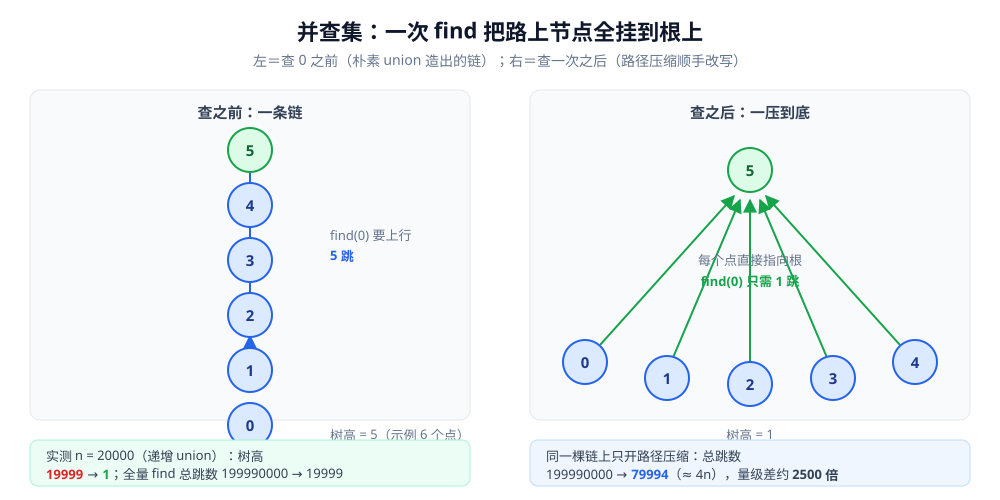

# 并查集

> 覆盖一种只回答「**两个元素是不是同一组**」的结构：`union` 合并 + `find` 查代表元，
> **按秩合并**管树能长多高、**路径压缩**让走过的路以后不再重付；代价是**不能回滚、不支持删除**。
> 它是 Kruskal 最小生成树、等价类合并、动态连通性的地基。
>
> ⭐ 本篇是**结构篇**：讲形态、两个优化的分工与容器实测。它在图算法里的用法见
> [Kruskal.md](../../算法/图论算法/最小生成树/Kruskal.md)（最小生成树的头号用户）与
> [二分图判定.md](../../算法/图论算法/二分图判定.md)（边持续加入时的种类并查集）。
>
> 素材来源：博客 [数据结构](https://blog.csdn.net/weixin_43837229/article/details/103222660)（2019-11-24）——
> 本篇取该文「补充结构」一节的并查集部分；两个优化的**工程动机**与**实测**为本次整理补充，
> 参考《数据结构和算法图解》（杰伊·温格罗）与《算法图解》（巴尔加瓦）。逐篇登记见 [素材清单](../../../素材清单.md)。
>
> 全目录的判据与选型总表见 [README.md](../README.md)；本目录（高级数据结构）的导读见 [README.md](README.md)。

---

## 一、并查集（Disjoint Set / Union-Find）解决什么问题？

**本节要点**：它只回答"这两个元素是否同组"，靠**按秩合并**控高度、**路径压缩**摊平历史，代价是**不能回滚、不支持删除**。

**解决什么**：动态维护"哪些元素属于同一组"，支持 `union(a,b)` 合并与 `find(x)` 查代表元——典型是连通性判断、等价类合并、Kruskal 最小生成树。

朴素实现会长成一条链（每次合并都挂到末端），find 退化成 O(n)。**两个优化各自对应一个直觉**：**按秩合并**=让小树挂到大树下，别让树因合并而变高（树高压到 O(log n) 量级）；**路径压缩**=查询顺手把路上节点全挂到根上，"这次问得贵、下次就便宜"（均摊接近 O(1)，即 O(α(n))，反阿克曼函数，实践中视作常数）。

> 两者合起来的分析是"摊还"结论（见 [复杂度分析.md](../../算法/基础算法/复杂度分析.md) 的「四、摊还分析」）：**单次 find 可能不便宜，但一整批操作摊下来极平**。这也是"并查集不能回滚/不支持删除"的原因——路径压缩破坏了历史结构。



## 二、`find` / `union` 怎么写？两个优化各省下多少？

**本节要点**：三个读数分别对应三件事 —— 按秩合并**把 O(n) 的树高压成常数**、路径压缩**把 O(n²) 摊成 O(n)**、树本身已是 O(log n) 时压缩的收益**退成常数因子**。

**接口只有两个**：`find(x)` 返回 x 所在组的代表元，`union(a, b)` 把两组并起来。判「a 与 b 同组」就是 `find(a) == find(b)` —— ⚠️ **不能直接比 `parent[a] == parent[b]`**，父节点相同只说明挂在同一个中间节点上，不代表根相同。

三个写法（Go；`useRank` / `usePC` 两个开关用来做下面的对照）：

```go
type UF struct {
	parent  []int
	rank    []int
	useRank bool // 是否启用按秩合并
	usePC   bool // 是否启用路径压缩
}

func (u *UF) Find(x int) int {
	if !u.usePC { // 朴素：一路上行到根
		for u.parent[x] != x {
			x = u.parent[x]
		}
		return x
	}
	r := x
	for u.parent[r] != r { // 第一趟：先找到根
		r = u.parent[r]
	}
	for u.parent[x] != x { // 第二趟：把路上的节点直接挂到根上
		nxt := u.parent[x]
		u.parent[x] = r
		x = nxt
	}
	return r
}

func (u *UF) Union(a, b int) {
	ra, rb := u.Find(a), u.Find(b)
	if ra == rb {
		return
	}
	if u.useRank { // 小树挂大树：只在秩相等时树才长高一层
		if u.rank[ra] < u.rank[rb] {
			ra, rb = rb, ra
		}
		u.parent[rb] = ra
		if u.rank[ra] == u.rank[rb] {
			u.rank[ra]++
		}
		return
	}
	u.parent[ra] = rb // 朴素：谁挂到谁下面，全看调用顺序
}
```

**实测口径**：`golang:1.26-alpine`（**Go 1.26.8，linux/amd64**）；
计数项是**父指针访问次数**（"上行找根"与"回写压缩"各计一次），**确定性读数、不依赖计时** —— 同一程序连跑两遍输出逐行相同。

### 2.1 场景一：递增 `union(i, i+1)`，n = 20000（朴素写法的坏输入）

```text
朴素               树高=19999     全量 find 总跳数=199990000
按秩合并             树高=1         全量 find 总跳数=19999
```

⭐ 朴素写法把 n 个点连成一条**长链**：树高 = **n − 1 = 19999**，随后对 0…n−1 逐个 find 的总跳数 = **n(n−1)/2 = 199990000**（正是等差数列求和）。
⚠️ 这就是"最坏 O(n)"的真实长相 —— 每来一个 `union(i, i+1)`，新点都挂在链尾上。
**按秩合并一出场，同一组数据变成星形（树高 1）**，总跳数掉到 **n − 1 = 19999**。

### 2.2 场景二：同一棵「朴素链」上开路径压缩

```text
不开压缩             全量 find 总跳数=199990000
开路径压缩            全量 find 总跳数=79994
```

⭐ 压缩后总跳数 = **4n − 6 = 79994**：第一次 find 付两次全程遍历（找根 + 回写），之后每个点只剩 2 次访问。
**从 n(n−1)/2 到 4n —— 量级差约 2500 倍**。要记住的不是"79994"这个数，而是 **O(n²) → O(n)** 这个量级跳变。

### 2.3 场景三：锦标赛式 union，n = 16384（按秩的典型 O(log n) 形态）

```text
按秩合并             树高=14        全量 find 总跳数=114688
按秩 + 路径压缩        树高=14        全量 find 总跳数=65504
同一结点连续两次 find（叶子）：第一次 28 跳，第二次 2 跳
```

⚠️ **这一组反直觉，也最值得记**：树高已经是对数级（14）时，路径压缩的收益**只剩常数因子（约 1.75 倍）**，不再是数量级。
原因是两者**分工不同** —— **按秩合并管「树能长多高」，路径压缩管「走过的路以后还贵不贵」**；树本身已经扁平时，可压的路本来就不多。
⭐ 最后那行"第一次 28 跳、第二次 2 跳"才是路径压缩的本色：**它买的不是单次更快，而是同一条路不重复付钱**。

> ⚠️ 边界：并查集**只支持合并、不支持拆分**。真要"撤销某条边"，只能不上路径压缩（保留可回溯的结构），或换可持久化 / 回滚并查集。

## 使用：并查集在你的系统里以什么形式出现

**第一层：Kruskal 最小生成树。** 按边权从小到大扫，用 `find` 判断"这条边的两端是否已经连通"——连通就跳过（会成环），不连通就选它并 `union`。整个算法的瓶颈因此落在**排序**而不在并查集上（见 [Kruskal.md](../../算法/图论算法/最小生成树/Kruskal.md)）。

**第二层：无向图的连通分量 / 等价类合并。** 只要"边是持续加入的"，并查集就比每次重跑一遍 DFS 便宜得多；图是静态的、只判一次，BFS / DFS 染色更省（对照判据见 [二分图判定.md](../../算法/图论算法/二分图判定.md) 的种类并查集那一节）。

**第三层：账号 / 设备 / 订单的「同一实体」归并。** 风控里"这两个手机号是不是同一个人"、CRM 里"这两条客户记录要不要合并"，本质都是**动态等价类**。

**第四层：你可以借用它的思路。** 「路径压缩」的通用形态是**缓存中间结果、让重复查询摊薄**；「按秩合并」的通用形态是**让小的并到大的里**（小表驱动大表、少数派合入多数派）——这两个直觉在并查集之外的工程里同样成立。

---

## 延伸追问

- **并查集的两个优化分别解决什么？** → 按秩合并防"合并把树叠高"（最坏 O(log n)），路径压缩让"查过的路径以后都便宜"（均摊 O(α(n))）。⭐ 分工见 2.3：树已经扁平时，压缩的收益会退成常数因子。
- **为什么并查集不能支持删除 / 回滚？** → 路径压缩把结构改写成一压到底的形态，历史信息已经丢了；要回滚只能不上压缩、或用可回滚的持久化并查集。
- **`find(a) == find(b)` 判同组，为什么不直接比 `parent[a] == parent[b]`？** → 父节点相同只说明两者挂在同一个中间节点上，根未必相同；只有比较**代表元（根）**才是判据。⚠️ 也因此 `union` 里必须先对两端各做一次 `find`，不能拿入参当根用。
- **`α(n)` 到底有多大？** → 反阿克曼函数，n 取到宇宙原子数量级时也不超过 5 —— 工程上直接当常数（口径见 [复杂度分析.md](../../算法/基础算法/复杂度分析.md) 的摊还分析一节）。
- **种类并查集是什么？** → 把"敌人的敌人是朋友"这类**二元关系**编码成"元素 x 与 x+n 分属两个副本"，判冲突就是判 `find(x) == find(y)`；判据与用法在 [二分图判定.md](../../算法/图论算法/二分图判定.md)。

---

## 关联

- [Kruskal.md](../../算法/图论算法/最小生成树/Kruskal.md) — 并查集的头号用户：按边权排序 + 用 `find` 判环
- [二分图判定.md](../../算法/图论算法/二分图判定.md) — 边持续加入时的判据：种类并查集 vs BFS 染色
- [强连通分量.md](../../算法/图论算法/强连通分量.md) — 有向图的「互相可达」；本篇是无向连通分量那一条路
- [复杂度分析.md](../../算法/基础算法/复杂度分析.md) — α(n) 与摊还分析的口径
- [图的表示与存储.md](../图/图的表示与存储.md) — 另一条「判连通」的路线（DFS / BFS 扫一遍）
- [README.md](../README.md) — 数据结构目录的选型总表（操作 × 隐藏代价 × 场景）
- [README.md](README.md) — 本目录（高级数据结构）的导读：什么时候该用额外假设换更快的操作
- [可持久化数据结构.md](../树/可持久化数据结构.md) — **可回滚 / 可持久化并查集怎么落地**：用可持久化数组存 parent、只能按秩合并（追问里那个钩子的答案）
