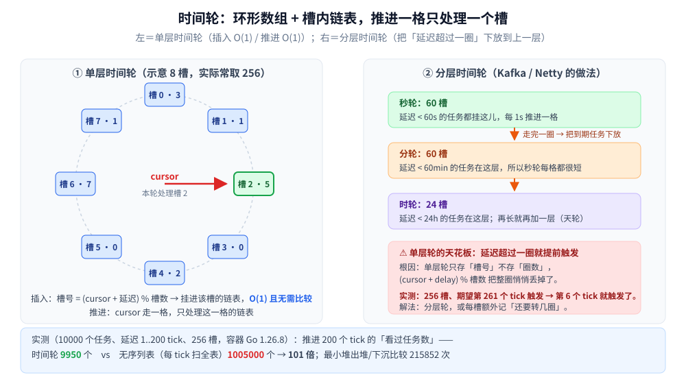

# 时间轮

> 覆盖定时器的高频结构：**环形数组 + 槽内链表**，插入与推进都是 `O(1)`，
> 把「每个 tick 扫一遍全部任务」换成「只看当前这一格」。
>
> ⭐ 本篇是**结构篇**：讲形态、`O(1)` 的来处、**单层轮「延迟超过一圈」的硬边界**与容器实测。
> Go 侧怎么落地（标准库 `time` / go-cron / go-job / xxl-job 四条路线）见
> [定时任务/README.md](../../../01-编程语言/go/工程实践/定时任务/README.md) —— 那边是实现，这边是结构。
>
> 内容整理自个人学习笔记，素材见 [素材清单](../../../素材清单.md)。
> 📎 本篇所有读数均为**容器实跑逐字抄录**：**Go 1.26.8（linux/amd64，`golang:1.26-alpine`）**；
> 只数「操作次数」不依赖计时，跑两遍输出**逐行相同**。
>
> 全目录的判据与选型总表见 [README.md](../README.md)；本目录的导读见 [README.md](README.md)。

---

## 一、定时器要回答哪三个操作？

**本节要点**：**加一个任务**、**推进时间**、**取出到期的**。难点全在第二、三件上 —— 因为"时间"不会自己跳，必须由某个线程按 tick 推着走。

| 操作 | 语义 | 朴素做法与代价 |
|---|---|---|
| `Add(task, delay)` | 延迟 `delay` 后执行 | 追加进列表：`O(1)` |
| `Tick()` | 时间前进一格，**取出本格到期的任务** | ⚠️ 无序列表要**扫全表**：`O(待执行任务数)` |
| 空闲代价 | 没有任务到期时也要推进 | 同样是 `O(任务数)`（这才是最痛的） |

⚠️ **要害在"空闲也要付钱"**：一个挂了几十万个定时器的进程，如果每 tick 都遍历一遍全部任务，**CPU 就白烧在"看了一圈都没到期"上**。
三种结构的差别正是"**推进一格到底要看多少个任务**"：

- **无序列表**：每个 tick 看**全部** `O(n)`
- **最小堆**：每个 tick 只看**堆顶**（但插入 `O(log n)`，见 [堆与优先队列.md](../树/堆与优先队列.md)）
- ⭐ **时间轮**：每个 tick 只看**当前这一格** `O(槽内任务数)`，插入也是 `O(1)`

## 二、环形数组 + 槽内链表：`O(1)` 从哪来？

**本节要点**：把"延迟"直接**映射成数组下标** —— 既然要等 `d` 个 tick，那不就是"`d` 格之后"吗？于是不需要排序、不需要比较，算个下标就行。

```text
槽号 = (cursor + delay) mod 槽数
```

```go
type Wheel struct {
	slots   int
	buckets [][]int // 每槽挂一条任务链表
	cursor  int
}

func (w *Wheel) Add(task, delay int) {
	idx := (w.cursor + delay) % w.slots // ⚠️ 这里丢掉了「圈数」，见第三节
	w.buckets[idx] = append(w.buckets[idx], task)
}

func (w *Wheel) Tick() []int {
	cur := w.buckets[w.cursor]
	expired := append([]int(nil), cur...)
	w.buckets[w.cursor] = w.buckets[w.cursor][:0] // 清空本格
	w.cursor = (w.cursor + 1) % w.slots
	return expired
}
```

⭐ **两个 `O(1)`**：插入是"算下标 + 挂链表"，**连一次比较都没有**；推进是"清空一格 + 走一步"，与总任务数**无关**。
这是它相对最小堆的**真正优势**：堆的插入要 `O(log n)` 次比较（实测插入 10000 个任务累计 **17629 次**），而时间轮是 0 次。

⚠️ 代价是**空间与粒度的耦合**：槽数固定，**槽越少单格链越长**（推进时一次要处理的就越多），槽越多内存越大。所以它本质是"**用一格链表把时间离散化**"。



## 三、单层时间轮的硬边界：延迟超过一圈就提前触发

**本节要点**：`(cursor + delay) % slots` 这个 `%` **把所有"整圈"都吞掉了** —— 延迟 `slots + 5` 与延迟 `5` 落进同一个槽，于是任务**提前整整一圈**被触发。

```text
== 场景四：延迟 > 一圈时，单层时间轮会提前触发 ==
槽数 256、期望第 261 个 tick 触发：实际第 6 个 tick 就触发了（提前 255 个 tick）
```

⚠️ **这是单层时间轮最经典的错**，而且**不报错**：任务就是早执行了。两条工程解法：

| 解法 | 做法 | 代价 |
|---|---|---|
| ⭐ **分层时间轮** | 秒轮走完一圈，把任务**下放到**分轮；分轮再下放到时轮（Kafka / Netty 的做法） | 结构变复杂，但**每格的链表都很短**，仍是 `O(1)` |
| **每槽记圈数** | 槽里再存一个 `rounds` 计数，`Tick` 时先减、减到 0 才真的到期 | 实现简单，但**同一个槽里的任务必须再扫一遍**判圈数，失去部分 `O(1)` 优势 |

⭐ 分层的直觉：**低层负责"近"、高层负责"远"** —— 延迟 3 天的任务挂在时轮上，秒轮每格依然是空的，不会被它拖慢。

## 四、实测：三种结构推进一次的代价

**本节要点**：推进 200 个 tick 的"看过任务数" —— 时间轮 **9950** vs 无序列表 **1005000**，**101 倍**；最小堆的插入则要多付 17629 次比较。

**口径**：10000 个任务，延迟 `1..200` 个 tick，槽数 256。

```text
== 场景一：插入 10000 个任务（延迟 1..200 个 tick）==
时间轮：插入 10000 次，每次都是「算下标 + 挂链表」—— 无需比较（比较次数 0）
最小堆：插入 10000 次，累计比较/交换 17629 次（每次 O(log n)）
无序列表：插入 10000 次，累计 0 次比较（只追加）

== 场景二：推进 200 个 tick 的总工作量 ==
时间轮：推进 200 次，累计「看过的任务」9950 个（只看当前槽）
最小堆：出堆/下沉累计比较 215852 次
无序列表：累计「看过的任务」1005000 个（每个 tick 都把全表扫一遍）
⭐ 列表 / 时间轮 = 101.0 倍 —— 时间轮把「扫全表」换成了「只看一格」
```

⭐ **三条结论**：

1. **时间轮 9950 次 ≈ 任务总数** —— 每个任务**只被"看到"一次**（到期那一次），这是"理想下界"：不可能比"每个任务处理一次"更少。
2. **无序列表 1005000 次 = 101 倍** —— 因为它每个 tick 都把整张表看一遍，绝大部分是"看了但没到期"的**纯浪费**。
3. **最小堆插入要 17629 次比较**（本机读数；因为延迟在 1..200 之间循环、堆接近有序，`sift-up` 常常立即退出，所以这个数字比 `n·log₂n` 乐观）。⭐ 堆的优势在**延迟范围无上限**，时间轮的优势在**插入零比较**。

**槽数与单格链长**（同样的任务量，延迟 1..200）：

```text
槽数   64：平均每格 156.2 个，最长链 200 个（占用槽 64 个）
槽数  128：平均每格 78.1 个，最长链 100 个（占用槽 128 个）
槽数  256：平均每格 50.0 个，最长链 50 个（占用槽 200 个）
槽数  512：平均每格 50.0 个，最长链 50 个（占用槽 200 个）
槽数 1024：平均每格 50.0 个，最长链 50 个（占用槽 200 个）
```

⭐ **槽数只要不小于"最大延迟"就够了**：本组延迟只到 200，所以 256 槽之后再加槽**一点收益都没有**（平均每格恒为 50 = 10000/200）。
⚠️ 反过来看 64 槽那行：**最长链 200 个**，意味着推进到那一格要一次处理 200 个任务 —— **单格链长才是时间轮的真实延迟毛刺来源**。

> 🔧 **实测踩到的坑（已修）**：第一版我把 `Add` 写成 `(cursor + delay) % slots` 就收工，延迟 `slots + 5` 的任务在第 6 个 tick 就跑了。
> ⭐ 这类 bug 的特征是**安静地提前触发**，业务上表现为"定时任务莫名多跑了几次"，非常难查。

## 使用：时间轮在你的系统里以什么形式出现

**第一层：网络框架的连接超时与重传。** Netty 的 `HashedWheelTimer` 就是分层时间轮 —— 一个连接一个"读超时任务"，几十万连接下不可能每 tick 都扫一遍。

**第二层：消息队列的延迟消息。** Kafka 的延迟生产、RocketMQ 的定时消息底层都靠时间轮（RocketMQ 用的是固定层级的 `TimerWheel`）。

**第三层：限流 / 熔断的窗口滚动。** 滑动窗口的"淘汰过期桶"本质就是时间轮推进一格（见 [限流算法.md](../../../04-架构与系统/分布式/服务治理/限流算法.md) 的滑动窗口一节）。

**第四层：你可以借用它的思路。** 时间轮的通用形态是"**把「还有多久」直接当数组下标用**"——
⭐ 只要"等待时间"有界、且能离散化，就能把排序问题降级成**取模算术**。任何"按时间分批处理"的场景（TTL 清理、延迟队列、退避重试）都值得先想想能不能这么干。

---

## 延伸追问

- **时间轮为什么插入是 `O(1)`？** → 它**不做比较也不排序**，直接把"延迟"映射成数组下标 `(cursor + delay) % slots`；代价是**槽数固定、粒度与槽数绑定**。
- **它比最小堆快在哪？** → 两点：① 插入**零比较**（堆要 `O(log n)`，实测 10000 次插入 17629 次比较）；② 推进只看一格，不碰堆顶以外的任何元素。⚠️ 堆的优势是**延迟范围无上限**，不需要预先分配槽。
- **「延迟超过一圈」为什么会错？** → `% slots` 把整圈吞掉了：延迟 `slots + 5` 与 `5` 落进同一格，任务提前一整圈触发（实测提前 255 个 tick）。解法是**分层时间轮**或**每槽记圈数**。
- **槽数该取多少？** → 只需**不小于最大延迟**。实测延迟 1..200 时，256 槽之后再加槽毫无收益（平均每格恒为 50）。⚠️ 真正的毛刺来自**最长链**（64 槽时最长链 200 个）。
- **时间轮和循环队列是同一个东西吗？** → 数组部分**确实是**同一个环形数组（见 [双端队列与循环队列.md](../线性结构/双端队列与循环队列.md)）；差别在**槽里放什么**：循环队列放一个元素，时间轮放**一条任务链表**，且"读写指针"由时间推动。
- **什么时候不该用时间轮？** → ① **延迟跨度极大且散乱**（从 1 秒到 30 天混在一起）—— 要么层数很多，要么单格链很长；② **任务数很少**（几十个）—— 最小堆足够简单且无预分配；③ **需要精确到毫秒且槽数难定** —— 堆按到期时刻排序，没有离散化误差。

---

## 关联

- [定时任务/README.md](../../../01-编程语言/go/工程实践/定时任务/README.md) — Go 侧四条落地路线（标准库 / go-cron / go-job / xxl-job）与本篇的分工
- [堆与优先队列.md](../树/堆与优先队列.md) — 另一条定时器路线：按到期时刻排序的小顶堆（插入 `O(log n)`、无延迟上限）
- [双端队列与循环队列.md](../线性结构/双端队列与循环队列.md) — 时间轮用的那个**环形数组**本身
- [限流算法.md](../../../04-架构与系统/分布式/服务治理/限流算法.md) — 滑动窗口的"淘汰过期桶"就是时间轮推进
- [RocketMQ.md](../../../03-数据与中间件/中间件/消息队列/RocketMQ.md) — 延迟消息 + 固定层级 `TimerWheel` 的工程形态
- [复杂度分析.md](../../算法/基础算法/复杂度分析.md) — 「每个任务只被看到一次」这个下界的口径
- [README.md](../README.md) — 数据结构目录的选型总表（操作 × 隐藏代价 × 场景）
- [README.md](README.md) — 本目录（高级数据结构）的导读
