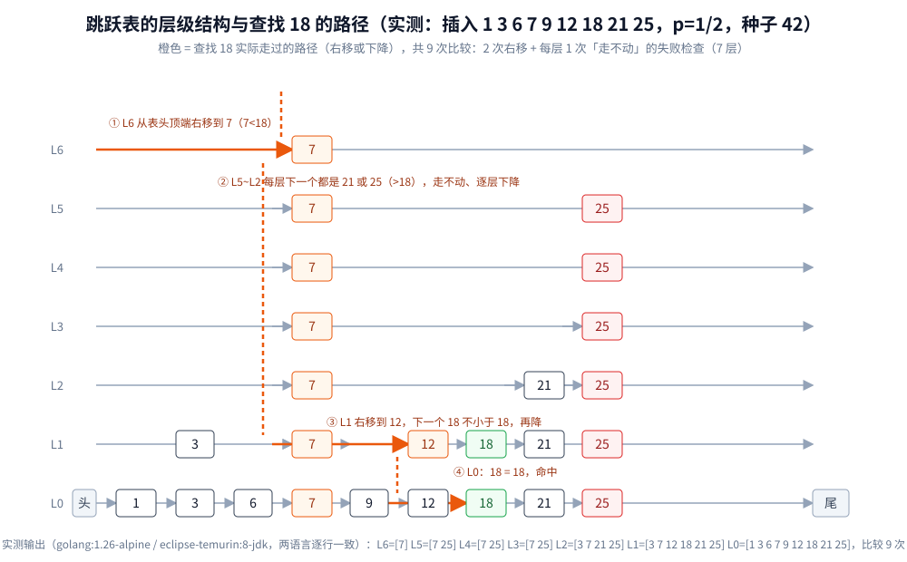

# 跳跃表（Skip List）

> 用「随机层数」替代平衡树的旋转：在有序链表之上叠加多层索引，
> 以**期望 O(log n)** 的代价完成查找、插入、删除，实现却比红黑树简单得多。
>
> ⭐ 边界先说清：本篇讲**跳跃表本身的结构、操作与工程取舍**。
> 「平衡树怎么旋转」见 [平衡树.md](../树/平衡树.md)；
> 「B+ 树为什么是磁盘索引首选」见 [B树与B+树.md](../树/B树与B+树.md)；
> Redis 中 ZSet 的完整实现见 [底层结构.md](../../../03-数据与中间件/数据存储/NoSQL/Redis/底层结构.md)。
>
> 内容整理自个人学习笔记，素材见 [素材清单](../../../素材清单.md)。
>
> 📎 本篇所有输出均为容器实跑逐字抄录：**Go 1.26.8（golang:1.26-alpine）** 与 **JDK 1.8.0_504（eclipse-temurin:8-jdk）**
> 各实现一份，同一随机数发生器（64 位 LCG、同种子），非耗时行**逐行一致**；随机层数与实测读数同源于该程序。

---

## 一、跳跃表解决什么问题？

**本节要点**：有序链表查找是 O(n)，平衡树能压到 O(log n) 但要维护旋转。
跳跃表用**概率平衡**代替**严格平衡**，把维护成本降到几乎为零。

| 结构 | 查找 | 插入 / 删除 | 平衡手段 | 实现复杂度 |
|---|---|---|---|---|
| 有序数组 | O(log n)（二分） | O(n)（搬移） | 无 | 极低 |
| 有序链表 | O(n) | O(1)（已知前驱） | 无 | 极低 |
| 平衡树（AVL / 红黑树） | O(log n) | O(log n) | 旋转 + 变色 | 高 |
| **跳跃表** | **期望 O(log n)** | **期望 O(log n)** | **随机层数** | **低** |

⭐ 一句话：**跳跃表把「维护平衡」从「必须做」降级为「大概率发生」**，
省下的就是旋转的全部成本。

---

## 二、结构：多层索引怎么叠？

**本节要点**：底层是完整有序链表，往上一层是下层的随机子集，层数越高节点越少。
查找时从最高层出发，**能往右就往右，不能往右就掉一层**。

### 2.1 形态：下层是全集，上层是稀疏子集

教学用的理想形态（每 2 个升 1 个，层数逐级减半）：

```text
L3:  1 ──────────────────────────────→ 25
L2:  1 ─────────────→ 9 ─────────────→ 25
L1:  1 ──────→ 6 ───→ 9 ──────→ 18 ─→ 25
L0:  1 → 3 → 6 → 7 → 9 → 12 → 18 → 21 → 25
```



⚠️ 实际实现**不是**「每 2 个升 1 个」的确定性规则，而是每个节点插入时**掷骰子决定层数** ——
所以上图只是直觉模型，真实形态见 2.2 的实测输出。
头尾各有一个哨兵（head 层高 = 全局最高层、tail 键 = +∞），查找与插入都不用特判空表 ——
这与 [数组与链表.md](../线性结构/数组与链表.md) 里「哨兵节点省掉边界分支」是同一手法。

### 2.2 实测层数：谁被提升由随机数决定

同一批键 `1 3 6 7 9 12 18 21 25` 按序插入（`p=1/2`、固定种子、容器实跑），落出来的层是：

```text
===== 实验一：结构与查找轨迹 =====
插入顺序: 1 3 6 7 9 12 18 21 25
L6: [7]
L5: [7 25]
L4: [7 25]
L3: [7 25]
L2: [3 7 21 25]
L1: [3 7 12 18 21 25]
L0: [1 3 6 7 9 12 18 21 25]
```

⭐ 读三件事：① 每层都是 L0 的**保序子集**（同层内键递增，这是查找能「走不动就降」的前提）；
② `7` 运气好连抽到 7 层，`1 6 9` 只在底层 —— **层数与键值无关**，只与插入时掷的随机数有关；
③ 分布并不严格「逐级减半」（L3~L5 内容完全相同），小样本下就是这样，规模上去后才收敛（见 4.3）。

### 2.3 节点结构

```go
type node struct {
	key     int64
	forward []*node // forward[i] 是本层第 i 个后继；len(forward) 即节点层数
}
```

层数生成规则一句话：**从 1 层起，每次以概率 `p` 再加一层，封顶 `Lmax`**：

```go
func (s *skipList) randomLevel() int {
	l := 1
	for l < maxLevel && s.rnd.underHalf() {
		l++
	}
	return l
}
```

| 实现 | p | 层数上限 | 平均前向指针 = 1/(1-p) |
|---|---|---|---|
| 本篇实测 | 1/2 | 16 | 2.00（实测 2.01，见 4.3） |
| Redis 跳表 | 1/4 | 32 | 1.33 —— 用更少的指针换更高的扇出 |

Redis 选 1/4 的理由（含 `span` 排名字段的结构体全文）见 [底层结构.md](../../../03-数据与中间件/数据存储/NoSQL/Redis/底层结构.md) 第四节，本篇不重复。

---

## 三、查找：为什么「能往右就往右、走不动就降」能找到目标？

**本节要点**：查找只有两条规则，但因为**每层都是有序的**，「本层下一个已 ≥ 目标」意味着
**下层路径上的中间段也不会跳过目标** —— 所以永远不需要回头。

### 3.1 规则三句话

1. 从 head 的最高层开始；
2. 本层能往右就往右（`forward[lvl].key < 目标` 时前进）；
3. 走不动就降一层重复 2；降到 L0 后看当前后继**等不等**目标 —— 等则命中，不等（或撞上 tail）则不存在。

### 3.2 实测轨迹：找 18 走了哪几步

对 2.2 的那张表查找 `18`（同一程序打印的真实 trace）：

```text
查找 18 的逐层轨迹:
  L6 右移经过: [7]
  L1 右移经过: [12]
本次查找比较次数: 9
```

⭐ 全程只有**两次右移**（L6 到 `7`、L1 到 `12`），其余都在「下降」：L6 之后每层（L5~L2）的下一个都是 `21` 或 `25`，
都比 18 大，于是一路下降到 L1；在 L1 `12` 后面是 `18`（不小于），降到 L0 才能撞上相等的 `18`。
比较次数 9 = 2 次成功右移 + 7 次「走不动」的失败检查（L6~L0 每层恰好 1 次）—— **每层至多失败 1 次**，
这就是「比较次数 ≤ 层数 + 右移总次数」的来源（第五节用期望算它）。
⚠️ 9 次比较不是「固定 9 次」：同一张表换目标、换种子都会变，层数是随机的。

### 3.3 为什么下降不丢解

关键性质：**高层是低层的子集**。设本层 `x.forward[lvl].key ≥ 目标`，那么目标若在表里，
它的位置只可能在 `x` 与 `x.forward[lvl]` 之间 —— 这个开区间在下一层可能多出若干节点，但**不会少**，
更不可能在 `x` 左边（本层左边都 ≤ x < 目标）。所以降到下一层时**从 x 原地继续往右**即可，无需回头。

这条「区间被逐层细分」的直觉与 [二分查找.md](../../算法/基础算法/二分查找.md) 完全同构：
二分靠「取中点」把一个区间劈成两个，跳表靠「降层」在两个高层锚点之间插入低层锚点。
差别只在：二分的劈点要求**数组随机访问**，跳表的劈点要求**子集恰好稀疏均匀** —— 后者用随机数免费得到。

---

## 四、插入与删除：为什么只改局部指针？

**本节要点**：插入 = 查找的「下降」途中顺手记下**每层前驱**（update 数组），新节点的 forward 链
插进这排前驱即可；删除同理。**没有任何需要向远处传播的修复动作** —— 这是与平衡树最大的成本差别。

### 4.1 插入

```go
func (s *skipList) insert(key int64) {
	update := make([]*node, maxLevel+1)
	x := s.head
	for lvl := s.lvl; lvl >= 0; lvl-- {
		for x.forward[lvl] != s.tail && x.forward[lvl].key < key {
			x = x.forward[lvl]
		}
		update[lvl] = x
	}
	l := s.randomLevel()
	if l > s.lvl+1 {
		for lvl := s.lvl + 1; lvl < l; lvl++ {
			update[lvl] = s.head // 新高层的「前驱」只能是 head
		}
		s.lvl = l - 1
	}
	n := &node{key: key, forward: make([]*node, l)}
	for i := 0; i < l; i++ {
		n.forward[i] = update[i].forward[i]
		update[i].forward[i] = n
	}
}
```

⭐ 一次 `O(期望 log n)` 下降拿到每层前驱，之后是 `l` 对指针的**纯局部改写**；
若抽到超高层还顺手抬高全局层数，也**不需要拆任何结构**。对比红黑树插入后的「变色 + 最多两次旋转」
（见 [平衡树.md](../树/平衡树.md) 第四节），跳表这一侧**没有再平衡阶段**。

### 4.2 删除

删除把同一招反过来用：下降时同样收集 update 数组，把每个 `update[lvl].forward[lvl]` 从目标节点「跳过去」，
最后若最高层空了就把全局层数下调。⚠️ **本节删除只有机制描述，实测代码未包含删除**（实验只覆盖插入与查找）。

### 4.3 实测层数分布：随机子集真的逐级减半

10 万个不同键随机顺序插入（`p=1/2`，容器实跑）：

```text
===== 实验二：层数分布与复杂度 =====
元素数: 100000, 最高层: L15
平均每节点前向指针数: 2.01 (理论 1/(1-p)=2.00)
每层节点数: L0=100000 L1=50339 L2=25348 L3=12589 L4=6311 L5=3232 L6=1635 L7=843 L8=448 L9=216 L10=109 L11=43 L12=17 L13=10 L14=4 L15=2
随机查找 10000 次: 跳表平均比较 30.1 最大 53 | 数组二分平均 15.7 最大 17
```

⭐ 逐级比率 `50339/100000 = 0.503`、`25348/50339 = 0.504`、`12589/25348 = 0.497` —— 收敛到理论值 1/2；
平均前向指针 2.01 也压着理论值 `1/(1-p) = 2`。
**跳表的空间代价就是这多出来的一份指针**：红黑树固定 2 指针（左、右）+ 1 位颜色，
跳表平均 2.0 个前向指针（`p=1/2`）—— 但 Redis 用 `p=1/4` 把它压到 1.33（见 2.3 表）。

---

## 五、随机层数凭什么给出期望 O(log n)？

**本节要点**：两层论证 —— 层数分布是几何分布（期望层数有限），
于是「每层期望右移 1 次 + 失败 1 次」×「跨约 log₂n 层」给出期望比较次数 ≈ 2·log₂n。实测 30.1 压着理论的 33。

### 5.1 几何分布：层数的期望

掷到 `k` 层的概率 = `p^(k-1) · (1-p)`（前 k-1 次都掷中、第 k 次不中），期望层数 = `1/(1-p)`。
`p=1/2` 时平均 2 层 —— 这就是 4.3 里 2.01 的来历。

### 5.2 查找代价：每层「至多失败一次」

从高层看低层：相邻高层锚点之间的低层片段长度是**独立同分布**的随机变量，期望步数 `(1-p)/p`（`p=1/2` 时为 1）。
所以一趟查找 ≈ 下降 `log_{1/p}(n)` 层（每层 1 次失败比较）+ 右移总步数期望 `((1-p)/p)·log_{1/p}(n)`。
`p=1/2`、n=100000 时：约 `16.6 + 16.6 ≈ 33` 次比较，**实测平均 30.1、最大 53**（同一实验）。

⚠️ 对照数组二分的**实测平均 15.7**：跳表的**常数约是二分的 2 倍** ——
拿相同键集、相同查找次数在两个结构上跑，跳表 30.1 次、二分 15.7 次（「使用」节有耗时对照）。
「跳表也是 O(log n)」不假，但**它比最坏意义上的最优静态查找多花一倍比较**，这是概率平衡的账单。
那它图什么？—— 图的是**插入 O(log n)**：二分查找所在的有序数组插一个元素要 `O(n)` 搬移，跳表不用（第一节表）。

### 5.3 「期望」不是「最坏」

平衡树在**任何时刻**都满足结构不变量，所以**最坏** O(log n)；跳表只是**大概率**均匀，
理论上存在「所有高层掷骰子都失败」的退化形态（退化成一条有序链表）。
⚠️ 该退化概率随 n 指数级小（`p^(Lmax)` 封顶 + 大量节点同时低层的组合概率可忽略），所以工程上接受，
但**要最坏保证的场景不该选它**（判据在第六节）。
「用概率代替不变量」的完整论证见 [平衡树.md](../树/平衡树.md) 第六节。

---

## 六、工程取舍：什么时候选跳跃表？

**本节要点**：三个判据 —— 数据在不在内存、要不要并发写、要不要最坏保证。
「有序 + 快查」这个需求在磁盘 / 内存 / 高并发三种场景下分别落成 B+ 树 / 红黑树 / 跳表。

### 6.1 判据表

| 问自己 | 答「是」→ | 答「否」→ |
|---|---|---|
| 数据在磁盘按页读？ | **B+ 树**（跳表逐层降就是逐层随机 I/O，无法按页打包，见 [B树与B+树.md](../树/B树与B+树.md) 第二节） | 继续问下一条 |
| 写多 / 并发写，且可接受概率平衡？ | **跳表**（无旋转、改局部指针、易做无锁，LSM memtable 与 `ConcurrentSkipListMap` 都选它） | 继续问下一条 |
| 要**最坏情况**保证（时限硬约束）？ | **红黑树 / AVL**（跳表只给期望，5.3） | 跳表或红黑树皆可，看团队更熟哪个 |

### 6.2 著名落点

- **Redis ZSet**：跳表 + 哈希表双索引，`span` 字段让排名也是 O(log n) —— 实现细节与选型理由见 [底层结构.md](../../../03-数据与中间件/数据存储/NoSQL/Redis/底层结构.md) 第四节；实战性能（百万成员 `ZRANGE 0 9` 为什么不慢）见 [排行榜设计.md](../../../04-架构与系统/系统设计/社交互动系统/排行榜设计.md)。
- **LSM 树的 MemTable**：写多 + 要有序遍历 + 只在内存 —— 跳表的标准场景，实测见 [LSM树.md](../树/LSM树.md)。
- **Java 标准库**：`ConcurrentSkipListMap / Set` 是并发有序容器的默认答案（无锁实现靠 CAS 改局部指针，见 [集合容器.md](../../../01-编程语言/java/集合容器.md)）。
- **Go 标准库没有跳表** —— 需要时自己写（本篇第四节 ~60 行即核心）或用第三方实现。

### 6.3 反面教训

⚠️ 别把「期望 O(log n)」说成「最坏 O(log n)」—— 时序敏感的系统（如硬实时调度）要的是最坏界，该用平衡树。
⚠️ 也别在**只读数据集**上用跳表：静态不插入了就排序 + 二分（实测它比跳表还快，见「使用」节的耗时表），
跳表的存在意义是「**动态** + 有序」，缺「动态」就不值得那 2.0 个指针。

---

## 使用：Go 实现与三方查找对比

**本节要点**：把 2.2、3.2、4.3 拼成最小可用实现（结构体 + randomLevel + search + insert 均已容器实跑），
再回答「比谁快、比谁慢」。

### 最小实现（与实测同构）

```go
type skipList struct {
	head *node // 哨兵：key 最小，forward 长度 = maxLevel+1
	tail *node // 哨兵：key = +∞
	lvl  int   // 当前全局最高层（从 0 数）
	rnd  *randGen
}

func newSkipList(rnd *randGen) *skipList {
	head := &node{key: -(1 << 62), forward: make([]*node, maxLevel+1)}
	tail := &node{key: 1 << 62}
	for i := range head.forward {
		head.forward[i] = tail
	}
	return &skipList{head: head, tail: tail, lvl: 0, rnd: rnd}
}

func (s *skipList) searchFound(key int64) bool {
	x := s.head
	for lvl := s.lvl; lvl >= 0; lvl-- {
		for x.forward[lvl] != s.tail && x.forward[lvl].key < key {
			x = x.forward[lvl]
		}
	}
	return x.forward[0] != s.tail && x.forward[0].key == key
}
```

（`node` 见 2.3，`insert` 见 4.1，`randomLevel` 见 2.2 —— 四段合起来即完整可运行核心；
Java 版为同一算法的镜像实现，输出逐行一致，此处不重复贴。）

### 耗时实测（n=100000，各 10000 次随机命中查找，连跑 3 次取区间）

| 结构 | Go 1.26.8 容器 | JDK 1.8.0_504 容器 | 单次查找量级 |
|---|---|---|---|
| 跳表 | 8~11ms | 18~23ms | 约 30 次比较 + 30 次**指针追逐** |
| 有序链表 | 909~1148ms | 1273~1546ms | 平均 5 万次比较 |
| 有序数组二分 | 1ms | 2~5ms | 约 16 次比较，全部顺序访问 |

⭐ 读数只断言单调趋势：**链表比跳表慢约两个数量级**（正是 O(n) vs O(log n) 的差距，
但比值不是理论的 n/log n ≈ 6000 倍 —— 跳表每步都在指针追逐、缓存命中差，实测常数被拉高）；
**数组二分最快** —— 跳表赢二分的不在查找，在**动态插入**（二分所在的数组插一个要搬 n 个）。
⚠️ 耗时行受宿主机负载影响有波动，两次运行的数字不可混用；比较次数（确定性计数）无波动。

---

## 延伸追问

- **跳跃表为什么能做到查找 O(log n)？** → 每降一层，搜索区间至少折半一次（高层子集稀疏度 ~p），降到 L0 时区间只剩局部常数长；总比较 ≈ 层数 + 右移数 ≈ 2·log₂n（实测 30.1，理论 33）。
- **它和红黑树的本质差别是什么？** → 红黑树维持**结构不变量**（任何时刻黑高一致），代价是每次插入都可能触发旋转；跳表只要求**大概率均匀**（层数与插入顺序无关），代价是失去最坏保证、多花指针内存。见 [平衡树.md](../树/平衡树.md) 第六节。
- **为什么 Redis 用 p=1/4 而不是 1/2？** → p 越小平均指针越少（1.33 vs 2.0）、单条「下降」跨过的键区间越大；上限 32 层也够。权衡见 [底层结构.md](../../../03-数据与中间件/数据存储/NoSQL/Redis/底层结构.md) 第四节与 2.3 对照表。
- **跳表为什么适合并发写？** → 一次插入只改 `l` 对**相邻**前驱指针，不动远处结构 —— 无锁实现只需对这几条链 CAS；旋转类结构一次改动波及一片节点，细粒度加锁/无锁都难写。Java 的 `ConcurrentSkipListMap` 即此路线（[集合容器.md](../../../01-编程语言/java/集合容器.md)）。
- **范围查询 `ZRANGE` 为什么在跳表上顺手？** → 先高层定位起点，落到 L0 后**沿底层链表顺序走**就是有序结果；红黑树要中序遍历，边界定位还得多一轮。
- **跳表能不能支持「按排名取第 K 个」？** → 能，但 forward 指针要额外挂 `span`（Redis 的做法）；本篇的最小实现没做，代价说明见 [底层结构.md](../../../03-数据与中间件/数据存储/NoSQL/Redis/底层结构.md) 第四节。
- **最坏能不能退化成 O(n)？** → 理论能（所有节点都只抽到 1 层），但概率随规模指数级小；实测 10 万键最高层 L15、各级减半率 0.497~0.504，没有可见偏离。硬时限场景仍该用平衡树。
- **为什么不用「每 2 个升 1 个」的确定性索引？** → 那就是 **2-3 树/跳表混合体**的形态：插入会让「谁该升级」变号，等于换一种方式再平衡；随机层数恰恰**买断了**这个维护义务。

---

## 关联

- [平衡树.md](../树/平衡树.md) — 第六节「跳表为什么不需要旋转」：概率平衡 vs 结构不变量的完整论证
- [B树与B+树.md](../树/B树与B+树.md) — 第二节：磁盘上为什么换成多路 B+ 树（跳表无法按页打包）
- [LSM树.md](../树/LSM树.md) — 跳表在工程里最著名的落点：MemTable
- [底层结构.md](../../../03-数据与中间件/数据存储/NoSQL/Redis/底层结构.md) — 第四节：Redis ZSet 的跳表（C 结构体、p=1/4、span）
- [排行榜设计.md](../../../04-架构与系统/系统设计/社交互动系统/排行榜设计.md) — ZSet 跳表的实战性能实测
- [集合容器.md](../../../01-编程语言/java/集合容器.md) — Java `ConcurrentSkipListMap` 的语言实现层
- [数组与链表.md](../线性结构/数组与链表.md) — 底层有序链表基线 + 哨兵手法
- [二分查找.md](../../算法/基础算法/二分查找.md) — 同构直觉：劈区间 vs 降层细分
- [复杂度分析.md](../../算法/基础算法/复杂度分析.md) — 「期望复杂度」与摊还分析的口径
- [README.md](README.md) — 本目录导读（「用额外假设换更快操作」的总表）
> 反向引用（本篇被下列文档引到）：[可并堆与堆的变体.md](../树/可并堆与堆的变体.md)
