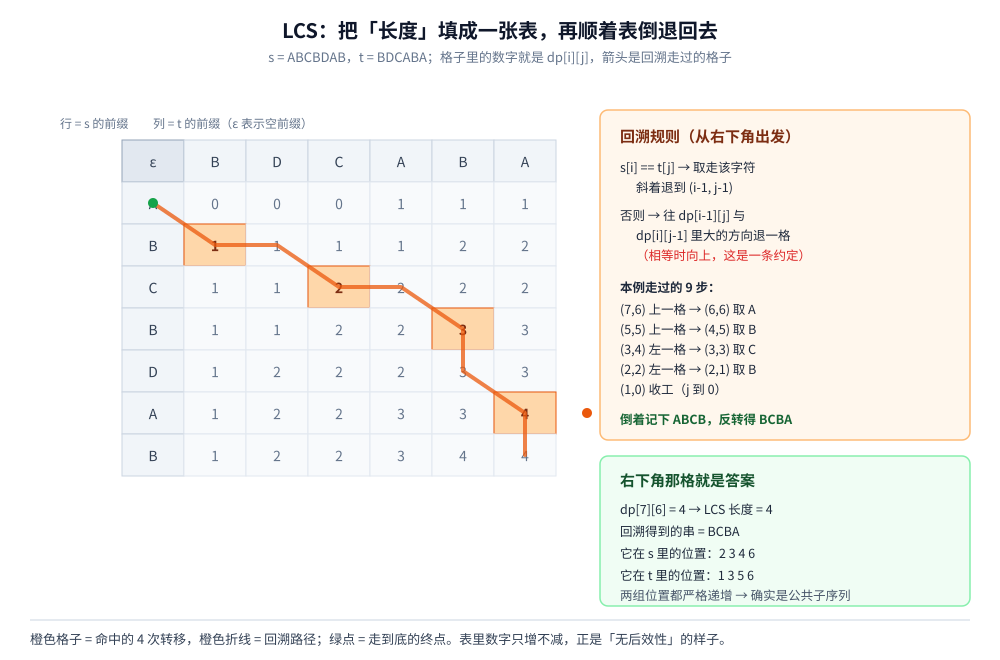

# LCS（最长公共子序列）

> 二维动态规划最标准的样板：**两个串各占一个维度**，`dp[i][j]` 表示「两个前缀之间」的最优值。
> 本篇把一套 7×6 的小表**逐格推演**出来，再从表里**回溯出具体的子序列**，并把它与编辑距离、最长公共子串这两个近亲的边界划清。
>
> ⭐ 本篇是 `算法/动态规划/` 三篇里的**二维样板**：[背包问题.md](背包问题.md) 讲一维滚动时「容量维度的方向」，
> 本篇讲「表怎么填、怎么倒着读回来」，[LIS.md](LIS.md) 讲「一维 DP 怎么降复杂度」。
> 三篇共用同一套「**状态 → 转移 → 边界 → 遍历顺序**」的四步法。
> ⚠️ 它算的是**容错匹配**（允许不同），与「子串精确匹配」（KMP 那一类）是两个方向的问题，不要混。
>
> 内容整理自个人学习笔记，素材见 [素材清单](../../../素材清单.md)。复杂度口径见 [复杂度分析.md](../基础算法/复杂度分析.md)；
> 「二维数组」这一层表示见 [线性结构/数组与链表.md](../../数据结构/线性结构/数组与链表.md)。
>
> 📎 本篇所有输出均为本机实跑逐字抄录：**Go 1.26.5（windows/amd64）** 与 **JDK 1.8.0_321** 各实现一份，
> 输出**逐行对齐**（93 行 diff 为空 —— 本篇没有耗时统计，全是确定性数据）。
> 实验代码在 `.workbuddy/tmp/dp_lab/lcs/` 与 `.workbuddy/tmp/dp_lab/java/LcsLab.java`。

---

## 一、LCS 的 DP 是怎么定出来的？

**本节要点**：依旧是「状态 → 转移 → 边界」三步。LCS 的漂亮之处在于：**「两个前缀」这个状态一旦定下来，转移只有两种情形，没有第三种**。

### 1.1 问题：两个串最长能「对上」多少

给定两个字符串 `s` 和 `t`，求一个**同时是两者子序列**的最长串。子序列的要求只有一条：**相对顺序不变，但可以不连续**。

⚠️ 这里必须先钉死一个区别：**子序列（subsequence）不要求连续，子串（substring）要求连续**。本篇讲的是前者，后者的差别见第五节 —— 两者的转移方程**只差一个分支**，但答案可以差很远。

### 1.2 第一步：状态定义

**`dp[i][j]` = `s` 的前 `i` 个字符 与 `t` 的前 `j` 个字符 的 LCS 长度。**

⭐ 两个维度都是「**前缀长度**」，也就是**阶段** —— 这是所有「两个序列之间」的 DP 的通用起手式。状态里放的是「长度」而不是「某个具体字符」，这样才不用关心中间过程长什么样。

### 1.3 第二步：转移方程

看 `s[i]` 与 `t[j]`（注意是第 `i`、`j` 个字符，不是下标 `i-1`）这一对：

| 情形 | 含义 | 转移 |
|---|---|---|
| **`s[i] == t[j]`** | 这个字符一定能用上 | `dp[i-1][j-1] + 1` |
| **`s[i] != t[j]`** | 至少有一个用不上 | `max( dp[i-1][j], dp[i][j-1] )` |

```text
s[i] == t[j]  →  dp[i][j] = dp[i-1][j-1] + 1
s[i] != t[j]  →  dp[i][j] = max( dp[i-1][j],  dp[i][j-1] )
```

⚠️ **为什么相等时可以直接「用上」而不用犹豫**：如果两个前缀的末位字符相同，那么存在一个最优解**一定以这个字符结尾** —— 把它接在「两个前缀各去掉一位」的最优解后面，不会让任何东西变差。这条和 [../贪心/霍夫曼编码.md](../贪心/霍夫曼编码.md) 里的交换论证是同一类思路：证明的是「存在一个最优解具有这个形状」。

⚠️ **为什么不等时要取 `max` 而不是两个都看**：末位对不上，那 LCS 要么不用 `s[i]`（→ `dp[i-1][j]`），要么不用 `t[j]`（→ `dp[i][j-1]`）。**这两种情形已经穷尽了**，所以取较大的那个即可。

### 1.4 第三步：边界

`dp[0][*] = dp[*][0] = 0`：任一侧是空串时，公共子序列长度必然是 0。

⭐ 同样开 `(n+1) × (m+1)` 的表，让第 0 行、第 0 列落在数组里，省掉特判。

### 1.5 复杂度与它的问题

| 维度 | 代价 |
|---|---|
| 时间 | `O(n · m)`：每格 `O(1)` |
| 空间 | `O(n · m)`：整张表 |

⚠️ 注意它与 [背包问题.md](背包问题.md) 的那个坑**完全相同**：`n·m` 里的 `n`、`m` 是**串的长度**，所以是「真」多项式 —— 这一点比背包好。但两个长字符串（比如两份 10 万行的文件）相乘就是 10^10 格，**空间先撑不住**，这才有了第三节的滚动行。

---

## 二、逐格推演与回溯（本机实测）

**本节要点**：把 `ABCBDAB` 与 `BDCABA` 这张 7×6 的小表一次填完，看清「命中」与「没命中」两类格子各自怎么算；再从右下角倒着走回来，得到具体子序列。

### 2.1 填表：一张 7×6 的小表

```text
=========== 实验一：LCS 的二维 DP 逐格推演 ===========
  s = ABCBDAB（长度 7）    t = BDCABA（长度 6）
  状态：dp[i][j] = s 的前 i 个字符 与 t 的前 j 个字符 的 LCS 长度
  转移：s[i] == t[j] → dp[i][j] = dp[i-1][j-1] + 1
        否则        → dp[i][j] = max(dp[i-1][j], dp[i][j-1])
  边界：dp[0][*] = dp[*][0] = 0

    ε    B    D    C    A    B    A
    ε    0    0    0    0    0    0    0
    A    0    0    0    0    1    1    1
    B    0    1    1    1    1    2    2
    C    0    1    1    2    2    2    2
    B    0    1    1    2    2    3    3
    D    0    1    2    2    2    3    3
    A    0    1    2    2    3    3    4
    B    0    1    2    2    3    4    4

  LCS 长度 = 4
```

⭐ 看图的方法：**先看对角线**。`dp[i][j]` 只由它的「上、左、左上」三个邻居决定 —— 这就是「**无后效性**」在表上的样子：**右下方永远不需要回头改左上方**。

### 2.2 「命中」的格子是怎么来的

程序把每一个 `s[i] == t[j]` 的格子单独列出来，显示它的加一来自哪：

```text
  逐格看「命中」的转移（s[i] == t[j] 的那些格子）：
        i=1(A) j=4(A)：dp[0][3] + 1 = 0 + 1 = 1
        i=1(A) j=6(A)：dp[0][5] + 1 = 0 + 1 = 1
        i=2(B) j=1(B)：dp[1][0] + 1 = 0 + 1 = 1
        i=2(B) j=5(B)：dp[1][4] + 1 = 1 + 1 = 2
        i=3(C) j=3(C)：dp[2][2] + 1 = 1 + 1 = 2
        i=4(B) j=1(B)：dp[3][0] + 1 = 0 + 1 = 1
        i=4(B) j=5(B)：dp[3][4] + 1 = 2 + 1 = 3
        i=5(D) j=2(D)：dp[4][1] + 1 = 1 + 1 = 2
        i=6(A) j=4(A)：dp[5][3] + 1 = 2 + 1 = 3
        i=6(A) j=6(A)：dp[5][5] + 1 = 3 + 1 = 4
        i=7(B) j=1(B)：dp[6][0] + 1 = 0 + 1 = 1
        i=7(B) j=5(B)：dp[6][4] + 1 = 3 + 1 = 4
  ⭐ 其余格子都是「取左边、上边里较大的那个」—— 这就是 max(dp[i-1][j], dp[i][j-1])
```

⭐ 读法：**12 次命中，每次都是「左上方那格 + 1」**。其余 30 格全是 `max(左, 上)`。

⚠️ 注意命中**不等于**进入最终答案：`i=1(A) j=4(A)` 那格的 1 就没有被选进最终解 —— **表里每一格都是「局部最优」，最终解是沿某条路径走出来的**，这就是为什么要回溯。



### 2.3 回溯：从右下角倒着走

```text
=========== 实验二：从表里回溯出具体子序列 ===========
  规则：s[i] == t[j] → 取走该字符、斜着退一格；
        否则 → 往 dp[i-1][j] 与 dp[i][j-1] 中较大的方向退一格（相等时向上）
        i=7 j=6：s=B ≠ t=A，dp[i-1][j]=4 >= dp[i][j-1]=4 → 向上 i=6
        i=6 j=6：s=A == t=A → 取 A，退到 i=5 j=5
        i=5 j=5：s=D ≠ t=B，dp[i-1][j]=3 >= dp[i][j-1]=2 → 向上 i=4
        i=4 j=5：s=B == t=B → 取 B，退到 i=3 j=4
        i=3 j=4：s=C ≠ t=A，dp[i-1][j]=1 < dp[i][j-1]=2 → 向左 j=3
        i=3 j=3：s=C == t=C → 取 C，退到 i=2 j=2
        i=2 j=2：s=B ≠ t=D，dp[i-1][j]=0 < dp[i][j-1]=1 → 向左 j=1
        i=2 j=1：s=B == t=B → 取 B，退到 i=1 j=0
    走到底（i=1 或 j=0），倒着记下的字符 = ABCB
  反转过来 → LCS = "BCBA"（长度 4）
  校验：是 s 的子序列 = true；是 t 的子序列 = true
```

⭐ 三个要点：

- **走的方向只有三种**：相等就斜着退（并记下字符），不等就往值大的方向退一格；
- **因为是从下往上走，记下的字符是倒序的**，所以最后要反转一次 —— 这一步很容易忘；
- **程序自己也做了一次校验**：`BCBA` 在 `s` 与 `t` 里都是子序列（用双指针扫一遍验证），而不是「相信回溯一定对」。

### 2.4 ⚠️ tiebreak 是一条「约定」，不是自由

2.3 的规则里藏着一处约定：`i=7 j=6` 那一步 `dp[6][6] = dp[7][5] = 4`，**两个方向一样大**。程序选择**向上**。

⚠️ 这一点很重要：**LCS 可能有多个，回溯规则决定了你会拿到哪一个**。

| 规则 | 本例得到的串 |
|---|---|
| 相等时**向上** | `BCBA` |
| 相等时**向左** | `BDAB`（本例逐格走一遍即可验证） |

⭐ 两个都是合法答案，长度都是 4。**所以「LCS 是什么」这个问题必须连着「回溯规则是什么」一起问** —— 这也是 [LIS.md](LIS.md) 第三节那个坑的近亲：**长度唯一，解不唯一。**

⚠️ 工程后果：如果两个系统各自实现 LCS 来比对差异，**tiebreak 必须一致**，否则同样的输入会给出不同的「差异列表」，看起来像数据不一致，其实是算法约定不同。

---

## 三、空间优化：滚动行与「方向不能反」

**本节要点**：算长度只需要两行，但**方向不能反** —— 这里必须**正序**，与 [背包问题.md](背包问题.md) 的结论刚好相反。原因是两者依赖的邻居不同。

### 3.1 只要长度的话，两行就够

从转移方程看，`dp[i][*]` 只读 `dp[i-1][*]` 与 `dp[i][*]` —— **上一行 + 本行**，两行足够。空间从 `O(n·m)` 降到 `O(m)`。

### 3.2 本机实测

```text
=========== 实验三：空间优化（滚动行）与「方向不能反」===========
  全表要 (n+1)×(m+1) 个单元，但算「长度」其实只需要两行
  ✅ 滚动两行（上一行 + 当前行）：LCS 长度 = 4，与全表一致 = true
  ⚠️ 滚动行只留下长度 —— 子序列还原不回来（要还原得走 Hirschberg 分治，O(n+m) 空间）
  ❌ 单行写法把内层 j 改成逆序（只改了循环方向）：
     逐行 dp：
       i=1(A)：dp = [0 0 0 0 1 0 1]
       i=2(B)：dp = [0 1 0 0 1 2 1]
       i=3(C)：dp = [0 1 1 1 1 2 2]
       i=4(B)：dp = [0 1 1 1 1 2 2]
       i=5(D)：dp = [0 1 2 1 1 2 2]
       i=6(A)：dp = [0 1 2 2 2 2 3]
       i=7(B)：dp = [0 1 2 2 2 3 3]
     结果 = 3（与全表一致 = false）
```

⭐ 读法：正确值是 **4**，逆序单行给出 **3**。对照第一行 `i=1(A)` —— 正确那一行应该是 `[0 0 0 0 1 1 1]`，而逆序给出 `[0 0 0 0 1 0 1]`：**后两个 1 被吃掉了**，因为算 `dp[5]`、`dp[6]` 时读到的 `dp[4]`、`dp[5]` 还是上一行的 0。

### 3.3 为什么这里必须正序

单行写法里 `dp[j]` 被反复覆盖，于是：

| 转移里的项 | 单行时的含义 | 要求 |
|---|---|---|
| `dp[j-1]` | 若 `j` **正序**，它是**本行**刚写好的 `dp[i][j-1]` ✓ | 必须是新值 |
| `dp[j]` | 还没被本行覆盖，是**上一行**的 `dp[i-1][j]` ✓ | 必须是旧值 |

⚠️ 逆序遍历时，`dp[j-1]` 还没轮到被写，读到的就是**上一行**的 `dp[i-1][j-1]` —— 而转移要的是本行的 `dp[i][j-1]`。**同一个数组，两个格子，一个有新有旧的混合状态。**

```text
单行 + 正序（正确）：
   for j := 1; j <= m; j++ {
       dp[j] = s[i]==t[j] ? diag+1 : max(dp[j]/*上一行*/, dp[j-1]/*本行*/)
   }
```

### 3.4 与背包的正面对照

这两篇给出了「遍历方向」的完整判据 —— **注意两篇的结论是相反的，这不是矛盾**：

| | 一维 LCS（滚动行） | 一维 0-1 背包 |
|---|---|---|
| `dp[i][j]` 依赖 | **本行左边** `dp[i][j-1]` | **上一行同列** `dp[i-1][w]`（在 `dp[w-wt]` 上） |
| 所以内层必须 | **正序** | **逆序** |
| 写反的后果 | 长度算小（4 → 3） | 算成完全背包（10 → 12） |

⭐ 判据（[背包问题.md](背包问题.md) 3.5 那句的复用版）：**转移里那个可能被本行污染的格子，必须是「新值」就正序；要它保持「旧值」就逆序。**

### 3.5 想要子序列怎么办：Hirschberg

滚动行只留下长度 —— **要还原具体子序列，必须保留整张表**（或者走 Hirschberg 分治：先用滚动行求中间行，再在左右两半递归，把空间压到 `O(min(n,m))`）。

⭐ 这与 [背包问题.md](背包问题.md) 6.3 的结论**完全一样**：**要答案就压空间，要方案就得留表。**

---

## 四、LCS 与编辑距离的关系

**本节要点**：如果编辑操作只允许**插入 / 删除**，那么编辑距离与 LCS 之间有一个恒等式。这也是「LCS 到底在算什么」最直白的解释。

### 4.1 恒等式

把 `s` 变成 `t`，只允许插入和删除时：

```text
编辑距离 = |s| + |t| - 2 × LCS(s, t)
```

⭐ 为什么：**LCS 里的那些字符可以原地不动**。`s` 里不在 LCS 中的字符要**删掉**（`|s| - LCS` 个），`t` 里不在 LCS 中的字符要**插入**（`|t| - LCS` 个），加起来就是上式 ✓

### 4.2 本机实测

```text
=========== 实验四：LCS 与编辑距离的关系 ===========
  只允许「插入 / 删除」时，编辑距离 = |s| + |t| - 2 × LCS
    s="kitten" t="sitting"  LCS=4  增删距离=6+7-2×4= 5  替换版(Levenshtein)=3
    s="ABCBDAB" t="BDCABA"  LCS=4  增删距离=7+6-2×4= 5  替换版(Levenshtein)=5
    s="flaw"   t="lawn"    LCS=3  增删距离=4+4-2×3= 2  替换版(Levenshtein)=2
    s="abc"    t="abc"     LCS=3  增删距离=3+3-2×3= 0  替换版(Levenshtein)=0
    s=""       t="abc"     LCS=0  增删距离=0+3-2×0= 3  替换版(Levenshtein)=3
```

### 4.3 允许替换之后：Levenshtein

把「替换」也加进操作集合，就是标准的 **Levenshtein 距离**。它的 DP 与 LCS **只差一处**：

| | 二维转移 |
|---|---|
| LCS | `dp[i][j] = s[i]==t[j] ? dp[i-1][j-1]+1 : max(dp[i-1][j], dp[i][j-1])` |
| Levenshtein | `dp[i][j] = min( dp[i-1][j]+1, dp[i][j-1]+1, dp[i-1][j-1] + (s[i]==t[j] ? 0 : 1) )` |

⚠️ 一个是 `max` 求「最多保留多少」，一个是 `min` 求「最少改几步」，但骨架完全相同。

⭐ 实测里 **`kitten → sitting`** 最能说明差别：

- **增删距离 = 5**（`6 + 7 − 2×4`），允许替换之后降到 **3**；
- 原因就是那句实测结论：**一次替换 = 一次删除 + 一次插入**，所以 `Levenshtein ≤ 增删距离` **恒成立**（允许的操作变多了，最短步数只会更小）。

⚠️ 反过来不成立：`ABCBDAB → BDCABA` 两个距离都是 5，因为这两个串的最优对齐里没有可替换的位置。

---

## 五、最长公共子序列 ≠ 最长公共子串

**本节要点**：这两个词中文只差一个字，实际是两个不同的算法。差别只有一处：**转移的「否则」分支到底写 `max` 还是写 `0`**。

### 5.1 差别在哪

| | 子序列（subsequence） | 子串（substring） |
|---|---|---|
| 连续性 | 不要求 | **必须连续** |
| 转移的「否则」分支 | `max(dp[i-1][j], dp[i][j-1])` | **直接清零** |
| 清零的含义 | —— | 「**断开了，重新开始数**」 |

### 5.2 本机实测

```text
=========== 实验六：最长公共子序列 ≠ 最长公共子串 ==========
  子序列：可以不连续，只要相对顺序不变
  子串  ：必须连续
    s=ABCBDAB  t=BDCABA    最长公共子序列 = 4   最长公共子串 = 2（"AB"）
    s=kitten   t=sitting   最长公共子序列 = 4   最长公共子串 = 3（"itt"）
    s=abc      t=abc       最长公共子序列 = 3   最长公共子串 = 3（"abc"）
```

⭐ 读法：只有在**两串完全相同时**两者才相等（第三行）。第一行里 LCS 是 4，而最长公共子串只有 2（`"AB"`）—— **差了整整一倍**。

⚠️ 这也说明：「LCS」这个缩写必须先问清是哪个 —— **`subsequence` 与 `substring` 在英文里差三个字母，在答案上可以差一倍**。

### 5.3 顺带一提：最长公共子串的空间也能压

子串版同样可以只用两行滚动（甚至一行），因为它同样只依赖「上、左、左上」三个邻居 —— 与 3.1 同理。

---

## 六、实测：三种写法在随机数据上互校

**本节要点**：把「全表」「滚动行」「回溯」三份实现放在同一批随机数据上交叉验证 —— **一条结论如果只在一个手算例子上成立，它就不算结论。**

### 6.1 互校的三件事

```text
=========== 实验五：随机数据（同一 LCG）上的三种写法互校 ==========
  60 组随机串，逐个检查三件事：
    ① 全表与滚动行长度相同      ② 回溯出的串长度 == LCS 长度
    ③ 回溯出的串确实是两串的公共子序列
  全部通过 = 60 / 60（全通过 = true）
  例：s=AADACBBCCCBBD t=CCDCBDBA → LCS 长度 5，子序列 "CCCBB"
```

⭐ 随机数据由**两语言共用的同一个 LCG** 生成（`s = s × 6364136223846793005 + 1442695040888963407`），
所以 Go 与 Java 两份程序**面对的是完全相同的 60 组输入**，输出才能逐行对齐。

⚠️ 这三条检查缺一不可：**①验证空间优化没改变答案，②验证回溯长度正确，③验证回溯出来的串真的是公共子序列**（而不是「长度对了但内容不对」）。第 ③ 条最容易漏，也最容易出问题 —— 它是唯一一条真正检查「内容」的。

---

## 使用：这条算法在你的系统里以什么形式出现

LCS 是所有「**比对两份东西、找出共同部分**」的工具的原型。结合本仓库已有篇目逐层看：

**第一层：版本差异 —— 它就在你每天用的 `git diff` 里**。把两个版本的文件当成两个「字符序列」，**行序列的 LCS 就是「两边都没改动的那部分」**，剩下的就是增删行 —— 这正是 4.1 那条恒等式：`增删行数 = |s| + |t| - 2 × LCS`。

⚠️ 但真实实现（Myers 算法）**不会真的去算 LCS**：完整 LCS 是 `O(n·m)`，两份 10 万行的文件就是 10^10 格，根本算不动。它求的是**最短编辑脚本（SES）**，并用「只探索距离对角线附近的带状区域」把平均复杂度压到接近线性。

⭐ **这里有一个值得记住的取舍**：4.1 的恒等式说明「增删距离」与「LCS」是**同一件事的两种量法**，所以工程实现可以选择更好算的那一侧。相关：[../../../06-工程实践/版本控制/Git命令与使用场景.md](../../../06-工程实践/版本控制/Git命令与使用场景.md)。

**第二层：数据比对与增量迁移**。两份数据「哪些记录没变、哪些是新加的」，结构上与 diff 一模一样（把记录按主键排序后求 LCS）。⚠️ 但这里的 `n·m` 常常直接爆掉，所以实践中大多退化成「**先按主键哈希分桶、再只比同桶的**」或者「**只比时间戳变化的**」——**用领域约束把 `O(n·m)` 降回线性**，而不是硬算 LCS。相关：[../../../03-数据与中间件/数据存储/mysql/数据迁移.md](../../../03-数据与中间件/数据存储/mysql/数据迁移.md)。

**第三层：模糊匹配与相似度打分**。把「LCS 长度 / 较长串长度」当成一个相似度分数，是拼写纠错、地址归一化、模糊去重里最常见的朴素做法。⚠️ 但当两侧长度差很大时这个分数会失真，工业界更常用 Levenshtein 或 Jaro-Winkler（4.3 的替换版）。

⭐ **归纳成一条判断**：**LCS 的价值不在「跑一遍 O(n·m)」，而在于它给出了「差异」这个概念的数学定义。** 真实的 `diff` / 合并 / 增量同步，都是在这个定义上做**剪枝** —— 而这些剪枝能不能用，取决于你的数据有没有可利用的结构（有序、可分桶、时间局部性）。

---

## 延伸追问

- **为什么相等时可以直接 `+1`，不用比较两种情形？** → 因为当两侧末位字符相同时，**一定存在一个最优解以它结尾**（把该字符接到「两边各去掉一位」的最优解后面即可）。⚠️ 这条需要证明，不能想当然 —— 它和 [../贪心/霍夫曼编码.md](../贪心/霍夫曼编码.md) 的交换论证同属一类：证明的是「存在一个最优解具有这个形状」。
- **`dp` 数组为什么要开 `(n+1) × (m+1)`？** → 让 `dp[0][*]` 与 `dp[*][0]` 这两条边落在数组里，转移里就不用到处判断「`i-1` 是不是越界」了。
- **LCS 唯一吗？** → **不唯一**，但长度唯一。⚠️ 回溯规则里的 tiebreak 决定你拿到哪一个（2.4 实测：向上得 `BCBA`、向左得 `BDAB`）。跨系统比对时 tiebreak 必须一致。
- **单行为什么必须正序？** → 因为 `dp[i][j]` 要用**本行左边**的 `dp[i][j-1]`；逆序时那格还没被写，读到的还是上一行的旧值（3.3）。⚠️ 与背包的结论**相反**（背包要逆序），判据是同一个 —— 看那个格子该是「新值」还是「旧值」。
- **滚动行还能回溯吗？** → **不能**（3.2、3.5）。要子序列就得留整张表，或用 Hirschberg 分治把空间压到 `O(min(n,m))`。这与背包 6.3 的结论一致：**要答案就压空间，要方案就得留表。**
- **LCS 和编辑距离到底什么关系？** → 只允许增删时 `距离 = n + m − 2·LCS`（4.1）；允许替换后变成 Levenshtein，两者**恒有 `Levenshtein ≤ 增删距离`**（实测 `kitten/sitting` 是 3 vs 5）。
- **`subsequence` 和 `substring` 差在哪里？** → 转移的「否则」分支：一个写 `max(上, 左)`，一个**直接清零**（5.1）。⚠️ 实测 `ABCBDAB / BDCABA` 上两者是 4 与 2，**差一倍**。
- **能不能只算长度、不要具体子序列？** → 可以，而且这是最常见的用法（相似度打分、差异计数）。⚠️ 一旦要「具体差异」，空间就回不去 `O(m)` 了 —— 除非上 Hirschberg。
- **三串以上的 LCS 呢？** → 状态变成 `dp[i][j][k]…`，维度等于串数，时间是长度乘积 —— **指数级爆炸**，三串以上几乎没有实用价值（这也是为什么多路 `diff` 会退化成两两比对）。
- **有没有比 `O(n·m)` 更快的？** → 对**一般**字符串，最好的已知算法是 `O(n² / log n)` 量级，改进有限；但在**近似**意义上有亚二次算法（如 Bit-parallel、四 Russians 方法），以及利用数据特性的剪枝（差分算法、带状 DP）。⚠️ 所以工程上普遍选择「换问题」而不是「换算法」。

## 关联

- [背包问题.md](背包问题.md) — **本篇的正面对照**：同为二维 DP，那篇讲「一维滚动时容量维度的方向」，本篇讲「填表 + 回溯」；两篇的遍历方向结论**刚好相反**（3.4 有对照表）
- [LIS.md](LIS.md) — 姊妹篇：那篇用「LIS 等价于 LCS」的变形接到本篇（第五节），也共享「长度唯一、解不唯一」这个坑
- [线性结构/数组与链表.md](../../数据结构/线性结构/数组与链表.md) — 本篇用到的二维数组表示，以及「行优先 / 列优先」的访问代价
- [复杂度分析.md](../基础算法/复杂度分析.md) — `O(n·m)` 的口径，以及为什么它可以被剪枝到接近线性
- [../贪心/霍夫曼编码.md](../贪心/霍夫曼编码.md) — 同为「先证一个交换/不变式、再写转移」的范例：那篇证明贪心选择性质，本篇 1.3 的两个「为什么可以直接 `+1`」是同一类论证
- [../../../06-工程实践/版本控制/Git命令与使用场景.md](../../../06-工程实践/版本控制/Git命令与使用场景.md) — 「使用」第一层：`git diff` 与三方合并背后的差异定义
- [../../../03-数据与中间件/数据存储/mysql/数据迁移.md](../../../03-数据与中间件/数据存储/mysql/数据迁移.md) — 「使用」第二层：数据比对为什么不直接跑 LCS，而是先按领域约束剪枝
> 反向引用（本篇被下列文档引到）：[双指针.md](../基础算法/双指针.md)、[递归与分治.md](../基础算法/递归与分治.md)
