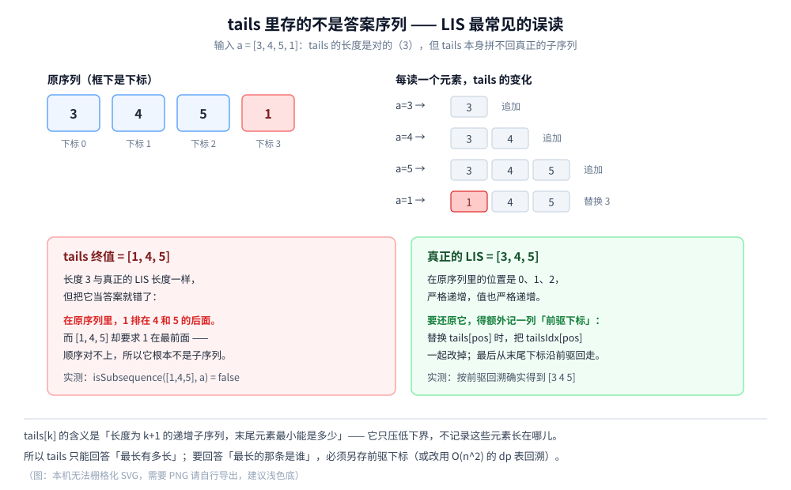

# LIS（最长递增子序列）

> 同一个问题的两种解法：`O(n²)` 的直译 DP，和 `O(n log n)` 的「**tails 数组 + 二分**」。
> 后者的 `tails` 数组是 LIS 里最容易误读的东西 —— ⚠️ **它里面的元素拼不回答案序列**，本篇用两个反例把这件事钉死，
> 并给出真正能还原序列的做法（额外记一列前驱下标）。
>
> ⭐ 本篇是 `算法/动态规划/` 三篇里的**降复杂度篇**：[背包问题.md](背包问题.md) 讲「遍历方向决定语义」，
> [LCS.md](LCS.md) 讲「填表 + 回溯」，本篇讲「**换个数据结构，`O(n²)` 就能降到 `O(n log n)`**」。
> 三篇共用同一套「**状态 → 转移 → 边界 → 遍历顺序**」的四步法。
> ⭐ 它与 [LCS.md](LCS.md) 之间还有一条直接的等价变形（第五节：LIS = LCS(a, 排序去重后的 a)）—— 那是个有意思的理论关系，但**不是推荐写法**。
>
> 内容整理自个人学习笔记，素材见 [素材清单](../../../素材清单.md)。二分与有序数组见 [数组与链表.md](../../数据结构/线性结构/数组与链表.md)；
> 复杂度与「只断言趋势」的口径见 [复杂度分析.md](../基础算法/复杂度分析.md)。
>
> 📎 本篇所有输出均为本机实跑逐字抄录：**Go 1.26.5（windows/amd64）** 与 **JDK 1.8.0_321** 各实现一份，
> 输出**逐行对齐**（85 行里 diff 只剩实验六的 6 行耗时 + 1 行由耗时算出的倍数）。

---

## 一、LIS 的第一种解法：O(n²) 的 DP

**本节要点**：把定义直译成状态。这一版思路最直白、也最容易写出还原路径，代价是 `O(n²)`。

### 1.1 第一步：状态定义

**`dp[i]` = 以 `a[i]` **结尾** 的最长递增子序列长度。**

⚠️ **「以 `a[i]` 结尾」这四个字是整个 DP 的骨架**，不能省：

- 如果只定义成「前 `i` 个元素里的 LIS 长度」，那么下一项能不能接上去就判断不了 —— **不知道当前结尾是谁**；
- 加上「以 `a[i]` 结尾」之后，「能不能接」这个问题就变成了一个明确的比较：`a[j] < a[i]`。

⭐ 这与 [背包问题.md](背包问题.md) 2.1 是同一个道理：**转移要用到的信息，必须进状态。** 背包缺了「容量用了多少」会寸步难行，这里缺了「结尾是谁」也一样。

### 1.2 第二步：转移与边界

```text
dp[i] = 1 + max{ dp[j] : j < i 且 a[j] < a[i] }     没有这样的 j 时取 1
```

- **边界**：`dp[i]` 至少是 `1` —— `a[i]` 自己就是一条长度 1 的递增子序列；
- **答案**：`max(dp)`，而不是 `dp[n-1]`。⚠️ 这点与 LCS 不同 —— LCS 的答案永远在右下角（`dp[n][m]`），而 LIS 的答案在**整张表的最大值**上，因为「最长的那条不一定以最后一个元素结尾」。

### 1.3 逐项推演（本机实测）

```text
=========== 实验一：O(n^2) 的 DP（定义直译）===========
  a = [10 9 2 5 3 7 101 18]（长度 8）
  状态：dp[i] = 以 a[i] 结尾的 LIS 长度
  转移：dp[i] = 1 + max{ dp[j] : j < i 且 a[j] < a[i] }（没有这样的 j 时取 1）
  边界：dp[i] 至少是 1（a[i] 自己）
     i= 0 a= 10：无更小的前驱 → dp = 1
     i= 1 a=  9：无更小的前驱 → dp = 1
     i= 2 a=  2：无更小的前驱 → dp = 1
     i= 3 a=  5：dp[2] + 1 → dp = 2
     i= 4 a=  3：dp[2] + 1 → dp = 2
     i= 5 a=  7：dp[3]/dp[4] + 1 → dp = 3
     i= 6 a=101：dp[5] + 1 → dp = 4
     i= 7 a= 18：dp[5] + 1 → dp = 4
  LIS 长度 = 4
```

⭐ 三个读数：

- **`i=5 a=7` 有两个合法的前驱**（`dp[3]` 与 `dp[4]` 都是 2）—— 这说明**同一个 `dp` 值可以对应多条不同的路径**，也是「LIS 不唯一」的根源；
- **`i=6 a=101` 是最大的那个值**，`dp = 4`，所以答案不再增长；
- **`dp` 数组不是单调的**：`[1 1 1 2 2 3 4 4]` —— **只有最大值有意义**，这一点与 LCS 表「每格都在为最终解服务」的观感很不一样。

### 1.4 复杂度

| 维度 | 代价 |
|---|---|
| 时间 | `O(n²)`：每个 `i` 都要回看前面所有的 `j` |
| 空间 | `O(n)`：只需要 `dp` 数组 |

⚠️ `n = 10^4` 时是 10^8 次比较，勉强能忍；`n = 10^5` 就是 10^10 次，**必须换解法**（第二节）。

### 1.5 这一版的隐藏优势：容易还原出序列

`dp[i]` 的定义里带着「**以 `a[i]` 结尾**」，所以只要再记一个 `prev[i] = 那个让 dp[i] 最大的 j`，就能从最大值的位置沿 `prev` 一路走回开头，得到具体的那条子序列。

⭐ 这是后面第三节要用的对照：**`O(n log n)` 那一版把「位置」这个信息丢掉了**，所以它反而更不容易还原。

---

## 二、LIS 的第二种解法：O(n log n) 的「贪心 + 二分」

**本节要点**：换一个状态定义。不再问「以谁结尾」，而是维护一个 `tails` 数组，**让每个长度对应的「结尾」尽可能小**。`tails` 的长度就是答案。

### 2.1 状态定义换成了什么

**`tails[k]` = 到目前为止，所有长度为 `k+1` 的递增子序列中，末尾元素的最小值。**

⚠️ 注意这个状态是**增量维护**的：它不是「前 `i` 个元素」的答案，而是**扫过一个元素就更新一次**的辅助数组。

⭐ **它为什么有用**：`tails` 是**严格递增**的（后面 2.4 会说明），而一个严格递增的数组上做查找就是 `O(log n)`。**用一个有序结构，把「回看前面所有的 `j`」换成了「二分一次」。**

### 2.2 三步规则

扫到元素 `x` 时：

| 步骤 | 动作 |
|---|---|
| ① | 在 `tails` 里二分找**第一个 `>= x`** 的位置（`lower_bound`） |
| ② | **找到** → 用 `x` 替换它（这一长度的结尾变得更小了） |
| ③ | **没找到**（`x` 比所有元素都大）→ 追加到末尾，LIS 长度 +1 |

### 2.3 实测：tails 逐步变化

```text
=========== 实验二：O(n log n)「贪心 + 二分」的 tails 逐步变化 ===========
  tails[k] = 目前为止「长度为 k+1 的递增子序列」中，末尾元素的最小值
  每个新元素 x：二分找 tails 里第一个 >= x 的位置 —— 找到就替换，找不到就追加
     a= 10 → tails = [10]（追加）
     a=  9 → tails = [9]（替换）
     a=  2 → tails = [2]（替换）
     a=  5 → tails = [2 5]（追加）
     a=  3 → tails = [2 3]（替换）
     a=  7 → tails = [2 3 7]（追加）
     a=101 → tails = [2 3 7 101]（追加）
     a= 18 → tails = [2 3 7 18]（替换）
  LIS 长度 = len(tails) = 4（与 O(n^2) 一致 = true）
  收尾时 tails = [2 3 7 18]
```

⭐ 两个读数：

- **`tails` 全程保持严格递增** —— 这是二分能用的前提，也是 2.4 要证明的东西；
- **序列末尾的 `[2 3 7 18]` 恰好也是本序列的一个合法 LIS** —— ⚠️ **但这是巧合**，第三节会用反例说明它随时可能不是。

### 2.4 为什么 `tails` 是递增的、且长度就是答案

**① `tails` 严格递增**：`tails[k]` 是「长度为 `k+1` 的子序列的最小结尾」。若 `tails[k] >= tails[k+1]`，那么长度为 `k+2` 的那条子序列砍掉最后一位，就得到一条长度为 `k+1`、结尾更小的子序列，与 `tails[k]` 的最小性矛盾。∎

⭐ 换成一句直觉：**「更长的子序列，结尾不可能更小」** —— 因为长的那条自己就包含了短的那条。

**② 长度就是答案**：替换操作**不改变长度**，只有追加才让 `len(tails)` 加一；而每一次追加都对应着「存在一条更长的递增子序列」。所以 `len(tails)` 恰好是扫到目前为止的 LIS 长度。∎

### 2.5 复杂度

| 维度 | 代价 |
|---|---|
| 时间 | `O(n log n)`：`n` 个元素，每个一次二分 |
| 空间 | `O(n)`：`tails` 数组 |

⚠️ 注意这里的 `log n` 是**严格保证**的（二分），不是平均 —— 与 [查找与排序对比.md](../基础算法/查找与排序对比.md) 里说的「哈希表平均 `O(1)`、最坏 `O(n)`」不是一回事。

---

## 三、⚠️ tails 里存的不是答案序列

**本节要点**：这是 LIS 最常见的误读，也是本篇最想讲清的一点。`tails` 的长度**永远是对的**，但 `tails` 的**内容随时可能不是任何一条子序列**。

### 3.1 两个反例（本机实测）

```text
=========== 实验三：⚠️ tails 里存的不是答案序列 ===========
  反例：a = [3 4 5 1]
     a=3 → tails = [3]
     a=4 → tails = [3 4]
     a=5 → tails = [3 4 5]
     a=1 → tails = [1 4 5]
     tails 终值 = [1 4 5]，长度 = 3
     [1 4 5] 是原序列的子序列吗 = false  ← ⚠️ 这就是坑
     真正的 LIS（记前驱下标回溯）= [3 4 5]，长度 = 3
     长度对得上 = true；真正解严格递增 = true；是原序列子序列 = true
  反例：a = [5 6 7 1 2]
     a=5 → tails = [5]
     a=6 → tails = [5 6]
     a=7 → tails = [5 6 7]
     a=1 → tails = [1 6 7]
     a=2 → tails = [1 2 7]
     tails 终值 = [1 2 7]，长度 = 3
     [1 2 7] 是原序列的子序列吗 = false  ← ⚠️ 这就是坑
     真正的 LIS（记前驱下标回溯）= [5 6 7]，长度 = 3
     长度对得上 = true；真正解严格递增 = true；是原序列子序列 = true
```

⚠️⚠️ **两个反例的杀伤力在于**：`[1 4 5]` 与 `[1 2 7]` 都是**严格递增**的、长度也**恰好等于正确答案**，看起来完全「像」一条 LIS —— 但只要拿回原序列里数一数位置，就会发现**它们根本不是子序列**。

### 3.2 为什么会这样

看反例一：`a = [3 4 5 1]`。

- 读到 `1` 时，二分找到 `tails[0] = 3`，于是把它替换成 `1`；
- 这一替换的**真实含义**是：「**长度为 1** 的递增子序列，结尾最小可以做到 `1`」；
- 它**并没有说**「`1` 是长度为 3 的那条子序列的开头」。

⭐ 一句话：**`tails[k]` 是「长度为 `k+1` 的子序列这个类别」的一个下界，不是某一条具体子序列的第 `k` 个元素。** 每个位置的替换是**独立**发生的，位置之间**没有「同属一条子序列」的绑定关系** —— 位置信息在替换时就被丢掉了。

⚠️ 更直白地说：`tails` 里同时装着「来自不同时刻、不同子序列」的尾巴。它们凑在一起刚好递增，纯属**数值上的巧合**。



### 3.3 怎么还原真正的 LIS

既然丢的是「位置」，那就补回来 —— 维护**两个平行数组**加一个**前驱数组**：

| 数组 | 含义 |
|---|---|
| `tailsVal[k]` | 就是原来的 `tails[k]`（值） |
| `tailsIdx[k]` | 产生 `tails[k]` 的**那个元素在原序列里的下标** |
| `prev[i]` | 以 `a[i]` 结尾的最长子序列里，`a[i]` 的**前驱下标** |

规则只有一句：**每次写 `tailsVal[pos] = x` 时，同步把 `tailsIdx[pos] = i`；同时 `prev[i] = tailsIdx[pos-1]`（若 `pos > 0`）。**

⚠️ 关键是「同步」——`prev[i]` 必须用**替换发生之前**的 `tailsIdx[pos-1]`，因为它代表的是「长度为 `pos` 的那条子序列的结尾」。写完之后再走：

```text
从 tailsIdx[len(tails)-1] 出发，沿着 prev 一路回退，再把结果反转
```

⭐ 实测里两条反例都成功还原出 `[3 4 5]` 与 `[5 6 7]`（`真正解严格递增 = true；是原序列子序列 = true`）。**多花 `O(n)` 空间，就能把「长度」升级成「方案」。**

---

## 四、严格递增还是非递减？

**本节要点**：整段代码里只有一处差别 —— 二分找的是「第一个 `>= x`」还是「第一个 `> x`」。一个符号，答案完全不同。

### 4.1 一个符号的差别（本机实测）

```text
=========== 实验四：严格递增 vs 非递减（只差 lower_bound / upper_bound）===========
  a = [2 2 2]
     严格递增（替换第一个 >= x，lower_bound）：tails = [2]，长度 = 1
     非递减  （替换第一个 >  x，upper_bound）：tails = [2 2 2]，长度 = 3
  a = [1 3 3 4]
     严格递增（替换第一个 >= x，lower_bound）：tails = [1 3 4]，长度 = 3
     非递减  （替换第一个 >  x，upper_bound）：tails = [1 3 3 4]，长度 = 4
```

### 4.2 怎么选

| 题目要求 | 用哪个 | 理由 |
|---|---|---|
| **严格递增**（`a[i] < a[i+1]`） | `lower_bound`（第一个 `>= x`） | 等值元素**必须**替换掉已有的，不能追加 |
| **非递减**（`a[i] <= a[i+1]`） | `upper_bound`（第一个 `> x`） | 等值元素**可以**接着排下去 |

⭐ 记忆锚点：**「相等要不要算递增」这个问题的答案，就写在二分的比较符里。**

⚠️ 这两件事连带影响第五节的 LCS 变形，也影响 [LCS.md](LCS.md) 里「长度唯一」那句话 —— **在动手之前必须先确认到底是哪一种。**

---

## 五、LIS 和 LCS 的等价变形

**本节要点**：`LIS(a)` 恰好等于 `LCS(a, a 排序去重后的结果)`。这是个漂亮的等价，也是个**性能陷阱**。

### 5.1 变形本身

```text
LIS(a) = LCS( a , sort(unique(a)) )
```

⭐ 直觉：排序去重后的数组就是「所有可能取到的值，按从小到大排列」。`a` 与它的公共子序列，一定是「从 `a` 里挑出的、值递增的一串」—— 那正是 LIS 的定义。

⚠️ 反过来看更有意思：**这个变形说明了 LIS 的难度上限** —— 既然 `LIS` 能化成 `LCS`，那 `LIS` 就不会比 `LCS` 更难（而 `LCS` 是 `O(n²)`）；但由于 `LIS` 有专门的 `O(n log n)` 解法，**它比通用 `LCS` 更简单**。这也提示：**别机械套用变形，要看清问题本身有没有更好的结构。**

### 5.2 实测

```text
=========== 实验五：LIS 等价于 LCS(a, 排序去重后的 a) ===========
  对 30 组随机数组逐个验证：LIS(a) == LCS(a, 排序去重后的 a)
  全部相等 = 30 / 30
  ⚠️ 为什么必须去重：a = [2 2 2]
     LIS（严格）              = 1
     LCS(a, 排序后不去重)     = 3  ← 算成了「非递减」的长度
     LCS(a, 排序去重后)       = 1
```

### 5.3 ⚠️ 为什么必须去重

`a = [2 2 2]`：

- **严格递增**的 LIS 长度是 **1**（只有一个值，不能重复）；
- 但 `sort(a)` 不去重得到的是 `[2 2 2]`，`LCS([2,2,2], [2,2,2]) = 3` —— **它允许把三个 2 都取上**，算出来的是**非递减**的长度；
- 去重之后 `sort(unique(a)) = [2]`，`LCS([2,2,2], [2]) = 1` ✓

⭐ 这也顺带解释了第四节的规律：**「去不去重」和「`lower_bound` / `upper_bound`」是同一件事的两种说法**。

⚠️ 工程上还有个现实问题：`LCS` 是 `O(n·m)`，而这里 `m = unique(a)` 可能也是 `n` —— 于是整体退化成 `O(n²)`，**比直接用第一节的 DP 还慢**。所以这个变形**只有理论价值**，别写进生产代码。

---

## 六、两种解法的耗时实测

**本节要点**：把两个解法放在同一批随机排列上量一遍。⚠️ 这里的数字**只用来断言趋势与量级**，绝对值和两语言之间的差距都会波动。

### 6.1 实测

```text
=========== 实验六：O(n^2) vs O(n log n)（本机实测，多轮累加取平均）===========
  输入是随机排列（同一 LCG），数据生成不计入计时；
  计时只含算法本身：O(n log n) 这一侧不带「每步快照」（快照是 O(n) 一次的额外开销，会把复杂度带偏）。
  每个格子都跑到总耗时 100 ms 以上再除以轮数取平均，避开本机计时器约 1 ms 的分辨率。
       n    算法          轮数      总耗时 ms     平均 ms/轮
    2000    O(n^2)           20     515.6           25.781
    2000    O(n log n)     3000    1083.5           0.3612
    5000    O(n^2)            4     503.8          125.941
    5000    O(n log n)     1500     988.9           0.6593
   20000    O(n^2)            1    1826.7         1826.659
   20000    O(n log n)      300    1094.8           3.6494
  三档结果两两一致 = true
  n 从 2000 涨到 20000（10 倍）：O(n^2) 平均耗时涨 71 倍，O(n log n) 只涨 10 倍
  ⭐ 只断言趋势：O(n^2) 的倍数贴近 10^2，O(n log n) 的倍数远低于它 —— 量级差异一眼可见
```

⚠️ 这是 Go 版的某一次输出。Java 版**除这 6 行耗时与由它们算出的倍数行之外，逐行相同**；下面把两语言各跑 3 轮的波动范围列出来。

| n | 算法 | Go 平均 ms/轮 | Java 平均 ms/轮 |
|---|---|---|---|
| 2000 | `O(n²)` | 14.4 ~ 26.3 | 9.8 ~ 12.4 |
| 2000 | `O(n log n)` | 0.19 ~ 0.36 | 0.109 ~ 0.165 |
| 5000 | `O(n²)` | 85.1 ~ 125.9 | 65.8 ~ 139.2 |
| 5000 | `O(n log n)` | 0.53 ~ 0.79 | 0.33 ~ 0.61 |
| 20000 | `O(n²)` | 1611 ~ 2352 | 1211 ~ 2071 |
| 20000 | `O(n log n)` | 2.26 ~ 4.96 | 1.82 ~ 2.08 |

### 6.2 从这两个数字里能读出什么

⭐ **只断言三件事**：

- **倍数**：`n` 放大 10 倍（2000 → 20000）时，`O(n²)` 那一列涨了 **61~167 倍**（贴近 `10²`），`O(n log n)` 那一列只涨了 **8~26 倍** —— 量级差异是结构性的，不受实测波动影响；
- **单点差距**：`n = 20000` 时两列相差 **数百倍**（`1600+ ms` 对 `2~5 ms`）；
- **⚠️ 两语言之间没有稳定的大小关系**：同一档下 Java 有时更快（`n=20000` 的 `O(n²)`），Go 有时更快（`n=20000` 的 `O(n log n)`）。**不要从这张表里读出「某语言更快」的结论** —— 这里的波动主要来自这台机器的负载，不是语言差异。

### 6.3 ⚠️ 这个实验本身踩过的两个坑

**坑一：把「每步快照」算进了计时**

第一版里，被计时的 `O(n log n)` 函数**顺便记录了每一步的 `tails` 快照**（就是 2.3 要打印的那份）。而快照是 `O(n)` 一次的 —— 于是整个函数被拖成了 `O(n²)`：实测 `n=20000` 时这一侧要 30 ms 上下，与 `O(n²)` 的差距从几百倍缩到几十倍，**量级信号被自己抹掉了**。

⚠️ **修法**：计时用一份**不带快照**的纯长度版本（代码注释里写明了原因）。**演示用的输出与计时的代码必须分开** —— 否则你量到的是「演示开销」，不是算法开销。

**坑二：本机计时器分辨率约 1 ms**

这台机器上 `time.Now()` 的有效分辨率约 1 ms。如果每次只跑一遍、然后取多次运行的**最小值**，就会**系统性地取到 0**（因为一次 `O(n log n)` 在 `n=2000` 时只要约 0.2 ms，落在同一毫秒里）。

⚠️ **修法**：**多轮累加再取平均**，并让每一格的总耗时都**撑到 100 ms 以上**（表中的「轮数」列就是为此选的）。这样单次 1 ms 的量化误差被摊薄到 1% 以内。

⭐ **两条经验可以带走**：**① 计时的代码和演示的代码要分开；② 分辨率不够时，靠「累加总量」而不是「多次取最小」来提升精度。**

---

## 使用：这条算法在你的系统里以什么形式出现

LIS 的落地形态比 LCS 更隐蔽 —— 它很少直接叫「LIS」，而是出现在「**度量一批数据有多有序**」这类判断里。结合本仓库已有篇目逐层看：

**第一层：把「有序度」量化成一个数字**。`n − LIS(a)` 有一个很实用的解释：**最少删掉几个元素，剩下的就严格递增**。反过来，`LIS / n` 就是这批数据「接近有序」的程度。

⚠️ 这个数字在工程里是有用的信号：如果一批数据**已经接近有序**，那么「先排序再处理」会快得多（有序输入是很多排序算法的最好情况）；如果几乎乱序，就要考虑换更省的路子。相关：[查找与排序对比.md](../基础算法/查找与排序对比.md) —— 那里讲的「有序度」判断（如 Timsort 先找 run）与这里量的是同一件事。

**第二层：最少的修改次数**。「最少改几个数，让数组变成非递减」的答案是 `n − LIS_nonDecreasing(a)` —— 注意这里用的是**非递减**版（第四节的 `upper_bound`），用错一个符号答案就不对。⚠️ 这类问题在数据修复、时序对齐、配置漂移检测里都会遇到。

**第三层：`O(n log n)` 这件事本身**。这一篇最重要的输出其实不是 LIS，而是**「换一个状态定义 + 换一个数据结构，就能把 `O(n²)` 降到 `O(n log n)`」** 这个方法论：

| | `O(n²)` 版 | `O(n log n)` 版 |
|---|---|---|
| 状态 | `dp[i]` = 以 `a[i]` 结尾的长度 | `tails[k]` = 长度 `k+1` 的最小结尾 |
| 「回看前驱」的动作 | 线性扫描 | 在**有序数组**上**二分** |
| 代价 | 丢了 | **丢了位置信息**（第三节的坑） |

⭐ **归纳成一条判断**：**LIS 的价值在于它是一个「换状态定义换来降复杂度」的标准案例。** 而它同时也是一个提醒 —— **优化往往伴随信息损失**（这里丢的是「哪条子序列」），要不要付这个代价，取决于你最终需要「长度」还是「方案」。

---

## 延伸追问

- **为什么状态里必须带「以 `a[i]` 结尾」？** → 因为转移要判断「能不能接上」，而这取决于**当前结尾的值**。去掉这个限定，`dp[i]` 就只是「前 `i` 个里的最多元素数」，无法与下一项比较（1.1）。⚠️ 与 [背包问题.md](背包问题.md) 2.1「限制必须进状态」是同一条原则。
- **答案为什么是 `max(dp)` 而不是 `dp[n-1]`？** → 因为最长的那条不一定以最后一个元素结尾。⚠️ 这一点与 [LCS.md](LCS.md) 不同 —— LCS 的答案永远在 `dp[n][m]`。
- **`tails` 为什么一定是递增的？** → 若 `tails[k] >= tails[k+1]`，把长度为 `k+2` 的那条子序列砍掉末位，就得到一条结尾更小的长度为 `k+1` 的子序列，与 `tails[k]` 的最小性矛盾（2.4）。**这条性质是二分能用的前提。**
- **`tails` 能当答案输出吗？** → **不能**（第三节实测）。它是「每一长度的最小结尾」，位置之间没有绑定关系，凑起来恰好递增只是数值巧合。⚠️ 想要序列就补一列前驱下标（3.3）。
- **补了前驱下标之后，`tails` 就变成答案了吗？** → **仍然不是**。变的是 `prev` 链，`tails` 只是查找用的辅助结构。最终是从 `tailsIdx[len-1]` 出发沿 `prev` 回退得到序列。
- **严格递增还是非递减？** → 差别只在二分的比较符：`lower_bound`（第一个 `>= x`）对应严格递增，`upper_bound`（第一个 `> x`）对应非递减（第四节实测）。⚠️ 动手前先确认题目要的是哪种。
- **LIS 能化成 LCS 吗？** → 能：`LIS(a) = LCS(a, sort(unique(a)))`（5.1）。⚠️ 但**必须去重**，否则算出来的是「非递减」的长度；而且这样做的复杂度是 `O(n²)`，**比直接用 DP 还慢**，只当理论关系看。
- **`O(n log n)` 是最优的吗？** → 在**比较 / 线性决策树模型**下，LIS 有 `Ω(n log n)` 的下界（Fredman 1975 证明），所以这一版在渐近意义上已经到顶。⚠️ 但这是**模型内**的结论 —— 换模型（比如值域小）就能突破，见下一条。
- **有比 `O(n log n)` 更快的情况吗？** → 有：**值域 `V` 远小于 `n`** 时（比如元素都落在 `1..1000`），可以用树状数组 / 线段树维护「前缀最大值」，整体变成 `O(n log V)`，比 `O(n log n)` 更快。⚠️ 值域大到 `n` 量级时两者同阶，常数还更大 —— **这条优化只在值域小的时候成立**。
- **能不能同时求「最长」和「最短」递增子序列？** → 「最短」没有意义（单元素就是 1）。⚠️ 但**最长递减**可以：把 `a` 取负再求 LIS，或把比较符反过来。
- **二维的 LIS（偏序 / 俄罗斯套娃）呢？** → 先按第一维排序、第二维求 LIS，就是「俄罗斯套娃信封」那类题。⚠️ **排序规则里要处理相等的情况**（第一维相等时第二维应逆序排），否则会把「相等」误当成「严格递增」—— 与第四节的 `lower_bound` / `upper_bound` 是同一个坑。

## 关联

- [LCS.md](LCS.md) — **本篇的近亲**：第五节给出 `LIS = LCS(a, 排序去重的 a)` 的等价变形；两篇还共享同一个坑 —— **长度唯一，解不唯一**
- [背包问题.md](背包问题.md) — 同为「状态定义决定一切」的案例：那篇讲「限制必须进状态」（容量），本篇 1.1 讲「转移要用的信息必须进状态」（结尾值）
- [数组与链表.md](../../数据结构/线性结构/数组与链表.md) — 本篇第二节依赖的核心：**有序数组 + 二分查找**
- [README.md](../../数据结构/README.md) — 第六节：线段树 / 树状数组登记在「已知缺口」（本目录暂无专篇）
- [复杂度分析.md](../基础算法/复杂度分析.md) — `O(n²)` 与 `O(n log n)` 的量级差异，以及 6.1「只断言倍数、不断言绝对值」的口径
- [查找与排序对比.md](../基础算法/查找与排序对比.md) — 「使用」第一层：用有序度决定排序策略（Timsort 找 run），与 `LIS / n` 量的是同一件事
- [霍夫曼编码.md](../贪心/霍夫曼编码.md) — 另一篇讲「每一步做局部最优选择」的算法；本篇第二节的替换规则也是一种贪心（**让每个长度的结尾尽可能小**），但要靠 2.4 的证明才能确认它对
> 反向引用（本篇被下列文档引到）：[区间与索引树.md](../../数据结构/树/区间与索引树.md)、[线性DP.md](线性DP.md)、[二分查找.md](../基础算法/二分查找.md)、[双指针.md](../基础算法/双指针.md)、[滑动窗口.md](../基础算法/滑动窗口.md)、[递归与分治.md](../基础算法/递归与分治.md)
