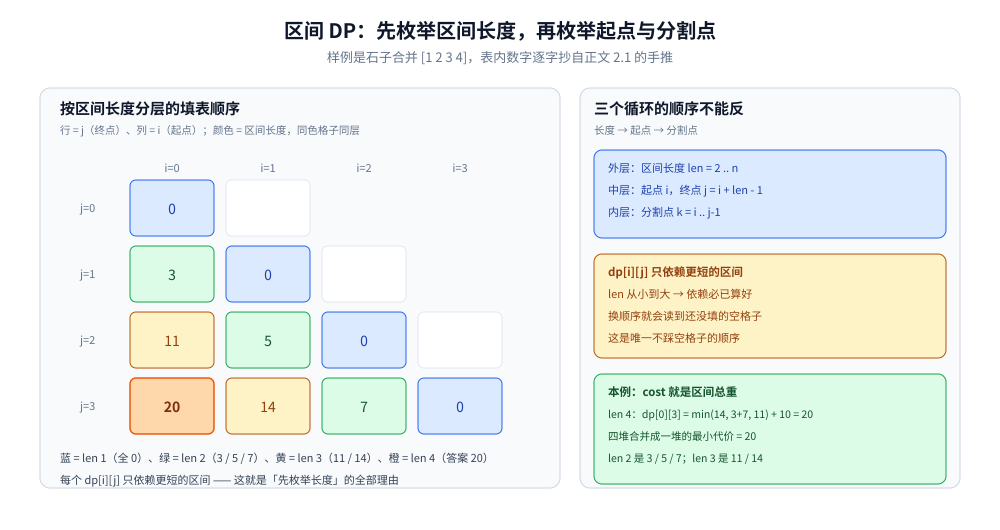
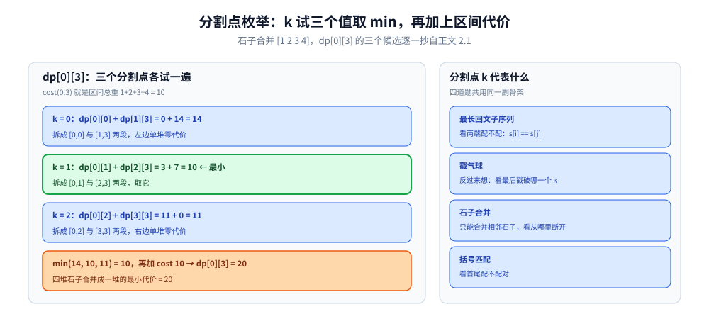

# 区间 DP

> 状态定义在**区间**上的 DP：由小区间合并成大区间，典型题有最长回文子序列、戳气球、石子合并、括号匹配。
>
> ⭐ 边界先说清：本篇讲「区间 DP」的通用模板（填表顺序与转移写法）与四道典型题。
> 前缀维度的 DP 见 [线性DP.md](线性DP.md)（含 [LIS.md](LIS.md)、[背包问题.md](背包问题.md)）；
> 字符串编辑问题见 [编辑距离.md](编辑距离.md)。
>
> 内容整理自个人学习笔记，素材见 [素材清单](../../../素材清单.md)。复杂度口径见 [复杂度分析.md](../基础算法/复杂度分析.md)。

---

## 一、区间 DP 长什么样、什么时候用？

**本节要点**：状态仍是两个下标，但含义从「两个前缀」变成「一个区间 `[i, j]`」，转移靠**枚举区间内的分割点**把两端拼起来。

- 状态：`dp[i][j]` 表示区间 `[i, j]` 上的最优值
- 转移：**枚举区间内的分割点 k**，把 `[i, j]` 拆成 `[i, k]` 和 `[k+1, j]`
- 遍历顺序：**先枚举区间长度**（从小到大），保证小区间先算好
- 复杂度：O(n³) 常见（n² 个状态 × n 个分割点）

⭐ 与线性 DP 的区分判据：**最优解要不要「把左右两半合起来」？** 要 → 区间 DP；只需从左到右逐个追加 → 线性 DP（[线性DP.md](线性DP.md) 第一节）。

---

## 二、模板：三层循环为什么是这个顺序？

**本节要点**：外层长度、中层起点、内层分割点 —— 这是让「依赖必先于被依赖者算出」的唯一顺序，换一个顺序就会读到没填的格子；下面用小输入手推一遍完整填表。

```go
for length := 2; length <= n; length++ { // 区间长度
	for i := 0; i+length-1 < n; i++ { // 区间起点
		j := i + length - 1 // 区间终点
		dp[i][j] = INF
		for k := i; k < j; k++ { // 枚举分割点
			dp[i][j] = min(dp[i][j], dp[i][k]+dp[k+1][j]+cost(i, j))
		}
	}
}
```

⭐ **三个循环的顺序不能反**：长度 → 起点 → 分割点。

⚠️ 与 [编辑距离.md](编辑距离.md) 第二节不同：那里的依赖天然是「更小的前缀」，行列正序扫就行；这里的依赖是「任意更短的区间」，不锁长度就会踩到空格子。

### 2.1 填表顺序手推：石子合并

```text
石子合并（四堆 = [1 2 3 4]，dp[i][j] = 把第 i..j 堆合成一堆的最小代价，
cost(i,j) = 区间总重，len = j − i + 1）：

len=1  dp[0][0]=0  dp[1][1]=0  dp[2][2]=0  dp[3][3]=0   单堆零代价
len=2  dp[0][1]=3  dp[1][2]=5  dp[2][3]=7               两堆只能合一次
len=3  dp[0][2] = min(dp[0][0]+dp[1][2], dp[0][1]+dp[2][2]) + (1+2+3)
               = min(0+5, 3+0) + 6 = 5 + 6 = 11
       dp[1][3] = min(dp[1][1]+dp[2][3], dp[1][2]+dp[3][3]) + (2+3+4)
               = min(0+7, 5+0) + 9 = 5 + 9 = 14
len=4  dp[0][3] = min(dp[0][0]+dp[1][3], dp[0][1]+dp[2][3], dp[0][2]+dp[3][3]) + 10
               = min(14, 3+7, 11) + 10 = 10 + 10 = 20

⭐ 每个 dp[i][j] 只依赖更短的区间 —— 这就是「先枚举长度」的全部理由
```



按长度分层的填表结果：蓝 = len 1（全 0）、绿 = len 2（3 / 5 / 7）、黄 = len 3（11 / 14）、橙 = len 4（答案 20）；右栏点明三层循环顺序不能反 —— 长度 → 起点 → 分割点。

---

## 三、典型题有哪些？

**本节要点**：四道经典题共用同一副骨架，差别只在「分割点 k 代表什么」—— 回文看两端配不配、戳气球看**最后**戳谁、石子合并看从哪断开、括号匹配看首尾配不配对。

### 3.1 最长回文子序列

- `dp[i][j]` = `s[i..j]` 的最长回文子序列长度
- 转移：若 `s[i] == s[j]` → `dp[i][j] = dp[i+1][j-1] + 2`；否则 `max(dp[i+1][j], dp[i][j-1])`

⭐ 这里算的是**子序列**（可不连续）—— 「子序列 ≠ 子串」的判据与两者转移的差别，[LCS.md](LCS.md) 第五节已经钉死，本篇直接借用、不重讲。

### 3.2 戳气球

- 在区间两侧加虚拟气球 `1`，`dp[i][j]` 表示戳破 `(i, j)` 之间所有气球的最大收益
- 转移：枚举**最后戳破**的气球 `k` → `dp[i][k] + dp[k][j] + a[i]*a[k]*a[j]`

⭐ 建模的关键是**反过来想**：「先戳谁」会让左右邻居互相牵连，「最后戳谁」则把区间切成两个互不干扰的子问题 —— 这正是「最优子结构」成立的前提（三性质见 [README.md](README.md) 第一节）。

### 3.3 石子合并

- 只能合并相邻石子堆，求最小代价
- `dp[i][j] = min(dp[i][k] + dp[k+1][j]) + sum(i, j)`
- 2.1 已拿 `[1 2 3 4]` 手推出全表，答案是 20

### 3.4 括号匹配

- `dp[i][j]` = `[i, j]` 的最长有效括号长度



dp[0][3] 的三个分割点各试一遍：k=0 得 14、k=1 得 10（最小）、k=2 得 11，min 之后再加区间代价 10 → dp[0][3] = 20；右栏对照四道题里 k 分别代表什么。

---

## 四、复杂度能优化到什么程度？

**本节要点**：O(n³) 的瓶颈在「枚举分割点」这一层 —— 当最优分割点随区间单调移动时，可以把内层摊平掉一整个维度。

| 方法 | 复杂度 | 适用 |
|---|---|---|
| 朴素区间 DP | O(n³) | 通用 |
| 四边形不等式优化 | O(n²) | 满足决策单调性 |
| Garsia-Wachs | O(n log n) | 石子合并（线性版本） |

---

## 延伸追问

- **区间 DP 为什么先枚举长度？** → 转移依赖比当前区间更短的子区间，长度从小到大保证依赖已算好（2.1 的逐层填表）。
- **为什么复杂度是 O(n³)？** → O(n²) 个区间 × O(n) 个分割点。
- **什么情况用四边形不等式？** → 当最优分割点 `opt[i][j]` 满足单调性（`opt[i][j-1] ≤ opt[i][j] ≤ opt[i+1][j]`）时，每层只需在上一行的决策点之间扫。
- **戳气球为什么在两侧加虚拟气球？** → 把「戳破」转化为「最后戳破」，`k` 被最后戳时 `(i,k)` 与 `(k,j)` 已经互不影响，避免左右邻居互相依赖（3.2）。
- **区间 DP 和线性 DP 到底怎么分？** → 看状态含义：`dp[i]`「前 i 个」是线性；`dp[i][j]`「一段区间、由两半合并」才是区间 —— 判据在第一节。

## 关联

- [线性DP.md](线性DP.md) — 相邻的一类：前缀维度状态；两类的分界判据在第一节
- [LCS.md](LCS.md) — 同为二维状态，但含义是「两个前缀」；其第五节顺带澄清了本篇 3.1 的「子序列 vs 子串」
- [编辑距离.md](编辑距离.md) — 字符串 DP；同样是两个下标，但依赖形状不同（第二节末尾有对照）
- [状态压缩DP.md](状态压缩DP.md) — 另一类：状态塞进一个整数
- [记忆化搜索.md](记忆化搜索.md) — 本篇的「按长度填表」在记忆化写法里由递归自动完成
- [README.md](README.md) — 动态规划导读（DP 成立三性质）
- [DP优化.md](DP优化.md) — 本篇第四节复杂度表的展开：四边形不等式与决策单调性怎么把断点枚举夹住
> 反向引用（本篇被下列文档引到）：[Manacher.md](../字符串匹配/Manacher.md)
