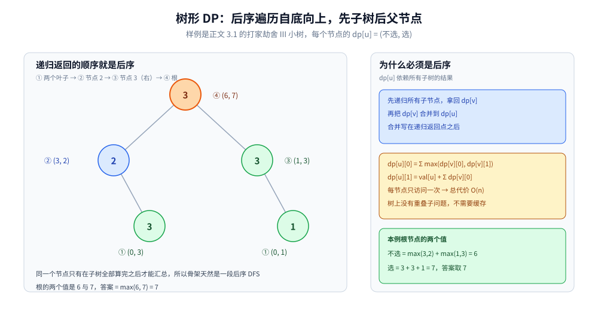
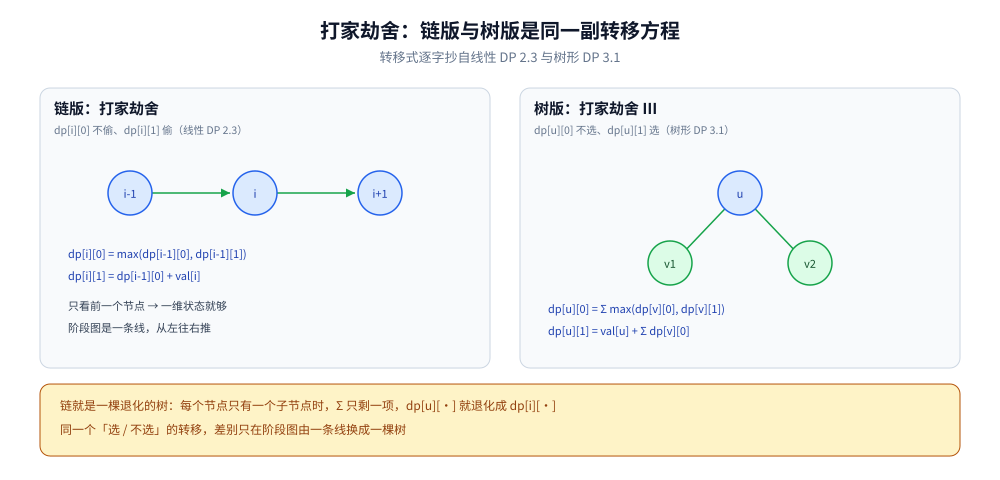

# 树形 DP

> 状态定义在**树节点**上的 DP：自底向上递归，先算子树再把结果汇总到当前节点。典型题有打家劫舍 III、树的直径、最大路径和。
>
> ⭐ 边界先说清：本篇讲树结构上的 DP 模板与典型题。
> 树的遍历基础见 [树的遍历.md](../../数据结构/树/树的遍历.md)；
> 树上的算法题（LCA、验证 BST）见 [树与二叉搜索树算法.md](../基础算法/树与二叉搜索树算法.md)。
>
> 内容整理自个人学习笔记，素材见 [素材清单](../../../素材清单.md)。复杂度口径见 [复杂度分析.md](../基础算法/复杂度分析.md)。

---

## 一、树形 DP 的核心思想

**本节要点**：四步法一样，只是「阶段图」从数组下标换成了树形 —— 依赖沿父子边从叶子往根传，所以骨架天然是后序遍历。

- 状态定义在**节点**上：`dp[u][state]`
- 转移：**先递归处理所有子树**，再合并到当前节点（**后序遍历**）
- 常见状态：选 / 不选、颜色、路径长度、覆盖情况

⭐ **后序遍历是树形 DP 的自然骨架**：子节点算完，父节点才能汇总。

⚠️ 例外是「换根」类问题：父节点的状态要依赖「去掉自己子树后的全树信息」，单趟后序不够 —— 见延伸追问最后一条。

---

## 二、模板：为什么骨架是一段后序 DFS？

**本节要点**：模板就是把「合并 dp[v]」塞进后序 DFS 的递归返回点之前，dp[u] 的初始化放在函数开头。

```go
func dfs(u int) {
	// 初始化 dp[u]
	for _, v := range children(u) {
		dfs(v)
		// 把 dp[v] 合并到 dp[u]
	}
}
```

⭐ `children(u)` 和循环体里的合并逻辑由题目决定，骨架不变。

⚠️ 与 [记忆化搜索.md](记忆化搜索.md) 的分工：树形 DP 的每个子树**天然只被访问一次**（树上没有两条路径汇到同一个节点），没有重叠子问题，所以通常**不需要缓存**；一旦题目背景是「图 / 带重复子问题的递归」，才需要补 memo —— 那条路走的是记忆化搜索。

---

## 三、典型题有哪些？

**本节要点**：四类题共用 `dp[u][有限状态]` 的形状，差别在状态含义 —— 选/不选（独立集）、单值深度（直径 / 路径和）、多色覆盖；第一节先用小树手推一遍自底向上的汇总。

### 3.1 打家劫舍 III

- 每个节点可选 / 不选
- `dp[u][0]` = 不选 u 的最大收益；`dp[u][1]` = 选 u
- 转移：
  - `dp[u][0] = Σ max(dp[v][0], dp[v][1])`
  - `dp[u][1] = val[u] + Σ dp[v][0]`

```text
小例子（问最多能偷多少）：
            3
           / \
          2   3
           \   \
            3   1

后序自底向上算 dp[u] = (不选, 选)：
  叶 3（左下）：(0, 3)          叶 1（右下）：(0, 1)
  节点 2：   不选 = max(0,3) = 3；选 = 2 + 0 = 2   → (3, 2)
  节点 3（右）：不选 = max(0,1) = 1；选 = 3 + 0 = 3  → (1, 3)
  根 3：    不选 = max(3,2) + max(1,3) = 6；选 = 3 + 3 + 1 = 7
答案 = max(6, 7) = 7（偷根和两个叶子）
```



后序自底向上：两个叶子 dp = (0,3)、(0,1)，节点 2 得 (3,2)、节点 3（右）得 (1,3)，根得 (6,7)，答案 = max(6,7) = 7；右栏写出 dp[u][0] / dp[u][1] 的合并式。

⭐ 与 [线性DP.md](线性DP.md) 2.3 的打家劫舍转移**完全同形** —— 链就是一棵退化的树，两篇合起来看就是「同一转移、不同阶段图」。



链版与树版是同一副转移方程：链上 dp[i][0] = max(dp[i-1][0], dp[i-1][1])、dp[i][1] = dp[i-1][0] + val[i]；树上换成 dp[u][·] 对各个子节点求和 —— 链就是一棵退化的树。

### 3.2 树的直径

- 一条路径经过某节点时，长度 = 该节点两个最长子树深度之和 + 1
- 一次 DFS 维护「最深路径」并更新全局答案

⭐ 答案**不在根上、在途中**：与 [LIS.md](LIS.md) 1.2 的「答案是 `max(dp)` 而不是 `dp[n-1]`」是同一个坑 —— 只要最优解可能"停在半路"，就得边走边更新全局值。

### 3.3 二叉树的最大路径和

- 类似直径，但节点值可正可负
- `dp[u]` 表示从 u 向下延伸的最大路径和

### 3.4 树的最小覆盖 / 独立集

- `dp[u][0/1/2]` 表示 u 的不同状态
- 典型：没有上司的舞会、监控二叉树

---

## 四、复杂度

**本节要点**：每节点恰好访问一次，总代价 = 节点数 × 单点合并代价，所以大多是线性的。

| 维度 | 值 |
|---|---|
| 时间 | O(n) 或 O(n × 状态数) |
| 空间 | O(n × 状态数)（递归栈 + DP 数组） |

⭐ **树形 DP 的复杂度通常是线性的**：每个节点只被访问一次。

---

## 延伸追问

- **树形 DP 为什么用后序遍历？** → 父节点的状态依赖子树结果，必须等子树算完（第一节的骨架）。
- **树形 DP 和普通 DP 的区别？** → 依赖结构由树决定，不是数组下标顺序；递归是自然的实现方式。对照：阶段图是线的见 [线性DP.md](线性DP.md)、是区间的见 [区间DP.md](区间DP.md)、是集合的见 [状态压缩DP.md](状态压缩DP.md)。
- **如何避免递归爆栈？** → 用迭代式后序遍历（实现细节见 [树的遍历.md](../../数据结构/树/树的遍历.md)），或加栈深度限制（Go 的 goroutine 栈会动态增长）。
- **树形 DP 的状态怎么设计？** → 从「当前节点的哪些属性会影响父节点」反推。常见：选 / 不选、颜色、是否被覆盖 —— 还是「转移要用到的信息必须进状态」那条原则（[背包问题.md](背包问题.md) 2.1）。
- **换根 DP 是什么？** → 先求以 1 为根的答案，再通过「换根」递推其他节点为根时的答案，避免每个节点重跑一遍 DFS 的 O(n²)。

## 关联

- [树的遍历.md](../../数据结构/树/树的遍历.md) — 后序遍历基础，模板的骨架出处
- [树与二叉搜索树算法.md](../基础算法/树与二叉搜索树算法.md) — LCA、验证 BST 等树上的其他算法题
- [递归与分治.md](../基础算法/递归与分治.md) — 递归骨架的通用来源
- [记忆化搜索.md](记忆化搜索.md) — 第二节末：树上没有重叠子问题，所以不需要缓存；有缓存需求时走那篇
- [线性DP.md](线性DP.md) — 2.3 的打家劫舍是同转移的链式版本
- [README.md](README.md) — 动态规划导读
> 反向引用（本篇被下列文档引到）：[树上问题.md](../图论算法/树上问题.md)、[树链剖分.md](../高级技巧/树链剖分.md)
