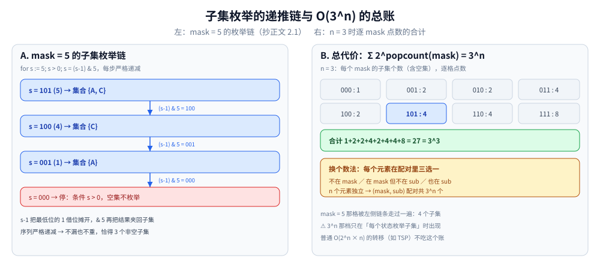
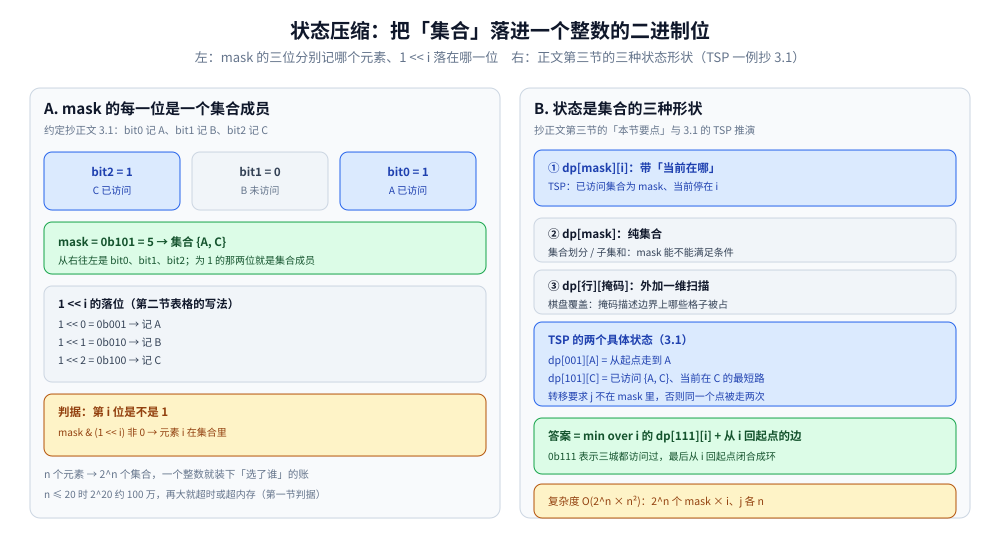

# 状态压缩 DP

> 当状态可以用一个**二进制数**表示时，用位运算压缩状态，把「集合」塞进一个整数里 —— 典型题有旅行商问题、棋盘覆盖、子集枚举。
>
> ⭐ 边界先说清：本篇讲「状态是集合」时的 DP 技巧与子集枚举的复杂度账。
> 基础位运算见 [位运算.md](../基础算法/位运算.md)；
> 普通 DP 见 [线性DP.md](线性DP.md)、[背包问题.md](背包问题.md)、[区间DP.md](区间DP.md)。
>
> 内容整理自个人学习笔记，素材见 [素材清单](../../../素材清单.md)。复杂度口径见 [复杂度分析.md](../基础算法/复杂度分析.md)。

---

## 一、什么时候用状压 DP？

**本节要点**：三个信号 —— 状态是个小集合、要枚举子集或排列、每个元素只有「选了 / 没选」两态；代价是状态数固定按 2^n 长。

- 状态是一个**小集合**（通常 n ≤ 20）
- 需要枚举**子集**或**排列**
- 元素「选了 / 没选」可以用一个二进制位表示

⭐ **判据**：**n ≤ 20 且状态是「选了哪些」 → 状压 DP。**

⚠️ 反过来的代价也要看清：2^n 个状态是**写死**的，能优化的只有转移那一层（第四节）；n 一大就得换「把限制放进维度」的写法 —— [背包问题.md](背包问题.md) 用 `O(nW)` 回避「选了哪些物品」这一维，就是同一个问题的两种记账方式。

---

## 二、要熟的位运算操作

**本节要点**：状压模板里反复出现的六个表达式，其中「枚举 x 的所有子集」那条惯用法最关键，下面单独手推一遍。

| 操作 | 表达式 |
|---|---|
| 判断第 i 位是否为 1 | `x & (1 << i)` |
| 把第 i 位置 1 | `x \| (1 << i)` |
| 把第 i 位置 0 | `x &^ (1 << i)` |
| 取最低位的 1 | `x & -x` |
| 枚举 x 的所有子集 | `for s := x; s > 0; s = (s-1) & x` |
| 判断 x 是否为 y 的子集 | `x & y == x` |

### 2.1 子集枚举惯用法手推

```text
枚举 mask = 5（二进制 101，集合 {A, C}）的全部非空子集：
  s = 101 (5) → (s−1)&5 = 100 (4) → (4−1)&5 = 001 (1) → (1−1)&5 = 000，停
  依次得到 {A,C}、{C}、{A} —— 恰好是 5 的全部非空子集
```

⭐ 每步 `s−1` 把最低位的 1 借位摊开，`& x` 再把结果夹回 x 的子集里，序列严格递减，所以**不漏也不重**。



左图是 2.1 的递推链：s 从 101 (5) 依次走到 100 (4)、001 (1)，最后撞上空集停止（条件 `s > 0`），恰得 3 个非空子集——`s-1` 借位摊开最低位的 1、`& 5` 夹回子集，严格递减所以不漏不重。右图把 n = 3 的每个 mask 的子集个数逐个点数，合计 1+2+2+4+2+4+4+8 = 27 = 3^3，这就是第四节 O(3^n) 那档复杂度的来源；普通 O(2^n × n) 的转移（如 TSP）不吃这个账。图中数字是正文公式的推演示意，非实测。



左半张把 mask = 0b101 = 5 拆成三个位：bit0 记 A、bit1 记 B、bit2 记 C，为 1 的那两位就是集合成员；`1 << i` 的落位与判据「`mask & (1 << i)` 非 0 → 元素 i 在集合里」都取自第二节的表。右半张预告第三节的三种状态形状——`dp[mask][i]`（带「当前在哪」）、`dp[mask]`（纯集合）、`dp[行][掩码]`（外加一维扫描），并以 3.1 的 TSP 为例标出：转移要求 j 不在 mask 里，答案是 min over i 的 `dp[111][i]` + 回起点边，复杂度 O(2^n × n²)。

---

## 三、典型题有哪些？

**本节要点**：三种状态形状 —— 带「当前位置」的 `dp[mask][i]`（TSP）、纯集合的 `dp[mask]`（划分 / 子集和）、外加一维扫描的 `dp[行][掩码]`（棋盘类）。

### 3.1 旅行商问题（TSP）

- `dp[mask][i]` = 已访问集合为 mask、当前在 i 的最短路径
- 转移：`dp[mask | (1<<j)][j] = min(dp[mask][i] + dist[i][j])`
- 复杂度 O(2^n × n²)

```text
3 城 A/B/C，mask 的 bit0/1/2 分别表示「访问过 A/B/C」：
  dp[001][A] = 从起点走到 A
  dp[101][C] = 已访问 {A,C}、当前在 C 的最短路
  答案 = min over i 的 dp[111][i] + 从 i 回起点的边
```

⚠️ 状态里**必须带上「当前在哪个点」**：只有 mask 不知道尾巴在哪，转移就写不出来 —— 与「限制必须进状态」（[背包问题.md](背包问题.md) 2.1）是同一条原则。

### 3.2 棋盘覆盖 / 铺砖

- 用 0/1 表示某一列哪些格子被占据
- 逐列或逐行转移

⭐ 这类「用一维掩码描述边界形状」的写法通常也叫**轮廓线 DP**，本质还是状压，只是多了一条「逐行推进」的外层维度。

### 3.3 集合划分 / 子集和

- `dp[mask]` = 集合 mask 能否满足某条件
- 枚举子集：`for sub := mask; sub > 0; sub = (sub-1) & mask`

### 3.4 计数类

- 位 DP：统计满足某种数位约束的数的个数

⚠️ 「数位约束的计数」自成一类 —— **数位 DP**（[数位DP.md](数位DP.md)）：那里的整数位不是「集合的成员」，状态是「第几位 + 是否贴上界」，与本篇的集合语义两回事，本篇不展开。

---

## 四、复杂度与子集枚举的账

**本节要点**：状态数 O(2^n) 只是下限，真正的档位由转移决定 —— 每个状态枚举子集时总账是 O(3^n)。

| 维度 | 值 |
|---|---|
| 状态数 | O(2^n) |
| 转移 | O(n) 或 O(2^n) |
| 总时间 | O(2^n × n) 或 O(3^n) |

⭐ **子集枚举的总代价**：`Σ 2^popcount(mask) = 3^n`，所以「枚举所有子集」的 DP 复杂度是 O(3^n)。

换一种数法可以直接看出 3^n 从哪来：每个元素在 (mask, sub) 配对里只有三种处境 —— 不在 mask、在 mask 但不在 sub、同时在 mask 与 sub；n 个元素独立选择，配对总数就是 3^n，与按 mask 逐个累加 2^popcount 是同一件事（图示见 2.1 末尾的图）。

---

## 延伸追问

- **状压 DP 的 n 最大多少？** → 一般 n ≤ 20；2^20 ≈ 100 万，再大会超时或超内存。
- **`for s := x; s > 0; s = (s-1) & x` 为什么能枚举所有子集？** → `(s-1) & x` 会跳到「下一个子集」，序列严格递减，直到 s = 0 结束（2.1 手推了一遍）。
- **TSP 的复杂度是多少？** → O(2^n × n²)，比暴力的 O(n!) 快得多。
- **状压 DP 和位运算什么关系？** → 位运算提供了「集合操作」的 O(1) 实现，见 [位运算.md](../基础算法/位运算.md)。
- **什么情况不能用状压？** → n > 25 时状态空间爆炸；元素状态非二值（如 0/1/2）时可用三进制状压，但 3^n 涨得更快、实现也复杂。
- **2.1 的循环为什么停在空集外面？** → 循环条件写成 `s > 0`，空集天然被跳过；转移确要用到空子集时，在循环结束后单独处理一次 sub = 0。

## 关联

- [位运算.md](../基础算法/位运算.md) — 第二节六个表达式的出处
- [背包问题.md](背包问题.md) — 「选了哪些」的另一种记账：容量维度 + 遍历顺序，避免 2^n
- [区间DP.md](区间DP.md) — 同样是「两个维度」的状态，但那边是区间、这边是集合
- [数位DP.md](数位DP.md) — 3.4 那句「计数类」实际归它管
- [线性DP.md](线性DP.md) — 本篇所属的 DP 大类
- [回溯模板与剪枝.md](../回溯/回溯模板与剪枝.md) — 第四节 O(3^n) 枚举的正是它的决策树：回溯靠剪枝少走节点，状压换一种记账把「选了哪些」压进整数
- [README.md](README.md) — 动态规划导读
> 反向引用（本篇被下列文档引到）：[博弈论.md](../数学基础/博弈论.md)、[矩阵快速幂.md](../高级技巧/矩阵快速幂.md)
