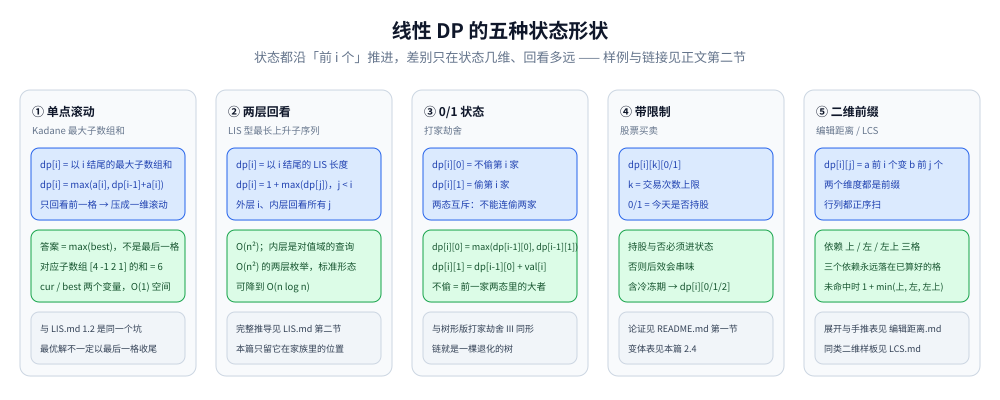
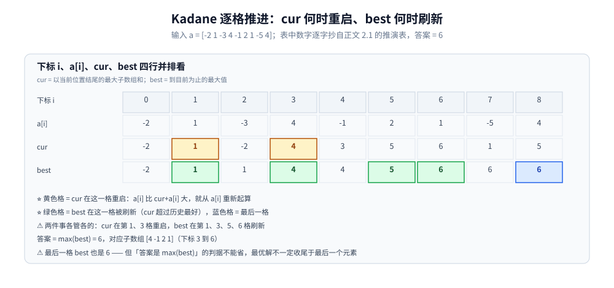

# 线性 DP

> 状态沿一个维度线性推进的 DP：最长上升子序列、最大子数组和、股票买卖、打家劫舍、编辑距离 —— 是 DP 中最基础、也最常见的一类。
>
> ⭐ 边界先说清：本篇讲「状态是一维/二维数组」的 DP 模板、常见优化与题型速查，做一张**路标表**。
> 已各自成篇的问题不重讲：[LIS.md](LIS.md)、[LCS.md](LCS.md)、[背包问题.md](背包问题.md)、[编辑距离.md](编辑距离.md)；
> 区间 DP 见 [区间DP.md](区间DP.md)；树形 DP 见 [树形DP.md](树形DP.md)。
>
> 内容整理自个人学习笔记，素材见 [素材清单](../../../素材清单.md)。复杂度口径见 [复杂度分析.md](../基础算法/复杂度分析.md)。

---

## 一、线性 DP 的核心特征

**本节要点**：状态以「前 i 个」为索引、转移只回头看不前瞻 —— 遍历顺序天然唯一，「方向坑」只在压成一维滚动时才出现。

- 状态：`dp[i]` 或 `dp[i][j]`，i 通常是「前 i 个元素」
- 转移：`dp[i]` 由 `dp[i-1]`、`dp[i-2]` 或 `dp[j]（j < i）` 推出
- 遍历顺序：从左到右，或两层循环枚举 j
- 复杂度：O(n) 或 O(n²)

⭐ 与 [区间DP.md](区间DP.md) 第一节那条判据在这里的反面形态：**只需要"往更小的前缀看"，就是线性**；要"把左右两半合并"，才升级为区间。

⚠️ 二维状态（`dp[i][j]`，如 LCS、编辑距离）也属于线性 DP：两个维度都是前缀、行列正序扫 —— 那两篇各讲各的，本篇不重复。

---

## 二、典型模板

**本节要点**：五种形状各挑一道代表题 —— 单点滚动（Kadane）、两层回看（LIS 型）、0/1 状态（偷与不偷）、带限制的状态（股票）、二维前缀（编辑距离）；已成篇的只留判据和链接。



五种状态形状：① 单点滚动（Kadane，只回看前一格，可压成一维滚动）② 两层回看（LIS 型，内层回看所有 j）③ 0/1 状态（打家劫舍，偷与不偷互斥）④ 带限制（股票，持股与否进状态）⑤ 二维前缀（编辑距离 / LCS，依赖上 / 左 / 左上）。

### 2.1 最大子数组和（Kadane）

```go
func maxSubArray(a []int) int {
	best, cur := a[0], a[0]
	for i := 1; i < len(a); i++ {
		cur = max(a[i], cur+a[i])
		best = max(best, cur)
	}
	return best
}
```

- `dp[i]` = 「以 i 结尾的最大子数组和」
- 状态转移：`dp[i] = max(a[i], dp[i-1] + a[i])`

```text
a = [-2 1 -3 4 -1 2 1 -5 4]（cur = 以当前位置结尾的最大子数组和）：
 i      0    1    2    3    4    5    6    7    8
 a[i]  -2    1   -3    4   -1    2    1   -5    4
 cur   -2    1   -2    4    3    5    6    1    5
 best  -2    1    1    4    4    5    6    6    6
答案 = best 的最大值 = 6（对应子数组 [4 -1 2 1]）
```

⭐ 与 [LIS.md](LIS.md) 1.2 同一个坑：**答案是 `max(best)` 而不是最后一格** —— 最优解不一定"以最后一个元素收尾"。



Kadane 的逐格轨迹：cur 在第 1、3 格重启（黄格），best 在第 1、3、5、6 格刷新（绿格），最后一格 best 也是 6，但答案仍取 max(best) = 6（对应子数组 [4 -1 2 1]）。

### 2.2 最长上升子序列（LIS）

⚠️ 本题已完整成篇：`O(n²)` 的状态定义与逐项推演、`O(n log n)` 的 tails + 二分、以及「tails 拼不回具体序列」的坑全在 [LIS.md](LIS.md)，本篇不重讲。只放它在「线性 DP」家族里的位置：

- `dp[i]` = 「以 i 结尾的 LIS 长度」是线性 DP **两层枚举**（外层 i、内层回看所有 `j < i`）的标准形态；
- 判据：当你发现内层"回看取最大"本质是**对值域的一次有序查询**时，就知道还有降到 `O(n log n)` 的空间 —— 详见 [LIS.md](LIS.md) 第二节。

### 2.3 打家劫舍

- `dp[i][0]` = 不偷第 i 家；`dp[i][1]` = 偷第 i 家
- 转移：`dp[i][0] = max(dp[i-1][0], dp[i-1][1])`；`dp[i][1] = dp[i-1][0] + val[i]`

⭐ 与 [树形DP.md](树形DP.md) 3.1 的打家劫舍 III 转移**完全同形** —— 链就是退化的树。

### 2.4 股票买卖

| 变体 | 状态 |
|---|---|
| 只能买卖一次 | `minPrice` + `maxProfit` |
| 可以买卖多次 | 贪心（累加所有上涨） |
| 最多 k 次 | `dp[i][k][0/1]` |
| 含冷冻期 | `dp[i][0/1/2]` |

⚠️ 为什么状态里必须带「持股与否」——「后效塞进状态」的最典型例题，论证写在 [README.md](README.md) 第一节，本篇不重复。

### 2.5 编辑距离

- 二维 DP，状态、转移与逐格手推全在 [编辑距离.md](编辑距离.md)，本篇不重复

---

## 三、常见优化

**本节要点**：四类优化一句话判据 —— 本质都是「用数据结构或单调性质，吃掉转移里的重复计算」。

| 技巧 | 适用 | 效果 |
|---|---|---|
| **滚动数组** | 只依赖前一行 | 空间 O(n) → O(1) |
| **单调队列** | 滑动窗口最大值类 | 时间 O(n²) → O(n) |
| **斜率优化** | 转移形如 `dp[i] = min(dp[j] + f(i,j))` | 时间 O(n²) → O(n) |
| **前缀和/前缀最值** | 转移含区间求和/最值 | 时间 O(n²) → O(n) |

⚠️ 滚动数组的**方向判据**（什么时候正序、什么时候逆序）不在本篇：一维滚动的两个方向案例（背包逆序、LCS 正序）与统一判据见 [背包问题.md](背包问题.md) 第三节和 [LCS.md](LCS.md) 3.4。

⭐ 单调队列的成立前提：窗口左右端点**单调移动** —— 与 [滑动窗口.md](../基础算法/滑动窗口.md) 的单调性判据是同一条。

---

## 四、典型题型速查

**本节要点**：先看状态形状、再找零件篇 —— 已各自成篇的题在本篇只当路标，不重讲推导。

| 题 | 状态 |
|---|---|
| 最大子数组和 | `dp[i]` = 以 i 结尾的最大和 |
| 最长上升子序列 | `dp[i]` = 以 i 结尾的 LIS 长度 |
| 打家劫舍 | `dp[i][0/1]` |
| 股票买卖 | `dp[i][k][0/1]` |
| 单词拆分 | `dp[i]` = 前 i 个字符能否拆分 |
| 零钱兑换 | `dp[i]` = 凑成 i 的最少硬币数 |
| 完全平方数 | 类似零钱兑换 |

⚠️ **零钱兑换 / 完全平方数本质是完全背包**（硬币供应无限、求最少件数）—— 建模与"一维正序"的来龙去脉见 [背包问题.md](背包问题.md) 第四节，本篇不重复。

---

## 延伸追问

- **线性 DP 和区间 DP 什么区别？** → 线性 DP 的状态是一维/二维数组、只回看更小前缀；区间 DP 的状态是区间 `[i, j]`、依赖"两半合并"—— 判据在第一节点名、区间侧见 [区间DP.md](区间DP.md) 第一节。
- **什么时候用滚动数组？** → 状态只依赖前一行或前几行时。⚠️ 压成一维后方向不能乱写，判据见第三节末尾的链接。
- **单调队列优化什么时候用？** → 转移是「窗口内的最值」，且窗口左右端点单调移动。
- **斜率优化什么时候用？** → 转移形如 `dp[i] = min(dp[j] + a[i]*b[j])`，可以转化为凸包问题。
- **线性 DP 能处理计数问题吗？** → 能，如「爬楼梯方案数」「不同路径数」—— 计数类的递推写法与记忆化视角见 [记忆化搜索.md](记忆化搜索.md) 第四节。

## 关联

- [LIS.md](LIS.md) — 2.2 的完整展开：两种解法、tails 的坑、还原方案
- [LCS.md](LCS.md) — 二维线性的样板：填表 + 回溯 + 滚动行方向
- [背包问题.md](背包问题.md) — 「阶段 × 限制」的原型篇；第四节管住本篇的零钱兑换
- [编辑距离.md](编辑距离.md) — 二维线性的代表题
- [区间DP.md](区间DP.md) — 相邻一类的分界判据
- [树形DP.md](树形DP.md) — 阶段图从链换成树（3.1 与 2.3 同形）
- [记忆化搜索.md](记忆化搜索.md) — 本篇递推式的自顶向下等价形态
- [滑动窗口.md](../基础算法/滑动窗口.md) — 单调队列优化的前提（端点单调）出处
- [README.md](README.md) — 动态规划导读
- [DP优化.md](DP优化.md) — **本篇「常见优化」那张表的完整展开**：单调队列 / 斜率优化 / 决策单调性 / 数据结构优化
> 反向引用（本篇被下列文档引到）：[数位DP.md](数位DP.md)、[状态压缩DP.md](状态压缩DP.md)、[概率与期望.md](../数学基础/概率与期望.md)、[矩阵快速幂.md](../高级技巧/矩阵快速幂.md)
