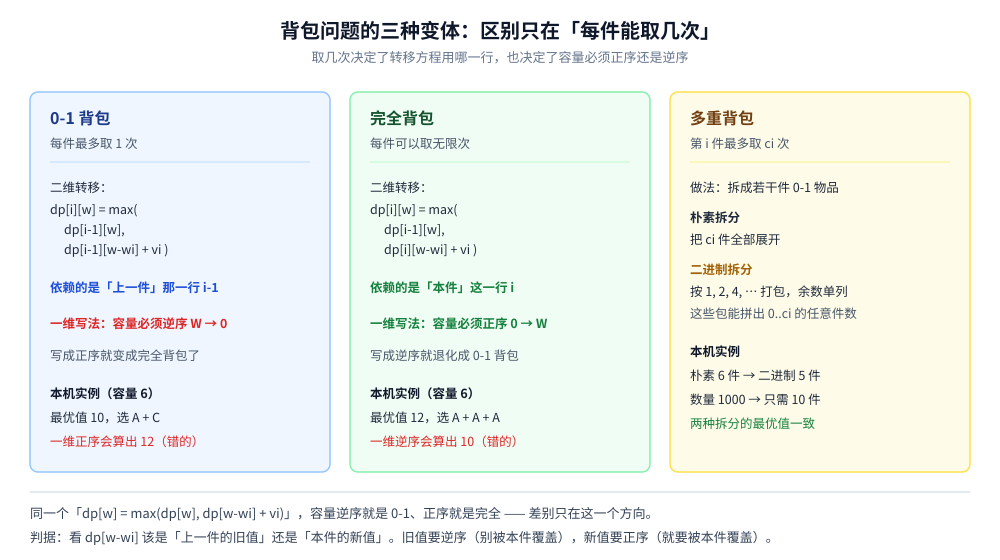
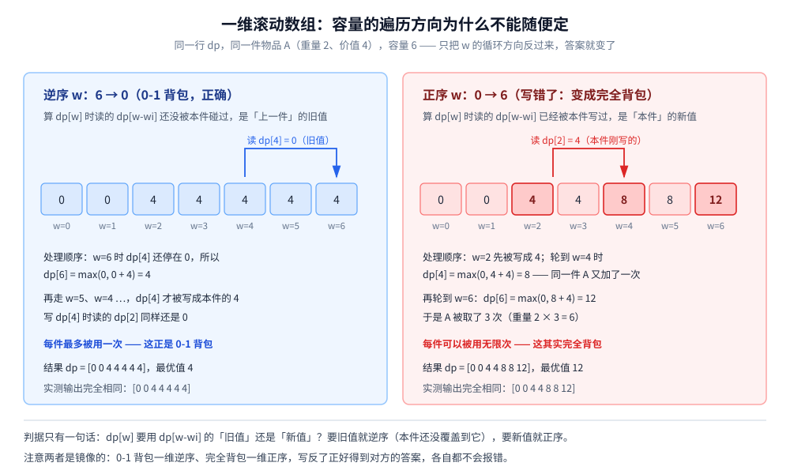

# 背包问题

> 动态规划最经典的一族问题：**0-1 背包**（每件最多取一次）、**完全背包**（每件取无限次）、**多重背包**（每件有次数上限）。
> 三种问法的状态定义几乎一模一样，差别只在**转移里用哪一行**；而由此推出的
> 「**0-1 背包一维要逆序、完全背包一维要正序**」，是「DP 的遍历顺序不是随便定的」最干净的一个例证 ——
> 写反了不会报错、不会越界，只会静默算出另一个问题的答案。
>
> ⭐ 本篇是 `算法/动态规划/` 这个二级目录的**开篇**，讲背包这一族问题的**建模与实现**。
> 它与 [../贪心/霍夫曼编码.md](../贪心/霍夫曼编码.md) 恰好是一对参照：那篇回答「贪心为什么对」，
> 本篇第一节回答「贪心为什么不对」，两条路的**分界线就是「物品能不能切开」**。
> 同为二维 DP 的 [LCS.md](LCS.md) 与本篇共用同一套「状态 → 转移 → 边界 → 遍历顺序」的四步法；
> 把「阶段必须在外层」讲得最透的是 [../图论算法/最短路/Floyd.md](../图论算法/最短路/Floyd.md)。
>
> 内容整理自个人学习笔记，素材见 [素材清单](../../../素材清单.md)。复杂度口径见 [复杂度分析.md](../基础算法/复杂度分析.md)；
> 「数组 + 下标」这一层基础见 [数据结构.md](../基础算法/数据结构.md)。
>
> 📎 本篇所有输出均为本机实跑逐字抄录：**Go 1.26.5（windows/amd64）** 与 **JDK 1.8.0_321** 各实现一份，
> 输出**逐行对齐**（82 行 diff 为空 —— 背包篇全是确定性数据，整篇没有一处耗时统计）。
> 实验代码在 `.workbuddy/tmp/dp_lab/knapsack/` 与 `.workbuddy/tmp/dp_lab/java/KnapsackLab.java`。

---

## 一、为什么 0-1 背包不能贪心？

**本节要点**：分数背包（物品可以切开）用「性价比排序 + 尽量多装」就是最优；0-1 背包（只能整件拿）用**同一套规则**会少赚。这一节用本机实测把这个分界钉死，并说明贪心到底输在哪。

### 1.1 问题长什么样

有 `n` 件物品和一个容量为 `W` 的背包，第 `i` 件物品的重量是 `wt[i]`、价值是 `val[i]`，目标是**在不超重的前提下让总价值最大**。三种问法的区别只在「每件能取几次」：

| 问法 | 每件能取几次 | 典型来源 |
|---|---|---|
| **0-1 背包** | 最多 1 次 | 一份预算买不重复的设备 |
| **完全背包** | 无限次 | 供应不限量的原料 |
| **多重背包** | 给一个上限 `c[i]` | 每人限购 `c[i]` 件 |

本篇统一用同一组样例贯穿：三件物品 `A(重量 2, 价值 4)`、`B(3, 5)`、`C(4, 6)`，容量 `W = 6`。



### 1.2 能切开的时候，贪心就是最优

如果物品**可以切开**（这就是「分数背包」），策略是按**价值/重量**从高到低尽量装。理由很直接：既然能任意切，最后剩下的零头容量总能被一件物品补满，那么从性价比最高的开始填，不可能填亏。

按性价比排序后：

| 顺序 | 物品 | 重量 | 价值 | 价值/重量 |
|---|---|---|---|---|
| 1 | A | 2 | 4 | 2.000 |
| 2 | B | 3 | 5 | 1.667 |
| 3 | C | 4 | 6 | 1.500 |

### 1.3 同样的贪心搬到 0-1 背包就亏了（本机实测）

0-1 背包不允许切开。同一套「按性价比从高到低、放不下就跳过」走一遍：A 放得下（用 2），B 放得下（连 A 共 5），C 需要 4 而只剩 1 —— 跳过。结果 `4 + 5 = 9`。

而真正的最优解是 **A + C**：重量 `2 + 4 = 6` 正好装满，价值 `4 + 6 = 10`。

```text
=========== 实验一：为什么 0-1 背包不能贪心（分数背包才能）===========
  物品（重量, 价值）：A(2,4)  B(3,5)  C(4,6)   容量 W = 6
  按性价比（价值/重量）降序： A(2.000) B(1.667) C(1.500)
  分数背包（贪心，可切开）：取 A 全部、取 B 全部、取 C 的 1/4
      总价值 = 10.5
  同一套贪心用在 0-1 背包（放不下就跳过）：取 A、B，C 放不下
      总价值 = 9
  0-1 背包的最优解（DP）= 10，组合 = A + C
  ⭐ 贪心 9 < 最优 10 —— 分数背包的贪心不能直接搬给 0-1 背包
```

⭐ 两个读数：

- **10.5 与 9 都不是 10**：分数背包装 A 全部 + B 全部，用掉 5、还剩 1，就切 1/4 个 C（`4 × 1/4 = 1`）补上，一点容量都不浪费；0-1 背包装不下 C 就只能空着那 1；
- **最优解恰恰跳过了性价比排第二的 B**：拿 A + C 才装满。**「性价比高的先拿」在离散选择里不成立。**

⚠️ 贪心输在 **9 < 10**：它把 B 拿进来之后，剩下 1 的容量谁也装不下，白白空着；放弃 B 换 C，反而能用满。

### 1.4 贪心为什么在这里失效

贪心的隐含假设是「**按性价比排序后，先做的选择不会被后来的选择推翻**」。分数背包满足这个假设 —— 能切开，任何剩余容量都能用当前这件补上；0-1 背包不满足：

- 一件物品要么全拿、要么不拿，**没有中间态**；
- 于是「先拿性价比高的」可能**塞住**后面对容量要求更整齐的组合。

⭐ 一句话：**分数背包的可行域是连续的，贪心沿着一个方向走就能到顶；0-1 背包的可行域是离散的点集，局部最优不等于全局最优。**

⚠️ 这也正好解释了为什么必须上 DP：DP 的价值在于**把「拿 / 不拿」的所有组合压进一张表**，而不是沿着一个方向试探。下面几节就是这张表怎么建。

---

## 二、0-1 背包的 DP 是怎么定出来的？

**本节要点**：把「状态 → 转移 → 边界 → 遍历顺序」四步走一遍。**状态定对了，转移几乎是自然写出来的**；状态定错了，后面怎么调都别扭。

### 2.1 第一步：状态定义

**`dp[i][w]` = 只考虑前 `i` 件物品、容量为 `w` 时能拿到的最大价值。**

⚠️ 状态里的两个维度都必须是「**阶段**」或「**限制**」，不能是答案本身：

- `i` 是**阶段**：一件一件地放，放到第 `i` 件为止；
- `w` 是**限制**：可用容量只有 `w`。

⭐ 为什么不能定义成「前 `i` 件里最多能拿多少价值」？因为那样**没有「已经用了多少容量」这个信息**，下一件放不放得下就判断不了。**限制条件必须进状态** —— 这是定 DP 状态时最容易忘的一条。

### 2.2 第二步：转移方程

第 `i` 件物品只有两种命运：

| 选择 | 条件 | 这一支的取值 |
|---|---|---|
| **不拿** | 永远可行 | `dp[i-1][w]` |
| **拿** | `w >= wt[i]` | `dp[i-1][w - wt[i]] + val[i]` |

```text
dp[i][w] = max( dp[i-1][w],  dp[i-1][w - wt[i]] + val[i] )
```

⚠️ **「拿」这一支用的是 `i-1` 而不是 `i`** —— 因为 0-1 背包里第 `i` 件**只能拿一次**，拿完之后剩下的选择就只能是「前 `i-1` 件」了。这一个下标就是它与完全背包的全部分歧（第四节）。

### 2.3 第三步：边界

`dp[0][*] = 0`：一件物品都不考虑时，任何容量下的价值都是 0。

⭐ 这张表开的是 `(n+1) × (W+1)` 而不是 `n × W`，就是为了让 `dp[0][*]` 与 `dp[*][0]` 这两条边**落在数组里**，省掉每一处的下标特判。

### 2.4 第四步：逐行填表（本机实测）

```text
=========== 实验二：0-1 背包的二维 DP（逐行填表）===========
  状态：dp[i][w] = 只考虑前 i 件物品、容量为 w 时的最大价值
  转移：dp[i][w] = max(dp[i-1][w], dp[i-1][w-wt[i]] + val[i])   （w >= wt[i]）
  边界：dp[0][*] = 0
        w:    0    1    2    3    4    5    6
  i=0           0    0    0    0    0    0    0
  i=1 A(2,4)    0    0    4    4    4    4    4
  i=2 B(3,5)    0    0    4    5    5    9    9
  i=3 C(4,6)    0    0    4    5    6    9   10
  最优值 = 10
```

⭐ 三个读数：

- **右下角 `dp[3][6] = 10` 就是答案**；
- **每一行都在上一行的基础上算**（`i=2` 那行只读 `i=1` 那行）—— 这就是「阶段」在表上的样子；
- **同一列从上往下看，数字只增不减**：多一件可选物品，不可能让最优值变差。这是「单调性」，也是很多剪枝的依据。

### 2.5 回溯：从表里问出「到底拿了哪几件」

只要留下了整张表，就能倒着走回来：**若 `dp[i][w] != dp[i-1][w]`，说明第 `i` 件被拿了**（否则最优值不会变）。

```text
  回溯（dp[i][w] != dp[i-1][w] 即选中第 i 件）：
        i=3 w=6：dp=10 != dp[i-1][w]=9 → 选 C，跳到 i=2 w=2
        i=2 w=2：dp=4 == dp[i-1][w]=4 → 不选 B，跳到 i=1 w=2
        i=1 w=2：dp=4 != dp[i-1][w]=0 → 选 A，跳到 i=0 w=0
  选中的物品 = A + C，总重 6，总价值 10
```

⚠️ 注意 `i=2 w=2` 那一步是 `dp[2][2] == dp[1][2]`：价值没变，说明 B 没被选。**「不变」也是一种明确的信息**，不必额外存一个 `choice` 数组 —— 表本身已经把决策记下来了。

### 2.6 复杂度

| 维度 | 代价 |
|---|---|
| 时间 | `O(n · W)`：两层循环，每格一次 `max` |
| 空间 | `O(n · W)`：整张表 |

⚠️ `W` 是**容量数值**，不是物品件数 —— 所以背包是**伪多项式**算法：容量开到 10^9 就崩了。这一点在「延伸追问」里展开。

---

## 三、一维滚动数组：为什么 0-1 必须逆序？

**本节要点**：二维表里第 `i` 行只依赖第 `i-1` 行，所以可以压成一行。但压完之后「上一行的旧值」和「本行的新值」挤在同一个数组里，**遍历方向就成了正确性的一部分**。这一节把正序、逆序两种写法都真跑一遍。

### 3.1 观察：每一行只用到上一行

从 2.2 的转移看，算 `dp[i][*]` 只读 `dp[i-1][*]`。于是**不需要保存所有行，只要保存「上一行」** —— 这就是滚动数组。

把 `dp[i][w]` 压成 `dp[w]` 后，转移写成：

```text
dp[w] = max( dp[w],  dp[w - wt[i]] + val[i] )
```

⚠️ 这里 `dp[w]` 是「**上一行**的 `w`」，而 `dp[w-wt[i]]` **理想上也应该是「上一行的 `w-wt[i]`」**。问题就在这 —— 数组只有一份，`dp[w-wt[i]]` 到底是上一行的旧值，还是本行刚写进去的新值？**这完全由遍历方向决定。**

### 3.2 本机实测：同一份代码只改循环方向

```text
=========== 实验三：0-1 背包的一维滚动数组 —— 为什么必须「逆序」遍历容量 ==========
  一维写法：dp[w] = max(dp[w], dp[w-wt[i]] + val[i])
  ✅ 正确写法：容量 w 逆序遍历（W → 0）
     i=1 A(2,4)：dp = [0 0 4 4 4 4 4]
     i=2 B(3,5)：dp = [0 0 4 5 5 9 9]
     i=3 C(4,6)：dp = [0 0 4 5 6 9 10]
     结果 = 10（与二维一致 = true）
  ❌ 错误写法：容量 w 正序遍历（0 → W）—— 只改了循环方向，别的都没动
     i=1 A(2,4)：dp = [0 0 4 4 8 8 12]
     i=2 B(3,5)：dp = [0 0 4 5 8 9 12]
     i=3 C(4,6)：dp = [0 0 4 5 8 9 12]
     结果 = 12（与二维一致 = false）
  ⚠️ 正序时 dp[w-wt[i]] 可能已经用过第 i 件 → 同一件物品被重复取
     → 「0-1 背包写成一维正序」，算出来的其实是完全背包的答案（实验四）
```

### 3.3 为什么逆序是对的

逆序遍历（`w` 从 `W` 递减到 `wt[i]`）时，**下标更小的 `w-wt[i]` 还没轮到被写**，所以 `dp[w-wt[i]]` 读到的必定是上一行的旧值 —— 正是 2.2 转移方程要的那个值 ✓

### 3.4 为什么正序会算错

正序（`w` 从 `wt[i]` 递增到 `W`）时，`dp[w-wt[i]]` 因为下标更小、**已经在本行被写过了**，读到的是新值；而那个新值里已经含着第 `i` 件物品，再叠加一次 `val[i]`，就等于**同一件被拿了两次**。

⭐ 实测里 `i=1 A(2,4)` 那一行最能说明问题：正序把 `dp[4]` 写成 `8`（A 拿了两次）、`dp[6]` 写成 `12`（A 拿了三次），而逆序老老实实全是 `4`。

⚠️⚠️ **最危险的地方在于它不报错**：正序版语法完全正确、数组不越界、结果 12 还是个「像样」的数 —— 只是它回答的**不是 0-1 背包**。



### 3.5 「遍历顺序不是随便定的」是一句通用的话

背包只是最典型的例子，判据可以统一写成一句话：

⭐ **看转移方程里那个可能被本行污染的下标 —— 它必须是旧值就逆序，必须是新值就正序。**

同一个道理在别处也出现过：

- [../图论算法/最短路/Floyd.md](../图论算法/最短路/Floyd.md)：`k` 是**阶段**，必须放在最外层；放到内层就会读到本阶段的中间结果（那篇有实测）；
- [LCS.md](LCS.md) 第三节：单行滚动时 `j` 必须**正序**（因为 `dp[i][j]` 要用同一行左边的 `dp[i][j-1]`）—— 与背包刚好相反。

---

## 四、完全背包：把方向反过来就对了

**本节要点**：完全背包的转移只改一个下标（`i-1` → `i`），但一维实现上它要的遍历方向**与 0-1 正好相反**。两种写法的错误结果，恰好互为对方的正确答案。

### 4.1 状态与转移只差一个下标

**`dp[i][w]` = 前 `i` 种物品、容量 `w` 时的最大价值（每种可取无限次）。**

```text
dp[i][w] = max( dp[i-1][w],  dp[i][w - wt[i]] + val[i] )
```

⭐ 差别就在「拿」那一支的下标：

- **0-1 背包**写 `dp[i-1][w-wt[i]]` —— 第 `i` 件用一次就没了，之后只能看前 `i-1` 件；
- **完全背包**写 `dp[i][w-wt[i]]` —— 第 `i` 件还能接着用，这就是「无限次」。

### 4.2 本机实测

```text
=========== 实验四：完全背包 —— 与 0-1 背包刚好相反，必须「正序」 ==========
  状态：dp[w] = 容量 w 时的最大价值，每件物品可以取无限次
  ✅ 正确写法：容量 w 正序遍历（0 → W）
     i=1 A(2,4)：dp = [0 0 4 4 8 8 12]
     i=2 B(3,5)：dp = [0 0 4 5 8 9 12]
     i=3 C(4,6)：dp = [0 0 4 5 8 9 12]
     结果 = 12，组合 = A + A + A
     （完全背包二维表独立算一遍 = 12，两者一致 = true）
  ❌ 错误写法：容量 w 逆序遍历（W → 0）—— 只改循环方向，结果退化成 0-1 背包
     i=1 A(2,4)：dp = [0 0 4 4 4 4 4]
     i=2 B(3,5)：dp = [0 0 4 5 5 9 9]
     i=3 C(4,6)：dp = [0 0 4 5 6 9 10]
     结果 = 10（这正是实验三 ✅ 的答案，两个错误写法互为对方的正确答案）
  ⭐ 一句话：0-1 背包要逆序、完全背包要正序，遍历方向不是随便选的
```

⭐ 用容量 6 能装 **3 个 A**（重量 `2×3 = 6`、价值 `4×3 = 12`），这是 0-1 背包永远做不到的。程序还用一张独立的完全背包二维表算了一遍做交叉验证，结果一致 ✓

### 4.3 两种写法的镜像关系

| | 0-1 背包 | 完全背包 |
|---|---|---|
| 二维转移「拿」这一支 | `dp[i-1][w-wt[i]] + val[i]` | `dp[i][w-wt[i]] + val[i]` |
| 一维 `dp[w-wt[i]]` 要的 | **上一行**的旧值 | **本行**的新值 |
| 所以容量必须 | **逆序** `W → 0` | **正序** `0 → W` |
| 写反了会得到 | 完全背包的答案（12） | 0-1 背包的答案（10） |

⚠️⚠️ 实测里「0-1 用正序得 12」与「完全用逆序得 10」是**同两个错误的两面**：在一维数组里，正序 ⇔ 允许重复取，逆序 ⇔ 只允许取一次。**方向就是语义。**

### 4.4 ⚠️ 一个很容易记反的地方

很多人把结论记成「背包一律逆序」。⚠️ **不对**：逆序是 **0-1 背包**的要求，完全背包要正序。

⭐ 要记的不是结论，而是判据（3.5 那一句）：**转移里那个 `dp[...]` 要「旧值」就逆序，要「新值」就正序。**

---

## 五、多重背包：二进制拆分是怎么省的？

**本节要点**：第 `i` 件最多取 `c[i]` 次。最直白的做法是「把它当成 `c[i]` 件互不相干的 0-1 物品」，但物品数会被撑大；二进制拆分把 `c[i]` 件压成 `⌊log2(c[i]+1)⌋` 件，**答案一模一样**。

### 5.1 朴素拆分

把第 `i` 件复制 `c[i]` 份，每一份都当成一件独立的 0-1 物品。正确性是显然的（「取第 `i` 件 k 次」等价于「取它的第 1..k 份」），代价是物品数从 `n` 涨到 `Σ c[i]`。

### 5.2 二进制拆分：按 1, 2, 4, … 打包

不再一件一件复制，而是**打包**：

| 打包件 | 重量 | 价值 |
|---|---|---|
| `A×1` | `1 · wt` | `1 · val` |
| `A×2` | `2 · wt` | `2 · val` |
| `A×4` | `4 · wt` | `4 · val` |
| … | … | … |

一直取到用完 `c[i]`，**最后剩下的余数单独做一件**。

⭐ **为什么这样够用**：`1, 2, 4, …, 2^k` 的任意子集和，能覆盖 `0 … 2^(k+1) − 1` 里的**每一个**整数（这就是二进制）；余数 `r` 满足 `r ≤ 2^(k+1)`，于是任何 `0 … c[i]` 的件数都能被拼出来 ✓

⚠️ 注意它只能拼出**件数**，不能把一件拆开 —— 这正好对上题目「要么取整件、要么不取」的约束。

### 5.3 本机实测

```text
=========== 实验五：多重背包 —— 朴素拆分 vs 二进制拆分 ==========
  物品（重量, 价值, 数量）：A(2,3,3)  B(3,4,2)  C(4,5,1)   容量 W = 9
  朴素拆分：展开成 6 件独立的 0-1 物品
     最优值 = 13
     选中 = A#1 + A#2 + A#3 + B#1，总重 9
  二进制拆分：每件按 1,2,4,… 打包（余数单独一件）
     A×3 → 2 件（A×1、A×2）
     B×2 → 2 件（B×1、B×1）
     C×1 → 1 件（C×1）
     展开成 5 件 0-1 物品
     最优值 = 13
     选中 = A×1 + A×2 + B×1，总重 9
  两者最优值一致 = true
  ⭐ 为什么拆「1,2,4,…」就够：这些包能拼出 0..数量 的任意件数（就是二进制位）
  拆分件数：朴素 6 → 二进制 5
  数量放大到 1000 时：朴素 1000 件 → 二进制 10 件
```

⭐ 两个读数：

- **朴素 6 件 → 二进制 5 件，两者最优值都是 13**（实测 `两者最优值一致 = true`）：二进制拆出来的 `A×1 + A×2` 等价于「A 取 3 次」；
- **数量放大到 1000 时：朴素 1000 件 → 二进制 10 件** —— 从线性降到对数，这是这一节全部的意义。

⚠️ 注意两种拆法的「选中」写法不同（一个列到 `A#3`，一个列到 `A×2`），但**总重都是 9、最优值都是 13** —— 拆法只影响表达，不影响答案。

### 5.4 复杂度

| 做法 | 展开后的物品数 | 时间 |
|---|---|---|
| 朴素拆分 | `Σ c[i]` | `O( (Σ c[i]) · W )` |
| **二进制拆分** | `Σ ⌊log2(c[i]+1)⌋` | `O( (Σ log c[i]) · W )` |
| 单调队列优化 | `n` | `O(n · W)`（按 `w mod wt` 分组做滑动窗口） |

⚠️ 二进制拆分不是唯一解法：**单调队列**能把它压到真正的 `O(n·W)`，但实现复杂得多。工程上除非 `c[i]` 大到 10^9 量级，二进制拆分已经够用。

---

## 六、空间优化前后的对照（本机实测）

**本节要点**：一维滚动省下的是**空间**，省不掉时间。这一节把「单元数」和「正确性」都量出来，并说清一维写法**丢掉了什么**。

### 6.1 单元数对照

```text
=========== 实验六：随机数据（同一 LCG）上的一致性 + 空间对照 ==========
  200 件随机物品、容量 2000：
    二维 DP（0-1）        = 6807
    一维逆序（0-1）        = 6807  与二维一致 = true
    一维正序（完全背包）   = 174000  ≥ 一维逆序 = true
  空间对照（int 单元数）：
    二维 dp[201][2001] = 402201 个
    一维 dp[2001]          = 2001 个
    比值 = 201.0 倍
```

⭐ 三个读数：

- **单元数从 402201 降到 2001（201 倍）** —— 这就是滚动数组的全部收益；
- **一维逆序与二维完全一致**（都是 6807）：空间优化没有改变语义；
- **一维正序给出 174000**，比 0-1 的最优值大得多 —— 因为它允许重复取，在 200 件随机物品、容量 2000 的情况下能把容量填得极满。

⚠️ **单元数只是「单元数」**：Go 的 `int` 是 8 字节、Java 是 4 字节，同一份代码换成 `int32` 内存再减半。**比值（201 倍）才是与语言无关的那个数。**

### 6.2 一维写法在随机数据上仍然是正确的

上面的 6807 就是证据：二维表与一维逆序在 200 件随机物品上给出同一个值。**「一维只是省空间、不改变答案」这一点必须实测确认**，因为 3.4 已经证明：如果方向写错，它会安静地给你另一个数。

### 6.3 ⚠️ 一维的代价：表没了，回溯就没了

2.5 的回溯能问出「拿了哪几件」，前提是**整张二维表还在**。压成一维之后：

- 每个物品处理完，旧的那一行就被覆盖了，**中间行全部丢失**；
- 于是算完之后无法再倒推决策 —— 只知道最大值是多少，不知道是哪几件凑出来的。

要同时拿到「一维的空间」和「可回溯」，常见做法有两条：

| 做法 | 空间 | 说明 |
|---|---|---|
| 保留二维表 | `O(n·W)` 个 int | 回溯免费 —— 本篇 2.5 用的就是这条路 |
| 一维 `dp` 之外再记一张「本格是否拿了本件」的**位图** | `O(n·W)` 个 bit | 逐格记下 2.5 那个 `dp[i][w] != dp[i-1][w]` 的判断，可省到二维表的 1/8 ~ 1/32 ⚠️ 这条路本篇**未实测** |

⭐ 结论：**要答案就一维，要方案就二维。** 工程上如果最终必须给出「选了哪些」，一维写法通常只是个中间技巧（比如先算最大值、再用贪心补一个可行解）。

### 6.4 什么时候值得压

- **`n` 或 `W` 有一边很小**：二维表本来就小，压不压无所谓；
- **两边都大**（比如 `n = 10^3`、`W = 10^5`）：二维表就是 10^8 个格，会爆内存，一维是必须的；
- ⚠️ **别只为了「少写一层 `[]`」而压**：一维写法把「方向」这个隐含约定塞进了循环里，可读性确实下降。

---

## 使用：背包在你的系统里以什么形式出现

背包几乎不会以「背包」这个名字出现，但它的结构（**容量有限 + 每件有代价和收益 + 要么全拿要么不拿**）到处都是。结合本仓库已有篇目逐层看：

**第一层：离线可预知的资源 / 预算分配**。这是背包最直接的形态：预算固定，选哪些资源规格才能让总收益最大。⚠️ **关键限定词是「离线」** —— 所有候选都在手上、可以一次算完，才轮得到 DP。一旦是「请求一条条到来、必须立刻决定」，DP 就用不上了，请看第二层。

**第二层：⚠️ 在线场景 → 只能退化成贪心**。最典型的是 [缓存淘汰算法.md](../../../03-数据与中间件/数据存储/缓存淘汰算法.md)：缓存的容量有限、每个 key 的「价值」（命中率）不同 —— 结构上与背包**完全同构**。但缓存是**在线**的：新 key 随时到来，淘汰时必须马上决定，**不可能知道未来的访问序列**。

| | 0-1 背包 | 缓存淘汰 |
|---|---|---|
| 候选集合 | 事先全知道 | 逐个到来，看不到未来 |
| 能不能上 DP | 能 | **不能** |
| 实际做法 | `O(n·W)` 精确解 | LRU / LFU 等贪心近似 |

⭐ **这就是本篇与 [../贪心/霍夫曼编码.md](../贪心/霍夫曼编码.md) 那组对照的另一种说法**：贪心不是「笨办法」，而是**在信息不足时唯一能用的办法**。1.3 实测的那个「贪心差 1」的代价，就是在线场景里为「看不到未来」付的学费。

**第三层：次数上限 → 多重背包**。凡是「限购 `c` 件」「每台机器最多起 `c` 个实例」「每人最多领 `c` 次」的场景，都是多重背包。⚠️ 如果 `c` 很小（比如 3、5），朴素拆分就够；**`c` 上千时才值得上二进制拆分**（5.3 实测：1000 件 → 10 件）。

⭐ **归纳成一条判断**：**「离线 + 容量有限 + 整件取舍」才轮到背包 DP。** 缺任何一条，实际系统里都更可能用贪心或启发式 —— 而 1.3 已经量出了那样做的代价。

---

## 延伸追问

- **为什么一维要逆序？** → 因为在 0-1 背包里，`dp[w-wt[i]]` 必须是**上一行**的旧值（这件还没拿过）；逆序遍历时下标更小的格子还没被写，读到的自然是旧值。⚠️ 正序会读到本行刚写的新值，等于同一件拿两次（3.2 实测：12 ≠ 10）。
- **完全背包为什么反过来？** → 它的转移用的是 `dp[i][w-wt[i]]`，要的正是**本行**的新值（这件还要接着拿），所以必须正序。⚠️ 两个「错误写法」互为对方的正确答案（4.3）。
- **「不超过容量」和「恰好装满」有什么区别？** → 只差初始化：前者 `dp[*]` 全 0（装不满就当 0）；后者 `dp[0] = 0`、其余 `-∞`（**不允许「没装满」的状态存在**）。⚠️ 如果求「恰好装满」用了全 0 初始化，答案会偏大 —— 这是背包最经典的一个坑，因为它同样不报错。
- **为什么是伪多项式？** → 复杂度 `O(n·W)` 里的 `W` 是**容量的数值**，不是它的位数。容量写成二进制只占 `log W` 位，但循环要跑 `W` 次 —— 所以 `W` 很大时它是指数级的。⚠️ 「重量是实数」时也一样（比如 `3.7` 这种容量），DP 根本没法开数组。
- **物品数量 0 或容量 0 会怎样？** → 走 `(n+1) × (W+1)` 的表，`dp[0][*]` 与 `dp[*][0]` 天然是 0，不需要任何特判 —— 这正是 2.3 多开一行一列的理由。
- **二进制拆分为什么不会漏？** → `1, 2, 4, …, 2^k` 的子集和覆盖 `0 … 2^(k+1)-1` 的全部整数，余数 `r ≤ 2^(k+1)` 又把它补到 `c[i]`。⚠️ 只要「打包」的边界取对（最后一件取 `min(2^k, 剩余)`），就不会漏也不会重。
- **多重背包能不能不拆分？** → 能：按 `w mod wt[i]` 把容量分成若干条同余链，在每条链上做**单调队列**滑动窗口，整体 `O(n·W)`。⚠️ 但实现复杂度明显更高，`c[i]` 不大时得不偿失。
- **空间优化会改变复杂度吗？** → **不会**。时间仍是 `O(n·W)`，省的只是空间（6.1 实测 201 倍）。⚠️ 反过来也别指望一维变快，它还多了一次「方向判断」的思维成本。
- **一维写法还能回溯吗？** → **不能**。旧行被覆盖后中间决策就丢了（6.3）。要方案就得留二维表，或另存快照。
- **`dp` 数组能用 `int32` / `uint16` 吗？** → 只要价值总和装得下就行。⚠️ 但**别用浮点**：`max` 比较在 `NaN` 上的行为不可靠，且累加会有精度漂移 —— 背包的转移全是整数运算，没有一处需要浮点。

## 关联

- [../贪心/霍夫曼编码.md](../贪心/霍夫曼编码.md) — **本篇第一节的对照篇**：那篇回答「贪心为什么对」（交换论证 + 最优子结构），本篇 1.3 实测了「贪心为什么不对」；两者的分界线是「物品能不能切开」
- [LCS.md](LCS.md) — 同为二维 DP 的姊妹篇：本篇讲「容量维度的遍历方向」，那篇讲「填表 + 回溯」；两篇共用「状态 → 转移 → 边界 → 遍历顺序」这套四步法
- [LIS.md](LIS.md) — 同为一维 DP 的姊妹篇：那篇的 `O(n log n)` 解法说明「换个数据结构就能降复杂度」，与本篇「换个遍历方向就换了语义」是两种不同的优化方向
- [../图论算法/最短路/Floyd.md](../图论算法/最短路/Floyd.md) — 把「阶段必须在外层」讲得最透的一篇：`k` 放到内层会静默算错，与本篇 3.4 的「方向写反不报错」是同一类错误
- [复杂度分析.md](../基础算法/复杂度分析.md) — `O(n·W)` 的口径，以及「伪多项式」与真正多项式的区别
- [数据结构.md](../基础算法/数据结构.md) — 本篇用到的二维数组 / 一维数组的表示与访问代价
- [缓存淘汰算法.md](../../../03-数据与中间件/数据存储/缓存淘汰算法.md) — 「使用」第二层：同样是「容量有限 + 价值不同」，但在线场景只能贪心 —— 与背包的正面对照
> 反向引用（本篇被下列文档引到）：[位运算.md](../基础算法/位运算.md)、[排序算法.md](../基础算法/排序算法.md)、[递归与分治.md](../基础算法/递归与分治.md)
