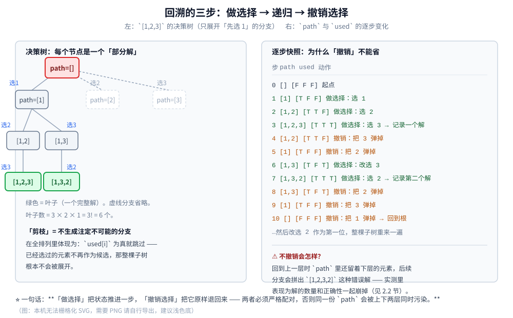

# 全排列

> 回溯的母模板：**路径 / 选择列表 / 结束条件**三要素，以及「做选择 → 递归 → 撤销选择」这套骨架。
> 全排列是这三个要素最干净的载体 —— 看懂它再看 [八皇后.md](八皇后.md) 与 [数独.md](数独.md)，会发现后两篇只是在同一套骨架上换了「选择列表」和「剪枝条件」。
>
> ⭐ 本篇是「回溯」三篇的**第一篇**，也是**模板的唯一出处**：回溯三要素、撤销选择的写法、`used` 数组法与交换法的取舍，
> 都只在本文讲透；后两篇一律写「见 [全排列.md](全排列.md) 第 N 节」，不重复。三篇按问题规模递进：
> 全排列（无约束）→ 八皇后（带约束剪枝）→ 数独（约束传播 + 启发式）。
>
> 内容整理自个人学习笔记，素材见 [素材清单.md](../../../素材清单.md)。回溯与 DFS 的关系见 [DFS深度优先遍历.md](../图论算法/图的遍历/DFS深度优先遍历.md) 第 2.2 节；
> 复杂度口径见 [复杂度分析.md](../基础算法/复杂度分析.md)。
>
> 📎 本篇所有输出均为本机实跑逐字抄录：**Go 1.26.5（windows/amd64）** 与 **JDK 1.8.0_321** 各实现一份，两版输出**逐行对齐**
> （`diff` 之后只剩耗时行；耗时本身随机器负载波动）。

---

## 一、回溯是什么？它和「暴力枚举」差在哪？

**本节要点**：把「枚举所有方案」拆成三个可写的部件 —— 路径、选择列表、结束条件。看懂这三件东西，回溯就没有别的秘密了。

### 1.1 一个具体问题：列出 3 个数的所有排列

给定 `[1, 2, 3]`，要求列出全部排列：`[1 2 3] [1 3 2] [2 1 3] [2 3 1] [3 1 2] [3 2 1]`，共 6 个（`3! = 6`）。

最直白的「暴力枚举」是**把每一层都试满**：第 1 位试 3 个数，第 2 位也试 3 个数，第 3 位还试 3 个数，
生成 `3 × 3 × 3 = 27` 个序列，再逐个校验「是不是排列」。它一定对，但**绝大多数候选是废的** ——
`[1 1 1]`、`[2 2 3]` 这类在第 1 位就已经注定不可能，却要一直填到第 3 位才被丢掉。

回溯要做的只有一件事：**在第 1 位就发现「1 用过了」，不要继续往下走。**

### 1.2 回溯三要素

| 要素 | 全排列里的对应物 | 含义 |
|---|---|---|
| **路径** | `path`（已选元素的序列） | 已经做过的选择 |
| **选择列表** | 还没被 `used` 标记的元素 | 当前这一步还能选谁 |
| **结束条件** | `len(path) == n` | 路径已经覆盖全部决策层，记录一个解 |

⭐ 三要素其实是三个问题：**现在到哪了**（路径）、**下一步能去哪**（选择列表）、**什么时候算走完**（结束条件）。
八皇后与数独的差别，全部体现在「选择列表长什么样」与「选择列表怎么剪」这两件事上。

### 1.3 决策树：回溯是在一棵树上走

把 `[1, 2, 3]` 的回溯过程画成树（边上的文字 = 这一层选了谁）：

```text
                        (根 · path 为空)
            ┌───────────────┼───────────────┐
          选1              选2              选3
            │               │               │
        path=[1]        path=[2]        path=[3]
        ┌───┴───┐       ┌───┴───┐       ┌───┴───┐
      选2      选3     选1     选3     选1     选2
       │        │       │       │       │       │
   path=[1,2] [1,3]  [2,1]   [2,3]   [3,1]   [3,2]
       │        │       │       │       │       │
      选3      选2     选3      选1     选2     选1
       │        │       │       │       │       │
    [1,2,3]  [1,3,2] [2,1,3] [2,3,1] [3,1,2] [3,2,1]   ← 6 个叶子 = 6 个解

  叶子数 = 3 × 2 × 1 = 3! ；每往下一层可选元素就少一个 —— 少掉的那些就是被剪掉的分支
```

⭐ **回溯 = 在这棵树上做深度优先遍历**。树上的每个节点是一个「部分解」，每条边是一次「选择」。
「剪枝」就是**不生成注定不可能的分支** —— 全排列里体现为「`used[i]` 为真就跳过」。



上面那张图的**右半部分**是本篇最需要记住的东西：**「做选择」把 `path` 推进一步，「撤销选择」必须把它原样退回来**。
两者严格配对，同一份 `path` 才不会被上下两层同时污染 —— 2.2 节会实测「不撤销」的后果。

### 1.4 回溯和 DFS 是一回事吗？

⚠️ 代码长得几乎一样，**语义差一步**：**回溯 = DFS + 撤销选择**。

| | DFS 遍历图 | 回溯 |
|---|---|---|
| 标记 | `visited[u] = true`，**永不撤销** | `used[i] = true`，回溯时**必须撤销** |
| 为什么 | 只要求「每个点访问一次」 | 要枚举**所有路径**，所以「来过的路」得还给别人 |
| 装什么 | 当前路径上未走完的点 | 当前路径上已做的选择 |

相关推导见 [DFS深度优先遍历.md](../图论算法/图的遍历/DFS深度优先遍历.md) 第 2.2 节：那里有一句关键的区分 ——
「DFS 的 `visited` 是『访问过就不再走』，永不撤销；而回溯算法要撤销选择，因为回溯要枚举所有路径」。

---

## 二、回溯的模板长什么样？为什么必须撤销选择？

**本节要点**：这一段代码是全篇最该记牢的部分。记住五步 —— **判结束 → 遍历候选 → 做选择 → 递归 → 撤销选择**，后面两篇只是把其中的「遍历候选」换成更聪明的遍历。

### 2.1 骨架

```go
// 回溯三要素：path 是路径，used 决定选择列表，len(path) == n 是结束条件
func backtrack(a []int, used []bool, path []int, out *[][]int) {
	if len(path) == len(a) { // ① 结束条件：决策层走满了
		*out = append(*out, append([]int(nil), path...)) // ⭐ 必须拷贝，见 2.3
		return
	}
	for i := 0; i < len(a); i++ { // ② 遍历选择列表
		if used[i] {
			continue // ③ 剪枝：这一层不能再用它
		}
		used[i] = true               // ④ 做选择
		path = append(path, a[i])
		backtrack(a, used, path, out) // ⑤ 递归进下一层
		path = path[:len(path)-1]
		used[i] = false              // ⑥ 撤销选择 —— 把状态还原成「进这一层之前」
	}
}
```

```java
static void backtrack(int[] a, boolean[] used, List<Integer> path, List<int[]> out) {
    if (path.size() == a.length) {                    // ① 结束条件
        int[] cp = new int[path.size()];              // ⭐ 必须拷贝，List 是可变的
        for (int i = 0; i < cp.length; i++) cp[i] = path.get(i);
        out.add(cp);
        return;
    }
    for (int i = 0; i < a.length; i++) {              // ② 遍历选择列表
        if (used[i]) continue;                        // ③ 剪枝
        used[i] = true;                               // ④ 做选择
        path.add(a[i]);
        backtrack(a, used, path, out);                // ⑤ 递归
        path.remove(path.size() - 1);
        used[i] = false;                              // ⑥ 撤销选择
    }
}
```

⭐ **「做选择」与「撤销选择」必须严格对称**：`used`、`path`、以及后面几篇里的冲突集合，改了哪几样就要还原哪几样。
少还一样，状态就会「泄漏」到兄弟分支上去。

### 2.2 为什么「撤销选择」这一步不能省（本机实测）

把模板里的 `used[i] = false` 删掉，其余一字不改 —— 结果不是「慢一点」，而是**只产出一个解**：

```text
[1.1] 反面自检：忘记「撤销选择」会怎样（输入 [1 2 3 4]）
  正确版（递归后撤销 used[i]）：解数=24 节点=65
  错误版（忘记撤销 used[i]）  ：解数=1 节点=5
  两版结果不同 = true
```

**为什么只剩 1 个解**：走完第一条路径 `[1,2,3,4]` 回到上层时，`used` 已经是**四个全真**。
此后每一层的 `for` 循环里所有候选都被判 `used`，于是整棵树只剩「一直往右」的那一条路径 ——
节点数从 `65` 掉到 `5`（根 + 4 层），恰好就是一条链。

⚠️ **这个错误特别隐蔽**：它不报错、不抛异常，只是安静地少给答案。所以「结果数量对不对」是一件必须单独断言的事 ——
本仓库所有回溯实验的第一件事都是数解数。

### 2.3 ⚠️ 记录解时必须拷贝路径

`path` 是一份**会被后续选择不断改写**的可变数据。直接把它塞进结果集，等于存了一个「还在变的引用」。

**本机两侧各跑了一遍不拷贝的版本**（同一份模板，只去掉拷贝那一步）：

| 语言 | 解数 | 互不相同的条数 | 现象 |
|---|---|---|---|
| **Go** | 24 | **12** | `append(path, …)` 与 `path[:len-1]` 复用同一段底层数组，相邻两条常指向同一份数据 |
| **Java** | 24 | **1** | `path` 是同一个 `ArrayList` 对象，回溯到底时已被清空，24 条**全部是空列表** |

⭐ 结论与语言无关：**记录解时必须拷贝**（Go 用 `append([]int(nil), path...)`，Java 用 `new ArrayList<>(path)`）。
⚠️ 注意症状**因语言而异**（12 条 vs 1 条），所以这类 bug 不能靠「两版输出对不上」来发现 —— 它两版都是错的。

### 2.4 复杂度

| 量 | 值 | 说明 |
|---|---|---|
| 叶子数 | `n!` | 每个完整排列是一个叶子 |
| 节点数 | `Σ(k=0..n) P(n,k)`（`= 1 + n + n(n−1) + …`） | 每个「部分解」是一个节点，见第 5.1 节 |
| 时间 | **`O(n · n!)`** | 叶子有 `n!` 个，每个叶子要把长度 `n` 的路径记录一次；节点数只有常数倍差别 |
| 空间 | `O(n)`（不含结果集） | 递归深度恰为 `n`，即当前路径的长度 |

⚠️ `O(n!)` 是**能跑多大**的硬边界：`n = 10` 是 362.9 万，`n = 12` 是 4.79 亿，`n = 15` 是 1.3 万亿。
所以现实中「用全排列」的场合，`n` 往往被限制在 10 以内 —— 超过就必须换算法（见第六节与「使用」一节）。

---

## 三、两种写法该选哪个：`used` 数组法与交换法

**本节要点**：两种写法结果集相同、节点数相同，但**枚举顺序不同**，而且交换法会**改动输入数组**。这一节把差别量化。

### 3.1 `used` 数组法

就是 2.1 节的模板。它额外维护一个 `used []bool`，用「按下标取元素」的方式枚举候选。

- 优点：**保持元素原始顺序**，因此天然产出**字典序**；适合需要「按字典序找第 k 个」的场合；
- 优点：可以带「同层判重」的判据（第四节），去重排列只能用它；
- 缺点：多一份 `O(n)` 的标记数组。

### 3.2 交换法

思路是：**第 `d` 位放谁，就把谁换到 `d` 上来**。

```go
// 交换法：第 d 位依次与 d..n-1 交换，递归后换回来
func permSwap(a []int, d int, out *[][]int) {
	if d == len(a) {
		*out = append(*out, append([]int(nil), a...))
		return
	}
	for i := d; i < len(a); i++ {
		a[d], a[i] = a[i], a[d] // 做选择：把 a[i] 换到第 d 位
		permSwap(a, d+1, out)
		a[d], a[i] = a[i], a[d] // 撤销选择：换回去
	}
}
```

- 优点：**不需要 `used` 数组**，空间更省；
- 缺点：**会原地改动输入数组**（如果调用方还要用原数组，得先 `clone`）；
- 缺点：产出的**不是字典序**（见 3.3）。

### 3.3 对比（本机实测）

```text
[1.2] used 数组法 vs 交换法（输入 [1 2 3 4]）
  used 解数=24 交换解数=24 ; used 节点=65 交换节点=65
  used 前 4 个 = [1 2 3 4] [1 2 4 3] [1 3 2 4] [1 3 4 2]
  交换 前 4 个 = [1 2 3 4] [1 2 4 3] [1 3 2 4] [1 3 4 2]
  首个不同的位置 i=4  used 法=[1 4 2 3]  交换法=[1 4 3 2]
  used 法尾 3 条 = [4 2 3 1] [4 3 1 2] [4 3 2 1]
  交换法尾 3 条 = [4 3 1 2] [4 1 3 2] [4 1 2 3]
  两法解集合（排序后）一致 = true
```

⚠️ **前 4 个一样不代表顺序一样**。读上面第 5 行：到 `i=4` 就分道扬镳了（`[1 4 2 3]` vs `[1 4 3 2]`），
尾部的三条也各不相同，而最后一行「集合一致 = true」才是两者的真正关系。

⭐ 所以正确的说法是：**两法得到的解集合相同，枚举顺序不同**。
把「集合相同」写成「序列相同」，是这类实验最容易犯的错 —— 前几项碰巧一致就把 bug 藏住了。

---

## 四、输入有重复元素时，怎么不产生重复解？

**本节要点**：朴素回溯在重复输入上会把同一个排列**重复输出多次**。这一节给出判据 `a[i] == a[i-1] && !used[i-1]`，并解释它为什么成立。

### 4.1 朴素回溯会重复

输入 `[1, 1, 2]` 时，两个 `1` 在物理上是**两个不同的下标**，但值是同一个。
朴素回溯按下标枚举，于是「先取下标 0 的 `1`、再取下标 1 的 `1`」与「反过来取」被记成两个解 —— 它们打印出来一模一样。

```text
[1.3] 去重排列：朴素回溯 vs 排序 + used 判重
  输入=[1 1 2]  朴素解数=6    去重解数=3    朴素节点=16    去重节点=9
  输入=[1 1 2 2]  朴素解数=24   去重解数=6    朴素节点=65    去重节点=19
  输入=[1 1 2 2 3]  朴素解数=120  去重解数=30   朴素节点=326   去重节点=90
  输入=[1 1 1 2 2 3]  朴素解数=720  去重解数=60   朴素节点=1957  去重节点=189
```

⭐ 两个规律一眼可见：

- **朴素解数恒为 `n!`**（6、24、120、720），它只认下标、不认值；
- **去重解数 = `n! / Π(每种值的个数!)`**（`3!/2! = 3`、`4!/(2!2!) = 6`、`5!/(2!2!) = 30`、`6!/(3!2!) = 60`），
  它数的是**值序列**，这才是「排列」该有的答案。**节点数也随之下降**（65 → 19、1957 → 189），因为被剪掉的分支不再展开。

### 4.2 判据：排序 + `used[i-1]`

```go
// 去重全排列：进入前必须先 sort.Ints(a)
func permUnique(a []int, used []bool, path []int, out *[][]int) {
	if len(path) == len(a) {
		*out = append(*out, append([]int(nil), path...))
		return
	}
	for i := 0; i < len(a); i++ {
		if used[i] {
			continue
		}
		// ⭐ 判据：同一层里，值相同的元素只让「第一个还没被用掉的」出手
		if i > 0 && a[i] == a[i-1] && !used[i-1] {
			continue
		}
		used[i] = true
		path = append(path, a[i])
		permUnique(a, used, path, out)
		path = path[:len(path)-1]
		used[i] = false
	}
}
```

```java
if (i > 0 && a[i] == a[i - 1] && !used[i - 1]) continue; // ⭐ 与 Go 版逐字对应
```

### 4.3 判据为什么成立

先排序，让**相同的值挨在一起**。设 `a[i-1] == a[i]`，两者在「本层」的关系只有三种：

| 情形 | `used[i-1]` | 该不该在 `i` 上展开 |
|---|---|---|
| `i-1` 在本层**已经选过**（在兄弟分支里） | 已回溯为 `false` | ❌ 不该 —— 同一层的相同值展开一次就够了 |
| `i-1` 正在**当前路径上** | `true` | ✅ 该 —— 它的位置被占住了，`i` 是这一层唯一可用的那个值 |
| `i-1` 尚未被考虑 | `false` | ❌ 与第一种等价（同一层） |

⭐ 判据 `a[i] == a[i-1] && !used[i-1]` 说的正是「**前一个相同值没有被选中**」→ 跳过当前这个。
**排序保证了「相同值相邻」，`used[i-1]` 保证了「只在同一层去重」** —— 两块拼起来，判据才成立。

⚠️ **写反成 `&& used[i-1]` 会误杀合法解**：那会把「`i-1` 正在路径上」这一情形也跳掉，
于是像 `[1, 1, 2] → [1, 1, 2]` 这种正常的解就不见了。**`!` 不能丢。**

### 4.4 交换法为什么不适合去重

交换法把元素来回换位置，**「相同值相邻」这个前提被破坏**，`a[i] == a[i-1]` 也就失去意义。
要给它去重，只能退而用「本层已用过的值」集合（`Set`）来挡，代价是每次都要建集合。
⭐ **需要去重时直接用 `used` 数组法**，这是两种写法里最实际的一条分工。

---

## 五、剪枝到底省了多少？

**本节要点**：不讲「剪枝能加速」这种空话 —— 把「带剪枝」与「不带剪枝」的**节点数**摆出来比。

### 5.1 先定义「节点数」

「快了多少」这件事必须先说清数的是什么，否则数字没有意义。本文统一口径：

> **搜索节点数 = 递归（回溯）函数被调用的次数**，每进入一个状态记 1，**含根节点，也含叶子节点**。

两种实现按这个口径分别是：

| 版本 | 每个状态做什么 | 节点数公式 |
|---|---|---|
| **回溯（带剪枝）** | 只扩展「还没用过」的元素 | `Σ(k=0..n) P(n,k)` |
| **暴力枚举（不剪枝）** | 每一层都试满全部 `n` 个取值，填满后再校验 | `Σ(k=0..n) n^k` |

### 5.2 实测（n = 1..8）

```text
[1.4] n=1..8：解数 / 回溯节点 / 暴力枚举节点
  n=1  解数=1     回溯节点=2       暴力节点=2
  n=2  解数=2     回溯节点=5       暴力节点=7
  n=3  解数=6     回溯节点=16      暴力节点=40
  n=4  解数=24    回溯节点=65      暴力节点=341
  n=5  解数=120   回溯节点=326     暴力节点=3906
  n=6  解数=720   回溯节点=1957    暴力节点=55987
  n=7  解数=5040  回溯节点=13700   暴力节点=960800
  n=8  解数=40320 回溯节点=109601  暴力节点=19173961
```

⭐ 三列各读出一件事：

1. **解数是 `n!`**：1、2、6、24、120、720、5040、40320 —— 这一列不听任何工程手段的话，是问题本身规定的；
2. **回溯节点 = `Σ P(n,k)`**：`n = 4` 时 `1 + 4 + 12 + 24 + 24 = 65`；它只是「解数」的常数倍（约 `e` 倍），**省不掉 `n!` 的量级**；
3. **暴力节点 = `Σ n^k`**：`n = 8` 时是 `19173961`，是回溯的 **175 倍**。⚠️ 差距随 `n` 拉大得很凶：
   暴力在 `n = 12` 时已是 `Σ(12^k) ≈ 9.7×10¹²` 量级，那已经不是「慢」而是「跑不完」。

### 5.3 耗时（本机实测，随机器波动）

```text
[1.5] 耗时对照（5 组累加，单位 ms/次）
  回溯 n=8         : 1.6842 ~ 2.0206 ms/次  (200 次/组 × 5 组)
  暴力 n=8         : 200.5790 ~ 216.4890 ms/次  (2 次/组 × 5 组)
```

⚠️ **时序数字只断言量级与单调趋势**：这台机器上反复跑，回溯的单次耗时会落在 `1.2 ~ 7.1 ms`、
暴力会落在 `200 ~ 1500 ms`（高值出现在机器同时在跑别的任务时，同一进程内连跑 5 组也压不住）。
但「回溯比暴力快两个数量级」这个结论不受影响 —— 它由 175 倍的**节点差**决定，与机器负载无关。

---

## 六、和「下一个排列」是一回事吗？

**本节要点**：不是。`next_permutation` 是**迭代法**，不给「选择列表」也不撤销选择；它和回溯唯一的关系是「枚举顺序相同」。

### 6.1 `next_permutation` 不是回溯

`next_permutation` 的算法只有三步（从右往左）：**① 找第一个升序对 `a[i] < a[i+1]`；② 在右边找最小的比 `a[i]` 大的元素并交换；③ 把 `i+1` 之后整体反转。**

```go
// 下一个排列：不做递归、不撤销选择，直接算出「字典序的下一个」
func nextPerm(a []int) bool {
	i := len(a) - 2
	for i >= 0 && a[i] >= a[i+1] {
		i-- // ① 从右往左找升序对
	}
	if i < 0 {
		return false // 没有下一个：已是最大排列
	}
	j := len(a) - 1
	for a[j] <= a[i] {
		j--
	}
	a[i], a[j] = a[j], a[i] // ② 换一个「刚好更大」的上去
	for l, r := i+1, len(a)-1; l < r; l, r = l+1, r-1 {
		a[l], a[r] = a[r], a[l] // ③ 后缀反转成最小
	}
	return true
}
```

⚠️ **它和回溯的结构完全不同**：

| | 回溯 | `next_permutation` |
|---|---|---|
| 结构 | 递归 + 撤销选择 | 一次 `O(n)` 扫描 + 交换 + 反转 |
| 需要额外空间 | `used` 数组 / 递归栈 | 无（原地） |
| 单次代价 | 摊还 `O(1)`（每个节点常数工作） | `O(n)` |
| 总代价 | `O(n · n!)` | `O(n · n!)`（`n!` 次调用 × `O(n)` 每次） |
| 能中途停止 | 能（拿到第 k 个就返回） | 能，但要从头迭代 k 步 |

### 6.2 实测：两者枚举顺序一致

```text
[1.6] 回溯序 vs 下一个排列
  输入=[1 2 3] 回溯解数=6 next_perm 解数=6 两序列一致=true
  输入=[1 1 2 2] 回溯解数=6 next_perm 解数=6 两序列一致=true
```

⭐ 两者**都是字典序**，所以序列逐条一致。⚠️ 注意 `[1 1 2 2]` 这一行同时说明：
**`next_permutation` 天然不产生重复排列**（它只认值、不认下标），与 4.2 节的去重回溯殊途同归。

### 6.3 什么时候用哪个

| 需求 | 选 |
|---|---|
| 要**枚举所有解**、且解本身有条件（如满足某约束的组合） | 回溯（可以随时剪枝） |
| 输入**有重复元素**、只要不重复的排列 | 回溯（排序 + `used[i-1]`）或 `next_permutation` |
| 只要**字典序的下一个排列** | `next_permutation`（一次 `O(n)`，不需要搜整棵树） |
| 模板要顺手改造成子集 / 组合 / 括号生成 | 回溯（换「选择列表」与「结束条件」即可） |

---

## 使用：这套模板在工程里以什么形式出现

**全排列本身很少直接出现在业务代码里，但它的模板到处都是** —— 复用的是那个「枚举所有合法方案」的壳。

**第一层：模板换零件（最常见的形态）**。同一份骨架，换「选择列表」与「结束条件」，就得到一整族算法：

| 变体 | 选择列表怎么变 | 结束条件怎么变 |
|---|---|---|
| 子集 | 每个元素「选 / 不选」两个分支 | 走到最后一个元素 |
| 组合（选 k 个） | 用 `start` 下标，**只能往后选** | 路径长度到 `k` |
| 括号生成 | 只对「左括号 / 右括号」两个分支 | 左右都放完；用剩余数量剪枝 |
| 单词搜索 | 网格四个方向 | 匹配完整单词 |
| 排列（本篇） | `used` 标记 | 路径长度到 `n` |

⚠️ **组合不能用 `used` 数组**：那会把 `[1,2]` 与 `[2,1]` 当成两个解。
组合的关键是「把选择列表限制成『只能选下标更大的』」，一眼之差，结果完全不同。

**第二层：`next_permutation` 那种「算下一个」的需求**。
C++ 的 `std::next_permutation` 是标准库函数；⚠️ Python 的 `itertools.permutations` **按输入顺序**产出，**不是字典序**，
两者不能互换 —— 要字典序得先 `sorted()` 再 `itertools.permutations`。这类 API 的差别正是 6.2 节那两条实测的意义。

**第三层：`n!` 的代价在工程里长什么样**。数据库优化器要枚举可选的执行计划：多表 JOIN 时表一多就是组合爆炸，
所以优化器**会放弃穷举、改用启发式**（代价是可能错过更优计划）。
⚠️ 这正是 2.4 节那条边界的现实版本 —— 相关：[查询优化.md](../../../03-数据与中间件/数据存储/关系型/MySQL/查询优化.md) 第二节。

**反向的一课：不是所有叫「回溯」的东西都是本篇这种回溯**。正则引擎的 backtracking（回溯）是「试错 + 失败回退」，
它**不显式维护选择列表、也不剪枝**，所以 `(a+)+b` 这类写法会让匹配次数指数爆炸（灾难性回溯）。
⚠️ 工程含义：**用户可控的正则要限长度，或者换线性引擎**（Go 的 `regexp` 就是 RE2 系、不做回溯）。
⭐ **「回溯」在别处是一个性能陷阱的名字，在本篇是一种有序搜索的方法** —— 这两个含义不要混。

---

## 延伸追问

- **组合 / 子集 / 全排列的模板差在哪？** → 只差两处。**选择列表**：全排列用 `used`，组合用 `start`（只能往右选），子集用「选 / 不选」二分。**结束条件**：全排列走到 `n`，组合走到 `k`，子集走到末尾。
- **为什么去重判据是 `!used[i-1]` 而不是 `used[i-1]`？** → 因为要去掉的是「同一层里值相同的**兄弟**分支」。`!used[i-1]` 表示「前一个相同值已经回溯回来了」，正是兄弟分支；写成 `used[i-1]` 会把「前一个相同值正在当前路径上」的合法情形也跳过，**误杀解**（4.3 节）。
- **交换法能去重吗？** → 不能直接用 `a[i]==a[i-1]` 那套判据：交换会打乱顺序，相同的值不再相邻。要用的话得在本层记一个「已用过的值」集合（4.4 节）。
- **为什么必须是 `O(n · n!)` 而不是 `O(n!)`？** → 叶子有 `n!` 个，每个叶子还要把长度 `n` 的路径处理一遍（拷贝 / 输出），所以乘上 `n`。只数节点的话是 `Σ P(n,k)`。
- **什么时候不该用回溯？** → 当**子问题会重复出现**时。回溯本质是「不撞南墙不回头」的枚举，没有任何记忆；若同一个子状态会被反复求解（如「爬楼梯」「背包」），应该换成自底向上的 DP，把指数级压成多项式。
- **记录解为什么一定要拷贝？** → 因为 `path` 是活的数据，会随回溯被改写。⚠️ 本机两侧都验证过：不拷贝时 Go 的 24 条只剩 12 条互不相同、Java 的 24 条全是空列表（2.3 节）—— 症状还因语言而异。
- **`used` 数组和交换法该选哪个？** → 需要字典序、需要去重 → `used` 数组法；只要一份不重复的排列、且能接受原地改数组 → 交换法。⚠️ 交换法输出**不是字典序**（3.3 节实测：第 5 条就不同）。
- **暴力枚举的节点数为什么是 `Σ n^k`？** → 因为「不剪枝」意味着每一层都试满 `n` 个取值，于是第 `k` 层有 `n^k` 个状态，全部加起来即得（5.2 节 `n=8` 是 19173961）。

---

## 关联

- [八皇后.md](八皇后.md) — 「回溯」三篇的第二篇：在同一套模板上加「列 / 主对角 / 副对角」三个冲突集合
- [数独.md](数独.md) — 第三篇：把选择列表换成位掩码候选集，并用 MRV 启发式换搜索顺序
- [DFS深度优先遍历.md](../图论算法/图的遍历/DFS深度优先遍历.md) — **回溯 = DFS + 撤销选择**；其第 2.2 节讲清了「`visited` 永不撤销」与「回溯要撤销」的分界
- [DFS与BFS遍历.md](../图论算法/图的遍历/DFS与BFS遍历.md) — 遍历总纲：为什么「下一个取谁」由容器决定，而回溯的「容器」是递归栈
- [复杂度分析.md](../基础算法/复杂度分析.md) — `O(n · n!)` 的推导口径与递归复杂度一节
- [栈与队列.md](../../数据结构/线性结构/栈与队列.md) — 递归所依赖的调用栈，以及栈与队列的对比
- [查询优化.md](../../../03-数据与中间件/数据存储/关系型/MySQL/查询优化.md) — 「使用」一节第三层：JOIN 顺序枚举就是 `n!` 的现实版本
> 反向引用（本篇被下列文档引到）：[回溯模板与剪枝.md](回溯模板与剪枝.md)、[递归与分治.md](../基础算法/递归与分治.md)
