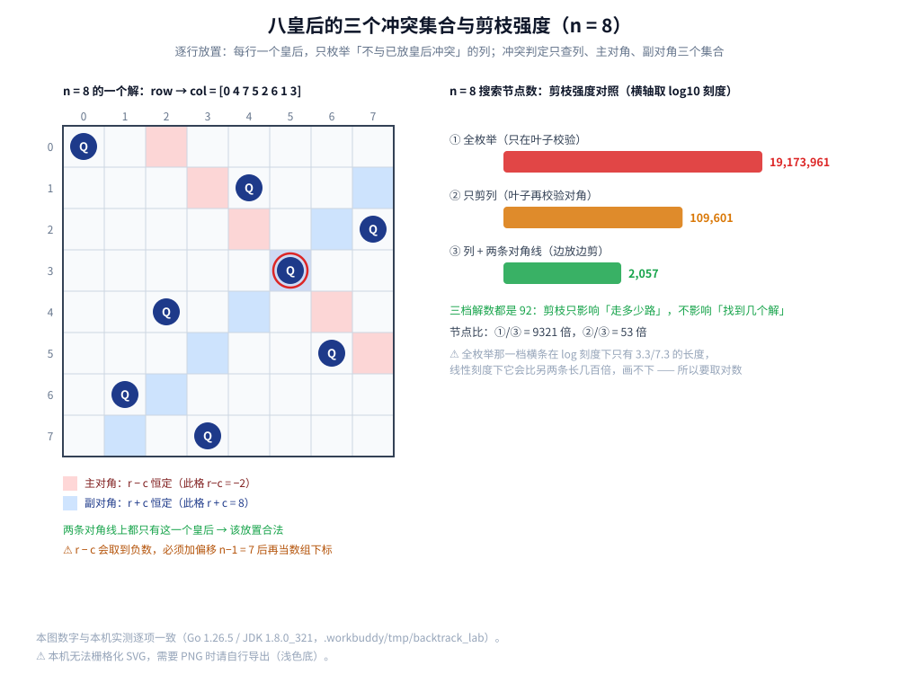

# 八皇后

> 在 [全排列.md](全排列.md) 的回溯模板上加**约束剪枝**：逐行放置，用三个集合（列 / 主对角 / 副对角）判冲突；
> 以及那个最容易写错的下标细节 —— `row − col` 会取负值，必须先加偏移。
>
> ⭐ 本篇是「回溯」三篇的**第二篇**。回溯三要素与「做选择 → 递归 → 撤销选择」的骨架**只在** [全排列.md](全排列.md) 第 2.1 节讲透，
> 本篇不再重复，只讲**新增的那部分**：约束怎么表示、剪枝有多强、解数为什么是 92。
> 三篇按问题规模递进：全排列（无约束）→ 八皇后（带约束剪枝）→ [数独.md](数独.md)（约束传播 + 启发式）。
>
> 内容整理自个人学习笔记，素材见 [素材清单.md](../../../素材清单.md)。复杂度口径见 [复杂度分析.md](../基础算法/复杂度分析.md)；
> 递归与栈的关系见 [栈与队列.md](../../数据结构/线性结构/栈与队列.md)。
>
> 📎 本篇所有输出均为本机实跑逐字抄录：**Go 1.26.5（windows/amd64）** 与 **JDK 1.8.0_321** 各实现一份，两版输出**逐行对齐**
> （`diff` 之后只剩耗时行）。

---

## 一、八皇后在问什么？为什么「逐行放置」是天然的？

**本节要点**：先把问题翻译成「变量 / 域 / 约束」三件套，再看一个关键观察 —— **每行必有一个皇后**。这两步做完，回溯的「选择列表」就已经确定了大半。

### 1.1 问题本身

在 `n × n` 棋盘上放 `n` 个皇后，要求**任意两个都不能互相攻击**。皇后能攻击**同行、同列、同对角线**的格子。

`n = 8` 时，已知恰有 **92 个解** —— 这个数字后面会当作正确性断言反复使用。

### 1.2 关键观察：每行恰好一个

⭐ **`n` 个皇后放在 `n` 行上，若某一行空着，根据鸽笼原理必有另一行放了两个** —— 而同一行的两个皇后一定互相攻击。
所以「每行恰好一个」不是启发式，而是**等价变换**：任何合法解都满足它，任何满足它的放置也不必再检查行冲突。

同理，**每列也恰好一个**（`n` 个皇后落在 `n` 列上，否则必有同列冲突）。⭐ 这一点很关键：
**它把「放棋子」问题变成了「给每一行选一个列号」** —— 也就是一个「列号的排列」问题，而这正是 [全排列.md](全排列.md) 的形态。

### 1.3 于是「选择列表」变短了

| 全排列 | 八皇后 |
|---|---|
| 第 `k` 位放哪个**元素** | 第 `row` 行放哪个**列** |
| 候选 = 还没用过的元素 | 候选 = 还没被占用的列 **且** 两个对角都不冲突 |
| 结束条件 = 用满 `n` 个元素 | 结束条件 = 放满 `n` 行 |

⭐ **只差一处**：全排列的剪枝只有「这个元素用过没有」，八皇后多了一组「这一列 / 这两条对角线用过没有」。
**多出来的这组判断，就是全部的新内容。**

---

## 二、三个集合怎么判冲突？

**本节要点**：把「两两不能互攻」这条约束**投影到三个一维数组**上，冲突判定就从「扫描前面所有皇后」变成「查三个下标」。这是本篇最值得带走的一个技巧。

### 2.1 冲突只有三类

新放一个皇后到 `(row, col)` 时，只需与**已放好的**皇后比，冲突只有三类：

| 类型 | 判定式 | 能压成什么 |
|---|---|---|
| 同列 | `col' == col` | 一个「列是否被占」的布尔数组 |
| 同主对角 | `col' − row' == col − row`，即 **`row − col` 相同** | 一个按 `row − col` 索引的布尔数组 |
| 同副对角 | `col' + row' == col + row`，即 **`row + col` 相同** | 一个按 `row + col` 索引的布尔数组 |

⭐ 对角线那条判定的来源：同一条「右上到左下」的斜线上，**行号减列号是常数**；「左上到右下」的斜线上，**行号加列号是常数**。



### 2.2 ⚠️ 负下标：`row − col` 会取负

`row − col` 的取值范围是 `[−(n−1), n−1]`。`n = 8` 时是 `[-7, 7]` —— **数组下标不能为负**，
所以必须**加偏移 `n − 1`** 把它平移到 `[0, 2n−2]`。

`row + col` 的取值范围本来就是 `[0, 2n−2]`，**不需要偏移**。⚠️ 两个对角线的处理不对称，这是最容易写错的一处。

```go
col[c]                 // 列：下标就是列号
d1[row-c+n-1]          // 主对角：r−c ∈ [-n+1, n-1]，加 n-1 平移
d2[row+c]              // 副对角：r+c ∈ [0, 2n-2]，直接当下标
```

### 2.3 实测：四个格子的下标换算

```text
[2.1] 对角线索引（n=8，偏移 = n-1 = 7）
  格(row=0,col=0)  主对角 r-c=0   → 下标 7    副对角 r+c=0   → 下标 0
  格(row=2,col=0)  主对角 r-c=2   → 下标 9    副对角 r+c=2   → 下标 2
  格(row=3,col=5)  主对角 r-c=-2  → 下标 5    副对角 r+c=8   → 下标 8
  格(row=7,col=7)  主对角 r-c=0   → 下标 7    副对角 r+c=14  → 下标 14
  范围：r-c ∈ [-7,7] → 下标 ∈ [0,14]；r+c ∈ [0,14] → 下标 ∈ [0,14]（用长度 2n-1=15 的数组）
```

⚠️ 注意第 3 行：`(row=3, col=5)` 的 `r−c = −2`。**这一类错误有「响度」差别**，本机把三种写错方式各跑了一遍：

| 写错方式 | n=8 解数 | 表现 |
|---|---|---|
| 正确 | **92** | — |
| 完全不偏移（`d1[row-c]`） | 崩溃 | ✅ 最响：Go 报 `index out of range`、Java 报 `ArrayIndexOutOfBoundsException` |
| 偏移对了，但两条对角线**共用同一个数组** | **0** | ⚠️ 不崩：`d[row-c+n-1]` 与 `d[row+c]` 互相顶替，解被过度剪枝剪光 |
| 偏移对了，但**漏查**副对角线 | **2113** | ⚠️⚠️ 最安静：多出一堆其实互相攻击的「解」 |

⭐ **最危险的恰恰是最后一种** —— 它不崩溃、不报错，只是安静地给出错误答案。
所以第 4.3 节才会把「解数 == 92」当作必须断言的东西，而不是「解数 > 0」。

### 2.4 三个集合 vs 逐行扫描

不建集合也能判冲突：把已放的皇后逐个拿出来比。两种写法的**节点数完全相同**（它们剪的是同一批分支），
差别只在**每个节点的常数**：

| 写法 | 每次判冲突的代价 | 说明 |
|---|---|---|
| 逐行扫描已放皇后 | `O(row)` | 代码短，但 `n` 大时每个节点都要扫一遍 |
| **三个布尔集合** | `O(1)` | 三次数组查表；本机两版都用这个 |

⚠️ **「节点数相同、常数不同」这件事要分清楚**：本节讲的是**常数优化**，第三节讲的才是**剪枝带来的节点数变化**。
两件事经常被混着说，但量级完全不同。

---

## 三、剪枝到底省了多少？

**本节要点**：不讲空话 —— 造出**三档剪枝强度**的实现，把节点数摆出来比。

### 3.1 三档分别怎么剪

| 档位 | 放置时检查什么 | 什么时候才校验 |
|---|---|---|
| **① 全枚举** | 什么都不检查 | 填满 `n` 行后，整体校验一次 |
| **② 只剪列** | 只检查列冲突 | 填满 `n` 行后，再校验两条对角线 |
| **③ 边放边剪** | 列 + 两条对角线全查 | 不需要事后校验（放下即合法） |

⭐ **三档的「解数」必须都是 92** —— 剪枝只改变「走了多少路」，不该改变「找到几个解」。
这一点在本机实测里被验证了（下面三行都是 `解数=92`），它同时也是一个很好的自检：**任何一档解数不对，就说明那一档的校验写错了**。

### 3.2 实测：节点数差 9321 倍（n = 8）

```text
[2.2] n=8：三档剪枝强度的搜索规模（三档解数都应为 92）
  ① 全枚举（只在叶子校验）: 解数=92  搜索节点=19173961  占剪枝版节点的 9321 倍
  ② 只剪列（叶子再校验对角）: 解数=92  搜索节点=109601    占剪枝版节点的 53 倍
  ③ 列 + 主/副对角线（边放边剪）: 解数=92  搜索节点=2057
```

⭐ 三档的数字各有来历，值得逐个对上：

| 档位 | 节点数 | 为什么是这个数 |
|---|---|---|
| ① 全枚举 | `19173961` | 每一层都试满 8 列，`Σ(k=0..8) 8^k` —— 与 [全排列.md](全排列.md) 第 5.2 节的「暴力节点」**同一个公式** |
| ② 只剪列 | `109601` | 「每列恰好一个」= 列号的排列，`Σ(k=0..8) P(8,k)` —— 与全排列的「回溯节点」**同一个公式** |
| ③ 边放边剪 | `2057` | 再加上两条对角线约束后的真实搜索规模（**比 `8! = 40320` 还小 20 倍**） |

⚠️ **最反直觉的是第三行**：直觉上「每行一个、每列一个」已经是很强的约束（`8! = 40320`），
但加上对角线后只剩 `2057` 个节点 —— **对角线约束砍掉了 98% 的剩余搜索空间**。

### 3.3 耗时（本机实测，随机器波动）

```text
[2.3] 耗时对照（5 组累加，单位 ms/次）
  ③ 剪枝 n=8       : 0.1146 ~ 0.1280 ms/次  (2000 次/组 × 5 组)
  ② 只剪列 n=8      : 3.1641 ~ 3.5777 ms/次  (100 次/组 × 5 组)
  ① 全枚举 n=8      : 194.3220 ~ 214.3035 ms/次  (2 次/组 × 5 组)
```

⭐ **耗时比（约 28 倍 / 1700 倍）与节点比（53 倍 / 9321 倍）不完全一致**，这是正常的：
三档的运行环境相同，但「只剪列」那一档在叶子处还要做一次 `O(n²)` 的对角线校验，**每个节点的常数更重**。
⚠️ 时序数字只断言单调趋势 —— 换一轮跑，这三档的值会整体浮动（本机多轮实测区间大致是 剪枝 `0.11 ~ 0.15 ms`、
只剪列 `2.8 ~ 8.1 ms`、全枚举 `170 ~ 280 ms`），但 `① ≫ ② ≫ ③` 的次序不变。

---

## 四、解的数量：为什么 n = 8 是 92？

**本节要点**：把解数当**断言**用。解数是这类程序最灵敏的正确性指标 —— 冲突判定写错一位，它立刻变化。

### 4.1 实测 n = 1..12

```text
[2.4] n=1..12：解数 / 剪枝节点
  n=1  解数=1      剪枝节点=2
  n=2  解数=0      剪枝节点=3
  n=3  解数=0      剪枝节点=6
  n=4  解数=2      剪枝节点=17
  n=5  解数=10     剪枝节点=54
  n=6  解数=4      剪枝节点=153
  n=7  解数=40     剪枝节点=552
  n=8  解数=92     剪枝节点=2057
  n=9  解数=352    剪枝节点=8394
  n=10 解数=724    剪枝节点=35539
  n=11 解数=2680   剪枝节点=166926
  n=12 解数=14200  剪枝节点=856189
```

⭐ 两列各读出一件事：

1. **解数不是单调的**：`n=2`、`n=3` 是 0（棋盘太小，放不下），`n=6` 只有 4 个解，比 `n=5` 的 10 个还少；
   之后才随着 `n` 迅速上升。⚠️ 所以「大棋盘一定有更多解」是错的 —— 约束的松紧在不同 `n` 上不是单调的。
2. **节点数增长远快于解数**：`n=12` 的解数是 `n=1` 的 14200 倍，而节点数是 42.8 万倍。
   `n=12` 也已经是本机能在几秒内算完的上限了 —— 再往上就属于「跑得动但没必要」。

### 4.2 92 个解在对称变换下只有 12 组

棋盘是一个正方形，它有 **8 种对称**（D4 群：4 个旋转 + 4 个翻转）。把一个解连同棋盘一起旋转 / 翻转，
得到的**仍然是一个解** —— 所以 92 个解是**成群**出现的。

```text
[2.5] n=8 正确性与对称性
  n=8 解数 = 92（断言 92）
  在 D4（旋转 4 + 翻转 4 共 8 种变换）下的基本解 = 12（断言 12）
  轨道大小分布：4 个解的轨道 1 组；8 个解的轨道 11 组；
  自对称解（存在非恒等变换映射到自身）= 4 个
  首个解 = [0 4 7 5 2 6 1 3]
```

⭐ **把这四行对上账**：`1 × 4 + 11 × 8 = 92`，而 `1 + 11 = 12` —— **92 个解恰好分成 12 组「本质不同」的解**。

- 绝大多数解所在的组有 8 个成员（自己 + 7 个变换结果）；
- 有 **4 个解**经过某个非恒等变换后**回到自身**，它们凑成那一组只有 4 个成员的轨道；
- ⚠️ 所以**不能**拿 `92 / 8 = 11.5` 去估基本解数 —— 轨道大小并不整齐，存在被对称性**固定住**的解。

### 4.3 用 92 做正确性断言

⭐ 解数是这类程序**最灵敏**的正确性指标，原因有三：

1. **它同时覆盖三类冲突**：列、主对角、副对角任一处判错，92 都会变；
2. **它对「对角线写错」也敏感**：本机实测，两条对角线共用同一个数组会让 **92 变 0**（过度剪枝），
   漏查副对角线会让 **92 变 2113**（放过了互攻的对）—— 两种错都不崩溃（2.2 节）；
3. **它有一个公认的标准答案**，不依赖自己的实现。`n = 8 → 92`、`n = 12 → 14200` 都是已知结论，本机实测与之完全一致。

⚠️ **不要只断言「解数 > 0」**：写错冲突判定时，程序通常仍然能输出一大堆解，只是数量不对。
**断言必须落在精确值上。**

---

## 五、模板怎么搬到八皇后上？

**本节要点**：把第 1.3 节的对应关系落到代码上 —— 与 [全排列.md](全排列.md) 第 2.1 节的模板逐行对照，只有三处不同。

### 5.1 与全排列模板的对照

| 模板中的位置 | 全排列 | 八皇后 |
|---|---|---|
| 结束条件 | `len(path) == n` | `row == n` |
| 选择列表 | `i` 从 `0` 到 `n-1`，跳过 `used[i]` | `c` 从 `0` 到 `n-1`，跳过三个集合里被占的下标 |
| 做选择 | `used[i] = true` | `col[c] / d1[...] / d2[...] = true` |
| 撤销选择 | `used[i] = false` | 同三处全部置回 `false` |

⭐ 换句话说，**只要会写全排列，八皇后就是「把 `used` 换成三个数组」**。撤销选择那一步的对称性要求也完全一样
（见 [全排列.md](全排列.md) 第 2.2 节：少撤销一样，状态就泄漏）。

### 5.2 完整实现

```go
// 逐行放置 + 三集合判冲突。node 统计搜索节点数，sols 统计解数
func queens(n, row int, col, d1, d2 []bool, node, sols *int) {
	*node++ // 每进入一个状态记 1
	if row == n {
		*sols++ // 放满 n 行即一个解
		return
	}
	for c := 0; c < n; c++ {
		if col[c] || d1[row-c+n-1] || d2[row+c] {
			continue // ⭐ 剪枝：三个集合任一被占，这一列就不能放
		}
		col[c], d1[row-c+n-1], d2[row+c] = true, true, true
		queens(n, row+1, col, d1, d2, node, sols)
		col[c], d1[row-c+n-1], d2[row+c] = false, false, false // ⭐ 撤销选择
	}
}
```

```java
static void queens(int n, int row, boolean[] col, boolean[] d1, boolean[] d2, int[] node, int[] sols) {
    node[0]++;
    if (row == n) { sols[0]++; return; }
    for (int c = 0; c < n; c++) {
        if (col[c] || d1[row - c + n - 1] || d2[row + c]) continue; // ⭐ 主对角要加 n-1
        col[c] = d1[row - c + n - 1] = d2[row + c] = true;
        queens(n, row + 1, col, d1, d2, node, sols);
        col[c] = d1[row - c + n - 1] = d2[row + c] = false;
    }
}
```

调用时两个对角线数组的长度都是 `2n - 1`：

```go
queens(8, 0, make([]bool, 8), make([]bool, 15), make([]bool, 15), &node, &sols)
```

---

## 使用：N 皇后模型在工程里以什么形式出现

**第一层：约束满足问题（CSP）的标准三件套**。八皇后是 CSP 最小的完整例子 —— **变量**（8 行）、**域**（每行 8 个可选的列）、
**约束**（列 + 两条对角）。工程里的**排班、排课、装箱、资源分配**都能写成同一个形状；
它们的求解器就是「回溯 + 约束传播 + 启发式」的组合 —— 这正是本篇与 [数独.md](数独.md) 合起来演示的东西。

**第二层：「把二维冲突投影到一维数组」这个数据结构技巧**。本篇的 `col / d1 / d2` 是它的最小样例：
把「任意两个格子是否互攻」这张 `O(n²)` 的关系表，压成**三个长度 `O(n)` 的布尔数组**，
于是冲突判定从「扫描已放的皇后」变成「查三个下标」，`O(n) → O(1)`。
⭐ 同一个思路在工程里到处出现：日程系统用「一天一个 slot」判忙闲、布隆过滤器用「k 个哈希位」表示「可能在集合里」、
分布式 ID 用「时间戳 + 机器号 + 序列号」把唯一性拆到几个字段上 —— **共同点都是「用一维槽位替掉两两比较」**。

**第三层：同一个约束，换一种解法就完全不同（K8s 的 podAntiAffinity）**。
K8s 要求「同一 Deployment 的副本尽量别落在同一节点」，抽象上就是「同一类对象不能挤在同一个槽位」——
和「同一列不能放两个皇后」是同一条约束。⚠️ 但集群**不会**用回溯去枚举：节点数、Pod 数都远大于 8，
`n!` 的边界（[全排列.md](全排列.md) 第 2.4 节）早就被突破了，所以调度器改成**按优先级打分的软约束**。
⭐ 这条对比正好说明：**回溯是「小规模、要精确」时的工具；规模一大就必须换成启发式或近似**。
相关：[K8s部署流程.md](../../../06-工程实践/部署/k8s/K8s部署流程.md)。

---

## 延伸追问

- **为什么可以假定「每行恰好一个」？** → 鸽笼原理：`n` 个皇后落在 `n` 行上，若有一行空着，就必有另一行放了两个 —— 那两个在同一行，本来就互相攻击。所以这是**等价变换**，不是剪枝假设，它不丢解。
- **`row − col` 为什么要加 `n − 1`？** → 它的范围是 `[−(n−1), n−1]`，会出现负下标。加 `n−1` 平移到 `[0, 2n−2]`。⚠️ `row + col` 天然非负，**不需要偏移**（2.2 节）。
- **对角线判据为什么是「相等」而不是「相减小于某值」？** → 因为一条 45° 斜线上的所有格子满足 `r − c` 恒定（或 `r + c` 恒定），这是**等值条件**，不是范围条件。用等值判定才能 O(1) 查表。
- **只剪列和剪对角差多少？** → `n = 8` 时节点数 `109601 → 2057`（53 倍）。只剪列时「每行一个、每列一个」= 列号排列，`8! = 40320` 种可能；加上对角线后真实搜索只走了 2057 个节点（3.2 节）。
- **92 和 12 是什么关系？** → 92 是解数，12 是在棋盘的 8 种对称变换（D4）下「本质不同」的解数。`1×4 + 11×8 = 92`（4.2 节）。⚠️ 不能直接拿 `92 / 8` 估基本解数，因为**有 4 个解被对称性固定住了**。
- **节点数为什么不是 `n!`？** → `n!` 是「只剪列」的**候选总数**，不是实际访问的节点数。边放边剪后，很多分支在浅层就被砍掉了，所以节点数会明显小于 `n!`（`n=8`：2057 vs 40320）。但**最坏情况仍是 `O(n!)`**。
- **还能再快吗？** → 两条路。① **常数**：把三个集合压成三个整数、用位运算判冲突（做法与实测见 [数独.md](数独.md) 第三节）；② **对称性剪枝**：只搜「镜像等价类」中的一个代表（例如只考虑 `col[0] < n/2` 的解 —— 任何解都能通过左右翻转落到这一半），再用 D4 变换把结果补齐。⚠️ 补齐时要按「基本解」去重，别把被对称性固定住的那 4 个解重复计数。
- **为什么解数适合当断言，节点数不适合？** → 节点数取决于**遍历顺序与剪枝细节**（换一种列枚举顺序就会变），而解数只由问题定义决定。所以测试该断言的是解数，节点数是用来讲「剪枝有多强」的。

---

## 关联

- [全排列.md](全排列.md) — **「回溯」三篇的第一篇**：回溯三要素、模板骨架、「撤销选择」为什么不能省（本篇只引用、不重复）
- [数独.md](数独.md) — 第三篇：把「三个集合」升级成位掩码候选集，并引入 MRV 启发式改变搜索顺序
- [DFS深度优先遍历.md](../图论算法/图的遍历/DFS深度优先遍历.md) — 回溯 = DFS + 撤销选择；其第 2.2 节给出了两者的分界
- [复杂度分析.md](../基础算法/复杂度分析.md) — `O(n!)` 最坏界与递归复杂度口径
- [数组与链表.md](../../数据结构/线性结构/数组与链表.md) — 布尔数组的表示
- [栈与队列.md](../../数据结构/线性结构/栈与队列.md) — 递归栈
- [K8s部署流程.md](../../../06-工程实践/部署/k8s/K8s部署流程.md) — 「使用」一节第三层：同一条「不冲突分配」约束在集群里换成了打分调度
