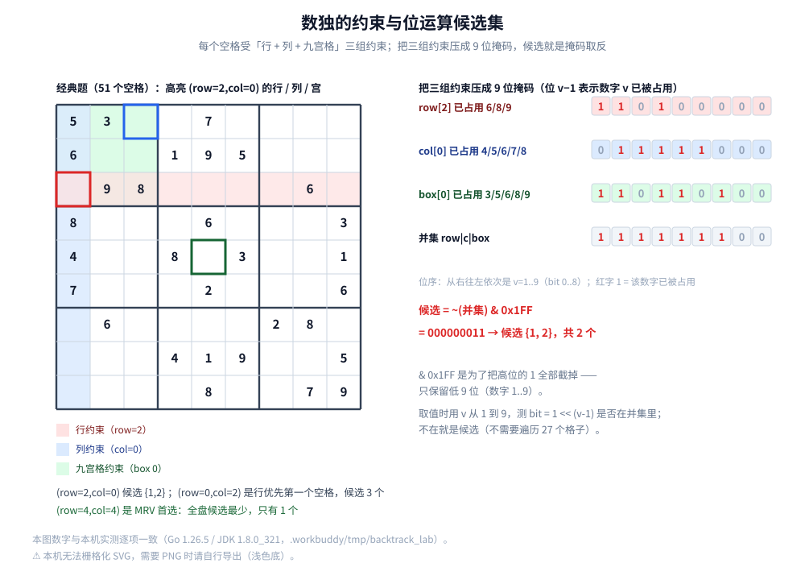

# 数独

> 回溯的第三站：把「选择列表」换成**位掩码候选集**，把「固定顺序」换成 **MRV 启发式**。
> 本篇要回答的是一句话 —— **为什么数独比八皇后难得多**，以及 MRV 到底把搜索规模压掉了多少。
>
> ⭐ 本篇是「回溯」三篇的**第三篇**。回溯三要素与「做选择 → 递归 → 撤销选择」的骨架**只在** [全排列.md](全排列.md) 第 2.1 节讲透；
> 「把二维冲突投影成一维集合」的技巧在 [八皇后.md](八皇后.md) 第二节。本篇不重复它们，只讲**新东西**：
> 位运算候选集、MRV 启发式、以及「约束是延迟生效」带来的量级差异。
>
> 内容整理自个人学习笔记，素材见 [../../../素材清单.md](../../../素材清单.md)。`O(n!)` 与递归复杂度口径见 [复杂度分析.md](../基础算法/复杂度分析.md)；
> 位运算表示集合的一般做法见 [位图与布隆过滤器.md](../../数据结构/高级数据结构/位图与布隆过滤器.md)。
>
> 📎 本篇所有输出均为本机实跑逐字抄录：**Go 1.26.5（windows/amd64）** 与 **JDK 1.8.0_321** 各实现一份，两版输出**逐行对齐**
> （`diff` 之后只剩耗时行）。

---

## 一、数独比八皇后难在哪？

**本节要点**：两者的**代码形状几乎一样**（回溯 + 约束检查），但搜索规模差了好几个数量级。差别不在棋盘大小，而在**约束什么时候生效**。

### 1.1 先把状态空间摆出来

| | 八皇后（n=8） | 数独（9×9） |
|---|---|---|
| 决策层数 | 8 行 | 81 个空格（经典题 51 个空格） |
| 每层的取值 | 8 列 | 9 个数字 |
| 不剪枝的搜索空间 | `8^8 = 1.7×10⁷` | `9^81 ≈ 2×10⁷⁷` |
| 加约束后的实测节点数 | **2057**（见 [八皇后.md](八皇后.md) 第 3.2 节） | 经典题 **4209**；17 提示难题 **26590294** |

⭐ 单看「剪枝后」，八皇后的 2057 与经典数独的 4209 是**同一量级**。所以「数独更难」并不是一句笼统的话 ——
**难点在于：数独的搜索规模对题目高度敏感**。同一份代码，换个题目就从 4 千个节点跳到 2600 万个节点。

### 1.2 关键差别：八皇后的约束是「即时」的，数独的约束是「延迟」的

| | 八皇后 | 数独 |
|---|---|---|
| 放下一个决策后 | 冲突**立刻**可见（列 / 对角马上顶格） | 可能**几个到几十个格子之后**才矛盾 |
| 剪枝发生在 | 浅层（第 2、3 行就大量砍掉） | 常常在深层（走了很长的死胡同才发现） |
| 因此需要 | 三个集合就够（[八皇后.md](八皇后.md) 第二节） | 更聪明的**顺序**（本篇第四节） |

⭐ 一句话：**八皇后错一步立刻知道错；数独错一步要很久以后才知道错。**
「很久以后才知道错」= 搜索树上有大量「前缀看起来没问题」的分支 = 节点数爆炸。

⚠️ 这也解释了 4.3 节那个反直觉的数字：17 提示难题的**空格更多（64 个）、提示更少**，却被设计成「行优先顺序下要走 2659 万个节点」。
数独题目的难度**不取决于空格数，而取决于约束能传播多深**。

---

## 二、最直白的解法长什么样？

**本节要点**：先用最笨的顺序（行优先、数字 1..9）把算法跑通，拿到基准节点数。后面两节都是在这个基准上做优化。

### 2.1 三组约束

`(row, col)` 放数字 `v` 合法，当且仅当三组约束都不冲突：

| 约束 | 检查 |
|---|---|
| 行 | 第 `row` 行里没有 `v` |
| 列 | 第 `col` 列里没有 `v` |
| 九宫格 | `(row, col)` 所在的 3×3 宫里没有 `v` |

⭐ 这里有一处**与八皇后不同的地方**：八皇后的三组冲突是「行内只有一个皇后」，所以行不用查；
数独的行、列、宫**三组都要查**，而且第三组（九宫格）的边界要单独算：

```go
br, bc := row/3*3, col/3*3 // 九宫格左上角
for i := 0; i < 3; i++ {
	for j := 0; j < 3; j++ {
		if b[(br+i)*9+bc+j] == v {
			return false
		}
	}
}
```

### 2.2 结束条件与「找第一个空格」

```go
// 行优先找第一个空格；找不到就说明填满了
idx := -1
for i := 0; i < 81; i++ {
	if b[i] == 0 {
		idx = i
		break
	}
}
if idx < 0 {
	return true // ⭐ 结束条件：没有空格了
}
```

⭐ 注意这里「结束条件」换了个形态：全排列是「路径长度 == n」，八皇后是「row == n」，
数独是「**找不到空格**」。三者的角色完全一样（见 [全排列.md](全排列.md) 第 1.2 节），只是表达方式不同。

### 2.3 基准实测

```text
[3.1] 经典题（空格 51 个）
  无 MRV（行优先逐值试）：解出=true 搜索节点=4209
  带 MRV（最少剩余值）  ：解出=true 搜索节点=52
  节点减少倍数 = 80.9 倍 ；两版解一致 = true
```

⭐ 这个 `4209` 就是后面的**基准线**：一切优化都拿它比。
（同一份实测 [3.1] 随后还打印了解出的盘面，见 4.4 节。）

---

## 三、怎么用位运算表示候选集？

**本节要点**：把「这一行 / 这一列 / 这一宫已经用了哪些数字」压成三个 9 位整数，候选集合就变成一次 `~` 与 `&` 运算。**它省的是常数，不是节点数** —— 这一点必须说清。

### 3.1 三个掩码

为每一行、每一列、每一个宫各维护一个 9 位整数：**第 `v−1` 位为 1 表示数字 `v` 已经被占用**。

```go
rows[9]  // rows[r] 的第 v-1 位 = 1 表示第 r 行已出现数字 v
cols[9]  // cols[c] 同上
boxes[9] // boxes[r/3*3 + c/3] 同上，按九宫格编号
```

初始化（把题目里给定的数字读进掩码）：

```go
func sdkMask(b *board) (rows, cols, boxes [9]int) {
	for i := 0; i < 81; i++ {
		if b[i] != 0 {
			bit := 1 << uint(b[i]-1) // ⭐ 数字 v 对应第 v-1 位
			rows[i/9] |= bit
			cols[i%9] |= bit
			boxes[(i/9)/3*3+(i%9)/3] |= bit
		}
	}
	return
}
```

### 3.2 候选 = `~(row | col | box) & 0x1FF`

想把三组约束合成「这个格子不能放什么」，只要**或**起来取反；⚠️ `& 0x1FF` 不能省 ——
整数取反后高位全是 1，不截掉低 9 位以外的话，候选里会凭空多出一堆「不存在的数字」。



```go
mask := rows[r] | cols[c] | boxes[r/3*3+c/3] // 三组约束的并集
cand := ^mask & 0x1FF                        // ⭐ 候选集合：低 9 位取反
count := bitCount(cand)                      // 候选个数
```

```java
int mask = rows[r] | cols[c] | boxes[r / 3 * 3 + c / 3]; // 三组约束的并集
int cand = ~mask & 0x1FF;                                // ⭐ 候选集合
int count = Integer.bitCount(cand);                      // 候选个数
```

取值时也不需要遍历 27 个格子，直接数位：

```go
for v := 1; v <= 9; v++ {
	bit := 1 << uint(v-1)
	if mask&bit != 0 {
		continue // 这个数字已被占用
	}
	// …做选择，并把 bit 或进三个掩码；撤销时用 &^= 清掉
}
```

### 3.3 实测演示

```text
[3.2] 位运算候选集：某题的初始行列宫掩码
  row[0]=001010100  col[0]=011111000  box[0]=110110100
  格(row=2,col=0)：row|c|box 的并集 = 111111100（位 v-1 表示数字 v 已被占用）
  候选 = ~(并集) & 0x1FF = 000000011 → 候选个数 2
  行优先的第一个空格 = (row=0,col=2)，候选 3 个（无 MRV 就从此开始）
  MRV 的首选 = (row=4,col=4)，候选最少（1 个）；全盘候选 1 个的格子共 4 个
```

⭐ 逐行读第 3、4 行：并集是 `111111100`，取反并截到 9 位后是 `000000011`。
⚠️ 因为掩码是**从右往左**对应 `v = 1..9` 的（第 `v−1` 位），所以 `000000011` 表示
**「只有数字 1 和数字 2 还能放」**，候选个数 2 —— 与手算 `(row=2, col=0)` 得到 `{1, 2}` 一致。

### 3.4 ⚠️ 位运算不改变节点数

位运算把「判断一个值合不合法」从「遍历 27 个格子」压成「查一个位」。**搜索树的形状分毫未变**，
所以节点数一个都不会少。这一点和 [八皇后.md](八皇后.md) 第 2.4 节的「三集合 vs 逐行扫描」是同一个性质：

| 优化手段 | 改变什么 | 改变节点数吗 |
|---|---|---|
| 三个集合 / 位掩码 | 每个节点的**常数** | ❌ 不变 |
| **MRV 启发式**（第四节） | 节点的**探索顺序** | ✅ 大幅改变 |

⭐ **把两者混为一谈，是这类优化里最常见的糊涂账。**

---

## 四、MRV 启发式凭什么有效？

**本节要点**：不动算法结构、只改「下一步选哪个格子」，就能把难题的节点数从 2659 万压到 6037。这是本篇最值钱的一节。

### 4.1 为什么有效

基准版的行优先顺序有个坏习惯：**它总是从棋盘左上角开始，哪怕那个格子的候选有 5、6 个。**
选一个「可能性多」的格子，等于押一个把握很小的注 —— 押错了要走很远才发现。

MRV（**M**inimum **R**emaining **V**alues，最少剩余值）把规则倒过来：

> **每一步都挑「候选最少的空格」来填。** 候选只有 1 个的格子直接填（这也叫「唯一候选」，是数独里最基础的推理）。

⭐ 直觉：**候选最少的格子，是当前信息最多的格子。** 先在那里做决定，一旦错，立刻在下一次 MRV 里暴露；
反过来，先在被约束最松的格子上试探，错误会藏很久。

### 4.2 实现：只改「找哪个空格」这一处

```go
best, bestCnt := -1, 10
for i := 0; i < 81; i++ {
	if b[i] != 0 {
		continue
	}
	r, c := i/9, i%9
	cnt := 9 - bitCount(rows[r]|cols[c]|boxes[r/3*3+c/3]) // ⭐ 候选个数
	if cnt < bestCnt {
		bestCnt, best = cnt, i
		if cnt == 1 {
			break // 已经是理论最小值，不用再找
		}
	}
}
if best < 0 {
	return true // 没有空格 → 结束条件
}
```

⚠️ **平局怎么处理要定死**：候选个数相同时取「下标最小的那个」（代码里 `cnt < bestCnt` 用的是严格小于，
天然保留了第一次遇到的）。否则两版实现的搜索会分叉，输出也就无法逐行对齐 ——
这和 [霍夫曼编码.md](../贪心/霍夫曼编码.md) 第 5.3 节「同频合并要约定 tiebreak」是同一类问题。

### 4.3 实测对照

```text
[3.3] 17 提示难题（空格 64 个）
  无 MRV（行优先逐值试）：解出=true 搜索节点=26590294
  带 MRV（最少剩余值）  ：解出=true 搜索节点=6037
  节点减少倍数 = 4404.6 倍 ；两版解一致 = true
```

| 题目 | 空格数 | 无 MRV 节点 | 带 MRV 节点 | 减少倍数 |
|---|---|---|---|---|
| 经典题 | 51 | **4209** | **52** | **80.9 倍** |
| 17 提示难题 | 64 | **26590294** | **6037** | **4404.6 倍** |

⭐ 两行对照很说明问题：

1. **同一份代码，换个题目差 6300 倍**（4209 → 26590294）—— 「数独很难」这句话只有在特定题目上才成立（1.2 节）；
2. **MRV 在越难的题上收益越大**（80.9 倍 → 4404.6 倍）。因为难题之所以难，正是**坏顺序**导致的；
   MRV 修的恰好就是这个。

### 4.4 解出来的盘面（正确性自检）

下面是实测 [3.1] 的末尾部分（与 2.3 节引的是同一份输出）：

```text
  解出的盘面：
  5 3 4 | 6 7 8 | 9 1 2
  6 7 2 | 1 9 5 | 3 4 8
  1 9 8 | 3 4 2 | 5 6 7
  ------+-------+------
  8 5 9 | 7 6 1 | 4 2 3
  4 2 6 | 8 5 3 | 7 9 1
  7 1 3 | 9 2 4 | 8 5 6
  ------+-------+------
  9 6 1 | 5 3 7 | 2 8 4
  2 8 7 | 4 1 9 | 6 3 5
  3 4 5 | 2 8 6 | 1 7 9
```

⚠️ **光看「解出=true」不够**：一个写错的求解器通常也能「解出」点什么。
所以本机的两版实现都额外做了两件事：**① 比对无 MRV 与带 MRV 的解完全一致**（`两版解一致 = true`）；
**② 把解打印出来人工核对**（上面这份与题目的已知答案一致）。⭐ 这是与 [八皇后.md](八皇后.md) 第 4.3 节「用 92 做断言」对应的做法。

### 4.5 代价与边界

| 手段 | 每次决策的额外代价 | 收益 |
|---|---|---|
| MRV | 要扫一遍全部空格、算每个的候选个数：`O(81)` | 节点数大幅下降（难题 4404 倍） |
| ⚠️ 更狠的启发式（度启发式、前瞻 look-ahead） | `O(81²)` 起步 | 节点数还能再降，但**每个节点的常数会涨回来** |

⭐ **判据**：**当「扫一遍棋盘」的代价远小于「走错一条深分支」的代价时，MRV 稳赚。**
数独正是这种情况 —— 一个节点 `O(81)`，省下的却是上千万个节点。
⚠️ 反过来说，如果问题很浅、或候选本来就只有两三个，扫一遍的开销反而可能盖过收益。

---

## 五、这些优化到底快了多少？

**本节要点**：把四条耗时摆在一起 —— 注意「更聪明的启发式」在简单题上反而更慢，以及最后一行为什么不能做多轮平均。

```text
[3.4] 耗时对照（5 组累加，单位 ms/次）
  经典题 无 MRV      : 1.4183 ~ 2.9854 ms/次  (300 次/组 × 5 组)
  经典题 带 MRV      : 0.0093 ~ 0.0146 ms/次  (20000 次/组 × 5 组)
  难题 带 MRV       : 2.7212 ~ 3.8143 ms/次  (100 次/组 × 5 组)
  难题 无 MRV       : 单次 9.800 s（单次已远超 100ms，不做多轮平均）
```

⚠️ **时序数字只断言量级与单调趋势**。最后一行只跑了一次：它本身已经远超 100 ms，且**波动极大**
（本机多轮实测落在 `3.6 ~ 9.8 s`），所以任何「精确到毫秒」的说法都不成立。⭐ 稳定的证据是**节点数**（26590294），
它与机器负载无关。

⭐ 另一个值得注意的现象：**在安静的机器上，「难题 带 MRV」并不比「经典题 无 MRV」快。**
本机多轮实测的典型值是：经典题无 MRV `0.6 ~ 1.2 ms`、难题带 MRV `1.4 ~ 2.7 ms`。
因为 MRV 每步都要扫 81 个格子，而这个「更慢的启发式」之所以值得用，
是因为它把**同一道难题**从 `3.6 ~ 9.8 s` 压到了几毫秒（判据见 4.5 节）。

---

## 使用：约束传播 + 启发式在工程里以什么形式出现

**第一层：CSP 求解器的标准配方**。数独是约束满足问题的经典试验场，而真实的排课、排班、装箱、
芯片布线求解器用的正是同一套配方：**回溯 + 约束传播 + 变量排序启发式**。
⭐ 本篇把配方拆成了三层递进的实验（约束检查 → 位掩码 → MRV），这三层在工程里是同时存在的。

**第二层：依赖求解本质上是数独的「大号版本」**。`pip` / `apt` / `cargo` 要选一组版本让所有依赖约束同时成立 ——
这就是 CSP：变量是包，域是候选版本，约束是「A 要求 B ≥ 2 且 C < 3」。
⚠️ 真实的版本求解器（如 `pubgrub` 一类算法）不会用朴素的 MRV，因为规模大到必须做**冲突驱动的学习**：
一次失败要总结出一条新约束，避免重复踩同一个坑 —— 那正是「约束传播」的加强版。
反过来说，**没有传播的朴素回溯在依赖树上就是本篇那个 7 秒的难题**。

**第三层：用位表示集合（bitmask）**。本篇的 `rows/cols/boxes` 就是三个「整数当集合」的例子：
`|` 是并集、`&^=` 是删元素、`bitCount` 是求基数。⭐ 同一手法在工程里很常见：权限位（一个整数表示一组权限）、
feature 开关、以及布隆过滤器的位数组 —— 共同点是**用一次机器字运算替掉一次循环**。
相关：[位图与布隆过滤器.md](../../数据结构/高级数据结构/位图与布隆过滤器.md)。

---

## 延伸追问

- **MRV 是缩写吗？** → 是，**M**inimum **R**emaining **V**alues（最少剩余值），也叫「最受约束变量优先」。它的完整写法是「先选候选最少的**变量**、再按候选值顺序试」。
- **MRV 会改变最终解吗？** → 不会。它只改**搜索顺序**，不改变「什么算合法」。本机两版实测解完全一致（`两版解一致 = true`）。
- **位运算候选集能减少节点数吗？** → 不能。它只把「枚举候选 + 判冲突」从遍历 27 个格子压成查一位（常数优化）。节点数由**搜索顺序**决定，与 3.4 节、[八皇后.md](八皇后.md) 第 2.4 节同一个道理。
- **两个空格的候选个数一样时，先填哪个？** → 必须**约定一个确定的规则**（本机实现取下标最小的）。⚠️ 不约定的话，两版实现会走出不同的搜索树，输出无法逐行对齐 —— 与 [霍夫曼编码.md](../贪心/霍夫曼编码.md) 第 5.3 节「同频 tiebreak」同一类问题。
- **为什么 17 提示难题要 2659 万个节点？** → 行优先顺序常常先挑到「候选很多」的格子，那些分支走到很深才暴露矛盾。换个题目同一份代码只要 4209 个节点（4.3 节），说明**难点不在代码，在顺序**。
- **MRV 会不会更慢？** → 有这种可能。每次决策要扫 81 个格子算候选数（`O(81)`）。本机实测：带 MRV 的难题（约 3 ms）确实比无 MRV 的经典题（约 0.8 ms）慢 —— 但它把同一个难题从 7 秒压到了 3 毫秒。**判据是「扫一遍棋盘」与「走错一条深分支」哪个更贵**（4.5 节）。
- **还能更快吗？** → 能，方向是**加强约束传播**：不是等放了数字才更新掩码，而是每步都做「唯一候选格直接填」（naked single / hidden single）。
  本机实测初始盘面就有 **4 个候选为 1 的格子**（3.3 节输出末行），先填掉它们等于免费剪枝。⚠️ 但要小心：传播本身有成本，且实现复杂度会明显上升。
- **数独只有一个解吗？** → 本机求解器找到一个解就返回。若要判断唯一性，必须**继续搜索**，直到找到第二个解（不唯一）或确认没有第二个解 —— 那是另一件事，不能靠「解出=true」下结论。
- **怎么保证求解器没写错？** → 三道：① 两版实现（无 MRV / 带 MRV）的解必须完全一致；② 把解打印出来核对；③ 用「候选为 1 的格子数」这类可手算的小事实做交叉验证（3.3 节）。

---

## 关联

- [全排列.md](全排列.md) — **「回溯」三篇的第一篇**：回溯三要素、模板骨架、「撤销选择」为什么不能省（本篇只引用、不重复）
- [八皇后.md](八皇后.md) — 第二篇：三个冲突集合、对角线索引、「三档剪枝」的节点数对照
- [DFS深度优先遍历.md](../图论算法/图的遍历/DFS深度优先遍历.md) — 回溯 = DFS + 撤销选择；其第 2.2 节给出两者分界
- [位图与布隆过滤器.md](../../数据结构/高级数据结构/位图与布隆过滤器.md) — 「用位表示集合」的一般做法与代价
- [复杂度分析.md](../基础算法/复杂度分析.md) — 指数级搜索的复杂度口径与「常量优化不改变量级」
- [线性结构/栈与队列.md](../../数据结构/线性结构/栈与队列.md) — 递归栈与数组/集合的表示
- [../贪心/霍夫曼编码.md](../贪心/霍夫曼编码.md) — 第 5.3 节的「同频 tiebreak」：与本篇 MRV 平局规则的确定性要求同源
> 反向引用（本篇被下列文档引到）：[位运算.md](../基础算法/位运算.md)、[递归与分治.md](../基础算法/递归与分治.md)
