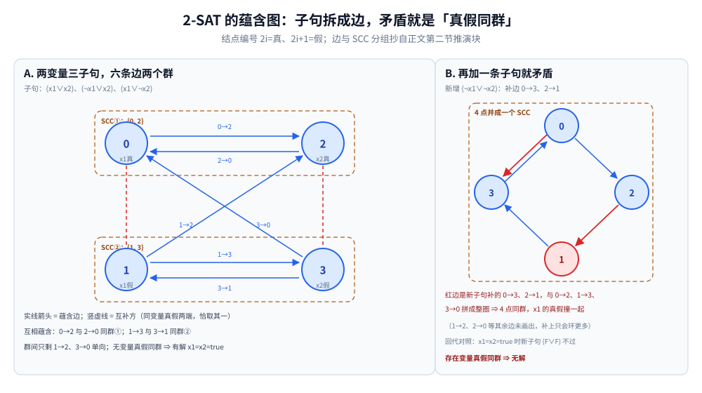
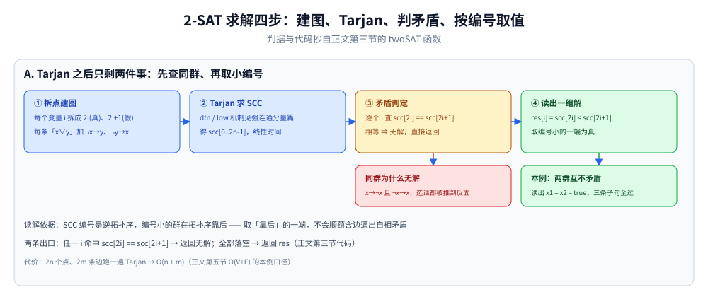

# 2-SAT

> 每个变量只有两种取值，约束形如「x 或 y」—— 用强连通分量判断是否存在
> 满足所有约束的赋值。
>
> ⭐ 边界先说清：本篇讲 2-SAT 问题（每个子句最多 2 个字面量）。
> 一般 SAT 是 NP 完全问题；强连通分量见 [强连通分量.md](强连通分量.md)；
> 二分图判定见 [二分图判定.md](二分图判定.md)。
>
> 内容整理自个人学习笔记，素材见 [素材清单](../../../素材清单.md)。复杂度口径见 [复杂度分析.md](../基础算法/复杂度分析.md)。

---

## 一、2-SAT 的约束长什么样？为什么能翻译成「蕴含」？

**本节要点**：全部难点都藏在「`x 或 y` ⇔ 两条蕴含式」这一步翻译里 —— 译成图之后问题就只剩 SCC 判定。

- 有 n 个布尔变量，每个变量取 true / false
- 有 m 个约束，每个形如「x 或 y」（2-SAT）
- 问是否存在满足所有约束的赋值

**关键**：约束「x 或 y」等价于两个蕴含式：

- `¬x → y`
- `¬y → x`

⭐ 直觉：「x 或 y」为真 = 「x 不成立时 y 必须成立」**且**「y 不成立时 x 必须成立」。一条子句拆成两条边，信息一点不丢。

---

## 二、怎么把约束画成有向图？

**本节要点**：每个变量拆成「真 / 假」两个点，每条子句加两条边；判定问题变成「有没有哪个点的真假两端互相可达」。

每个变量拆成两个点：

- `2i` 表示「x_i 为真」
- `2i+1` 表示「x_i 为假」

对每个约束「x 或 y」：

- 加边 `¬x → y`
- 加边 `¬y → x`

**例**：「x 为真 或 y 为真」→ 加边 `¬x → y` 和 `¬y → x`。

一个能从头推到尾的小例子（两条变量的三条子句，边的编号按上面的拆点规则）：

```text
子句：(x1 ∨ x2)、(¬x1 ∨ x2)、(x1 ∨ ¬x2)
拆点：x1 → 节点 0(真)/1(假)；x2 → 节点 2(真)/3(假)

六条蕴含边：
  来自 (x1 ∨ x2)：   1→2 (¬x1→x2)     3→0 (¬x2→x1)
  来自 (¬x1 ∨ x2)：  0→2 (x1→x2)      3→1 (¬x2→¬x1)
  来自 (x1 ∨ ¬x2)：  1→3 (¬x1→¬x2)    2→0 (x2→x1)

SCC 分组：  0 ⇄ 2 （x1真 与 x2真 互相蕴含）→ 一个 SCC
            1 ⇄ 3 （x1假 与 x2假 互相蕴含）→ 另一个 SCC
两群之间只有 1→2、3→0 单向边（后一群指向前一群）。

没有任何变量的真假两点落在同一个 SCC ⇒ 有解。
取 x1 = x2 = true 回代：(T∨T)✓ (F∨T)✓ (T∨F)✓ 三条子句全过。
```



这幅图把上面的推演块画成了蕴含图：0、1 是 x1 的真假两端，2、3 是 x2 的，实线箭头是六条蕴含边、竖虚线是「同变量真假恰取其一」的互补方。0→2 与 2→0、1→3 与 3→1 互相蕴含，各自并成一个群（SCC① {0, 2}、SCC② {1, 3}），群之间只剩 1→2、3→0 单向边——没有任何变量的真假两端同群，所以有解。右半是反例对照：再补一条子句 (¬x1 ∨ ¬x2) 会多出 0→3、2→1 两条边，与 0→2、1→3、3→0 拼成一个 4 点大环，x1 的真假被关进同一个 SCC——这就是「同群即矛盾」的直观形态。

---

## 三、为什么「同一 SCC 里有矛盾」就无解？解怎么读出来？

**本节要点**：判定 = 跑 Tarjan 查「x 真 x 假同 SCC」；求解 = 按 SCC 编号（逆拓扑序）取小的一端。

**判定**：用 Tarjan 求 SCC。

- 若存在变量 i，`2i` 与 `2i+1` 在同一个 SCC → **无解**
- 否则有解

**求一组解**：

- 对每个变量，取 SCC 编号较小的那个点（Tarjan 的 SCC 编号是逆拓扑序）
- 即 `x_i = (scc[2i] < scc[2i+1])`

```go
func twoSAT(n int) ([]bool, bool) {
	// 建图、跑 Tarjan 得到 scc[]
	for i := 0; i < n; i++ {
		if scc[2*i] == scc[2*i+1] {
			return nil, false
		}
	}
	res := make([]bool, n)
	for i := 0; i < n; i++ {
		res[i] = scc[2*i] < scc[2*i+1]
	}
	return res, true
}
```

⚠️ Tarjan 的骨架、dfn/low 与栈的机制写在 [强连通分量.md](强连通分量.md) 第二节，本篇不重复；这里只新增「建图规则 + 读解规则」两件零件。



流程四步对应正文代码：① 每个变量拆成 2i(真)、2i+1(假) 两点，每条「x∨y」加 ¬x→y、¬y→x 两条边；② 跑 Tarjan 得 scc[]；③ 逐个 i 查 scc[2i] == scc[2i+1]，命中即无解——因为此时 x→¬x 且 ¬x→x，选谁都被推到反面；④ 全部落空则 `res[i] = scc[2i] < scc[2i+1]`，取编号小的一端为真。读解依据是 SCC 编号为逆拓扑序：编号小的群在拓扑序靠后，取它不会顺蕴含边逼出自相矛盾；本例两群互不矛盾，读出 x1 = x2 = true，三条子句全过。

---

## 四、什么问题能套 2-SAT？

**本节要点**：见到「每个对象二选一 + 一批两两之间的硬性条件」，先试着往 2-SAT 上靠。

| 场景 | 说明 |
|---|---|
| 布尔方程求解 | 每个约束是「x 或 y」 |
| 排斥关系 | 「a 与 b 不能同时选」= 「¬a 或 ¬b」 |
| 选择问题 | 「a 与 b 至少选一个」= 「a 或 b」 |
| 染色问题 | 每个点选两种颜色之一 |
| 任务分配 | 每个任务选两个时间槽之一 |

---

## 五、代价多大？

**本节要点**：图有 2n 个点、每条子句贡献 2 条边，剩下的账就是 Tarjan 的账。

| 维度 | 值 |
|---|---|
| 时间 | O(V + E)（Tarjan 线性） |
| 空间 | O(V + E) |

---

## 延伸追问

- **为什么 2-SAT 是多项式时间可解的？** → 因为「x 或 y」可以转化为蕴含关系，用 SCC 判断矛盾。
- **3-SAT 为什么是 NP 完全？** → 每个子句 3 个字面量时无法用蕴含关系直接建模，导致指数级搜索。
- **SCC 编号为什么能确定赋值？** → Tarjan 的 SCC 编号是逆拓扑序，编号小的在拓扑序中靠后，取「靠后」的赋值能满足蕴含关系。
- **怎么求所有解？** → 2-SAT 的所有解是指数级的，只能用枚举。
- **带权 2-SAT 怎么求？** → 加权 2-SAT 是 NP 困难的，需要退化成「最大可满足性」。
- **只有一个字面量的子句（强制 x 为真）怎么建边？** → 把「x 或 x」套同一条翻译规则，两条蕴含式重合为一条 `¬x → x`；x 的假端能推出真端，读解时真端必然编号更小被取走，等于强制 x = true。
- **「a 与 b 恰好选一个」怎么表达？** → 拆成两条子句的合取：至少一个 `(a ∨ b)` 加不能同选 `(¬a ∨ ¬b)`，各自照常拆成两条蕴含边。

---

## 关联

- [强连通分量.md](强连通分量.md) — 判定引擎 Tarjan 的出处
- [拓扑排序.md](拓扑排序.md) — 「SCC 编号是逆拓扑序」这条性质的基础
- [二分图判定.md](二分图判定.md) — 另一种图论建模
- [README.md](README.md) — 图论导读
