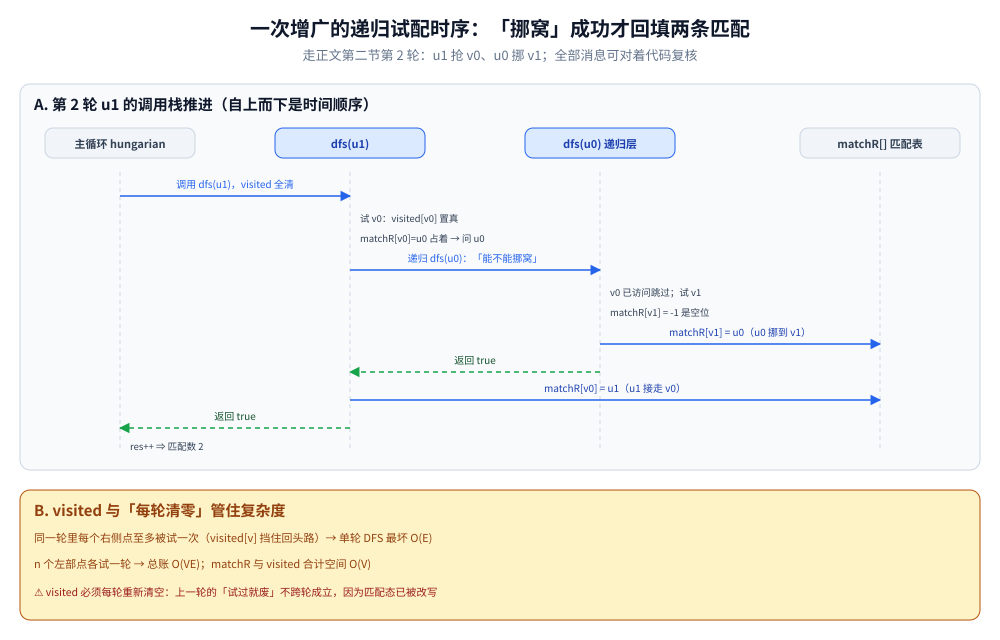
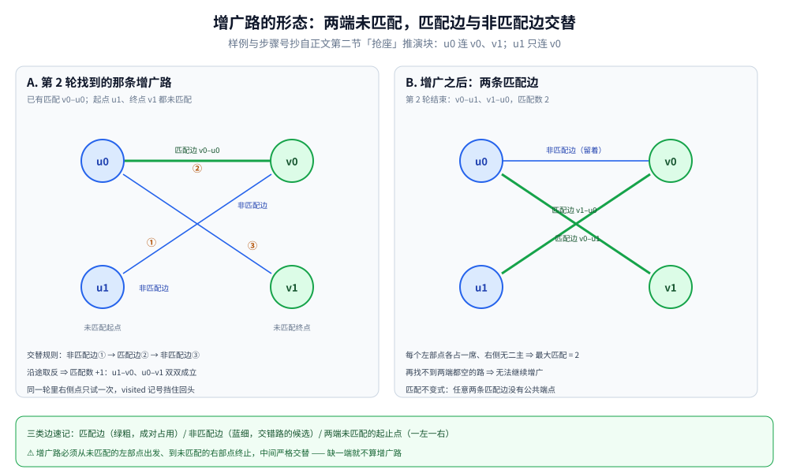

# 二分图匹配

> 在二分图中找「最大匹配」：每个点最多匹配一次，求能匹配的对数最大值。
> 匈牙利算法是 O(VE) 的经典解法。
>
> ⭐ 边界先说清：本篇讲无权二分图的最大匹配。
> 二分图的判定见 [二分图判定.md](二分图判定.md)；
> 带权匹配（KM 算法）属于进阶；
> 网络流建模见 [网络流.md](网络流.md)。
>
> 内容整理自个人学习笔记，素材见 [素材清单](../../../素材清单.md)。复杂度口径见 [复杂度分析.md](../基础算法/复杂度分析.md)。

---

## 一、匹配、最大匹配、完美匹配分别指什么？

**本节要点**：匹配是「一个两两不相撞的边集」，后面三个词都是在这之上加不同的目标或条件。

- **匹配**：一个边的集合，任意两条边没有公共端点
- **最大匹配**：边数最多的匹配
- **完美匹配**：所有点都被匹配
- **最大权匹配**：边权和最大的匹配

---

## 二、匈牙利算法怎么靠「增广路」把匹配数一点点加上去的？

**本节要点**：给每个左部点找一条「未匹配点起、未匹配点止、匹配边与非匹配边交替」的路，找到就沿途取反、匹配数 +1；找不到就换下一个点。

**核心思想**：为每个左部点寻找增广路（augmenting path）。

- 增广路：从一个未匹配点出发，交替经过非匹配边、匹配边、非匹配边……到达另一个未匹配点
- 找到增广路后，把路径上的匹配状态取反 → 匹配数 +1

```go
func hungarian(g [][]int, n, m int) int {
	matchR := make([]int, m) // 右部点匹配的左部点，-1 表示未匹配
	for i := range matchR {
		matchR[i] = -1
	}
	res := 0
	for u := 0; u < n; u++ {
		visited := make([]bool, m)
		if dfs(u, g, matchR, visited) {
			res++
		}
	}
	return res
}

func dfs(u int, g [][]int, matchR []int, visited []bool) bool {
	for _, v := range g[u] {
		if visited[v] {
			continue
		}
		visited[v] = true
		if matchR[v] == -1 || dfs(matchR[v], g, matchR, visited) {
			matchR[v] = u
			return true
		}
	}
	return false
}
```

- 时间 O(VE)
- 空间 O(V)



时序图走的就是下面推演块的第 2 轮：主循环调用 `dfs(u1)` 前先把 visited 全清；u1 试 v0 发现 `matchR[v0]=u0` 占着，于是递归 `dfs(u0)` 问它「能不能挪窝」；u0 跳过已访问的 v0、发现 v1 是空位，**先**回填 `matchR[v1] = u0` 再返回 true；u1 收到 true 才回填 `matchR[v0] = u1`——两条赋值都发生在递归成功之后，任何一层失败都不会留下改了一半的匹配。复杂度账也在这张图里：同一轮每个右侧点至多被试一次（visited 挡回头路），单轮 DFS 最坏 O(E)，n 个左部点各一轮即 O(VE)；⚠️ visited 必须每轮重新清空，因为匹配态已被改写，上一轮的「试过就废」不跨轮成立。

「抢座」全过程推演一遍（左部 u0 连着 v0、v1，u1 只连 v0，数字可手推复核）：

```text
初始：无任何匹配

第 1 轮  u0 找对象：v0 空 → 直接成
        匹配态：v0–u0                    匹配数 1

第 2 轮  u1 找对象：v0 被 u0 占 → 递归问 u0「能不能挪窝」
        u0 的下一个候选 v1 空 → u0 挪到 v1，u1 接走 v0
        增广路：u1 ─(非匹配边)→ v0 ─(匹配边)→ u0 ─(非匹配边)→ v1，到未匹配点为止，沿途取反
        匹配态：v0–u1, v1–u0             匹配数 2

结束：每个左部点各占一席，右侧也没有点被占两次 ⇒ 最大匹配 = 2
```



左半是推演块里那条增广路的形状：绿粗边是当时的唯一匹配 v0–u0，起点 u1、终点 v1 都还未匹配，①→③ 沿「非匹配边 → 匹配边 → 非匹配边」严格交替；沿途取反后就得到右半的形态——u1–v0、u0–v1 两条绿粗匹配边，每个左部点各占一席、右侧无二主。⚠️ 判读要点：增广路必须**两端都未匹配**，只连到一半的交替链不构成增广；每增广一次匹配数恰好 +1，这也解释了为什么「找不到增广路」时就可以收工。

---

## 三、König 定理为什么能把「覆盖」和「独立集」都折给匹配？

**本节要点**：在二分图上，最小点覆盖与最大独立集都能化成最大匹配来算，不用另写算法。

| 定理 | 说明 |
|---|---|
| **最大匹配 = 最小点覆盖** | 二分图中 |
| **最大独立集 = n − 最大匹配** | n 为总点数 |

⭐ 这两个定理把「匹配」与「覆盖」「独立集」问题互相转化。一行结论：二分图上这三个量都只需求一次最大匹配；且最小点覆盖与最大独立集恰互为补集（两者点数之和 = n），知道一个立刻得到另一个。

---

## 四、图大了嫌 O(VE) 慢怎么办？

**本节要点**：Hopcroft-Karp 把「一次给一个人找对象」改成「一次给一层的单身一起找」。

- 用 BFS 分层 + DFS 多路增广
- 时间 O(E√V)，稀疏图更快
- 适合大规模二分图

⚠️ 「BFS 分层 + DFS 多路增广」这套骨架与 Dinic 完全同形：分层队列的模板见 [BFS广度优先遍历.md](图的遍历/BFS广度优先遍历.md) 第三节，多路增广与当前弧见 [网络流.md](网络流.md) 第三节，本篇不重复机制、只给结论。

---

## 五、什么问题能套匹配模型？

**本节要点**：只要是「两类对象一一配对、各不重用」，就是匹配。

| 场景 | 说明 |
|---|---|
| 任务分配 | 人配任务、司机配订单 |
| 婚配问题 | 男女配对 |
| 棋盘覆盖 | 多米诺骨牌覆盖棋盘 |
| 最小路径覆盖 | DAG 上最少路径覆盖所有点 |
| 课程安排 | 学生选课与教室分配 |
| 广告投放 | 广告与用户匹配 |

---

## 六、和网络流是什么关系、什么时候用哪个？

**本节要点**：二分图匹配 = 容量全为 1 的最大流；规模决定选型。

- 二分图最大匹配可转化为网络流：源点 → 左部点 → 右部点 → 汇点，容量全为 1
- 用 Dinic 求解，复杂度 O(E√V)

⭐ **判据**：小规模用匈牙利算法更简单；大规模用 Dinic 建模。

---

## 延伸追问

- **匈牙利算法为什么是 O(VE)？** → 每个左部点尝试一次，每次 DFS 最坏 O(E)。
- **增广路的本质？** → 匹配数增加 1 的路径，是匹配问题的核心概念。
- **最大匹配和最大权匹配什么区别？** → 前者只看数量，后者看边权和（KM 算法）。
- **König 定理怎么用？** → 把「最小点覆盖」「最大独立集」转化为最大匹配。
- **二分图匹配能处理带权吗？** → 带权用 KM 算法（O(n³)）；也可转成最小费用流，见 [最小费用最大流.md](最小费用最大流.md)。
- **visited 为什么只标记右侧点、且每轮清空？** → 同一轮里一个右侧点至多值得试一次（第一次试不通，同轮再试走的还是那条死路）；但一轮结束后匹配态已被改写，上一轮的「试过就废」不再成立，所以每轮开头重新清空。
- **为什么「找不到增广路」就能收工？** → Berge 定理：匹配最大 ⇔ 图中不存在增广路。匈牙利算法逐点找增广路，找不动时恰好落在「无增广路」这个终点上，此时匹配必为最大。

---

## 关联

- [二分图判定.md](二分图判定.md) — 二分图基础（先判定才能建匹配模型）
- [网络流.md](网络流.md) — 最大流建模一侧
- [最小费用最大流.md](最小费用最大流.md) — 带权匹配的替代出路
- [BFS广度优先遍历.md](图的遍历/BFS广度优先遍历.md) — HK 分层所用 BFS 的模板出处
- [README.md](README.md) — 图论导读
