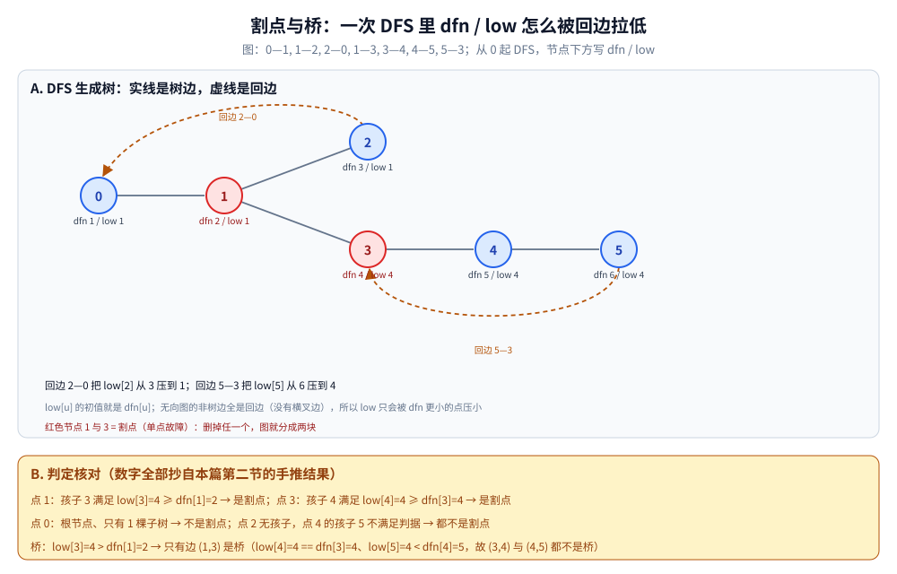
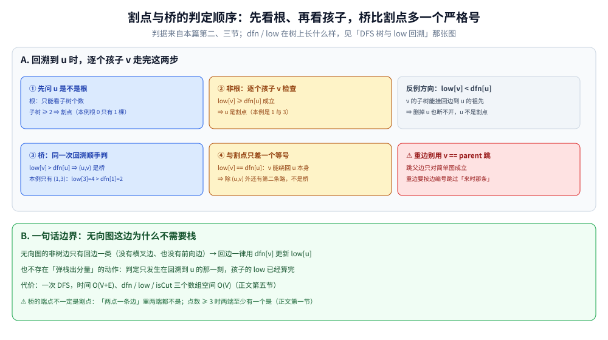

# 割点与桥

> 无向图中「删掉它图就不连通」的顶点（割点）与边（桥）——
> Tarjan 算法一次 DFS 就能求出，是网络可靠性分析的基础。
>
> ⭐ 边界先说清：本篇讲无向图的割点与桥。
> 有向图的强连通分量见 [强连通分量.md](强连通分量.md)；
> 二分图判定见 [二分图判定.md](二分图判定.md)。
>
> 内容整理自个人学习笔记，素材见 [素材清单](../../../素材清单.md)。复杂度口径见 [复杂度分析.md](../基础算法/复杂度分析.md)。

---

## 一、什么是割点？什么是桥？

**本节要点**：同一个「单点故障」思想的两种对象 —— 割点删**顶点**，桥删**边**，判据都是「连通分量数变多」。

| 概念 | 定义 |
|---|---|
| **割点** | 删掉该顶点及其关联边后，图的连通分量数增加 |
| **桥** | 删掉该边后，图的连通分量数增加 |

⭐ **桥的端点一定是割点吗？** 不一定 —— 桥是边、割点是顶点，本来就是两种对象；哪怕只看端点，「两个点一条边」这种最小图里删掉任何一端都不会让**剩下的**图更碎，两端都不是割点。在点数 ≥ 3 的连通分量里，桥的两端至少有一个是割点。

---

## 二、Tarjan 怎么一次 DFS 找出所有割点？

**本节要点**：dfn/low 这对数组与 [强连通分量.md](强连通分量.md) 同源，但这里**不需要栈**；割点判据看「孩子子树能不能绕过我回到祖先」。

维护两个数组：

- `dfn[u]`：时间戳
- `low[u]`：u 及其子树能回溯到的最早时间戳

**割点判定**：

- 若 u 是根节点，且有两个及以上子树 → 割点
- 若 u 不是根，且存在孩子 v 满足 `low[v] >= dfn[u]` → 割点

```go
func tarjan(u, parent int) {
	timer++
	dfn[u], low[u] = timer, timer
	child := 0
	for _, v := range g[u] {
		if v == parent {
			continue
		}
		if dfn[v] == 0 {
			child++
			tarjan(v, u)
			low[u] = min(low[u], low[v])
			if parent != -1 && low[v] >= dfn[u] {
				isCut[u] = true
			}
		} else {
			low[u] = min(low[u], dfn[v])
		}
	}
	if parent == -1 && child >= 2 {
		isCut[u] = true
	}
}
```

拿「两个三角形被一条边串起来」的 6 点图逐步推一遍（边表：0—1, 1—2, 2—0, 1—3, 3—4, 4—5, 5—3，从 0 起 DFS，数字可手推复核）：

```text
DFS 生成树（─ 是树边，虚线是回边）：

        0
        │
        1 ── 2 ┄ ┄ → 回边 2─0 回到 0
        │
        3 ── 4 ── 5 ┄ → 回边 5─3 回到 3

树边：0—1, 1—2, 1—3, 3—4, 4—5；回边：2┄0, 5┄3

点   dfn   low     回溯时的判据检查
0    1     1       根，只有 1 棵子树 → 不是割点
1    2     1       孩子 2：low[2]=1 ≥ dfn[1]=2？ 否（2 借回边绕过 1）
                   孩子 3：low[3]=4 ≥ dfn[1]=2？ 是 → **1 是割点**
2    3     1       （low 被回边 2─0 压到 1）
3    4     4       孩子 4：low[4]=4 ≥ dfn[3]=4？ 是 → **3 是割点**
4    5     4       孩子 5：low[5]=4 ≥ dfn[4]=5？ 否
5    6     4       （low 被回边 5─3 压到 4）

结论：割点 {1, 3}；桥判据 low[3]=4 > dfn[1]=2 → 边 (1,3) 是唯一的桥
```

⭐ 与 [强连通分量.md](强连通分量.md) 的分工：dfn/low 的语义、「回溯时取 min」的机制在那篇第二节，本篇不重讲；**区别**是无向图不需要「还在栈上」这个第三态 —— 回边一律用 `dfn[v]` 更新，也没有弹栈出分量的动作。



这幅图把上面的推演画在生成树上：实线是树边、橙色虚线是回边，每个点下方标 dfn / low —— 回边 2—0 把 `low[2]` 从 3 压到 1，回边 5—3 把 `low[5]` 从 6 压到 4，红色节点 1 与 3 就是割点。下方黄色面板逐点核对判据：点 1 因孩子 3 满足 `low[3]=4 ≥ dfn[1]=2` 当选，点 3 因 `low[4]=4 ≥ dfn[3]=4`（等号也算）当选；根 0 只有 1 棵子树不是割点；桥只有边 (1,3)（`low[3]=4 > dfn[1]=2`），而 (3,4)、(4,5) 都因不满足严格大于不是桥。

---

## 三、桥的判据为什么和割点只差一个等号？

**本节要点**：`low[v] >= dfn[u]` 允许孩子「回到 u 本身」，`low[v] > dfn[u]` 连这条路都不许 —— 因为 (u,v) 这条边本身可能被当作回路的一部分。

**桥判定**：`low[v] > dfn[u]` 时，边 (u, v) 是桥。

```go
// DFS 中从孩子 v 回溯到 u 时追加一条判断：
if low[v] > dfn[u] {
	// 边 (u, v) 是桥
}
```

⚠️ **桥的判定是严格大于**，割点是大于等于。直觉：`low[v] == dfn[u]` 意味着 v 的子树能回到 u（但回不到 u 的祖先）—— 对「u 是不是割点」它照样算脱离，对「(u,v) 是不是桥」它说明子树和 u 之间除了 (u,v) 还有第二条通路（经由 u 本身挂的回边），所以不是桥。



判据按图中顺序走 —— ① 先问 u 是不是根（根只看子树个数，子树 ≥ 2 才是割点，本例根 0 只有 1 棵）；② 非根则逐个孩子 v 检查 `low[v] ≥ dfn[u]`，成立即割点（本例是 1 与 3）；③ 同一次回溯顺手判桥 `low[v] > dfn[u]`，本例只有 (1,3)；④ 两者只差一个等号：`low[v] == dfn[u]` 时 v 能绕回 u 本身，除 (u,v) 外还有第二条路，不是桥。红色框提醒重边场合不能按 `v == parent` 跳父边，绿色面板交代无向图为什么不需要栈、代价 O(V+E)。

---

## 四、找出来能干什么？

**本节要点**：割点与桥就是「单点故障清单」，顺带还能把图剁成双连通块建树。

| 场景 | 说明 |
|---|---|
| 网络可靠性 | 关键节点/链路的识别 |
| 双连通分量 | 点双连通、边双连通 |
| 缩点建树 | 边双连通分量缩点后是一棵树 |
| 电力/交通网络 | 单点故障分析 |
| 社交网络 | 关键人物识别 |

---

## 五、代价多大？

**本节要点**：还是一次 DFS 的账。

| 维度 | 值 |
|---|---|
| 时间 | O(V + E) |
| 空间 | O(V) |

---

## 延伸追问

- **割点和桥的判定条件为什么不同？** → 割点是 `low[v] >= dfn[u]`（v 无法越过 u），桥是 `low[v] > dfn[u]`（v 只能通过 (u,v) 到达 u 的祖先）。
- **根节点的割点判定为什么特殊？** → 根节点没有父节点，只能靠「子树个数 ≥ 2」判断。
- **重边会影响桥的判定吗？** → 会。重边意味着有两条通路，不是桥；用边的编号而不是父节点来判重。
- **割点与点双连通分量的关系？** → 点双连通分量之间由割点连接。
- **割点能带权吗？** → 能，把权值放在点上，缩点后可以形成一棵树做 DP。
- **点双连通分量与边双连通分量有何区别？** → 点双以割点为边界、一个割点可同时属于多个点双；边双以桥为边界、桥不属于任何边双。第四节「缩点建树」指的就是边双：删掉所有桥后剩下的极大连通子图，缩点得到一棵树。

---

## 关联

- [强连通分量.md](强连通分量.md) — dfn/low 的「有向 + 带栈」版本
- [DFS深度优先遍历.md](图的遍历/DFS深度优先遍历.md) — DFS 基础（生成树与四类边在其第三节）
- [拓扑排序.md](拓扑排序.md) — DAG 相关
- [图的表示与存储.md](../../数据结构/图/图的表示与存储.md) — 邻接表表示与重边的存法
- [README.md](README.md) — 图论导读
