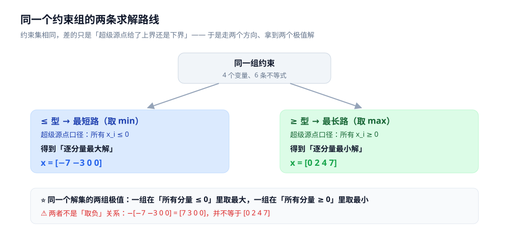

# 差分约束

> 一组形如 `x_j − x_i ≤ w` 的不等式有没有解？解是什么？
> —— 差分约束（system of difference constraints）把这个问题**原样搬到图论**：
> 每条不等式是一条边，跑一次最短路就有答案。
>
> ⭐ 边界先说清：本篇讲**「不等式组 → 图」的建模与求解**。作为底座的两个算法
> （判负环的 Bellman-Ford、非负权的最短路 Dijkstra）见 [Bellman-Ford.md](最短路/Bellman-Ford.md)
> 与 [Dijkstra.md](最短路/Dijkstra.md)，本篇不重复它们的推演；
> 另一条「把约束变成图」的路线（二值变量的布尔约束）见 [2-SAT.md](2-SAT.md)。
>
> 内容整理自个人学习笔记，素材见 [素材清单](../../../素材清单.md)。复杂度口径见 [复杂度分析.md](../基础算法/复杂度分析.md)。
>
> 📎 本篇读数来自**自写的最小实现**，在本机**容器**里实跑逐字抄录：**Go 1.26.8（linux/amd64，`golang:1.26-alpine`）**。
> ⚠️ 实验**只数操作次数与解的值、不依赖计时**；同一程序连跑两遍**逐行相同**。

---

## 一、差分约束在问什么？

**本节要点**：差分约束是**一组只约束「差」的不等式**，问「有没有解」。它属于线性规划的一个特例 ——
但因为约束矩阵每行**只有 `+1` 和 `−1` 两个非零元**，这个特例不需要单纯形，**跑一次最短路就够**。

约束的三种形态：

| 形态 | 读作 | 例 |
|---|---|---|
| **`x_j − x_i ≤ w`** | j 比 i **至多**大 w（**上界**） | `t_1 − t_0 ≤ 4` |
| **`x_j − x_i ≥ w`** | j 比 i **至少**大 w（**下界**） | `t_1 − t_0 ≥ 2` |
| **`x_j − x_i = w`** | 恰好大 w | `t_1 − t_0 = 3` |

⭐ **「差分」的含义就是这个**：约束里只出现**两个变量的差**，从不出现单个变量的绝对值。
直接后果是 —— **解对整体平移封闭**：一组解 `x` 全体加上同一个常数 `c`，任何差都不变，所以还是解。
所以差分约束从来不给「唯一的解」，只给「一族解」；要挑出唯一的一组，
就得额外指定口径 —— 这正是**超级源点**的作用（第三节）。

**本机实测**：把第三节那组约束的一个解整体加 100，逐条验算仍然全部成立：

```text
=========== 实验五：解对整体平移封闭 ===========
实验一的解 [0 2 4 7] 整体加 100 → [100 102 104 107]
[验算]
  x1 - x0 >= 2            实际差 =    2   [OK]
  x2 - x1 >= 2            实际差 =    2   [OK]
  x3 - x0 >= 7            实际差 =    7   [OK]
  x3 - x0 <= 9            实际差 =    7   [OK]
  x1 - x0 <= 4            实际差 =    2   [OK]
  x2 - x3 <= 2            实际差 =   -3   [OK]
=> 差分约束只约束「差」；加同一个常数不改变任何差 → 解集是一族
```

### 为什么它是图论问题：最短路本来就长这样

最短路有一个几乎不用证明的性质 —— **三角不等式**：对图上任意一条边 `u → v`（权 `w`），

```text
dist[v] ≤ dist[u] + w       移项 ⇒      dist[v] − dist[u] ≤ w
```

⚠️ 看右边这个形状 —— 它**就是一条差分约束**，`dist` 就是变量 `x`。

```text
   把 x 看作 dist：   x_v − x_u ≤ w(u,v)
   ─────────────────────────────────────
   求「满足所有 x_j − x_i ≤ w 的 x」  ≡  求「满足全部三角不等式的 dist」  ≡  跑最短路
```

⭐⭐ **这就是全篇的枢纽**：差分约束不是在「借用」最短路，而是**它本来就是最短路换了个说法**。
于是：

- 「有没有解」→ 图上**有没有环**（负环 ⇒ 约束自相矛盾，第四节）；
- 「解是什么」→ 最短路算出的 `dist` 数组。

---

## 二、怎么把不等式变成有向边？

**本节要点**：先把每条约束**统一成同一种形态**（`≤` 或 `≥`），再按「右边减左边」定方向建边。
⚠️ **两条口径的边方向相反，混用必错。**

### 2.1 统一形态 → 定边

| 原约束 | 统一成 **`≤` 型** | 建的边（跑**最短路**） |
|---|---|---|
| `x_j − x_i ≤ w` | 原样 | `i → j`，权 `w` |
| `x_j − x_i ≥ w` | `x_i − x_j ≤ −w` | `j → i`，权 `−w` |
| `x_j − x_i = w` | 拆成两条（`≤` 与 `≥`） | 两条边 |

| 原约束 | 统一成 **`≥` 型** | 建的边（跑**最长路**） |
|---|---|---|
| `x_j − x_i ≥ w` | 原样 | `i → j`，权 `w` |
| `x_j − x_i ≤ w` | `x_i − x_j ≥ −w` | `j → i`，权 `−w` |

⭐ **记方向的口诀**：**「小的指向大的，权是那个差」** ——
`≤` 型里 `x_j ≤ x_i + w`，沿边 `i → j` 走，`dist[j]` 被 `dist[i] + w` **压住**（取 min）；
`≥` 型里 `x_j ≥ x_i + w`，沿边 `i → j` 走，`dist[j]` 被 `dist[i] + w` **顶起**（取 max）。


### 2.2 超级源点：把「一族解」钉成「一组最值解」

光有约束边还不够 —— 图里各个变量可能互不相连、也没有共同基准。加一个**超级源点 `S`**（编号取 `n`，排在所有变量之外），
向每个变量连一条**权 0** 的边：

```text
S → i，权 0    读作     x_i − x_S ≤ 0    ⇒    x_i ≤ x_S       （取 x_S = 0 ⇒ 所有 x_i ≤ 0）
```

⭐ **这条边的作用是给所有变量一个共同的界**。它决定了「你要的是哪一种解」：

| 口径 | 建图 | 超级源点边的含义 | 算法 | 得到的解 |
|---|---|---|---|---|
| **求最小解** | 统一成 `≥` 型 | `x_i ≥ 0`（全体有**下界**） | **最长路** | 满足约束的**逐分量最小**解 |
| **求最大解** | 统一成 `≤` 型 | `x_i ≤ 0`（全体有**上界**） | **最短路** | 满足约束的**逐分量最大**解 |

### 2.3 ⭐ 为什么「`≤` 走最短路」「`≥` 走最长路」

这不是巧合，两句话的直觉是同一条：

- **`≤` 是一堆上界**，最短路（取 min）在这些上界里**逐条收紧**，最后落在那组**最紧的上界**上 ——
  也就是**尽量大的可行值**（最大解）；
- **`≥` 是一堆下界**，最长路（取 max）在这些下界里**逐条抬高**，最后落在那组**最紧的下界**上 ——
  也就是**尽量小的可行值**（最小解）。



⚠️ **「求最小解却跑了最短路」是最常见的翻车**：那样得到的是最大解（在这个约束组里甚至可能是全 0），
和想要的差得离谱，而且**不报错**。判据只有一条 —— 先写下「要最小还是最大」，再选算法。

---

## 三、解怎么读出来？（本机实测）

**本节要点**：算法就是**两个最短路函数**（一个取 min、一个取 max）加一层「先判环」。
下面用一个 6 条约束、4 个变量的例子把两条路线都跑一遍。

### 3.1 先看约束组

```text
变量 x0..x3，6 条约束：
  x1 − x0 ≥ 2      x2 − x1 ≥ 2      x3 − x0 ≥ 7
  x3 − x0 ≤ 9      x1 − x0 ≤ 4      x2 − x3 ≤ 2
```

### 3.2 同一个约束组的两条路线（本机实测）

先看**求最小解**（统一成 `≥` 型，跑最长路）：

```text
=========== 实验一：一组不等式 → 最长路求「最小解」 ===========
[建图] 统一成「x_v - x_u >= w」→ 边 u→v 权 w
       超级源点 S = x4，向 x0..x3 各连一条权 0 的边（含义：所有 x_i >= 0）
[最长路] dist(x0..x3) = [0 2 4 7]   （松弛 7 次）
[正环]   false （false = 有解）

[逐条验算]
  x1 - x0 >= 2            实际差 =    2   [OK]
  x2 - x1 >= 2            实际差 =    2   [OK]
  x3 - x0 >= 7            实际差 =    7   [OK]
  x3 - x0 <= 9            实际差 =    7   [OK]
  x1 - x0 <= 4            实际差 =    2   [OK]
  x2 - x3 <= 2            实际差 =   -3   [OK]
=> 这是满足全部约束、且所有 x_i >= 0 的「逐分量最小解」
```

再看**求最大解**（统一成 `≤` 型，跑最短路）—— **同一组约束、同一个解集，给出的是另一头**：

```text
=========== 实验二：≤ 型跑最短路求「最大解」 ===========
[做法] 把每条约束统一成「x_v - x_u <= w」：
       >= 型 x_j - x_i >= w  →  边 j→i 权 -w
       <= 型 x_j - x_i <= w  →  边 i→j 权 w
       超级源点 S 向 x0..x3 各连权 0（含义：所有 x_i <= 0）
[最短路] dist(x0..x3) = [-7 -3 0 0]   （松弛 8 次）
[负环]   false （false = 有解）

[逐条验算]
  x1 - x0 >= 2            实际差 =    4   [OK]
  x2 - x1 >= 2            实际差 =    3   [OK]
  x3 - x0 >= 7            实际差 =    7   [OK]
  x3 - x0 <= 9            实际差 =    7   [OK]
  x1 - x0 <= 4            实际差 =    4   [OK]
  x2 - x3 <= 2            实际差 =    0   [OK]
=> 这是满足全部约束、且所有 x_i <= 0 的「逐分量最大解」
```

### 3.3 三个读数说明了什么

1. **同一组约束，两个口径给出两个完全不同的解**：`[0 2 4 7]` 与 `[−7 −3 0 0]`。
   它们都是可行解 —— 差别全在**超级源点给了哪一个方向的界**；
2. **两个解都通过了逐条验算** —— 说明「解的正确性」是能自证的，不需要额外信任算法；
3. ⭐ **别把两者当成「取负」关系**：`[−7 −3 0 0]` 取负是 `[7 3 0 0]`，**并不等于** `[0 2 4 7]`。
   它们是**同一个解集上的两组不同极值** —— 一组在「所有分量 ≤ 0」里取最大，一组在「所有分量 ≥ 0」里取最小。
   真正成对的是**算法**：`≤` 型跑最短路（取 min，压上界）与 `≥` 型跑最长路（取 max，顶下界），
   是同一批约束的两个处理方向。

### 3.4 暴力枚举佐证（本机实测）

极值解这种东西不能只信算法自述，用**穷举**对一下：

```text
=========== 实验三：暴力枚举佐证两个极值解 ===========
枚举 x_i ∈ [0,12]（13^4 = 28561 组）：可行解 237 组，逐分量最小 = [0 2 4 7]
   ← 与实验一的最长路结果 [0 2 4 7] 一致
枚举 x_i ∈ [-12,0]（13^4 = 28561 组）：可行解 237 组，逐分量最大 = [-7 -3 0 0]
   ← 与实验二的最短路结果 [-7 -3 0 0] 一致
```

⭐ **两个极值解都被穷举独立确认** —— 一个约束组的解集在一个小盒里一共有 **237** 组，
最靠下的那组是 `[0 2 4 7]`、最靠上的那组是 `[−7 −3 0 0]`，
与两条路线给出的完全一致。这也顺便说明：**「最小/最大」是逐分量意义上的**（每一维各自最紧），
不是「某个范数最小」。

---

## 四、无解长什么样？

**本节要点**：约束自相矛盾时，图上必然出现一个**环** ——
`≤` 型口径下是**负环**，`≥` 型口径下是**正环**。检测环就是检测可行性，二者是同一件事。

看一组**故意矛盾**的约束：`x1 − x0 ≤ 1` 与 `x1 − x0 ≥ 3`（既要 `x1` 比 `x0` 至多大 1，又要至少大 3）。

```text
=========== 实验四：约束矛盾 → 环 → 无解 ===========
约束组：x1 - x0 <= 1 与 x1 - x0 >= 3

[≤ 型] 边 0→1 权 1 与 边 1→0 权 -3 构成环，环权 1 + (-3) = -2 < 0 → 负环
       最短路检测负环 = true  ⇒ 无解

[≥ 型] 边 0→1 权 3 与 边 1→0 权 -1 构成环，环权 3 + (-1) = 2 > 0 → 正环
       最长路检测正环 = true  ⇒ 无解
=> 「无解」在图上的形态就是「环」，与 Bellman-Ford 判负环是同一件事
```

⭐ **环是怎么来的**：两条约束把 `x0` 和 `x1` 用**方向相反的两条边**连了起来
（`0 → 1` 和 `1 → 0`），绕一圈回到起点。把两条边加起来：

```text
  环权 = 1 + (−3) = −2      读作：x0 − x0 ≤ −2，即 0 ≤ −2   ← 矛盾
```

⚠️ **这就是为什么「判可行性」=「判环」**：
环代表着「从某个变量出发走一圈回到自己，却要求自己比自己小」。
套用 [Bellman-Ford.md](最短路/Bellman-Ford.md) 的结论 —— **`V` 轮之后还能松弛，就说明有负环**；
最长路版本对称（还能抬高 ⇒ 正环）。

⭐ 一个反直觉但重要的推论：**「有环」不等于「无解」，只有「环权符号不对」才无解**。
零权环（绕不绕都一样）完全合法 —— 它对应「约束恰好取等」，不影响可行性。

---

## 五、什么问题能套差分约束？

**本节要点**：凡是你写得出「**两个量之差 ≤ / ≥ 一个常数**」的题，就能套。
最值（求最小还是最大）由题目里「求最早还是最晚」「求最少还是最多」决定。

| 题型 | 变量是什么 | 约束怎么来 |
|---|---|---|
| **任务时序 / 排程** | `t_i` = 任务 i 的完成时刻 | 「任务 j 要在 i 之后至少 d 完成」→ `t_j − t_i ≥ d` |
| **排队布局** | 每个位置 / 每头牛的位置 | 「a 在 b 前面不超过 d」→ 差值上界；「不小于 d」→ 下界 |
| **前缀和约束** | `S_i` = 前 i 项的和 | ⭐ 「区间 `[i+1, j]` 的和 ≤ c」→ `S_j − S_i ≤ c` |
| **区间选点 / 覆盖** | `S_i` = 前 i 个位置里选了几个点 | 「区间内至少 k 个」→ `S_j − S_{i−1} ≥ k`；相邻项差 ∈ `{0,1}` |
| **不等式组求解 / 判可行性** | 原变量 | 直接用 |
| **带等号的比例 / 差分** | 原变量 | `= w` 拆成 `≤ w` 与 `≥ w` 两条 |

⭐ **最有用的一个技巧是「前缀和」**：凡是问题里出现「区间」的**和 / 个数 / 覆盖**，
第一反应就该是把区间约束写成 **`S_j − S_k ≤ c`** 的形状 —— 一旦写成两个变量之差，
它自动就是一条差分约束边。

⚠️ 还有一条**不用管的事**：差分约束**不需要单独处理整数性**。
因为边权全是整数，最短路 / 最长路算出来的 `dist` 全是整数 —— 「整数解」是自动成立的，
不必当成整数规划去做。

### 扩展阅读位置

- 判负环的完整机制（含「退 `V` 步找出环」）：[Bellman-Ford.md](最短路/Bellman-Ford.md) 第三节；
- 三算法怎么选、前提是什么：[README.md](最短路/README.md)；
- 同属「把约束变成图」的建模技巧：[2-SAT.md](2-SAT.md)（布尔变量）。

---

## 六、最容易踩的坑有哪些？

**本节要点**：差分约束的坑**几乎全在「方向」上** —— 模型搞反了不会报错，只会给一个「看起来合理但其实错」的解。

| 坑 | 症状 | 怎么避免 |
|---|---|---|
| **符号方向搞反** | 建出的图完全不对，解不存在或明显偏离 | 先统一成一种形态（`≤` 或 `≥`）再建边，**别两种形态混着建** |
| **超级源点方向与目标不匹配** | 想要最小解却得到负解（或反之） | 记住：源点边的方向决定「全体有上界还是下界」，也就决定要哪个算法 |
| **`=` 只建了一条边** | 约束松了一半，解不满足等号 | `x_j − x_i = w` **必须拆成两条** |
| **求最小解却跑了最短路** | 得到最大解（甚至全 0），且不报错 | 先写下「求最小还是最大」，再选算法 |
| **变量下标 / 超级源点撞号** | 越界，或把某个真变量当成源点 | 超级源点编号取 `n`（在所有变量之外） |
| **不判环就取解** | 报告一个根本不存在的「解」 | 先跑满 `V` 轮做环检测，再取 `dist` |
| **`INF` 溢出** | 不可达点的 `INF + 负权` 变成假值 | 内层加可达性判断（见 [Floyd.md](最短路/Floyd.md) 第三节） |
| **以为「有环就无解」** | 把零权环也判成无解 | 只有**环权符号不对**才无解，零权环合法 |

### 一条「实验设计」层面的坑

**「可行解个数」会随枚举盒变化，别拿它当结论**：本机实验里同样一组约束，
在 `[0,12]⁴` 和 `[−12,0]⁴` 两个盒里各自都是 **237** 组可行解 —— 这个巧合来自解集对平移封闭 + 两个盒同宽。
真正稳定的结论是**两个极值解**（`[0 2 4 7]` / `[−7 −3 0 0]`），它们与盒无关、且被算法独立复现。
⭐ **写这类实验时，判据要选「与枚举范围无关的量」**，否则换个盒结论就变。

---

## 七、与其他思想对比

**本节要点**：差分约束是**最短路的一个应用**，也是**线性规划最容易被图算法吃掉的特例**；
与 2-SAT 同为「把约束变成图」的建模技巧，但管的变量类型不同。

| 对比 | 关系 |
|---|---|
| **vs 最短路** | ⭐ 差分约束**就是**最短路：约束边即图的边，`dist` 即变量。可行性 ⇔ 无负环 |
| **vs 线性规划** | 差分约束是 LP 的**特例**（每行恰好两个非零元 `+1` / `−1`）。一般 LP 要单纯形 / 内点法，这个特例只要图算法 |
| **vs 拓扑排序** | 若约束图是 **DAG**（无环），最长路 / 最短路可以**按拓扑序 $O(V+E)$ 一次算完**，不必跑 Bellman-Ford 的多轮松弛 |
| **vs 2-SAT** | 都是「约束 → 图」的建模技巧，底座都用 SCC / 环检测。区别在**变量类型**：2-SAT 是二值布尔变量，差分约束是数值变量 |
| **vs 贪心** | 差分约束不给「策略」，只回答「存不存在」与「一组极值解」；它不优化任何目标函数 |
| **vs 整数规划** | 差分约束看似是整数约束，但**整数性自动成立**（边权整数 ⇒ 解整数），不需要分支定界 |

⭐ **一句话定位**：**差分约束 = 把「不等式组的可行性」翻译成「图上有没有环」。**
它的价值不在于给出一个数，而在于把「不可行」变成「可检测」——
这与 Bellman-Ford 那篇的结论（「它能把『不可行』变成『可检测』」）是同一句话的两个侧面。

---

## 使用：这些约束在你的系统里以什么形式出现

**第一层：任务排程 / 时序校验。** 最经典的落地形态。把每个任务的完成时刻当变量，
「j 必须在 i 之后至少 d 完成」写成 `t_j − t_i ≥ d` —— 求「最早全部完成」跑最长路，
求「最晚可容忍的启动时刻」跑最短路。项目计划里的关键路径（CPM）就是最长路。

**第二层：区间约束。** 凡是「一段区间里的和 / 个数不得超过（或不得少于）某个值」，
都能用**前缀和**变成 `S_j − S_k ≤ c`。典型如「服务器每 5 分钟最多 100 个请求」
「某区间至少要安排 k 个人值班」「广告位同期不得重复投放超过 N 次」。

**第三层：前端 / 客户端的布局约束。** 自动布局（如 iOS Auto Layout、Cassandra 约束求解器）
本质上是「一组变量 + 一组差值约束」的可行性问题，和这里讲的是同一类模型 ——
只是真实系统里会加上更多类型的约束，改用不单纯依赖最短路的求解器。

**第四层：与已有篇目的接口。** 判负环的机制在 [Bellman-Ford.md](最短路/Bellman-Ford.md)；
「约束问题 → 图问题」这套思维在 [2-SAT.md](2-SAT.md)、[网络流.md](网络流.md) 里反复出现 ——
⭐ **图论最有价值的不是算法本身，而是「把非图问题建成图」的能力**。

---

## 延伸追问

- **为什么差分约束不用单独处理「整数解」？** → 因为边权是整数，最短路 / 最长路只在整数之间做加法与比较，`dist` 必然是整数。所以「解是整数」是算法的副产品，不是额外要求的约束 —— 这与一般的整数规划（需要分支定界）完全不同。
- **为什么 `≤` 型给最大解、`≥` 型给最小解？** → `≤` 是一堆上界，最短路在这些上界里取最紧的一组 ⇒ 落点尽量大；`≥` 是一堆下界，最长路在这些下界里取最紧的一组 ⇒ 落点尽量小。这两支的直觉是同一条（第二节 2.3）。
- **超级源点能不能省？** → 能省，但省了就只能得到「以某个变量为基准的一组解」，**不一定满足你要的极值口径**，而且可能某些变量不可达（`dist = INF`）。加超级源点的代价只是 `n` 条边，换来「解唯一且是最值」—— 通常都值得。
- **有等号约束怎么办？** → `x_j − x_i = w` 拆成 `≤ w` 与 `≥ w` 两条边。⚠️ 只建一条就松了一半，解可能不满足等号；这是「验算」能抓出来的错。
- **怎么求字典序最小的解？** → 标准做法是**反向建图 + 从编号最大的变量往前固定**（固定一个变量后重跑），或利用「`≤` 型 + 最短路」的性质按拓扑序贪心。⚠️ 本题不展开，只提示：**它有解 ≠ 它有唯一的字典序最小解，要额外算法**。
- **为什么「区间和约束」要想到前缀和？** → 因为差分约束的原子形状是「两个变量的差」，而区间和天然就是**两个前缀和的差**：`sum(i..j) = S_j − S_{i−1}`。这一步转换几乎不需要思考，却没有它就把区间约束挡在了模型之外。
- **差分约束和线性规划到底差在哪？** → 一般 LP 的约束行有几个非零元都行，因此要单纯形 / 内点法（多项式但不快）；差分约束把每行限制成「恰好一个 `+1`、一个 `−1`」，结构特殊到可以交给图算法。⭐ **「限制结构」往往换来「更好的算法」**，这是算法设计里反复出现的套路（另一个例子是最短路 vs 一般图的路径问题）。
- **约束图有环一定无解吗？** → 不是。**只有环权符号不对才无解**。零权环（绕一圈净效果为零）完全合法，它对应「这些约束恰好同时取等」。判据是**符号**不是**有无环**。

---

## 关联

- [README.md](README.md) — **上级导读**：图论五大母题与整体选型（本篇属「最短路」母题的应用）
- [README.md](最短路/README.md) — **子目录导读**：三个最短路算法怎么选、各自的失效边界
- [Bellman-Ford.md](最短路/Bellman-Ford.md) — **底座**：判负环的机制、「退 V 步找出环」、「不可行变可检测」的原始出处
- [Dijkstra.md](最短路/Dijkstra.md) — **另一条底座**：非负权时用堆优化最短路，差分约束只在无负权时可用
- [Floyd.md](最短路/Floyd.md) — 全源最短路；「`INF + 负权` 污染」的判据同样适用于本篇的 `INF` 处理
- [2-SAT.md](2-SAT.md) — **同族建模技巧**：把布尔约束变成蕴含图 + SCC（与差分约束并称「两类约束 → 图」）
- [网络流.md](网络流.md) — 另一种「把非图问题建成图」的范式（建模对照表）
- [拓扑排序.md](拓扑排序.md) — 约束图是 DAG 时，最长路 / 最短路可按拓扑序一次算完
- [复杂度分析.md](../基础算法/复杂度分析.md) — `O(V·E)` 与 `O((V+E) log V)` 的口径
- [素材清单.md](../../../素材清单.md) — 素材来源登记
