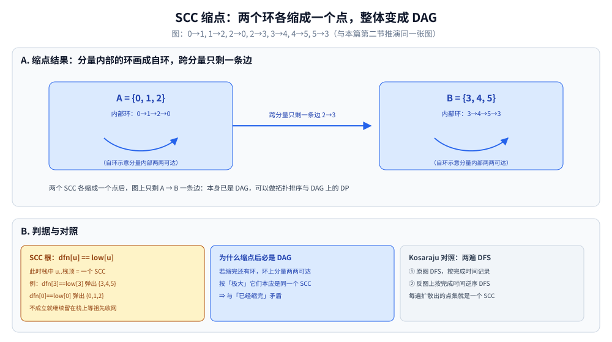
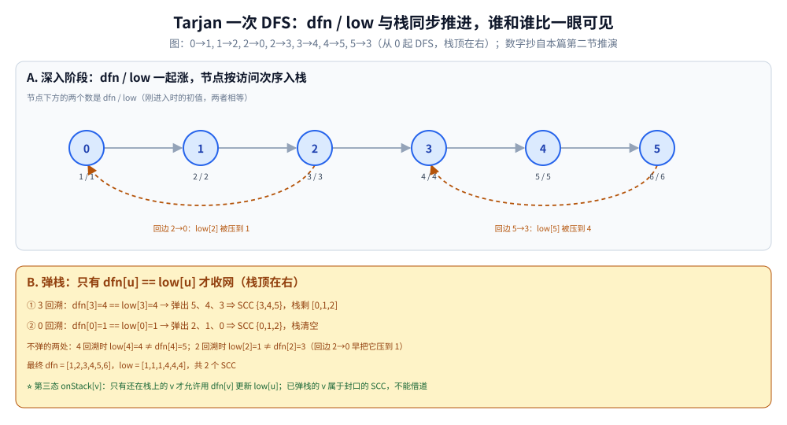

# 强连通分量

> 有向图中「互相可达」的极大子图：Tarjan / Kosaraju 可以在 O(V+E) 内
> 把图缩成 DAG，处理环、2-SAT、路径可达等问题的通用手段。
>
> ⭐ 边界先说清：本篇讲有向图强连通分量（SCC）的算法与应用。
> 无向图的连通分量用并查集或 DFS，见 [并查集、Trie与一致性哈希.md](../../数据结构/高级数据结构/并查集、Trie与一致性哈希.md)；
> 拓扑排序只能用于 DAG，见 [拓扑排序.md](拓扑排序.md)。
>
> 内容整理自个人学习笔记，素材见 [素材清单](../../../素材清单.md)。复杂度口径见 [复杂度分析.md](../基础算法/复杂度分析.md)。

---

## 一、什么叫「强连通」？为什么要「缩点」？

**本节要点**：三个定义一口气摆清 —— 强连通、SCC、缩点，外加一条贯穿全篇的结论：**SCC 缩点后必为 DAG**。

- **强连通**：有向图中 u → v 且 v → u 都可达
- **强连通分量（SCC）**：极大的强连通子图
- **缩点**：把每个 SCC 缩成一个点，得到 DAG（**SCC 缩点后必为 DAG**）

⭐ 为什么缩点后一定是 DAG：若缩点后还存在环，环上的分量两两互相可达，按「极大」它们本应是**同一个** SCC，与「已经缩完」矛盾。

拿本篇第二节要推演的那张 6 点图示范缩点的效果：

```text
原图：0→1, 1→2, 2→0, 2→3, 3→4, 4→5, 5→3

     ┌────── 回边 2→0 ──────┐
     │                      │
     ↓                      3 ──→ 4 ──→ 5
     0 ──→ 1 ──→ 2          ↑               │
                             └──── 回边 5→3 ─┘

缩点后（两个 SCC 各缩成一个点，只剩一条边）：

     ┌─────────────┐        ┌─────────────┐
     │ A = {0,1,2} │  ───→  │ B = {3,4,5} │
     └─────────────┘        └─────────────┘
     A、B 内部互相可达；整体已是 DAG
```



上图把这段 ASCII 推演画成了缩点形态：A = {0, 1, 2}、B = {3, 4, 5} 各是一个蓝色方块，块内自环示意分量内部两两可达（A 内环 0→1→2→0、B 内环 3→4→5→3），跨分量只剩一条边 2→3（即 A → B），本身已是 DAG。下方判据盒给出 SCC 根的收网条件 `dfn[u] == low[u]`（例：dfn[3]==low[3] 弹出 {3,4,5}、dfn[0]==low[0] 弹出 {0,1,2}），并列出「为什么缩点后必是 DAG」的反证与 Kosaraju 两遍 DFS 的对照。

---

## 二、Tarjan 怎么一次 DFS 就切出所有 SCC？

**本节要点**：在普通 DFS 的 dfn/low 之外多维护一个栈；`dfn[u] == low[u]` 时，从 u 到栈顶恰好是一个完整的 SCC。

- 一次 DFS，维护两个数组：
  - `dfn[u]`：时间戳
  - `low[u]`：u 能回溯到的最早时间戳
- 用栈保存当前搜索路径上的节点
- 当 `dfn[u] == low[u]` 时，栈中从 u 到栈顶构成一个 SCC

```go
func tarjan(u int) {
	timer++
	dfn[u], low[u] = timer, timer
	stack = append(stack, u)
	onStack[u] = true
	for _, v := range g[u] {
		if dfn[v] == 0 {
			tarjan(v)
			low[u] = min(low[u], low[v])
		} else if onStack[v] {
			low[u] = min(low[u], dfn[v])
		}
	}
	if dfn[u] == low[u] {
		// 弹栈直到 u，这些节点构成一个 SCC
	}
}
```

⭐ 与 [DFS深度优先遍历.md](图的遍历/DFS深度优先遍历.md) 的分工：DFS 的遍历机制（`visited` 标记时机、递归骨架、四类边）写在它第二、三节，本篇不重复；这里只补它没有的第三态 —— 普通 DFS 只有「访问过 / 没访问过」，Tarjan 要多问一句「**访问过，但还没结案**吗」。判据就是代码里的 `onStack[v]`：栈内的 v 才允许用 `dfn[v]` 更新 `low[u]`；**已弹栈**的 v 属于已经封口的 SCC，不能借道。

下面拿第一节那张 6 点图把时间戳与栈的变化逐步推一遍（数字可按上面的边表手推复核）：

```text
图：0→1, 1→2, 2→0, 2→3, 3→4, 4→5, 5→3（从 0 起 DFS，栈顶在右）

步骤  u  动作                    dfn/low        栈
 1    0  进入                     1/1           [0]
 2    1  进入                     2/2           [0,1]
 3    2  进入                     3/3           [0,1,2]
 4    2  见 0（在栈）             low[2]=1       [0,1,2]
 5    3  进入                     4/4           [0,1,2,3]
 6    4  进入                     5/5           [0,1,2,3,4]
 7    5  进入                     6/6           [0,1,2,3,4,5]
 8    5  见 3（在栈）             low[5]=4       [0,1,2,3,4,5]
 9    4  回溯                    low[4]=4       [0,1,2,3,4,5]
 10   3  回溯，dfn[3]==low[3] → 弹到 3           弹出 5,4,3 ⇒ SCC {3,4,5}
 11   2  回溯                    low[2]=1       [0,1,2]
 12   1  回溯                    low[1]=1       [0,1,2]
 13   0  回溯，dfn[0]==low[0] → 弹到 0           弹出 2,1,0 ⇒ SCC {0,1,2}

最终：dfn = [1,2,3,4,5,6]，low = [1,1,1,4,4,4]，共 2 个 SCC
```



上图把这份推演按「下潜 / 弹栈」两段画出来：A 段是深入阶段，0～5 依访问次序各带一个 dfn/low 初值（进入时两者相等），橙色虚线是两条回边 —— 回边 2→0 把 low[2] 压到 1、回边 5→3 把 low[5] 压到 4；B 段是弹栈，只有 `dfn[u] == low[u]` 才收网：① 3 回溯时 dfn[3]=4 == low[3]=4，弹出 5、4、3 得 SCC {3,4,5}，栈剩 [0,1,2]；② 0 回溯时弹出 2、1、0 得 {0,1,2}，栈清空。不弹的两处也标了：4 回溯时 low[4]=4 ≠ dfn[4]=5，2 回溯时 low[2]=1 ≠ dfn[2]=3。B 段末行就是正文强调的第三态 —— 只有还在栈上的 v 才允许用 `dfn[v]` 更新 `low[u]`。

---

## 三、Kosaraju 为什么要做两次 DFS？

**本节要点**：第一次在原图上按**完成时间**排序，第二次在**反图**上逆着这个序扩散 —— 反图把「先完成的下游 SCC」的边反向，保证第二次 DFS 不会溢出到别的分量。

1. 对原图做一次 DFS，按**完成时间**记录顺序
2. 按完成时间的**逆序**在**反图**上做 DFS
3. 每次 DFS 访问到的节点构成一个 SCC

⭐ **对比**：

- Tarjan：一次 DFS，常数小，但逻辑稍复杂
- Kosaraju：两次 DFS，思路简单，需要建反图

---

## 四、SCC 能解决哪些问题？

**本节要点**：一张表 —— 能缩点的先缩点，缩完就是 DAG 上的题。

| 场景 | 说明 |
|---|---|
| **缩点建 DAG** | SCC 缩点后拓扑排序，问题转化为 DAG 上的 DP |
| **2-SAT** | 用 SCC 判断布尔方程是否有解，见 [2-SAT.md](2-SAT.md) |
| **环检测** | 是否存在大小 > 1 的 SCC |
| **可达性** | DAG 上 DP 求最大路径 |
| **强连通子图计数** | 统计 SCC 个数与大小 |
| **最大半连通子图** | 缩点后 DP |

---

## 五、和并查集判连通有什么区别？

**本节要点**：一个数字是「双向可达」，一个是「单方向连通」；能增量的只有并查集。

| 维度 | SCC | 并查集 |
|---|---|---|
| 图类型 | 有向图 | 无向图 |
| 连通性 | 双向可达 | 单方向连通 |
| 算法 | Tarjan / Kosaraju | union-find |
| 是否可增量 | 一般不能 | 可以 |

⚠️ 并查集的机制（路径压缩、按秩合并）在 [并查集、Trie与一致性哈希.md](../../数据结构/高级数据结构/并查集、Trie与一致性哈希.md)，本篇只做对照、不复述。

---

## 延伸追问

- **强连通分量和连通分量有什么区别？** → 前者针对有向图（双向可达），后者针对无向图。
- **为什么缩点后一定是 DAG？** → 若缩点后还有环，那些点应属于同一个 SCC，与「极大」矛盾。
- **Tarjan 里的 `low` 是什么？** → 当前节点及其子树能回溯到的最早时间戳。
- **Tarjan 和 Kosaraju 怎么选？** → 一般用 Tarjan，常数更小；Kosaraju 思路简单，适合先求反图。
- **2-SAT 为什么能用 SCC 解决？** → 把「x 取真 / 假」建成两个节点，矛盾条件建成边，同一 SCC 内为矛盾。
- **Tarjan 的栈为什么不能省，光靠 dfn/low 不行吗？** → dfn/low 只能告诉你 u 是一个 SCC 的根（`dfn[u] == low[u]`），说不出分量里有哪些点；栈保存「已访问但未结案」的第三态，弹栈弹到 u 为止，u..栈顶恰好就是这个分量的成员。这也是它与无向版 [割点与桥.md](割点与桥.md) 最大的实现差异。

---

## 关联

- [拓扑排序.md](拓扑排序.md) — SCC 缩点后的下一步
- [2-SAT.md](2-SAT.md) — 完全建立在 SCC 判定上的应用
- [割点与桥.md](割点与桥.md) — dfn/low 同源，但那是无向版、不需要栈
- [DFS深度优先遍历.md](图的遍历/DFS深度优先遍历.md) — Tarjan 的基础（四类边在其第三节）
- [图的表示与存储.md](../../数据结构/图/图的表示与存储.md) — 本篇邻接表与反图的表示
- [并查集、Trie与一致性哈希.md](../../数据结构/高级数据结构/并查集、Trie与一致性哈希.md) — 第五节对照的无向连通一侧
- [二分图判定.md](二分图判定.md) — 无向图的两色染色
- [README.md](README.md) — 图论导读

> 反向引用（本篇被下列文档引到）：[欧拉路径与欧拉回路.md](欧拉路径与欧拉回路.md)
