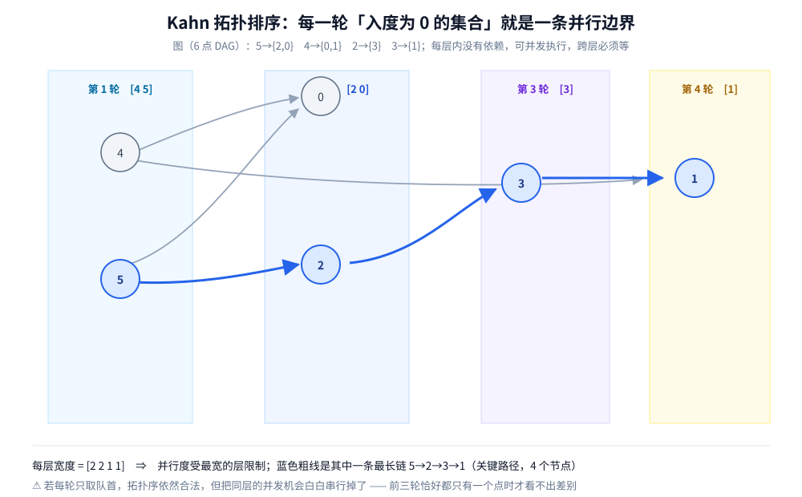

# 拓扑排序

> 把一个有向无环图「拉成一条线」：**每个点排在所有后继之前**。这一篇讲 DAG 的定义与前提、
> 两种实现的分工（只做索引，机制不重复）、**每轮入度为 0 的集合为什么就是一条并行边界**、
> **拓扑序什么时候唯一**、怎么拿**字典序最小**的那个，以及它在构建依赖与任务编排里的落点。
>
> ⭐ 拓扑排序的两套实现**已经各自写在别处**：**Kahn（BFS 入度版）**的规则、逐轮推演与判环在
> [BFS广度优先遍历.md](图的遍历/BFS广度优先遍历.md) 第四节；**DFS 后序反转**的证明与实测在
> [DFS深度优先遍历.md](图的遍历/DFS深度优先遍历.md) 第七节（判环靠三色，见其第六节）。
> **本篇不重复这两套机制**，只做「拓扑排序」这个主题本身的完整展开 —— 唯一性、字典序最小、并行边界与关键路径。
>
> 内容整理自个人学习笔记，素材见 [素材清单](../../../素材清单.md)。图的表示与栈 / 队列的选型见
> [图的表示与存储.md](../../数据结构/图/图的表示与存储.md) 与 [DFS与BFS遍历.md](图的遍历/DFS与BFS遍历.md)；复杂度口径见
> [复杂度分析.md](../基础算法/复杂度分析.md)。
>
> 📎 本篇所有输出均为本机实跑逐字抄录：**Go 1.26.5（windows/amd64）** 与 **JDK 1.8.0_321** 各实现一份，
> 输出**逐行对齐**。实验代码在 `.workbuddy/tmp/mst_lab/topo/`。

---

## 一、拓扑排序是什么？为什么只有 DAG 才有？

**本节要点**：先把「有向无环图」和「拓扑序」两个定义摆清，再回答那个前提问题 —— **有环为什么一定无解**，以及为什么**答案通常不唯一**。

### 1.1 DAG 与拓扑序的定义

**DAG** = Directed Acyclic Graph，**有向无环图**：边有方向（`u → v` 表示「u 依赖 v，u 必须在 v 之前」），且整张图里没有任何有向环。

**拓扑序（Topological Order）**：把全部 `n` 个顶点排成一个线性序列，使得**对每一条有向边 `u → v`，`u` 都排在 `v` 的前面**（记作 `pos[u] < pos[v]`）。

| 前提 | 为什么不能少 |
|---|---|
| **图是有向的** | 无向边没有方向，「谁在前谁在后」无从谈起 |
| **图是无环的（DAG）** | 有环时无解 —— 见 1.2 |

⭐ 换一个说法：**拓扑序是把一个偏序（partial order）扩展成一个全序（total order）**。图只规定了「谁必须在谁之前」这些局部约束，拓扑排序给出的是**满足全部约束的一条完整排列**。

### 1.2 为什么有环就无解

假设图里有一个环 `u₁ → u₂ → … → u_k → u₁`。拓扑序要求每条边都满足「前排在后面」，于是必须有

```text
pos[u₁] < pos[u₂] < … < pos[u_k] < pos[u₁]
```

一路严格递增又绕回起点，要求 `pos[u₁] < pos[u₁]` —— **自相矛盾**。所以只要存在一个有向环，就不存在拓扑序 ∎

⚠️ 注意「无向环」不算：`a — b — c — a` 的三元环若全是无向边，本身不产生任何「先后」约束，不影响拓扑序的存在。

### 1.3 拓扑序通常不是唯一答案

同一张 DAG 往往有**很多**合法拓扑序 —— 只要满足全部前后约束即可，「并列」的点谁先谁后都行。本机实测那张 6 点 DAG 就有 **13 个**不同拓扑序（4.3 给出精确计数的两种算法），而一条 5 点的链只有 **1 个**。

⭐ 所以**「你的拓扑序和我的不一样」不代表谁写错了** —— 判据只看「每条边是否都满足 `pos[u] < pos[v]`」。4.1 会给出「什么时候才唯一」的判据。

---

## 二、两种实现各写在哪？我该选哪个？

**本节要点**：拓扑排序有两套写法，**两套的机制都不在本篇重复**。这一节只做分工与索引 —— 需要哪一套，直接去对应篇看推导。

### 2.1 Kahn（BFS 入度版）—— 规则与推演见 BFS 篇

**「反复取出入度为 0 的点、删掉它的出边」** —— 完整的规则、逐轮推演与「顺带判环」在 [BFS广度优先遍历.md](图的遍历/BFS广度优先遍历.md) 第四节，本篇不重述。

⭐ 记住它的两个特征就够了：**天然分层**（每轮取出一批，见本篇第三节）、**判环免费**（`len(order) < n` 即有环）。

### 2.2 DFS 后序反转 —— 证明与实测见 DFS 篇

**「每个点在后序（所有后继都完成时）入列，整体反转即拓扑序」** —— 一句话证明与实测在 [DFS深度优先遍历.md](图的遍历/DFS深度优先遍历.md) 第七节。

⚠️ 它**判环必须用三色**（遇到「灰边」即有环）：用二色会把菱形依赖误判成环，实测对照见 [DFS深度优先遍历.md](图的遍历/DFS深度优先遍历.md) 第六节。这是它与 Kahn 最容易被忽略的一处差别。

### 2.3 两种写法的分工

| 写法 | 原理 | 判环 | 天然分层 | 适用 |
|---|---|---|---|---|
| **Kahn**（BFS 入度） | 反复取出入度为 0 的点，删它的出边 | 顺带：`len(order) < n` 即有环 | **是**（每轮一批） | 构建依赖、任务编排、外键顺序、包初始化顺序 |
| **DFS + 后序反转** | 后继全完成后自己入列，整体反转 | 必须三色 | 否（需另算） | 已经在做 DFS、要顺带拿 SCC / 关键路径 |

⭐ **一句话选型**：只要顺序 + 判环 → **Kahn**（好写、天然给并行边界）；已经在 DFS / 要更强信息（强连通分量、关键路径）→ **DFS 后序反转**。两套在同一张图上给出的序列不同、但**都合法**：Kahn 给 `[4 5 2 0 3 1]`（本篇 3.1 实测），DFS 后序反转给 `[5 4 2 3 1 0]`（[DFS深度优先遍历.md](图的遍历/DFS深度优先遍历.md) 第七节实测），逐条边校验均满足 `pos[u] < pos[v]`。

---

## 三、每轮入度为 0 的集合就是一条并行边界（本机实测）

**本节要点**：Kahn 的「轮」不是实现细节，它有一个**工程含义** —— 同一轮的点之间没有依赖，可以**并发**执行；不同轮必须等。这一节把「层」和它背后的**最长路径**讲透。

### 3.1 逐轮推演（本机实测）

6 点 DAG（弧表 `5→{2,0}`、`4→{0,1}`、`2→{3}`、`3→{1}`）：

```text
================ 实验一：Kahn 逐轮推演 —— 每轮入度为 0 的集合 = 并行边界 ================
  图（6 点 DAG，弧表）：5→{2,0}  4→{0,1}  2→{3}  3→{1}
  初始入度 = [2 2 1 1 0 0]

  第 1 轮 [4 5] → 4→0 使 in[0]:2→1；4→1 使 in[1]:2→1；5→2 使 in[2]:1→0；5→0 使 in[0]:1→0
  第 2 轮 [2 0] → 2→3 使 in[3]:1→0
  第 3 轮 [3] → 3→1 使 in[1]:1→0
  第 4 轮 [1] → 无出边

  拓扑序（FIFO）= [4 5 2 0 3 1]
  并行层：[4 5] → [2 0] → [3] → [1]
  每层宽度 = [2 2 1 1]，最长路径节点数（关键路径）= 4
  ⭐ 每一轮取出的是一整批、不是一个点：同一批内没有依赖，可并发执行
  ⚠️ 若每轮只取队首，拓扑序依然合法，但把同层的并发机会白白串行掉了
```

⭐ **读这份输出的三个要点**：

1. **每一轮是一整批**，不是一个点。第 1 轮 `[4 5]` 里没有边相连，**两者可以同时开工**；
2. **跨轮必须等**：`2` 依赖 `5`，所以 `2` 最早只能在第 2 轮出现 —— 第 1 轮必须先完成 `5`；
3. ⚠️ **若把「一轮批处理」写成「每次只取队首」**，拓扑序**依然合法**（本机输出仍是 `[4 5 2 0 3 1]`，因为队列恰好按层推进），但**并行语义丢了** —— 调度器会以为 `4`、`5` 有先后关系，白白串行化。**这就是并行编排里不能只返回一个线性序的原因。**



### 3.2 层号 = 最长路径（关键路径）

把每个点所处的轮次记下来，得到的「层号」有一个精确含义：**从任一源点到该点的最长路径上的节点数**。

```text
  层号 = [2 4 2 3 1 1]   （按顶点编号 0..5 排）
  ⭐ 层号(v) = 1 + max{ 层号(u) : u → v 是入边 }；无入边的点层号为 1
  ⭐ 最末层 = 4 ⇒ 关键路径是 5→2→3→1（4 个节点、3 条边）
```

⭐ **为什么是「最长路径」而不是「最短路径」**：一个点必须等**所有**前驱都完成，所以它最早能开始的时刻由**最慢的那条前驱链**决定 —— 也就是最长路径。

⚠️ **工程含义**：这个「最长路径」就是任务的**关键路径** —— 整个流水线的**最短总工期**受它支配（不能靠加并行度缩短）。而**每层宽度 `[2 2 1 1]` 的最大值（这里也是 2）决定了峰值并行度**。做任务编排时，这两项才是真正要看的数。

### 3.3 有环检测是「顺带」的（本机实测）

```text
================ 实验二：有环检测（顺带就能判）================
  图（3 点）：0→1→2→0（真环）
  Kahn 收到 0 个点（n = 3）⇒ 有环 = true
  ⭐ 判据：环上的点入度永远降不到 0，永远进不了队列 ⇒ len(order) < n 即有环
  ⭐ 这个判据是「顺带」得到的，不需要另写一个判环算法
```

循环里 2 的入度被 `0→1`、`1→2` 减到 1，但 `2→0` 又把 `0` 的入度顶回 1 —— 环上的点互相「续命」，谁也降不到 0。判据的机制已在 [BFS广度优先遍历.md](图的遍历/BFS广度优先遍历.md) 4.3 讲过，这里只记录本机读数。

⚠️ 注意本机这个例子里 `Kahn 收到 0 个点` —— 因为整个图就是一个环，队列从一开始就是空的。**混有「环 + 尾链」的图会收到尾链上的点，但只要点数 `< n` 就一样判为有环。**

---

## 四、拓扑序什么时候唯一？字典序最小怎么拿？

**本节要点**：三个进阶问题 —— 「唯一吗」「要最小的那个怎么办」「一共有多少个」。三者的答案都由**同一件事**决定：每轮候选集的大小。

### 4.1 唯一性判定

**结论**：拓扑序唯一，当且仅当 **Kahn 每一轮的「入度为 0 集合」都恰好含 1 个点**。

**为什么**：Kahn 的每一轮是从候选集里挑一个出队。若某一轮候选 `≥ 2` 个点，它们之间**没有任何先后约束**（否则其中一个不会入度为 0），于是**交换它们的顺序得到另一个合法拓扑序** —— 不唯一。反之每轮候选都只有 1 个，则每一步都是被迫的，顺序唯一。∎

⭐ 换个等价说法：**拓扑序唯一 ⟺ 这张 DAG 存在一条哈密顿路径**（一条经过全部点、且方向与图中边一致的链）。

```text
================ 实验三：拓扑序唯一吗？字典序最小怎么拿？================
  判定：拓扑序唯一 ⟺ Kahn 每一轮的「入度为 0 集合」都恰好 1 个点
  链 0→1→2→3→4   每轮宽度 = [1 1 1 1 1] ⇒ 唯一 = true，线性扩展数 = 1
  6 点 DAG        每轮宽度 = [2 2 1 1] ⇒ 唯一 = false，线性扩展数 = 13
  3 点环          线性扩展数 = 0（有环 ⇒ 不存在拓扑序）
  交叉验证（全排列暴力枚举 n! 种顺序）：6 点 DAG = 13，链 = 1 ⇒ 与子集 DP 一致 = true
```

### 4.2 字典序最小（小顶堆）

「字典序最小」= 把所有合法拓扑序按 `(pos[0], pos[1], …)` 比较，取字典序最小的那一个。做法只有一个字：**Kahn 的队列换成小顶堆** —— 每轮不再「先来先出」，而是**取编号最小的那个**候选。

```go
// Kahn 的字典序最小版：队列 → 小顶堆
h := &minHeap{}
heap.Init(h)
for i := 0; i < n; i++ {
	if in[i] == 0 {
		heap.Push(h, i) // ⭐ 入堆时按编号排序
	}
}
for h.Len() > 0 {
	u := heap.Pop(h).(int) // ⭐ 每轮取编号最小的候选
	order = append(order, u)
	for _, v := range adj[u] {
		in[v]--
		if in[v] == 0 {
			heap.Push(h, v)
		}
	}
}
```

同一张 6 点 DAG 上，两种取法给出不同结果：

```text
  FIFO 队列版  拓扑序 = [4 5 2 0 3 1]
  小顶堆版（字典序最小）拓扑序 = [4 5 0 2 3 1]
  ⭐ 两者都合法（每条弧都满足 pos[u] < pos[v]），但只有小顶堆版是字典序最小的
  ⚠️ 「字典序最小」和「唯一」是两件事：不唯一的图也能问它的最小字典序拓扑序
```

⚠️ **一个常见的实现陷阱**：别用「先对输入做一次堆排序、再跑普通 Kahn」来求字典序最小 —— **候选集在过程中是动态变化的**（新点会因为入度归零而加入），只对初始候选排序不够，必须**每一步都从当前候选里取最小**。

### 4.3 一共有多少个拓扑序？（线性扩展数，精确计数）

「拓扑序的个数」在理论上的名字是**线性扩展数（number of linear extensions）**。`n` 小时可以用**子集 DP** 精确算出来：

> 设 `dp[S]` = 「已放置的点集恰好是 `S`」的方案数。转移时，若某个点 `v ∉ S` 且它的**所有前驱都在 `S` 里**，就可以把 `v` 接在后面：`dp[S ∪ {v}] += dp[S]`。答案就是 `dp[全集]`。

本机对 6 点图跑出来是 **13**，并**用全排列暴力枚举做了交叉验证**（`6! = 720` 种顺序逐一检查约束），两者一致。⚠️ 这个交叉验证是必要的：计数类实验最容易写出「看起来对、其实漏算/重算」的 DP，**必须拿一个独立实现对照**。

⚠️ 现实提示：**线性扩展数是 `#P`-难问题**，`n` 稍大（比如 20）子集 DP 的 `2ⁿ` 就撑不住了，通常改用**近似采样**（马尔可夫链随机游走）。

---

## 使用：拓扑排序在构建依赖与任务编排里的落点

拓扑排序是**少见的「算法本身就是产品」**的那类 —— 它直接就是构建系统、调度器的核心。结合本仓库已有篇目看三层：

**第一层：构建与部署的先后顺序**。Maven 模块之间、Go 包 `init` 的初始化顺序、K8s 资源的 `apply` 顺序，本质上都是「先算出拓扑序、再按序执行」。⚠️ **K8s 里更看重的是「并行边界」而不是线性序**：同一层的资源可以并发 apply，跨层必须等。相关：[../../../06-工程实践/部署/k8s/K8s部署流程.md](../../../06-工程实践/部署/k8s/K8s部署流程.md)。

**第二层：CI / CD 的 stage 编排**。流水线里「哪些 job 能并行、哪些必须串行」就是一张 DAG 的拓扑层 —— 改一条依赖边，就可能改变关键路径与总时长。⚠️ 这里真正要盯的是 **3.2 的关键路径**：加并行度只能缩短非关键路径上的时间，**关键路径不被压缩，总工期就不会变**。相关：[../../../06-工程实践/部署/GitLab CI-CD.md](../../../06-工程实践/部署/GitLab CI-CD.md)。

**第三层：任务调度与依赖编排**。定时任务平台里的「任务 A 完成后才能跑 B、B 和 C 可以同时跑」，就是拓扑分层的直接落地；调度器读到的依赖图若是 DAG 才可调度，**一旦成环（配错了依赖）就必须拒绝执行并报错** —— 这正是 3.3 的判环在工程里的用途。相关：[../../../03-数据与中间件/中间件/xxl-job.md](../../../03-数据与中间件/中间件/xxl-job.md)。

⭐ **归纳成一条判断**：**你几乎不会「写」拓扑排序，但你会「读」一张依赖图**。而第三节的两个数（**关键路径**、**每层宽度**）就是判断「这套编排能不能再快」的全部依据；第四节的两个判定（**唯一吗**、**要字典序最小吗**）则决定「同样的依赖，能不能给出确定性的执行顺序」。

---

## 延伸追问

- **有环为什么一定没有拓扑序？** → 环 `u₁→…→u_k→u₁` 要求 `pos[u₁] < … < pos[u_k] < pos[u₁]`，自相矛盾（1.2）。⚠️ **无向环不算**，它不产生先后约束。
- **拓扑序唯一吗？** → **通常不唯一**。唯一当且仅当 **Kahn 每轮候选都恰好 1 个**（等价于 DAG 存在哈密顿路径）。本机 6 点图有 13 个拓扑序，5 点链只有 1 个（4.1、4.3）。
- **怎么拿字典序最小的拓扑序？** → **Kahn 的队列换成小顶堆**，每轮取编号最小的候选（4.2）。⚠️ 只对**初始**候选排序不够，候选集在过程中动态变化。
- **「字典序最小」和「唯一」是一回事吗？** → **不是**。不唯一的图也能问它的最小字典序拓扑序（本机 `[4 5 0 2 3 1]` 就是那张不唯一图的最小字典序解）。
- **拓扑序一共有多少个？** → 线性扩展数，`n` 小时用**子集 DP** 精确算（本机 6 点图 = 13，并通过全排列暴力枚举交叉验证）；它是 `#P`-难问题，`n` 大时只能用近似采样（4.3）。
- **每轮取一整批和只取队首有区别吗？** → 拓扑序**都合法**，但**整批取出才对应并行边界**：同层可并发、跨层必须等。只取队首会让调度器误以为同层有先后关系（本机 3.1）。
- **「关键路径」是指什么？** → 从任一源点到终点的**最长**路径 —— 一个任务必须等所有前驱完成，所以它的最早开始时刻由最慢那条前驱链决定。**它决定整个编排的最短总工期**（3.2）。
- **为什么 Kahn 判环必须 `< n`，不能只看「有没有点没进队列」？** → 两者等价，但 `< n` 是**可计算的判据**（数一数收到几个点）。⚠️ Kahn 只在整张图是环时才收到 0 个点；混有尾链的图会收到部分点，所以**必须用点数比对**而不是「队列是否为空过」。
- **DFS 后序反转判环为什么必须三色？** → 二色会把「菱形依赖」（两个分支汇聚到一个点）误判成环。实测对照与原因见 [DFS深度优先遍历.md](图的遍历/DFS深度优先遍历.md) 第六节。
- **拓扑排序只能对有向图做吗？** → **是**。无向边没有方向，无法定义「谁在前」。⚠️ 反过来，有向图中出现双向边 `u→v` 与 `v→u`，就构成了长度 2 的环，同样无解。

## 关联

- [BFS广度优先遍历.md](图的遍历/BFS广度优先遍历.md) — **Kahn 实现的单一来源**：规则、逐轮推演、「顺带判环」都在它第四节，本篇不重复
- [DFS深度优先遍历.md](图的遍历/DFS深度优先遍历.md) — **DFS 后序反转拓扑**的证明与实测（第七节）、**三色判环**（第六节，本篇 2.2 引用的正是它）
- [DFS与BFS遍历.md](图的遍历/DFS与BFS遍历.md) — 遍历**总纲**：栈与队列的选型、内存画像；拓扑排序的两套实现分别落在栈侧与队列侧
- [图的表示与存储.md](../../数据结构/图/图的表示与存储.md) — 本文用到的邻接表表示
- [线性结构/栈与队列.md](../../数据结构/线性结构/栈与队列.md) — 队列一侧 · [堆/堆与优先队列.md](../../数据结构/堆/堆与优先队列.md) — 字典序最小的那道题用小顶堆
- [复杂度分析.md](../基础算法/复杂度分析.md) — `O(V+E)` 的推导口径，以及子集 DP 的 `O(2ⁿ · n)` 从哪来
- [最小生成树/Kruskal.md](最小生成树/Kruskal.md) — 另一处用「判环」的地方：Kruskal 用并查集判无向环，与本篇的有向判环是一组对照
- [../../../06-工程实践/部署/GitLab CI-CD.md](../../../06-工程实践/部署/GitLab CI-CD.md) — 「使用」第二层：CI stage 的并行与关键路径
- [../../../06-工程实践/部署/k8s/K8s部署流程.md](../../../06-工程实践/部署/k8s/K8s部署流程.md) — 「使用」第一层：资源 apply 的先后与并行边界
- [../../../03-数据与中间件/中间件/xxl-job.md](../../../03-数据与中间件/中间件/xxl-job.md) — 「使用」第三层：任务编排里的依赖图与成环拒绝
> 反向引用（本篇被下列文档引到）：[单调栈与单调队列.md](../../数据结构/高级数据结构/单调栈与单调队列.md)、[双指针.md](../基础算法/双指针.md)
