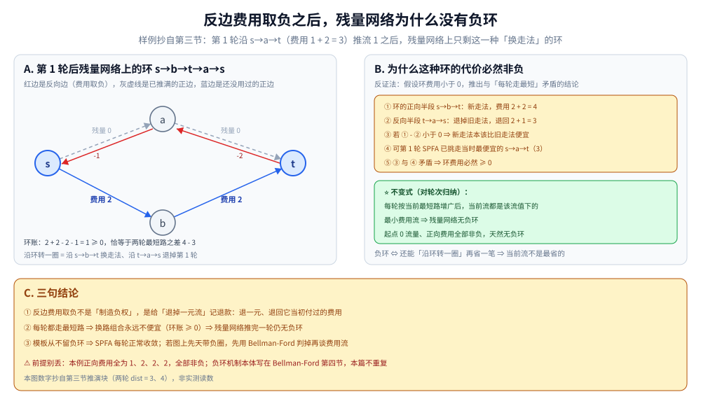
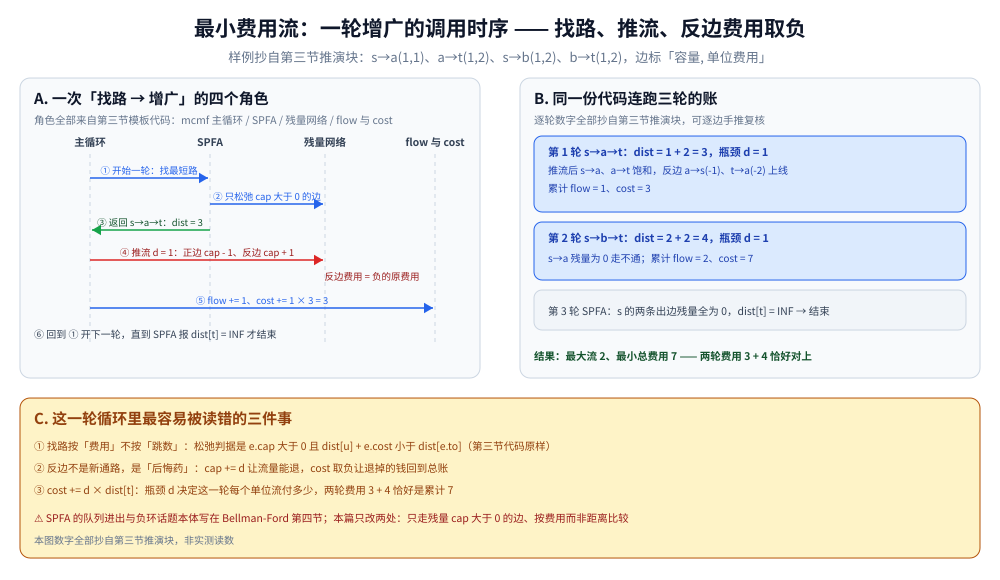

# 最小费用最大流

> 在最大流的基础上加「费用」维度：每条边有单位费用，求在最大流下总费用最小。
> 是任务分配、运输问题、路径规划的标准解法。
>
> ⭐ 边界先说清：本篇讲最小费用最大流（MCMF）。
> 最大流基础见 [网络流.md](网络流.md)；
> 最短路见 [Dijkstra.md](最短路/Dijkstra.md)。
>
> 内容整理自个人学习笔记，素材见 [素材清单](../../../素材清单.md)。复杂度口径见 [复杂度分析.md](../基础算法/复杂度分析.md)。

---

## 一、在最大流之上加了什么维度？

**本节要点**：边从「一个数（容量）」变成「两个数（容量 + 单位费用）」，目标从「流最大」变成「流最大且费用最小」。

- 每条边除了容量，还有**单位费用**
- 目标：在最大流的前提下，使总费用最小
- 输出：最大流量 + 最小总费用

---

## 二、为什么「先走费用最便宜的增广路」就是最优的？

**本节要点**：把「找路」从 BFS 换成按费用的最短路，贪心地让每一单位流量都走当前最便宜的通路；撤销机制靠费用取负的反向边兜底。

用**最短增广路**代替普通增广路：

1. 用 SPFA / Dijkstra 找「单位费用」最小的增广路
2. 沿这条路增广，更新残量网络
3. 重复直到无增广路

⭐ **关键**：反向边的费用是「负的原费用」，这样才能撤销之前的流量。

补一句「取负为什么不会拖出负环」的推导：每轮都沿**当前费用最小**的增广路推流，若推完一轮后残量网络里出现负环，就意味着「沿环换一条走法」比刚用过的路更便宜——与本轮的取路判据矛盾。由此归纳出不变式：**每轮结束时，当前流都是该流值下的最小费用流，残量网络无负环**（起点 0 流量、正向费用全部非负，天然无负环）。第三节的样例推完第 1 轮后唯一的「换走法」环账目为 2 + 2 - 2 - 1 = 1 ≥ 0，恰是两轮最短路之差：



怎么读：A 面板画第 1 轮沿 s→a→t（费用 1 + 2 = 3）推流后的残量网络——灰虚线是已推满的正边（残量 0），红边是费用取负的反边 a→s(-1)、t→a(-2)，蓝边是还没用过的 s→b、b→t（费用各 2），环 s→b→t→a→s 的账 2 + 2 - 2 - 1 = 1 ≥ 0；B 面板是反证五步：环的正向半段是新走法（4），反向半段退掉旧走法（退回 3），若环为负就说明新走法本该更便宜，可第 1 轮 SPFA 已挑走当时最便宜的 s→a→t，矛盾；C 面板收束成三句结论——取负是记退款不是制造负权、每轮走最短 ⇒ 环账 ≥ 0 ⇒ 无负环、模板不留负环所以 SPFA 每轮正常收敛。

---

## 三、SPFA 版模板长什么样？跑起来是什么节奏？

**本节要点**：外层还是最大流的「找路 → 推流」循环，只是找路换成了 SPFA；下面用小图把逐轮增广推一遍。

边表 `g[u]` 里每条边带四个字段：`to / cap / cost / rev`（rev 是反向边在 `g[to]` 里的下标）。

```go
func mcmf(s, t int) (flow, cost int) {
	for {
		// SPFA 找最短路径（按费用）
		dist := make([]int, n)
		for i := range dist {
			dist[i] = INF
		}
		dist[s] = 0
		inQueue := make([]bool, n)
		prevV := make([]int, n)
		prevE := make([]int, n)
		queue := []int{s}
		inQueue[s] = true
		for len(queue) > 0 {
			u := queue[0]
			queue = queue[1:]
			inQueue[u] = false
			for i, e := range g[u] {
				if e.cap > 0 && dist[u]+e.cost < dist[e.to] {
					dist[e.to] = dist[u] + e.cost
					prevV[e.to] = u
					prevE[e.to] = i
					if !inQueue[e.to] {
						queue = append(queue, e.to)
						inQueue[e.to] = true
					}
				}
			}
		}
		if dist[t] == INF {
			break
		}
		// 找瓶颈容量
		d := INF
		for v := t; v != s; v = prevV[v] {
			d = min(d, g[prevV[v]][prevE[v]].cap)
		}
		// 更新流量与费用
		for v := t; v != s; v = prevV[v] {
			e := &g[prevV[v]][prevE[v]]
			e.cap -= d
			g[v][e.rev].cap += d
		}
		flow += d
		cost += d * dist[t]
	}
	return
}
```

⚠️ SPFA 的松弛骨架、队列进出与「负环」话题写在 [Bellman-Ford.md](最短路/Bellman-Ford.md) 第四节，本篇不重复；这里**区别**只有两点：松弛条件是「残量 cap > 0」，比较的是费用而不是距离。

逐轮推演（边标「容量, 单位费用」，数字可手推复核）：

```text
图：s ──(1,1)──→ a ──(1,2)──→ t
    s ──(1,2)──→ b ──(1,2)──→ t

第 1 轮  按费用最短路：s→a→t，dist = 1+2 = 3，瓶颈 d = 1
        推流后 s→a、a→t 饱和            累计 flow = 1, cost = 3
第 2 轮  s→a 残量为 0，最短路：s→b→t，dist = 2+2 = 4，瓶颈 d = 1
        推流后 b→t 饱和                 累计 flow = 2, cost = 7
第 3 轮  t 不可达 → 结束

结果：最大流 2，最小总费用 7（两条通路各摊一单位流，没有更便宜的排法）
```

这一轮一轮的调用节奏见下图（A 面板四个角色全部对得上面模板代码）：



怎么读：A 面板五支箭头是一轮的顺序——① 主循环让 SPFA 找最短路；② SPFA 只松弛 cap > 0 的边（判据 `e.cap > 0 && dist[u]+e.cost < dist[e.to]`）；③ 返回 s→a→t、dist = 3；④ 主循环向残量网络推流 d = 1，正边 cap - 1、反边 cap + 1 且费用取负；⑤ 累计 flow += 1、cost += 1 × 3 = 3，然后回到 ①，直到 SPFA 报 dist[t] = INF 结束。B 面板是同一份代码连跑三轮的账：第 1 轮 3、第 2 轮 4、累计 flow = 2、cost = 7，第 3 轮 s 的两条出边残量全为 0 → 结束。

---

## 四、SPFA 还是 Dijkstra + 势能？

**本节要点**：规模决定答案 —— SPFA 简单但会被卡。

| 算法 | 时间 |
|---|---|
| SPFA 版 | O(F × VE)，F 为最大流 |
| Dijkstra + 势能 | O(F × E log V) |

⭐ **Dijkstra + 势能**：用势能函数把负权边转化为非负权，再用 Dijkstra 求最短路。Dijkstra 的堆优化实现见 [Dijkstra.md](最短路/Dijkstra.md)，本篇不重复。

---

## 五、什么问题值得建 MCMF？

**本节要点**：「要配满 + 配法有成本差异」的分配类问题基本都是它。

| 场景 | 建模 |
|---|---|
| 任务分配 | 源点 → 人 → 任务 → 汇点，费用为成本 |
| 运输问题 | 工厂 → 仓库 → 客户 |
| 路径规划 | 边的费用为距离 |
| 招聘问题 | 候选人与岗位的匹配成本 |
| 广告投放 | 用户与广告的点击价值 |
| 网络设计 | 带宽与延迟的权衡 |

---

## 六、和最大流差在哪？

**本节要点**：一张对照表 —— 多的那个维度把「找路」从 BFS 换成了最短路。

| 维度 | 最大流 | 最小费用最大流 |
|---|---|---|
| 边权 | 只有容量 | 容量 + 费用 |
| 目标 | 流量最大 | 最大流下费用最小 |
| 算法 | BFS / DFS 增广 | 最短路增广 |
| 复杂度 | O(V²E) | O(F × VE) |

---

## 延伸追问

- **为什么反向边的费用是负的？** → 撤销流量时要退还费用，等价于反向走边。
- **SPFA 会卡吗？** → 会。大规模图用 Dijkstra + 势能。
- **势能是什么？** → 每个点的势能等于「从源点到该点的最短距离」，加上势能后边权非负。
- **最小费用最大流和最大权匹配什么关系？** → 二分图最大权匹配可转化为 MCMF，见 [二分图匹配.md](二分图匹配.md)。
- **有没有更快的算法？** → 有，如 ZKW 费用流、原始-对偶算法，但实现复杂。
- **反边带负费用，SPFA 凭什么每轮都收敛？** → 模板从不留负环：若推完一轮残量网络有负环，就意味着换一条更便宜的走法，与「每轮按最短路增广」矛盾（环账推演见第二节配图）——没有负环，队列就不会被反复改小的点卡死。

---

## 关联

- [网络流.md](网络流.md) — 最大流基础
- [Dijkstra.md](最短路/Dijkstra.md) — 势能版找路的实现基础
- [Bellman-Ford.md](最短路/Bellman-Ford.md) — SPFA 机制的出处（其第四节）
- [二分图匹配.md](二分图匹配.md) — 无权一侧的特例
- [README.md](README.md) — 图论导读
