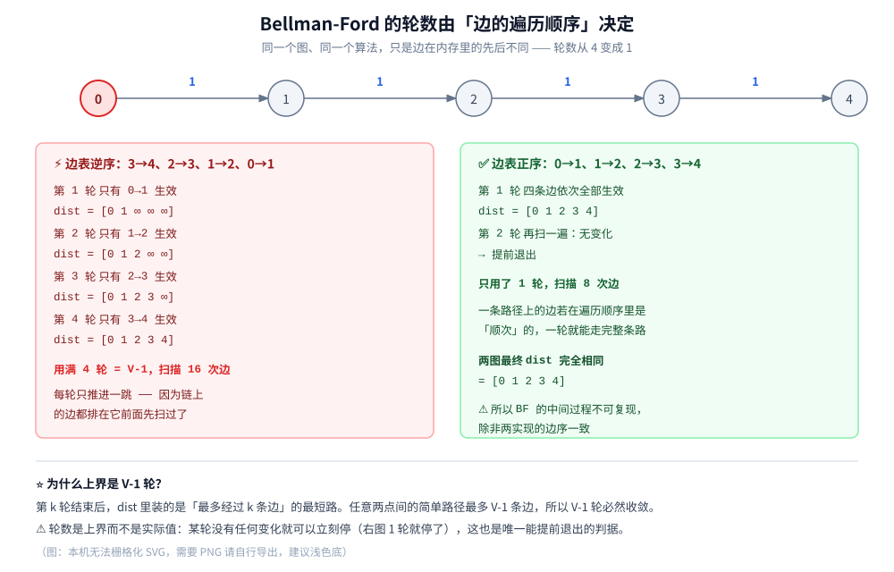
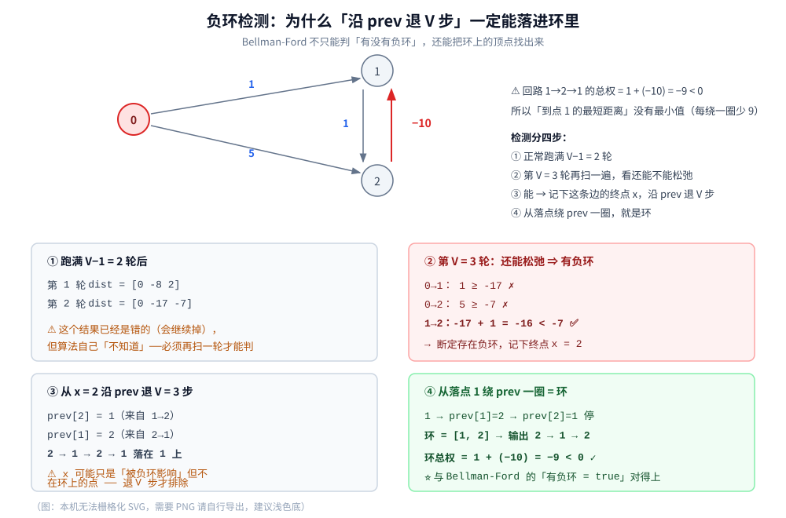

# Bellman-Ford 最短路

> **允许负权**的单源最短路：每轮扫全部边、重复 `V−1` 轮，为什么这样就能收敛（核心不变量 + 归纳证明）、
> **负环检测**与「把环上的顶点找出来」的四步做法，以及队列优化版 SPFA 在实践中快多少、什么时候会退化。
>
> ⭐ 本篇是 [Dijkstra.md](Dijkstra.md) 的**接续**：那篇讲了「非负权不变量」并实测了有负权时 Dijkstra 算错的位置，
> 本篇给出能处理负权的算法，并**用同一张图**做了正面对照（实验三）。全源最短路的 [Floyd.md](Floyd.md) 是三部曲的完结篇。
> 无权图的 BFS 最短路见 [BFS广度优先遍历.md](../图的遍历/BFS广度优先遍历.md) 第二节。
>
> 内容整理自个人学习笔记，素材见 [素材清单](../../../../素材清单.md)。图的表示见 [图的表示与存储.md](../../../数据结构/图/图的表示与存储.md)；
> 复杂度口径见 [复杂度分析.md](../../基础算法/复杂度分析.md)。
>
> 📎 本篇所有输出均为本机实跑逐字抄录：**Go 1.26.5（windows/amd64）** 与 **JDK 1.8.0_321** 各实现一份，
> 输出**逐行对齐**（102 行里 diff 只剩实验六的耗时数据 —— 那是两语言各自计时的必然差异）。

---

## 一、Bellman-Ford 是怎么算的？

**本节要点**：它和 Dijkstra **只差一件事** —— 不是「从堆里取最小的点」，而是「把全部边依次扫一遍」。看懂「为什么第 k 轮等于最多 k 条边」，就看懂了后面所有性质。

### 1.1 与 Dijkstra 的唯一区别

| | Dijkstra | **Bellman-Ford** |
|---|---|---|
| 每轮做什么 | 从堆里取 `dist` 最小的点，松弛**它的出边** | **把全部边依次扫一遍**，能松弛就松弛 |
| 什么时候停 | 所有点都定稿 | 跑满 `V−1` 轮，或某轮**没有任何变化** |
| 取点顺序 | 由**堆**决定（贪心） | **由边的存储顺序决定** |

⭐ 两者用的是**同一个动作**（松弛 `if dist[u] + w < dist[v]`），差别只在「这一轮碰哪些边」。

⚠️ 这个差别带来两个后果：

1. **BF 可以处理负权** —— 因为它**从来不给任何点「定稿」**，一个点可以被反复改进；
2. **BF 的中间过程不可复现** —— 它依赖边的存储顺序（Dijkstra 依赖堆，加个 `seq` 就稳定了）。**这是本篇实验一/二的核心。**

### 1.2 两条规则

| 步骤 | 动作 |
|---|---|
| ① | `dist[源点] = 0`，其余全为 `∞` |
| ② | **按存储顺序遍历全部边**，每条边做一次松弛；这一遍叫「一轮」 |
| ③ | 如果这一轮**没有任何 `dist` 被改小**，说明已经收敛，**立即停止** |
| ④ | 否则再跑一轮，直到跑满 `V−1` 轮为止 |

⭐ 第 ③ 步是唯一的「提前退出」判据，也是实践中绝大多数图能提前结束的原因（实验二）。

### 1.3 逐步推演：为什么第 k 轮 = 「最多 k 条边」

用一条 5 点链，但**把边逆着存**（这是本篇最关键的一个设计）：



```text
=========== 实验一：逐步推演（5 点链，边表是「逆序」的）===========

  0 ──1──► 1 ──1──► 2 ──1──► 3 ──1──► 4

  ⚠️ 边的**存储顺序**是 3→4、2→3、1→2、0→1（与路径方向相反）

  初始 dist = [0 ∞ ∞ ∞ ∞]
  边表顺序（BF 的中间状态由它决定）：3→4(1) 2→3(1) 1→2(1) 0→1(1)

  第 1 轮（上限 V-1 = 4）：
        0→1：0 + 1 = 1 < ∞  ✅（先扫到它）
        dist = [0 1 ∞ ∞ ∞]
  第 2 轮（上限 V-1 = 4）：
        1→2：1 + 1 = 2 < ∞  ✅（先扫到它）
        dist = [0 1 2 ∞ ∞]
  第 3 轮（上限 V-1 = 4）：
        2→3：2 + 1 = 3 < ∞  ✅（先扫到它）
        dist = [0 1 2 3 ∞]
  第 4 轮（上限 V-1 = 4）：
        3→4：3 + 1 = 4 < ∞  ✅（先扫到它）
        dist = [0 1 2 3 4]

  最终 dist = [0 1 2 3 4]
  用了 4 轮（V-1 = 4）、扫描 16 次边，提前退出 = false
  ⭐ 每轮只推进一跳 —— 这就是「第 k 轮后 dist 反映的是「最多走 k 条边」的最短路」
```

⚠️ **为什么每轮只推进一跳**：第 1 轮里，`3→4`、`2→3`、`1→2` 三条件被扫到时，它们的**起点还是 `∞`**（因为链上要用的边排在它们后面），只有最后那条 `0→1` 能生效。**一轮的信息只能沿着「边的排列方向」传播一跳**。

### 1.4 反过来存边，一轮就收敛

```text
=========== 实验二：把边表顺序反过来，一轮就收敛 ===========
  初始 dist = [0 ∞ ∞ ∞ ∞]
  边表顺序（BF 的中间状态由它决定）：0→1(1) 1→2(1) 2→3(1) 3→4(1)

  第 1 轮（上限 V-1 = 4）：
        0→1：0 + 1 = 1 < ∞  ✅（先扫到它）
        1→2：1 + 1 = 2 < ∞  ✅（先扫到它）
        2→3：2 + 1 = 3 < ∞  ✅（先扫到它）
        3→4：3 + 1 = 4 < ∞  ✅（先扫到它）
        dist = [0 1 2 3 4]
  第 2 轮（上限 V-1 = 4）：
        没有任何变化
        dist = [0 1 2 3 4]
  → 第 2 轮无变化，提前退出：实际用 1 轮（上界 4）

  最终 dist = [0 1 2 3 4]
  用了 1 轮（V-1 = 4）、扫描 8 次边，提前退出 = true
  两图 dist 完全相同 = true
  ⚠️⚠️ 同一张图、同一个算法，只是因为**边的遍历顺序不同**，轮数从 4 变成 1
     → 所以 BF 的中间过程**不可复现**，除非两实现的边序一致（这才是逐行对齐的前提）
```

⭐ **同一张图、同一个算法、同一组最终答案，轮数从 4 变成 1、边扫描从 16 次变成 8 次。** 差别只在「边在内存里的先后」。

⚠️ 这个性质有一个很实际的推论：**BF 的性能无法从「图的形状」单独判断**，还必须知道边的存储顺序。这也解释了为什么后面实验六里，同一个随机图**只打乱边序**，BF 的轮数就翻了几倍。

---

## 二、为什么是 V−1 轮？

**本节要点**：`V−1` 不是玄学，它是「任意两点间的简单路径最多几条边」这个事实的直接推论。这一节把不变量和证明讲清，并说明正确性**完全不依赖非负权**。

### 2.1 核心不变量

**不变量**：第 `k` 轮结束后，`dist[v]` 的值 ≤ 「从源点到 `v`、**最多经过 `k` 条边**」的所有路径中的最小代价。

**为什么**（对 `k` 归纳）：

- **基**：第 0 轮（初始）`dist[源] = 0`，其余 `∞` —— 正好对应「最多 0 条边」；
- **归纳步**：设第 `k` 轮的结论成立。第 `k+1` 轮里，对任意一条边 `u → v`，我们做的是 `dist[v] ← min(dist[v], dist[u] + w)`。若某条「最多 `k+1` 条边」的最优路径的最后一条边是 `u → v`，那么它的前 `k` 条边构成一条「最多 `k` 条边」的到 `u` 的路径 —— 由归纳假设，第 `k` 轮结束时 `dist[u]` 已经 ≤ 那段的代价，所以第 `k+1` 轮一定能把它传播到 `v`。∎

⭐ 换成一句直觉版：**每跑一轮，正确值就沿着边「多传播一跳」。**

### 2.2 为什么 V−1 就够

任意两点之间的最短路径**一定是一条简单路径**（不重复经过同一个点）：

- 如果路径上有一个环，把环去掉只会让代价**更小或不变**（⚠️ 这里正是**非负权**会用到的地方：环权 ≥ 0，去掉不亏）；
- 简单路径最多经过 `V−1` 条边。

所以第 `V−1` 轮结束后，所有「最多 `V−1` 条边」的路径都已被覆盖 —— **全部简单路径都算过了**，`dist` 就是最终答案。

⚠️⚠️ **注意 2.1 的不变量本身不需要非负权**（它只是「传播」的归纳），**2.2 才用到**。这也解释了下面的现象：

| 情况 | 结果 |
|---|---|
| 有负权、**无负环** | ✅ `V−1` 轮后收敛到正确答案（正因为「去掉环不亏」仍成立：无负环 ⟹ 所有环权 ≥ 0） |
| 有**负环** | ❌ 永远收敛不了 —— 「最简单路径」这个概念本身失效了（绕圈能无限变小） |

### 2.3 提前退出与复杂度

| 实现 | 复杂度 | 说明 |
|---|---|---|
| **朴素 BF** | **`O(V · E)`** | `V−1` 轮 × 每轮 `E` 条边 —— 本机 Go/Java 两版都是这个骨架 |
| 加「提前退出」 | 最坏仍是 `O(V·E)`，实践常快很多 | 大多数图的收敛轮数远小于 `V−1`（实验五实测：400 点图只跑了 **6 轮**） |
| **SPFA**（队列优化） | 最坏 `O(V·E)`，平均接近 `O(E)` | 见第四节；**它没有改善最坏复杂度** |

⚠️ **BF 与 Dijkstra 的性能差距是结构性的**：Dijkstra 每个点只「出堆」一次、每条边只被松弛一次；BF **每轮都重扫全部边**，哪怕这一轮里绝大多数边的起点还是 `∞`（连松弛都无法执行）—— 那部分工作是纯浪费。

---

## 三、负权与负环（本机实测）

**本节要点**：这一节回答三个问题 —— ① 同一张图 Dijkstra 错在哪、BF 怎么对；② 怎么**判定**有负环；③ 怎么把**环上的顶点**找出来（工程里往往比「有没有」更重要）。

### 3.1 与 Dijkstra 的正面对照

用 [Dijkstra.md](Dijkstra.md) 第三节那张「定稿版算错」的图，三个算法跑同一份输入：

```text
=========== 实验三：与 Dijkstra 对照（同一张带负权的图）===========
  图（有向）：0→1(2)  0→2(5)  2→1(-4)  1→3(1)
  Bellman-Ford  = [0 1 5 2]   ← 正确
  SPFA          = [0 1 5 2]   ← 正确
  Dijkstra      = [0 1 5 3]   ← ❌ 错（dist[3] 应为 2）
  ⭐ 这就是「有负权必须换算法」的实测证据；Dijkstra 篇第三节分析了它错在哪一步
```

⭐ **为什么 BF 不会犯这个错**：它**从不给点「定稿」**。Dijkstra 错在「点 1 以 `dist=2` 出堆后就不再展开」，而 BF 在后续轮次里照样会再扫一遍 `1→3`，于是 `dist[3]` 被修正成 2。

**换个角度看**：Dijkstra 用「定稿」换来 `O(E log V)`；BF 用「反复重扫」换来「能处理负权」。**这是同一笔交易的两种取舍。**

### 3.2 负环检测：第 V 轮还能松弛



**判据**：跑满 `V−1` 轮后，**再跑第 `V` 轮**。如果这一轮**还能松弛任何一条边**，就说明存在负环。

**为什么对**：由 2.2，`V−1` 轮已经覆盖了所有简单路径。第 `V` 轮还有改进空间，就意味着存在一条「不是简单路径」的更优走法 —— 那只能是因为它绕了某个环、而绕环居然让代价变小了，即**环权 < 0**。

```text
=========== 实验四：负环检测 + 找出环上的顶点 ===========
  图（有向）：0→1(1)  0→2(5)  1→2(1)  2→1(-10)
  ⚠️ 回路 1→2→1 总权 = 1 + (-10) = -9 < 0
  跑满 V-1=2 轮后 dist = [0 -17 -7]，检测到负环 = true
  ⭐ 找出的负环（按路径顺序）= 2 → 1 → 2
     环总权 = -9（< 0 即负环）
  ⭐ 方法：第 V 轮还能松弛的点 x 只是「被负环影响」，沿 prev 退 V 步才一定进环

  对照：无负环的图（同一套检测代码）
  dist = [0 1 5 2]，检测到负环 = false，环 = （无）
```

### 3.3 找出环上的顶点：为什么要「退 V 步」

⚠️ **这里有个容易写错的地方**：第 `V` 轮还能松弛的那条边，它的终点 `x` **不一定在环上** —— 它可能只是一个「被负环影响」的点（负环能让它的 `dist` 一直变小，但它自己不在环里）。

**正确做法（四步）**：

| 步骤 | 动作 |
|---|---|
| ① | 跑满 `V−1` 轮，同时维护 `prev[]`（每次成功松弛时记 `prev[v] = u`） |
| ② | 第 `V` 轮扫边，找到第一条还能松弛的边，记它的终点为 `x` |
| ③ | **从 `x` 沿 `prev` 往回走 `V` 步** |
| ④ | 从落点继续沿 `prev` 走，直到回到自己 —— 这条路径就是环（再反转成路径顺序） |

⭐ **第 ③ 步为什么有效**：`prev` 链一定最终会**走进环里**并**绕着环转**（对负环上的点来说，`prev` 永远指向它的前驱）。从 `x` 出发连走 `V` 步，比「环外前缀」的长度还长，所以**必然已经站在环上**——这是鸽笼原理的直接应用：`V` 个点、走 `V` 步，必有重复。

⚠️ 本机实测的环是 `2 → 1 → 2`，环总权 `-9`，与 `bellmanFordDetect` 返回的 `true` 完全吻合 ✓

### 3.4 负环在工程里意味着什么

| 场景 | 负环的含义 |
|---|---|
| 汇率 / 套利 | **存在无风险套利机会**（见「使用」第二层） |
| 差分约束 | **约束组自相矛盾、无解**（见「使用」第三层） |
| 路由协议 | 路由环路 —— 而实际协议用**跳数上限**（RIP 的 15 跳）来兜底，而不是每次跑负环检测 |

⭐ **一条实用判据**：**如果你的输入天然不可能有负环（比如权就是「耗时 / 距离 / 费用」），那负环检测就是白花的一轮**——但它的代价只有 `O(E)`，通常值得留着当断言。

---

## 四、SPFA：只扫「刚被改小的点」

**本节要点**：SPFA 不是新算法，它是 BF 的**队列优化** —— 把「每轮扫全部边」换成「只扫那些起点刚被改小的边」。本节实测它省了多少，以及它**没有**改善什么。

### 4.1 观察：绝大多数边在大多数轮里是白扫的

回到 1.3 的推演：第 1 轮里，`3→4`、`2→3`、`1→2` 三条边的起点都还是 `∞`，**连松弛都执行不了**。BF 却老老实实扫了它们。

⭐ **优化思路**：只有当某个点的 `dist` **刚刚变小**时，它的出边才**可能**需要重新松弛。于是：

| BF | SPFA |
|---|---|
| 每轮扫**全部 `E` 条边** | 用**队列**装「刚被改小的点」，只扫**这些点的出边** |
| 一个点可能被处理 `V−1` 次 | 一个点**入队才处理**，且**已在队列里就不重复入队** |
| 负环 ⟹ 永不收敛（跑满 `V−1` 轮后才发现） | 负环 ⟹ 入队次数爆掉（**入队次数 ≥ V 即判负环**） |

### 4.2 实测省了多少

```text
=========== 实验五：SPFA 比 BF 省多少？===========
  400 点 / 1995 条边：
    Bellman-Ford：跑了 6 轮、扫描 13965 次边（上界 796005 = (V-1)×E）
    SPFA        ：扫描 3186 次边（入队 647 次）→ 比 BF 省 77.2%
    结果一致 = true（dist[399] = 216）
  ⭐ 平均入队次数 = 1.62 次/点 —— 稀疏图上 SPFA 通常快一个量级
  ⚠️ 但最坏情况仍是 O(V·E)：SPFA 是「实践中快」，不是「复杂度更低」
```

⭐ 两个读数值得记：

- **平均入队 1.62 次/点** —— 也就是说「每个点基本只被处理一两次」，这正是 SPFA 快的原因；
- **BF 实际只跑了 6 轮**（上界是 `V−1 = 399`）—— 提前退出非常有效。**这也说明「BF 慢」不是因为轮数多，而是因为每轮都在扫无关的边。**

### 4.3 ⚠️ SPFA 的两个陷阱

**陷阱一：最坏复杂度仍是 `O(V·E)`，且能被刻意卡**

SPFA 的「平均快」依赖于图的形状。存在一类专门构造的图（网格状、以及竞赛圈的「菊花图」），能让同一个点被反复入队 `Θ(V)` 次，退化成 `O(V·E)`。⚠️ **所以「SPFA 比 BF 快」是实践结论，不是复杂度结论** —— 出题人只要知道对手用的是 SPFA，就能构造数据把它卡到超时。

**陷阱二：负环上它会「跑不完」而不是「给出结论」**

```text
=========== 实验七：负环上 SPFA 的入队次数会爆 ===========
  负环图：SPFA 入队 10002 次、扫描 10002 次边后触及入队上限（正常结束 = false）
  ⚠️ 判定依据：某个点入队次数 ≥ V 即认定有负环（Go 版用 cap=5000 兜底）
  同样这张图，Bellman-Ford 能**正常结束并给出环**：dist = [0 -17 -7]，环 = 2 → 1 → 2（负环 = true）
  ⭐ 这是 BF 相对 SPFA 的**唯一但关键**的优势：负环下它能收敛到「一个明确结论」
```

⚠️ 注意这里的不对称：

| | 能判负环吗 | 能给出**哪个环**吗 | 有界时间内结束吗 |
|---|---|---|---|
| BF + 第 V 轮检测 | ✅ | ✅（退 V 步 + 绕一圈） | ✅（`V` 轮封顶） |
| SPFA | ✅（入队 ≥ V） | ❌ 只知「有」，不知「是哪个」 | ❌ 靠计数器兜底 |

⭐ **所以「要用 SPFA」和「要查负环在哪」是两个不同的需求。** 只想快速求最短路 → SPFA；要判可行性 / 定位环路 → 走 BF。

---

## 五、三个算法的性能实测

**本节要点**：这一节的结论可能反直觉 —— **随机图上 BF 甚至不比 Dijkstra 慢**，但在「边序不友好」时它会慢两个量级。判据不是「算法名字」，而是**边的存储顺序**。

### 5.1 边序的杀伤力

```text
=========== 实验六：BF 有多慢？—— 同一个图，只改边的存储顺序 ===========
  图                               边数    BF轮     BF ms   SPFA ms  Dijkstra ms
  稀疏 DAG 1500 点 自然序             4505      7      0.65      0.24         1.68   三者一致=true
  稀疏 DAG 1500 点 打乱序             4505     19      3.27      0.41         2.60   三者一致=true
  稠密 DAG  400 点 自然序            40418      3      4.77      1.00         3.12   三者一致=true
  稠密 DAG  400 点 打乱序            40418      5      6.72      0.91         2.19   三者一致=true
  最坏情况·反向链 2000 点               1999   1999     86.97      0.37         1.29   三者一致=true
```

本机 4 次运行的范围：

| 图 | 边数 | BF 轮数 | BF | SPFA | Dijkstra |
|---|---|---|---|---|---|
| 稀疏 DAG 1500 点·自然序 | 4505 | 7 | 0.34 ~ 0.65 ms | 0.14 ~ 0.24 ms | 0.85 ~ 1.68 ms |
| 稀疏 DAG 1500 点·打乱序 | 4505 | 19 | 0.73 ~ 3.27 ms | 0.14 ~ 0.41 ms | 0.85 ~ 2.60 ms |
| 稠密 DAG 400 点·自然序 | 40418 | 3 | 0.99 ~ 4.77 ms | 0.21 ~ 1.00 ms | 0.77 ~ 3.12 ms |
| 稠密 DAG 400 点·打乱序 | 40418 | 5 | 1.64 ~ 6.72 ms | 0.22 ~ 0.91 ms | 0.83 ~ 2.19 ms |
| **最坏情况·反向链 2000 点** | 1999 | **1999** | **21.3 ~ 87.0 ms** | 0.14 ~ 0.40 ms | 0.37 ~ 1.29 ms |

⭐ 三条结论（都只断言**单调趋势与量级**，不断言绝对值）：

1. **随机图上 BF 和 Dijkstra 差不多，有时 BF 还快一点** —— 因为提前退出让轮数只有 3~19（远小于 `V−1`），而 BF 的「一次边检查」比 Dijkstra 的「一次堆操作」便宜得多。**⚠️ 所以「BF 一定比 Dijkstra 慢」是错的。**
2. **只把边序打乱，BF 的轮数立刻涨 2~3 倍**，SPFA 与 Dijkstra 几乎不动 —— 印证了实验一/二的结论。
3. **最坏情况下 BF 慢 40~140 倍**（对比 Dijkstra）、慢 **50~380 倍**（对比 SPFA）：跑满 1999 轮 × 1999 条边 ≈ 400 万次边扫描，其中绝大多数是在扫起点还是 `∞` 的边。

⚠️ **补充一个容易被忽略的事实**：`randDAG` 的「自然序」之所以友好，是因为建图时先加了主干链 `0→1→2→…`，正好顺着路径方向。**这是巧合，不是普遍规律** —— 换一个建图顺序结论就会翻转。

### 5.2 怎么选

| 图的特征 | 用什么 | 理由 |
|---|---|---|
| 无权 / 等权 | **BFS** | `O(V+E)`，常数最小 |
| 边权非负 | **Dijkstra** | `O((V+E) log V)`，最稳的通用选择 |
| 有负权、图不大 | **Bellman-Ford** | 结构最简单、能顺带判负环、行为可预测 |
| 有负权、图大、只求距离 | **SPFA** | 实践快一个量级；⚠️ 但要能接受「最坏退化」 |
| **要定位负环** | **Bellman-Ford** | 唯一能给出环上顶点的方案（3.3）⚠️ [Floyd.md](Floyd.md) 只能「看对角线判有没有」，给不出环 |

⭐ **一句话判据**：**「有负权」不是选 BF 的理由，「需要可预测的行为 / 需要知道环在哪」才是。** 只要图够大又只要距离，SPFA 通常更快 —— 前提是你能接受它在某些输入上退化。

---

## 使用：这条算法在你的系统里以什么形式出现

Bellman-Ford 有一条**极其特殊**的落地方式：它不写在你的业务代码里，而是**跑在路由器上**；此外它还是「负环」这个数学对象唯一的日常用途。结合本仓库已有篇目逐层看：

**第一层：距离向量路由（RIP）—— 与 OSPF 的镜像对照**。这是 BF 最经典的工程形态，也是它与 [Dijkstra.md](Dijkstra.md) 使用段第一层的**正面对照**：

| | 链路状态（OSPF / IS-IS） | **距离向量（RIP）** |
|---|---|---|
| 每台路由器知道什么 | **全网拓扑**（泛洪同步） | **只有邻居告诉它的距离表** |
| 算什么 | 本地跑 **Dijkstra** | 反复「和邻居交换距离表并更新」= **Bellman-Ford** |
| 收敛 | 快、可预测 | **慢**，且「坏消息传得慢」 |
| 兜底 | 无（协议本身收敛） | **跳数上限 15**（超过即视为不可达） |

⚠️ RIP 那个著名的 **`count-to-infinity`** 问题就是 BF 性质的直接体现：某条链路断了（好消息/坏消息的传播速度不对称），距离会**一轮一轮地慢慢往上加**，直到撞上 15 跳上限才停。相关：[../../../网络/网络通信链路详解.md](../../../网络/网络通信链路详解.md) 里讲的 AS 内用 IGP、AS 之间用 BGP。

⭐ 一个值得记住的对照：**「每台路由器只知道邻居的说法」这种信息结构，天然就只能跑 BF** —— 因为 Dijkstra 需要全局拓扑。**算法的选择有时是被信息的可得性决定的，而不是被性能决定的。**

**第二层：套利检测 —— 负环的日常用途**。把货币当成点、汇率当成边：

```text
若 1 单位 A 能换成 r 单位 B，就加边 A → B，权取 −ln(r)
那么：绕一圈的环权 = Σ(−ln r) = −ln(Π r)
环权 < 0  ⟺  Π r > 1  ⟺  绕一圈回来钱变多了  ⟺  存在套利
```

⭐ **于是「有没有负环」正好等于「有没有无风险套利机会」** —— 而 3.3 那个「退 V 步找出环」的算法，输出的就是**具体该按什么顺序兑换**。⚠️ 这也说明「负权」在工程里并不罕见：**任何「连乘 → 取对数 → 连加」的建模都会产生负权**（概率、收益率、衰减系数都是这一类）。

**第三层：差分约束 —— 把不等式组解成最短路**。给定一组形如 `x_j − x_i ≤ w` 的约束，可以这样转成图：

| 约束 | 加边 | 求什么 |
|---|---|---|
| `x_j − x_i ≤ w` | `i → j`，权 `w` | 从源点跑**最短路**，得到的 `dist` 就是一组**可行解** |

```text
=========== 实验八：差分约束（把不等式组解成最短路）===========
  约束：x1-x0≤3  x2-x0≤7  x2-x1≤2  x3-x2≤4  x3-x1≤1
  解出 x = [0 3 5 4]（以 x0 = 0 为基准）
  ⭐ 正确性验证：逐条代入
     x1 - x0 = 3 ≤ 3  ✅
     x2 - x0 = 5 ≤ 7  ✅
     x2 - x1 = 2 ≤ 2  ✅
     x3 - x2 = -1 ≤ 4  ✅
     x3 - x1 = 1 ≤ 1  ✅
  ⚠️ 若有负环 ⇒ 约束矛盾无解（这正是「用负环检测判可行性」的用法）
```

⚠️ 反过来也成立：**`x_j − x_i ≥ w` 就是最长路**，而最长路取负号又变回最短路 —— 所以「排班 / 资源分配 / 时序约束」这类问题最终都会落回这一篇。

⭐ **归纳成一条判断**：**Bellman-Ford 的价值不在「求最短路」，而在「它能把『不可行』变成『可检测』」。** 前两条使用场景里，你真正需要的都不是一串距离数字，而是**「有没有负环」这个布尔答案**。

---

## 延伸追问

- **为什么是 `V−1` 轮而不是 `V` 轮？** → 因为简单路径最多 `V−1` 条边（有 `V` 个点）。⚠️ 那个「多出来的第 `V` 轮」不是算法的一部分，而是**负环检测**：它还能松弛就说明有问题（3.2）。
- **负权为什么会让 BF 出错？不会** → **BF 在「有负权、无负环」时是完全正确的**（实验三实测）。它只在**有负环**时无法收敛 —— 而那时候「最短路」根本没有定义。⚠️ 这与 Dijkstra 的情况完全不同：Dijkstra 在**没有负环**时就会算错（[Dijkstra.md](Dijkstra.md) 3.1）。
- **「没有负环」为什么等价于「所有环权 ≥ 0」？** → 因为任何一个环都可以看成一个独立的回路：环权为负意味着「多绕一圈更便宜」，那就不存在最优解了。⚠️ 注意**零权环**是合法的（绕不绕都一样），不影响正确性。
- **BF 的中间状态为什么不可复现？** → 因为它依赖**边的存储顺序**（实验一/二：同一张图，轮数 4 vs 1）。⚠️ Dijkstra 没有这个问题（它依赖堆，加 `seq` 就稳定），这也是两语言能否逐行对齐的**唯一门槛**。
- **SPFA 是「更好的 Bellman-Ford」吗？** → **实践中通常更快，但最坏复杂度一样是 `O(V·E)`**（实验五/六）。⚠️ 而且它在负环上会「跑不完」而不是「给出结论」（4.3）。**它不是替代品，是取舍。**
- **SPFA 为什么能用「入队 ≥ V 次」判负环？** → 一个点的 `dist` 每次变小都会（重新）入队。无负环时它最多变小 `V−1` 次（`V−1` 轮各一次），所以入队 `≥ V` 次必然说明存在让 `dist` 无限下降的环。⚠️ 这是一个**统计判据**，不像 BF 的「第 V 轮还能松弛」那样是结构性证明。
- **为什么 `randDAG` 上 BF 反而比 Dijkstra 快？** → 因为①提前退出让轮数只有个位数；②**一次「数组比较」比一次「堆操作」便宜得多**（后者有指针跳转与对象分配）。⚠️ 所以复杂度的常数项在小图上不可忽略 —— 但最坏情况下 BF 会慢 40+ 倍（5.1）。
- **能不能给 Dijkstra 加负权支持？** → 常见的两种「补救」都不成立：① **给所有边加上同一个正数**让它们变非负 —— 会**改变最短路径的选择**（加了 `k` 之后，边数多的路径被惩罚得更多）；② **每轮多检查一次已定稿的点** —— 那就退化成 BF 了。**要负权就换算法，没有便宜的改法。**
- **为什么说「取对数」会引入负权？** → 任何连乘模型（概率、收益率、衰减）取对数后变成连加，而乘积 < 1 的对数是负数。⚠️ 所以「负权」在建模里很常见，**别以为它只是教科书里的玩具**（见「使用」第二层）。
- **BF 能求最长路吗？** → 把每条边的权取负、跑 BF，再把结果取负即可。⚠️ 前提是**没有正环**（取负后变成负环）—— 所以判据完全对应：`正环 ⟺ 原图取负后有负环`。

## 关联

- [Dijkstra.md](Dijkstra.md) — **本篇的上一层**：非负权不变量、`O((V+E) log V)`、以及「有负权时算错在哪一步」的完整实测；本篇实验三用**同一张图**做了正面对照
- [BFS广度优先遍历.md](../图的遍历/BFS广度优先遍历.md) — 无权图的最短路：`O(V+E)`，是 Dijkstra 在等权图上的特例
- [DFS与BFS遍历.md](../图的遍历/DFS与BFS遍历.md) — 遍历**总纲**：栈与队列的选型、内存画像与跨语言实测
- [图/图的表示与存储.md](../../../数据结构/图/图的表示与存储.md) — 本篇用到的**边列表 / 邻接表** · [线性结构/栈与队列.md](../../../数据结构/线性结构/栈与队列.md) — **队列**（SPFA）；对照篇的**小顶堆**见 [堆与优先队列.md](../../../数据结构/堆/堆与优先队列.md)
- [复杂度分析.md](../../基础算法/复杂度分析.md) — `O(V·E)` 与 `O((V+E) log V)` 的推导口径、以及「最坏 vs 平均」的区别
- [../../贪心/霍夫曼编码.md](../../贪心/霍夫曼编码.md) — 另一篇「有完整正确性证明」的样板：交换论证 + 最优子结构，与本篇 2.1 的归纳法是一组对照
- [../../../网络/网络通信链路详解.md](../../../网络/网络通信链路详解.md) — 「使用」第一层：RIP 距离向量路由与 OSPF 链路状态的镜像对照
> 反向引用（本篇被下列文档引到）：[Kruskal.md](../最小生成树/Kruskal.md)、[Prim.md](../最小生成树/Prim.md)、[Floyd.md](Floyd.md)
