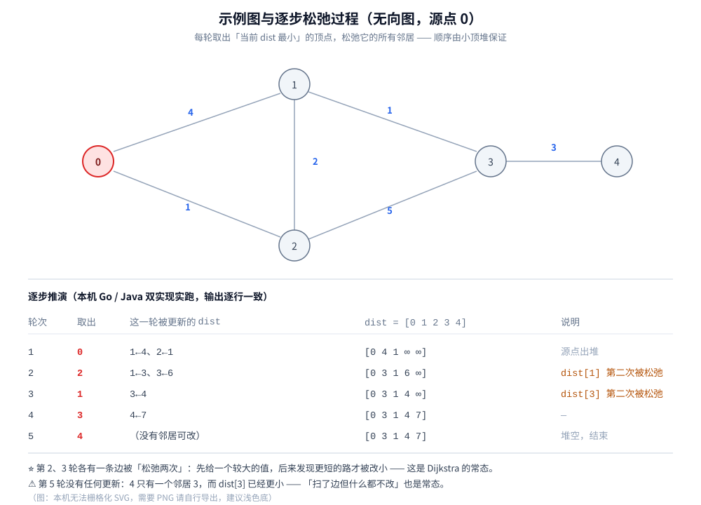
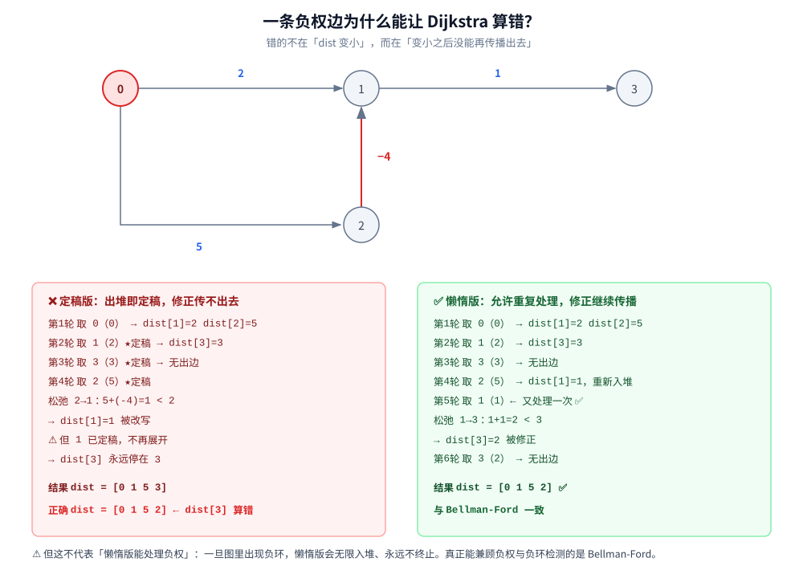

# Dijkstra 最短路

> 单源最短路怎么算：**每轮从「未定稿的点」里取出 `dist` 最小的一个、松弛它的出边**，为什么这条贪心规则是对的
> （核心不变量 + 归纳证明）、为什么它偏偏不能有负权（**本机实测出错在哪一步**），以及三版实现
> （定稿标记 / 懒惰删除 / 朴素 O(V²)）的真实差别与实测对照。
>
> ⭐ 本篇讲**带权图上的单源最短路**。无权图的「最短路」见 [BFS广度优先遍历.md](../图的遍历/BFS广度优先遍历.md) 第二节 ——
> 那里讲的 BFS 层号其实是 Dijkstra 在等权图上的特例（本篇实验二实测验证），两篇不重复。
> 能处理负权的 [Bellman-Ford.md](Bellman-Ford.md)、全源最短路的 [Floyd.md](Floyd.md) 各自成篇 —— 三篇合起来是最短路的完整版图。
>
> 内容整理自个人学习笔记，素材见 [素材清单](../../../../素材清单.md)。图的表示与优先队列（小顶堆）见
> [堆与优先队列.md](../../../数据结构/树/堆与优先队列.md)；复杂度口径见 [复杂度分析.md](../../基础算法/复杂度分析.md)。
>
> 📎 本篇所有输出均为本机实跑逐字抄录：**Go 1.26.5（windows/amd64）** 与 **JDK 1.8.0_321** 各实现一份，
> 输出**逐行对齐**（100 行里 diff 只剩实验五的耗时数据 —— 那是两语言各自计时的必然差异）。

---

## 一、Dijkstra 是怎么一步步算出最短路的？

**本节要点**：全部机制一句话——**每轮从「还没有定稿的点」里取出 `dist` 最小的那个，用它去松弛所有出边**。看懂「谁被取出」和「哪条边被松弛两次」，就看懂了后面所有性质。

### 1.1 它补上的是 BFS 的哪块短板

BFS 求最短路有个硬前提：**每条边的代价相同**（见 [BFS广度优先遍历.md](../图的遍历/BFS广度优先遍历.md) 第二节）。一旦边上带了不同的权（延迟、距离、费用），「层号」就不再等于距离了。

```text
        4
  0 ───────── 1
```

从 `0` 到 `1`，BFS 会给出「1 跳」；但这一跳的代价是 4。而绕道 `0 → 2 → 1` 是 2 跳、代价只有 `0→2` 的 1 加上 `2→1` 的 2，共 3。**跳数少 ≠ 代价小**，BFS 的层号在这里彻底失效。

⭐ Dijkstra 要解决的就是这件事：**在边权非负的带权图上，求出源点到所有点的最小总代价**。

### 1.2 两条规则

| 步骤 | 动作 |
|---|---|
| ① | `dist[源点] = 0`，其余全为 `∞`；把所有点放进一个小顶堆（按当前 `dist` 排序） |
| ② | 从堆里取出 **`dist` 最小的点 `u`**，标记为「已定稿」 |
| ③ | **松弛**：对 `u` 的每条出边 `u → v`（权 `w`），若 `dist[u] + w < dist[v]`，就把 `dist[v]` 改小 |
| ④ | 重复 ②③ 直到所有点都定稿 |

⭐ 第二步就是**贪心选择**：永远只处理「当前看起来最近」的点，从不回头改已经定稿的点。

⚠️ 第三步的「松弛」是三个算法（Dijkstra / Bellman-Ford / SPFA）共用的同一个动作，它们**只在「按什么顺序取点」上不同**：

| 算法 | 取点顺序 | 能处理负权吗 |
|---|---|---|
| BFS | 队列（按跳数） | 仅等权图 |
| **Dijkstra** | **小顶堆（按当前距离）** | ❌ 不能 |
| Bellman-Ford | 轮数（每轮扫全部边） | ✅ 能，还能检测负环 |

### 1.3 逐步推演（本机实跑）

用一张 5 点 6 边的无向图（源点 `0`），**六条边见下方输出块里的边表** —— 推演中的每个数字都能在那里逐条对上：



```text
================ 实验一：逐步推演（无向图，源点 0） ================

  5 点 6 边的无向图 —— 边表（括号内为边权）：
    0-1(4)   0-2(1)   1-2(2)   1-3(1)   2-3(5)   3-4(3)

  初始 dist = [0 ∞ ∞ ∞ ∞]

  第 1 轮：取出顶点 0（dist=0，堆里还剩 0 个）
       松弛 0→1：0 + 4 = 4 < ∞  ✅ 更新 dist[1]=4
       松弛 0→2：0 + 1 = 1 < ∞  ✅ 更新 dist[2]=1
  第 2 轮：取出顶点 2（dist=1，堆里还剩 1 个）
       松弛 2→0：1 + 1 = 2 ≥ 0  ✗ 不动
       松弛 2→1：1 + 2 = 3 < 4  ✅ 更新 dist[1]=3
       松弛 2→3：1 + 5 = 6 < ∞  ✅ 更新 dist[3]=6
  第 3 轮：取出顶点 1（dist=3，堆里还剩 2 个）
       松弛 1→0：3 + 4 = 7 ≥ 0  ✗ 不动
       松弛 1→2：3 + 2 = 5 ≥ 1  ✗ 不动
       松弛 1→3：3 + 1 = 4 < 6  ✅ 更新 dist[3]=4
  第 4 轮：取出顶点 3（dist=4，堆里还剩 1 个）
       松弛 3→1：4 + 1 = 5 ≥ 3  ✗ 不动
       松弛 3→2：4 + 5 = 9 ≥ 1  ✗ 不动
       松弛 3→4：4 + 3 = 7 < ∞  ✅ 更新 dist[4]=7
  第 5 轮：取出顶点 4（dist=7，堆里还剩 0 个）
       松弛 4→3：7 + 3 = 10 ≥ 4  ✗ 不动

  最终 dist = [0 3 1 4 7]
  ⭐ 路径：0→2 (1)、0→2→1 (3)、0→2→1→3 (4)、0→2→1→3→4 (7)
  统计：出堆 7 次、扫描 12 条边、真正松弛 6 次
```

三处必须看清的细节：

1. **⚠️ 一条边可能被「松弛两次」**。第 1 轮先给 `dist[1] = 4`（直接走 `0→1`），第 2 轮又从 `2` 绕过来改成 3。**「先给一个大值、后来发现更短的路才改小」是 Dijkstra 的常态**，不是异常；
2. **「扫了边但什么都不改」也是常态**。第 5 轮扫描了 `4→3`，但 `dist[3] = 4` 已经更小，直接跳过。`✗ 不动` 那些行占了全部扫描的一半 —— **别把「扫描边数」当成计算量**；
3. **出堆 7 次 > 点数 5**。因为每次「改小」都会往堆里**再塞一份**，于是同一个点可能在堆里存在多份。多出来的 2 次就是这些**过期条目**（后面 4.1 会专门算这笔账）。

### 1.4 结果：一棵最短路树

把每条边「是谁把谁的 `dist` 改小的」记下来，就得到一棵以源点为根的树：

```text
             0
       1 /      \ 4（后来被淘汰）
        2        1
    5 /   \ 2
      3     1
       \ 3
        4

最短路树：0 ─1─ 2 ─2─ 1 ─1─ 3 ─3─ 4
```

⭐ 这就是「**单源最短路**」的完整含义：算出来的不只是一串数字，而是**从源点到每一个点的唯一前驱**——把这棵树存下来，就同时得到了「到任意点的距离」和「到任意点的路径」。

---

## 二、为什么「每次取最小的」是对的？

**本节要点**：Dijkstra 的正确性只依赖**一个**前提：**边权非负**。这一节把不变量和证明讲清，并说清前提一破会坏在哪。

### 2.1 核心不变量：出堆顺序 = 距离递增

**不变量**：点 `u` 出堆时的 `dist[u]`，就是它到源点的**最终**最短距离。

反证一句话就能说清：设 `u` 出堆时 `dist[u] = d`，假设真实最短路更短、为 `d' < d`。那条更短的路径必然在某个点 `p` 处**还没进入「已定稿集合」**（否则它的后续早该被松弛过）——而 `p` 在路径上，故 `dist[p] ≤ d' < d`。

⚠️ **关键就在这里**：如果所有边权非负，那么 `dist[p]` 只会**越来越小地**沿着路径增长，也就是说 `dist[p] < d` —— **那 `p` 就该比 `u` 先出堆**，与「`u` 是当前最小值」矛盾。∎

⭐ 换成一句直觉版：**「绕远路」不可能比直达更便宜（因为每条边都在加钱）；既然如此，当前最近的点就已经到头了，可以放心定稿。**

### 2.2 归纳证明（把 2.1 写严谨）

对「出堆次数」做归纳。设当前堆里最小的是 `u`（`dist[u] = d`）。

- **基**：第一次出堆的是源点，`dist[源] = 0` 显然最短 —— 没有比 0 更小的非负距离；
- **归纳步**：假设前 `k` 个出堆的点距离都已正确。取第 `k+1` 个出堆的 `u`。设 `s → … → u` 是任意一条从源点到 `u` 的路径，记它的最后一个「未定稿」点为 `p`（`p` 存在，因为 `u` 自己就未定稿）。由归纳假设，`p` 之前那段路径上的点都已定稿，且它们的后续松弛都已做过，所以

  `dist[p] ≤ (p 到源点的真实最短距离) ≤ (s→…→p 这段的代价) ≤ (整条路径的代价)`

  ⚠️ **最后那个 `≤` 用到了「边权非负」**：整条路径的代价 ≥ 它的前一段。没有这个前提，后面可能比前面还小；
- 又 `p` 在堆里未定稿、`u` 是堆里最小的，故 `d = dist[u] ≤ dist[p] ≤ 整条路径的代价`。
- 由这条路径的任意性，`d` 不超过任何一条 `s → u` 路径的代价，即 `d` 就是最短距离。∎

### 2.3 前提：边权非负 —— 破坏它会发生什么

上面两处推导**都**依赖「边权 ≥ 0」。一旦有负权边：

| 破坏点 | 后果 |
|---|---|
| 「绕远路不会更便宜」失效 | 一个**已经定稿**的点，之后可能被一条更短的路径追上来 |
| 定稿后不再比较 | 那个更小的值**传不出去**了 —— 错误从这一点开始向下游扩散 |

⭐ 这解释了为什么「负权让 Dijkstra 出错」这件事**不是「算出一个偏大的数」那么简单，而是「一个局部修正没能传播」**。本篇第三节用本机实测把这个过程完整打了出来。

⚠️ 另外要分清两件事：**「边权可以为 0」是合法的**（0 不破坏「非负」），Dijkstra 照样正确；只有**负数**才致命。

### 2.4 复杂度与三版实现

| 实现 | 取最小 | 总复杂度 | 现实里属于哪一档 |
|---|---|---|---|
| **朴素：每轮线性扫描** | `O(V)` | **`O(V² + E)`** | `V` 小（几百）时最省事，稠密图上**反而最快** |
| **小顶堆** | `O(log V)` | **`O((V + E) log V)`** | 稀疏图的标准选择；本机 Go/Java 两版都用它 |
| 斐波那契堆 | `O(1)` 摊还 | `O(E + V log V)` | 理论上最好，常数极大，实践中几乎不用 |

⚠️ **注意堆版的 `V` 出现在哪里**：`(V + E) log V` 里的 `V` 来自「每个点至少入堆一次」。而**每条能改进 `dist` 的边也会引起一次入堆**，所以是 `E` 那一项在主导。这也解释了为什么「大量重复入堆」不会破坏复杂度 —— 每条边最多贡献常数次入堆。

⭐ **判据（本机实验五实测）**：稀疏图用堆、稠密图（`E ≈ V²`）用朴素 —— 稠密图上两者都是 `O(V²)` 量级，堆的 `log` 反而成了纯开销。

---

## 三、负权边会怎样（本机实测）

**本节要点**：教科书只说「有负权就不能用 Dijkstra」。这一节把**错在哪一步**、**哪种实现会错**、**哪种实现碰巧对**全部跑出来 —— 结论比一句话复杂得多。

### 3.1 定稿版：错的是「传播」，不是 `dist` 本身

用一条负权边的最小例子（有向图）：`0→1(2)`、`0→2(5)`、`2→1(-4)`、`1→3(1)`。



```text
  (a) 有负权、无负环 —— 「定稿版」把错误的顺序固化了
  图（有向）：0→1(2)  0→2(5)  2→1(-4)  1→3(1)
  初始 dist = [0 ∞ ∞ ∞]

  第 1 轮：取出顶点 0（dist=0，堆里还剩 0 个）
       松弛 0→1：0 + 2 = 2 < ∞  ✅ 更新 dist[1]=2
       松弛 0→2：0 + 5 = 5 < ∞  ✅ 更新 dist[2]=5
  第 2 轮：取出顶点 1（dist=2，堆里还剩 1 个）
       松弛 1→3：2 + 1 = 3 < ∞  ✅ 更新 dist[3]=3
  第 3 轮：取出顶点 3（dist=3，堆里还剩 1 个）
  第 4 轮：取出顶点 2（dist=5，堆里还剩 0 个）
       松弛 2→1：5 + -4 = 1 < 2  ✅ 更新 dist[1]=1

  Dijkstra 定稿版 dist = [0 1 5 3]
  Dijkstra 懒惰版 dist = [0 1 5 2]
  Bellman-Ford 正确值  = [0 1 5 2]   （存在负环 = false）
  → 定稿版与正确值不一致的下标 = [3]  ⚠️ 这里就是算错的位置
```

⚠️⚠️ **这里有个极易看错的点**：定稿版的 `dist[1]` 最后**也是 1**（第 4 轮确实把它改小了）。真正错的是 `dist[3]`：

- 点 `1` 在第 2 轮就以 `dist = 2` 出堆「定稿」了，当时它用 `2 + 1 = 3` 松弛出 `dist[3] = 3`；
- 第 4 轮点 `2` 把 `dist[1]` 改成 1 —— **但 `1` 已经定稿，不会再展开一次**，于是「`dist[1] = 1`」这个新值**没能继续向外扩散**；
- 正确的最短路是 `0 → 2 → 1 → 3 = 5 + (-4) + 1 = 2`，而定稿版停在 3。

⭐ **所以「负权让 Dijkstra 出错」的准确含义是：一个局部修正没能传播出去**。这也解释了为什么它对**没有下游邻居的点**完全无害 —— 改小了也没人要用。

### 3.2 懒惰版：这次反而对了 —— 但别高兴太早

同一个实现只改一处（**出堆时不判断「是否已定稿」，改为判断「这条堆记录是否过期」**），结果就正确了：

```text
  Dijkstra 懒惰版 dist = [0 1 5 2]
  ⭐ 懒惰版这次**是对的**：它愿意重复处理顶点 1，修正得以继续传播
```

原因：点 `1` 被**第二次**放进堆（因为 `dist[1]` 变小了），出堆时它发现堆里的 `1` 与当前的 `dist[1]` 相等、不是过期条目，于是**又展开了一次**，这回用新值把 `dist[3]` 修正成了 2。

⚠️ **但这只是「在没有负环时才碰巧成立」**：

- 懒惰版本质上让 Dijkstra 退化成了**按距离优先的 [Bellman-Ford.md](Bellman-Ford.md)**（同一个点可以被反复展开），所以在无负环的图上它确实收敛到正确答案；
- 代价是**每次「变小」都要重新展开一次**，最坏情况下重复展开的次数会爆炸；
- 一旦有负环，它连停都停不下来 —— 见 3.3。

### 3.3 负环：算法必须能「检测」，而不是硬给一个数

```text
  (b) 有负环 —— 懒惰版不终止，定稿版则给出错误答案
  图（有向）：0→1(1)  0→2(5)  1→2(1)  2→1(-10)
  ⚠️ 回路 1→2→1 的总权 = 1 + (-10) = -9 < 0 —— 这是负环
  懒惰版：跑了 201 次出堆后被步数上限截断（正常结束 = false）
          截断时 dist = [0 -890 -889] —— 还在往下掉，没有收敛
  Bellman-Ford：跑满 V-1=2 轮后 dist = [0 -17 -7]，**检测到负环 = true** ✅
```

⭐ **负环上「最短路」根本没有定义**：每绕一圈就少 9，所以「到点 1 的最短距离」是 `-∞`，没有最小值。这不是算法不够聪明，而是**问题本身没有答案**。

⚠️ 工程含义：**任何最短路实现都必须能回答「图里有没有负环」**，否则它可能在有环的输入上永远转下去（本机是加了步数上限才截断的，真实服务里那就是一个 CPU 打满的 bug）。

### 3.4 该换哪个算法

| 图的特征 | 用什么 | 理由 |
|---|---|---|
| 无权 / 等权 | **BFS** | `O(V+E)` 且常数更小（Dijkstra 在等权图上就是它，见实验二） |
| 边权非负 | **Dijkstra** | `O((V+E) log V)`，是最快的通用选择 |
| 有负权、无负环 | **[Bellman-Ford](Bellman-Ford.md)** / SPFA | 能给出正确答案；SPFA 是它的队列优化版 |
| 要判负环 | **[Bellman-Ford](Bellman-Ford.md)** | 「第 `V` 轮还能松弛 ⇒ 有负环」，这是它独有的一步（还能定位环） |
| 任意两点之间 | **[Floyd.md](Floyd.md)** | `O(V³)` 一次算出全源距离矩阵（稠密图上反而比跑 V 次 Dijkstra 快） |

⭐ **实用建议**：工程里绝大多数图的「代价」就是延迟、距离、费用 —— **天然非负**。所以 Dijkstra 覆盖了 95% 的场景，负权基本只出现在「把收益当成负成本」这类抽象建模里。

---

## 四、实现的两条路线与三个坑（本机实测）

**本节要点**：书上常把「懒惰删除」讲成一个高级技巧。本机实测的结论是：**它在非负权下与「定稿标记」完全等价**，真正的差别只有一处 —— 负权。

### 4.1 懒惰删除 vs 定稿标记：非负权下是同一件事

```text
================ 实验四：懒惰删除 vs 定稿标记 —— 非负权下是同一件事 ================
  50 点 / 242 条边的稀疏图：
    懒惰版：出堆  68 次 = 有效展开 50 + 丢弃过期条目 18
    定稿版：出堆  68 次 = 有效展开 50 + 丢弃过期条目 18
    dist 逐元素相同 = true
  ⭐ 两者出堆次数**完全相同** —— 非负权下「it.dist > dist[u]」与「done[u]」判的是同一件事：
     一旦某点以当前最小值出堆，它就不可能再被更新（后面的路径只会更长）
  ⭐ 所以「懒惰删除」在 Dijkstra 里的真实价值只是**省掉 O(V) 的 done 数组**，
     它**不是**「能处理负权」的技巧。三版实现的真实差别是这样：

    版本             负权·无负环           有负环              额外空间
    定稿版            ❌ 错误固化不传播        ❌ 给错误答案          done[V]
    懒惰版            ✅ 能自我修正          ❌ 不终止            无
    Bellman-Ford   ✅                ✅ 能检测出来          dist[V]
```

⭐ **为什么两者的出堆次数会一模一样**：非负权下「某个点以当前最小值出堆」就意味着它**不可能**再被改小（2.1 的不变量），所以：

- 定稿版的 `done[u]` 为真 ⟺ `u` 已经以最小值出过堆；
- 懒惰版的 `it.dist > dist[u]` 为真 ⟺ 堆里这一份不是最新的那份 ⟺ `u` 已经以更小的值出过堆。

**两个条件判的是同一件事**，只是用不同的状态（`done` 数组 vs `dist` 比对）表达。

⚠️ **两条路线的取舍**：

| | 定稿标记 | 懒惰删除 |
|---|---|---|
| 额外空间 | `done[V]` | 无 |
| 判断成本 | 一次数组读取 | 一次比较 |
| 单目标提前退出 | 天然可以（出堆即定稿） | 也可以（比对后即定稿） |
| 负权下的行为 | 错误固化 | 能自我修正（但可能不终止） |

⭐ **结论**：**没有性能差异，选哪个只取决于你想不想省那 `V` 个布尔值**。真实的工程实现里两种写法都很常见。

### 4.2 朴素 O(V²) vs 堆 O((V+E)log V)

```text
================ 实验五：朴素 O(V²) vs 堆 O((V+E)logV) ================
  图                       边数     朴素 ms/次      堆 ms/次       结果
  稀疏图 3000 点           14998      46.601       4.624     true   朴素/堆 = 10.08×（重复 3/24 轮）
  稠密图 1200 点          721079       9.652      12.837     true   朴素/堆 = 0.75×（重复 13/10 轮）
```

本机多轮运行的范围（5 次）：

| 图 | 边数 | 朴素 | 堆 | 朴素 / 堆 |
|---|---|---|---|---|
| 稀疏图 3000 点 | 14998 | 25.8 ~ 56.5 ms | 3.3 ~ 9.4 ms | **6.0 ~ 8.1×**（堆快） |
| 稠密图 1200 点 | 721079 | 5.6 ~ 15.7 ms | 8.7 ~ 18.5 ms | **0.54 ~ 0.97×**（堆慢） |

⭐ **趋势稳定、绝对值波动大**（`time.Now` 的粒度问题，见 4.3），所以只断言趋势：

- **稀疏图上堆版快 6~8 倍**：因为朴素版每轮都要花 `O(V)` 去找最小值，而绝大多数轮找到的都是「还没连通的点」——**这 `O(V)` 是在为无关的点买单**；
- **稠密图上堆版反而慢**：此时 `E ≈ V²`，堆版的 `(V+E) log V` 里那个 `log V` 变成了纯开销，而朴素版的 `O(V²)` 与 `O(E)` 同阶、常数额外小。

⚠️ **所以「堆一定更好」是错的**。判据是**图的稠密度**，不是「堆是高级数据结构」。

### 4.3 ⚠️ 计时实验本身的坑（第一版测出过 0.00 ms）

这个坑值得单独记，因为它是**写这篇时才踩到的**：第一版用「跑 5 次取最小值」测 500 点稠密图，结果打印 **`0.00 ms`** —— 而同一张图朴素版是 0.53 ms，**堆版比朴素版还快 100 倍在物理上不可能**。

诊断脚本的输出说明了原因：

```text
连续 time.Now 的间隔(ns): [0 0 0 0 0 0 0 0 0 0]
2000 万次加法: 12.4063ms  sum = 199999990000000
Sleep 300us 实测: 1.108ms
```

⭐ **本机 Go 的 `time.Now()` 有效分辨率约 1ms**（连续 10 次调用间隔全是 0；`Sleep(300µs)` 实测睡了 1.108ms）。推论有两条：

1. **低于 1ms 的测量会被量化成 0**；
2. ⚠️⚠️ **「多次取最小值」在这个环境下会系统性低估** —— 它总能取到那个 0。

**修法**：改成「**多轮累加后取平均**」，并把总时间撑到 100ms 量级：

```go
acc := f() // 预热
one := timeIt(func() { acc += f() })
if one < 1 {
    one = 1 // 分辨率下限：别把单次读数当真值
}
reps := int(100.0/one) + 1
t0 := time.Now()
for i := 0; i < reps; i++ {
    acc += f()
}
total := float64(time.Since(t0).Nanoseconds()) / 1e6
```

⭐ 顺带一个防优化细节：`acc` 必须真的被累加并在最后用一个 `if acc == -1` 之类的判断「用掉」，否则编译器可以把整个计算当死代码消除掉（这与 [霍夫曼编码.md](../../贪心/霍夫曼编码.md) 里 Go 微基准被 JIT 折叠是同一类陷阱）。

---

## 五、两个进阶话题

**本节要点**：一个「优化」和一个「扩展」——前者能省一半以上的工作，后者是寻路领域的起点。

### 5.1 单目标可以提前退出（本机实测）

```text
================ 实验六：单目标可以提前退出 ================
  2000 点 / 9992 条边，求 0 → 1500：
    求全部点：出堆 2933 次（2000 次有效展开 + 933 次过期条目），dist[1500] = 163
    只求目标：出堆 1060 次就提前返回，dist[1500] = 163
    答案一致 = true，出堆次数少了 64%
```

⭐ **依据就是 2.1 的不变量**：目标顶点一旦出堆，它的距离就已经是最终值 —— 后面所有点的处理都与它无关。所以只要在 `if (u == target) return;` 处提前返回即可，**省掉 64% 的工作量**。

⚠️ 两个前提：① 只在**单目标**时成立（要所有点的距离就必须跑满）；② 必须用「定稿」语义判断（出堆即返回），不能在还没定稿时返回。

### 5.2 与 A* 的关系：换掉「取最小」的排序依据

Dijkstra 按 `dist[u]`（**已知的**到源点代价）决定先处理谁。A* 把它换成 `dist[u] + h(u)`，其中 `h(u)` 是「从 `u` 到目标」的**启发式估计**（比如直线距离）：

| | 排序依据 | 性质 |
|---|---|---|
| Dijkstra | `g(u) = dist[u]` | 向四周均匀扩散，找到目标时已算出「所有点」的距离 |
| **A*** | `f(u) = g(u) + h(u)` | **朝目标方向**扩散，更早碰到目标 |

⚠️ **`h(u)` 必须「不高估」真实距离（可采纳性）**，否则 A* 会不最优。当 `h ≡ 0` 时，A* **就是** Dijkstra —— 所以 A* 不是另一个算法，只是换了一个排序键。

⭐ 这也解释了游戏寻路为什么都用 A*：地图有几何结构，直线距离是个天然且免费的 `h`；而网络路由没有这种「方向感」，所以 OSPF 用纯 Dijkstra。

---

## 使用：这条算法在你的系统里以什么形式出现

Dijkstra **几乎不会由业务代码自己实现**，但它以三种形式出现在项目里。结合本仓库已有篇目逐层看：

**第一层：路由选路 —— 唯一「算法本身就是产品」的场景**。OSPF / IS-IS 这类**链路状态**路由协议会把整个自治域建成一张带权无向图（**权 = 链路开销**，通常由带宽反推），然后**每台路由器以自己为源点跑一次 Dijkstra**，得到一棵到所有网段的最短路径树 —— 这就直接是它的转发表。⚠️ 注意「链路状态」这个名字的含义：**每台路由器都持有全网拓扑**（靠泛洪同步），所以它有能力本地算出全局最短路径；反过来，距离向量协议（RIP）只知道邻居的说法，就只能用 Bellman-Ford。相关：[网络通信链路详解.md](../../../网络/网络通信链路详解.md) 里讲的 AS 内用 IGP（OSPF/IS-IS）选路。

**第二层：按「代价」挑下游 —— 只有一跳时它退化成排序**。服务发现 / 客户端负载均衡里「按延迟最低选节点」，本质是**源点只有一个邻居集合、且都是一跳**的退化情形 —— 此时 Dijkstra 只剩「排序取最小」那一步，用不着图算法。相关：[客户端负载均衡的Go实现.md](../../../../04-架构与系统/分布式/服务治理/客户端负载均衡的Go实现.md) 里的按延迟轮询。⚠️ **但一旦路径需要跨两跳以上（`A → B → C` 比 `A → C` 更便宜），就必须换回真正的 Dijkstra** —— 很多「就近接入」方案失效就失效在这里。

**第三层：任何「可加代价 + 非负」的模型**。判据只有两条，缺一不可：

| 判据 | 为什么 |
|---|---|
| **代价可加**（整条路径 = 各段之和） | 否则 `dist[u] + w` 这个递推根本不成立 |
| **代价非负** | 否则就是本篇第三节的失败现场 |

⚠️ 常见反例：**「成功率最高的路径」不是最短路问题**（概率是乘的，不是加的，且连乘会越来越小）—— 那应该取对数变成「负数和」，然后就落进了负权场景，得换 Bellman-Ford。

⭐ **归纳成一条判断**：**你几乎不会「写」Dijkstra，但你会「决定该不该用图算法建模」**。而第二节的两条判据（可加、非负）就是要问自己的问题。

---

## 延伸追问

- **为什么不能有负权？** → 因为正确性依赖「绕远路不会更便宜」。有负权时，一个**已定稿**的点可能被更短的路径追上，而新值**传不出去**（本机 3.1 实测：定稿版 `dist[3]` 停在 3，正确是 2）。⚠️ 注意错的是**传播**，不是那个点自己的 `dist`。
- **边权为 0 可以吗？** → **可以**。0 不破坏「非负」，2.2 证明里那个 `≤` 照常成立。只有**负数**才致命。
- **「懒惰删除」能处理负权吗？** → **在没有负环时确实能给出正确答案**（本机 3.2 实测），因为它允许重复展开、修正可以继续传播。⚠️ 但它**不是**为负权设计的手段，且有负环时不终止（3.3）。它的真实价值只是省掉 `done` 数组（4.1）。
- **堆版和 `done` 数组哪个快？** → **一样快**。非负权下两者过滤的是同一批过期条目，出堆次数逐个相同（本机 4.1 实测 68 = 68）。选哪个只取决于你想不想省那 `V` 个布尔值。
- **为什么「取最小值」不能换成「随便取」？** → 换成随便取就是 Bellman-Ford（每轮扫全部边、重复 `V-1` 轮）——**正确但慢** `O(VE)`。Dijkstra 的贡献就是**用堆把「该按什么顺序取点」这件事做到最优**，从而把轮数从 `V-1` 降到 1。
- **`O((V+E) log V)` 里的 `V` 是哪来的？** → 每个点至少要入堆并出堆一次。⚠️ 另外**每条能改小 `dist` 的边也会引起一次入堆**，所以主导项通常是 `E`。这也是为什么「重复入堆」不会破坏复杂度：每条边只贡献常数次。
- **稠密图上为什么堆版更慢？** → `E ≈ V²` 时，堆版的 `(V+E) log V` 里那个 `log V` 变成纯开销，而朴素版的 `O(V²)` 与 `O(E)` 同阶（本机 4.2 实测：朴素/堆 = 0.54~0.97×，堆版反而慢）。**判据是图的稠密度，不是「堆更高级」。**
- **BFS 和 Dijkstra 到底什么关系？** → **BFS 是 Dijkstra 在等权图上的特例**。边权全为 1 时，堆的弹出顺序天然等于队列的层序（本机实验二实测两者 `dist` 完全相同）。⚠️ 所以「BFS 求最短路」不需要另记一套证明。
- **怎么还原具体路径？** → 松弛成功时记下 `prev[v] = u`，最后从目标点沿 `prev` 回溯到源点。⚠️ **必须记录**，因为 `prev` 会在后续松弛中被覆盖 —— 这正是 1.4 那棵最短路树。
- **同距的点先取谁？** → **对结果无影响，但影响输出的可复现性**。本机 Go / Java 两版都在堆的比较里加了 `seq`（入堆序号）做 tiebreak —— 否则同距节点的弹出顺序取决于堆的内部实现，两语言就不可能逐行对齐。这一点与 [霍夫曼编码.md](../../贪心/霍夫曼编码.md) 遇到的问题完全一样。
- **A* 是另一个算法吗？** → **不是**。它只是把排序键从 `dist[u]` 换成 `dist[u] + h(u)`（本机 5.2）。`h ≡ 0` 时它退化成 Dijkstra。⚠️ 前提是 `h` **不能高估**真实距离，否则不保证最优。

## 关联

- [Bellman-Ford.md](Bellman-Ford.md) — **本篇的直接续篇**：能处理负权的算法、负环检测与「退 V 步找出环」、SPFA 的取舍与退化；它用**同一张图**（本篇 3.1 那张）做了正面对照
- [BFS广度优先遍历.md](../图的遍历/BFS广度优先遍历.md) — **本篇的前置**：无权图最短路（层号）与队列快照；本篇实验二证明了它就是 Dijkstra 的等权特例
- [DFS与BFS遍历.md](../图的遍历/DFS与BFS遍历.md) — 遍历**总纲**：栈与队列的选型、内存画像与跨语言实测
- [堆与优先队列.md](../../../数据结构/树/堆与优先队列.md) — **小顶堆**的接口与实现
- [图的表示与存储.md](../../../数据结构/图/图的表示与存储.md) — **带权邻接表**为什么是它的天然输入
- [复杂度分析.md](../../基础算法/复杂度分析.md) — `O((V+E) log V)` 的推导口径与「摊还」分析
- [霍夫曼编码.md](../../贪心/霍夫曼编码.md) — 另一篇「贪心正确性证明」的样板：交换论证 + 最优子结构，与本篇 2.2 的归纳法是一组对照
- [网络通信链路详解.md](../../../网络/网络通信链路详解.md) — 「使用」第一层：OSPF/IS-IS 的链路状态选路，Dijkstra 就是它的转发表生成器
- [客户端负载均衡的Go实现.md](../../../../04-架构与系统/分布式/服务治理/客户端负载均衡的Go实现.md) — 「使用」第二层：按延迟选下游，是「只有一跳」时的退化情形
- [Go算法题.md](../../../../07-面试/Go算法题.md) — 用 Go 解题：堆的构建与删除、Top-K 的边界处理
> 反向引用（本篇被下列文档引到）：[Kruskal.md](../最小生成树/Kruskal.md)、[Prim.md](../最小生成树/Prim.md)、[Floyd.md](Floyd.md)、[区间调度.md](../../贪心/区间调度.md)、[活动选择.md](../../贪心/活动选择.md)、[GDS图算法实战.md](../../../../03-数据与中间件/数据存储/图数据库/Neo4j/GDS图算法实战.md)
