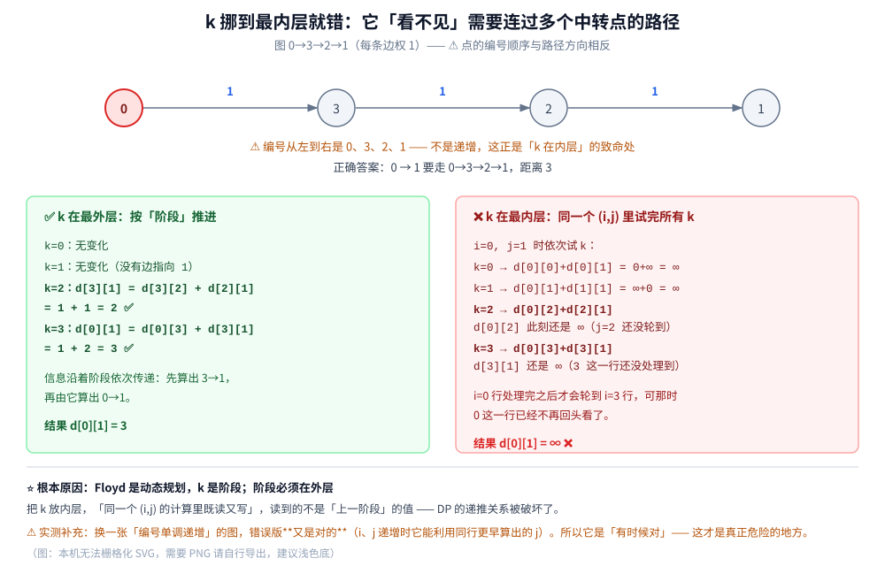

# Floyd 最短路

> **一次算出所有点对之间**的最短距离：三行核心代码、为什么 `k` 必须放在最外层（**放内层会算错，本机实测**）、
> 负环怎么看对角线、路径怎么还原，以及**可达性判断不能省**（`INF + 负权 < INF` 会把「不可达」污染成假值）。
>
> ⭐ 这是「最短路三部曲」的完结篇：[Dijkstra.md](Dijkstra.md)（单源 + 非负权）→ [Bellman-Ford.md](Bellman-Ford.md)
> （单源 + 负权 + 负环）→ **本篇**（全源 + 负权 + 负环）。三篇用的是同一套「松弛」动作，差的是**顺序与范围**。
>
> 内容整理自个人学习笔记，素材见 [素材清单](../../../../素材清单.md)。邻接矩阵与图的表示见 [图的表示与存储.md](../../../数据结构/图/图的表示与存储.md)；
> 复杂度口径见 [复杂度分析.md](../../基础算法/复杂度分析.md)。
>
> 📎 本篇所有输出均为本机实跑逐字抄录：**Go 1.26.5（windows/amd64）** 与 **JDK 1.8.0_321** 各实现一份，
> 输出**逐行对齐**（90 行里 diff 只剩实验五的耗时数据）。

---

## 一、Floyd 是怎么算的？

**本节要点**：三行代码，但 `k` 的含义要一次看懂 —— **不是「中转点是谁」，而是「允许经过前 k 个点」**。它是**阶段**，不是循环变量。

### 1.1 全源问题的三种解法

前两篇都是**单源**（一个起点到所有点）。要「任意两点之间的距离」：

| 做法 | 复杂度 | 说明 |
|---|---|---|
| 跑 `V` 次 Dijkstra | `O(V · (V+E) log V)` | ⚠️ 要求非负权 |
| 跑 `V` 次 Bellman-Ford | `O(V² · E)` | 能处理负权，但慢 |
| **Floyd** | **`O(V³)`** | ✅ 能处理负权、代码最短、常数小 |

⭐ **Floyd 的独特之处**：它不关心边的「起点」，而是用一个**二维矩阵**同时维护所有点对 —— 每一轮都在整个矩阵上做一次操作。

### 1.2 三行核心代码

```text
for k := 0; k < n; k++ {          // ← 阶段：允许经过哪些点中转
    for i := 0; i < n; i++ {      // 起点
        for j := 0; j < n; j++ {  // 终点
            d[i][j] = min(d[i][j], d[i][k] + d[k][j])
        }
    }
}
```

**`k` 的准确含义**：第 `k` 轮结束时，`d[i][j]` = 「从 `i` 到 `j`、**只允许经过 `{0, 1, …, k}` 这些点**中转」的最短距离。

| 初始 | `d[i][j]` = 直接边的权（无边为 `∞`），`d[i][i] = 0` |
|---|---|
| `k = 0` | 允许经过 `0` 中转 —— 相当于「最多 1 个中转点」 |
| `k = 1` | 允许经过 `0、1` 中转 —— 「最多 2 个中转点」 |
| … | … |
| `k = n−1` | 任意点都能当中转 —— 就是最终答案 |

⭐ **这就是动态规划的状态定义**：`dp[k][i][j]` 表示「只允许前 `k` 个点中转」，而 `k` 从 `0` 递推到 `n−1`。**`k` 是阶段（stage），必须在外层。**

### 1.3 逐步推演（本机实跑）


```text
=========== 实验一：逐步推演（k 逐轮放开中转权限）===========
  图（有向）：0→1(3)  1→2(1)  0→2(10)  2→3(2)  1→3(7)  3→0(4)

  初始矩阵（行=起点，列=终点）：
     [0 3 10 ∞] | [∞ 0 1 7] | [∞ ∞ 0 2] | [4 ∞ ∞ 0]

  === k = 0：只允许经过 {0..0} 这些点中转 ===
     d[3][1] = 7  （经 0 中转）
     d[3][2] = 14  （经 0 中转）
     矩阵：[0 3 10 ∞] | [∞ 0 1 7] | [∞ ∞ 0 2] | [4 7 14 0]

  === k = 1：只允许经过 {0..1} 这些点中转 ===
     d[0][2] = 4  （经 1 中转）
     d[0][3] = 10  （经 1 中转）
     d[3][2] = 8  （经 1 中转）
     矩阵：[0 3 4 10] | [∞ 0 1 7] | [∞ ∞ 0 2] | [4 7 8 0]

  === k = 2：只允许经过 {0..2} 这些点中转 ===
     d[0][3] = 6  （经 2 中转）
     d[1][3] = 3  （经 2 中转）
     矩阵：[0 3 4 6] | [∞ 0 1 3] | [∞ ∞ 0 2] | [4 7 8 0]

  === k = 3：只允许经过 {0..3} 这些点中转 ===
     d[1][0] = 7  （经 3 中转）
     d[2][0] = 6  （经 3 中转）
     d[2][1] = 9  （经 3 中转）
     矩阵：[0 3 4 6] | [7 0 1 3] | [6 9 0 2] | [4 7 8 0]

  最终矩阵：[0 3 4 6] | [7 0 1 3] | [6 9 0 2] | [4 7 8 0]
  一共 10 次更新（三重循环共 4³ = 64 次内层尝试）
  ⭐ k 的含义：第 k 轮结束时，d[i][j] = 「只允许经过 {0..k} 这些点中转」的最短距离
     k 从 0 走到 n-1，中转点集合逐步扩大，最后覆盖「任意点都可以中转」
```

三处值得停下来看一眼：

1. **`k = 0` 只有第 3 行变了** —— 因为只有点 `3` 有指向 `0` 的边，别的起点根本用不上 `0` 这个中转；
2. **`k = 1` 时 `d[3][2]` 从 14 变成 8**，走的却是 `3→0→1→2` —— **经过的中转点是 `0` 和 `1` 两个**。这说明第 `k` 轮用的是**前几轮已经算好的结果**（`d[3][1]` 是 `k=0` 那轮算出来的），阶段之间是有依赖的；
3. **`k = 3` 之前，任何一行都没法到达 `0`**（`d[i][0]` 全是 `∞`），直到允许经过 `3` 中转才通了 —— 这就是「中转点集合逐步放开」的直接体现。

### 1.4 复杂度：为什么是 O(V³)

三重循环，每层都是 `n` —— `n³` 次内层操作。**与边数完全无关**（哪怕图里只有一条边，也要跑完 `n³` 次）。

⭐ 这既是它的缺点（稀疏图上很浪费），也是它的优点（**稠密图上边数本来就有 `V²` 量级，`V³` 与 `V·E` 同阶**，而 Floyd 的常数更小 —— 实验五实测）。

---

## 二、为什么 `k` 必须在最外层？

**本节要点**：这是本篇最值钱的一节。`k` 放内层**不会报错、不会崩**，只会在**某些图上**给出错误答案 —— 而「某些图」的条件，实测发现比想象的更宽松。

### 2.1 它是动态规划，`k` 是阶段

把 `k` 放内层写成 `for i { for j { for k { ... } } }`，等于在说：

> 对每一对 `(i, j)`，我一次性把所有中转点都试一遍。

**问题在于**：试 `k` 的时候，`d[i][k]` 和 `d[k][j]` 的值**可能还没算好**。

| | `k` 在外层 | `k` 在内层 |
|---|---|---|
| 计算 `d[i][j]` 时，`d[i][k]`、`d[k][j]` 是什么值 | 是**上一阶段**（`k−1`）的结果，已经完整 | 不确定 —— 取决于 `i`、`j` 的遍历顺序 |
| 符合 DP 的「用上一阶段推这一阶段」吗 | ✅ | ❌ 同一个阶段里既读又写 |

⭐ 一句话：**DP 的阶段不能在循环里被「打散」**。

### 2.2 放在内层会怎样（本机实测）



用一个**编号与路径方向相反**的图：`0 → 3 → 2 → 1`（每条边权 1）。正确的最短路 `0 → 1` 要走 `0→3→2→1`，距离 3。

```text
=========== 实验二：⚠️ 把 k 挪到最内层，答案就错了 ===========
  图：0→3→2→1（每条边权 1）—— ⚠️ 编号顺序与路径方向**相反**
     正确的最短路 0→1 要走 0→3→2→1，距离 3
  k 在最外层（正确）：[0 3 2 1] | [∞ 0 ∞ ∞] | [∞ 1 0 ∞] | [∞ 2 1 0]
  k 在最内层（错误）：[0 ∞ 2 1] | [∞ 0 ∞ ∞] | [∞ 1 0 ∞] | [∞ 2 1 0]
  d[0][1]：正确 = 3，错误 = ∞
  ⚠️ 错误版把 0→1 留在 ∞ —— 它「看不见」需要连过 3 和 2 的路径。
```

**为什么错误版看不见**：处理 `i=0, j=1` 时它依次试每个 `k`：

| 试的 `k` | 用到什么 | 当时的值 | 结果 |
|---|---|---|---|
| `k=2` | `d[0][2]` | 还是 `∞`（`j=2` 还没轮到） | 失败 |
| `k=3` | `d[3][1]` | 还是 `∞`（`i=3` 这一行根本还没处理） | 失败 |

⭐ **根因**：`i=0` 这一行的计算，需要 `i=3` 那一行**先算好** —— 而 `i` 是从小到大遍历的，`3` 排在 `0` 后面。**信息传递的方向和遍历的方向对不上，就断了。**

### 2.3 ⚠️ 换一张图，它又是对的

实验二里还留了一句实测发现，值得单独强调：

```text
  ⚠️ 顺带一个实测发现：**换一张图，错误版可能又是对的**。
     因为 i、j 从小到大遍历时，错误版能利用「同一行里更早算出的 j」——
     只要路径编号恰好单调递增，它就能一路推下去。**它对不对取决于图，这才是真危险。**
```

⭐ 我第一版用的是 `0→1→2→3→4` 这条**编号递增**的链，实测 `两者相同 = true` —— 错误版**完全正确**。原因是 `j` 递增时，`d[i][j]` 能用上同一行里更小的 `j` 已经算好的值，一路推导下去就够了。

⚠️ **所以「`k` 放内层」的可怕之处不是「一定错」，而是「有时候对」**：测试用例碰巧编号友好就发现不了，上线遇到一个编号不巧的图就静默给出错答案。**这类 bug 最难查。**

---

## 三、负权、负环与「不可达」的坑

**本节要点**：Floyd 能处理负权（与 BF 一致），负环看对角线，但**有个前提：可达性判断不能省** —— 省掉之后 `INF` 会被负权污染成假值。

### 3.1 负权可以

```text
  (a) 带一条负权边（无负环）
  图：0→1(2)  0→2(5)  2→1(-4)  1→3(1)
  Floyd = [0 1 5 2] | [∞ 0 ∞ 1] | [∞ -4 0 -3] | [∞ ∞ ∞ 0]
  ⭐ 与 [Bellman-Ford.md](Bellman-Ford.md) 实验三的 [0 1 5 2] 完全一致 —— Floyd 不要求非负权
```

⭐ 三篇用的是**同一张图**：Dijkstra 给出 `[0 1 5 3]`（错），Bellman-Ford 与 Floyd 都给 `[0 1 5 2]`（对）。**这是「有负权必须换算法」最紧凑的一组对照。**

### 3.2 负环：看对角线

```text
  (b) 带负环：对角线会变负
  图：0→1(1)  0→2(5)  1→2(1)  2→1(-10)（回路 1→2→1 总权 -9）
  Floyd 结果 = [0 -8 -7] | [∞ -9 -8] | [∞ -19 -18]
  对角线 = [0 -9 -18]，为负的下标 = [1 2] → 有负环 = true
```

**判据**：`d[i][i] < 0` ⇔ 从 `i` 出发绕一圈能让自己变短 ⇔ `i` 在（或可达）负环上。

⭐ **与 Bellman-Ford 的判据是同一件事的两种表达**：

| | 判据 | 直觉 |
|---|---|---|
| Bellman-Ford | 第 `V` 轮还能松弛 | 「还存在更短的简单路径之外的走法」 |
| **Floyd** | **`d[i][i] < 0`** | 「自己到自己绕一圈竟然是负的」 |

⚠️ Floyd 的判据更直接（一行就能查整个矩阵），但代价是它已经花了 `O(V³)` —— 只为判负环的话用 BF 更划算。

### 3.3 ⚠️ 可达性判断不能省

这是本篇实测里**最容易忽略**的一个坑：

```text
=========== 实验六：⚠️ 省掉可达性判断会怎样 ===========
  同一张 4 点图，只把内层的 `d[i][k] < INF && d[k][j] < INF` 判断去掉：
    带判断（正确）：[0 1 5 2] | [∞ 0 ∞ 1] | [∞ -4 0 -3] | [∞ ∞ ∞ 0]
    无判断        ：[0 1 5 2] | [∞ 0 ∞ 1] | [536870908 -4 0 -3] | [∞ 536870908 ∞ 0]
    ⚠️ 注意 536870908 这种数：它是 INF(536870912) 加上负权之后的「假值」
       —— 看起来像「可达但很长」，其实是**不可达**。
```

⭐ **机理**：`INF = 536870912`，而 `INF + (−4) = 536870908 < INF` —— **「不可达」被更新成了一个比 `INF` 略小的数**。

⚠️ **后果比「数字难看」严重得多**：

| 受害点 | 表现 |
|---|---|
| 可达性判断（`d[i][j] < INF`） | 失效 —— 假值比 `INF` 小，会被当成「可达」 |
| 负环检测（`d[i][i] < 0`） | 不受影响（假值仍是正数），但如果后续再叠一次负权就可能变负 → **误报负环** |
| 路径还原 | `next` 矩阵被污染，还原出根本不存在的路径 |

⭐ **两条正确做法**（选一条）：

```go
// 做法 A：内层加可达性判断（推荐，绝对安全）
if d[i][k] < INF && d[k][j] < INF {
    if nd := d[i][k] + d[k][j]; nd < d[i][j] { ... }
}

// 做法 B：不加判断，但必须挑一个「INF + INF 也不溢出」的哨兵
const INF = 1 << 29   // ⚠️ 不是 1<<30 —— 见 5.2
```

⚠️ 注意：**图里全是正权时，做法 B 是安全的**（`INF + w ≥ INF`，不会被更新）。**只有负权才会踩这个坑** —— 而「有没有负权」恰恰是运行时才知道的事。

---

## 四、路径还原

**本节要点**：一个 `next` 矩阵就够了，但**更新时写哪个下标**容易记反。

### 4.1 next 矩阵

```text
=========== 实验四：路径还原（next 矩阵）===========
  最终矩阵：[0 3 4 6] | [7 0 1 3] | [6 9 0 2] | [4 7 8 0]
  0 → 3 ：0 → 1 → 2 → 3   距离 6
  2 → 0 ：2 → 3 → 0   距离 6
  1 → 0 ：1 → 2 → 3 → 0   距离 7
  3 → 2 ：3 → 0 → 1 → 2   距离 8
  ⭐ next 矩阵的语义：next[i][j] = 「从 i 去 j，下一步该走哪个点」
```

**初始化**：`next[i][j] = j`（只要有直接边 `i→j`，下一步就走 `j`）；无边的置 `-1`。

**更新**：当 `k` 让 `i→j` 变短时，记 `next[i][j] = next[i][k]`。

⚠️ **这里最容易写反**：为什么是 `next[i][k]` 而不是 `next[k][j]`？

⭐ **因为「走法」是：先按 `i→k` 的方式走到 `k`，再按 `k→j` 走到 `j`。** 所以「从 `i` 出发的第一步」应该继承 `i→k` 那条路径的第一步，即 `next[i][k]`。

| 写法 | 含义 | 对不对 |
|---|---|---|
| `next[i][j] = next[i][k]` | 「第一步沿用 `i→k` 的第一步」 | ✅ |
| `next[i][j] = next[k][j]` | 「第一步直接跳到 `k→j` 的第一步」 | ❌ 会跳过 `i→k` 那段 |

**还原路径**：从 `i` 出发，反复 `cur = next[cur][j]` 直到 `cur == j`。

---

## 五、复杂度与选型

**本节要点**：Floyd 在**稠密图**上会反超「跑 `V` 次 Dijkstra」；而 `INF` 的取法还会引出**跨语言**的坑。

### 5.1 O(V³) vs V 次 Dijkstra（本机实测）

```text
=========== 实验五：Floyd vs 跑 V 次 Dijkstra（复杂度对照）===========
  图                            V        E    Floyd ms  V×Dijkstra ms       结果一致
  稀疏 300 点                   300     1200       18.00          11.77       true
  稠密 300 点                   300    22819       25.43          41.27       true
  ⭐ Floyd 是 O(V³)，与边数无关；V 次 Dijkstra 是 O(V·(V+E)logV)【用堆】
     → 稀疏图上 Dijkstra 占优；稠密图（E ≈ V²）上两者同为 O(V³) 量级，Floyd 的常数更小
  ⚠️ 但 Floyd 能处理负权、还能一次拿到全源 —— Dijkstra 两者都不行
```

本机多轮运行的范围：

| 图 | `V` | `E` | Floyd | `V` 次 Dijkstra | 谁快 |
|---|---|---|---|---|---|
| 稀疏 300 点 | 300 | 1200 | 18.1 ~ 26.7 ms | 11.7 ~ 12.2 ms | **Dijkstra 快 1.5 ~ 2.2×** |
| 稠密 300 点 | 300 | 22819 | 25.0 ~ 27.6 ms | 39.9 ~ 44.5 ms | **Floyd 快 1.5 ~ 1.8×** |

⭐ **结论**（只断言趋势）：

- **稀疏图**：Floyd 把大量时间花在「`∞ + ∞` 这种无意义的尝试」上 —— `V³ = 2.7×10⁷` 次里绝大多数是白做的。跑 `V` 次 Dijkstra 只做 `V·(V+E) log V` 量级的工作，快一倍多；
- **稠密图**：`E ≈ V²` 时两者同为 `O(V³)` 量级，而 Floyd 的「一次数组加法」比 Dijkstra 的「一次堆操作」便宜 —— **Floyd 反超**。

⚠️ 但**性能不是选它的理由**。选 Floyd 的真实理由只有两条：**① 需要负权；② 需要全源**。

### 5.2 ⚠️ INF 取值会引出跨语言差异

```text
  ⭐ 后果②：INF 若取 1<<30，两语言还会分道扬镳 ——
     Go 的 int（amd64 是 64 位）：1<<30 + 1<<30 = 2147483648（正数，安全）
     ⚠️ 降成 32 位后回绕成 -2147483648（负数！Java 的 int 正是 32 位）
  本实现取 INF = 1<<29 = 536870912，则 INF+INF = 1073741824，**在 int32 内也不溢出**
```

⭐ **同一份算法、同一个 `INF`，Go 和 Java 的行为可能不同**：

| 语言 | `int` 宽度 | `1<<30 + 1<<30` |
|---|---|---|
| Go（amd64） | 64 位 | `2147483648`（正数） |
| Java | **32 位** | **`-2147483648`（回绕成负数！）** |

⚠️ 一旦回绕成负数，它比任何真实距离都小 → **整个矩阵被污染成负数**，看起来像「到处都是负环」。

⭐ 附带一条：**Go 编译器能在编译期直接拒绝「常量相加溢出 `int32`」**（本机实测：`invalid operation: ... overflows int32`），Java 则老老实实回绕。**Go 更严格，但这不代表写 Go 就可以不管 `INF`** —— 变量参与运算时同样不报错。

### 5.3 三个最短路算法怎么选

| 场景 | 选谁 | 理由 |
|---|---|---|
| 无权 / 等权 | **BFS** | `O(V+E)`，常数最小 |
| 单源 + 非负权 | **Dijkstra** | `O((V+E) log V)` |
| 单源 + 负权 | **Bellman-Ford**（或 SPFA） | 见 [Bellman-Ford.md](Bellman-Ford.md) |
| **全源 + 稠密图** | **Floyd** | `O(V³)` 与 `O(V·E)` 同阶、常数更小，代码最短 |
| 全源 + 稀疏图 | 跑 `V` 次 Dijkstra | Floyd 的 `V³` 在稀疏图上浪费 |
| 要定位负环 | **Bellman-Ford** | 能给出环上的顶点序列；Floyd 只能判「有」 |

⭐ 再压缩成一句：**「稠密 + 要全源 + 可能有负权」这三条同时成立时，Floyd 几乎没有对手。**

---

## 使用：这条算法在你的系统里以什么形式出现

Floyd 在业务代码里的出场率比 Dijkstra 还低，但它有一个**变体**用得非常广。结合本仓库已有篇目逐层看：

**第一层：传递闭包 —— Floyd 换个运算符就是「可达性」**。把 `min` 换成 `or`、把 `+` 换成 `and`，`O(V³)` 的三重循环就变成「任意两点之间是否连通」：

```text
for k { for i { for j { reach[i][j] = reach[i][j] || (reach[i][k] && reach[k][j]) } } }
```

⚠️ 别小看这个「换运算符」：它正好是**依赖关系的传递闭包**。你项目里每天都在用它的场景：

| 场景 | 点 | 边 |
|---|---|---|
| **依赖分析**（构建系统 / 包管理） | 模块、包 | 「A 依赖 B」 |
| **权限继承**（RBAC） | 角色 | 「角色 A 继承角色 B」 |
| **调用链可达性**（微服务） | 服务 | 「A 会调 B」 |
| **数据库的 `WITH RECURSIVE`** | 行 | 外键 / 组织树 |

⭐ **判据**：当你要问的不是「多远」而是「**能不能到**」时，把 Floyd 的运算符换掉即可 —— 这也是为什么它有时被叫「Warshall 算法」（Warshall 提出的是传递闭包版本，Floyd 是加权最短路版本，通常合称 Floyd-Warshall）。

**第二层：小规模全源 —— 配置校验与拓扑分析**。网络设备、容器网络、集群拓扑这类**规模小（几十到几百个点）又需要全局视角**的场景，Floyd 很合适：一次算完任意两点距离，然后回答「哪两个点的距离最大（网络直径）」「某些点是不是离得太远」。⚠️ 这类需求的共性是**要反复查询任意点对**，而不是只关心一个源点 —— 那正是「全源」的定义。

**第三层：为什么大规模图不用它**。`O(V³)` 的杀伤力在规模上：`V = 1 万` 就是 `10¹²` 次操作，跑不完。所以地图导航、物流路径这种**大图**用的是：

| 技术 | 思路 | 复杂度（预处理后单次查询） |
|---|---|---|
| Dijkstra + A*（见 [Dijkstra.md](Dijkstra.md) 5.2） | 用启发式朝目标方向搜 | `O((V+E) log V)` |
| **Contraction Hierarchies / 层次预处理** | 预处理出「主干道」，查询时只在主干上走 | 近 `O(log V)` |
| 地标法（ALT） | 用少量地标点做三角不等式剪枝 | 视预处理而定 |

⚠️ 这些技术的共同点是：**把「一次算出所有点对」换成「预处理 + 快速单次查询」** —— 因为真实需求是「查很多次单点对」，而不是「要一张完整矩阵」。

⭐ **归纳成一条判断**：**Floyd 的价值在于「一次拿到完整的距离矩阵」**。所以选它的唯一理由应该是「下游真的需要反复查任意点对」—— 而不是「它的代码最短」。

---

## 延伸追问

- **为什么 `k` 放内层就会错？** → 因为 Floyd 是 **DP**，`k` 是**阶段**。放内层等于「同一个阶段里既读又写」，读到的不再是上一阶段的值（本机实验二实测 `d[0][1]` 从 3 变成 `∞`）。⚠️ 而且它**不会报错**，只在某些图上静默出错（2.3）。
- **那为什么错误版有时候又是对的？** → `i`、`j` 从小到大遍历时，它能利用「同一行里更早算出的 `j`」。**只要路径编号恰好单调递增就能一路推下去**（本机第一版实验就是这个结果）。⚠️ 「有时候对」比「总是错」危险得多。
- **Floyd 能处理负权吗？** → **能**，而且与 Bellman-Ford 的结果一致（本机实验三用同一张图对照：两者都是 `[0 1 5 2]`）。它不需要「非负权」这个前提 —— 与 [Dijkstra.md](Dijkstra.md) 不同。
- **负环怎么判？** → 看**对角线**：`d[i][i] < 0` 就有负环（本机实测 `[0 -9 -18]`）。⭐ 这与 Bellman-Ford 的「第 `V` 轮还能松弛」是同一件事的两种表达 —— 前者说「绕一圈更便宜」，后者说「还存在非简单路径的更优走法」。
- **`INF + 负数` 会怎样？** → **会变成一个比 `INF` 略小的假值**（本机实测 `536870912 + (−4) = 536870908`），于是「不可达」被错误地当成「可达」（3.3）。⚠️ **只有负权会踩这个坑**，正权时 `INF + w ≥ INF` 是安全的。
- **能不能省掉那个可达性判断？** → **能，但必须挑一个「`INF + INF` 不溢出」的哨兵**（如 `1 << 29`）。⚠️ 而且 `INF` 的取法还会引出跨语言的差异：`1 << 30` 在 Go（64 位 `int`）下安全，在 Java（32 位 `int`）下会回绕成负数（5.2）。
- **路径还原为什么写 `next[i][j] = next[i][k]`？** → 因为走法是「**先按 `i→k` 走**，再按 `k→j` 走」（第四节）。所以「从 `i` 出发的第一步」要继承 `i→k` 的第一步。写成 `next[k][j]` 会跳过前面那段。
- **为什么 `d[i][i] = 0` 而不是 `∞`？** → 因为「自己到自己」的代价是 0，而且初始化为 0 才能让「经过 `k` 中转」的更新正常生效（`d[i][k] + d[k][k] = d[i][k] + 0` 是个无害的恒等更新）。⚠️ 另外 `d[i][i] = 0` 是负环检测的基准：一旦它变成负数，就说明绕了一圈反而更短。
- **Floyd 和 Warshall 是两个算法吗？** → **同一套三重循环的两个版本**：Warshall 用布尔运算算**传递闭包**（「能不能到」），Floyd 用 `min/+` 算**加权最短路**（「多远」）。通常合称 Floyd-Warshall。⚠️ 这也说明这个三重循环的框架比「最短路」这个用途更通用（见「使用」第一层）。
- **卡在中间层怎么办：图不大但要跑很多次？** → 直接存**距离矩阵**（Floyd 的输出就是它），后续查询 `O(1)`。⚠️ 这正是 Floyd 相对「跑 `V` 次 Dijkstra」的隐性优势：**两者的产物形态一样，但 Floyd 一次算完，不用为每次查询重新准备数据结构。**

## 关联

- [Dijkstra.md](Dijkstra.md) — 单源 + 非负权；本篇实验三用**同一张图**证明「Dijkstra 错、Floyd 对」
- [Bellman-Ford.md](Bellman-Ford.md) — 单源 + 负权 + 能**定位**负环；本篇 3.2 的「看对角线」与它的「第 V 轮还能松弛」是同一判据的两种表达
- [图的表示与存储.md](../../../数据结构/图/图的表示与存储.md) — **邻接矩阵**（本篇的数据结构基础）与邻接表的对照
- [复杂度分析.md](../../基础算法/复杂度分析.md) — `O(V³)` 与 `O(V·(V+E) log V)` 的推导口径
- [霍夫曼编码.md](../../贪心/霍夫曼编码.md) — 另一篇「有完整正确性证明」的样板：**最优子结构 + 阶段递推**，与本篇 1.2 的 DP 状态定义同源
- [BFS广度优先遍历.md](../图的遍历/BFS广度优先遍历.md) — 无权图最短路与**Kahn 拓扑**；拓扑序本身就是一种「阶段」
- [网络通信链路详解.md](../../../网络/网络通信链路详解.md) — 「使用」第二层：网络拓扑的可达性与直径分析
> 反向引用（本篇被下列文档引到）：[背包问题.md](../../动态规划/背包问题.md)、[GDS图算法实战.md](../../../../03-数据与中间件/数据存储/图数据库/Neo4j/GDS图算法实战.md)
