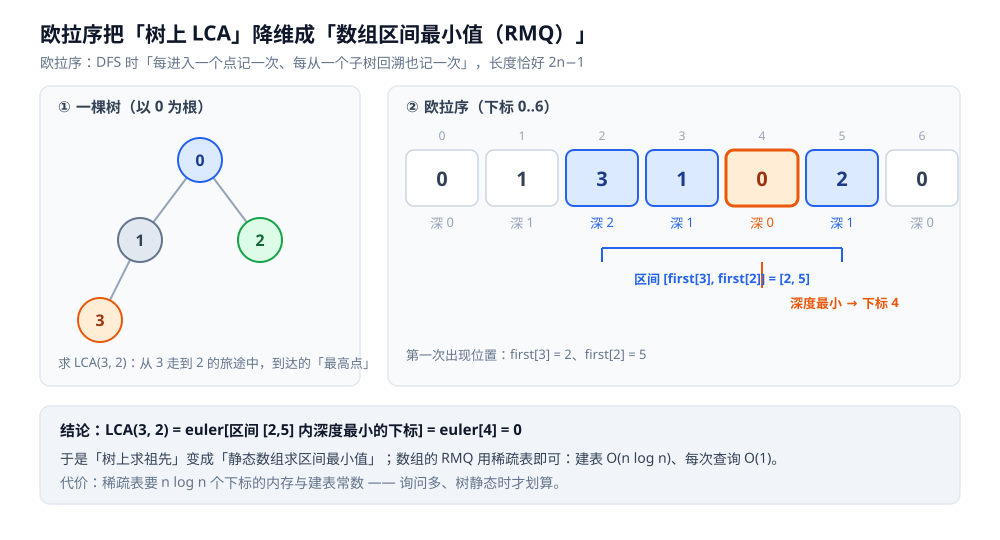
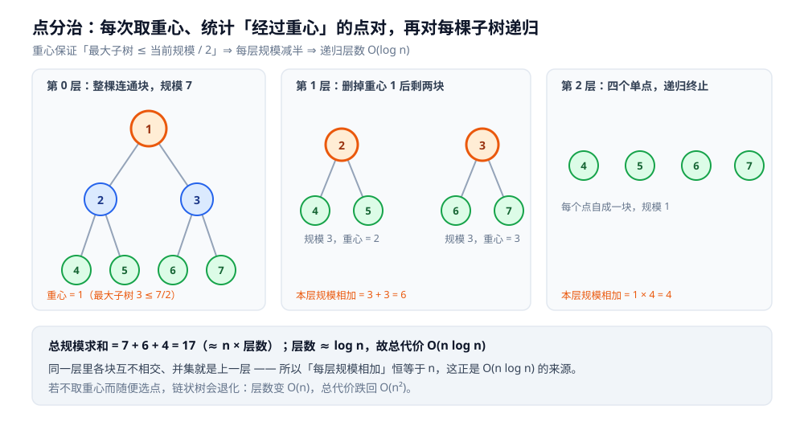

# 树上问题（LCA · 树上差分 · 点分治）

> 树是一张特殊的图 —— **无环**，所以任意两点之间的路径**唯一**。
> 正是这一点让树上长出了一批一般图没有的武器：
> **LCA**（最近公共祖先）、**树上差分**、**点分治**、**直径与重心**。
> 这一篇把这四件套的原理、彼此关系与代价讲透。
>
> ⭐ 边界先说清：树的结构、遍历、dfs 序见 [树的遍历.md](../../数据结构/树/树的遍历.md)；
> 树的路径 / 子树如何拍成连续区间见 [树链剖分.md](../高级技巧/树链剖分.md)（剖分也能顺手求 LCA，与本篇互为对照）；
> 二叉树的 LCA 与验证 BST 见 [树与二叉搜索树算法.md](../基础算法/树与二叉搜索树算法.md)；
> 并查集本体见 [并查集.md](../../数据结构/高级数据结构/并查集.md)；
> 把不等式组转成图上路径约束见 [差分约束.md](差分约束.md)。
>
> 内容整理自个人学习笔记，素材见 [素材清单](../../../素材清单.md)。

---

## 一、树上问题的四件套

**本节要点**：树上能做这些，全靠「**路径唯一**」这一条性质；四件套各自回答一个不同的问题。

| 武器 | 回答的问题 | 复杂度 | 依赖 |
|---|---|---|---|
| **LCA** | 两条到根的路径在哪里分叉？ | 预处理 `O(n log n)`，单次 `O(log n)` | 倍增 / 欧拉序+RMQ / Tarjan |
| **树上差分** | `m` 次「路径整体加」怎么不沿路逐点走？ | `O(m log n + n)` | LCA |
| **点分治** | 满足某性质的**点对**有多少个？ | `O(n log n)` | 树的重心 |
| **树的直径 / 重心** | 这棵树「有多长」「从哪里断开最匀」？ | `O(n)` | 两次 DFS / 子树大小 |

⭐ 关键洞察：一般图上「两点间路径」可能有多条甚至无穷多条，所以「沿路径修改」「路径端点」这些概念根本不成立；
树**无环 ⇒ 路径唯一**，才让上面四件事都变成良定义、可分解的问题。

**建图约定**：本篇全部用邻接表存无向树，**任选一个点当根**（这里取 0），
于是「无根树」变成「有根树」——父子关系、深度、子树都随之确定。
下文所有代码都在这个约定下：`adj[u]` 是 `u` 的邻居，`parent[u]` 是 `u` 的父节点。

```go
type Tree struct {
	n      int
	adj    [][]int
	parent []int
	depth  []int
	child  [][]int
}

// 以 root 为根，一遍 BFS 定出 parent / depth / child
func NewTree(n int, edges [][2]int, root int) *Tree {
	t := &Tree{n: n, adj: make([][]int, n)}
	for _, e := range edges {
		u, v := e[0], e[1]
		t.adj[u] = append(t.adj[u], v)
		t.adj[v] = append(t.adj[v], u)
	}
	t.parent = make([]int, n)
	t.depth = make([]int, n)
	t.child = make([][]int, n)
	for i := range t.parent {
		t.parent[i] = -1
	}
	queue := []int{root}
	t.parent[root] = root
	for h := 0; h < len(queue); h++ {
		u := queue[h]
		for _, v := range t.adj[u] {
			if v == t.parent[u] {
				continue
			}
			t.parent[v] = u
			t.depth[v] = t.depth[u] + 1
			t.child[u] = append(t.child[u], v)
			queue = append(queue, v)
		}
	}
	return t
}
```

---

## 二、LCA 解法一：倍增

**本节要点**：把「往上跳任意步」拆成若干个 **2 的幂**，于是每次跳跃都 `O(1)` 查表。

先做一个**预处理表** `up[j][u]` = `u` 的第 `2^j` 级祖先：

```text
up[0][u] = parent[u]
up[j][u] = up[j-1][ up[j-1][u] ]      // u 的第 2^j 级祖先 = 「先跳 2^(j-1) 再跳 2^(j-1)」
```

有了它，求 `LCA(u, v)` 分两步：

1. **拉平深度**：不妨设 `depth[u] ≥ depth[v]`，把 `u` 往上跳 `d = depth[u] - depth[v]` 步。
   `d` 写成二进制，为 1 的那一位就跳对应的 `up[j]`——**一次跳跃覆盖 2 的幂步**，`O(log n)` 次搞定。
2. **一起上跳**：从高位到低位试跳，只要 `up[j][u] != up[j][v]` 就同时跳（说明还没到分叉点之上）；
   循环结束时 `u`、`v` 的父亲就是 LCA。

```go
func (t *Tree) buildUp() [][]int {
	LOG := 1
	for (1 << LOG) <= t.n {
		LOG++
	}
	up := make([][]int, LOG)
	up[0] = t.parent
	for j := 1; j < LOG; j++ {
		up[j] = make([]int, t.n)
		for i := 0; i < t.n; i++ {
			up[j][i] = up[j-1][up[j-1][i]]
		}
	}
	return up
}

func (t *Tree) lca(up [][]int, u, v int) int {
	if t.depth[u] < t.depth[v] {
		u, v = v, u
	}
	// 第一步：把 u 提到与 v 同深
	for j, d := 0, t.depth[u]-t.depth[v]; d > 0; j, d = j+1, d>>1 {
		if d&1 == 1 {
			u = up[j][u]
		}
	}
	if u == v {
		return u
	}
	// 第二步：一起提到分叉点下方
	for j := len(up) - 1; j >= 0; j-- {
		if up[j][u] != up[j][v] {
			u, v = up[j][u], up[j][v]
		}
	}
	return up[0][u]
}
```

**实测**（容器 `golang:1.26-alpine`，Go 1.26.8；`n = 100000`、`q = 50000` 组随机询问，固定种子）：

```text
[倍增]  查询期跳跃次数合计 = 963201      （平均每次询问 19.3 次跳跃）
```

`19.3` 很贴合 `2·log₂n ≈ 34` 与你的直觉：一次询问里，第一步最多跳 `log n` 次、
第二步固定跳 `LOG ≈ 17` 次，量级就是 `O(log n)`。

⭐ 倍增的价值不止 LCA —— 它是**「跳 2 的幂」这个通用手法**：树上第 `k` 级祖先、
求链上第 `k` 大、甚至 [快速幂](../数学基础/数论基础.md) 的指数折半，都是同一个念头。

---

## 三、LCA 解法二：欧拉序 + 稀疏表（RMQ）

**本节要点**：把「树上的 LCA」**降维**成「数组上的区间最小值」—— 于是树上问题变成一维问题。

**欧拉序**：DFS 时，**每进入一个点记一次，每从一个子树回溯上来再记一次**。
走完一整棵树，序列长度恰好 `2n - 1`（每条边往返各贡献一次）。

```text
以 0 为根：     0
              / \
             1   2
            /
           3

欧拉序 = 0 1 3 1 0 2 0        （长度 2×4-1 = 7）
深度序 = 0 1 2 1 0 1 0
```



⭐ 核心性质：**`LCA(u, v)` 就是欧拉序里 `first[u]..first[v]` 这段区间中，「深度最小」的那个点**
（`first[u]` 是 `u` 第一次出现的位置）。因为这段欧拉序恰好描述了「从 `u` 走到 `v`」这趟旅程，
而旅途中到达的**最高点**就是分叉点。

于是 LCA 问题变成：静态数组、`q` 次**区间最小值查询（RMQ）**→ 直接上**稀疏表（ST 表）**：
`st[j][i]` 存区间 `[i, i+2^j)` 的最小值下标，建表 `O(n log n)`，之后的每次查询 `O(1)`。

```go
// 稀疏表：st[j][i] = 区间 [i, i+2^j) 中深度最小的下标
func buildST(dep []int) [][]int {
	m := len(dep)
	K := 1
	for (1 << K) <= m {
		K++
	}
	st := make([][]int, K)
	st[0] = make([]int, m)
	for i := range st[0] {
		st[0][i] = i
	}
	for j := 1; j < K; j++ {
		half := 1 << (j - 1)
		st[j] = make([]int, m-(1<<j)+1)
		for i := range st[j] {
			a, b := st[j-1][i], st[j-1][i+half]
			if dep[a] <= dep[b] {
				st[j][i] = a
			} else {
				st[j][i] = b
			}
		}
	}
	return st
}
```

**实测**（同一棵 `n = 100000` 的树）：

```text
[欧拉序 + RMQ]  建表操作数 = 3337857（一次 O(n log n)），此后每次询问只查两次表 → O(1)
```

⚠️ **代价的取舍**：RMQ 把单次查询压到 `O(1)`，但**建表常数与内存都更大**（`n log n` 个下标）。
`q` 不大时，这点预处理的收益盖不过倍增的简单。**要在线 + 询问极多 + 不修改**时它才划算。

---

## 四、LCA 解法三：Tarjan 离线

**本节要点**：把**所有询问一次性读进来**，一次 DFS 走完整棵树就全部答完 —— 代价是「必须离线」。

做法基于一个观察：当 DFS 回溯到某个点 `u` 时，
**凡是与 `u` 相关的、且另一端已经回溯完毕的询问**，其 LCA 一定是「那一端所在集合的当前代表」。

用一个**并查集**维护「已回溯完的子树」：回溯完一个子树就把它并进父节点；
另用 `ancestor[x]` 记录每个集合代表对应的「当前最高点」。

```go
func (t *Tree) tarjanOffline(queries [][2]int) []int {
	dsu := make([]int, t.n)
	anc := make([]int, t.n)
	visited := make([]bool, t.n)
	for i := range dsu {
		dsu[i] = i
	}
	qs := make([][]struct{ other, idx int }, t.n)
	for i, q := range queries {
		u, v := q[0], q[1]
		qs[u] = append(qs[u], struct{ other, idx int }{v, i})
		qs[v] = append(qs[v], struct{ other, idx int }{u, i})
	}
	ans := make([]int, len(queries))

	var find func(x int) int
	find = func(x int) int {
		if dsu[x] != x {
			dsu[x] = find(dsu[x]) // 路径压缩
		}
		return dsu[x]
	}

	var dfs func(u int)
	dfs = func(u int) {
		anc[u] = u
		dsu[u] = u
		for _, v := range t.child[u] {
			dfs(v)
			dsu[find(v)] = u // 把 v 的子树并到 u
			anc[find(u)] = u // 集合代表仍是 u
		}
		visited[u] = true
		for _, q := range qs[u] {
			if visited[q.other] {
				ans[q.idx] = anc[find(q.other)]
			}
		}
	}
	dfs(0)
	return ans
}
```

**实测**（同样 `n = 100000`、`q = 50000`）：

```text
[Tarjan 离线]  一次 DFS 访问 n = 100000，并查集 find 调用 = 381058
```

`381058 / 100000 ≈ 3.8` 次 `find` 每点，正是并查集「近似 `O(1)` 摊还」的体现（含路径压缩）。

**三种解法总对照**（⭐ 三解对 50000 组询问给出了**完全相同**的答案）：

| 解法 | 预处理 | 单次查询 | 在线？ | 额外空间 | 什么时候用 |
|---|---|---|---|---|---|
| **倍增** | `O(n log n)` | `O(log n)` | ✅ | `O(n log n)` | 通用首选；要在线、还常顺手做别的倍增 |
| **欧拉序 + RMQ** | `O(n log n)` | `O(1)` | ✅ | `O(n log n)` | 询问**极多**且树**静态** |
| **Tarjan 离线** | `O(n α)` | 一次全答 | ❌ | `O(n + q)` | 询问**一次性全部已知**、且内存紧 |

> ⚠️ 一个易错点：Tarjan 的 `visited` 是**回溯完成后**才置 `true`，
> 所以「另一端还在递归栈上」的询问当时**答不出来**，要等它回溯完再由另一端回答。
> 这正是离线算法能「只看一遍」的原因，也是它**必须成批**的原因。

---

## 五、树上差分：把「路径整体加」变成「四点记账」

**本节要点**：`m` 次路径修改，不必沿路径逐点走 —— **只在端点与 LCA 处记四笔账，最后做一次子树和**。

问题：`m` 次「把 `u → v` 这条路径上每个**节点**的值 +1」，最后问每个点的值。

朴素做法是沿路径逐点累加，代价正比于**路径长度**。树上差分换了个记账方式：

```text
diff[u]++            // 从 u 往上，这一份「+1」带进 u 的子树
diff[v]++            // 从 v 往上，这一份「+1」带进 v 的子树
diff[lca]--          // 到分叉点，多算的那一份要扣掉
diff[parent[lca]]--  // 再往上，lca 及其祖先都不该再被这条路径影响
```

最后对整棵树做一次**后序（子树和）**：每个点 `x` 的答案 = **以 `x` 为根的子树里 `diff` 的总和**。

```go
// 点权版：给 u-v 路径上的每个「节点」+1
func (t *Tree) pathAddPoint(diff []int, up [][]int, u, v int) {
	w := t.lca(up, u, v)
	diff[u]++
	diff[v]++
	diff[w]--
	if t.parent[w] != w { // w 不是根
		diff[t.parent[w]]--
	}
}

// 差分数组 → 每个点的真实值：一次后序子树和
func (t *Tree) subtreeSum(a []int) {
	var dfs func(u int)
	dfs = func(u int) {
		for _, c := range t.child[u] {
			dfs(c)
			a[u] += a[c]
		}
	}
	dfs(0)
}
```

⚠️ **点权与边权只差一行**（这是最常见的一个错）：

| 目标 | 记账方式 | 理由 |
|---|---|---|
| 给路径上的**节点** +1 | `diff[lca]--; diff[fa[lca]]--` | `lca` 本身在路径上，要被算一次 |
| 给路径上的**边** +1 | `diff[lca] -= 2` | 边挂在「子节点」上，`lca` 不该被算 |

**实测**（`n = 100000`、`m = 50000` 条路径，两法结果**逐点一致**）：

```text
[随机树]  差分法 ≈ 950000 步   暴力法  1062420 步      → 差分只省 1.1 倍
[退化链]  差分法 ≈ 950000 步   暴力法 1667510569 步    → 差分省 1755.3 倍
```

⭐ 这就是本节最该记住的一条：**树上差分的收益正比于「平均路径长度」**。
随机树的平均路径只有约 `21` 长，而每次 LCA 自己就要约 `17` 步，
于是差分几乎不赚；**只有路径很长的树（链、或又深又瘦的树）才体现 3 个数量级的差距**。

---

## 六、点分治：把「点对统计」按重心分层

**本节要点**：`n²` 个点对不能逐个看 —— 找一个**重心**把所有点对分成「经过重心」和「不经过重心」两拨，
后者递归下去；每层规模减半，总代价 `O(n log n)`。

统计「距离 ≤ `K` 的点对数量」这类问题，暴力要枚举 `n(n-1)/2` 个点对。点分治的思路是**分治**：

```text
① 找当前连通块的重心 c（最大子树 ≤ 当前规模 / 2）
② 统计「经过 c」的所有合法点对
③ 对 c 的每个子树，递归做同样的事（此时 c 已被「删掉」）
```



**为什么要找重心**：它保证每层递归时**最大子问题的规模减半** ⇒ 递归层数 `O(log n)`，
每层总规模 `O(n)`，合起来 `O(n log n)`。重心怎么找：先算子树大小，再从根往下走，
哪棵子树 `> total/2` 就往那边走，走到走不动为止。

**「经过 c 的点对」怎么数**（这一步的**容斥**是点分治最容易写错的地方）：

- 收集 `c` 到连通块内每个点的距离 `d[]`，排序后**双指针**数出 `d[i] + d[j] ≤ K` 的对数；
- 但这里面混进了「**两点同在 `c` 的某一棵子树内**」的点对 —— 它们的路径**不经过 `c`**，要**减掉**；
- 对每个子树单独收集一遍距离（从 `c` 起算，即首项为 1），同样双指针数一遍，**减去**。

```go
func countPairsLE(d []int, K int) int { // d 已排序
	cnt, j := 0, len(d)-1
	for i := 0; i < len(d); i++ {
		for j >= 0 && d[i]+d[j] > K {
			j--
		}
		if j > i {
			cnt += j - i
		}
	}
	return cnt
}
```

**实测**（固定阈值 `K = 20`）：

```text
n=4000     点分治各层规模求和 = 27254（= n × 6.8 层）；逐点 BFS 暴力 = 16000000
           → 两者答案相同：7681694 对   ✅ 交叉验证
n=100000   点分治各层规模求和 = 910387（= n × 9.1 层）；暴力理论 n(n-1)/2 = 4999950000
           → 规模差距 ≈ 10984 倍
```

⭐ 「各层规模求和」就是点分治的总工作量：**每一层把连通块恰好切一遍（规模相加 = n）**，
层数约 `9`（`log₂n = 16.6` 的上界留了余量，因为子树不会总是精确对半），
于是总量 ≈ `n × 层数`，而暴力是 `n²/2`。

⚠️ **两个高频坑**：① 容斥时**距离必须都从重心起算**，不能用子树内的相对距离；
② `removed`（已删除的质心）必须参与判重，否则递归会**跨出当前连通块**、割裂子树。

---

## 七、树的直径

**本节要点**：直径 = 树上最长的一条链。**两次 DFS/BFS** 就能求出 —— 任取一点找最远点 `a`，再从 `a` 找最远点 `b`，`dist(a, b)` 即直径。

```go
// 从 s 出发 BFS，返回最远点与整棵树各点距离（树是无权图，BFS 即最短路）
func bfsFar(adj [][]int, s int) (int, []int) {
	n := len(adj)
	dist := make([]int, n)
	for i := range dist {
		dist[i] = -1
	}
	dist[s] = 0
	queue, far := []int{s}, s
	for h := 0; h < len(queue); h++ {
		u := queue[h]
		for _, v := range adj[u] {
			if dist[v] == -1 {
				dist[v] = dist[u] + 1
				if dist[v] > dist[far] {
					far = v
				}
				queue = append(queue, v)
			}
		}
	}
	return far, dist
}

func diameter(adj [][]int) int {
	a, _ := bfsFar(adj, 0)   // 从任意点出发找最远点 a
	b, dist := bfsFar(adj, a) // 从 a 出发找最远点 b
	_ = b
	return dist[b]
}
```

⭐ 为什么两次就够：树上从**任意点**出发的最远点，**必是某条直径的一个端点**（反证法——
若不然，总能用它构造出更长的一条链，矛盾）。所以第一次找到的 `a` 一定是某条直径的端点，
再从 `a` 出发的最远点就是直径的另一端。

**实测**：

```text
n=100000 随机树：直径 = 45（O(n)）
n=100000 退化链：直径 = 99999（= n-1，理论值）
n=3000   小树  ：两次 DFS = 28，全对暴力 = 28，一致 ✅
```

⚠️ 两次 DFS 法要求**边权非负**（负权边下「最远点必是直径端点」不再成立）；带负权时需树形 DP。

---

## 使用：这些实现在你的系统里以什么形式出现

**本节要点**：树上四件套主要活在算法题里，但它们对应的**结构性质**在工程中随处可见。

| 场景 | 对应哪件套 | 说明 |
|---|---|---|
| **DOM / 文件系统的「最近共同祖先」** | LCA | 两个节点往上找共同父目录 / 共同祖先元素，本质就是 LCA |
| **权限继承、组织架构树的批量授权** | 树上差分 / 子树区间 | 「给某部门及其全部下级打标」= 一次子树范围标记 |
| **代码仓库的 `merge-base`** | LCA | Git 的 `git merge-base` 求的正是提交 DAG 上的公共祖先（DAG 版比树上 LCA 复杂，但同源） |
| **网络拓扑的最长传播路径** | 树的直径 | 树的离心率、最远两点，用于估算传播 / 同步的最坏时延 |
| **近邻点对统计（树度量）** | 点分治 | 层级组织下统计「距离 ≤ K 的对象对」，如最近共同上级在几层内 |

⚠️ **本篇的写法说明**：上表是按**结构性质**给出的对应关系；
真实系统里未必真的叫「LCA / 点分治」，具体实现以各自文档 / 源码为准。

---

## 延伸追问

- **倍增、RMQ、Tarjan 三选一，怎么定？** → 先问「**能不能离线**」：能且询问一次性给齐 → Tarjan（`O(n+q)` 最省内存）；必须在线 → 再问「询问多不多」：多 → 欧拉序+RMQ（单次 `O(1)`），一般 → 倍增（最通用、代码最短）。
- **欧拉序为什么是 `2n-1` 长？** → 每个点进入记一次（共 `n` 次），每条边「下去再上来」各记一次子树根（共 `n-1` 次），合计 `2n-1`。
- **树上差分为什么是「四点」而不是「两点」？** → 两点 `u`、`v` 各带一份 `+1` 往上走，它们在 `lca` 之上会**汇合并继续上升**（多算了），所以要在 `lca` 与 `lca` 的父亲各记一笔把它掐掉。
- **点分治为什么一定要用重心？** → 用重心才能保证每层最大子问题 ≤ 一半规模，层数才是 `O(log n)`；若随便取一个点，遇到链会退化成 `O(n²)`。
- **点分治里那步「减去子树」是在减什么？** → 减的是「两端同在重心同一棵子树内」的点对 —— 它们的路径不经过重心，不该在这一层被统计，要留给下一层递归去数。这是**容斥**，漏掉就会重复计数。
- **两次 DFS 求直径对带权树成立吗？** → 边权**非负**时成立；有负权边时「最远点必是直径端点」不成立，得改用树形 DP。
- **树上四件套和树链剖分什么关系？** → 剖分是「把路径 / 子树变成连续区间」交给线段树的**结构**手段，适合**带修改**的区间操作；本篇的 LCA / 差分适合**不带修改或只做整体标记**的场景。两者都能求 LCA（实测倍增跳 19.3 次 vs 剖分约 7.8 跳），选谁看后续还要不要区间操作。
- **这些在 Go 里要注意什么？** → 递归 DFS 的深度 = 树高，**链式树会递归 `n` 层**；`n` 到百万级要改**迭代版**或显式栈，否则有栈溢出风险。

---

## 关联

- [树的遍历.md](../../数据结构/树/树的遍历.md) — dfs 序 / 欧拉序 / 时间戳的来源
- [DFS深度优先遍历.md](图的遍历/DFS深度优先遍历.md) — `tin`/`tout` 时间线与「子树是连续区间」
- [树链剖分.md](../高级技巧/树链剖分.md) — 另一条求 LCA 的路（重链跳），且能顺带做区间操作
- [树与二叉搜索树算法.md](../基础算法/树与二叉搜索树算法.md) — 二叉树上的 LCA（三种情况）与验证 BST
- [并查集.md](../../数据结构/高级数据结构/并查集.md) — Tarjan 离线 LCA 的底座
- [树形DP.md](../动态规划/树形DP.md) — 树的直径另一种解法（带权/负权时用它）
- [差分约束.md](差分约束.md) — 「把约束转成图上路径」的另一处应用，与树上差分同为「记账 + 汇总」的思路
- [区间与索引树.md](../../数据结构/树/区间与索引树.md) — 稀疏表 / 线段树 / 树状数组的分工（静态 RMQ 用稀疏表）
- [复杂度分析.md](../基础算法/复杂度分析.md) — `O(n log n)`、摊还与并查集 `α(n)` 的口径
- [树的形态与选型.md](../../数据结构/树/树的形态与选型.md) — 选型总纲：什么时候该用树、用哪种树
- [素材清单.md](../../../素材清单.md) — 素材来源登记
