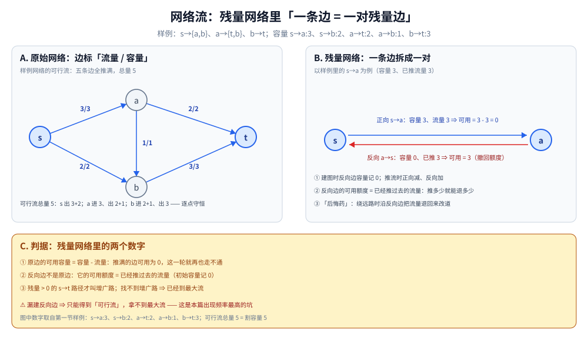
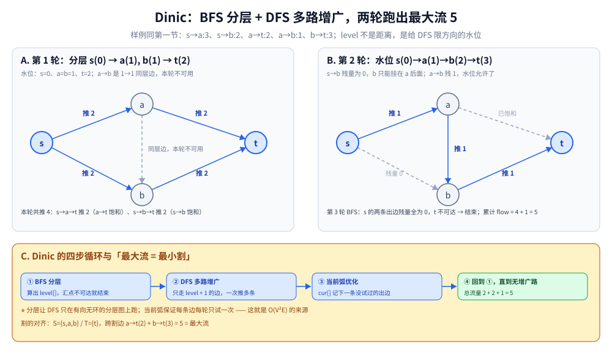

# 网络流

> 在有向带权图上求「最大流量」：从源点到汇点，每条边有容量限制，
> 最大流 = 最小割 —— 这是图论中最深刻的定理之一。
>
> ⭐ 边界先说清：本篇讲最大流 / 最小割的基础算法与建模。
> 最小费用最大流、上下界网络流属于进阶，最小费用流见 [最小费用最大流.md](最小费用最大流.md)，上下界本篇只给方向。
> 二分图匹配可转化为网络流问题，见 [二分图匹配.md](二分图匹配.md)。
>
> 内容整理自个人学习笔记，素材见 [素材清单](../../../素材清单.md)。复杂度口径见 [复杂度分析.md](../基础算法/复杂度分析.md)。

---

## 一、一条边上的「容量」和「流量」是什么关系？

**本节要点**：六个名词一张表，再加本篇的主角定理 —— **最大流 = 最小割**。

| 概念 | 说明 |
|---|---|
| **容量** | 每条边的最大流量 |
| **流量** | 实际通过的流量，不超过容量 |
| **残量网络** | 剩余容量构成的新图 |
| **增广路** | 从源点到汇点、残量 > 0 的路径 |
| **最大流** | 从源点到汇点的最大流量 |
| **最小割** | 把源点与汇点分开的最小边权和 |

⭐ **最大流最小割定理**：**最大流 = 最小割**。

拿一张 4 点网络把「可行流」和「割」同时摆出来（全篇示例，数字可逐边手推复核）：

```text
拓扑：s → {a, b}，a → {t, b}，b → t
容量：s→a:3  s→b:2  a→t:2  a→b:1  b→t:3

      ┌──── 3 ────→ a ──── 2 ────┐
      │                          ↓
      s                          t
      │                          ↑
      └──── 2 ────→ b ──── 3 ────┘
                       ↑
        （a 另有一条容量 1 的边指向 b：a→b）

一个可行流（边标「流量」）：s→a(3), s→b(2), a→t(2), a→b(1), b→t(3)，总量 5
  逐点核对流量守恒：a 进 3 出 2+1 ✓   b 进 2+1 出 3 ✓

一个 s-t 割：S={s,a,b} / T={t}，跨割边 a→t(2) + b→t(3) = 5
  流量 5 = 割容量 5 ⇒ 两边同时到达最优（定理的现场证据）
```

上面的可行流换成残量网络看，就是下面这张图：



怎么读：A 面板是第一节可行流的全景（边标「流量 / 容量」，s→a 是 3/3，五条边全推满、总量 5，逐点守恒）；B 面板把推满的 s→a 拆成一对残量边——正向可用 = 3 - 3 = 0，本轮再也走不通，反向 a→s 初始容量记 0、现在握着 3 的「撤回额度」；C 面板给判据：残量 > 0 的 s→t 路径才叫增广路，漏建反向边就只能得到可行流、拿不到最大流。

---

## 二、增广算法有三代，差别在哪？

**本节要点**：都在「找增广路 → 推流量 → 更新残量」这条流水线上，差别只在**路怎么找**。

| 算法 | 复杂度 | 说明 |
|---|---|---|
| **Ford-Fulkerson** | O(E × maxFlow) | 用 DFS 找增广路；整数容量时能终止 |
| **Edmonds-Karp** | O(VE²) | BFS 找最短增广路 |
| **Dinic** | O(V²E) | 分层图 + 多路增广，最常用 |
| **ISAP / HLPP** | 更优 | 进阶，一般用不到 |

⭐ **实践推荐 Dinic**：实现不算复杂，复杂度足够好。

---

## 三、Dinic 的模板长什么样？

**本节要点**：BFS 分层定「水位」，DFS 只沿水位递增的边多路增广，当前弧保证每条边每轮只试一次。

1. BFS 求分层图（`level[]`），若汇点不可达 → 结束
2. DFS 沿「level 递增」的边多路增广
3. 当前弧优化：每条边只试一次
4. 重复 1-3 直到无增广路

```go
func maxFlow(s, t int) int {
	flow := 0
	for bfs(s, t) { // 分层
		cur := make([]int, n)
		copy(cur, head)
		for {
			f := dfs(s, t, INF, cur)
			if f == 0 {
				break
			}
			flow += f
		}
	}
	return flow
}
```

⭐ 与 [BFS广度优先遍历.md](图的遍历/BFS广度优先遍历.md) 的分工：「队列逐层扩」的模板写在它第一、三节，本篇不重复；**这里的差别是入队判据换成了「残量 > 0」**，而且算出的不是到 t 的最短距离、是给 DFS 限定方向的 `level[]` 水位。

继续用第一节那张图把两轮「分层 → 增广」过一遍：

```text
第 1 轮分层：s(0) → a(1), b(1) → t(2)
  斜边 a→b 是 1→1 的同层边，本轮不可用
  本轮多路增广：s→a→t 推 2（a→t 饱和）；s→b→t 推 2（s→b 饱和，b→t 残 1）

第 2 轮分层：s(0) → a(1) → b(2) → t(3)
  s→b 残量为 0，b 只能挂在 a 后面；a→b 残 1，现在水位允许了
  本轮增广：s→a→b→t 推 1（s→a 饱和）

第 3 轮 BFS：s 的两条出边残量全为 0，t 不可达 → 结束
总流量 2+2+1 = 5，与第一节的割容量对上 ✓
```

这两轮「分层 → 增广」的水位变化见下图：



怎么读：A 面板第 1 轮水位 s(0) → a(1), b(1) → t(2)，斜边 a→b 是 1→1 的同层边、本轮不可用，两条通路各推 2，a→t 与 s→b 饱和（b→t 残 1）；B 面板第 2 轮水位 s(0) → a(1) → b(2) → t(3)，s→b 残量为 0、b 只能挂在 a 后面，残 1 的 a→b 这次水位允许了，沿 s→a→b→t 推 1（s→a 饱和）；C 面板收束成四步循环——BFS 分层、DFS 只走 level + 1 的边多路增广、当前弧 cur[] 每条边每轮只试一次、回到分层直到无增广路，总流量 2 + 2 + 1 = 5，正好等于割 S={s,a,b} / T={t} 的容量 a→t(2) + b→t(3) = 5。

---

## 四、什么问题值得建网络流模型？

**本节要点**：凡是「多方争抢有限通道」的问题，先问能不能画成源点 → 中间层 → 汇点。

| 场景 | 建模思路 |
|---|---|
| **二分图最大匹配** | 源点 → 左侧点 → 右侧点 → 汇点，容量 1 |
| **最小点覆盖** | = 最大匹配（König 定理），见 [二分图匹配.md](二分图匹配.md) |
| **最小路径覆盖** | 拆点后建图求最大匹配 |
| **任务分配** | 源点 → 人 → 任务 → 汇点 |
| **最大权闭合子图** | 最小割建模 |
| **图像分割** | 源点 / 汇点分别代表前景 / 背景 |

---

## 五、最容易踩的坑有哪些？

**本节要点**：六条里一半和「反向边」有关 —— 它是撤销机制，不是可选项。

| 坑 | 说明 |
|---|---|
| **反向边** | 必须建反向边（容量 0），用于撤销流量 |
| **INF 设多大** | 大于所有容量之和 |
| **点权拆点** | 点权转化为边权时要把点拆成入点、出点 |
| **多源多汇** | 加超级源点和超级汇点 |
| **无向边** | 正反两边容量都是 c |
| **整数溢出** | 用 int64 或明确范围 |

---

## 延伸追问

- **最大流最小割定理的直觉？** → 割的容量是「瓶颈」，流量不可能超过任何割；当流量等于某割容量时达到最大。
- **为什么要建反向边？** → 让算法能「撤销」之前的流量选择，是达到最大流的关键。
- **Dinic 为什么比 EK 快？** → 分层 + 多路增广，一次 BFS 找到多条增广路。
- **网络流和二分图匹配什么关系？** → 二分图匹配是网络流的特例（容量全为 1）。
- **最小费用最大流怎么求？** → 把 BFS 换成 SPFA / Dijkstra 求最短路（带费用），其他同 Dinic，见 [最小费用最大流.md](最小费用最大流.md)。
- **找不到增广路时，那个最小割怎么构造？** → 在残量网络里从 s 能到达的点归 S、其余归 T；从 S 跨到 T 的边必然全部推满（否则就顺着残量走过去了），流量值恰好等于这个割的容量——第一节的 S={s,a,b} / T={t}、割容量 2+3=5 就是这么和最大流对上的。

---

## 关联

- [二分图匹配.md](二分图匹配.md) — 容量全为 1 的特例与 König 定理
- [最小费用最大流.md](最小费用最大流.md) — 在残量网络上加「费用」维度的进阶
- [二分图判定.md](二分图判定.md) — 建匹配模型前先验图是不是二分图
- [BFS广度优先遍历.md](图的遍历/BFS广度优先遍历.md) — 分层所用 BFS 的模板出处
- [Dijkstra.md](最短路/Dijkstra.md) — 最小费用流换找路方式后的实现基础
- [README.md](README.md) — 图论导读
