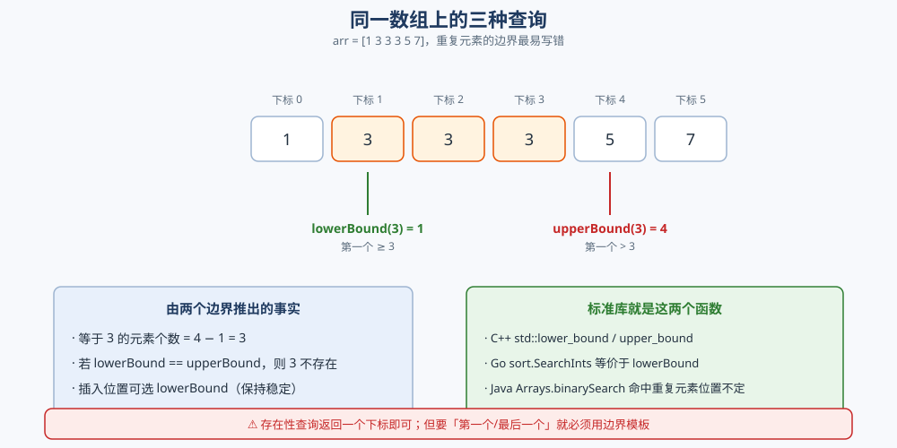

# 二分查找

> 二分的**两种区间写法**（`[lo, hi]` 与 `[lo, hi)`）与各自的**不变式**、`mid` 的防溢出取法、
> 查找**左右边界**的两个模板、以及「二分答案」在答案空间上二分的思路。
>
> ⭐ 本篇讲**二分的写法与不变式**：闭区间 / 半开区间怎么选、`mid` 怎么取、`lowerBound` / `upperBound` 怎么写。
> 二分查找在**查找算法选型里排第几、什么时候该换哈希表**，见同目录 [查找与排序对比.md](查找与排序对比.md) 第一节 ——
> 那里是**横向对比与选型**，这里是**边界怎么写对**。
>
> 内容整理自个人学习笔记，素材见 [素材清单](../../../素材清单.md)。`O(log n)` 的递推式推导见
> [复杂度分析.md](复杂度分析.md) 第五节；有序数组的随机访问优势见 [数组与链表.md](../../数据结构/线性结构/数组与链表.md)。
>
> 📎 本篇所有输出均为本机实跑逐字抄录：**Go 1.26.5（windows/amd64）** 与 **JDK 1.8.0_321** 各实现一份，
> 输出**逐行对齐**（含「错误写法真的死循环」的步数）。

---

## 一、两种区间写法与各自的不变式是什么？

**本节要点**：二分最容易写错的不是思路，而是**边界开闭**。写完必须能一句话说出「我的循环不变式是什么」——不变式自洽，代码就不会错。

### 1.1 闭区间 `[lo, hi]`

约定：**`lo` 和 `hi` 都是候选下标**，答案一定落在 `[lo, hi]` 之内。

```go
func exists(a []int, x int) bool {
	lo, hi := 0, len(a)-1
	for lo <= hi {          // 终止条件：区间为空（lo > hi）
		mid := lo + (hi-lo)/2
		if a[mid] == x {
			return true
		} else if a[mid] < x {
			lo = mid + 1     // mid 已排除
		} else {
			hi = mid - 1     // mid 已排除
		}
	}
	return false
}
```

⭐ **不变式**：`[lo, hi]` 内始终「可能包含答案」。既然 `mid` 被检查过并排除，两侧收缩就要**跳过 mid**（`mid±1`）。终止时 `lo > hi`，区间为空。

### 1.2 半开区间 `[lo, hi)`

约定：**`hi` 是一个「哨兵」，不指向元素**（初值 `n`，可以等于数组长度）。

```go
func lowerBound(a []int, x int) int {
	lo, hi := 0, len(a)
	for lo < hi {           // 终止条件：lo == hi
		mid := lo + (hi-lo)/2
		if a[mid] < x {
			lo = mid + 1
		} else {
			hi = mid         // ⚠️ 这里不是 mid-1：hi 是开边界
		}
	}
	return lo
}
```

⭐ **不变式**：答案一定落在 `[lo, hi)` 内，**`hi` 本身被排除**。所以收缩时用 `hi = mid` 而不是 `hi = mid - 1`。


### 1.3 两种写法为什么都能对

两者**答案一样**，只是「谁的边界是闭的」不同：

| 写法 | 初值 | 循环条件 | 排除 mid 时 | 返回 |
|---|---|---|---|---|
| 闭区间 `[lo, hi]` | `0, n-1` | `lo <= hi` | `lo = mid+1` / `hi = mid-1` | `lo` 或 `hi` 视语义 |
| 半开区间 `[lo, hi)` | `0, n` | `lo < hi` | `lo = mid+1` / `hi = mid` | `lo` |

⚠️ **最常见的错误是「混搭」**：用 `[lo, hi)` 的初值 `(0, n)`，却在 `else` 分支写 `hi = mid - 1`——`mid` 可能是 `0`，`hi` 会变成 `-1`，或者答案被跳过。**开闭一旦选定，三条规则（初值 / 循环条件 / 收缩方式）必须整体自洽。**

⭐ **建议**：**统一用半开区间 `[lo, hi)`**。它的优势是 `hi = n` 天然是一个合法的「插入位置」，`lowerBound` / `upperBound` / 二分答案都能直接用这一套，不用来回换算。

---

## 二、mid 应该怎么取？

**本节要点**：`mid` 的取法只有两个坑——**加法溢出**和**取整方向**。前者关乎正确性，后者关乎死循环。

### 2.1 防溢出：别写 `(lo + hi) / 2`

`(lo + hi) / 2` 在 `lo`、`hi` 都接近上限时会**加法溢出**变成负数，`a[负数]` 直接越界。用 `lo + (hi - lo) / 2` 只做减法，永不溢出：

```text
  int32: lo=2000000000 hi=2000000000  (lo+hi)/2=-147483648  lo+(hi-lo)/2=2000000000
```

⭐ **读法**：`(2000000000 + 2000000000) / 2` 在 32 位下溢出，结果 `-147483648`（负数）；而 `lo + (hi-lo)/2 = 2000000000` 正确。

⚠️ **Go 的 `int` 是 64 位、Java 的 `int` 是 32 位**——同一个表达式在 Go 里可能不溢出、在 Java 里溢出。**要跨语言移植，一律写 `lo + (hi-lo)/2`。** 这条差异是 [位运算.md](位运算.md) 里 `1 << 32` 那类问题的同源。

### 2.2 取整方向：`>>1` 是向下取整

`(hi - lo) / 2` 是**向下取整**，于是当 `hi - lo == 1` 时 `mid == lo`。**如果在 `lo == mid` 时还把 `lo` 赋成 `mid`，区间就再也不缩了**——这就是死循环的根源（6.1）。

⭐ **两条规则**：

- 用 `lo = mid + 1`（向前推进）时，`mid` 向下取整是**安全的**；
- 一旦某分支写 `lo = mid`（不推进），`mid` 就必须**向上取整**：`mid = lo + (hi-lo+1)/2`，否则死循环。

---

## 三、查找左右边界的两个模板

**本节要点**：数组里有重复元素时，「找到 x」不够，常常要的是**第一个** x 或**最后一个** x。这两个查询就是 `lowerBound` 与 `upperBound`。

### 3.1 `lowerBound`：第一个 `>= x`

```go
// [lo, hi) 半开区间：第一个 >= x 的下标（= 元素可插入的最左位置）
func lowerBound(a []int, x int) int {
	lo, hi := 0, len(a)
	for lo < hi {
		mid := lo + (hi-lo)/2
		if a[mid] < x {
			lo = mid + 1 // a[mid] 太小，答案在右侧
		} else {
			hi = mid // a[mid] >= x，答案可能是 mid 或更左
		}
	}
	return lo
}
```

### 3.2 `upperBound`：第一个 `> x`

只改一个符号（`<` 变 `<=`）：

```go
// [lo, hi) 半开区间：第一个 > x 的下标（= 元素可插入的最右位置 + 1）
func upperBound(a []int, x int) int {
	lo, hi := 0, len(a)
	for lo < hi {
		mid := lo + (hi-lo)/2
		if a[mid] <= x { // ⭐ 唯一的差别：等于也往右推
			lo = mid + 1
		} else {
			hi = mid
		}
	}
	return lo
}
```

⭐ **两个模板的差别只有一行**：`lowerBound` 判 `a[mid] < x`，`upperBound` 判 `a[mid] <= x`。**读法：`lowerBound` 把「等于 x」的整段当成「答案可能在更左」，`upperBound` 把它当成「答案在更右」。**

### 3.3 三种查询在同一数组上的实测

同一数组 `arr = [1 3 3 3 5 7]`，跑「左边界 / 右边界 / 存在性」：

```text
  x=0   lowerBound(>=x)=0   upperBound(>x)=0   存在=false
  x=1   lowerBound(>=x)=0   upperBound(>x)=1   存在=true
  x=3   lowerBound(>=x)=1   upperBound(>x)=4   存在=true
  x=4   lowerBound(>=x)=4   upperBound(>x)=4   存在=false
  x=7   lowerBound(>=x)=5   upperBound(>x)=6   存在=true
  x=9   lowerBound(>=x)=6   upperBound(>x)=6   存在=false
  说明: 元素个数 = upperBound(x) - lowerBound(x)，x=3 时 = 3
```



⭐ **从这张表能推出全部用法**：

1. **存在性**：`lowerBound(x) < n && a[lowerBound(x)] == x`；或直接看 `lowerBound != upperBound`；
2. **等于 x 的个数** = `upperBound(x) - lowerBound(x)`（x=3 时是 3）；
3. **插入位置**：要在保持有序的前提下插入 `x`，用 `lowerBound`（插到相等元素的最左边，保持稳定）；
4. **前驱 / 后继**：`< x` 的最大值 = `a[lowerBound(x) - 1]`；`> x` 的最小值 = `a[upperBound(x)]`（注意越界判断）。

**标准库里就是这两个函数**：

| 库 / 函数 | 语义 |
|---|---|
| C++ `std::lower_bound` / `std::upper_bound` | 就是上面两个模板，**第一个 ≥ / 第一个 >** |
| Go `sort.SearchInts(a, x)` | 等价于 `lowerBound`（第一个 ≥ x） |
| Go `sort.Search(n, pred)` | 返回**第一个让 `pred` 为真**的下标（更通用的形式） |
| Java `Arrays.binarySearch(a, x)` | ⚠️ **命中重复元素时返回哪一个不确定**，只保证「找到一个」 |

⚠️ **`Arrays.binarySearch` 不保证返回第一个 x**——它返回的是某一次二分恰好命中的那个下标。要左右边界，必须手写模板。

---

## 四、二分答案是什么？

**本节要点**：二分不只能查数组，还能**在「答案的可能范围」上二分**——只要「答案是否可行」这个判定随答案单调变化。这是二分最有价值的推广。

### 4.1 在答案空间上二分

模板三步：

1. **确定答案的上下界 `[lo, hi]`**（答案一定在这个范围内）；
2. **写一个判定函数 `can(mid)`**：`mid` 这个答案可行吗？（⚠️ 判定函数通常 `O(n)`）；
3. **二分**：找**第一个可行的 `mid`**（最小可行解）或**最后一个可行的 `mid`**（最大可行解）。

### 4.2 样板：最小化「最大段和」

把 `weights` 按顺序切成不超过 `days` 段，让**每段和的最大值最小**——答案就是「容量」，在 `[max(weights), sum(weights)]` 上二分：

```go
func shipWithinDays(weights []int, days int) int {
	lo, hi := 0, 0
	for _, w := range weights {
		lo = max(lo, w) // 下界：至少装得下最重的一件
		hi += w         // 上界：一天全装下
	}
	for lo < hi { // ⭐ 找第一个「可行」的容量
		mid := lo + (hi-lo)/2
		if canShip(weights, days, mid) {
			hi = mid // 可行 → 试着更小
		} else {
			lo = mid + 1 // 不可行 → 必须更大
		}
	}
	return lo
}
```

```text
  weights=[1 2 3 4 5 6 7 8 9 10] days=5 → 最小容量=15
  weights=[1 2 3 4 5 6 7 8 9 10] days=3 → 最小容量=21
  weights=[1 2 3 4 5 6 7 8 9 10] days=1 → 最小容量=55
```

⭐ **读法**：`days=1` 时只能一段，答案就是总和 55；`days=3` 时最优是 `[1..5] / [6..8] / [9,10]`（和 15/21/19），最大值 21；容量再小到 20 就需要 4 天，不够。

### 4.3 单调性是唯一前提

⚠️ **二分答案成立的前提是「单调性」**：`can(mid)` 必须满足「`mid` 越大越可能可行」——存在一个分界点，左边全不可行、右边全可行。**判定函数不单调，二分答案就是错的。**

| 信号 | 能不能二分答案 |
|---|---|
| 「最小的最大」「最大的最小」「第 k 个满足…」 | ✅ 典型可用 |
| `can(mid)` 随 `mid` 单调（越大越松/越紧） | ✅ 可用 |
| `can(mid)` 忽真忽假、非单调 | ❌ 不可用，得换 DP / 贪心 |

⭐ **复杂度**：`O(n log(range))` —— 判定 `O(n)`，二分 `log(答案范围)` 次。相比「枚举所有答案逐个判定」的 `O(n · range)` 是指数级提升（对 `range` 而言是对数）。

---

## 五、常见变体：旋转数组、峰值、矩阵

**本节要点**：这些变体的二分对象都不是「整个有序数组」。**它们的共同点是把「哪一半一定不含答案」这个判断讲清楚**——二分的本质永远是「排除一半」。

### 5.1 旋转有序数组找最小值

旋转数组是「两段各自有序」，最小值落在**两段的分界点**。判断「`mid` 在左段还是右段」即可：

```go
func findMinRotated(a []int) int {
	lo, hi := 0, len(a)-1
	for lo < hi {
		mid := lo + (hi-lo)/2
		if a[mid] > a[hi] { // mid 在左段（大的一侧）→ 最小值在右侧
			lo = mid + 1
		} else { // mid 在右段 → 最小值在左侧（含 mid）
			hi = mid
		}
	}
	return a[lo]
}
```

```text
  findMinRotated([4 5 6 7 0 1 2]) = 0
  findMinRotated([3 4 5 1 2])     = 1
```

⭐ **为什么与 `a[hi]` 比而不与 `a[lo]` 比**：旋转后「左段恒大于右段」。`a[mid] > a[hi]` 说明 `mid` 处于升序断点**之前**（左段），最小值必在右边。

### 5.2 峰值元素：看「上坡还是下坡」

峰值（比左右邻居都大）的二分靠**坡度**：`a[mid] < a[mid+1]` 说明在**上坡**，峰值在右；否则在**下坡**，峰值在左（含 mid）：

```go
func findPeak(a []int) int {
	lo, hi := 0, len(a)-1
	for lo < hi {
		mid := lo + (hi-lo)/2
		if a[mid] < a[mid+1] { // 上坡 → 右边一定有峰
			lo = mid + 1
		} else { // 下坡 → 左边（含 mid）有峰
			hi = mid
		}
	}
	return lo
}
```

```text
  findPeak([1 2 3 1])       = 2
  findPeak([1 2 1 3 5 6 4]) = 5
```

⭐ **关键洞察**：题面说「返回任意一个峰值」——只要有 `a[mid] < a[mid+1]` 就敢往右走，因为**上坡的尽头必然是峰**（边界视为 `-∞`）。二分不需要全局有序，只要「能可靠排除一半」。

### 5.3 矩阵二分

**行内有序、且每行首元素大于上一行尾元素**的矩阵，可以**把二维下标摊平成一维**，直接套一维二分：

```text
m × n 的矩阵 → 一维下标 idx
  row = idx / n      col = idx % n
  在 [0, m*n) 上跑标准二分，比较 a[row][col] 与 target
```

⚠️ **前提是「整体有序」**（摊平后单调）。若矩阵只是「每行有序、每列有序」（行列双有序），摊平后**不单调**，要换「从右上角开始」的阶梯式搜索（每步排除一行或一列，`O(m+n)`）——**那不是二分**。

---

## 六、三个经典坑

**本节要点**：三个坑都能靠「先说不变式、再看收缩是否推进」预防。其中死循环是本机**真跑出来的**，不是理论推演。

### 6.1 死循环（本机实测）

把 `lo = mid+1` 误写成 `lo = mid`、`hi = mid`，配上 `lo <= hi` 的循环条件：

```go
func buggyLB(a []int, x int) (int, int) {
	lo, hi := 0, len(a)-1
	steps := 0
	for lo <= hi {
		steps++
		if steps > 1000 {
			return -1, steps // 触发上限，视为死循环
		}
		mid := lo + (hi-lo)/2
		if a[mid] < x {
			lo = mid // BUG：区间不缩小
		} else {
			hi = mid // BUG：区间不缩小
		}
	}
	return lo, steps
}
```

```text
  buggyLB(arr, 100) 步数=1001（上限 1000）返回=-1 → 未收敛
  对照: lowerBound(arr, 100) = 6
```

⭐ **读法**：步数撞到上限 1000（设上限正是为了**在文档里可复现**，否则进程会真的挂住）。原因：当区间缩到 `[2, 3]` 时 `mid = 2`，`a[2] < 100` 成立 → `lo = mid = 2`，**`lo` 原地不动**，下一轮 `mid` 还是 2 → 永远循环。

⚠️ **判据**：**每一轮循环，`hi - lo` 必须严格变小**。写完后在 `[lo, lo+1]` 这种「只差一格」的区间上手动走一遍，就能立刻发现不推进的分支。

### 6.2 边界漏一个

半开区间里最容易犯的错是 `else` 分支写成 `hi = mid - 1`：

```text
arr = [1 3 5 7]。找 x=5（lowerBound 应为 2）：
  正确：   mid=2→5≥5→hi=2；mid=1→3<5→lo=2；lo==hi==2 ✅ 返回 2
  错误：hi=mid-1：mid=2→5≥5→hi=1；mid=0→1<5→lo=1；返回 1 ✗ 漏掉下标 2
```

⭐ **规律**：**半开区间的「右边界」是开区间，收缩只能到 `mid`，不能到 `mid-1`。** 一旦写 `mid-1`，就把「答案恰好等于 `mid`」这个可能跳过了。

### 6.3 mid 溢出

见 2.1：`(lo+hi)/2` 在 32 位下溢出。⚠️ **这条在 Java 里必现、在 Go（64 位 `int`）里要更大规模才出现**——所以「本地 Go 跑对了」不证明代码对。

**三个坑的速查**：

| 坑 | 症状 | 修法 |
|---|---|---|
| 死循环 | 程序卡住 / 超时 | 每个分支都必须让区间严格变小；`lo = mid` 配向上取整 |
| 边界漏一个 | 答案差 1、或越界 `-1` | 开闭选定后三条规则整体自洽；半开区间右界用 `hi = mid` |
| mid 溢出 | 负数下标 / 越界 | 一律 `lo + (hi-lo)/2` |

---

## 使用：二分查找在你的代码里长什么样

**二分是「最常被自己手写、也最容易写错」的算法。** 按调用来源分三层看：

**第一层：库函数直接调（先查有没有）。** 大多数语言都自带 `lowerBound` 语义：C++ `std::lower_bound`、Go `sort.SearchInts` / `sort.Search`、Rust `slice::partition_point`。⚠️ 但 **Java 的 `Arrays.binarySearch` 只保证「找到一个」，不保证左右边界**——需要边界时必须自己写模板。

**第二层：二分答案（最重要的一层）。** 工程里真正常见的不是「查数组」，而是「**在答案范围上二分 + 写判定函数**」：限流阈值（最小能压住 QPS 的配置）、容量规划（最少几台机器扛住峰值）、超时参数调优（最小能让 p99 达标的超时）——**只要「参数越大越安全」这种单调性成立，就能二分**。前提是判定函数要能写成 `O(n)` 或 `O(log n)`。

**第三层：结构内部的二分（你看不见但一直在用）。** B+ 树的页内定位、跳表的逐层下探、`std::map` 的查找、Redis 跳表、一致性哈希环上找「第一个 ≥ hash 的节点」——**全都是 `lowerBound`**。⚠️ 一致性哈希那句「在有序数组里二分找第一个 ≥ hash 的节点」就是本篇 3.1 的模板，见 [并查集、Trie与一致性哈希.md](../../数据结构/高级数据结构/并查集、Trie与一致性哈希.md) 的一致性哈希环一节。

⭐ **归纳成一条判断**：**先问「这个问题有没有单调性」**——有单调性就能二分（查数组、二分答案、结构内部定位都能套同一个模板）；没有单调性就换哈希（等值查询）或线性扫描。

---

## 延伸追问

- **闭区间和半开区间该选哪个？** → **优先半开区间 `[lo, hi)`**：`hi = n` 天然是合法插入位置，`lowerBound` / `upperBound` / 二分答案都能共用一套边界。选定后，「初值 / 循环条件 / 收缩方式」三条规则必须整体自洽（1.3）。
- **为什么 `mid` 要写 `lo + (hi-lo)/2`？** → 防加法溢出。`(lo+hi)/2` 在 32 位下 `lo=hi≈2×10⁹` 时变负数（2.1 实测 `-147483648`）。Go 的 `int` 是 64 位、Java 是 32 位，**跨语言必须写减法版**。
- **怎么判断二分会不会死循环？** → 看每轮区间是否**严格收缩**。把「只差一格」的区间 `[lo, lo+1]` 手动过一遍：若某分支让 `lo` 停在 `mid` 而 `mid == lo`，就是死循环（6.1 实测 1001 步没收敛）。
- **`lowerBound` 和 `upperBound` 差在哪？** → **只差一个符号**：`lowerBound` 判 `a[mid] < x`（第一个 ≥ x），`upperBound` 判 `a[mid] <= x`（第一个 > x）。两者相减 = 等于 x 的元素个数（3.3 实测 x=3 时是 3）。
- **`Arrays.binarySearch` 能用来找第一个 x 吗？** → **不能**。它只保证「找到一个」，重复元素时返回哪一个取决于二分路径。要边界必须手写模板。
- **二分答案的判定函数要满足什么？** → **单调性**：`can(mid)` 随 `mid` 增大而只从「假」变「真」（或反向）。不单调就不能二分（4.3）。
- **旋转数组为什么和 `a[hi]` 比？** → 旋转后「左段 > 右段」，`a[mid] > a[hi]` 说明 `mid` 在左段，最小值必在右侧（5.1）。
- **矩阵什么时候能摊平成一维二分？** → 当矩阵**整体有序**（每行首元素大于上一行尾元素）时。若只是「行列各自有序」，摊平后不单调，要用右上角阶梯搜索（`O(m+n)`），那不是二分（5.3）。
- **二分查找的空间复杂度是多少？** → 迭代版 `O(1)`；**递归版是 `O(log n)` 栈深**。稠密循环里能写迭代就别写递归（对照 [递归与分治.md](递归与分治.md) 第六节的栈开销）。

## 关联

- [查找与排序对比.md](查找与排序对比.md) — 二分在**查找算法选型**里的位置：何时该换插值查找 / 哈希 / 树
- [复杂度分析.md](复杂度分析.md) — `O(log n)` 的递推式 `T(n)=T(n/2)+O(1)` 与主定理口径（第五节）
- [数组与链表.md](../../数据结构/线性结构/数组与链表.md) — 有序数组的随机访问优势（二分的前提）
- [B树与B+树.md](../../数据结构/树/B树与B+树.md)、[并查集、Trie与一致性哈希.md](../../数据结构/高级数据结构/并查集、Trie与一致性哈希.md) — 页内查找与一致性哈希环都用「有序数组 + 二分」
- [递归与分治.md](递归与分治.md) — 二分是**减治**（每次只递归一侧）的最简例子；递归版的空间代价
- [位运算.md](位运算.md) — 同源的「32 位 vs 64 位」跨语言差异（`mid` 溢出与移位溢出）
- [BM.md](../字符串匹配/BM.md) — 另一种「跳跃式排除」的思想（坏字符规则跳着比）
- [LIS.md](../动态规划/LIS.md) — 用二分把 `O(n²)` 的 DP 优化到 `O(n log n)`，`lowerBound` 的直接应用
> 反向引用（本篇被下列文档引到）：[区间与索引树.md](../../数据结构/树/区间与索引树.md)、[跳跃表.md](../../数据结构/高级数据结构/跳跃表.md)
