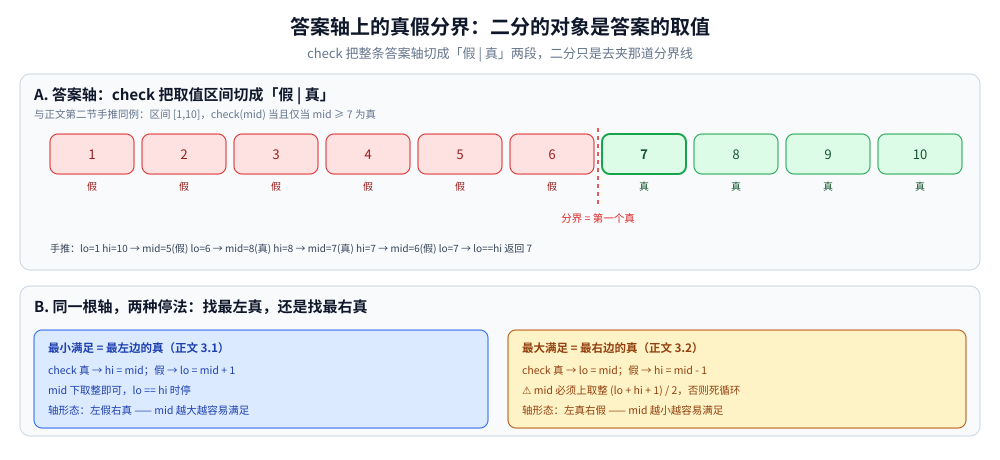

# 二分答案

> 在「答案空间」上二分：当答案是单调的（越大越容易满足 / 越小越容易满足），
> 可以用二分找到「最小的满足条件的答案」或「最大的满足条件的答案」。
>
> ⭐ 边界先说清：本篇讲「二分答案」这一模式，不是「二分查找」。
> 有序数组上的二分、以及答案空间二分的**最小模板与 `canShip` 样板**已在
> [二分查找.md](二分查找.md) 第四节细讲过——本篇**不重复那套模板推导**，
> 只补「区别 + 判据 + 两种收缩方向 + 常见坑」。
> 贪心的正确性论证见 [README.md](../贪心/README.md)（贪心导读）。
>
> 内容整理自个人学习笔记，素材见 [素材清单](../../../素材清单.md)。复杂度口径见 [复杂度分析.md](复杂度分析.md)。

---

## 一、和二分查找有什么区别？

**本节要点**：二分的对象不同——一个在「有序数组的下标」上找值，一个在「答案的取值区间」上找分界点，靠的是答案单调性而不是数组有序。

| 维度 | 二分查找 | 二分答案 |
|---|---|---|
| 在什么上二分 | 有序数组的下标 | 答案的取值空间 |
| 判断条件 | `a[mid] == target` | 自定义的 `check(mid)` |
| 目标 | 找某个值 | 找「最小/最大满足条件」的答案 |
| 前提 | 数组有序 | 答案空间有单调性 |

⭐ **判据**：**「最小化最大值」「最大化最小值」「求满足条件的最小/最大解」→ 二分答案。**


三段顺读：**定界**——答案一定落在 `[lo, hi]` 里，下界取 max、上界取 sum 或 1e18；**判定**——`check(mid)` 问「mid 这个答案行不行」，通常要 O(n)，单调是唯一前提；**夹逼**——可行就 `hi = mid`（自己也可能是解），不可行就 `lo = mid + 1`，`lo == hi` 时停下返回 `lo`。右半对照二分查找：循环骨架一样，换掉的只有「在什么上二分」（答案的取值 vs 数组的下标）与「看什么条件」（自定义 `check(mid)` vs `a[mid] == target`）。

---

## 二、最小满足模板长什么样？

**本节要点**：统一骨架是「找第一个使 `check` 为真的值」；`check` 单调是唯一正确性前提（单调性的论证与完整样板见 [二分查找.md](二分查找.md) 第四节，此处只留骨架）。

```go
func binarySearchAnswer() int {
	lo, hi := 下界, 上界
	for lo < hi {
		mid := lo + (hi-lo)/2
		if check(mid) {
			hi = mid // 找最小满足 → 收缩右边界
		} else {
			lo = mid + 1
		}
	}
	return lo
}
```

⭐ **关键**：`check(mid)` 必须是**单调的** —— mid 越大（或越小），越容易（或越难）满足。

小输入手推一遍区间收缩（设 `check(mid)` 当且仅当 `mid ≥ 7` 为真）：

```text
答案区间 [1, 10]，找最小满足值
lo=1 hi=10  mid=5   check(5)=假 → lo=6      （5 不可行，答案在右边）
lo=6 hi=10  mid=8   check(8)=真 → hi=8      （8 可行，自己也可能是答案）
lo=6 hi=8   mid=7   check(7)=真 → hi=7
lo=6 hi=7   mid=6   check(6)=假 → lo=7
lo=7 hi=7   循环退出，返回 7 ✓（正是第一个满足的值）
```

---

## 三、两种收缩方向怎么写？

**本节要点**：求「最小满足」收右边界（`hi = mid`），求「最大满足」收左边界（`lo = mid`）——后者 mid 必须上取整，否则死循环。

### 3.1 最小化最大值（求最小的 x 使 check(x) 成立）

```go
for lo < hi {
	mid := (lo + hi) / 2
	if check(mid) {
		hi = mid
	} else {
		lo = mid + 1
	}
}
return lo
```

### 3.2 最大化最小值（求最大的 x 使 check(x) 成立）

```go
for lo < hi {
	mid := (lo + hi + 1) / 2 // ⚠️ 上取整，避免死循环
	if check(mid) {
		lo = mid
	} else {
		hi = mid - 1
	}
}
return lo
```

⚠️ **模式 3.2 的 `mid` 必须上取整**，否则 `lo = mid` 时可能死循环：区间只剩 `[x, x+1]` 时，
下取整的 `mid` 恒等于 `lo`，`check` 为真就原地踏步。



把两种收缩放回同一根数轴：`check` 把 `[1,10]` 切成「假 | 真」两段——第二节手推里 1~6 为假、7~10 为真，最小满足就是**最左边的真**（`hi = mid` 收它，mid 下取整即可）。求最大满足时轴形态反过来是「真在左、假在右」，答案是**最右边的真**，收缩变成 `lo = mid`——正因为 `lo` 这一侧要动，mid 必须上取整 `(lo + hi + 1) / 2`，否则两格区间原地踏步。

---

## 四、有哪些典型题？

**本节要点**：这些题的共同形状是「答案在一个可定的上下界里，判定一个候选值行不行只要扫一遍」。

| 题 | check(mid) |
|---|---|
| 分割数组的最大值 | 每段和 ≤ mid 需要几段 |
| 爱吃香蕉的珂珂 | mid 速度下能否在 H 小时内吃完 |
| 在 D 天内送达包裹 | 每天运 mid 容量需要几天 |
| 求平方根 | mid² ≤ x 吗 |
| 寻找峰值（部分变体） | 一侧是否下降 |
| 木质切分问题 | 切成 mid 长度能切几段 |
| 数组中的第 K 小 | 二分值域 |

---

## 五、容易踩哪些坑？

**本节要点**：五个坑里最容易白死循环的是「收左边界却下取整 mid」，其次是把非单调的 check 硬塞进二分。

| 坑 | 说明 |
|---|---|
| **死循环** | 最大化最小值时 mid 要上取整 |
| **check 非单调** | 二分答案的前提是单调性 |
| **上界设置** | 要覆盖答案范围；一般取 sum 或 max 或 1e18 |
| **溢出** | `lo + hi` 可能溢出，用 `lo + (hi-lo)/2` |
| **返回 lo 还是 hi** | 循环结束时 `lo == hi`，返回任意一个都可 |

---

## 延伸追问

- **二分答案的时间复杂度？** → O(log(答案范围) × check 复杂度)。
- **什么时候不能用二分答案？** → check 不满足单调性时。
- **二分答案和贪心什么关系？** → check 里常配合贪心（如「能否在 H 小时内吃完」用贪心验证）。
- **浮点二分怎么写？** → 循环固定次数（如 100 次），或 `for hi - lo > eps`。
- **答案空间是整数还是实数？** → 整数用标准二分；实数用固定迭代次数。
- **如果整个答案区间都没有满足值呢？** → 模板只夹到 `lo == hi` 就返回，不保证返回值满足 `check`；所以定界必须覆盖真答案，必要时二完再单独验证一次 `check(返回值)`（与第五节「上界设置」坑同源）。

---

## 关联

- [二分查找.md](二分查找.md) — 有序数组上的二分；其第四节与本篇模板同源（样板不在此重复）
- [快速选择.md](快速选择.md) — 第 K 小问题的另一种解法（分区排除 vs 二分值域）
- [README.md](../贪心/README.md) — 贪心导读：check 中的贪心
- [README.md](README.md) — 基础算法导读
> 反向引用（本篇被下列文档引到）：[CDQ分治与整体二分.md](../高级技巧/CDQ分治与整体二分.md)
