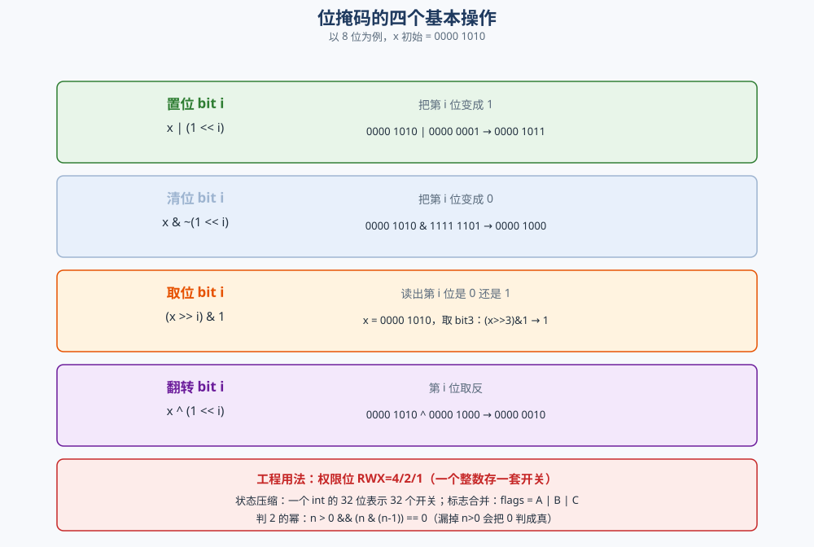
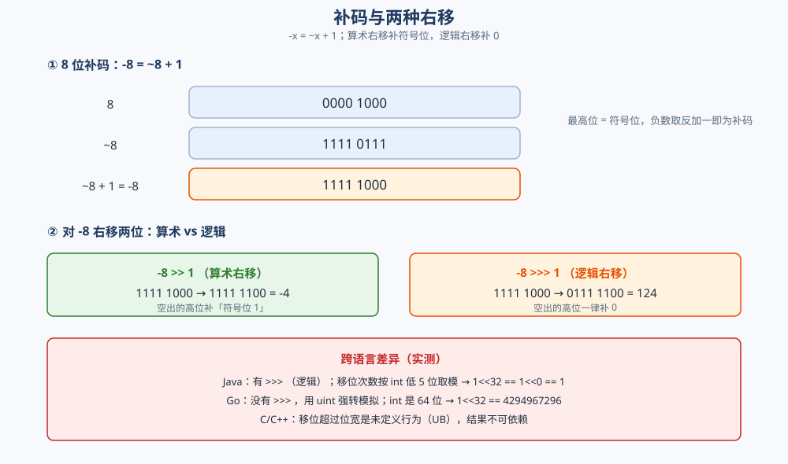

# 位运算

> 补码与「`-x = ~x + 1`」的来历、五个基本操作（`x & (x-1)`、`x & -x`、`x ^ x = 0`、左右移）各自的用途、
> 位掩码的四个动作、判 2 的幂，以及 `>>` 与 `>>>` 的**跨语言差异**和移位的**未定义行为**。
>
> ⭐ 本篇讲**位运算的语义与技巧**。它在具体结构 / 算法里的**应用细节**不在这里展开：
> 位数组与布隆过滤器见 [位图与布隆过滤器.md](../../数据结构/高级数据结构/位图与布隆过滤器.md)，
> 数独用位掩码表示候选集见 [数独.md](../回溯/数独.md)（两篇与本篇互引，不重复）。
>
> 内容整理自个人学习笔记，素材见 [素材清单](../../../素材清单.md)。`O(1)` 之类的复杂度口径见
> [复杂度分析.md](复杂度分析.md)；32 位 vs 64 位的另一处体现（二分 `mid` 溢出）见 [二分查找.md](二分查找.md)。
>
> 📎 本篇所有输出均为本机实跑逐字抄录：**Go 1.26.5（windows/amd64）** 与 **JDK 1.8.0_321** 各实现一份。
> 补码 / 掩码 / 移位等确定性输出**逐行对齐**；**第 11 组「移位超过位宽」两语言故意不同**，单独成段对照。

---

## 一、补码是什么？负数为什么用 `~x + 1` 表示？

**本节要点**：计算机里没有「减法」，只有加法。**补码把减法变成加法**，而「`-x = ~x + 1`」正是补码的定义式。

### 1.1 补码与 `-x = ~x + 1`

在 32 位机上，把 `x` 的每一位取反再加 1，得到的正是 `-x`：

```go
// 对任意 x，~x + 1 == -x 恒成立
for _, x := range []int32{5, -5, 0, 1, -1} {
	fmt.Println(^x+1 == -x) // 全部 true
}
```

```text
  x=5     ~x=-6    ~x+1=-5    -x=-5    一致=true
  x=-5    ~x=4     ~x+1=5     -x=5     一致=true
  x=0     ~x=-1    ~x+1=0     -x=0     一致=true
  x=1     ~x=-2    ~x+1=-1    -x=-1    一致=true
  x=-1    ~x=0     ~x+1=1     -x=1     一致=true
  二进制: 5 = 00000000000000000000000000000101
           -5 = 11111111111111111111111111111011 (补码)
```

⭐ **为什么这样能成立**：`~x + x` 的每一位都是 `1`，即全 1（记作 `-1` 的补码）。于是 `~x + x = -1`，两边加 1 得 `~x + 1 = -x`。**最高位是符号位**——`-5` 的二进制最高位是 1，且低 31 位是 `5` 的补码。

⭐ **补码的实际收益**：`5 + (-3)` 直接用加法器算就行，**不需要单独的减法电路**；而且 `0` 只有一种表示（不像反码有 `+0` / `-0` 两个零）。

### 1.2 `MIN_VALUE` 的边界：它取反还是它自己

⚠️ **`-2^31` 没有对应的正数**（32 位能表示的正数最大是 `2^31 - 1`），所以对它取负会**溢出**：

```text
  MIN      = -2147483648
  -MIN     = -2147483648  (溢出，仍等于 MIN)=true
  ~MIN+1   = -2147483648
  abs(MIN) = -2147483648  (结果为负！)
  MIN 的二进制 = 10000000000000000000000000000000
  MIN & -MIN   = -2147483648  (取最低位 1，结果仍是 MIN)
```

⭐ **三条必须记住的结论**：

1. **`-MIN == MIN`**——取负溢出，结果不变；
2. **`abs(MIN)` 是负数**——`Math.abs` / 手写 `if x < 0 { -x }` 都救不了，因为它先取负再返回，取负那一步就溢出了。**要取绝对值后参与运算，必须用更宽的整型**（`long` / `int64`）；
3. **`MIN & -MIN == MIN`**——`MIN` 只有一个 1 位（最高位），所以「最低位的 1」就是它自己。这也解释了为什么 `x & -x` 在 `MIN` 上返回一个负数。

---

## 二、五个基本操作与它们各自的用途

**本节要点**：位运算的技巧只有五个，但**每一个都对应一类问题**。记住「这个操作用来清掉 / 取出 / 判断什么」，比背代码有用。

### 2.1 `x & (x-1)`：清掉最低位的 1

从二进制看：`x-1` 会把**最低位的 1 变成 0，并把后面所有 0 变成 1**；与 `x` 相与，最低位那个 1 就被清掉。

```text
  x=12  二进制=00001100  x&(x-1) 清零最低位1=8    x&-x 取最低位1=4    popcount=2
  x=7   二进制=00000111  x&(x-1) 清零最低位1=6    x&-x 取最低位1=1    popcount=3
  x=0   二进制=00000000  x&(x-1) 清零最低位1=0    x&-x 取最低位1=0    popcount=0
  x=10  二进制=00001010  x&(x-1) 清零最低位1=8    x&-x 取最低位1=2    popcount=2
```

⭐ **用途**：**数 1 的个数（popcount）**——反复 `x &= x-1` 直到 `x == 0`，循环几次就有几个 1，复杂度 `O(1 的个数)` 而非 `O(位宽)`。

```go
func popcount(x int32) int {
	cnt := 0
	for x != 0 {
		x &= x - 1 // 每轮清掉一个 1
		cnt++
	}
	return cnt
}
```

### 2.2 `x & -x`：取出最低位的 1（lowbit）

`-x = ~x + 1`，两者相与会**只保留最低位的那个 1**。实测：`12 → 4`、`10 → 2`、`7 → 1`。

⭐ **用途**：**树状数组（Fenwick）的核心**——`i & -i` 定位「管辖范围」；也用于枚举一个数的所有 1 位、或用位图做「分层」。

### 2.3 `x ^ x = 0`：异或的性质

| 性质 | 含义 |
|---|---|
| `x ^ x = 0` | 自己异或自己为 0 |
| `x ^ 0 = x` | 0 是异或的单位元 |
| `a ^ b ^ a = b` | 异或可交换、可结合 → 成对消掉 |

⭐ **用途**：**找出唯一出现一次的数**——把数组全部异或，成对出现的都消成 0，剩下的就是那个「落单」的数。⚠️ 但它**要求除目标外都出现偶数次**，且**无法定位两个或以上落单的数**（那是另一套分组技巧）。

### 2.4 `<<` / `>>`：移位与算术 / 逻辑之分

- `x << 1` 等价于 `x * 2`（不溢出时）；
- `x >> 1` 对**非负数是** `x / 2`，但**对负数是向下取整**（见 5.4）。

⚠️ **移位的方向决定了空位补什么**——这正是第四节的焦点。

---

## 三、位掩码：置位 / 清位 / 取位 / 翻转

**本节要点**：位掩码（bitmask）用一个整数的若干位表示「一组开关」。四个基本动作背下来，状态压缩、权限位都不在话下。

### 3.1 四个动作



| 动作 | 表达式 | 效果 |
|---|---|---|
| **置位**（set） | `x \| (1 << i)` | 第 `i` 位变 1 |
| **清位**（clear） | `x & ~(1 << i)` | 第 `i` 位变 0 |
| **取位**（get） | `(x >> i) & 1` | 读出第 `i` 位 |
| **翻转**（toggle） | `x ^ (1 << i)` | 第 `i` 位取反 |

以 `x = 0b1010`（十进制 10）实测：

```text
  初始 x=10 (00001010)
  置位 bit0: x|(1<<0)         = 11 (00001011)
  清位 bit1: 清掉 bit1 后       = 8 (00001000)
  取位 bit3: (x>>3)&1         = 1
  翻转 bit3: x^(1<<3)         = 2 (00000010)
  合并标志:  1|2|4            = 7 (00000111)
```

⚠️ **Go 的清位可以用 `&^`（AND NOT）**：`x &^ (1 << i)`。Java / C 没有这个运算符，写 `x & ~(1 << i)`。两者等价。

### 3.2 判 2 的幂：`n & (n-1) == 0` 的陷阱

2 的幂的二进制**只有一个 1**，所以 `n & (n-1)` 正好清掉它、结果为 0。**但 `n = 0` 也会得到 0**：

```text
  n=0    n&(n-1)=0    naive=true   n>0&&…=false
  n=1    n&(n-1)=0    naive=true   n>0&&…=true
  n=2    n&(n-1)=0    naive=true   n>0&&…=true
  n=3    n&(n-1)=2    naive=false  n>0&&…=false
  n=4    n&(n-1)=0    naive=true   n>0&&…=true
  n=8    n&(n-1)=0    naive=true   n>0&&…=true
  n=16   n&(n-1)=0    naive=true   n>0&&…=true
  n=64   n&(n-1)=0    naive=true   n>0&&…=true
```

⭐ **`n=0` 那一行就是陷阱**：`0 & (-1) == 0` 成立，`naive` 判定为真。**必须补 `n > 0`**：

```go
isPow2 := n > 0 && (n&(n-1)) == 0 // ⚠️ n > 0 不能省
```

---

## 四、`>>` 与 `>>>`：跨语言差异

**本节要点**：右移有两种——**算术右移补符号位、逻辑右移补 0**。Java 用 `>>>` 表示逻辑右移、Go 没有 `>>>`（用 `uint` 强转模拟）；**移位超过位宽的行为更是各语言不同**。

### 4.1 算术右移 vs 逻辑右移

`>>` 是**算术右移**：空出的高位补**符号位**（负数补 1、非负补 0），所以负数的 `>>` 结果是「向下取整的一半」。

```text
  -8 >>1  (算术) = -4
  -8 >>>1 (逻辑) = 2147483644
  -8 二进制 = 11111111111111111111111111111000
  MIN >>1  (算术) = -1073741824
  MIN >>>1 (逻辑) = 1073741824
```

⭐ **读法**：`-8 >>> 1` 把 `1111…1000` 变成 `0111…1100`（补 0），得到一个**巨大正数** `2147483644`。这在用 `>>` 求「半长」时是经典 bug——**负数必须用 `>>>`（Java）或先转无符号（Go）**。

**跨语言写法**：

| 语言 | 算术右移 | 逻辑右移 |
|---|---|---|
| **Java** | `>>` | `>>>` |
| **Go** | `>>`（对 `int`） | `uint32(x) >> n`（强转无符号） |
| **C / C++** | 有符号类型 `>>` 通常是算术（**实现定义**） | 用无符号类型 `>>` |

⚠️ **Go 没有 `>>>`**：想表达逻辑右移，要先把值转成无符号（`uint32` / `uint64`）再 `>>`。本机 Go 版实验就是 `int32(uint32(neg) >> 1)` 得到 `2147483644`。

### 4.2 移位超过位宽：未定义 / 语言差异

这是**最不该依赖**的一类行为。Go 与 Java 在**同一表达式上给出完全不同的结果**（下面两段是本机真跑）：

```text
===== 跨语言差异段（Go / Java 此处不同，逐条对照）=====
--- 11) 移位超过位宽 ---
  1 << 32  = 4294967296
  1 << 33  = 8589934592
  -8 >> 33 = -1
  uint32(1) << 32 = 0
```

```text
--- 11) 移位超过位宽（Java）---
  1 << 32  = 1
  1 << 33  = 2
  -8 >> 33 = -4
  1L << 32 = 4294967296
```

⭐ **差异的根因**：

| 语言 | 移位次数怎么处理 | `1 << 32` 的结果 |
|---|---|---|
| **Java** | **按位宽取模**：`int` 移位用 `count & 0x1f`（低 5 位），`long` 用 `& 0x3f` | `1 << 32 == 1 << 0 == 1` |
| **Go** | 移位次数**不回绕**：`int` 是 64 位，`1 << 32` 就是这个值；`uint32(1) << 32 == 0` | `4294967296` |
| **C / C++** | 移位次数 ≥ 位宽是**未定义行为（UB）** | 可能是 0、可能是 `1`、可能崩溃——**不可依赖** |

⚠️ **Java 的「取模」最反直觉**：`1 << 32` 不是 0 也不是溢出，而是**绕回 `1 << 0 = 1`**。写了个「生成第 n 位掩码」的循环却传了 32，就会悄悄拿到 bit 0。

⚠️ **Go 的编译器还会拦**：如果移位次数是**常量**且超过类型位宽，`go vet` 直接报错（如 `neg (32 bits) too small for shift of 33`）——**这是好事**，把一部分 UB 变成了编译期错误。运行时用变量做移位次数才会真正触发。**C / C++ 则完全没有这层保护。**

### 4.3 `1 << 31` 的符号翻转

```text
  1 << 31  = -2147483648
```

⭐ 32 位有符号整数左移 31 位，最高位变 1 → **变成 `MIN_VALUE`（负数）**。所以「用 `1 << i` 当掩码」时，一旦 `i` 到 31，掩码就是负的——**用 `unsigned` 存掩码更安全**。



---

## 五、位运算的工程用法

**本节要点**：位运算在工程里不是「炫技」，而是**用最少的空间表达一组布尔状态**。四种用法：状态压缩、权限位、标志合并、替代乘除。

### 5.1 状态压缩

**一个 `int` 的 32 位 = 32 个开关**，可以表示一个元素是否在集合中。枚举子集就是遍历 `0 ~ 2^n - 1`：

```go
vals := []int32{3, 34, 4, 12, 5, 2}
target := int32(9)
for mask := 0; mask < 1<<uint(len(vals)); mask++ { // 枚举 2^6 = 64 个子集
	sum := int32(0)
	for i, v := range vals {
		if mask&(1<<uint(i)) != 0 { // 第 i 位为 1 → 选 v
			sum += v
		}
	}
	// ...
}
```

```text
  vals=[3 34 4 12 5 2] target=9 → 存在子集和为 target：true
```

⭐ **用途**：`n ≤ 20` 左右时（`2^n` 可枚举），用位掩码做**子集 DP**（如状压 TSP）。⚠️ 规模一大就爆炸——`2^32` 不可能枚举。相关应用见 [背包问题.md](../动态规划/背包问题.md)（状态压缩的 DP 形态）与 [数独.md](../回溯/数独.md)（用位掩码存候选集）。

### 5.2 权限位：一个整数存一套开关

Unix 的 `rwx` 就是 `4 / 2 / 1` 三个位：读 `4`、写 `2`、执行 `1`。取位即判权限：

```text
  mode=5 (00000101) → r-x
  mode=7 (00000111) → rwx
  mode=0 (00000000) → ---
  mode=6 (00000110) → rw-
```

⭐ **好处**：**用 `O(1)` 的空间存一组布尔状态，判断只需一次 `&`**。数据库的「一个字段存多个枚举标志」、Linux 的文件权限都是它。

### 5.3 标志合并

多个标志用 `|` 合并、用 `&` 检测：

| 动作 | 表达式 |
|---|---|
| 合并 | `flags = A \| B \| C` |
| 检测 | `flags & B != 0` 则为真 |
| 移除 | `flags &^= B`（Go）/ `flags &= ~B`（Java / C） |

```text
  合并标志:  1|2|4            = 7 (00000111)
```

⚠️ **命名常量要用「2 的幂」**：`A = 1 << 0`、`B = 1 << 1`、`C = 1 << 2`——**绝不能是连续的 0、1、2**，否则位会互相重叠。

### 5.4 替代乘除：负数下不等价

整数乘以 / 除以 2 的幂，可以用移位代替，**但对负数不是等价替换**：

```text
  x=7    x/2=3    x>>1=3    等价=true   x%2=1    x&1=1
  x=-7   x/2=-3   x>>1=-4   等价=false   x%2=-1   x&1=1
```

⭐ **读法**：`-7 / 2` 在 Go / Java 里是 **`-3`（向零取整）**，而 `-7 >> 1` 是 **`-4`（向下取整）**——两者差了 1。同理 `-7 % 2` 是 `-1`，而 `-7 & 1` 是 `1`。

⚠️ **结论**：**只有在确定操作数为非负时，才能用移位替代乘除**。要做「向下取整的除 2」（如某些树结构的 `(i-1)/2`），反而必须显式处理负数的语义。

---

## 使用：位运算在你的代码里长什么样

**位运算的价值不是「快」，而是「用最少的位表达一组布尔」。** 按三层看：

**第一层：你以为没用、其实一直在用（结构内部）**。哈希表扩容「按 2 的幂取桶」用的是 `hash & (n-1)` 而不是取模；树状数组用 `i & -i` 定位管辖范围；位图 / 布隆过滤器整个就是位数组。⚠️ 这些地方**「按 2 的幂」是有意为之**——只有桶数是 2 的幂，`& (n-1)` 才等于 `% n`（见 [散列表.md](../../数据结构/哈希表/散列表.md)）。

**第二层：你自己会写的场景（业务代码）**。权限位 / 功能开关（一个 `int` 存一套布尔）、枚举标志合并（`flagA | flagB`）、`n & (n-1)` 判 2 的幂（容量校验）、`x & -x` 求 lowbit。这类代码**空间省、判断快、可原子操作**。

**第三层：算法题里的状态压缩（`n ≤ 20`）**。把一个集合压成一个整数、用 `mask` 表示「选了哪些元素」，进而做子集 DP 或回溯。⚠️ **前提是规模小**——`2^20` 约百万可枚举，`2^32` 就不可能。

⭐ **归纳成一条判断**：**「一组布尔」用位掩码、「求某个 2 的幂相关」用位技巧、「结构内部取模」用 `& (2^k - 1)`——但涉及负数、跨语言、或移位次数可能达到位宽时，一律先想清楚语义再写。** 第四节的两种右移与 UB 就是为此存在的边界。

---

## 延伸追问

- **为什么负数用 `~x + 1` 表示？** → 因为 `~x + x = -1`，两边加 1 得 `~x + 1 = -x`；补码让「减法」变成「加一个负数」，硬件只需加法器（1.1）。
- **`MIN_VALUE` 取负为什么还是它自己？** → `-2^31` 没有对应的正数（最大正数是 `2^31 - 1`），取负直接溢出。⚠️ 所以 `abs(MIN)` 也是负数——要参与运算必须先转 64 位（1.2）。
- **`x & (x-1)` 到底清掉了什么？** → 最低位的那个 1。`x-1` 把最低位的 1 变 0、后面的 0 变 1，与 `x` 相与就把它抹掉了（2.1）。用途是 `O(1 的个数)` 数 1。
- **`x & -x` 有什么结构性用途？** → 取最低位的 1（lowbit），是树状数组 `i & -i` 的核心；在 `MIN` 上返回 `MIN` 本身（1.2、2.2）。
- **判 2 的幂为什么要加 `n > 0`？** → 因为 `n = 0` 时 `0 & (0-1) == 0` 也成立。**漏掉 `n > 0` 会把 0 判成 2 的幂**（3.2 实测 `naive=true`）。
- **`>>` 和 `>>>` 差在哪？** → `>>` 是**算术**右移（补符号位，负数是向 `-∞` 取整），`>>>` 是**逻辑**右移（补 0）。`-8 >> 1 = -4`、`-8 >>> 1 = 2147483644`（4.1）。**Java 有 `>>>`，Go 要强转 `uint` 模拟。**
- **`1 << 32` 在 Go 和 Java 里为什么不同？** → Java 的 `int` 移位次数**按 32 取模**（用低 5 位），`1 << 32 == 1`；Go 的 `int` 是 64 位且不回绕，`1 << 32 == 4294967296`（4.2 实测）。**C / C++ 是未定义行为（UB）。**
- **移位超过位宽能用吗？** → **不要依赖**。Java 会「绕回」，Go 对常量移位直接编译报错、对变量移位给定义好的结果，**C / C++ 是 UB**。要写「可靠地取某一位」，就用 `1u << i` 且保证 `i < 位宽`（4.2）。
- **`1 << 31` 为什么是负数？** → 32 位有符号整数左移 31 位，最高位变 1 → 就是 `MIN_VALUE`。**掩码建议用 `unsigned` 存**（4.3）。
- **能用 `x >> 1` 代替 `x / 2` 吗？** → **只有 `x >= 0` 时可以**。`-7 / 2 = -3`（向零取整）但 `-7 >> 1 = -4`（向下取整），差 1；`x & 1` 与 `x % 2` 在负数上也不同（5.4）。

## 关联

- [位图与布隆过滤器.md](../../数据结构/高级数据结构/位图与布隆过滤器.md) — 位运算的**头号应用**：位数组、置位 / 取位、布隆过滤器的应用细节
- [数独.md](../回溯/数独.md) — 用位掩码表示候选集、`(x & -x)` 与 `n & (n-1)` 的实际用法
- [背包问题.md](../动态规划/背包问题.md) — 状态压缩形态的 DP（子集枚举）
- [基数与频率估计.md](../../数据结构/高级数据结构/基数与频率估计.md) — 位图思想在「基数估计」上的延伸
- [压缩算法.md](../压缩算法.md) — 位级打包与定长码的位操作
- [二分查找.md](二分查找.md) — 同源的「32 位 vs 64 位」差异（`mid` 加法溢出）
- [复杂度分析.md](复杂度分析.md) — `O(1)`、位运算常数与「位宽」的关系
- [README.md](../../数据结构/README.md) — 哈希表「按 2 的幂取桶」用 `& (n-1)` 代替取模
> 反向引用（本篇被下列文档引到）：[区间与索引树.md](../../数据结构/树/区间与索引树.md)
