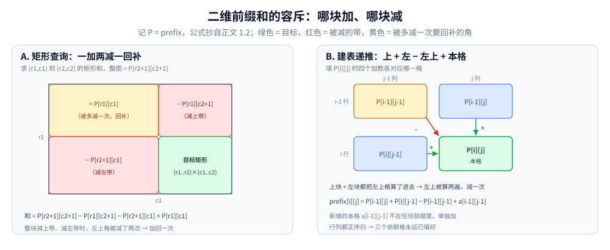
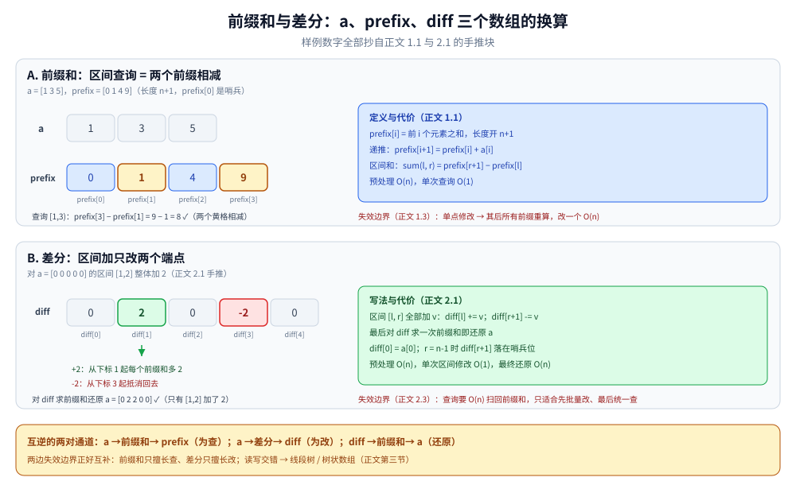

# 前缀和与差分

> 区间问题的两个入门利器：**前缀和**把区间查询压到 O(1)，**差分**把区间修改压到 O(1)。
> 它们的共同思想是「把区间操作转化为端点操作」，代价是只擅长其中一侧。
>
> ⭐ 边界先说清：本篇只讲**一维 / 二维前缀和与差分**。
> 需要「查询与修改都 O(log n)」时改用线段树 / 树状数组（见 [区间与索引树.md](../../数据结构/树/区间与索引树.md)）；
> 滑动窗口解决的是「连续子数组满足某条件」的另一类问题，见 [滑动窗口.md](滑动窗口.md)。
>
> 内容整理自个人学习笔记，素材见 [素材清单](../../../素材清单.md)。复杂度口径见 [复杂度分析.md](复杂度分析.md)。

---

## 一、前缀和怎么把区间查询压到 O(1)？

**本节要点**：预处理一个前缀数组，之后任意区间和都能用「两个前缀相减」得到。

### 1.1 一维前缀和

- 定义：`prefix[i] = a[0] + a[1] + ... + a[i-1]`（长度 n+1，避免边界特判）
- 区间和：`sum(l, r) = prefix[r+1] - prefix[l]`
- 预处理 O(n)，单次查询 O(1)
- 代码骨架（Go）：

```go
prefix := make([]int, n+1)
for i := 0; i < n; i++ {
	prefix[i+1] = prefix[i] + a[i]
}
// 查询 [l, r)
sum := prefix[r] - prefix[l]
```

小输入手推一遍（`a = [1 3 5]`）：

```text
a      = [1 3 5]
prefix = [0 1 4 9]          prefix[i] = 前 i 个元素之和
查询 [l=1, r=3)：sum = prefix[3] − prefix[1] = 9 − 1 = 8 ✓（a[1]+a[2] = 3+5）
```

### 1.2 二维前缀和

- 定义：`prefix[i][j]` 表示左上角 `(0,0)` 到 `(i-1,j-1)` 的矩形和
- 递推：`prefix[i][j] = prefix[i-1][j] + prefix[i][j-1] - prefix[i-1][j-1] + a[i-1][j-1]`
- 矩形查询：`(r1,c1)` 到 `(r2,c2)` 的和 = `prefix[r2+1][c2+1] - prefix[r1][c2+1] - prefix[r2+1][c1] + prefix[r1][c1]`
- ⚠️ **容斥原理**是二维前缀和的核心



左图读查询：整图（右下角前缀 `P[r2+1][c2+1]`）减上带 `P[r1][c2+1]`、减左带 `P[r2+1][c1]`，左上角 `P[r1][c1]` 被两条带各减一次、共减了两遍，所以要加回一次。右图读递推：上块 `P[i-1][j]` 与左块 `P[i][j-1]` 都把左上格算了进去 → 减一次，再单独加上不在任何前缀里的本格 `a[i-1][j-1]`。行列正序扫时三个依赖格永远已填好。

### 1.3 前缀和的失效边界

- **单点修改变 O(n)**：改一个元素，后面所有前缀都要重算
- 只支持**可逆运算**（加法、异或）；最值不行

---

## 二、差分怎么把区间修改压到 O(1)？

**本节要点**：差分数组记录「相邻元素的差」，对区间 `[l, r]` 加 `v` 只需改动两个端点。

### 2.1 一维差分

- 定义：`diff[i] = a[i] - a[i-1]`
- 边界约定：视下标 0 之前的元素为 0，故 `diff[0] = a[0]`
- `diff` 同样开 `n+1` 长度：`r = n-1` 时 `diff[r+1] -= v` 落在哨兵位，不越界
- 区间 `[l, r]` 全部加 `v`：`diff[l] += v; diff[r+1] -= v`
- 最后对 `diff` 求前缀和即还原 `a`
- 预处理 O(n)，单次区间修改 O(1)，最终还原 O(n)

小输入手推一遍（对 `a = [0 0 0 0 0]` 的区间 `[1, 2]` 整体加 2）：

```text
改前 diff = [0 0 0 0 0]
diff[1] += 2 → 2      （从下标 1 起每个前缀和多 2）
diff[3] -= 2 → -2     （从下标 3 起抵消回去）
改后 diff = [0 2 0 -2 0]
对 diff 求前缀和还原 a = [0 2 2 0 0] ✓（只有区间 [1,2] 加了 2）
```



上图读前缀和：`a = [1 3 5]` 配 `prefix = [0 1 4 9]`，查询 `[1,3)` 就是两个黄格相减——`prefix[3] − prefix[1] = 9 − 1 = 8`。下图读差分：对区间 `[1,2]` 整体加 2 只动两个端点，`diff[1] += 2` 让下标 1 起的每个前缀和多 2，`diff[3] -= 2` 从下标 3 起抵消回去，再对 `diff` 求前缀和就还原出 `a = [0 2 2 0 0]`。`prefix` 与 `diff` 对 `a` 互逆：一个为「查」服务、改一个元素要 O(n)，一个为「改」服务、查询要 O(n) 扫回前缀和——这正是第三节选型表的两列。

### 2.2 二维差分

- 对矩形 `(r1,c1)` 到 `(r2,c2)` 加 `v`：
  - `diff[r1][c1] += v`
  - `diff[r1][c2+1] -= v`
  - `diff[r2+1][c1] -= v`
  - `diff[r2+1][c2+1] += v`
- 最后做二维前缀和还原

### 2.3 差分的失效边界

- **单点查询 / 区间查询变 O(n)**：必须扫一遍前缀和
- 只适合「**先批量修改、最后统一查询**」的场景

---

## 三、前缀和 vs 差分：一张表怎么选？

**本节要点**：两者各只赢一侧——频繁读用前缀和、批量写用差分，读写交错时必须换结构。

| 操作 | 朴素 | 前缀和 | 差分 |
|---|---|---|---|
| 区间查询 | O(n) | ⭐ O(1) | O(n) |
| 单点修改 | O(1) | O(n) | O(1) |
| 区间修改 | O(n) | O(n) | ⭐ O(1) |
| 适用 | 数据量小 | **只读**、频繁查区间 | **只写**、最后统一查 |

⭐ **一句话判据**：**只有读 → 前缀和；只有写 → 差分；读写交错 → 线段树 / 树状数组。**

---

## 四、有哪些典型题型？

**本节要点**：五类可直接套用的母题——凡见「多次区间求和」想前缀和，凡见「批量区间加值」想差分。

- 和为 K 的子数组个数（前缀和 + 哈希表）
- 二维矩阵区域和检索（二维前缀和）
- 航班预订统计（一维差分）
- 拼车问题（差分 + 上下车事件）
- 矩形区域加值（二维差分）

---

## 延伸追问

- **前缀和为什么开 n+1 长度？** → 避免 `l = 0` 时的边界特判；`prefix[0] = 0` 是哨兵。
- **前缀和能不能处理动态修改？** → 不能。要动态查询与修改都是 O(log n)，用树状数组或线段树。
- **差分和前缀和是什么关系？** → 互为逆运算。差分数组的前缀和就是原数组；原数组的差分就是差分数组。
- **二维前缀和的递推怎么记？** → 容斥原理：`[i-1][j] + [i][j-1] - [i-1][j-1] + a[i-1][j-1]`。
- **差分能处理异或吗？** → 能，异或是自逆的；和前缀和一样只支持可逆运算。

---

## 关联

- [滑动窗口.md](滑动窗口.md) — 连续子数组的另一类解法
- [区间与索引树.md](../../数据结构/树/区间与索引树.md) — 线段树与树状数组（动态区间）
- [双指针.md](双指针.md) — 有序数组上的区间技巧
- [README.md](README.md) — 基础算法导读
> 反向引用（本篇被下列文档引到）：[字符串哈希.md](../字符串匹配/字符串哈希.md)
