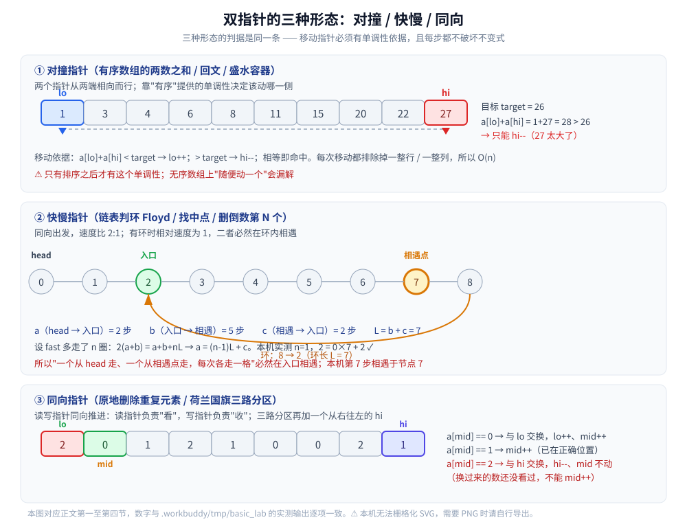

# 双指针

> 一个下标不够就用两个：三类形态（**对撞指针**、**快慢指针**、**同向指针**）各自的判据，
> 以及三类形态共用的那套**不变式论证** —— 它才是"为什么可以双指针"的答案。
>
> ⭐ 本篇是 [滑动窗口.md](滑动窗口.md) 的**上一层**：滑动窗口是同向指针的一个特例
> （左右指针都只增不减、窗口是两者的区间）。两篇的分工是：**左右指针的正确性论证写在本篇第五节**，
> 滑动窗口那一篇只引用、不重复；那边专讲窗口模板与判据。
>
> 内容整理自个人学习笔记，素材见 [素材清单](../../../素材清单.md)。链表与数组的表示见 [数组与链表.md](../../数据结构/线性结构/数组与链表.md)；
> 复杂度的口径见 [复杂度分析.md](复杂度分析.md)。
>
> 📎 本篇所有输出均为本机实跑逐字抄录：**Go 1.26.5（windows/amd64）** 与 **JDK 1.8.0_321** 各实现一份，
> 输出**逐行对齐**。

---

## 一、双指针到底是什么？

**本节要点**：全部机制一句话——**用两个下标分担"搜索空间"，并让它们各自只朝一个方向走**。看懂"每走一步排除掉什么"，后面的三种形态就只是同一件事的三种排布。

### 1.1 两个下标，各自单调

双指针不是某个具体算法，而是一类写法的统称。它的共同特征是：

| 特征 | 含义 |
|---|---|
| **两个下标** | `lo` 与 `hi`（也有叫 `i`/`j`、`slow`/`fast`、`read`/`write` 的） |
| **单调移动** | 每个下标**只朝一个方向走**，全程不回退 |
| **每步排除** | 每一次移动都能**排掉一整块不可能的区域**，而不是"试一下" |

⭐ 第三条才是重点。如果指针的移动只是"换个位置再看看"，那它就没有带来任何复杂度上的好处 —— 复杂度从 `O(n²)` 降到 `O(n)`，靠的正是"**每一步都排掉一批候选**"。

### 1.2 三类形态与各自的判据

| 形态 | 移动方式 | 判据（什么题能这么写） | 典型题 |
|---|---|---|---|
| **对撞指针** | 从两端相向而行，`lo` 增、`hi` 减 | 序列**有序**，移动哪一侧有明确依据（和太大就只能缩 `hi`） | 有序数组两数之和、回文串、盛水容器 |
| **快慢指针** | 同向出发，速度比 2:1（或 1:0） | 结构上存在**"走到底会回头"的环**，或需要"相对位置" | 链表判环、找中点、删倒数第 N 个 |
| **同向指针** | 同向推进，两个下标都只增不减 | 需要**原地**把元素分成几类，或"读一遍、写一遍" | 原地删除重复元素、荷兰国旗三路分区、滑动窗口 |



⭐ **三者不是三个算法**。它们的骨架是同一句话：`lo` 与 `hi` 都只增不减（对撞形态是 `hi` 只减），所以两个下标合计最多移动 `2n` 次 —— **这就是 `O(n)` 的全部来源**。

### 1.3 什么时候不能用

⚠️ 两个常见的误用：

1. **序列无序却用对撞指针**。`a = [1, 9, 4, 6]` 求两数之和为 `10`：`lo=0(1)`、`hi=3(6)`，和是 `7 < 10`。按对撞规则该 `lo++`，但正确答案是 `a[0] + a[1] = 1 + 9 = 10`，`lo` 一往前走就永远见不到 `a[1]` 了。**没有序，"移动哪一侧"就没有依据**；
2. **需要回看 / 回退的问题**。比如"最长的连续子序列，中途允许删掉一个元素"—— 删掉之后要重新衡量前面的一段，指针不能只增不减，这时该上动态规划（见 [LIS.md](../动态规划/LIS.md)）。

---

## 二、对撞指针：靠什么决定该动哪一侧？

**本节要点**：这一节把"有序"这个前提**用足**——证明每一次移动都是**排除了一整行 / 一整列**，从而不漏解。这是对撞指针的立身之本。

### 2.1 不变式：`lo` 与 `hi` 之外的全被排除

设数组升序。当前指针对是 `(lo, hi)`，那么：

> **不变式**：如果存在答案 `(i, j)` 且 `i < j`，则必然 `lo ≤ i` 且 `j ≤ hi`。

**为什么每一步都保住它**：

- 若 `a[lo] + a[hi] < target`：由于数组升序，对任何 `j ≤ hi` 都有 `a[lo] + a[j] ≤ a[lo] + a[hi] < target`，所以 **`lo` 不可能是答案的左端** → `lo++` 安全；
- 若 `a[lo] + a[hi] > target`：同理，对任何 `i ≥ lo` 都有 `a[i] + a[hi] ≥ a[lo] + a[hi] > target`，所以 **`hi` 不可能是答案的右端** → `hi--` 安全；
- 若相等，直接命中。

⭐ 一句话：**"和太小 → 只能换掉左端；和太大 → 只能换掉右端"**。每一次移动排除的都是整整一行（或一整列）候选，而不是一个格子 —— 这就是 `O(n²) → O(n)` 的账。

### 2.2 本机实测：与暴力 `O(n²)` 对照

有序数组 `[1 3 4 6 8 11 15 20 22 27]`，目标 `26`（本机实跑）：

```text
========== 实验一：对撞指针求两数之和（有序数组） ==========
数组 : [1 3 4 6 8 11 15 20 22 27]
目标 : 26
暴力 O(n^2) : a[2]+a[8]=4+22=26   比较 23 次
对撞指针    : a[2]+a[8]=4+22=26   比较 4 次
压缩比      : 23 / 4
```

⭐ 两版找到的是**同一对** `(2, 8)`（值 `4` 与 `22`），但比较次数差了一个数量级。注意暴力的 `23` 次是"**碰巧很早就命中**"的结果：如果目标改成不存在的 `28`，暴力要跑满 `C(10,2) = 45` 次，而对撞指针最多也就 9 次。**有序是唯一前提**——把数组打乱，对撞指针给出的 `(2, 8)` 就不再是唯一解了。

### 2.3 同类题为什么也是对撞

| 题 | 移动依据 |
|---|---|
| **回文串** | `s[lo] != s[hi]` 时**立刻可以判定不是回文**（两端必须相等，没有别的可能） |
| **盛水容器** | 面积 = `min(h[lo], h[hi]) × (hi − lo)`。移动较高的那一侧：宽度一定变小，而高度受制于矮的那一侧，**不会变大** → 只能移动矮的那一侧 |
| **两数之和（有序）** | 见 2.1 |

⚠️ 三个题的不变式写法不同，但内核一致：**"移动某一侧"必须能证明"不可能变差 / 不会漏解"**。盛水容器这一题的证明常被略过，实则是最容易"看起来对但说不出理由"的一题。

### 2.4 代价：排序改变了什么

对撞指针要求有序，无序输入就得先排一次 —— 总复杂度变成 `O(n log n + n) = O(n log n)`，不再是线性的。所以：

- 输入**本来就有序**（或可以维持有序）：直接用，`O(n)`；
- 输入无序且**要求返回原下标**：排序会打乱下标，必须把 `(值, 原下标)` 一起排，或者改用哈希计数（`O(n)` 时间、`O(n)` 空间）；
- 输入无序且**只要值**（不要下标）：排序后再对撞，是常见取舍。

---

## 三、快慢指针：为什么相遇就一定有环？

**本节要点**：这一节回答两个问题——① 为什么"相遇"等价于"有环"（相对速度论证）；② 相遇之后怎么找到**环的入口**（一段能被实测验证的推导）。

### 3.1 相对速度论证：无环走不到一起

`slow` 每次走 1 步、`fast` 每次走 2 步，都从 `head` 出发。

- **无环**：链表有终点。`fast` 每轮比 `slow` 多走 1 步，会先撞到 `nil` 然后停下来 —— **永远不会与 `slow` 相遇**；
- **有环**：进环之后，两个指针都在环里绕。此时换成"以 `slow` 为参照系"看：`fast` 相对 `slow` 的速度是 **2 − 1 = 1 步/轮**。在一个长为 `L` 的环上，每隔 1 步就接近一格，**必然在至多 `L` 轮内追上**（相对距离每次减 1，不可能跳过）。

⭐ 关键就是"**相对速度为 1**"。若取 `fast` 走 3 步、`slow` 走 1 步，相对速度变成 2；当 `L` 是偶数时 `fast` 可能每次都"跨过"`slow` 而永远不落在同一格 —— **这也是为什么标准写法是 2:1，而不是 3:1 或其他**。

### 3.2 本机实测：逐步打印 slow / fast

链表 `0→1→2→3→4→5→6→7→8`，且 `8→2`（即环是 `2→3→…→8→2`，环长 `L = 7`）：

```text
========== 实验二：Floyd 判圈逐步过程 ==========
链表 : 0→1→2→3→4→5→6→7→8，且 8→2（环入口 = 2）
  第  1 步: slow=1  fast=2
  第  2 步: slow=2  fast=4
  第  3 步: slow=3  fast=6
  第  4 步: slow=4  fast=8
  第  5 步: slow=5  fast=3
  第  6 步: slow=6  fast=5
  第  7 步: slow=7  fast=7   ← slow 与 fast 相遇
相遇点 = 7，共走 7 步
环长   = 7
环入口 = 2
距离   : a(head→入口)=2  b(入口→相遇)=5  c(相遇→入口)=2
验证   : a == c + (n-1)*(b+c)  →  2 == 2 + (1-1)*(5+2) = 2
```

⚠️ 看第 4~6 步：`fast` 从 `8` 绕回 `3`（`8→2→3`），**位置数值变小了**——这不是"回退"，是环的必然。手推时最容易在这里误判成"`fast` 走错了"。

### 3.3 环入口：`a = c + (n−1)(b+c)`

设：

- `a` = `head` 到环入口的距离（本机实测 `2`）；
- `b` = 环入口到相遇点的距离（`5`）；
- `c` = 相遇点沿环再走到入口的距离（`2`）；
- `L = b + c` = 环长（`7`）。

**推导**：相遇时 `slow` 走了 `a + b`；`fast` 走了 `a + b + nL`（`n` 是它在环里多绕的圈数）。又因为 `fast` 速度是 `slow` 的两倍：

```text
2(a + b) = a + b + nL
   a + b = nL
       a = nL − b = (n−1)L + (L − b)
       a = c + (n−1)L          ← 因为 L − b = c
```

⭐ **结论**：`a ≡ c (mod L)`。所以"**让一个指针回到 `head`、另一个留在相遇点，两个每次都走 1 步**"，它们会在环入口相遇 —— 前者走了 `a`，后者走了 `c` 再绕若干圈，落点相同。本机实测 `n = 1`，`2 = 2 + 0×7` 成立。

⚠️ `n` 具体是几**不重要**：结论是取模意义上的，所以"两指针各走一步"的写法对任意 `n` 都对。

### 3.4 同一套骨架的其它用法

| 用法 | 怎么定速度 | 判据 |
|---|---|---|
| **找中点** | `slow` 1 步、`fast` 2 步，`fast` 到底时 `slow` 在中点 | 无环链表；偶数长度时 `slow` 落在后半段的第一个 |
| **删倒数第 N 个** | 先让 `fast` 先走 `N` 步，再一起走 | 两者间距恒为 `N`，`fast` 到底时 `slow` 正好在待删节点的前一个 |
| **判快乐数** | 每次把"各位平方和"当下一步，`fast` 一步算两次 | 等价于在**函数图**上判环（不收敛到 1 就一定进环） |

⭐ 这三种用法的容器都只是"两个 `next` 指针"，没有链表也能用（数组下标、函数映射都行）—— **判环的本质是"函数图上的环"，不是"链表"**。

---

## 四、同向指针：读写分离与三路分区

**本节要点**：同向指针的两个下标含义不同——一个"看"、一个"收"。三路分区是它最讲究的形态：**三个指针、四个区间**，且有一处反直觉的"不前进"。

### 4.1 原地删除重复元素：写指针只在需要时前进

有序数组去重，要求原地、`O(1)` 额外空间。用 `read`（读指针）与 `write`（写指针）：

```go
// 有序数组原地去重，返回去重后的长度
func removeDuplicates(a []int) int {
	if len(a) == 0 {
		return 0
	}
	write := 1 // a[0] 一定保留
	for read := 1; read < len(a); read++ {
		if a[read] != a[write-1] { // ⭐ 与「已写入的最后一个」比，而不是与 a[read-1] 比
			a[write] = a[read]
			write++
		}
	}
	return write
}
```

⭐ 不变式：**`a[0..write)` 是已经去重好的前缀，且 `a[write-1]` 是它的最后一项**。`read` 永远领先于 `write`（只在不重复时才追近），所以"边读边写"不会覆盖还没读的数据 —— 这是"原地"能成立的唯一理由。

⚠️ 判据要写 `a[read] != a[write-1]` 而不是 `a[read] != a[read-1]`：后者在"连续三个相同"时只删掉一个。

### 4.2 荷兰国旗三路分区：逐帧实测

把只含 `0 / 1 / 2` 的数组原地排好，要求**一趟扫描**。用三个指针 `lo`、`mid`、`hi`，四个区间：

```text
[0, lo)  全是 0
[lo, mid) 全是 1
[mid, hi] 还没看过
(hi, n)  全是 2
```

数组 `[2 0 1 2 1 0 0 2 1]`，本机实跑（每步都打印完整状态）：

```text
========== 实验三：荷兰国旗三路分区逐步状态 ==========
数组 : 只含 0 / 1 / 2 三种值
初始      : [2 0 1 2 1 0 0 2 1]    lo=0 mid=0 hi=8
第  1 步: [1 0 1 2 1 0 0 2 2]    lo=0 mid=0 hi=7   (a[mid]=2 → 与 hi 交换, hi--, mid 不动)
第  2 步: [1 0 1 2 1 0 0 2 2]    lo=0 mid=1 hi=7   (a[mid]=1 → mid++)
第  3 步: [0 1 1 2 1 0 0 2 2]    lo=1 mid=2 hi=7   (a[mid]=0 → 与 lo 交换, lo++, mid++)
第  4 步: [0 1 1 2 1 0 0 2 2]    lo=1 mid=3 hi=7   (a[mid]=1 → mid++)
第  5 步: [0 1 1 2 1 0 0 2 2]    lo=1 mid=3 hi=6   (a[mid]=2 → 与 hi 交换, hi--, mid 不动)
第  6 步: [0 1 1 0 1 0 2 2 2]    lo=1 mid=3 hi=5   (a[mid]=2 → 与 hi 交换, hi--, mid 不动)
第  7 步: [0 0 1 1 1 0 2 2 2]    lo=2 mid=4 hi=5   (a[mid]=0 → 与 lo 交换, lo++, mid++)
第  8 步: [0 0 1 1 1 0 2 2 2]    lo=2 mid=5 hi=5   (a[mid]=1 → mid++)
第  9 步: [0 0 0 1 1 1 2 2 2]    lo=3 mid=6 hi=5   (a[mid]=0 → 与 lo 交换, lo++, mid++)
结果      : [0 0 0 1 1 1 2 2 2]    共 9 步
```

⭐ 三条规则各自对应一个区间的边界：

| `a[mid]` | 动作 | 为什么 |
|---|---|---|
| `0` | 与 `a[lo]` 交换，`lo++`、`mid++` | 换过来的 `a[lo]` 原本属于"全是 1"的区间，**已经看过**，所以 `mid` 可以走 |
| `1` | `mid++` | 它已经在正确区间的右端，直接纳入 |
| `2` | 与 `a[hi]` 交换，`hi--`、**`mid` 不动** | 换过来的元素**来自"还没看过"的区间**，还没被检查过 |

### 4.3 ⚠️ 为什么 `2` 的时候 `mid` 不能动

这是三路分区唯一反直觉的地方，也是最常见的写错点。看实测的**第 5、6 步**：

- 第 5 步 `mid=3`（值 `2`）与 `hi=7`（值 `2`）交换 —— 换过来还是 `2`，数组没变，但 `hi` 减到 `6`；
- 第 6 步 `mid` 仍是 `3`，这次与 `hi=6`（值 `0`）交换 —— 数组变成 `[0 1 1 0 1 0 2 2 2]`，`hi` 减到 `5`。

如果第 6 步交换后顺手 `mid++`，那个刚从 `hi` 换过来的 `0` 就被跳过了 —— 它会永远留在 `[lo, mid)` 之外，最终结果里出现一个位置错误的 `0`。**"换过来的没看过"是唯一理由，记住它就够了。**

⭐ 另一个观察：`mid` 越过 `hi` 时（第 9 步后 `mid=6 > hi=5`）循环结束。此时 `[mid, hi]` 这个区间已经空了，四个区间刚好拼满整个数组。**循环条件是 `mid <= hi`，不是 `mid < hi`。**

---

## 五、共用的方法论：不变式论证

**本节要点**：三类形态的"为什么对"是同一种论证。这一节把它抽出来，作为写双指针前**必做的自检**——它也是"看起来对但证不出来"的分水岭。（[滑动窗口.md](滑动窗口.md) 直接引用本节，不再重复。）

### 5.1 三件套：状态 → 单调 → 排除

任何双指针写法的正确性论证，都能写成这三步：

| 步骤 | 要回答的问题 | 没答上来的后果 |
|---|---|---|
| **① 状态** | 两个下标把数组切成了哪几块？每块的含义是什么？ | 说不清"哪部分已定稿"，`mid++` 该不该动就只能靠猜 |
| **② 单调** | 每个下标为什么只朝一个方向走？ | 说不清就是 `O(n)` 的账没了 |
| **③ 排除** | 移动一步排除了哪些**还没被检验的候选**？ | 说不清就是可能漏解 —— 而漏解通常不报错，只是答案偏小 |

### 5.2 三个形态的不变式各是什么

| 形态 | ① 状态（区间含义） | ② 单调 | ③ 排除（移动一步排掉了什么） |
|---|---|---|---|
| **对撞** | `(lo, hi)` 之外的对已被判定不可能 | `lo` 只增、`hi` 只减 | 和偏小 → 排掉所有以 `a[lo]` 为左端的对；偏大 → 排掉所有以 `a[hi]` 为右端的对 |
| **快慢** | `slow` 之前已确定无环；环内用相对速度看 | 两者都只前进 | `fast` 每轮比 `slow` 多走一步，环上相对距离每次减 1 → 不可能跳过 |
| **同向** | `[0, write)` 已定稿、`[read, n)` 未读 | 两者都只增 | `read` 扫过的元素要么被写入、要么被判定为重复 |

⭐ 三行对照下来，**结构完全相同**：先划定"哪些已定稿"，再说明"每步怎么让未定稿的部分缩小"，最后证明"缩小的那部分是安全的"。**这就是"为什么可以双指针"的统一答案。**

### 5.3 自检清单

写不出上面三步里任何一步，就先别写代码。几个具体的自检问句：

1. 我这个 `mid`（或 `lo` / `hi`）**不动**的那一次，不动的原因是什么？（说不出就是 4.3 那类 bug）
2. 循环条件是 `<` 还是 `<=`？**最后一个元素有没有被检查过**？
3. 空数组、单元素数组会不会越界？（本篇两份实现都用 `len(a) == 0` 提前返回，`[lo, hi)` 的空区间不进入循环）
4. 有没有"回退"需求？有就说明这件事不是双指针的题。

---

## 使用：双指针在你写的代码里以什么形式出现

双指针很少作为"一个算法"被调用，它更像一种**写循环的习惯**。结合本仓库其它篇目，落点有三层：

**第一层：有序数据的归并（最常见）**。归并排序的 `merge` 就是同向双指针：两个有序段各一个读指针，谁小取谁。由此派生出"两个有序切片求交集 / 去重 / 求中位数"这一整类代码 —— 它们比"用 map 存一边再查另一边"省一份哈希空间。相关：[查找与排序对比.md](查找与排序对比.md)（归并与外排的选型）。

**第二层：原地处理（省一次分配）**。日志清洗、有序数组去重、把某个值移到末尾（4.1 的写法），这些场景里"新开一个切片再 append"当然更简单，但**分配和拷贝的代价要按数据量算**：一亿行日志上多一次全量拷贝，就是几百 MB 的额外内存。⚠️ 代价是这类写法**会改写入参**，调用方如果不希望原数组被改，必须先自己复制。

**第三层：环与中点的检测**。判环、找中点、删倒数第 N 个都是"两个 `next` 指针"的事，不限于链表：数组下标、哈希链、函数映射（快乐数）都能用。⚠️ 工程里更常见的形态是**检测"指针链上的环"**：配置的继承链、符号链接的指向、任务依赖的软链 —— 这些都是"沿着一个 `next` 一直走"，一旦有环就是死循环。相关：[拓扑排序.md](../图论算法/拓扑排序.md) 的判环是同一件事的另一条路（入度法）。

⭐ **归纳成一条判断**：**当你能说清"每走一步排掉了哪一批候选"，就可以用双指针；说不清，就老实用暴力或哈希。** 复杂度的那点收益，全押在这句话上。

---

## 延伸追问

- **为什么对撞指针必须先排序？** → 因为"移动哪一侧"的依据来自**单调性**（和偏小只能换左端）。无序时这个依据不存在，`lo++` 会漏解（1.3 的反例）。
- **快慢指针为什么不能用 3:1 的速度比？** → 相对速度变大后可能"跨过"而不落在同一格。2:1 的相对速度为 1，环上距离每轮减 1，不可能跳过（3.1）。
- **相遇点为什么不是环入口？** → 相遇点是"相对距离归零"的位置，与入口相差 `b`；由 `a ≡ c (mod L)` 才能定位入口（3.3）。**两步不能合并成一步。**
- **`a = c + (n−1)L` 里的 `n` 需要知道吗？** → 不需要。结论是取模意义上的，所以"一个从 `head`、一个从相遇点，各走一步"对任意 `n` 都成立。
- **荷兰国旗里交换 `2` 之后 `mid` 为什么不动？** → 换过来的元素来自"还没看过"的区间（4.3 实测第 5、6 步）。动一次 `mid` 就漏掉一个元素。
- **三路分区能不能套用到"把负数放左边、0 在中间、正数在右边"？** → 能。它要求的只是"**有一个全序 + 三类**"，`< 0 / == 0 / > 0` 与 `< 1 / == 1 / > 1` 结构相同。
- **双指针对"两个有序数组求中位数"怎么用？** → 那其实是**二分**的题（第 k 小），双指针只能做到 `O(m+n)`；要 `O(log(m+n))` 得靠二分排除一半。⚠️ 别看到"两个指针"就往上套。
- **它能省内存吗？** → 能省**一份**哈希表或一份拷贝，但不能省到 `O(1)` 之外：双指针本身只占两个下标，通常是 `O(1)` 额外空间。
- **`O(n)` 是严格的上界吗？** → 是。两个下标合计最多移动 `2n` 次，每次是常数操作，所以最坏也是 `O(n)`；这也是它比 `O(n²)` 稳的原因 —— **没有"碰巧很快"，只有"一定很快"**。

---

## 关联

- [滑动窗口.md](滑动窗口.md) — **下一层**：滑动窗口是同向指针的特例（区间两端都只增不减）；窗口模板、判据与两个易错点写在那里，共用方法论见本篇第五节
- [复杂度分析.md](复杂度分析.md) — `O(n)` / `O(n log n)` / `O(n²)` 的推导口径，以及"每步排除一批候选"这类摊还式的记账方法
- [数组与链表.md](../../数据结构/线性结构/数组与链表.md) — 链表表示（`next` 指针）、数组与切片的原地操作语义
- [查找与排序对比.md](查找与排序对比.md) — 归并排序的 `merge` 就是同向双指针；排序改变下标语义的问题在此
- [LIS.md](../动态规划/LIS.md) — 「不能双指针」的对照：需要回看的问题要走 DP
- [LCS.md](../动态规划/LCS.md) — 二维状态转移，与一维上的对撞/同向是两个层次
- [活动选择.md](../贪心/活动选择.md) — 同样是"排序 + 单向扫描"，但扫描的是区间而不是下标对
- [拓扑排序.md](../图论算法/拓扑排序.md) — 判环的另一条路（入度法），与快慢指针形成对照
- [KMP.md](../字符串匹配/KMP.md) — 前缀函数里的 `j` 回退是"指针可以退"的典型，正说明它不是双指针
- [限流算法.md](../../../04-架构与系统/分布式/服务治理/限流算法.md) — ⚠️ 同名不同物：那里的"滑动窗口"是限流的窗口计数，与本篇无关
- [Go算法题.md](../../../07-面试/Go算法题.md) — 双指针与滑动窗口在具体题目里的写法与模板
> 反向引用（本篇被下列文档引到）：[前缀和与差分.md](前缀和与差分.md)、[摩尔投票.md](摩尔投票.md)
