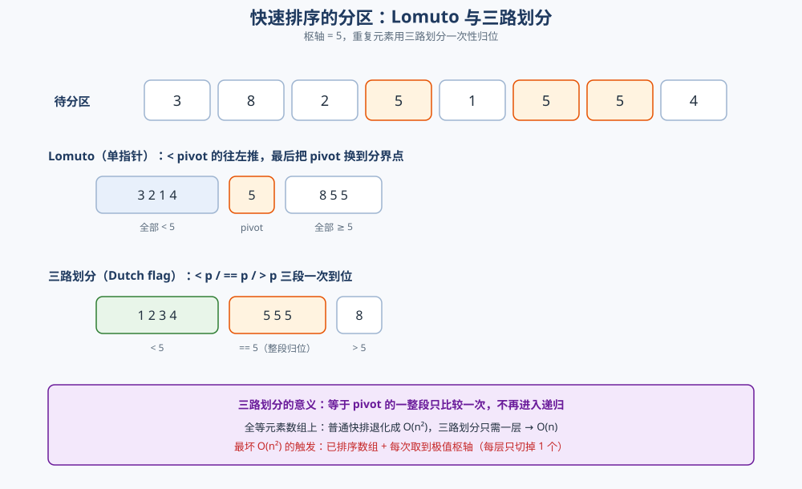
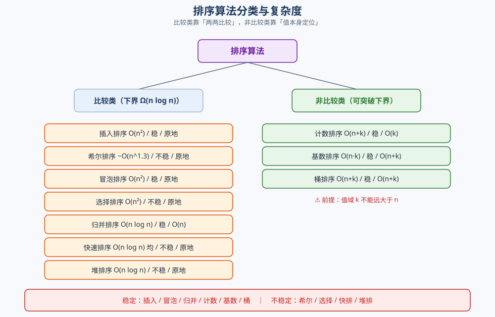

# 排序算法

> 比较类排序的**原理与实现**——插入 / 希尔 / 冒泡 / 选择 / 归并 / 快速 / 堆排序，逐算法说清**分区怎么分、合并怎么合、上浮下沉怎么写、稳定性从哪来、复杂度怎么推**；
> 非比较类（计数 / 基数 / 桶）为什么能突破 `O(n log n)`；以及**本机实跑**的耗时对照、快排最坏情况数据与稳定性验证。
>
> ⭐ 本篇讲**算法内部与实现**。谁是「最常用的排序、工程上怎么选、标准库为什么各选不同策略」见同目录 [查找与排序对比.md](查找与排序对比.md) ——
> 那里是**横向对比与选型**，这里是**原理与实现**，两篇互引不重复。
>
> 内容整理自个人学习笔记，素材见 [素材清单](../../../素材清单.md)。复杂度口径见 [复杂度分析.md](复杂度分析.md)；
> 分治的方法论见 [递归与分治.md](递归与分治.md)；堆这个数据结构的完整实现属于另一主题，本篇只讲「堆排序怎么用堆」。
>
> 📎 本篇所有输出均为本机实跑逐字抄录：**Go 1.26.5（windows/amd64）** 与 **JDK 1.8.0_321** 各实现一份，
> 排序结果、稳定性、比较次数**逐行对齐**（两语言共用同一个 LCG 生成同一组数据），只有耗时行随机器波动。

---

## 一、比较类的基础三种：插入、希尔、冒泡、选择怎么写？

**本节要点**：这四种是「最朴素但最有教学价值」的排序。看它们的**交换 / 移动次数**与**是否利用已有顺序**，就理解了后面所有优化的动机。

### 1.1 插入排序：把新牌插进已排好的手牌

**原理**：维护前缀 `[0, i)` 有序，把 `a[i]` 往前挪到正确位置。

```go
func insertionSort(a []int) {
	for i := 1; i < len(a); i++ {
		v := a[i] // 抽出一张牌
		j := i - 1
		for j >= 0 && a[j] > v { // 比 v 大的整体右移
			a[j+1] = a[j]
			j--
		}
		a[j+1] = v // 插入
	}
}
```

⭐ **两个性质**：
- **稳定**：`a[j] > v` 才移动，相等时**不动**——相等元素的相对次序被保住；
- **自适应**：数组基本有序时接近 `O(n)`（内层循环几乎不执行）。

### 1.2 希尔排序：分组做插入，逐步收窄 gap

**原理**：先用大间隔 `gap` 把数组分成若干子序列各自插入排序（让元素**大步**接近目的地），再逐步缩小 `gap` 到 1（最后一次就是普通插入排序，但此时数组已基本有序）。

```go
func shellSort(a []int) {
	n := len(a)
	for gap := n / 2; gap > 0; gap /= 2 {
		for i := gap; i < n; i++ {
			v := a[i]
			j := i
			for j >= gap && a[j-gap] > v {
				a[j] = a[j-gap] // 按 gap 跨步移动
				j -= gap
			}
			a[j] = v
		}
	}
}
```

⚠️ **希尔排序不稳定**：相等元素可能在**不同 gap 的序列**里被跨步换位，相对次序被打乱（本机实测 `稳定(保序)=false`）。

### 1.3 冒泡排序：为什么慢，优化点在哪

**原理**：相邻两两比较，大的往右「冒」。

```go
func bubbleSort(a []int) {
	n := len(a)
	for i := 0; i < n-1; i++ {
		swapped := false // ⭐ 优化：本轮无交换 → 已有序，提前退出
		for j := 0; j < n-1-i; j++ {
			if a[j] > a[j+1] {
				a[j], a[j+1] = a[j+1], a[j]
				swapped = true
			}
		}
		if !swapped {
			return
		}
	}
}
```

⚠️ **它慢的根因**：每次只把元素移动**一格**。逆序对是 `O(n²)`，而每次交换只消掉 **1** 个逆序对 → 无论如何都是 `O(n²)`。插入排序虽然也是 `O(n²)`，但它**一次能移动多格**，常数小得多（实测冒泡 694 ms vs 插入 108 ms，见第七节）。

⭐ **`swapped` 优化**只对**基本有序**的输入有效（最好情况降到 `O(n)`），对随机数据毫无帮助。

### 1.4 选择排序：为什么也不稳定

**原理**：每轮从未排序区间里选最小的，放到区间头部。

```go
func selectionSort(a []int) {
	n := len(a)
	for i := 0; i < n-1; i++ {
		m := i
		for j := i + 1; j < n; j++ {
			if a[j] < a[m] {
				m = j
			}
		}
		a[i], a[m] = a[m], a[i] // 长距离交换
	}
}
```

⚠️ **选择排序不稳定**：交换是**长距离**的——把最小值换到前面时，可能跨过与它相等、但原本排在前面的元素（本机实测 `稳定(保序)=false`）。而且它对输入完全不敏感，任何数据都是 `O(n²)`。

---

## 二、归并排序：分治 + 稳定 + 外部排序的基础？

**本节要点**：归并的重心在**「合」**。理解 `merge` 那一行 `<=` 的写法，就理解了它的稳定性；理解「每层扫 n 个、共 log n 层」，就理解了它的复杂度。

### 2.1 分治三步

归并对半分（**分**）→ 递归到单元素（**治**）→ 两个有序段归并（**合**）：

```go
func mergeSortRec(a, buf []int, lo, hi int) {
	if lo >= hi {
		return
	}
	mid := lo + (hi-lo)/2
	mergeSortRec(a, buf, lo, mid)
	mergeSortRec(a, buf, mid+1, hi)
	i, j, k := lo, mid+1, lo
	for i <= mid && j <= hi {
		if a[i] <= a[j] { // ⭐ <=：相等时取左段，这是稳定的来源
			buf[k] = a[i]
			i++
		} else {
			buf[k] = a[j]
			j++
		}
		k++
	}
	for i <= mid { // 左段剩余
		buf[k] = a[i]
		i++
		k++
	}
	for j <= hi { // 右段剩余
		buf[k] = a[j]
		j++
		k++
	}
	copy(a[lo:hi+1], buf[lo:hi+1])
}
```

### 2.2 稳定性从哪来

⭐ **稳定性全在 `if a[i] <= a[j]` 这一个符号上**：当左右两段出现**相等元素**时，优先取**左段**的那个——而左段的元素在原始数组里**必定排在右段元素前面**（因为左半是原数组的前半）。所以相等元素的相对次序被保住。

⚠️ 如果写成 `a[i] < a[j]`（相等时取右段），相等元素就会**跨段换序**，稳定性立刻丢失。

### 2.3 复杂度与外部排序

- **时间**：每层合并总量恒为 `n`，平衡树层数 `log n` → **最好 / 平均 / 最坏都是 `O(n log n)`**（没有退化）；
- **空间**：需要 `O(n)` 临时数组（这是它唯一的「贵」）；
- **外部排序的基础**：内存放不下时，做法是「分块排序 → 多路归并」，**归并阶段只顺序读写**、且要求稳定（见 [查找与排序对比.md](查找与排序对比.md) 第四节）。

---

## 三、快速排序：分区方案怎么选？

**本节要点**：快排的重心在**「分」**（分区）。Lomuto 好写但慢、Hoare 交换少但易错、三路划分专治重复元素；**所有优化都在控层数**。

### 3.1 两种分区方案

**Lomuto（单指针）**：`pivot` 取末元素，把所有 `< pivot` 的往左推，最后把 `pivot` 换到分界点。

```go
func lomutoPartition(a []int, lo, hi int) int {
	pivot := a[hi]
	i := lo
	for j := lo; j < hi; j++ {
		if a[j] < pivot {
			a[i], a[j] = a[j], a[i]
			i++
		}
	}
	a[i], a[hi] = a[hi], a[i] // pivot 归位到 i
	return i
}
```

**Hoare（双指针相向）**：`i` 从左找 `>= pivot`，`j` 从右找 `<= pivot`，交换后继续，直到相遇。

```go
func hoarePartition(a []int, lo, hi int) int {
	pivot := a[lo+(hi-lo)/2] // ⭐ 取中间元素，不在两端来回交换
	i, j := lo-1, hi+1
	for {
		i++
		for a[i] < pivot {
			i++
		}
		j--
		for a[j] > pivot {
			j--
		}
		if i >= j {
			return j
		}
		a[i], a[j] = a[j], a[i]
	}
}
```

| 维度 | Lomuto | Hoare |
|---|---|---|
| 交换次数 | 较多（每个 `< pivot` 都可能换） | 较少（相向交换） |
| 实现难度 | 简单 | 易错（边界 `i>=j`） |
| 对重复元素 | 差（`== pivot` 全堆在一侧） | 较好（`== pivot` 会被均分到两侧） |
| 枢轴位置 | 必须能取到两端之外（末元素） | 可在中间取 |

### 3.2 枢轴选择：决定层数

⭐ **枢轴选得均匀 → 层数 `log n` → `O(n log n)`；每次都取到极值 → 层数 `n` → `O(n²)`。** 三种做法：

| 做法 | 效果 |
|---|---|
| 固定取首/末元素 | ⚠️ **已排序数组上必然退化**，实测见第七节 |
| 随机取 | 把最坏概率降到极低（期望 `O(n log n)`） |
| 三数取中 | 取 lo/mid/hi 的中位数，对已排序输入免疫 |

### 3.3 三路划分：一次处理重复元素

当数组有**大量重复元素**时，把区间分成**三段** `< pivot` / `== pivot` / `> pivot`，中间那段**直接归位、不再递归**：

```go
func quick3WayRec(a []int, lo, hi int) {
	if lo >= hi {
		return
	}
	pivot := a[lo+(hi-lo)/2]
	lt, i, gt := lo, lo, hi
	for i <= gt {
		if a[i] < pivot {
			a[lt], a[i] = a[i], a[lt]
			lt++
			i++
		} else if a[i] > pivot {
			a[i], a[gt] = a[gt], a[i]
			gt-- // ⚠️ 不递增 i：换过来的元素还没看过
		} else {
			i++ // == pivot，留在中间段
		}
	}
	quick3WayRec(a, lo, lt-1) // 只递归 < 和 > 两段
	quick3WayRec(a, gt+1, hi)
}
```



⭐ **意义**：全等元素数组上，普通快排会退化成 `O(n²)`（每次分区只切下 1 个），而三路划分**一层就把相等的整段排除**，复杂度降到 `O(n)`。

### 3.4 最坏 `O(n²)` 何时发生

**触发条件**：**每次分区都取到极值枢轴**，即每层只切掉 1 个元素，递归树退化成一条链（`n` 层，每层扫 `n` 个）。

⭐ **最经典的触发场景**：**已排序数组 + 固定取首/末元素枢轴**——此时每次枢轴恰好是最大（或最小）元素。实测数据见 7.2。

⚠️ **另一类触发**：**全部元素相等 + Lomuto**。每次分区把 pivot 放到一端，也是每层只切 1 个 → `O(n²)`。这也是三路划分存在的理由。

---

## 四、堆排序：只用一节讲清「堆排怎么用堆」

**本节要点**：堆排序 = **先把数组整理成大顶堆，再反复「把堆顶换到末尾 + 下沉修复」**。它只用「下沉」这一个动作，`O(1)` 额外空间，但**不稳定**。

### 4.1 建堆：从最后一个非叶节点往前下沉

```go
func heapSort(a []int) {
	n := len(a)
	for i := n/2 - 1; i >= 0; i-- { // ⭐ 从 n/2-1 往前：最后一个非叶节点开始
		siftDown(a, i, n)
	}
	for end := n - 1; end > 0; end-- {
		a[0], a[end] = a[end], a[0] // 堆顶（最大）归位到末尾
		siftDown(a, 0, end)         // 剩下的区间重新下沉修复
	}
}
```

### 4.2 下沉：把「不听话的根」按大顶堆规则往下换

```go
func siftDown(a []int, i, n int) {
	for {
		l, r, big := 2*i+1, 2*i+2, i // 数组存完全二叉树：孩子下标 2i+1 / 2i+2
		if l < n && a[l] > a[big] {
			big = l
		}
		if r < n && a[r] > a[big] {
			big = r
		}
		if big == i { // 已经比两个孩子都大，到位
			return
		}
		a[i], a[big] = a[big], a[i]
		i = big // 继续往下
	}
}
```

⭐ **两个关键数字**：
- **建堆是 `O(n)` 而不是 `O(n log n)`**——因为大部分节点在下层、下沉距离短，自下而上求和收敛到 `O(n)`（严格推导见 [复杂度分析.md](复杂度分析.md)）；
- **数组存二叉堆的下标关系**：节点 `i` 的孩子是 `2i+1` / `2i+2`，父是 `(i-1)/2`。

### 4.3 排序过程与「为什么不稳定」

排序循环：**把堆顶（当前最大）与末尾元素交换 → 末尾归位 → 剩余部分下沉修复**。重复 `n-1` 次，得到升序。

⚠️ **堆排序不稳定**：堆顶与末尾的交换是**长距离**的，会把相等元素跨过彼此（本机实测 `稳定(保序)=false`）。和选择排序是同一个原因——**长距离交换破坏相对次序**。

⭐ **复杂度**：建堆 `O(n)` + `n-1` 次下沉 `O(log n)` → 最好 / 平均 / 最坏**都是 `O(n log n)`**，且额外空间 `O(1)`。它是「最坏有保证 + 原地」的组合，这也是 introsort 用它做兜底的原因（见 [查找与排序对比.md](查找与排序对比.md) 第四节）。

---

## 五、非比较类排序：计数、基数、桶

**本节要点**：非比较类**不比较元素大小**，而是靠「值本身」定位，因而能突破比较排序的 `Ω(n log n)` 下界。**代价是要求值域可控。**

### 5.1 计数排序：值域做下标

**前提**：值域 `[0, k]`，`k` 不能远大于 `n`。用值当数组下标统计个数，再按顺序倒出。

```go
func countingSort(a []int, maxVal int) {
	cnt := make([]int, maxVal+1)
	for _, v := range a {
		cnt[v]++ // 值即下标
	}
	idx := 0
	for v, c := range cnt {
		for ; c > 0; c-- {
			a[idx] = v
			idx++
		}
	}
}
```

⭐ **`O(n + k)`**：扫一遍统计 `n`，扫一遍值域 `k`。**适合年龄、分数、状态码**这类小值域数据。⚠️ `k` 巨大时（如 ID 号）`O(k)` 的空间与初始化直接吞掉收益。

### 5.2 基数排序（LSD）：按位从低到高，逐位计数

**原理**：对十进制从**最低位**开始，每一位做一次**稳定**的计数排序；`d` 位就做 `d` 轮。

```go
func radixSortLSD(a []int) {
	// 取最大值决定位数
	max := a[0]
	for _, v := range a {
		if v > max {
			max = v
		}
	}
	buf := make([]int, len(a))
	for exp := 1; max/exp > 0; exp *= 10 {
		cnt := make([]int, 10)
		for _, v := range a {
			cnt[(v/exp)%10]++
		}
		for i := 1; i < 10; i++ {
			cnt[i] += cnt[i-1] // 前缀和 → 每个桶的结束位置
		}
		for i := len(a) - 1; i >= 0; i-- { // ⭐ 从后往前扫，保证稳定
			d := (a[i] / exp) % 10
			cnt[d]--
			buf[cnt[d]] = a[i]
		}
		copy(a, buf)
	}
}
```

⭐ **两个「必须」**：
- **必须是稳定排序**（这里的计数排序），否则上一轮的高位顺序会被打乱；
- **必须从后往前扫**写回，配合前缀和，才能让同一桶内保持原顺序。

⚠️ **基数排序只对「定长可分解的键」有效**：整数、定长字符串。浮点数、变长字符串要先做**序保持的转换**。

### 5.3 桶排序：先分桶，桶内各排各的

**原理**：把值域均分成 `k` 个桶，元素按值落到对应桶，**每个桶内部单独排序**（常用插入排序），最后按桶顺序拼接。

```go
func bucketSort(a []int) {
	max := a[0]
	for _, v := range a {
		if v > max {
			max = v
		}
	}
	buckets := make([][]int, bucketCount)
	for _, v := range a {
		idx := v * bucketCount / (max + 1) // 值域均分到桶
		buckets[idx] = append(buckets[idx], v)
	}
	idx := 0
	for _, b := range buckets {
		insertionSort(b) // 桶内排序
		for _, v := range b {
			a[idx] = v
			idx++
		}
	}
}
```

⭐ **`O(n + k)` 的前提是「桶内元素少」**：值域均匀时每桶约 `n/k` 个，桶内插入排序 `O((n/k)²)` → 总体接近线性。⚠️ **值分布极度倾斜**时（元素全挤在一个桶），退化成桶内插入排序的 `O(n²)`。

---

## 六、稳定性与复杂度总表

**本节要点**：**稳定性不是「学术性质」，而是对下游的承诺**；复杂度要分最好 / 平均 / 最坏三列看，因为「最坏会不会炸」才是线上关心的事。

### 6.1 稳定性逐算法说清

| 算法 | 稳定 | 为什么 |
|---|---|---|
| **插入排序** | ✅ | `a[j] > v` 才移动，相等不动 → 相对次序不变 |
| **希尔排序** | ❌ | 跨 `gap` 的分组交换会打乱相等元素的次序 |
| **冒泡排序** | ✅ | 只在 `a[j] > a[j+1]` 时交换，相等不换 |
| **选择排序** | ❌ | 长距离交换可能跨过相等元素 |
| **归并排序** | ✅ | merge 时 `a[i] <= a[j]` 优先取左段 |
| **快速排序** | ❌ | 分区交换是长距离的，相等元素会被跨越 |
| **堆排序** | ❌ | 堆顶与末尾的长距离交换 |
| **计数排序** | ✅ | 按值倒出，同值按原顺序（需设计好写回方式） |
| **基数排序** | ✅ | 每轮用稳定排序 + 从后往前写回 |
| **桶排序** | ✅ | 桶内用稳定排序、桶间按值域有序 |

⭐ **记忆口径（比口诀更可靠）**：

1. **凡是「相邻交换」的，都稳定**（插入、冒泡）；
2. **凡是「长距离交换」的，都不稳定**（选择、快排、堆排）；
3. **归并稳定是因为它不交换，只做有序合并**；
4. **希尔不稳定是因为它跨步交换**（介于相邻与长距离之间）。

### 6.2 复杂度三列 + 原地性



| 算法 | 最好 | 平均 | 最坏 | 额外空间 | 原地 | 稳定 |
|---|---|---|---|---|---|---|
| 插入排序 | `O(n)` | `O(n²)` | `O(n²)` | `O(1)` | ✅ | ✅ |
| 希尔排序 | `O(n log n)` | `~O(n^1.3)` | `O(n log² n)` | `O(1)` | ✅ | ❌ |
| 冒泡排序 | `O(n)` | `O(n²)` | `O(n²)` | `O(1)` | ✅ | ✅ |
| 选择排序 | `O(n²)` | `O(n²)` | `O(n²)` | `O(1)` | ✅ | ❌ |
| 归并排序 | `O(n log n)` | `O(n log n)` | `O(n log n)` | `O(n)` | ❌ | ✅ |
| 快速排序 | `O(n log n)` | `O(n log n)` | `O(n²)` | `O(log n)` | ≈✅ | ❌ |
| 堆排序 | `O(n log n)` | `O(n log n)` | `O(n log n)` | `O(1)` | ✅ | ❌ |
| 计数排序 | `O(n + k)` | `O(n + k)` | `O(n + k)` | `O(k)` | ❌ | ✅ |
| 基数排序 | `O(d(n + k))` | `O(d(n + k))` | `O(d(n + k))` | `O(n + k)` | ❌ | ✅ |
| 桶排序 | `O(n + k)` | `O(n + k)` | `O(n²)` | `O(n + k)` | ❌ | ✅ |

> 表中 `k` 是值域或桶数，`d` 是位数。希尔排序的复杂度**依赖增量序列**，表中给的是常见口径。

⚠️ **「原地」要说得精确**：快排的 `O(log n)` 是**递归栈**，严格说不算原地；一旦划分退化，栈深可达 `O(n)`（见 [复杂度分析.md](复杂度分析.md) 第六节）。这在「小栈线程 / 嵌入式」里是真实故障源。

---

## 七、本机实测：耗时对照、快排最坏、稳定性

**本节要点**：这一节全部是本机真跑数据。⚠️ **计时方法有讲究**：本机 `time.Now()` 分辨率约 1 ms，**取多次最小值会系统性低估**，所以必须**多轮累加取平均**并把总时间撑过 100 ms。

### 7.1 同一组随机数据的耗时对照

**方法**：`n = 20000`，同一个 LCG 种子生成同一组数据；每个算法**循环跑多轮直到累计超过 150 ms**，再取平均（轮数自适应）。下面是其中一次完整运行：

```text
===== 计时输出（本机 Go，数值与轮次随机器波动）=====
  插入排序             轮次=2     总耗时=   216.0ms 平均= 107.9922ms
  希尔排序             轮次=53    总耗时=   151.9ms 平均=   2.8664ms
  冒泡排序             轮次=1     总耗时=   694.5ms 平均= 694.4977ms
  选择排序             轮次=1     总耗时=   285.9ms 平均= 285.9470ms
  归并排序             轮次=63    总耗时=   151.3ms 平均=   2.4015ms
  快速排序(Lomuto)     轮次=89    总耗时=   150.4ms 平均=   1.6903ms
  快速排序(Hoare)      轮次=76    总耗时=   152.6ms 平均=   2.0080ms
  快速排序(三路)         轮次=71    总耗时=   151.6ms 平均=   2.1352ms
  堆排序              轮次=58    总耗时=   151.3ms 平均=   2.6080ms
  计数排序             轮次=257   总耗时=   151.0ms 平均=   0.5875ms
  基数排序(LSD)        轮次=52    总耗时=   151.5ms 平均=   2.9127ms
  桶排序              轮次=89    总耗时=   150.5ms 平均=   1.6909ms
```

⭐ **连跑 3 次只断言单调趋势**（单位 ms，给出 min~max 波动范围）：

| 算法 | min~max（3 次） | 读法 |
|---|---|---|
| 计数排序 | 0.67 ~ 0.72 | 最快（值域仅 10 万、线性） |
| 快速排序(Lomuto) | 1.96 ~ 2.32 | 比较类里最快 |
| 桶排序 | 1.69 ~ 2.83 | 值域均匀，接近线性 |
| 快速排序(Hoare) | 2.13 ~ 2.39 | 交换更少但常数接近 |
| 归并排序 | 2.57 ~ 3.60 | 多一份 `O(n)` 数组与拷贝 |
| 快速排序(三路) | 2.22 ~ 2.53 | 重复元素少时略慢于 Lomuto |
| 堆排序 | 2.87 ~ 4.01 | 有最坏保证，但缓存不友好 |
| 基数排序(LSD) | 3.28 ~ 5.11 | 5 轮计数排序，常数大 |
| 希尔排序 | 3.60 ~ 4.34 | 比插入快约 30 倍 |
| 插入排序 | 133.0 ~ 163.7 | `O(n²)`，但常数小 |
| 选择排序 | 316.0 ~ 488.5 | `O(n²)` 且对输入不敏感 |
| 冒泡排序 | 966.7 ~ 1041.7 | 最慢，每次只移一格 |

⭐ **三条结论**：
1. **同为 `O(n log n)`，快排 / 归并 / 堆排差 1~2 倍**——`Big-O` 相同不等于同速（常数与局部性），与 [复杂度分析.md](复杂度分析.md) 第七节一致；
2. **同为 `O(n²)`，插入比冒泡快约 6 倍**——因为插入一次能移动多格；
3. **非比较类在合适值域下确实是另一个量级**——计数排序比快排还快约 3 倍。

⚠️ **Java 侧同机同数据同方法**（一次运行）：插入 101 ms、希尔 4.25 ms、冒泡 1225 ms、选择 530 ms、归并 3.86 ms、快排(Lomuto) 2.28 ms、堆排 3.98 ms、计数 0.72 ms、基数 2.29 ms、桶 2.98 ms。**结论与 Go 一致**（计数最快、冒泡/选择最慢），数值有差异，不逐项对齐。

### 7.2 快排最坏情况：已排序数组 + 固定枢轴

**触发**：输入已是升序，枢轴固定取**末元素** → 每次分区只切下 1 个元素。比较次数逼近 `n(n-1)/2`：

```text
--- 3) 快排最坏情况：已排序数组 + 固定取末元素枢轴 ---
  n=500   固定枢轴比较=124750    随机枢轴比较=4511    n(n-1)/2=124750
  n=1000  固定枢轴比较=499500    随机枢轴比较=10857   n(n-1)/2=499500
  n=2000  固定枢轴比较=1999000   随机枢轴比较=24095   n(n-1)/2=1999000
  n=4000  固定枢轴比较=7998000   随机枢轴比较=53420   n(n-1)/2=7998000
```

⭐ **读法**：固定枢轴的比较次数**逐字等于 `n(n-1)/2`**（如 `n=4000` 时 7 998 000），即 `O(n²)`；换成**随机枢轴**后比较次数降到 `~53 420`（约 `n log n` 量级）。**规模翻倍，固定枢轴比较次数变 4 倍、随机枢轴只变约 2.2 倍**——这正是「层数失控」与「层数正常」的区别。

⚠️ **同一份代码在随机数据上完全正常**（7.1 里快排是最快的）。**这就是最危险的退化**：测试用随机数据，线上来了一批已排序数据就炸。

### 7.3 稳定性验证：带 key 的复合元素

**方法**：把每个元素变成 `(key, seq)` 复合对，`key = value % 5`（故意造大量重复），`seq` 是原始下标。排序时**只按 `key` 比较**，排完检查「同 key 的 `seq` 是否仍递增」。

```text
--- 2) 稳定性：key=value%5，检查同 key 的 seq 是否保序 ---
  插入排序             稳定(保序)=true
  希尔排序             稳定(保序)=false
  冒泡排序             稳定(保序)=true
  选择排序             稳定(保序)=false
  归并排序             稳定(保序)=true
  快速排序(Lomuto)     稳定(保序)=false
  快速排序(Hoare)      稳定(保序)=false
  堆排序              稳定(保序)=false
```

⭐ **实测与 6.1 的理论完全吻合**：稳定的是插入 / 冒泡 / 归并，不稳定的是希尔 / 选择 / 快排 / 堆排。**注意到「快排 Hoare 也不稳定」这一点**——很多人以为 Hoare 把相等元素均分到两侧就稳定了，其实**两侧各自被递归时仍会跨元素交换**，稳定性并不因此成立。

⚠️ **稳定性验证必须用「只按 key 比较」的方式**：如果把 key 和 seq 一起编码进一个整数再排序，比较会自动按 seq 分先后，**连不稳定的算法也会「看起来稳定」**——这是这类验证最容易踩的假阳性。

---

## 使用：排序算法在你的代码里长什么样

**排序算法几乎不会被自己写，但「排序坏了」这件事一定发生在你身上。** 按三层看：

**第一层：库函数（99% 的场景）**。Go `sort.Ints` / `slices.Sort`、Java `Arrays.sort`、Python `sorted`——都是高度优化的混合排序，别自己造。⚠️ 但要记住两条**契约**：Java 的 `Arrays.sort(int[])` **不稳定**（基本类型）、`Arrays.sort(Object[])` **稳定**（Timsort）；Go 的 `sort.Slice` **不稳定**、`sort.SliceStable` 才稳定。**需要稳定时必须显式选稳定版本**（见 [查找与排序对比.md](查找与排序对比.md) 第四节）。

**第二层：必须自己写排序的场合（库函数不够用）**。两个典型：

| 场景 | 为什么库函数不够 | 用什么 |
|---|---|---|
| **Top-K**（只取前 K 个） | 全排序是 `O(n log n)`，`K ≪ n` 时浪费 | 大小 K 的小顶堆 `O(n log k)` |
| **外部排序**（内存放不下） | 库函数要求数据一次性在内存 | 分块排序 + 多路归并 |

**第三层：排序退化的线上事故（最贵的一层）**。⚠️ 本条和 7.2 直接相关：**快排的 `O(n²)` 退化发生在「已排序输入 + 固定枢轴」上**。现代库函数已用随机化 / 三数取中 / 深度上限兜底，但**你自己手写快排时极容易踩**。判据很简单：**输入可预测 / 可能已有序时，绝不固定取首尾枢轴**。

⭐ **归纳成一条判断**：**先说清「要不要稳定、能不能接受最坏退化、数据装不装得下内存」这三个约束**，排序方案就自动出来了——这正好也是 [查找与排序对比.md](查找与排序对比.md) 第四节的开场三问。

---

## 延伸追问

- **冒泡和插入都是 O(n²)，为什么插入快得多？** → **冒泡每次只把元素移动一格**，而插入**一次能移动多格**（`a[j]` 整体右移后一次放到位）。逆序对相同，但「每次交换消掉几个逆序对」不同——本机实测插入 108 ms、冒泡 694 ms。
- **归并排序为什么稳定，快排为什么不稳定？** → 归并**只做有序合并、不交换**，`a[i] <= a[j]` 保证相等时取左段；快排**靠长距离交换**，相等元素会被跨越（7.3 实测）。
- **希尔排序为什么不稳定？** → 它按 `gap` 分组做插入排序，相等元素可能被分到不同组、跨步交换，相对次序被打乱。⚠️ 这与「插入排序稳定」并不矛盾——插入只在**相邻**元素间移动。
- **三路划分解决什么问题？** → **大量重复元素**。普通快排在全等数组上退化成 `O(n²)`（每层只切 1 个），三路划分把 `== pivot` 的整段一次归位 → `O(n)`（3.3）。
- **快排最坏 O(n²) 什么时候发生？** → 每次分区都取到极值（**已排序数组 + 固定首尾枢轴**是最常见的触发）。实测 `n=4000` 时比较 7 998 000 次 = `n(n-1)/2`；随机枢轴降到 53 420 次（7.2）。
- **堆排序为什么 `O(1)` 空间却不如快排快？** → 下标访问 `2i+1` 是**跳跃式**的，缓存不友好；快排是顺序扫。两者同为 `O(n log n)`，差在局部性（7.1 实测堆排 2.6 ms、快排 1.7 ms）。
- **计数排序 `O(k)` 的 `k` 为什么是陷阱？** → `k` 是**值域**不是 `n`。值域远大于 `n`（如 ID 号）时，初始化与遍历 `k` 个桶的成本会吞掉全部收益（5.1）。
- **基数排序为什么必须稳定？** → 每一位排完之后，**下一位不能打乱上一位确定的高低关系**。若某轮不稳定，上一轮排好的顺序就丢了（5.2）。
- **「原地」到底怎么算？** → 通常指额外空间 `O(1)`，放宽也接受 `O(log n)` 栈。所以**递归版快排严格说不算原地**，且退化时栈深可到 `O(n)`（见 [复杂度分析.md](复杂度分析.md) 第六节）。
- **为什么排序实测要「多轮累加取平均」？** → 本机 `time.Now()` 分辨率约 1 ms。**取多次最小值会系统性低估**（把量化误差里偏小的那几次当成真值），所以必须多轮累加把总时间撑过 100 ms 再取平均（7.1）。

## 关联

- [查找与排序对比.md](查找与排序对比.md) — 本篇的**选型层**：常用排序对比、工程选型、标准库为什么各选不同策略、Top-K 的堆怎么选
- [递归与分治.md](递归与分治.md) — 归并 / 快排的**分治方法论**：分-治-合、为什么必须能合并、复杂度递推式
- [复杂度分析.md](复杂度分析.md) — 复杂度口径、摊还、递归树与主定理、稳定性与空间代价
- [README.md](../../数据结构/README.md) — 数组 / 链表的存储特性（局部性）、堆的概述（第六节）
- [背包问题.md](../动态规划/背包问题.md) — 值域受限的计数思想在 DP 里的另一种形态
- [KMP.md](../字符串匹配/KMP.md) — 同样靠「后缀 / 前缀」的稳定对应关系
- [BM.md](../字符串匹配/BM.md) — 字符串排序与「按位分桶」的对照
- [活动选择.md](../贪心/活动选择.md) — 按结束时间排序是贪心的第一步（排序作为前置）
- [Kruskal.md](../图论算法/最小生成树/Kruskal.md) — 按边权排序是 Kruskal 的第一步
> 反向引用（本篇被下列文档引到）：[快速选择.md](快速选择.md)、[扫描线.md](../高级技巧/扫描线.md)
