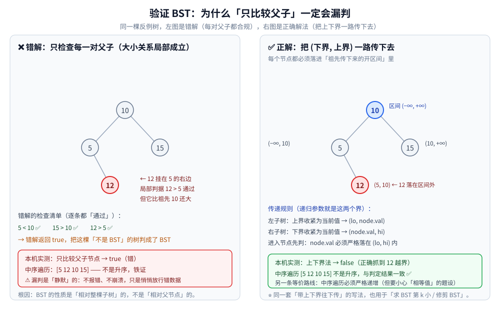
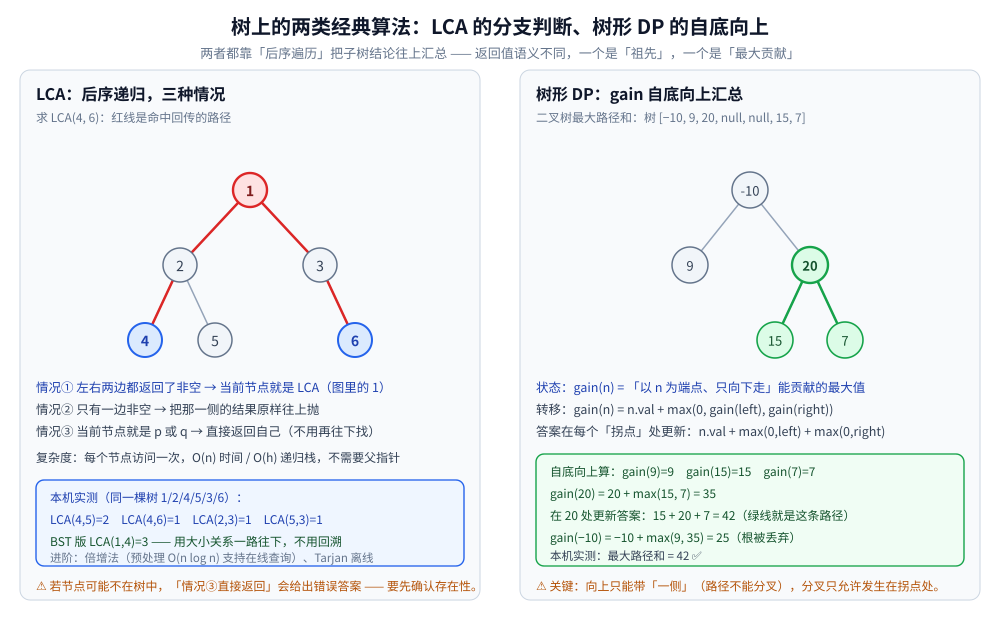

# 树与二叉搜索树算法

> 用树结构解题的四类经典算法：**验证 BST、求深度与判平衡、最近公共祖先（LCA）、树形 DP**，
> 以及它们共同的骨架 —— **后序遍历（自底向上汇总）**。
>
> ⭐ 边界先说清：本篇是**算法层**（怎么用遍历解决问题）。
> **BST 本身的操作与不变式**（查找 / 插入 / 删除 / 前驱后继 / 范围查询）见 [二叉搜索树.md](../../数据结构/树/二叉搜索树.md)；
> 遍历本身（前 / 中 / 后 / 层序、递归与迭代、Morris）见 [树的遍历.md](../../数据结构/树/树的遍历.md)；
> 结构本身（术语、公式、存储）见 [二叉树结构与性质.md](../../数据结构/树/二叉树结构与性质.md)；
> 平衡树的**实现**（旋转、变色、校验器）见 [平衡树.md](../../数据结构/树/平衡树.md)。
>
> 内容整理自个人学习笔记，素材见 [素材清单](../../../素材清单.md)。
>
> 📎 本篇输出均为本机**容器**实跑逐字抄录：**Go 1.26.8（linux/amd64，`golang:1.26-alpine`）**。
> ⚠️ 本篇用的是**固定形状的测试树**（无随机），判定结果、祖先编号、路径和**整篇重跑逐字相同**。

---

## 一、验证 BST：为什么"只比较父子"一定会漏判？

**本节要点**：BST 的性质是「相对**整棵子树**」的，而父子比较只能看到**相邻一层**。
解法是把「祖先传下来的**上下界**」当作递归参数一路传下去 —— 这才是"完整信息"。

**反例（本机实测）**：

```text
        10
       /  \
      5    15
       \
        12     ← 12 挂在 5 的右边（局部 12 > 5 通过），但 12 比祖先 10 还大

中序遍历: [5 12 10 15]   升序?: false
只比较父子节点的写法   : true   ❌ 漏判
上下界递归法（-inf..+inf）: false   ✅ 抓到
```

⭐ **漏判是静默的**：不报错、不崩溃，只是放行了一棵非法 BST —— 后续所有"利用有序性"的逻辑都会给出错误结果。

### 1.1 两种正确写法

| 写法 | 做法 | 注意 |
|---|---|---|
| **上下界递归** | 参数带上 `(lo, hi)`；进入节点先判 `lo < val < hi`；左子树传 `(lo, val)`、右子树传 `(val, hi)` | ⚠️ 边界用**开区间**与树里是否允许相等值一致 |
| **中序遍历** | 中序输出必须**严格递增** | ⚠️ 若题设允许重复值，判据要改成"非递减" |

**上下界法的骨架**：

```go
func goodIsBST(n *Node, lo, hi int) bool {
	if n == nil {
		return true
	}
	if n.Val <= lo || n.Val >= hi { // ⭐ 只在这里判一次，界是"祖先累积"出来的
		return false
	}
	return goodIsBST(n.Left, lo, n.Val) && goodIsBST(n.Right, n.Val, hi)
}
```

⭐ **为什么这个写法不会漏**：`lo / hi` 在递归中**逐层收紧**，
所以每个节点都是在「**全部祖先共同约束**」下被检查的 —— 这正是父子比较缺的那部分信息。



### 1.2 上下界法的两个变体

同一套「带上下界往下传」的手法可以直接复用：

| 变体 | 改动 |
|---|---|
| **求 BST 第 k 小** | 中序遍历计数到第 k 个；或用「左子树大小」剪枝往下走 |
| **修剪 BST**（只保留 `[L, R]` 内的节点） | 节点 `< L` → 只保留右子树的结果；节点 `> R` → 只保留左子树的结果 |
| **判断"最近的两个值差"** | 中序 + 记录前一个访问值 |

⭐ **一句话**：**下界与上界就是"这一支被允许的取值范围"** —— 凡是需要"沿路径累积约束"的 BST 题，都套这个模板。

---

## 二、树的深度与平衡性怎么算才不重复遍历？

**本节要点**：树的深度是**后序遍历**的直接产物；但「判平衡」若写成"每个节点都求一次左右深度"，
复杂度会从 `O(n)` 劣化到 `O(n log n)`。正确做法是**在求深度时顺带判平衡**。

### 2.1 最大深度与最小深度

```go
func maxDepth(n *Node) int {
	if n == nil {
		return 0
	}
	return 1 + max(maxDepth(n.Left), maxDepth(n.Right))
}
```

⚠️ **最小深度有个陷阱**：它问的是「**到最近的叶子**」，不是"到最近的空孩子"。

| 节点形态 | 正确最小值 | 常见错解 |
|---|---|---|
| 只有右子树（左为空） | 继续往右算（**不能**因为左空就返回 1） | 直接 `1 + min(0, 右)` → 得到 1 ❌ |

⭐ 判据：**空孩子不是叶子**。所以求最小深度时要显式处理「只有一个孩子」的情况：
哪个孩子为空就只递归另一个，不能把空孩子当成深度 0 参与 `min`。

### 2.2 判平衡：为什么"自顶向下"会变慢

**自顶向下（错解）**：对每个节点调 `maxDepth` 判断高度差。每个节点被重复访问 → `O(n log n)`（链上更差）。

**自底向上（正解）**：一次后序遍历，返回值同时携带两件事 ——「子树深度」与「子树是否已判为不平衡」。

```go
func isBalanced(root *Node) bool {
	var check func(*Node) (int, bool)
	check = func(n *Node) (int, bool) {
		if n == nil {
			return 0, true
		}
		lh, lok := check(n.Left)
		if !lok {
			return 0, false // ⭐ 提前退出：子树已不平衡，深度值已无意义
		}
		rh, rok := check(n.Right)
		if !rok {
			return 0, false
		}
		if lh-rh > 1 || rh-lh > 1 {
			return 0, false
		}
		return 1 + max(lh, rh), true
	}
	_, ok := check(root)
	return ok
}
```

⭐ **关键手法**：**让递归"多带一个结论"** —— 原本 `maxDepth` 只返回深度，现在同时返回"是否平衡"。
这样每个节点只访问一次，保持 `O(n)`。

⚠️ 这个手法可以推广：**凡是"既要算值、又要判性质"的树题**，
都可以考虑让返回值同时携带两者（或者在发现性质不成立时返回一个哨兵值，由调用方提前剪枝）。

---

## 三、LCA 有哪几种解法？

**本节要点**：二叉树 LCA 靠**后序递归 + 三种分支判断**；BST 上的 LCA 可以**利用大小关系一路往下走**，连回溯都不需要。

### 3.1 二叉树 LCA：三种情况（本机实测）

**思路**：递归返回值语义是「**在这棵子树里找到的 p 或 q（或它们的 LCA）**」。

| 情况 | 条件 | 返回什么 |
|---|---|---|
| ① | 当前节点为空、或就是 p / q | 返回自己 |
| ② | **左右两边都返回非空** | **当前节点就是 LCA** |
| ③ | 只有一边非空 | 把那一侧的结果原样往上抛 |

```go
func lcaBinary(root, p, q *Node) *Node {
	if root == nil || root == p || root == q {
		return root
	}
	l := lcaBinary(root.Left, p, q)
	r := lcaBinary(root.Right, p, q)
	if l != nil && r != nil {
		return root // 两侧各命中一个 → 分岔点即 LCA
	}
	if l != nil {
		return l
	}
	return r
}
```

**本机实测（同一棵树 1 / 2 / 4 / 5 / 3 / 6）**：

```text
  LCA(4, 5) = 2
  LCA(4, 6) = 1
  LCA(2, 3) = 1
  LCA(5, 3) = 1
```

⭐ **复杂度**：每个节点访问一次 —— `O(n)` 时间、`O(h)` 递归栈，**不需要父指针**。

### 3.2 BST 上的 LCA：不用回溯

BST 的 LCA 就是**"两个键第一次分岔的那个节点"**：

```go
func lcaBST(root, p, q *Node) *Node {
	for root != nil {
		if p.Val < root.Val && q.Val < root.Val {
			root = root.Left // 两个都更小 → 一起去左
		} else if p.Val > root.Val && q.Val > root.Val {
			root = root.Right // 两个都更大 → 一起去右
		} else {
			return root // ⭐ 分岔点（或其中之一就是根）→ 即 LCA
		}
	}
	return nil
}
```

**本机实测**：`LCA(1, 4) = 3`（树为 5 / 3 8 1 4 7 9）。

⭐ **对比**：二叉树版是 `O(n)` 的递归回溯；**BST 版是 `O(h)` 的一条路往下走**，空间 `O(1)`。
**同一道题，多一个"有序"前提就少一个数量级的代价** —— 这就是 BST 那份约束的回报。



### 3.3 进阶：倍增法与 Tarjan 离线

| 方法 | 预处理 | 单次查询 | 适用 |
|---|---|---|---|
| 二叉树后序递归 | — | `O(n)` | 只查一两次 |
| **倍增法**（binary lifting） | `O(n log n)` 建表 | **`O(log n)`** | 大量在线查询、深树 |
| **Tarjan 离线** | — | 一次 DFS 处理全部查询，摊还近 `O(1)` | 已知全部查询、可离线 |

⭐ 判据：**查询次数多 → 倍增；查询已知且量大 → Tarjan 离线；只查一次 → 直接递归。**

---

## 四、树形 DP 的状态怎么定义？

**本节要点**：树形 DP = **后序遍历** + **在每个节点上做一次"决策"**。
状态定义的要害是：**"向上只能传一个值"** —— 因为父节点只能通过一条路径连到子节点。

### 4.1 样板题：二叉树最大路径和

**问题**：路径可以由任意节点出发、沿父子边走到任意节点（**不一定过根**、**不一定经过叶子**），求路径上节点值之和的最大值。

**状态定义（核心）**：

| 记号 | 含义 |
|---|---|
| `gain(n)` | **以 n 为端点、只向下走**能提供的**最大贡献**（可以不选，所以对负数取 `max(0, ·)`） |
| 答案 | 在每个节点处作为"**拐点**"更新：`n.val + max(0, gain(左)) + max(0, gain(右))` |

```go
func maxPathSum(root *Node) int {
	best := math.MinInt
	var gain func(*Node) int
	gain = func(n *Node) int {
		if n == nil {
			return 0
		}
		l := max(0, gain(n.Left))  // ⭐ 负贡献不如不要
		r := max(0, gain(n.Right))
		best = max(best, n.Val+l+r) // 拐点：可以同时接入左右
		return n.Val + max(l, r)    // 向上只能带一侧
	}
	gain(root)
	return best
}
```

**本机实测**（树 `[-10, 9, 20, null, null, 15, 7]`）：

```text
     -10
     /  \
    9    20
        /  \
       15   7

最大路径和 = 42（路径 15 → 20 → 7；注意根 -10 被丢弃）
```

⭐ **三点读法**：

- **"拐点"与"端点"是两件事**：向上传时只能带**一侧**（路径不能分叉），只有在**更新答案**那一刻才允许同时接左右；
- **`max(0, ·)` 是"可以不选"的写法**：负贡献直接丢弃，路径从这里开始；
- **`-10` 被丢弃**，说明**答案不一定要包含根** —— 这是树形 DP 最常见的认知陷阱。

### 4.2 树形 DP 与普通 DP 的差别

| 维度 | 序列 DP | 树形 DP |
|---|---|---|
| 遍历顺序 | 按下标（自前向后） | **后序**（孩子先算完） |
| 子问题依赖 | 前几个位置 | **孩子节点** |
| 状态定义难点 | 状态与转移方程 | **"向上只能传什么"** |
| 答案位置 | 常在 `dp[n]` | 常在**某个节点的"拐点"处**（遍历过程中更新） |

⭐ **判据**：见到「**树上选点 / 树上路径 / 子树统计**」→ 先想树形 DP；
状态定义时先问一句 **"父节点需要从孩子那里知道什么？"** —— 这个问题的答案就是状态。

**另一个经典**：打家劫舍 III（树形 DP 的入门）—— 状态是「选 / 不选当前节点」两个值，返回给父节点做决策。

---

## 使用：这些算法在你的系统里以什么形式出现

**第一层：写编译器 / 静态检查工具时。** AST 的合法性校验、作用域链的构建、类型推导 —— 都是「沿路径累积约束」的上下界法变体（第一节的模板）。**AST 上不存在"只看父子就够"的分析。**

**第二层：写前端框架 / 虚拟 DOM 时。** 树 diff、节点查找、状态提升 —— 递归下探 + 子树结果汇总，与 LCA 的"两侧都命中就返回当前节点"是同一套结构。

**第三层：写配置解析 / 目录树工具时。** 「找两个路径的公共前缀目录」就是 LCA（只不过树的度不限）；「统计目录大小」是后序汇总。

**第四层：它示范了两种通用手法。**
① **让递归多带一个结论**（第二节的判平衡）：把"算值"与"判性质"合并成一次遍历，避免重复计算；
② **"向上只能传一个值，分叉只在更新答案时发生"**（第四节）：这个约束几乎出现在所有"树上的最优路径"问题里。

---

## 延伸追问

- **验证 BST 为什么不能用简单的递归比较父子？** → 因为 BST 的性质是**相对整棵子树**的（"左边全部更小"），而父子比较只看得到相邻一层。本机实测的反例树里，`12` 挂在 `5` 的右边、局部判定 `12 > 5` 通过，但它比祖先 `10` 更大 —— 错解返回 `true`，而中序输出 `[5 12 10 15]` 并不升序。⭐ 正解是把祖先累积的 `(lo, hi)` 当参数往下传。
- **LCA 有哪些解法？** → 三类：① **二叉树后序递归**（每个节点访问一次，`O(n)`，不需要父指针）；② **BST 利用大小关系**（一路往下走，`O(h)`，空间 `O(1)`，本机实测 `LCA(1,4)=3`）；③ **倍增法 / Tarjan 离线**（前者预处理 `O(n log n)` 支持在线 `O(log n)` 查询，后者一次 DFS 处理全部离线查询）。
- **树形 DP 和普通 DP 的区别？** → 遍历顺序与依赖方向不同：序列 DP 按下标自前向后，**树形 DP 必须后序**（孩子先算完才能算父节点）；状态定义的难点也不同 —— 序列 DP 难在"转移方程"，树形 DP 难在**"向上只能传一个值"**（因为父节点只能沿一条路径连到孩子）。⚠️ 另外树形 DP 的答案常在**某个节点的"拐点"处**更新，而不在根节点上（本机实测：根 `-10` 被丢弃，答案是 `42`）。
- **为什么求最小深度容易写错？** → 因为**空孩子不是叶子**。若直接写 `1 + min(minDepth(左), minDepth(右))`，当某个孩子为空时会被当成深度 0，于是"只有一个孩子的节点"会被错判成浅路径（错解返回 1）。⭐ 正确做法是先处理「左右只有一个存在」的情况，只递归存在的那一侧。
- **判平衡为什么要自底向上？** → 自顶向下的写法对**每个节点都求一次左右深度**，同一个子树被反复遍历 → 复杂度从 `O(n)` 劣化成 `O(n log n)`（链上更差）。自底向上让返回值**同时携带"深度"与"是否平衡"**，每个节点只访问一次；一旦发现某棵子树不平衡，就立刻返回 `false` 提前剪枝。
- **树形 DP 的状态为什么要写 `max(0, gain(child))`？** → 因为路径**可以不经过这个孩子**。若孩子提供的贡献是负的，接上它只会让路径和变小 → 用 `max(0, ·)` 表达"这条分支不要了"，等价于"路径从这个节点开始"。⚠️ 这也是为什么本机实测里根 `-10` 被丢弃。

---

## 关联

- [树的遍历.md](../../数据结构/树/树的遍历.md) — **前置篇**：前 / 中 / 后 / 层序的递归与迭代写法（本篇所有算法的骨架都来自它）
- [二叉树结构与性质.md](../../数据结构/树/二叉树结构与性质.md) — 结构与术语：深度、高度、完全二叉树与公式
- [平衡树.md](../../数据结构/树/平衡树.md) — BST 退化的实测与「平衡」的代价；红黑树校验器的自检思路
- [树的形态与选型.md](../../数据结构/树/树的形态与选型.md) — 全目录**选型总纲**：各类树的分工与隐藏代价
- [区间与索引树.md](../../数据结构/树/区间与索引树.md) — 同属「树上算法」的另一族：区间分解与前缀结构
- [递归与分治.md](递归与分治.md) — 递归三要素与「递归转迭代」（子树结果的合并就是分治的"可合并"）
- [复杂度分析.md](复杂度分析.md) — `O(n)` / `O(h)` / `O(n log n)` 的口径与摊还分析
- [README.md](../动态规划/README.md) — 动态规划目录导读：树形 DP 在 DP 家族里的位置与「DP vs 贪心」的判断链
- [README.md](README.md) — 基础算法入口总纲
> 反向引用（本篇被下列文档引到）：[二叉搜索树.md](../../数据结构/树/二叉搜索树.md)、[空间索引与R树.md](../../数据结构/树/空间索引与R树.md)、[树形DP.md](../动态规划/树形DP.md)
