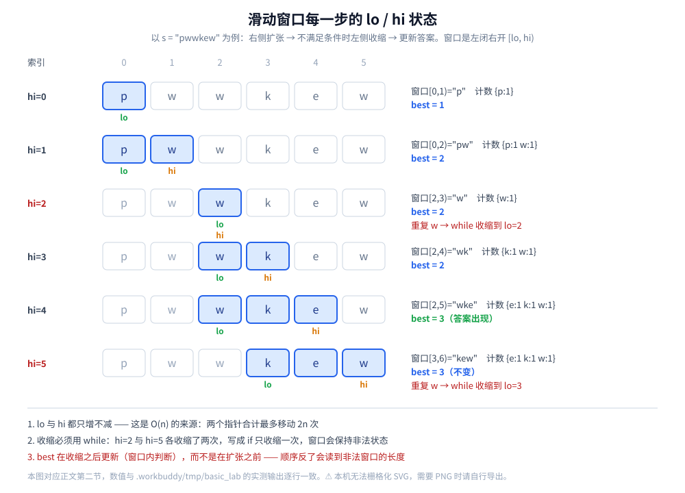
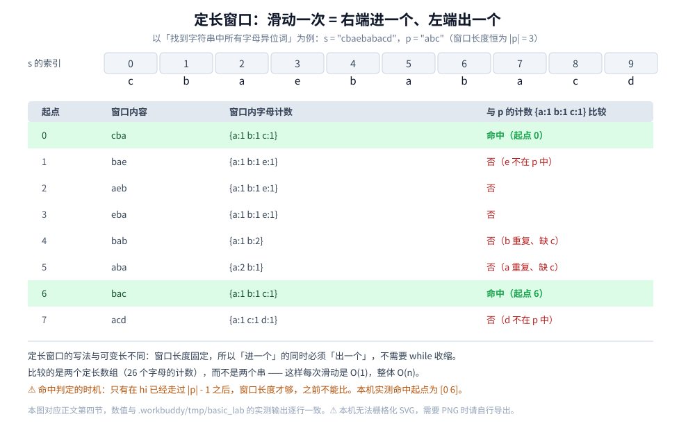

# 滑动窗口

> 数组 / 字符串上的**左右指针窗口**：左闭右开 `[lo, hi)` 的统一模板、"什么时候能用"的单调性判据、
> **可变长窗口**与**定长窗口**两套写法，以及两个最容易写错的点（收缩用 `while` 还是 `if`、更新答案的时机）。
>
> ⚠️ **先澄清一个同名问题**：本篇的"窗口"指**数组 / 字符串上的一段连续区间**，是
> [双指针.md](双指针.md) 里同向指针的一个特例。
> 仓库里还有两个**同名但不同义**的"滑动窗口"，它们与本篇没有共同之处：
> **① 限流里的窗口计数** —— 把一秒切成若干个格子、统计"过去一秒内已放行多少请求"，
> 见 [../../../04-架构与系统/分布式/限流算法.md](../../../04-架构与系统/分布式/限流算法.md) 第八节与 [../../../04-架构与系统/分布式/限流降级熔断.md](../../../04-架构与系统/分布式/限流降级熔断.md)；
> **② 协议里的窗口** —— TCP 用滑动窗口做**流量控制与确认**，见 [../../网络/tcp/TCP滑动窗口.md](../../网络/tcp/TCP滑动窗口.md)。
> 前者滑的是"时间格子"，后者滑的是"还没被确认的字节"，本篇滑的是"下标区间"。
>
> ⭐ 本篇与 [双指针.md](双指针.md) 的分工：**左右指针的正确性论证（不变式三件套）写在那篇第五节**，
> 本篇只引用、不重复；这里专讲窗口模板、判据与易错点。
>
> 内容整理自个人学习笔记，素材见 [素材清单](../../../素材清单.md)。复杂度口径见 [复杂度分析.md](复杂度分析.md)。
>
> 📎 本篇所有输出均为本机实跑逐字抄录：**Go 1.26.5（windows/amd64）** 与 **JDK 1.8.0_321** 各实现一份，
> 输出**逐行对齐**。实验代码在 `.workbuddy/tmp/basic_lab/`（`win/`）。

---

## 一、滑动窗口和「限流里的滑动窗口」是同一回事吗？

**本节要点**：不是。三个语境里都有"窗口"和"滑动"，但**滑动的东西、判定的条件、代码的形状**全都不一样。先分清，再学本篇那一个。

### 1.1 三个同名语境对照

| 语境 | 窗口是什么 | "滑动"滑什么 | 判据 / 目标 |
|---|---|---|---|
| **本篇（算法技巧）** | 数组 / 字符串上的一段连续下标区间 `[lo, hi)` | `lo` 与 `hi` 两个下标，都只增不减 | 窗口内的某种条件（无重复、和为定值、计数相等） |
| **限流（窗口计数）** | 一段时间被切成若干格子（如 1 秒切 10 格） | 时间往前走，旧格子被丢弃 | 过去一个周期内**已经放行了多少请求** |
| **TCP（协议窗口）** | 对方还能接收的字节区间 | 收到确认后右边界前移 | 发出去的哪些字节**已被确认**、还能再发多少 |

⭐ 一句话区分：**本篇的"窗口"是数据结构上的一个区间（空间维度）；限流与 TCP 的"窗口"是"还没过期的量 / 还没被确认的量"（时间与状态维度）。**

### 1.2 为什么容易混

三者的**代码骨架确实像**：都有一个"右端不断前进、左端在某个条件满足时才前进"的循环，也都叫"窗口"。但：

- 限流的窗口计数**不需要**"窗口合法性对端点单调"这个前提 —— 它统计的是时间维度的累加，格子数是固定的；
- TCP 的窗口更像一个**滑动的水位线**，它由**外部输入**（对方的确认包）推动，不是由"窗口内条件"推动。

⚠️ 所以本篇的模板（第二节）**不能**直接搬去写限流或 TCP —— 那里滑动的驱动力根本不是"窗口内的数据"。

### 1.3 本篇的窗口：定义清楚才写得出代码

本篇的窗口就是**连续的一段下标**，统一用**左闭右开** `[lo, hi)` 表示：

```text
s = p w w k e w
    0 1 2 3 4 5
    ↑           ↑
    lo          hi        ← 窗口是 [lo, hi)，即 s[lo..hi-1]

窗口长度 = hi − lo
空窗口: lo == hi（长度为 0，进循环时不会越界）
```

⭐ **左闭右开的两个好处**：① 长度就是 `hi − lo`，不用 ±1；② `lo == hi` 天然表示空窗口，不需要"哨兵值"处理边界。这也是 Go 切片与 C++ 迭代器的统一约定。

---

## 二、统一模板：左闭右开 `[lo, hi)`

**本节要点**：窗口题的骨架只有三步 —— **右侧扩张 → 不满足条件时左侧收缩 → 更新答案**。看清"每一步窗口长什么样"，模板就不用背。

### 2.1 模板三步

```go
// 可变长窗口的统一模板（以「无重复字符的最长子串」为例）
func longestNoRepeat(s string) int {
	cnt := map[byte]int{}
	lo, best := 0, 0
	for hi := 0; hi < len(s); hi++ {
		cnt[s[hi]]++ // ① 扩张：把 s[hi] 纳入窗口
		for cnt[s[hi]] > 1 {
			cnt[s[lo]]-- // ② 收缩：不满足条件就左移 lo（⭐ while，不是 if）
			lo++
		}
		if hi-lo+1 > best { // ③ 更新答案：此时窗口一定合法
			best = hi - lo + 1
		}
	}
	return best
}
```

⭐ 三步各自的含义：

| 步骤 | 做什么 | 为什么是这个顺序 |
|---|---|---|
| ① 扩张 | 把 `s[hi]` 纳入窗口 | `hi` 是驱动整个循环的变量，每次加一 |
| ② 收缩 | 只要窗口不合法，就把 `s[lo]` 移出、`lo++` | ⭐ **必须在更新答案之前**，否则答案是非法窗口的长度 |
| ③ 更新 | 记录当前合法窗口的长度 | 此时窗口一定合法（②的循环条件已退出） |

⚠️ **`lo` 与 `hi` 都只增不减**，所以两个下标合计最多移动 `2n` 次 —— 这就是 `O(n)` 的来源，与 [双指针.md](双指针.md) 第五节的不变式论证是同一件事。

### 2.2 本机实测：每一步的窗口状态

`s = "pwwkew"`（本机实跑，逐帧打印）：

```text
========== 实验四：窗口每一步状态（理解模板最快的方式） ==========
s = "pwwkew"
hi=0  c='p'  窗口[0,1)="p"  计数 {p:1}          best=1
hi=1  c='w'  窗口[0,2)="pw"  计数 {p:1 w:1}      best=2
hi=2  c='w'  窗口[2,3)="w"  计数 {w:1}          best=2  ← 重复字符，while 收缩
hi=3  c='k'  窗口[2,4)="wk"  计数 {k:1 w:1}      best=2
hi=4  c='e'  窗口[2,5)="wke"  计数 {e:1 k:1 w:1}  best=3
hi=5  c='w'  窗口[3,6)="kew"  计数 {e:1 k:1 w:1}  best=3  ← 重复字符，while 收缩
答案 = 3
```



⭐ 盯着 `hi=2` 那一行：加进来的是第二个 `w`，窗口一度是 `[0,3) = "pww"`（非法），**`while` 收缩了两格**（`lo` 从 `0` 走到 `2`）才变成合法的 `[2,3) = "w"`。`hi=5` 同样收缩了两格。**这两处正是"为什么必须用 `while`"的现场证据**（第五节给反例）。

### 2.3 答案的三种常见形态

同一套模板，只是"更新答案"那一步和"合法判据"不同：

| 题型 | 合法判据 | 更新答案 |
|---|---|---|
| 最长无重复子串 | 窗口内无重复 | `best = max(best, hi-lo+1)`（越大越好） |
| 长度最小的子数组（和 ≥ target） | 窗口和 `>= target` | 收缩**之前**记录长度，或在收缩循环内更新（越小越好） |
| 最小覆盖子串 | 窗口覆盖了 `t` 的全部字符 | 在收缩循环内更新，并记下 `lo` 以便还原子串 |

---

## 三、什么时候能用滑动窗口？

**本节要点**：判据只有一条 —— **窗口的合法性对左右两个端点都单调**。这一节把这句话拆成能拿去用的两个问句。

### 3.1 判据：扩张不会变合法，收缩不会变非法

> **判据**：把窗口右端右移一个（扩张），**不会让一个非法窗口变成合法**；把窗口左端右移一个（收缩），
> **不会让一个合法窗口变成非法**。

两句分开看：

| 操作 | 要求 | 满足时会发生什么 |
|---|---|---|
| **扩张**（`hi++`） | 非法 → 只能更非法（或不变），**不能变合法** | 所以"不合法"这件事可以被 `while` 一路收缩修好，不会出现"再扩一下就好了" |
| **收缩**（`lo++`） | 合法 → 只能更合法（或不变），**不能变非法** | 所以一旦合法就可以安心记录答案，不用回头 |

⭐ 用这个判据检验"最长无重复子串"：往窗口里加一个字符，**只会**增加重复的可能（不会减少），所以"重复"这个非法状态单调；从左边去掉一个字符，**只会**减少重复的可能。两句话都成立 → 可以用滑动窗口。

### 3.2 反例：不满足判据的题

| 题 | 为什么不能滑 |
|---|---|
| **最长连续子序列、允许删掉一个元素** | 删元素可能让"非法"变"合法"，扩张的单调性不成立；该上动态规划 |
| **窗口内求最大值** | "最大值"不满足"扩张不改善合法性"的形态 —— 需要**单调队列**（双端队列）而不是单纯的滑窗 |
| **无序数组的两数之和（返回下标）** | 窗口的合法性没有单调性；要么排序（[双指针.md](双指针.md) 第二节），要么哈希 |
| **子数组和等于定值（可能有负数）** | 有负数时"和"随扩张不单调（可能变小），前缀和 + 哈希才正确 |

⚠️ **"看起来像窗口"不等于"能用窗口"**。第 4 行最容易踩：数组里有负数时，`[1, -1, 1, -1, 1]` 求"和为 1 的最长子数组"，扩张窗口时和会忽大忽小，`while` 收缩的判据就不成立了。

### 3.3 与"前缀和 + 双指针"的关系

如果题目要的是**子数组的和**，且元素都是正的：

- **和随扩张单调不减、随收缩单调不增** → 判据成立，可以用滑动窗口；
- 前缀和的写法 `prefix[j] − prefix[i]` 与窗口的和是同一个量，两者等价。

⭐ 一旦出现**负数**，前缀和本身不再单调，就只能"前缀和 + 哈希表"（记录每个前缀和第一次出现的位置），退化到 `O(n)` 时间但 `O(n)` 空间。

---

## 四、可变长窗口与定长窗口

**本节要点**：两套写法只差一处 —— **定长窗口的窗口长度是常量，所以"右端进一个"必须同时"左端出一个"，不进 `while`**。看清这一点，两类题共用一套心智模型。

### 4.1 可变长窗口：长度由条件决定

第二节的模板就是可变长：窗口长度在每次循环后都可能变化，靠"合法判据"驱动 `while` 收缩。适用题目：

| 题 | 窗口条件 | 收缩依据 |
|---|---|---|
| 无重复字符的最长子串 | 窗口内无重复字符 | 出现重复时收缩 |
| 长度最小的子数组（和 ≥ target） | 窗口和 ≥ target | 和已达标就收缩，求更短 |
| 最小覆盖子串 | 覆盖 `t` 的全部字符 | 覆盖达成后收缩，求更短 |

### 4.2 定长窗口：长度固定，进出各一次

以"找到字符串中所有字母异位词"为例：`s = "cbaebabacd"`、`p = "abc"`，窗口长度恒为 `len(p) = 3`。

```go
// 定长窗口：窗口长度恒为 len(p)，右端进一个、左端出一个
func findAnagrams(s, p string) []int {
	res := []int{}
	if len(p) > len(s) {
		return res
	}
	need, win := [26]int{}, [26]int{}
	for i := 0; i < len(p); i++ {
		need[p[i]-'a']++
	}
	for hi := 0; hi < len(s); hi++ {
		win[s[hi]-'a']++ // 右端进一个
		if hi >= len(p) {
			win[s[hi-len(p)]-'a']-- // 左端出一个：窗口恒为 len(p)
		}
		if hi >= len(p)-1 && win == need { // 窗口长度够了才比
			res = append(res, hi-len(p)+1)
		}
	}
	return res
}
```

本机实跑（命中起点与窗口内容逐项对照）：

```text
========== 实验三：定长窗口 —— 找到字符串中所有字母异位词 ==========
s = "cbaebabacd"  p = "abc"
p 的字母计数 : {a:1 b:1 c:1}
命中起点     : [0 6]（每个起点都是长度 3 的定长窗口）
```



⭐ 定长窗口与可变长的**三处差别**：

| | 可变长 | 定长 |
|---|---|---|
| 窗口长度 | 由条件决定，会变 | 常量 `len(p)` |
| 左端何时动 | `while` 到窗口合法 | 只要右端进了、满了就出一次（条件判断，不是循环） |
| 比较对象 | 窗口内的聚合量 | 两个定长计数数组（这里都是 26 个字母的计数） |

⚠️ **定长窗口里"出"的时机**：`hi >= len(p)` 才开始出。前 `len(p)` 次循环是在"把窗口填满"，此时左端还没有东西可出。填满之前也不能判定命中（`hi >= len(p)-1`）。

### 4.3 两套写法的共同点

两套写法看起来不同，但**骨架仍是"扩张 → 收缩 → 更新"**：定长窗口只是把"收缩"从一个 `while` 循环换成了**一次条件性移动**。这是因为定长窗口的合法判据（"长度恰好为 `len(p)`"）本身就不需要循环去修 —— 进一个、出一个，长度自动守恒。

---

## 五、两个最容易踩的坑

**本节要点**：这两个坑都有本机实测的现场证据。坑一的错误写法**在给定用例上真的会给出错的答案**，不是"理论上可能"。

### 5.1 坑一：收缩用 `while` 而不是 `if`

把第二节模板里的 `for cnt[s[hi]] > 1` 换成 `if cnt[s[hi]] > 1`（每次只收缩一格），一开始在 `"abcabcbb"` 上看不出问题 —— 因为这个用例下两者答案恰好都是 `3`。**换一批用例就露馅**（本机实跑）：

```text
========== 实验一：无重复字符的最长子串 ==========
s = "abcabcbb"    暴力=3   模板(while)=3   if 写法=3
s = "pwwkew"      暴力=3   模板(while)=3   if 写法=4
s = "abba"        暴力=2   模板(while)=2   if 写法=3

========== 实验二：if 写法真的会错（穷举字母表 {a,b}，长度 1..5） ==========
穷举总数 62 个串，if 写法出错 12 个
最短反例长度 = 4，共 2 个：abba baab
取 "abba" 验证：正确 2  vs  if 写法 3
```

⭐ **为什么错**：`if` 版只把 `lo` 挪一格，**窗口可能仍然是"含重复字符"的非法状态**，而此时却已经在下一步把 `hi-lo+1` 记进了答案。以 `"abba"` 为例，走到最后一个 `a` 时窗口是 `s[1..3] = "bba"` —— `b` 重复，非法，但长度 `3` 被当成了答案。

⚠️ **"给定用例能过"是最危险的假阳性**：本机穷举了字母表 `{a,b}`、长度 1..5 的全部 62 个串，**只有 12 个能暴露它**，而它们的共同特征是"**一次收缩不够**"。所以判据不是"我测的那组数据对不对"，而是：

> **这个循环会不会需要执行多次？** 会 → 必须是 `while`。

### 5.2 坑二：更新答案的时机在窗口内还是窗口外

`best = max(...)` 这一行放在**收缩循环之后**，还是放在**扩张之后、收缩之前**？两者的差别在"求最小值"的题上最刺眼：

| 题型 | 更新时机 | 理由 |
|---|---|---|
| 求**最长**（无重复子串） | 收缩**之后** | 只有收缩后的窗口才是合法的；非法窗口的长度再大也不能要 |
| 求**最短**（长度最小的子数组、最小覆盖子串） | 必须在**收缩循环内**（每收缩一格就检查一次） | 收缩的过程中窗口一直是合法的，最小值可能出现在收缩途中的某一格，而不是"缩到不能再缩"之后 |

⭐ 一个统一的口径：**"更新答案"的时机 = "窗口此刻合法、且我要的这个量在这一刻是对的"**。

- 求最长 → 只在"修好之后"看一次就够（合法状态的长度随扩张单调不减）；
- 求最短 → 收缩途中的每个合法状态都要看，因为它们短暂地存在（再缩就不满足了）。

⚠️ 最小覆盖子串更容易错在"**更新时要不要记下 `lo`**"：一旦更新了最优长度，就要同时把当时的 `lo` 存下来，否则循环结束后只剩长度、还原不出子串。

### 5.3 自检清单

写完窗口代码，回看这四行：

1. 收缩是 `while` 吗？（5.1 的 12 个反例）
2. `best` 的更新在收缩之后（求最长）或收缩循环之内（求最短）吗？（5.2）
3. 求最短的题，记下 `lo` 了吗？（否则还原不出子串）
4. `hi >= len(p)` 这类"窗口还没填满"的边界判了吗？（4.2）

---

## 使用：窗口在你写的代码里以什么形式出现

滑动窗口同样很少被"当作一个算法调用"，它出现在**需要在线处理一段连续区间的场景**里。结合本仓库其它篇目：

**第一层：日志 / 指标的在线统计**。比如"最近 1000 条日志里的错误率"、"连续 N 条记录的长度分布" —— 这类统计天然是一个定长窗口：读一条进窗口、丢一条出窗口，中间维护聚合量。⚠️ **注意与限流区分**：限流的"最近一秒放行了多少请求"虽然也叫窗口，但它是**时间驱动**的（旧格子按时间过期），不是"读一条挤一条"。相关：[../../../04-架构与系统/分布式/限流算法.md](../../../04-架构与系统/分布式/限流算法.md) 第八节。

**第二层：文本与字节流的处理**。定长窗口是解析器的常见形态 —— 按固定长度分帧、按固定宽度扫描、批量替换时"多字符分隔符跨块"的处理。⚠️ 分帧时最容易漏的边界正是 4.2 那一处：**窗口还没填满时不要判定**（流末尾的短帧要单独处理）。相关：[../字符串匹配/KMP.md](../字符串匹配/KMP.md)（匹配是另一种"扫一遍"）。

**第三层：与哈希 / 前缀和的取舍**。窗口的收益是 `O(1)` 额外空间（只有几个下标和聚合量）。一旦判据不成立（第三节的反例），就得换前缀和 + 哈希：时间还是 `O(n)`，但空间变成 `O(n)`。**这个取舍和 [双指针.md](双指针.md) 使用一节的判断是同一个：能不能说清"每步排掉了哪批候选"。**

⭐ 归纳成一条判断：**当你需要在线地回答"最近一段连续数据里 XXX"，先问"窗口合法性对端点单调吗" —— 单调就用窗口，不单调就换前缀和 / 单调队列。**

---

## 延伸追问

- **滑动窗口和双指针是什么关系？** → 包含关系：滑动窗口是**同向双指针**的一个特例（左右指针都只增不减，窗口是两者的区间）。共用方法论见 [双指针.md](双指针.md) 第五节。
- **为什么一定要左闭右开？** → 长度就是 `hi − lo`，`lo == hi` 天然表示空窗口。闭区间版本到处要 ±1，边界最容易错（1.3）。
- **收缩为什么必须是 `while`？** → 一次收缩可能不够（本机穷举：`{a,b}`、长度 1..5 里有 12 个串能暴露 `if` 写法的错）。判据是"这个循环会不会需要执行多次"（5.1）。
- **`if` 写法在 `"abcabcbb"` 上为什么看不出来？** → 那个用例每次重复时恰好只需收缩一格。⚠️ **"给定用例能过"不能证明写法对** —— 这正是要从穷举里拿反例的原因。
- **更新答案放在循环内还是循环外？** → 求最长放收缩之后；求最短必须放收缩循环内，并同时记下 `lo`（5.2）。
- **求"和为定值且含负数"的最长子数组能用窗口吗？** → 不能。负数让"和"随扩张不再单调，`while` 的收缩依据失效，要走前缀和 + 哈希（3.2、3.3）。
- **窗口内求最大值能滑窗吗？** → 单靠 `lo`/`hi` 不行，需要**单调队列**（双端队列维护候选下标）；退化成堆是 `O(n log k)`，达不到 `O(n)`。
- **定长窗口为什么不用 `while`？** → 长度守恒：进一个、出一个，长度自动是 `len(p)`，不存在"需要连续收缩"的非法状态（4.3）。
- **窗口的开销是多少？** → 时间 `O(n)`（两个下标合计最多移动 `2n` 次），额外空间 `O(1)`（除了计数的字母表 / 哈希表，通常是常数大小）。
- **为什么它叫"滑动"？** → 因为 `lo` 与 `hi` 一起向右平移、窗口的内容逐步替换。⚠️ 这个"滑"是**区间的平移**，与限流的"时间窗口平移"、TCP 的"确认窗口平移"只是比喻上的相似（第一节）。

---

## 关联

- [双指针.md](双指针.md) — **上一层**：本篇是它的同向形态特例；左右指针的正确性论证（不变式三件套）在该篇第五节，本篇只引用
- [复杂度分析.md](复杂度分析.md) — `O(n)` 的摊还记账：两个下标合计最多移动 `2n` 次
- [线性结构/栈与队列.md](../../数据结构/线性结构/栈与队列.md) — 数组 / 字符串的下标与切片语义，`[lo, hi)` 约定的来源
- [查找与排序对比.md](查找与排序对比.md) — 与"排序后用双指针"的路线对照：排序是 `O(n log n)`，窗口是 `O(n)`，但窗口要求更强的单调性
- [../字符串匹配/KMP.md](../字符串匹配/KMP.md) — 同样是"扫一遍且主串不回溯"，但 KMP 靠的是前缀函数而不是窗口
- [../动态规划/LIS.md](../动态规划/LIS.md) — 「不能滑窗」的对照：需要回看的问题走 DP
- [../../../04-架构与系统/分布式/限流算法.md](../../../04-架构与系统/分布式/限流算法.md) — ⚠️ 同名不同物：那里的滑动窗口是**限流的时间格子计数**，第八节与本节第一条判据完全无关
- [../../../04-架构与系统/分布式/限流降级熔断.md](../../../04-架构与系统/分布式/限流降级熔断.md) — 同上：滑动窗口计数在分布式限流里的工程落地
- [../../网络/tcp/TCP滑动窗口.md](../../网络/tcp/TCP滑动窗口.md) — ⚠️ 同名不同物：那里的窗口是**协议层的流量控制与确认**，滑的是字节而不是下标
- [../../../07-面试/Go算法题.md](../../../07-面试/Go算法题.md) — 滑动窗口与双指针在具体题目里的写法，含"同名澄清"一段
> 反向引用（本篇被下列文档引到）：[摩尔投票.md](摩尔投票.md)
