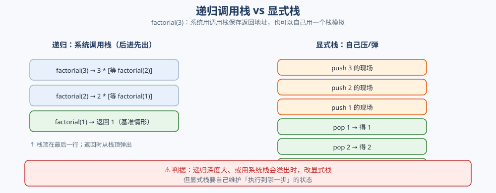
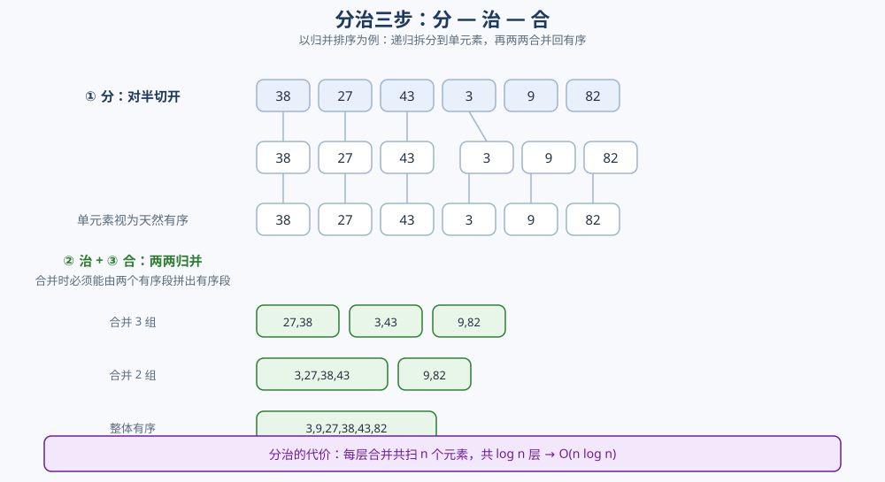

# 递归与分治

> 递归的三要素（基准情形 / 递推关系 / 向基准收敛）、递归何时该改成显式栈、尾递归到底省不省，
> 以及分治的「分 — 治 — 合」三步为什么必须能合并、复杂度递推式怎么落回主定理。
>
> ⭐ 本篇讲**方法与骨架**：递归怎么写、分治怎么套、复杂度怎么推。归并排序与快速排序是分治的两个样板，
> 但**具体的分区方案、枢轴选择、三路划分实现细节**在 [排序算法.md](排序算法.md) 里 —— 两篇不重复：
> 这里是「分治这一刀怎么切」，那里是「切完怎么排序」。
>
> 内容整理自个人学习笔记，素材见 [素材清单](../../../素材清单.md)。主定理、均摊、递推式的完整口径见
> [复杂度分析.md](复杂度分析.md)；调用栈与栈结构本身见 [栈与队列.md](../../数据结构/线性结构/栈与队列.md)。
>
> 📎 本篇所有输出均为本机实跑逐字抄录：**Go 1.26.5（windows/amd64）** 与 **JDK 1.8.0_321** 各实现一份，
> 确定性输出**逐行对齐**。

---

## 一、递归的三要素是什么？

**本节要点**：递归不是「函数调用了自己」这么含糊，它必须同时凑齐三件事——**能停下来的基准情形、能把问题变小的递推关系、以及保证最终撞上基准的收敛方向**。缺任何一条，程序要么答案错、要么栈溢出。

### 1.1 三要素

| 要素 | 作用 | 缺了会怎样 |
|---|---|---|
| **基准情形**（base case） | 不再递归、直接给出答案的那一格 | 永远递归 → 栈溢出 |
| **递推关系**（recursion） | 用「规模更小的同类问题的解」表示当前解 | 写不出递推，就只能迭代 |
| **向基准收敛** | 每次递归都让规模严格变小 | 规模不缩 → 死循环式递归 |

以阶乘为例，三要素一目了然：

```go
func factorial(n int) int {
	if n <= 1 {      // ① 基准情形：不再递归
		return 1
	}
	return n * factorial(n-1) // ② 递推关系 + ③ 参数从 n 降到 n-1
}
```

```text
  factorial(5) = 120   最大递归深度 = 5
  factorial(10) = 3628800   最大递归深度 = 10
```

⭐ **第三点最容易被忽略**：`factorial(n-1)` 里的 `n-1` 就是「向基准收敛」的保证——参数每层减 1，必然在有限步内到达 `n <= 1`。如果递推写成 `factorial(n)` 或 `factorial(n+1)`，另外两条再正确也是无限递归。

### 1.2 递推关系是「用子问题的解表示自己」

写递归的本质是**先假设子问题已经解决**，再想「怎么用它的结果拼出我的结果」。阶乘用的是 `f(n) = n × f(n-1)`；斐波那契用的是 `f(n) = f(n-1) + f(n-2)`。

⚠️ **递推关系一旦写错，基准再对也白搭**。而且递推里出现的子问题**不一定是同一个函数**——汉诺塔要把「n-1 个盘子从 A 经 C 移到 B」的辅助参数换掉（见 3.2），这是递推关系里藏参数变化的典型。

### 1.3 收敛速度决定递归能不能用

即使能收敛，**收敛快不快**决定了递归是否可用。斐波那契的朴素递推每层分成两个子问题、规模只减 1 —— 子问题树是指数级的：

```text
  朴素递归 fib(25) = 75025  调用次数 = 242785
  带记忆 fib(25) = 75025  调用次数 = 49
```

⭐ **读法**：`fib(25)` 只有 25 个不同参数，却被调用了 **242785** 次——因为 `fib(23)`、`fib(24)` 这些子问题被反复重算。同一棵树里的子问题**重复**了，这就是「重叠子问题」。

⚠️ 一旦发现子问题重叠，**递归的三要素就不再是终点**：要么加记忆化（自顶向下），要么改写成 DP（自底向上）。这条线索通向 [LIS.md](../动态规划/LIS.md) 与 [背包问题.md](../动态规划/背包问题.md) —— 那里的递推式同样成立，但**每个状态只算一次**。

---

## 二、递归什么时候能改成迭代？

**本节要点**：递归用的是系统调用栈，改成迭代有两种完全不同的路子——**尾递归直接换循环**，**非尾递归要自己建显式栈**。判据是「递归调用之后还有没有活要干」。

### 2.1 系统调用栈在保存什么

每进一层递归，系统压一帧栈，保存的是**当前函数的现场**：参数、局部变量、以及**返回后要继续执行的位置**。所以「递归能不能退化成循环」，问的其实是——**返回后还需要那个现场吗**？



```go
func factorial(n int) int {
	if n <= 1 {
		return 1
	}
	return n * factorial(n-1) // 返回后还要做 n * 这一步 → 现场必须留
}
```

⚠️ 阶乘的递归调用**返回后还有一次乘法**，所以每层的 `n` 必须留着——这正是它需要一个栈的原因。

### 2.2 显式栈：把「现场」搬到自己的容器里

判据是**尾递归与否**：

| 形态 | 返回后还有动作吗 | 怎么改 |
|---|---|---|
| **尾递归** | 没有，返回值就是调用结果 | 直接改成循环，**不需要栈** |
| **非尾递归** | 有（还要做乘法、还要收尾） | 自己建一个栈，把「现场」压进去 |
| **有重复子问题** | —— | 加记忆化或改 DP，**不是**转栈能解决的 |

把汉诺塔从递归改成显式栈，两种写法给出**完全相同的移动序列**：

```text
  递归  n=3 共 7 步: [A->C A->B C->B A->C B->A B->C A->C]
  显式栈 n=3 共 7 步: [A->C A->B C->B A->C B->A B->C A->C]
  两序列相同 = true
```

同样的等价性出现在**树的遍历**上——递归版与显式栈版的中序结果逐元素相同：

```text
  递归   = [1 3 4 5 7 8 9]
  显式栈 = [1 3 4 5 7 8 9]
  相同 = true
```

⭐ **显式栈的关键技巧**：显式栈要**逆序压栈**。因为栈是后进先出，递归里「先执行的分支」必须**最后压栈**，才能先被弹出。汉诺塔的代码里，`后进先出：按逆序压栈` 那三行的顺序就是为这个服务的。

⚠️ **代价**：显式栈省下了系统栈，却把「递归到哪一步」的状态变成了自己维护的字段（比如汉诺塔里的 `expandOnce` 标记）。**递归读起来短，显式栈写起来长**——只有在栈深真会成为问题时才值得换。

### 2.3 尾递归到底省不省？

**结论先说：Go 和 Java 都不做尾调用优化（TCO），所以「尾递归省栈」在这两个语言里不成立。**

```text
开始尾递归（返回值即下次调用结果）…
runtime: goroutine stack exceeds 1048576-byte limit
runtime: sp=0xea8c8fe1350 stack=[0xea8c8fe0000, 0xea8c90e0000]
fatal error: stack overflow
```

上面是 Go 的真跑输出（`debug.SetMaxStack` 压到 1 MiB 便于快速复现，地址每次运行不同）。**一个真正的尾调用也照样把栈撑爆**——Go 官方明确不实现尾调用优化。

Java 一侧同样，用 `catch (StackOverflowError)` 可以测出「下潜到多少层才炸」：

```text
  递归 1000000 层 → StackOverflowError（实际下潜约 27209 层）
  尾递归 1000000 层 → StackOverflowError（实际下潜约 16255 层）
  等价循环 10000000 次 → 完成，sum=49999995000000（尾递归并未省栈）
```

⭐ **两条结论并排看**：

1. **尾递归并没有省栈**——它确实会炸，只是每帧稍小（尾帧不用保存「返回后继续执行的位置」），所以下潜层数比普通递归略多（27209 → 16255 是「尾帧占位更小」的反面：这里普通递归反而更深，说明**帧大小还受具体编译器与 JIT 影响，不能拿这个数当帧大小的精确度量**）。要点是**两者都溢出了**。
2. **等价循环 1000 万次却毫无压力**——这才是「省栈」的正确做法：改成循环，而不是指望编译器把尾递归变成循环。

⚠️ **跨语言差异**：函数式语言（Scheme、部分 Scala/Haskell 实现）**强制**尾调用优化，尾递归确实能跑成循环；Go / Java / C++ / Python 都**不保证**。**写 Go / Java 时不要假设尾递归会被优化掉**——深度大的尾递归必须手写成循环。

---

## 三、分治为什么必须「能合并」？

**本节要点**：分治 = **分（divide）→ 治（conquer）→ 合（combine）**。最容易被轻视的是第三步「合」——**能分不代表能治，能不能合并才是分治成立的门槛**。

### 3.1 分治三步

| 步骤 | 做什么 | 归并排序里 |
|---|---|---|
| **分**（Divide） | 把原问题切成若干规模更小的同类子问题 | 数组对半切成两段 |
| **治**（Conquer） | 递归求解每个子问题；足够小就直接解 | 递归到只剩 1 个元素（天然有序） |
| **合**（Combine） | 把子问题的解拼成原问题的解 | 两个有序段归并成一个有序段 |



⭐ **三个必须同时成立的前提**：

1. **子问题相互独立**——不共享、不重叠（否则退化成指数级重复计算，见 1.3）；
2. **子问题规模确实更小**——保证收敛；
3. **存在合并规则**——能由子问题的解拼出原问题的解。

### 3.2 合并是分治的门槛

**为什么「合」最难**：前两步是机械的（切一刀、递归下去），只有「合」这一步需要针对问题本身设计。归并排序的「合」是一句 `merge`；最大子数组的「合」却需要额外定义**跨越中点的那一段**：

```go
func dcRec(a []int, lo, hi int) int {
	if lo == hi { // 基准：一个元素
		return a[lo]
	}
	mid := lo + (hi-lo)/2
	left := dcRec(a, lo, mid)   // 治左
	right := dcRec(a, mid+1, hi) // 治右
	cross := crossSum(a, lo, mid, hi) // ⭐ 合：跨越中点的最大和
	return max3(left, right, cross)
}
```

```text
  数组 = [-2 1 -3 4 -1 2 1 -5 4]
  分治 O(n log n) = 6
  Kadane O(n)     = 6
```

⭐ **看到那个 `crossSum` 了吗**——它就是为了「合」而多出来的工作：一个子数组要么全在左半、要么全在右半、要么**跨过中点**，前两种由递归给出，第三种**必须专门算**。如果放不下这一步，分治就落不了地。

⚠️ **复杂度代价也是它带来的**：Kadane 一次线性扫描就能出答案（`O(n)`），而分治版本因为每层都要算一遍 `crossSum`（共 `O(n)`），变成 `O(n log n)`——本题里**分治不是最优解**，它只是分治思路的教学样板。

### 3.3 反例：不是所有「分」都能治

**反例 A：子问题不独立 → 分成指数。** 朴素斐波那契（1.3 实测 242785 次调用）把 `fib(n)` 分成 `fib(n-1) + fib(n-2)`，但这两个子问题**重叠**——`fib(n-2)` 在两边都被算。这种「分」根本治不了，该用记忆化 / DP。

**反例 B：找不到合并规则 → 分不开。** 例如「求数组里**互不相邻**元素的最大和」（打家劫舍）。若在中点切成两半，选不选**紧挨着中点的那个元素**会同时影响左右两边的选择——两半的解**在边界上耦合**，无法各自独立求解再拼起来。这类问题要用 DP 从左到右扫，而不是分治。

⭐ **判据一句话**：**分治要求「两半之间只通过一个明确定义的『合并接口』交互」。** 归并的接口是「两个有序段」；最大子数组的接口是「跨中点的最大和」；一旦两半在边界外还有千丝万缕的联系，分治就失效。

⚠️ **减治（decrease and conquer）是另一回事**：它只递归**一个**子问题。找第 k 大用快排的分区，每次只往有答案的那一侧走：

```text
  quickselect(a, k=100) = 457  比较次数=691  递归层数=12
  quicksort 全排序        比较次数=1489  递归调用数=266
```

⭐ **读法**：同一份分区代码，`quickselect` 只走一侧（比较 691 次、12 层），`quicksort` 走两侧（比较 1489 次、266 次调用）。**减治的复杂度是 `O(n)`（平均），分治是 `O(n log n)`**——差别全在「分完之后治几个子问题」。相关变体见 [LIS.md](../动态规划/LIS.md) 的二分优化一节。

---

## 四、分治的两个样板：归并与快排

**本节要点**：同一套「分 — 治 — 合」，归并和快排把重心放反了——**归并重在「合」，快排重在「分」**。看清这一点，就理解了两者的一切差异。

### 4.1 归并：分到单元素，合出有序

归并排序的三步极其规整：**分**是对半切，**治**是递归到单元素，**合**是把两个有序段归并。它的重心在「合」。

⭐ **归并的两个性质**：
- **天然稳定**：合并时用 `a[i] <= a[j]`（取左段的相等元素），相等元素的相对次序被保住；
- **分层清晰**：每层的合并总量恒为 `n`，层数是 `log n` → `O(n log n)`，且**没有最坏退化**。

### 4.2 快排：分而不治，治在分区

快排的三步重心在「分」：**分**是**分区**（partition），**治**是递归排两边，而「合」**什么都不用做**——分区完成后，左边全 `< pivot`、右边全 `> pivot`，pivot 已经归位，拼接是平凡的。

⭐ **快排的所有优化都在「分」这一刀上**：枢轴选得均匀 → 层数 `log n` → `O(n log n)`；枢轴每次都取到极值 → 层数退化成 `n` → `O(n²)`。

### 4.3 具体实现细节链到排序算法.md

本篇只讲「分治怎么套」，以下内容**在 [排序算法.md](排序算法.md) 里展开，不重复**：

| 内容 | 在哪讲 |
|---|---|
| Lomuto / Hoare 分区方案对比 | [排序算法.md](排序算法.md) |
| 枢轴选择（固定 / 随机 / 三数取中） | [排序算法.md](排序算法.md) |
| 三路划分处理重复元素 | [排序算法.md](排序算法.md) |
| 快排最坏 `O(n²)` 的实测数据 | [排序算法.md](排序算法.md) |
| 稳定性逐算法分析 | [排序算法.md](排序算法.md) |
| 工程选型与标准库策略 | [查找与排序对比.md](查找与排序对比.md) |

---

## 五、分治的复杂度怎么推？

**本节要点**：分治的复杂度永远由**一条递推式**决定。先把递推式写出来，再套主定理的定性版本——**比较「子问题增长」和「合并代价增长」谁更快**。

### 5.1 从代码直接写出递推式

看代码就能写出递推式，两个量：**递归几次**（`a`）、**每次规模缩到几分之几**（`b`）、**合并花多少**（`f(n)`）：

| 算法 | 递归次数 a | 规模缩小 | 合并代价 f(n) | 递推式 |
|---|---|---|---|---|
| 二分查找 | 1（只走一侧） | 2 | `O(1)` | `T(n) = T(n/2) + O(1)` |
| 归并排序 | 2 | 2 | `O(n)` | `T(n) = 2T(n/2) + O(n)` |
| 快速排序 | 2 | **不定** | `O(n)` | 平均 `2T(n/2) + O(n)`；最坏 `T(n-1) + T(0) + O(n)` |

### 5.2 套主定理（详见复杂度分析.md）

递推式的解法与「主定理的定性版本」在 [复杂度分析.md](复杂度分析.md) 第五节有完整口径，这里只记**怎么用**：

```text
比较 f(n) 与 n^(log_b a) 谁长得快：
  f(n) 慢  → 结果由叶子层主导：O(n^(log_b a))        （例：a=b=2 → O(n)）
  两者同阶  → 多一个 log 因子：O(n^(log_b a) · log n)  （归并：O(n log n)）
  f(n) 快  → 结果由根层主导：O(f(n))
```

- 归并：`a=2, b=2` → `n^(log_2 2) = n`，与 `f(n)=O(n)` 同阶 → `O(n log n)`；
- 二分：`a=1, b=2` → `n^0 = 1`，`f(n)=O(1)` 同阶 → `O(log n)`；
- 快排最坏：递推是 `T(n-1) + O(n)`，**不满足主定理的「等分」前提**，只能逐层累加 → `n + (n-1) + … = O(n²)`。

### 5.3 一张图记住「每层代价 × 层数」

| 算法 | 每层总代价 | 层数 | 结果 |
|---|---|---|---|
| 归并 | `O(n)`（同层所有段加起来是 n） | `log n`（树恒平衡） | `O(n log n)` |
| 快排·均匀 | `O(n)` | `log n` | `O(n log n)` |
| 快排·极值 | `O(n)` | `n`（每次只少 1 个） | `O(n²)` |

⭐ **关键洞察**：快排和归并**每层代价都是 `O(n)`**，差距**完全来自层数**。所以快排的一切优化（随机枢轴、三数取中、深度上限转堆排）都在**控层数**，而不是降每层代价。这条洞察在 [复杂度分析.md](复杂度分析.md) 第五节与 [排序算法.md](排序算法.md) 里都用得上。

⚠️ **主定理的失效边界**：它假设各子问题**规模相同**。快排最坏情况（`1` 与 `n-1`）不满足这个前提，必须老老实实逐层累加。划分极不均匀（如 1/9 与 8/9）时，量级常不变但常数明显变大。

---

## 六、递归的栈开销与栈溢出

**本节要点**：递归不是免费的——**每一层都要占栈**。栈深等于递归深度；深度一旦超过运行时的栈上限，进程就会以最粗暴的方式倒下。

### 6.1 栈深 = 递归深度（实测）

```text
  递归 1000000 层完成，实际深度 = 1000000
```

Go 的栈是**可增长**的（每帧是 `goroutine` 栈的一部分，按需扩容，默认上限约 1 GB），所以百万层递归可以完成。Java 的栈是**固定大小**的（受 `-Xss` 控制，默认约 512 KB～1 MB），同样的事情会直接抛错：

```text
  递归 1000000 层 → StackOverflowError（实际下潜约 27209 层）
  尾递归 1000000 层 → StackOverflowError（实际下潜约 16255 层）
  等价循环 10000000 次 → 完成，sum=49999995000000（尾递归并未省栈）
```

⚠️ **层数数字依赖 `-Xss`、JIT 与帧大小，不要当常量背**；能依赖的是**趋势**：Java 上万层就炸，Go 能到百万层。

### 6.2 两种「栈溢出」的表现

| 语言 | 表现 | 能否捕获 |
|---|---|---|
| **Go** | `runtime: goroutine stack exceeds …-byte limit` + `fatal error: stack overflow` | ❌ 不可 recover，进程退出 |
| **Java** | 抛 `StackOverflowError` | ✅ 可以 `catch`（但仍应修根因） |

⭐ **Go 的溢出输出逐字如下**（`debug.SetMaxStack(1 << 20)` 把上限压到 1 MiB）：

```text
开始尾递归（返回值即下次调用结果）…
runtime: goroutine stack exceeds 1048576-byte limit
runtime: sp=0xea8c8fe1350 stack=[0xea8c8fe0000, 0xea8c90e0000]
fatal error: stack overflow
```

⚠️ 地址与 `sp` 每次运行都不同，只有**结构**（限额行 → fatal error）是可复现的。

**工程上的三条逃生通道**（按代价从低到高）：

1. **改成循环 / 显式栈**——把栈深从 `O(n)` 降到 `O(1)` 或 `O(深度上限)`；
2. **加深度上限 + 兜底**——递归到一定深度就转成迭代或拒绝服务，避免整个进程倒下；
3. **调大栈**——Java 用 `-Xss`，Go 用 `debug.SetMaxStack`（⚠️ 只是推迟崩溃，不解决无界递归）。

> ⚠️ **别把「压测时没炸」当成安全**：栈溢出发生在**最坏输入**上（如已排序数组喂给固定枢轴的快排，栈深从 `log n` 涨到 `n`），而线上输入分布才是决定因素。相关实例见 [排序算法.md](排序算法.md) 的快排最坏情况一节。

---

## 使用：递归与分治在你的代码里长什么样

**它不是一个需要你手写的算法，而是一种你每天都在用却不自知的骨架。** 按「你什么时候会亲手用到它」分三层看：

**第一层：写得出来就够用的递归（大多数业务场景）**。树的遍历、JSON / DOM 解析、目录递归扫描、表达式求值——这类问题的结构本身就是递归的（每个节点的处理方式与整棵树一样），**直接写递归**，不必转迭代。⚠️ 前提是**深度可控**：解析用户上传的 JSON 时，一个超深的嵌套数组就能把栈打穿，所以生产解析器普遍带**最大深度限制**（转显式栈或直接拒绝）。

**第二层：必须手写分治的算法（性能敏感）**。归并 / 快排在库函数里轮不到你写（[查找与排序对比.md](查找与排序对比.md) 解释了库函数为什么各选不同策略）；真正需要你套分治的是**外部排序**：内存放不下的大文件，做法就是「分块排序 + 多路归并」，而这套东西的骨架正是本篇的分治三步（见 [查找与排序对比.md](查找与排序对比.md) 第四节的「外部排序」一行）。

**第三层：递归超深时必须改造（工程约束）**。两个典型：

| 场景 | 递归版本的问题 | 改造方向 |
|---|---|---|
| **目录 / 依赖图遍历** | 目录层级或依赖链过深 → 栈溢出 | 显式栈（BFS 或 DFS 迭代版），见 [DFS深度优先遍历.md](../图论算法/图的遍历/DFS深度优先遍历.md) |
| **重叠子问题的计数 / 最优化** | 朴素递归指数级耗时（1.3 实测 242785 次调用） | 记忆化 / DP，见 [背包问题.md](../动态规划/背包问题.md) |

⭐ **归纳成一条判断**：**先把问题写成递归（因为它最贴合问题的结构），再判断这个递归会不会出事**——深度大就转显式栈，子问题重叠就改 DP，两者都没有就保持递归。**「递归 → 迭代」不是默认优化，而是针对具体风险的改造。**

---

## 延伸追问

- **递归三要素里，哪一条最容易漏？** → **向基准收敛**。基准和递推都好写，但 `n-1` 写成 `n` 或 `n-2`（当 n=1 时 `n-2 < 0`）就会不收敛。写完递归，先盯着参数问一句「它会到基准吗」。
- **尾递归在 Go / Java 里省栈吗？** → **不省**。两语言都不做尾调用优化（TCO），实测一个真尾调用照样触发 `fatal error: stack overflow` / `StackOverflowError`（2.3）。要省栈就把尾递归**手写成循环**。
- **什么时候该把递归改成显式栈？** → 递归深度可能很大（超深目录、超长链），或系统栈有硬上限（Java 默认约 512 KB）时。判据：递归返回后还有活要干（非尾递归）→ 必须自己保存现场，用显式栈；是尾递归 → 直接换循环。
- **分治和减治差在哪？** → **分治递归多个子问题**（归并两半都治），**减治只递归一个**（快排的分区只往有答案的一侧走）。实测同一份分区代码：quickselect 比较 691 次、12 层；quicksort 比较 1489 次、266 次调用——减治平均 `O(n)`，分治 `O(n log n)`。
- **为什么「能分」不等于「能治」？** → 分治的第三步「合」需要**由子问题的解拼出全局解**的规则。最大子数组要专门算 `crossSum`（跨中点的最大和）；「不相邻元素最大和」两半在边界耦合，没有干净的合并规则，就分治不了（3.3）。
- **归并排序为什么天然稳定？** → 合并时用 `a[i] <= a[j]` 优先取左段的相等元素，相等元素的相对次序被保住。稳定性从「合」这一步来，不在「分」里。
- **快排为什么比归并快，明明都是 O(n log n)？** → 每层代价相同（都是 `O(n)`），差距在**常数与局部性**：快排原地交换、顺序扫；归并要额外数组和拷贝。但归并最坏有 `O(n log n)` 保证、快排最坏 `O(n²)`——这是「平均快」与「最坏稳」的取舍（见 [复杂度分析.md](复杂度分析.md)）。
- **`T(n) = 2T(n/2) + O(n)` 为什么是 O(n log n)？** → 每层合并总量 `O(n)`，平衡树的层数是 `log n`，相乘即得。套主定理：`f(n)=O(n)` 与 `n^(log_2 2)=n` 同阶 → 多一个 `log` 因子（5.2）。

## 关联

- [复杂度分析.md](复杂度分析.md) — 本篇的**理论底座**：主定理定性版、递推式、摊还分析都在这里（第五节）
- [排序算法.md](排序算法.md) — 分治的两个样板**实现层**：归并的合并、快排的分区 / 枢轴 / 三路划分
- [查找与排序对比.md](查找与排序对比.md) — 分治算法的**选型层**：工程上怎么选、标准库各用不同策略
- [栈与队列.md](../../数据结构/线性结构/栈与队列.md) — 栈与调用栈的结构本身
- [图的表示与存储.md](../../数据结构/图/图的表示与存储.md) — 递归遍历图时的邻接表表示
- [背包问题.md](../动态规划/背包问题.md) — 子问题重叠时递归的**正确出路**（记忆化 / DP）
- [LIS.md](../动态规划/LIS.md) — 递推式 + 二分优化的减治落点
- [LCS.md](../动态规划/LCS.md) — 二维递推：分治改成 DP 的经典对照
- [全排列.md](../回溯/全排列.md) — 另一种递归骨架：选 / 递归 / 撤销
- [DFS深度优先遍历.md](../图论算法/图的遍历/DFS深度优先遍历.md) — 递归版与显式栈版遍历的完整对照
- [数独.md](../回溯/数独.md) — 深层递归 + 剪枝的实战
> 反向引用（本篇被下列文档引到）：[二分查找.md](二分查找.md)
