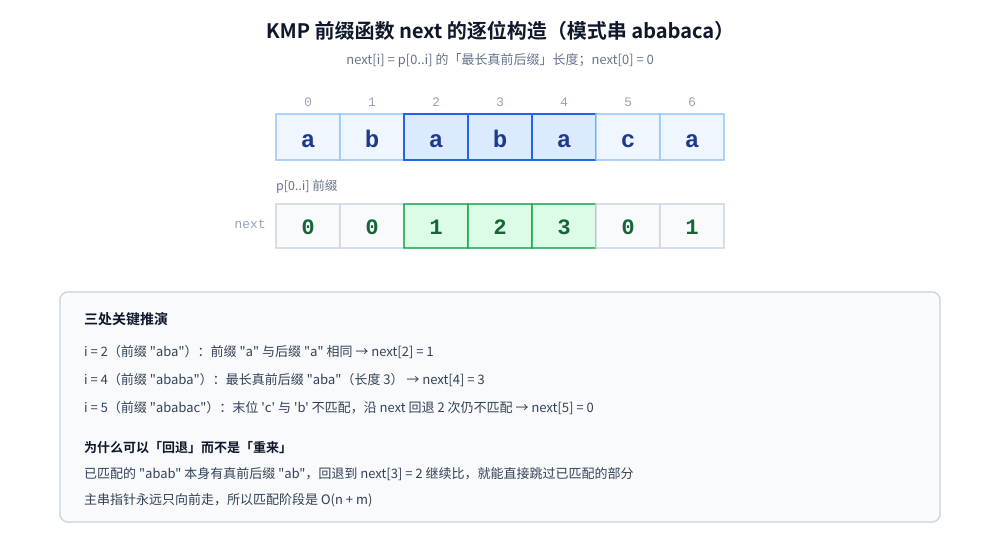
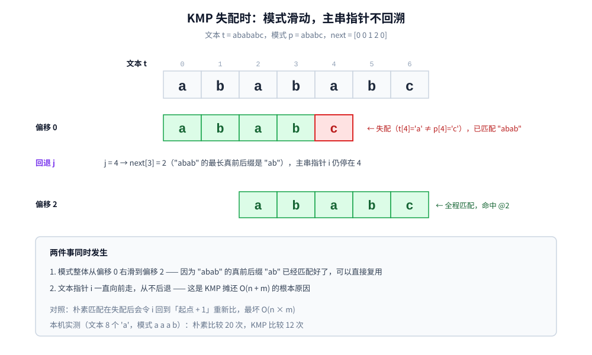

# KMP

> 单模式串匹配的第一个经典解：**前缀函数（next 数组）的定义与逐位构造**、匹配阶段「主串指针永不回溯」的摊还论证，
> 以及一个真正容易踩的坑 —— **`next` 数组在教材与代码里有三种互不兼容的版本**，本篇用实测把三者对齐。
>
> ⭐ 这是「字符串匹配」三篇的第一篇，按 **单模式 → 多模式** 递进：**本篇**（单模式，主串不回退）→
> [BM.md](BM.md)（单模式，从右往左比，实践中往往更快）→ [AC自动机.md](AC自动机.md)（多模式，Trie + fail 指针）。
> ⚠️ **「前缀函数」的完整讲解只在本篇**：AC 自动机的 fail 指针本质是「Trie 上的 KMP」，那边只引用、不重复。
>
> 内容整理自个人学习笔记，素材见 [素材清单](../../../素材清单.md)。字符串键的存储（Trie）见 [常考补充结构.md](../../数据结构/高级数据结构/常考补充结构.md)；
> 复杂度口径与摊还分析见 [复杂度分析.md](../基础算法/复杂度分析.md)。
>
> 📎 本篇所有输出均为本机实跑逐字抄录：**Go 1.26.5（windows/amd64）** 与 **JDK 1.8.0_321** 各实现一份，
> 输出**逐行对齐**（五段实验里只有实验四的耗时行不同）。

---

## 一、朴素匹配到底慢在哪？

**本节要点**：朴素匹配的动作只有一句「每个起点都从头逐位比」。它的代价是 `O(n·m)`，但 ⚠️ **只有在特定输入上才真的慢** —— 这一节把「什么时候慢」说清楚。

### 1.1 算法本体

```go
func naiveMatch(t, p string) (cmp int, hits []int) {
	n, m := len(t), len(p)
	for i := 0; i+m <= n; i++ {
		j := 0
		for j < m {
			cmp++
			if t[i+j] != p[j] {
				break
			}
			j++
		}
		if j == m {
			hits = append(hits, i)
		}
	}
	return cmp, hits
}
```

内层循环每失败一次，外层就把 `i` 推到 `i+1`、`j` 归零 —— **已经比过的字符重新比一遍**。最坏情况下每个起点都比 `m` 次，总共 `(n−m+1)·m ≈ n·m`。

### 1.2 最坏输入长什么样（本机实测）

⚠️ **这一步必须实测，不能想当然**：随机文本上朴素匹配其实一点也不慢 —— 因为绝大多数起点在**第一位就失配**，内层循环只跑 1 次。本机实验五用同一 LCG 生成 200 字符随机文本、模式取文本中间 10 个字符：

```text
  文本(200) = "ddbcdcdccdcbdadacbbacabaddcaaddbdabdabaddabddcddbdadbbaacbbddabdcaabbbadbcacdcbcaadabcdbacabccdaacaadbcdacddaadcbcbdbddbadabcbdcadcbcddbbbbbdcaccabbdbbdcccddabbdbcbdddabaabcbbdcabdadaccbaaaacdcaadbabd"
  模式(10)  = "dbcdacddaa"
  next      = [0 0 0 1 0 0 1 1 0 0]
  朴素：比较 268 次，命中 1 处，位置 [100]
  KMP ：比较 252 次，命中 1 处，位置 [100]
  ⚠️ 随机串上朴素匹配并不慢（多数起点第一位就失配），两者比较次数很接近
```

⭐ 268 次 vs 252 次 —— **朴素匹配在随机数据上几乎不比 KMP 差**。所以要构造最坏输入：**让内层循环每次都差最后一位**。

最省事的构造是：文本 = `n` 个 `'a'`，模式 = `(m−1)` 个 `'a'` 再补一个 `'b'`。这样每个起点都会一路匹配到末尾才发现最后一位对不上：

```text
========== 实验三：最坏输入下的二次 vs 线性（确定性比较次数）==========
  构造：文本 = n 个 'a'，模式 = (m-1) 个 'a' + 一个 'b'（永远只差最后一位）
    n        m       朴素比较        KMP 比较       朴素/KMP
    1000     10      9910           1991           4.98
    2000     20      39620          3981           9.95
    4000     40      158440         7961           19.90
    8000     80      633680         15921          39.80
  ⭐ 朴素比较 ≈ n·m（n 或 m 翻倍都让总比较数成倍上涨）；KMP ≈ n+m（线性）
```

⭐ 读法：`n` 和 `m` 同时翻倍时，**朴素比较数变成 4 倍**（`n·m`），而 **KMP 只变成 2 倍**（`n+m`）。这就是 `O(n·m)` 与 `O(n+m)` 的差别。

---

## 二、前缀函数 next 是怎么定义和构造的？

**本节要点**：`next[i]` 的定义一句话就够，但**逐位推演**才是理解它的唯一办法。这一节把 `ababaca` 的每一步都摊开。

### 2.1 定义

对模式串 `p`，记 `next[i]` 为：

> **子串 `p[0..i]` 的「最长真前后缀」长度**。

其中「真」表示**不能是 `p[0..i]` 自己**。例：`p[0..4] = "ababa"`，它的真前缀有 `a`、`ab`、`aba`、`abab`，真后缀有 `a`、`ba`、`aba`、`baba` —— 两边都出现的最长串是 `aba`，所以 `next[4] = 3`。

⭐ **它换来了什么**：当匹配在模式第 `j` 位失配时，前 `j` 个字符已经和文本对齐且相同；而 `next[j−1]` 告诉我们「这前 `j` 个字符里，**有多长的一段后缀同时也是一段前缀**」。于是**把模式整体右移 `j − next[j−1]` 格**，就能让这段已经匹配好的后缀继续发挥作用，**不用回退主串指针**。

### 2.2 逐位推演（本机实测）



```text
========== 实验一：前缀函数 next 的逐位构造（模式串 "ababaca"）==========
  约定（本篇变体 A）：next[i] = p[0..i] 的「最长真前后缀」长度，next[0] = 0
    i   p[0..i]       回退次数   next[i]   含义
    0   "a"            0          0         无真前后缀
    1   "ab"           0          0         无真前后缀
    2   "aba"          0          1         最长真前后缀 "a"
    3   "abab"         0          2         最长真前后缀 "ab"
    4   "ababa"        0          3         最长真前后缀 "aba"
    5   "ababac"       2          0         无真前后缀
    6   "ababaca"      0          1         最长真前后缀 "a"
  next = [0 0 1 2 3 0 1]
```

三行值得停下来看：

1. **`i = 2` 到 `i = 4` 一路加 1**：因为 `p[0..i]` 和 `p[0..i−1]` 相比只多了一个字符，而它恰好等于「上一步匹配的下一位」。`"a"→"ab"→"aba"→"abab"→"ababa"` 每次都能把 `next` 加 1；
2. **`i = 5` 是唯一的回退点（回退 2 次）**：`p[5] = 'c'`，上一步的 `next[4] = 3` 说明「前缀 `aba`」。拿 `p[5]` 去和 `p[3] = 'b'` 比 —— 不等，于是**顺着 `next` 往前跳**：`next[2] = 1`，再和 `p[1] = 'b'` 比 —— 还是不等，`next[0] = 0`，和 `p[0] = 'a'` 比 —— 仍不等，只能归 0；
3. **`i = 6` 又从 0 加到 1**：`p[6] = 'a' = p[0]`，所以 `next[6] = 1`。

构造代码就是上面这张表的直译：

```go
func prefixFunction(p string) []int {
	n := len(p)
	pi := make([]int, n)
	for i := 1; i < n; i++ {
		j := pi[i-1]        // 从「上一位的最长真前后缀」开始试
		for j > 0 && p[i] != p[j] {
			j = pi[j-1]     // ⚠️ 失配就顺着 next 链往前跳，不是归零重来
		}
		if p[i] == p[j] {
			j++
		}
		pi[i] = j
	}
	return pi
}
```

### 2.3 为什么「顺着 next 跳」不会漏掉答案

设 `p[0..i−1]` 的最长真前后缀长度是 `j`。要判断 `p[0..i]` 的真前后缀，只能看「`p[i]` 是否等于某段前缀的后一位」：

- 若 `p[i] == p[j]`，答案就是 `j+1`（最长的候选直接成立）；
- 若不等，**答案一定 ≤ `j`**。而所有长度 `< j` 的候选前后缀，必然是 `p[0..j−1]` 的某个前后缀 —— 于是问题被归约成「`p[0..j−1]` 的最长真前后缀」，而它**已经算好了**，就是 `next[j−1]`。

⭐ 一句话：**`next` 链（`j → next[j−1] → …`）枚举了「所有可能的前后缀长度」，且从大到小**。所以第一个吻合的就是最优解，不会漏。

---

## 三、⚠️ next 数组为什么有那么多版本？

**本节要点**：这是本篇最值钱的一节。同一份算法，教材和代码里流传着**至少三种下标语义不同**的 `next`。混用的后果是**整体错位一位** —— 不崩、不报错，只是偶尔找不到。

### 3.1 三种变体（本机实测）

```text
  ⭐ 同一模式串的三种常见变体（极易混淆，第三节讲清）：
    变体 A 前缀函数 pi    = [0 0 1 2 3 0 1]      （本篇采用）
    变体 B next 右移补 -1 = [-1 0 0 1 2 3 0]
    变体 C next 右移补 0  = [0 0 0 1 2 3 0]
```

| 变体 | 常见叫法 | `next[0]` | `next[i]` 的语义 | 匹配时的写法 |
|---|---|---|---|---|
| **A** | `prefix function` / `failure function` / `π` | `0` | `p[0..i]` 的最长真前后缀长度 | 失配时 `j = next[j-1]` |
| **B** | 严书 / KMP 原始论文里的 `next` | `-1` | 把 A 整体右移一位，`next[i] = π[i-1]` | 失配时 `j = next[j]` |
| **C** | 部分实现「省掉 -1 哨兵」的版本 | `0` | 同 B，只是首位不补 `-1` 而补 `0` | 失配时 `j = next[j]` |

⭐ **一句话记住三者关系**：**B 和 C 就是 A 右移一格**（丢掉最后一位、首位补哨兵）。所以 `B[1..] == C[1..] == A[0..m−2]`。

### 3.2 怎么一眼认出代码用的是哪种

看**失配那一行的下标**就够了：

```text
j = pi[j-1]     → 变体 A（next[i] 是「到 i 为止」的，所以要看前一位）
j = next[j]     → 变体 B / C（next[i] 已经「错开一位」，直接取当前位）
```

⚠️ **为什么极易混**：三种写法的**匹配阶段主循环长得几乎一样**，只有失配回退那一行的下标不同。如果照着 A 的构造配着 B 的匹配写（或反过来），程序**不会崩** —— 它只是会在某些输入上**少报命中**。⭐ 所以判据只能是「**定义**」而不是「名字」：先问清 `next[i]` 是 `p[0..i]` 的答案还是 `p[0..i−1]` 的答案，再决定失配那一行写 `j-1` 还是 `j`。

---

## 四、匹配阶段：主串指针为什么可以不回溯？

**本节要点**：`next` 造好之后，匹配本身只有几行。核心结论是 **`i` 只增不减** —— 这是 `O(n+m)` 的来源。

### 4.1 算法与逐字符推演（本机实测）



```text
========== 实验二：朴素匹配 vs KMP 的比较次数（最坏小串）==========
  文本 t = "aaaaaaab"（长度 8）   模式 p = "aaab"（长度 4）
  next(p) = [0 1 2 0]
  朴素匹配：比较 20 次，命中 1 处，起始下标 [4]
  KMP    ：比较 12 次，命中 1 处，起始下标 [4]
  ⭐ 同一输入、同一结果；小串上差距不明显，规模效应见实验三、实验四
```

⚠️ **注意 `next("aaab") = [0 1 2 0]` 而不是 `[0 0 0 0]`**：`"aaa"` 的真前后缀是 `"aa"`（长度 2），所以 `next[2] = 2`。正是它让 KMP 在 `t[3]` 失配后**只把 `j` 退回 2**，而不是退到 0 —— 因为「前面那两个 `'a'` 不用再比了」。

匹配的写法（数比较次数版，每次循环只做一次 `t[i]` 与 `p[j]` 的比较）：

```go
func kmpMatch(t, p string, pi []int) (cmp int, hits []int) {
	n, m := len(t), len(p)
	j := 0
	for i := 0; i < n; {
		if t[i] == p[j] {
			cmp++
			i++          // ⭐ 匹配成功，两边一起前进
			j++
			if j == m {
				hits = append(hits, i-m)
				j = pi[j-1]
			}
			continue
		}
		cmp++
		if j == 0 {
			i++          // 模式首位都对不上，主串只能让一步
		} else {
			j = pi[j-1]  // ⭐ i 不动，只回退模式指针
		}
	}
	return cmp, hits
}
```

⭐ 关键在第 13 行的 `else`：**失配时 `i` 完全不动**，只把 `j` 沿 `next` 链往回跳。对照朴素匹配（`i = 起点+1`、`j = 0`），差别就在这里。

### 4.2 O(n+m) 的摊还论证

**构造 `next` 是 `O(m)`**：外层 `i` 从 1 走到 `m−1`（`m−1` 次），内层每次回退都让 `j` 至少减 1；而 `j` 每轮最多加 1 —— 所以**总回退次数 ≤ 总增加次数 ≤ m−1**。内层虽然是 `for`，但整个循环期间一共只跳 `O(m)` 次。

**匹配阶段是 `O(n)`**：同样的论证 —— `i` 单调递增（`≤ n` 次），`j` 每轮最多加 1，而每次失配回退都让 `j` 至少减 1。所以**回退的总次数 ≤ `j` 增加的总次数 ≤ n**。

| 阶段 | 主循环次数 | 回退总次数 | 合计 |
|---|---|---|---|
| 构造 `next` | `m − 1` | `≤ m − 1` | `O(m)` |
| 匹配 | `≤ n` | `≤ n` | `O(n)` |

⭐ **两个阶段合起来 `O(n + m)`，且与「回退了多少格」无关**。这就是「摊还」的含义：单次失配可能回退很多格，但**一辈子也回退不了超过 `n` 格**。

⚠️ **顺带纠正一个常见误解**：`O(n+m)` 说的是**比较次数**，不是「每次都只看一个字符」。KMP 的常数与 `m` 无关，但它**不会**像 BM 那样一次跳很多格（见 [BM.md](BM.md) 第二节，那是另一种加速思路）。

---

## 五、实测：线性到底有多线性？

**本节要点**：比较次数是确定性事实，可以直接断言；**耗时是时序量，只断言单调趋势**。这一节把两者分开列。

### 5.1 比较次数（确定性）

| 输入 | 朴素 | KMP | 朴素/KMP |
|---|---|---|---|
| `n=1000, m=10`（全 a + 末位 b） | 9910 | 1991 | 4.98× |
| `n=2000, m=20` | 39620 | 3981 | 9.95× |
| `n=4000, m=40` | 158440 | 7961 | 19.90× |
| `n=8000, m=80` | 633680 | 15921 | 39.80× |

⭐ 比例每次翻倍 —— 因为 `n`、`m` 同时翻倍时朴素比较数按 `4×` 涨、KMP 按 `2×` 涨。**这一列数字是确定性计数，可精确复现。**

### 5.2 耗时（时序，多轮累加）

⚠️ 本机 `time.Now()` 分辨率约 1ms，**不能取多次最小值**（会系统性取到 0）。所以固定 `m=1000`、只增文本长度，每种规模**重复 200 次累加**（每种都超过 100ms），再取平均：

```text
========== 实验四：KMP 线性计时（固定 m=1000，只增 n；每规模重复累加）==========
    n            重复次数   总耗时 ms      平均 us/次     归一化
    250000        200        588.81         2944.0         1.00
    500000        200        1181.56        5907.8         2.01
    1000000       200        2576.96        12884.8        4.38
    2000000       200        5300.18        26500.9        9.00
  ⭐ 文本长度翻倍 → 平均耗时翻倍（线性），与 m 的乘积无关
```

同一份程序连跑 3 次的波动范围：

| 文本长度 | Go 平均 us/次（3 次范围） | Java 平均 us/次（3 次范围） |
|---|---|---|
| 250000 | 2944.0 ~ 3711.2 | 5572.8 ~ 7384.6 |
| 500000 | 5907.8 ~ 7960.5 | 12167.8 ~ 12423.6 |
| 1000000 | 12884.8 ~ 18180.0 | 23096.0 ~ 26112.3 |
| 2000000 | 25038.6 ~ 34141.8 | 45878.9 ~ 50106.1 |

⭐ **只断言两条**：① 每一档都**严格递增**；② 大致是**翻倍关系**（Go 最好的一轮是 1.00 / 2.01 / 4.38 / 9.00，接近 2 的幂）。⚠️ 本机同时跑着其它任务，波动不小，**具体毫秒数不该当成结论**，趋势才是。

---

## 使用：KMP 在你写的代码里以什么形式出现

KMP 很少被直接调用（标准库的长模式匹配通常用更快或更简单的算法），但它有**三个绕不开的出场位置**。

**第一层：流式匹配 —— 主串不能回退时它是唯一选项**。这是 KMP「`i` 只增不减」最实际的收益。当日志、socket、管道里的数据**边到边匹配**、已经消费掉的字节无法重读时，任何需要回退主串的算法都做不了。⚠️ 判据很干脆：**只要你能对着一个完整的 `[]byte` 反复取下标，KMP 就不是必需的；一旦数据源是流，它就是少数可行解之一**。

**第二层：它是 AC 自动机的零件**。多模式匹配（敏感词过滤、关键词命中）用的 AC 自动机，fail 指针的定义与构造逻辑**就是「在 Trie 上做 KMP 的前缀函数」** —— 见 [AC自动机.md](AC自动机.md) 第二节。所以理解本篇的 `next` 链，是看懂 fail 指针的前提。

**第三层：库函数里为什么反而少见它**。Go 1.26.5 的 `strings.Index` 走的是 **`IndexByte` 找首字符 + 朴素比较**，只有当「误报太多」时才退化为 **Rabin-Karp**（源码见 `src/internal/stringslite/strings.go` 的 `Index` 与里面的 `IndexRabinKarp` 分支）—— 全程没有 KMP。而 BM 及其简化版更多出现在**工具类实现**里（编辑器查找、`grep` 系，见 [BM.md](BM.md) 的「使用」一节）。原因也在那里：**BM 在坏字符规则下一次能跳很多格，实测比较次数往往低于 KMP**。⭐ 所以「学 KMP」的价值不在「到处用它」，而在它是**字符串匹配这一族算法的概念原点** —— 前缀函数、失配回退、摊还分析，这三个概念在后面两篇里都会再出现。

---

## 延伸追问

- **`next[i]` 到底定义在 `p[0..i]` 还是 `p[0..i−1]` 上？** → **看代码失配那一行**：写 `j = next[j-1]` 的是「到 `i` 为止」（变体 A），写 `j = next[j]` 的是「右移一位」（变体 B/C）。⚠️ 两者都自洽，但混写会静默少报命中（第三节）。
- **为什么构造 `next` 时失配要「顺着链跳」而不是归零？** → 因为所有更短的候选前后缀，必然落在 `next[j−1]` 里。归零会退化成 `O(m²)`，而顺着跳的总跳数被摊还到 `O(m)`（2.3、4.2）。
- **`next("aaab")` 为什么是 `[0 1 2 0]` 而不是全 0？** → `"aaa"` 的真前后缀是 `"aa"`，长度 2。⚠️ 这直接决定了 KMP 在连续相同字符上的回退深度 —— 也是它和 BM 在「全 a」类输入上表现不同的根源。
- **KMP 一定比朴素快吗？** → **不一定**。本机实测（实验五）：随机文本上朴素 268 次、KMP 252 次，几乎持平 —— 因为随机数据里绝大多数起点第一位就失配。⭐ KMP 保证的是**最坏情况** `O(n+m)`，收益只在被刻意构造的最坏输入上才显现（实验三）。
- **KMP 和 BM 谁快？** → **看字母表与输入**，不绝对。KMP 的优势是**主串不回退**（流式场景必需）；BM 的优势是**一次能跳很多格**（大字母表随机文本上比较次数常低一个量级）。本机对照见 [BM.md](BM.md) 实验二。
- **`O(n+m)` 里的 `m` 会不会被忽略掉？** → 当 `n ≫ m` 时可以近似成 `O(n)`，但**构造 `next` 那一步是实打实的 `O(m)`**，模式很短时它是常数级开销，模式很长时不能省。⚠️ 也正是这一步让 KMP 不像「一次扫描」那么简单。
- **KMP 能处理多模式吗？** → **能，但要重复 `k` 次**（每个模式各扫一遍文本），总代价 `O(k·(n+m))`。多模式的正解是把「`k` 次扫描」压成「一次扫描」的 [AC自动机.md](AC自动机.md)，本机实测 8 个模式上 AC 合计工作量约为逐模式 KMP 的 1/3。

## 关联

- [BM.md](BM.md) — 三篇之二：**从右往左比**、坏字符 + 好后缀；同样是最坏输入下的比较次数对照
- [AC自动机.md](AC自动机.md) — 三篇之三：**多模式**匹配；fail 指针就是「Trie 上的前缀函数」，本篇第二节是它的前置
- [常考补充结构.md](../../数据结构/高级数据结构/常考补充结构.md) — 字符串键的组织方式（Trie / 基数树）；AC 自动机的 Trie 部分复用那里的讲解
- [复杂度分析.md](../基础算法/复杂度分析.md) — `O(n+m)` 的**摊还**口径：单次回退可以很多，一辈子摊下来是常数
- [压缩算法.md](../压缩算法.md) — LZ 系列要找「重复出现的子串」，与字符串匹配是同一族问题
- [霍夫曼编码.md](../贪心/霍夫曼编码.md) — 另一篇带完整摊还 / 正确性论证的样板；它的 `seq` tiebreak 与本篇「变体混用会静默出错」是同一类可复现性教训
- [索引原理.md](../../../03-数据与中间件/数据存储/搜索与分析/Elasticsearch/索引原理.md) — 「使用」一节的对照：全文检索的词典走的是 **FST** 而非 KMP，因为查询是「词项定位」不是「模式匹配」
> 反向引用（本篇被下列文档引到）：[单调栈与单调队列.md](../../数据结构/高级数据结构/单调栈与单调队列.md)、[双指针.md](../基础算法/双指针.md)、[排序算法.md](../基础算法/排序算法.md)、[滑动窗口.md](../基础算法/滑动窗口.md)
