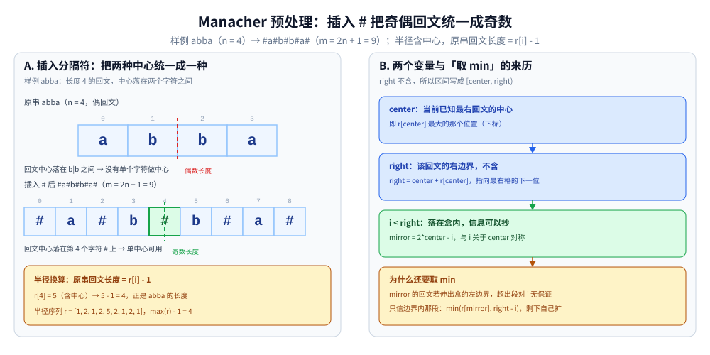
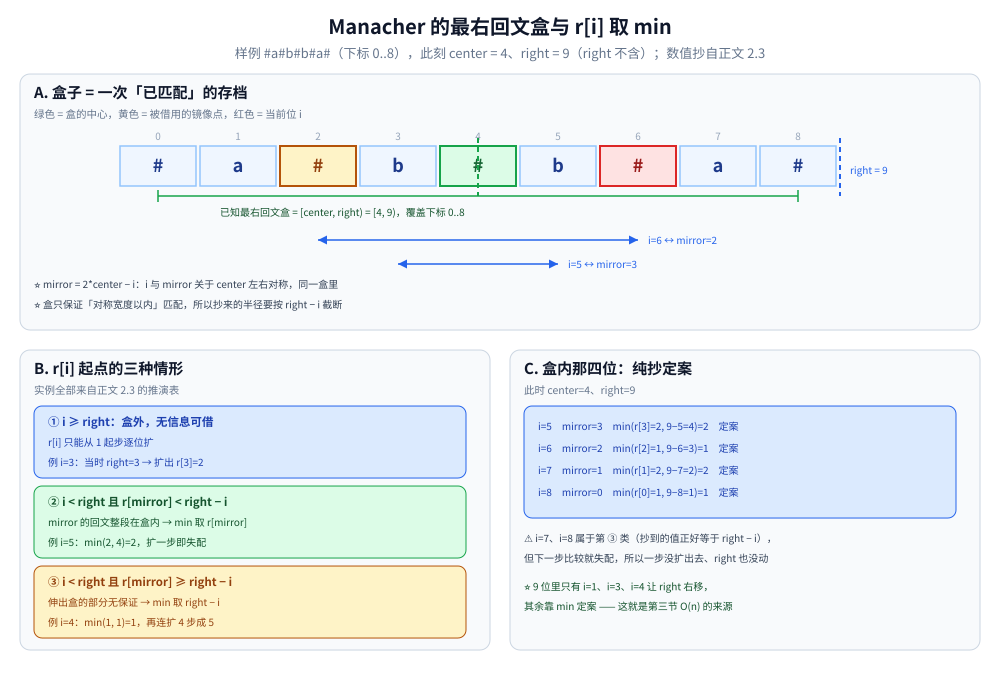
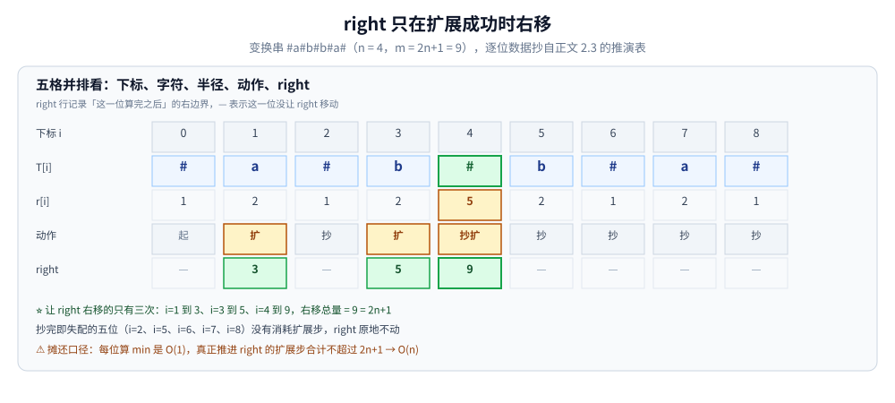

# Manacher

> 求最长回文子串的 **O(n)** 解法：利用回文的对称性，避免中心扩展的重复计算。
>
> ⭐ 边界先说清：本篇只讲 Manacher 算法本身。
> 回文的常见变体（分割、判定、DP 解法）见动态规划目录（导读 [README.md](../动态规划/README.md)）。
> 字符串哈希也能做回文判定，见 [字符串哈希.md](字符串哈希.md)。
>
> 内容整理自个人学习笔记，素材见 [素材清单](../../../素材清单.md)。复杂度口径见 [复杂度分析.md](../基础算法/复杂度分析.md)。

---

## 一、中心扩展的瓶颈

**本节要点**：中心扩展法最坏 O(n²)，慢在「不同中心的扩展信息没有被复用」—— Manacher 的全部功夫就是把这些信息存下来重复利用。

- 以每个字符为中心，向两侧扩展，最坏 O(n²)
- 例如 `aaaaaaa`：每个中心都要扩展到底
- **瓶颈**：不同中心的扩展信息没有被复用

⭐ 突破口：一个大回文**内部**的中心，其回文半径可以先按「关于大回文中心对称」抄一份现成的，再补少量扩展 —— 和 [KMP.md](KMP.md) 里「已匹配信息不白丢」是同一个直觉。

---

## 二、Manacher 的两步

**本节要点**：第一步插分隔符把奇偶统一成奇；第二步维护「最右回文」的 `center / right`，对新位置先用对称点`mirror`的半径做起点，再局部扩展。

### 2.1 预处理：插入分隔符

- 原串 `abba` → 处理后 `#a#b#b#a#`
- 好处：**奇偶长度回文统一为奇数长度**，不用分类讨论
- 本文约定半径 `r[i]` = 变换串中以 `i` 为中心、**含中心在内**单侧的长度，则原串回文长度 = `r[i] - 1`



左栏把原串 `abba`（n = 4）与变换串 `#a#b#b#a#`（m = 2n+1 = 9）上下对齐画出来：偶回文的中心原本落在 `b|b` **之间**、没有字符可用，插 `#` 之后中心正好落到第 4 个字符 `#` 上。右栏给出半径换算 `r[4] = 5 → 原串回文长 = 5 − 1 = 4`，以及两个变量的定义 —— `center` 是「当前已知最右回文」的下标、`right = center + r[center]` **不含**右端点，所以区间写作 `[center, right)`；半径序列 `r = [1, 2, 1, 2, 5, 2, 1, 2, 1]` 与 2.3 的手推表是同一条串的同一份数据。

### 2.2 利用对称性

维护两个变量：

- `center`：当前已知最右回文的中心
- `right`：该回文的右边界（**不含**，即 `center + r[center]`）

对每个新位置 `i`：

- 若 `i < right`：可利用对称点 `mirror = 2*center - i` 的半径，初值 `r[i] = min(r[mirror], right - i)`
- 否则从 1 开始（只有中心自己）扩展
- 扩展后若 `i + r[i] > right`，更新 `center = i`、`right = i + r[i]`

⭐ 取 `min` 的原因：`mirror` 的半径可能**伸出大回文的左边界**，超出部分对 `i` 不再有任何保证，只能先信「边界内的部分」，剩下的交给逐位扩展。



A 栏画的是 `center = 4`、`right = 9` 这一刻：绿色格是盒的中心，盒 `[center, right) = [4, 9)` 覆盖下标 0..8；红色格是当前位 `i = 6`，黄色格是它的镜像 `mirror = 2*center − i = 2`，两格到中心 `4` 的距离都是 2。B 栏把起点分三种：**① `i ≥ right`（盒外）只能从 1 起步自己扩**（正文 2.3 的 `i=3`）；**② `i < right` 且 `r[mirror] < right − i`（镜像的回文整段在盒内）直接定案**（`i=5`：`min(2, 4)=2`）；**③ `i < right` 且 `r[mirror] ≥ right − i`（伸出盒外）只抄到 `right − i`，剩余自己扩**（`i=4`：`min(1, 1)=1` 再连扩 4 步）。C 栏把 `i=5..8` 四位的 `min` 逐项算出来，这四位一步都没扩出去。

### 2.3 手推：`abba` 的半径表与对称复用

`#a#b#b#a#`（下标 0..8）逐位算 `r`，「抄」= 直接取 `r[mirror]` 且扩展一步未成，「扩」= 真正做了扩展：

```text
i   T[i]  r[i]  动作
0   #     1     起点，只有中心自己
1   a     2     扩 1 步（#a#）→ center=1, right=3
2   #     1     抄 mirror=0 → min(1, 1)=1，扩展即失配（a≠b）
3   b     2     i=3 不进区间（right=3），直接扩：#b# 成立，遇 a≠b 停 → center=3, right=5
4   #     5     抄 mirror=2 → 1，再连扩 4 步（b,#,a,#）→ center=4, right=9，"abba"
5   b     2     抄 mirror=3 → min(2, 9−5)=2，无法再扩（b≠a）
6   #     1     抄 mirror=2 → min(1, 3)=1，无法再扩
7   a     2     抄 mirror=1 → min(2, 2)=2，无法再扩
8   #     1     抄 mirror=0 → min(1, 1)=1，无法再扩

半径序列 r = [1, 2, 1, 2, 5, 2, 1, 2, 1]
原串长度   = r − 1 = [0, 1, 0, 1, 4, 1, 0, 1, 0]  →  最长回文 "abba"，长度 4 ✓
```

⭐ 9 个位置里 i=4 之后有 4 个纯靠 `mirror` 定案、一步都没扩出去 —— 这正是第三节线性复杂度的来源。

---

## 三、复杂度分析

**本节要点**：`right` 单调右移、最远到 2n+1，所以「真正做扩展」的总次数是 O(n)；抄半径的 `min` 那步每位置 O(1)。

- 每次扩展都会让 `right` 右移，`right` 最多到 2n+1（变换串长度 m = 2n+1，`right` 不含端点）
- 总扩展次数 O(n)
- 总时间 O(n)



把 2.3 的手推表摊成五行：下标、字符、`r[i]`、动作、`right`。黄色格标「扩」/「抄扩」、蓝色格标「抄」，绿色格才是 `right` 真的动了的那些位 —— 整趟只有 **i=1（→3）、i=3（→5）、i=4（→9）三次右移**，右移总量 9 = 2n+1（n = 4）。抄完即失配的五位（i=2、i=5、i=6、i=7、i=8）一位都没有把 `right` 往前推，所以「比较一次」的开销每位置 O(1)、真正推进边界的扩展步合计不超过 2n+1 —— 这正是线性复杂度的全部来源。

| 算法 | 时间 | 空间 |
|---|---|---|
| 暴力中心扩展 | O(n²) | O(1) |
| **Manacher** | **O(n)** | O(n) |
| 字符串哈希 + 二分 | O(n log n) | O(n) |
| DP | O(n²) | O(n²) |

---

## 四、典型应用

**本节要点**：半径表 `r[]` 本身就是「每个中心的最大回文」的完整答案，最长回文、回文计数、补串成回文都是一遍扫描的读取问题。

- 最长回文子串
- 回文子串个数
- 最短回文串（在头部补最少的字符）
- 分割回文串（配合 DP，DP 解法见 [区间DP.md](../动态规划/区间DP.md)）

---

## 延伸追问

- **Manacher 为什么要插入分隔符？** → 统一奇偶回文，避免分类讨论。
- **`r[mirror]` 一定能直接用吗？** → 不一定。要取 `min(r[mirror], right-i)`，因为超出右边界的部分无法保证（2.3 的 i=4、i=5 两行分别演示了「只抄到 1、还要扩」与「抄到 2、直接定案」）。
- **Manacher 能求所有回文子串吗？** → 能。`r[i]` 就是每个中心的半径，可以推出所有回文子串。但**去重后的本质不同回文**、每个回文的出现次数这类统计，用回文自动机更顺手，见 [回文自动机.md](回文自动机.md)。
- **Manacher 和字符串哈希怎么选？** → 只求最长回文 → Manacher；还要判子串相等 → [字符串哈希.md](字符串哈希.md)。
- **不插分隔符能写 Manacher 吗？** → 能，奇数长度与偶数长度各跑一遍半径表，但每个位置要分两类讨论；插 `#` 的代价是把长度放大到 `2n+1`，换来「只有一套下标、只维护一个 `right`」。
- **`r[i] - 1` 为什么正好是原串的回文长度？** → 以 `i` 为中心、半径 `r[i]`（含中心）的区间一共 `2*r[i] - 1` 格，两端都是 `#`，配比固定是「`r[i]` 个分隔符 + `r[i] - 1` 个原串字符」—— `i` 落在字符上（奇回文）与落在 `#` 上（偶回文）都是这一配比，所以原串长度恒为 `r[i] - 1`（2.1 的 `r[4] = 5 → 4` 走的是偶回文那一支）。

---

## 关联

- [字符串哈希.md](字符串哈希.md) — 回文判定的另一条路
- [回文自动机.md](回文自动机.md) — 需要「所有本质不同回文 + 出现次数」时的工具
- [KMP.md](KMP.md) — 「已匹配信息不白丢」的另一种实现（前缀函数）
- [区间DP.md](../动态规划/区间DP.md) — 回文分割 / 回文子串计数的 DP 解法
- [Z算法.md](Z算法.md) — 同一手法的另一种实现：它维护的是「最右匹配区间 `[l, r]`」，同样先抄对称位置的旧答案再补扩展
- [README.md](README.md) — 字符串匹配导读
